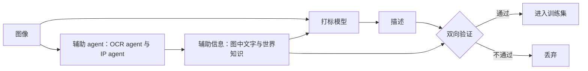
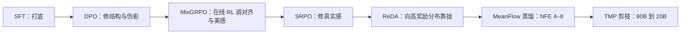

# HunyuanImage 3.0：让一个会说话的模型学会画画，而不忘掉怎么说话

<!-- release-date: 2025-09-28 -->

> 本文依据腾讯混元基础模型团队的 **HunyuanImage 3.0 Technical Report**，arXiv:2509.23951v3，2026-06-26，共 17 页。页码均指 PDF 自身页码。文中始终区分三件事：**报告写了什么**、**我们如何解释**、**哪些是外部补充**。从图上读出来的数、本文自己算出来的数，都会明说。

## 读之前：这一篇需要的几个词

- **自回归（autoregressive）与 next-token 预测**：语言模型的工作方式。每次只预测下一个符号，预测完接到序列后面再预测下一个。它天生**串行**，也天生**离散**：输出是从词表里挑一项。
- **扩散模型（diffusion model）与流匹配（flow matching）**：另一类生成模型。从纯噪声出发反复去噪，每次把整张图往数据方向推一点。流匹配是它的一种训练写法，网络每一步输出一个**速度（velocity）**。它**并行**（整张图一起改）也**连续**（输出是一组实数）。
- **VAE 与潜变量（latent）**：先用一个自编码器把图压成小得多的张量，再在上面做扩散。压缩倍数叫**下采样因子**，通道数叫**潜空间维度**。
- **DiT（Diffusion Transformer）**：把潜变量切成小块（patch）摊成序列，用 Transformer 去噪。今天多数文生图模型是 DiT。
- **MoE（Mixture-of-Experts，混合专家）**：把前馈层拆成很多个专家，每个 Token 只走其中几个。总参数很大，单个 Token 的计算量只对应被激活的那几个。
- **RoPE（Rotary Position Embedding，旋转位置编码）**：把 Token 的位置编成一组正弦余弦，旋进注意力的 query 和 key。语言模型用一维版本，位置就是一个整数 $n$。

## 一句话先说清

常见的文生图模型是这样搭的：一个冻住的文本编码器（T5 或 CLIP）把提示词编成向量，交给一个从零训练的 DiT 去画。文字和图像之间隔着一道墙，墙这边负责读懂，墙那边负责画。

HunyuanImage 3.0 把这道墙拆了。它不训练一个「会读字的画图模型」，而是**拿一个已经练好的 MoE 语言模型 Hunyuan-A13B，教它画画**（PDF p. 1）。文字和图像走同一条序列、同一套权重、同一个注意力。总参数超过 80B，每个 Token 激活约 13B（PDF p. 1、p. 6）。

这个决定立刻制造出一串不兼容：

| 维度 | 文字要什么 | 图像要什么 |
|---|---|---|
| 预测方式 | 离散，next-token | 连续，扩散去噪 |
| 注意力 | 因果，只看前面 | 全注意力，互相都看 |
| 位置 | 一维 | 二维 |
| 画布 | 没有这个概念 | 开画前必须定尺寸和长宽比 |

第 3 节几乎每一小节都在解一行。每个解法都守着同一条底线：

> **序列里没有图像时，所有新机制都要退化回原来的语言模型。**

2D RoPE 在没有图像时逐项等于 1D RoPE（PDF p. 8）；广义因果注意力在没有图像时就是普通因果注意力（PDF p. 6–7）；画布尺寸不是外部参数，而是词表里新加的几个 Token（PDF p. 8）。报告只在 RoPE 那一小节明说了这条原则，原话是保持与预训练 LLM 的「backward compatibility」（PDF p. 8）；其余几处是本文归纳的。

如果只记一句话：

> **给大模型加一个新模态，最省的办法不是接一个新模块，而是把新模态设计成旧能力的一个特例。**

## 先看全景：一个主干，三种运行模式


三条路走的是同一份权重。报告里「原生多模态（native multimodal）」的确切含义就在这里：不是几个模型拼起来，而是一个模型的三种运行模式。

图上没画的几件事（PDF p. 5–6）：

- 文字位置走自回归 next-token 预测，图像位置走基于扩散的预测框架，报告叫它**离散—连续混合建模**（hybrid discrete-continuous modeling）。做法明说是沿用 Transfusion 与 JanusFlow 把扩散并进 LLM 的方式（PDF p. 1）；
- 扩散需要知道当前是第几步去噪，而语言模型的序列里没有这个概念，所以**时间步嵌入被直接放进序列**（PDF p. 6）；
- 文本分词器沿用 Hunyuan Tokenizer，只是**扩了一批特殊 Token**，后面的「自动分辨率」就靠它们（PDF p. 6）。

报告**没有写出任何损失函数**，也没写文本损失与扩散损失怎么加权。扩散一侧只引用了流匹配论文（PDF p. 5 引 [7]），图上标的是 velocity。

## 报告地图：17 页里各写了什么

| 章节 | PDF 页 | 内容 | 密度 |
|---|---|---|---|
| 摘要、引言 | p. 1–3 | 定位、基座选型、与 Transfusion / JanusFlow 的关系；p. 2 是整页样图 | 中 |
| §2.1 数据过滤 | p. 3–4 | 三级漏斗，100 亿到 50 亿；图像对与视频挖掘 | 高 |
| §2.2 打标 | p. 4–5 | 分层 schema、组合式合成、两个 agent 与双向验证（Figure 2） | 高 |
| §2.3 推理数据 | p. 5 | T2T、T2TI、TI2TI 三类思维链数据 | 中 |
| §3.1 架构 | p. 5–8 | 主干、双编码器、广义因果注意力（Figure 4）、广义 2D RoPE（Figure 5）、自动分辨率 | 高 |
| §4.1 预训练 | p. 8–9 | 四阶段渐进（Table 1）与指令微调 | 中 |
| §4.2–4.4 后训练、蒸馏、剪枝 | p. 9–10 | SFT → DPO → MixGRPO → SRPO → ReDA；MeanFlow 蒸馏；TMP 剪枝 | 低，几乎只有名字 |
| §5 评测 | p. 10–12 | 自建 SSAE（Figure 6）、人工 GSB（Figure 7）、专家激活分析（Figure 8） | 中 |
| §6 结论 | p. 12–13 | 本次只放出文生图 | 低 |

篇幅本身是信息：**数据与架构写得细，训练与后训练基本只报菜名，infra 一字未写**。摘要把「支撑大规模训练与推理的高效 infrastructure」列为关键组件之一（PDF p. 1），正文再没出现过。

## 核心设计一：离散与连续放进同一条序列

### 旧问题

自回归一次吐一个离散符号，用交叉熵训练；扩散一次更新一整块连续张量，用回归目标训练。放进一个 Transformer，困难是**同一层网络的输出要被两种完全不同的头和损失使用**。

### 新设计

序列里每个位置带着自己的身份：文字位置的隐状态过文本头，图像位置的隐状态过速度头。两种位置在同一次前向里被同一批权重处理，只是出口不同（PDF p. 5–6）。

### 收益与代价

收益：语言模型学到的世界知识不经过任何压缩瓶颈，直接作用在画图上；「对话里反复改图」这类交错交互天然成立，不用在两个模型之间传状态（PDF p. 6）。

代价：生成一张图要让整个 80B MoE 跑多步去噪，比一个专用 DiT 贵得多。这也是后面必须做蒸馏和剪枝的原因。

### 可迁移启发

给已有模型加一个异质模态时，先问：新模态的输出能不能做成**多一个头**，而不是**多一座塔**。共享塔、分头出口，是代价最低的一种加法。

## 核心设计二：两个编码器，但不按任务分岔

条件图（Cond Image，作为输入参考的图）进模型时同时走两条路，特征**拼接**在一起（PDF p. 6）：

| 编码器 | 提供什么 | 投影器 |
|---|---|---|
| 自研 VAE | 低层、可重建的像素信息；32 维潜空间，16 倍下采样 | 时间步调制的残差块 |
| 预训练视觉编码器（ViT） | 高层语义 | 两层 MLP |

**旧做法**是按任务切开：理解用视觉编码器特征，生成用 VAE 特征。报告点名的前作里就有 Janus-Pro（PDF p. 6 引 [34]，p. 17）。本站 Janus-Pro 一篇讲的正是这条「看图和画图不共用一只眼睛」的路线。

**HunyuanImage 3.0 的选择**：承认要两个编码器，但拒绝按任务分岔。两路特征任何时候都同时在场，理由是这样才能在一段连续上下文里做「文字对话、生成、理解、编辑」的交错交互，不用在两条流水线之间切换（PDF p. 6）。

两个投影器不对称。**本文的解释**：VAE 那一路参与扩散，作用随去噪进度变化，所以投影做成时间步的函数；ViT 特征提供与去噪进度无关的语义，静态映射就够。报告只描述了结构，没解释。

报告**没有做消融**来证明拼接优于分岔，也没说视觉编码器是哪一个，只知道它是预训练的、输入锚点固定在 512px（PDF p. 1、p. 9）。官方权重的配置文件写的是 SigLIP2 so400m（外部补充，见文末）。

### 16 倍 VAE：一笔容易算错的账

报告说旧做法是「8 倍 VAE + 一层 2 倍 patchify」，而单个 16 倍 VAE「更简单、更有效」，生成质量更好（PDF p. 6）。

先算账：$8 \times 2 = 16$。以 1024×1024 为例，两条路线进 Transformer 的都是 $64 \times 64 = 4096$ 个 Token（本文计算）。**这一刀不省算力。**

差别在于这 16 倍由谁完成。**本文的解释**：8 倍 VAE + patchify 里，最后那 2 倍是 Transformer 入口的一个线性层做的，它没有重建约束；单个 16 倍 VAE 的全部压缩都受重建损失约束，必须保证压完还能解回原图。配上 32 维的通道，等于把信息从空间轴挪到通道轴。

「生成质量更好」背后**没有对比数字**，VAE 的架构、损失、重建指标也都没给。这是一句作者观察，读的时候要打折。

## 核心设计三：广义因果注意力，以及那个「洞」

### 旧问题

因果注意力是 LLM 的地基：第 $i$ 个 Token 只能看前面。它保证训练时并行算出的每个位置，与推理时逐个生成的位置看到的东西一样。

图像不吃这一套。左上角和右下角必须互相看得见，模型才能建立全局构图，所以 DiT 用全注意力（PDF p. 6）。一条序列里既有必须「只看前面」的文字，又有必须「互相都看」的图像。

### 新设计


规则只有两条（PDF p. 6–7）：文字 Token 只看它之前的多模态 Token；图像 Token 看它之前的全部 Token，**外加同一图像片段内排在它后面的图像 Token**。一句话：**片段之间守因果，片段内部全互看**。没有图像时第二条规则失效，退化成普通因果注意力。

训练掩码按序列里「待生成图像」（Gen Image，即正在被去噪的带噪图）的个数分两类（PDF p. 7）：

- **至多一张 Gen Image**：理解任务（没有 Gen Image）和文生图（恰好一张），掩码严格按上面两条规则；
- **多张 Gen Image**：需要一处修正，上下文里出现过的 Gen Image **不能被后面的 Token 看到**。报告把这块被挖掉的区域叫下三角里的一个「hole」。

为什么要挖洞？报告的理由是和推理对齐：推理时序列里同一时刻至多一张 Gen Image，一张图一旦生成完毕，就以条件图的身份供后文参考（PDF p. 7）。**本文的补充解释**：训练时的 Gen Image 是带噪的，让后文去看一张带噪的图，学到的条件分布就和推理时看到的干净图对不上。挖洞之后，后文只能通过它以 Cond Image 身份重新出现的干净版本来了解它。

### 配套补丁：位置平移

多 Gen Image 的训练序列里，每张 Gen Image 之后的 Token 在训练与推理中的位置编号不同。报告的处理是把这些 Token 的位置整体平移，让两边对齐（PDF p. 8）。补丁很小，但说明作者核对的是训练—推理一致性，不只是掩码形状。

### 代价与边界

- 掩码不再是标准下三角，用不了因果注意力的现成快路径。报告没提注意力算子怎么实现；
- 没有实验证明「挖洞」确实消除了训练—推理差距；
- 这套规则一次训练就能吃下任意结构的交错序列，直接支撑了 §2.1 里那批超过 1 亿的图像对与多图样本（PDF p. 3）。

### 可迁移启发

一条序列里混两种时序语义时，先定义**因果的粒度**。这里的答案是「片段级因果、片段内无序」。粒度定死，掩码就能一条规则写完。

## 核心设计四：广义 2D RoPE，把一维写成二维的特例

### 旧问题

图像 Token 有二维坐标 $(x, y)$。DiT 常见的 2D RoPE 把嵌入维度劈成两半，一半编 $x$、一半编 $y$。直接装到预训练 LLM 上，文字 Token 的位置编码也跟着变形，模型学到的位置感知会被打乱。

### 新设计

报告采用苏剑林提出的**广义 2D RoPE**（PDF p. 8，脚注 2）。先看一维的写法，$\theta_0, \theta_1, \dots$ 是一组固定频率：

$$
\mathrm{RoPE}(n) = [\cos(n\theta_0),\ \cos(n\theta_1),\ \dots,\ \sin(n\theta_0),\ \sin(n\theta_1),\ \dots]
$$

二维版不劈维度，而是换一种读法，让相邻频率轮流配给 $x$ 和 $y$：

$$
\mathrm{RoPE2D}(x, y) = [\cos(x\theta_0),\ \cos(y\theta_1),\ \dots,\ \sin(x\theta_0),\ \sin(y\theta_1),\ \dots]
$$

关键性质：**令 $x = y = n$，第二个式子逐项等于第一个。** 一维位置 $n$ 就是平面对角线上的点 $(n, n)$。文字 Token 走对角线，数值和原 LLM 完全一样，不是近似，是恒等（PDF p. 8）。


图像 Token 由一维重排成二维，放在两段文字中间（PDF p. 7 图注）。图后的文字接着在对角线上走，编号不受图像打扰。

### 收益

报告的原话是「minimizing disruptive effects on pre-trained linguistic capabilities」（PDF p. 8）。对一个已经练好的语言基座，这是最值钱的一件事。

### 代价与边界

- **没有消融**。「退化成 1D RoPE 保住了语言能力」很可信，但没有拿普通 2D RoPE 做对照量化它值多少；
- $x$ 和 $y$ 用的是不同的频率子集，两个轴的位置分辨率不完全对称，报告没讨论；
- 图像块会占掉一段位置编号，多图序列会很快把位置推远，报告没讨论上下文预算。

### 可迁移启发

这是全篇最值得抄的一条：**扩展旧机制时，把旧机制设计成新机制的特例，而不是新机制的一个分支。** 判据很好用：写完新公式，代入退化条件，看能不能逐项还原成旧公式。

## 核心设计五：让模型自己决定画多大

**旧问题**：DiT 的输入是一块固定形状的噪声张量，所以尺寸和长宽比必须由用户事先给定（PDF p. 8）。用户说「竖版海报」，中间得有一层规则把它翻译成具体像素。

**新设计**：给词表加两组特殊 Token（PDF p. 8）：

- 尺寸锚点：`<img_size_256>`、`<img_size_512>`、`<img_size_768>` ……
- 长宽比：`<img_ratio_0>` 到 `<img_ratio_32>`，覆盖 1:4 到 4:1。

训练时模型学会把这两个 Token 和上下文（提示词、条件图、先前对话）对应起来；推理时**先预测出尺寸和比例 Token**，再按它们给图像 Token 分配 2D RoPE 坐标、开始去噪。用户也可以在提示词里写「3:4」或「vertical」来引导（PDF p. 8）。训练时保留图像原始长宽比，以支持多分辨率生成（PDF p. 8）。

一次文生图在序列上大致是这个样子（示意，不是语料原文；报告没给完整模板，思考文本与尺寸 Token 的先后也没写明）：

```text
[提示词 Token …] [可选：思考文本 Token …] <img_size_1024> <img_ratio_k> [时间步] [图像 Token × 高 × 宽]
                                           └──── 自回归预测 ────┘              └── 按预测的形状摆 2D 位置，扩散去噪 ──┘
```

**为什么重要**：分辨率从一个外部超参数变成了模型内部的一次预测，而做这次预测的，正是读懂了整段提示词的语言模型。

**代价**：尺寸是离散锚点；`<img_size_*>` 一共几档报告没说，只给了三个例子加省略号；多了一次可能出错的预测，而且错在去噪开始之前，无法在去噪中纠正。比例 Token 的预测准确率也没报告。

**可迁移启发**：**能被自然语言描述的配置项，就应该让语言模型来预测，而不是留在 API 参数里。**

## 数据：从 100 亿张到 50 亿张

三级漏斗（PDF p. 3）：

| 阶段 | 做什么 |
|---|---|
| 一级：技术缺陷 | 剔除分辨率低于 512 像素、文件损坏、过曝欠曝、过饱和；按 MD5 去重 |
| 二级：主过滤 | 客观检测器：水印、logo、大段文字（hy-OCR 模型）、拼贴、明显边框、AI 生成内容；主观打分：清晰度模型、美学模型 |
| 三级：语义去重与补充 | 按 embedding 聚类再去重，去掉约 0.5%；补充知识增强、文字相关、风格化、平面设计四类专门数据 |
| 合计 | 超过 100 亿张原图，保留不到 45%，最终接近 50 亿张 |

值得单独记的三点：

- **AI 生成图过滤是两层的**：自动检测模型之外，还把 AI 生成内容占比高的数据源**整体剔除**（PDF p. 3）。检测器总有漏网，直接砍可疑来源更彻底；
- **美学标准由画师设计**，只看三个基本要素：色彩、光影、构图，再据此训自己的美学模型（PDF p. 3）；
- **阈值分档**：统一阈值先滤掉不合格的，再对特定门类用不同阈值挑出后续训练阶段的数据（PDF p. 3）。

hy-OCR 模型在脚注里标注为「to be released」（PDF p. 3）。

**图像对与多图数据**：另建了超过 1 亿组图像对与多图样本，专门学交错关系（PDF p. 3）。来源两条：

1. **图像聚类**：分析超过 20 亿个图像簇，从有潜在相似性的代表簇里抽对，过一个图像关系判别算子只留有明显编辑关系的对，再用图像复杂度模型滤掉元素过于复杂的图（PDF p. 3–4）；
2. **视频挖掘**：镜头边界检测切出统一场景的片段 → 相机运动分类排除镜头变换过大的片段 → 目标检测加语义分割挑出体现典型变换的关键帧 → 运动模糊检测再滤一遍（PDF p. 4）。

**本文的解释**：编辑数据最难找的是「同一个主体，只变了一件事」的配对。视频里天然有：同一镜头的两帧主体一致，只有某个属性变了。代价是镜头切换和相机运动必须滤干净，否则学到的是换机位而不是编辑。

## 打标：让描述可控，也让描述可查



上图依据 PDF p. 4 的 Figure 2 改写。三个组件（PDF p. 4–5）：

- **中英双语分层 schema**：描述拆成定义清楚的字段。四档详略（Short 到 Extra-Long）；风格属性（艺术风格、镜头景别、光照、氛围、构图）；一个专门放具名实体（IP）的字段，如特定角色、地标、品牌、艺术作品；
- **组合式描述合成**：训练时动态采样、组合不同字段，拼出长度和句式都不同的描述，长度约 30 到 1000 词。报告说目的是提升泛化、缓解过拟合。**本文补一句**：同一张图以几十种说法出现，模型被迫学「语义成分对应画面」，而不是死记一段话；
- **两个 agent 加双向验证**：普通 VLM 认不准图中密集文字，也认不出需要世界知识的实体。OCR agent 抽图中文字，IP agent 认现实实体，结果作为辅助输入喂给打标模型；再把 agent 检出的实体和生成的描述交叉比对，**只有通过双向验证的样本才进训练集**。「双向」报告没展开，本文理解为既防漏（agent 找到的实体要出现在描述里），也防幻觉（描述里的实体要被 agent 确认）。通过率没给。

针对配对数据，另训了一个**图像差异打标器**：输入两张图、各自的描述和对应的两帧视频，输出前景与背景各变了什么，用来模拟用户的编辑指令（PDF p. 5）。

**可迁移启发**：别让打标模型同时负责「看见」和「记得」。OCR 和实体识别是检索型任务，交给专门工具；组织描述是生成型任务，交给 VLM；再用一致性检查把两边缝起来。

## 推理数据：思维链是训出来的

报告的说法是，模型的自动思维链（Chain-of-Thought，CoT）能力是**在一小批专门数据上微调激活**的：读懂提示词 → 中间「思考」阶段做概念细化与改写 → 合成图像（PDF p. 5）。开头一句只说构造了两类数据，下面实际列了三类（PDF p. 5）：

| 类型 | 做什么 |
|---|---|
| T2T（Text-to-Text） | 真实文生图提示词上的纯文本推理，覆盖写实、艺术风格、UI 与海报、知识型查询、科学技术图示 |
| T2TI（Text-to-Text&Image） | 提示词 → 推理轨迹 → 图。图从预训练集里按美学指标筛，配原始长短描述，另收一批维基百科信息图 |
| TI2TI（Text&Image-to-Text&Image） | 编辑。源图、复杂编辑指令、真值结果图，外加一条把复杂指令拆成原子操作的「编辑轨迹」 |

推理部分的 Token 同样走自回归 next-token 预测（PDF p. 9）。与外挂一个 LLM 改写提示词相比，这里的改写发生在**同一个模型的同一条序列里**，思考时的中间表示直接成为后面图像 Token 的上下文。

**边界**：数据量只说「small」；结论说思维链「显著」提升多模态表现（PDF p. 12），但**没有开关思维链的对照实验**，这是未被本报告实验支持的结论。

## 训练：四个阶段，谁在动谁不动

Table 1（PDF p. 9）：

| 阶段 | VAE 分辨率锚点 | ViT 分辨率锚点 | 训练哪部分 | 任务 |
|---|---|---|---|---|
| I | 256px | 512px | Transformer | T2I、LM、MMU |
| II | 256px | 512px | ViT | MMU |
| III | 512px | 512px | ViT、Transformer | T2I、LM、MMU、INTL |
| IV | 1024px | 512px | ViT、Transformer | T2I、LM、MMU、INTL、CoT |

五个任务缩写依次是文生图、语言建模、多模态理解、图文交错、推理（PDF p. 8）。「分辨率锚点」指保持长宽比缩放到该尺寸（PDF p. 9 表注）。两条推进线：数据从粗到细，VAE 侧分辨率逐级抬高，ViT 侧始终固定在 512px。

各阶段要点（PDF p. 8–9）：

- **阶段 I**：ViT 冻住，只训主干，低分辨率配大 batch，从数十亿张图里对齐文本与图像的表示；
- **阶段 II**：反过来冻住主干，只用 MMU 数据微调 ViT 和它的对齐模块。**本文的解读**：主干在阶段 I 已经形成对图像特征的期望，这时冻住主干去调 ViT，让 ViT 适应主干，比两边互相追更稳；
- **阶段 III**：两边一起训，分辨率抬到 512px 以上，数据集缩小以提高高质量图的占比，加入编辑、图生图等交错数据；
- **阶段 IV**：训练图限制在短边至少 1024 像素的子集，MMU 用图也限制到高分辨率子集，同时加入推理数据。报告在这里有一个反直觉的观察：ViT 输入虽固定 512px，**高分辨率的 VAE 特征同样改善了理解能力**（PDF p. 9）。没有给数据；
- **指令微调**：四阶段之后，把 T2I、LM、CoT 数据套上指令模板，专门针对文生图联合优化（PDF p. 9）。

没写的：每阶段的 Token 数、步数、图片数，任务采样比例，学习率、优化器、batch size，训练时长、集群规模、并行策略、数值精度。

## 后训练：五道工序，只报菜名



上图依据 §4.2–4.4 的文字顺序改写，只表示工序次序（PDF p. 9–10）。

- **SFT**：人工标注的高质量文生图数据，覆盖风景、人像、OCR 等；按「图像类型 × 编辑操作」系统配对扩成编辑数据，严格过滤以保证空间一致与身份保持；混入推理数据；多阶段推进，后面的阶段用更高保真的样本（PDF p. 9）；
- **DPO**（Direct Preference Optimization，直接偏好优化，这里引的是扩散版本 Diffusion-DPO，PDF p. 9 引 [39]）：分两段，先用大量配对数据提升采样稳定性与编辑一致性，再用精选子集专攻视觉真实感（PDF p. 9）；
- **MixGRPO**：腾讯自己的工作，用 ODE—SDE 混合采样把 GRPO 扩到流模型（PDF p. 9 引 [40]），机制见 MixGRPO 一篇。这里用**自研奖励模型**优化美学（风格、构图、光照）、抑制畸变与伪影；改进了优势估计以加速收敛；图生图任务用多任务平衡联合训练，迭代训练多个各盯一个维度的奖励模型，并为人脸 ID 保持专门调了一个奖励模型（PDF p. 9–10）；
- **SRPO**（PDF p. 10 引 [41]）：向潜变量注入噪声先验后一步去噪到干净图，只优化去噪轨迹的**起始区间**，因为那里模型改进空间最大；奖励信号来自正、负两个文本引导，针对过饱和、光色不协调、皮肤质感差（PDF p. 10）；
- **ReDA**（Reward Distribution Alignment，奖励分布对齐，报告自称新方法）：最小化与一个高奖励先验分布的散度；用任务专属投影器把生成结果映射到压缩空间，定向优化身份一致性、真实感；有参考图时比较参考图与生成图之间的**向量差**，而不是静态特征，报告说这显著提升训练效率（PDF p. 10）。**本文的理解**：约束差值等于约束「这次编辑做了什么」，允许结果和参考图不同，只要变化方向对。

**整体判断**：五道工序，**没有一个数字**。没有奖励模型规模，没有 RL 步数或 batch，没有每道工序带来的分数变化，也没有任何消融说明五道都必要。它告诉你一条工业级文生图后训练流水线长什么样，但不是可复现的 recipe。

## 蒸馏与剪枝：从 80B 到一张 4090

**蒸馏**：把 MeanFlow（PDF p. 10 引 [42]）扩到 80B 的统一多模态模型上，解决了训练不稳定，并把轨迹分布对齐并进 MeanFlow 目标以改善少步生成。结果是函数求值次数（Number of Function Evaluations，NFE，即跑几次网络）降到 **4–8**，性能保持有竞争力（PDF p. 10）。

**剪枝**：TMP（Tree-structured Mixed-policy Pruning，树结构混合策略剪枝）是蒸馏之后的压缩框架，把启发式剪枝和分层局部混合策略蒸馏结合起来。模型从 **80B 压到 20B**，减少 75%；配合省显存的推理优化，可部署在**单张 24GB RTX 4090** 上（PDF p. 10）。

**边界**：两节都只有结论，**没有压缩前后的对比数字**，「competitive」是自评；「树结构」「混合策略」具体指什么一句没解释；蒸馏、剪枝后思维链能力是否保留也没提。

## 评测：两把尺子，各能证明什么

### SSAE：自己造的对齐尺子

报告先批评 T2I-CompBench 与 GenEval（PDF p. 10–11）：提示词是「a photo of a [object] with [attribute]」这种公式化短句，测不出解析长而复杂描述的能力；CLIP Score 这类自动指标和人的判断对不上，可能给把「a boy under a bee」画成「a bee under a boy」的图打高分。

于是自建 **SSAE**（structured semantic alignment evaluation，结构化语义对齐评测，PDF p. 11）：

- 收集 **500** 条提示词，用 LLM 解析器抽出 **3,500** 个关键点，分进 **12** 个细粒度字段（主、次主体的名词、主属性、动作，主体的其他属性，场景的名词与属性，镜头、风格、构图）；
- 另一个 LLM 检查关键点与原提示的一致性，过滤幻觉点、补全缺失点，再人工校正。之后关键点**固定不变**；
- 评分时一个带思维链的 MLLM 做 0—1 匹配，算出字段级准确率和两个总指标：**Mean Image Accuracy**（先按图平均再平均）与 **Global Accuracy**（全部关键点的平均）。

结果只有 Figure 6 的两张雷达图（英文、中文提示词），**没有数值表**（PDF p. 11）。四条线几乎重叠，报告自己的结论是「on par with leading models in all fine-grained fields」。持平不是领先，也意味着 **SSAE 没把这几个模型区分开**。报告批评了公开基准，却一个都没跑，读者无法把它放到公开榜单上比。

### GSB：人工双盲对比

设置（PDF p. 11）：**1,000** 条覆盖均衡场景的提示词；每个模型每条只推理一次，不挑图；其他模型用默认设置；**超过 100 位**专业评测员。

报告给的相对胜率（PDF p. 11）：

| 对手 | HunyuanImage 3.0 的相对胜率 |
|---|---|
| Seedream 4.0 | 1.17% |
| Nano Banana | 2.64% |
| GPT-Image | 5.00% |
| HunyuanImage 2.1 | 14.10% |

Figure 7 左侧只画了两组分项（PDF p. 12，数字读自柱顶标注）：

| 对比 | 3.0 更好 | 对手更好 | 一样好 | 一样差 |
|---|---|---|---|---|
| vs Nano Banana | 23.00% | 20.36% | 40.81% | 15.83% |
| vs Seedream 4.0 | 20.01% | 18.84% | 39.30% | 21.85% |

$23.00 - 20.36 = 2.64$，$20.01 - 18.84 = 1.17$，都与报告的相对胜率精确吻合（本文计算）。所以报告没写出的定义是：

> **相对胜率 = 我方更好的比例 − 对手更好的比例**，分母是全部提示词。

读表要知道的三件事：

1. **多数对比是平局**。对 Nano Banana，两边一样好或一样差合计 56.64%；对 Seedream 4.0 是 61.15%（本文计算）；
2. **「一样差」有信息量**。对 Seedream 4.0 有 21.85% 的提示两个模型都不行；
3. 1.17% 这个量级没有置信区间或显著性检验。对 GPT-Image 和 HunyuanImage 2.1 的分项没画，5.00% 和 14.10% 背后的平局比例无从得知。

被证据支持的读法：**相对上一代 HunyuanImage 2.1 有明显提升，相对三个闭源模型是略胜或持平。** 报告自己的措辞也是「comparable to leading closed-source commercial models」（PDF p. 12），可比，不是超越。

## 一个观察：MoE 专家会自发按模态分工


图为 PDF p. 12 Figure 8 原图裁切。做法：随机取 1,000 条提示做文生图，用预训练模型统计每层每个专家被两种 Token 激活的次数（PDF p. 12）。设 $v_{ij}$、$t_{ij}$ 为第 $i$ 层第 $j$ 个专家被图像 Token、文本 Token 激活的次数。左图画的是

$$
\frac{v_{ij} / \sum_j v_{ij}}{v_{ij} / \sum_j v_{ij} + t_{ij} / \sum_j t_{ij}}
$$

分子是这个专家在图像 Token 里占的份额，分母是它在两种模态里份额之和。先各自归一化，是为了消掉「图像 Token 远多于文本 Token」带来的偏差。值越接近 1 越偏图像，0.5 附近是不偏。右图是每层内图像、文本两个专家激活分布之间的 KL 散度。

从图上读（本文读数）：层轴 0–31，共 32 层；专家轴 0–63，对应 64 个专家（图注里下标写到 64，按 64 个专家读）。热力图顶部几层颜色均匀、偏中间值，越往下深浅对比越强；KL 散度从第 0 层约 0.15 升到第 27 层附近约 2.5 的峰值，最后几层回落到约 1.7。

报告的结论用的是「imply」「suggests」：层越深，专家越专门化于单一模态，MoE 可能正是通过把不同模态分摊给不同专家来增强多模态建模（PDF p. 12）。**这是观察，不是验证过的机制**：没有「强制专家不分化」的对照，也没把分化程度与最终效果挂钩。

**本文的推测**：如果深层专家高度模态特化，只做文生图的部署在原理上可以按模态裁专家。§4.4 的 TMP 是否用了这个观察，报告没说，两节在报告里互不引用。

## 报告没有写的事

**承诺了但没兑现**：

- **infra**：摘要列为关键组件（PDF p. 1），正文没有 GPU 数量、并行策略、数值精度、通信优化、训练时长或成本；
- **理解能力的评测**：四个预训练阶段全程带 MMU，结论称理解与生成都强（PDF p. 12），第 5 节却没有任何理解类基准；
- **编辑能力的评测**：§2.3 有 TI2TI 数据，§4.2 有编辑相关的 SFT、DPO、RL，第 5 节没有一项编辑评测。

**训练细节**：损失函数的形式与加权；五个任务的采样配比；各阶段的规模与超参；VAE 的架构与重建指标；`<img_size_*>` 的档数；后训练每一步的超参与消融；蒸馏、剪枝前后的量化对比。

**推理侧**：全文没有讨论无分类器引导（CFG）之类的推理引导策略；没有延迟、显存、吞吐的实测；没说思维链在推理时消耗多少 Token。

**报告自己承认的限制**：本次发布只含文生图，图生图仍在训练，「将在近期放出」（PDF p. 13）。也就是说，**报告描述的能力范围大于这次开源的能力范围**。

## 可迁移启发

1. **新模态设计成旧能力的特例**。2D RoPE 在对角线上恒等于 1D RoPE，注意力在没有图像时就是因果注意力。写完新公式先代入退化条件，能逐项还原就说明没破坏旧能力；
2. **多一个头，而不是多一座塔**。共享主干、分头出口，是给已有模型加异质模态最便宜的方式；
3. **能被语言描述的配置，就让语言模型来预测**。画布尺寸变成词表里的 Token，由读懂了提示词的那个模型来决定；
4. **训练—推理不一致要在训练里补齐**。多 Gen Image 挖洞与位置平移，都是为了让训练序列长得和推理一样；
5. **造数据时把检索型任务和生成型任务分开**，再用双向一致性检查缝起来；
6. **两级压缩先问每级受什么约束**。没有约束的那一级往往可以合并掉，16 倍 VAE 就是这个思路，只是报告没给对比数字。

最后留一个判断：这份报告的**架构部分有真东西**，尤其是广义因果注意力、广义 2D RoPE 与自动分辨率三件事彼此咬合，都服务于「不破坏语言基座」；**训练、后训练与评测部分**主要是工序清单与自评，结论的强度应按「与闭源模型可比」来读。

## 关键词回看

- **原生多模态**：一个主干、一份权重，理解、纯文本、生成是它的三种运行模式；
- **离散—连续混合建模**：文字走 next-token，图像走扩散，同一条序列里各走各的出口；
- **广义因果注意力**：片段之间守因果，图像片段内部全互看；多 Gen Image 训练时挖洞；
- **广义 2D RoPE**：频率轮流配给 $x$、$y$，文字落在对角线上，恒等于 1D RoPE；
- **自动分辨率**：`<img_size_*>` 与 `<img_ratio_*>` 两组 Token，让模型先预测画布再作画；
- **双编码器拼接**：VAE 管像素，ViT 管语义，两路同时在场，不按任务分岔；
- **SSAE / GSB**：自建的结构化对齐评测，与净胜率口径的人工两两对比；
- **MixGRPO、SRPO、ReDA、MeanFlow、TMP**：后训练、蒸馏与剪枝的五个名字，报告只给做法轮廓，没给数字。

## 资料与阅读边界

**原件与版本**：arXiv:2509.23951 的提交历史为 v1（2025-09-28）、v2（2026-02-02）、v3（2026-06-26），本文依据的 v3 即最新版。三版之间有实质增补：v2 加入了 TI2TI 编辑数据、编辑相关的后训练描述与 §4.3 蒸馏，v3 又加入了 §4.4 剪枝；本文只按 v3 写。

**首发日**：`release-date` 取 **2025-09-28**。官方仓库 [Tencent-Hunyuan/HunyuanImage-3.0](https://github.com/Tencent-Hunyuan/HunyuanImage-3.0) 的更新日志写明 2025-09-28 开源推理代码与模型权重，技术报告同日公开；[Hugging Face 权重仓库](https://huggingface.co/tencent/HunyuanImage-3.0) 的模型文件提交于 2025-09-27（UTC），属于发布前预置，按最早的官方公开事件取日志日期。

**外部补充（不是报告内容）**：

- 官方权重的 [`config.json`](https://huggingface.co/tencent/HunyuanImage-3.0/blob/main/config.json)：32 层、hidden size 4096、32 个注意力头配 8 个 KV 头，64 个专家每 Token 选 8 个外加 1 个共享专家，视觉编码器类型为 `siglip2-so400m-patch16-naflex`。层数与 Figure 8 的层轴一致；视觉编码器身份报告正文没写；
- 同一更新日志还记录了报告之后的事件：2025-10-30 上线 vLLM 加速；2026-01-26 发布带推理与图生图能力的 HunyuanImage-3.0-Instruct，以及推荐 8 步采样的蒸馏版 Instruct-Distil。后者与 §4.3 的 NFE 4–8 对得上，但都不属于报告内容；
- 本站相关篇：MixGRPO（本报告后训练用到的在线 RL）、Transfusion 与 Janus-Pro（本报告点名的两条统一模型路线）。

**本文自己算或读的**：16 倍与 8×2 的 Token 数对账、GSB 相对胜率的定义与平局合计、Figure 8 的曲线读数，都是本文根据报告给出的数字或图做的，报告原文没有这些句子。
