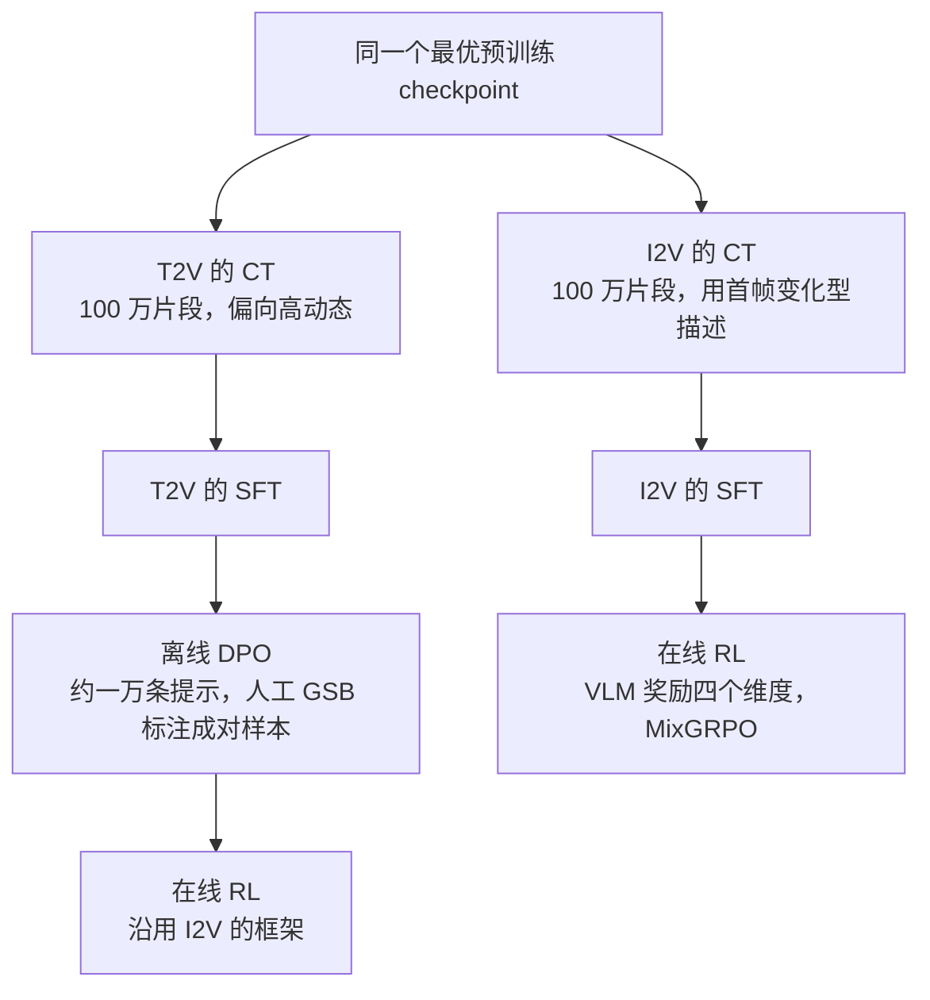
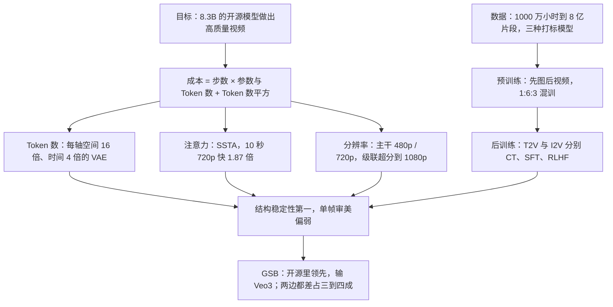

# HunyuanVideo 1.5：视频生成的账单上，参数量只是一栏

<!-- release-date: 2025-11-20 -->

> 本文依据腾讯混元基础模型团队的 **HunyuanVideo 1.5 Technical Report**，arXiv:2511.18870v2，2025-11-25 修订，共 14 页（正文 11 页）。页码均指 PDF 页码。文中区分三件事：**报告明确写了什么**、**我们怎么解释它**、**哪些是外部资料或本文推算**。

## 阅读前先认识几个词

- **潜变量（latent）与 3D VAE**：先用自编码器把视频压成小得多的张量，生成在压缩空间里做，最后解码回像素。视频要同时压空间和时间，所以是 3D VAE；**因果**指压时间轴时只看当前与之前的帧，图片（长度为 1 的视频）和长视频因此能共用一个编码器。
- **DiT（Diffusion Transformer）**：去噪网络用 Transformer，潜变量摊成一条 Token 序列做注意力。**注意力的平方代价直接压在「分辨率 × 时长」上。**
- **T2I / T2V / I2V**：文生图、文生视频、图生视频。I2V 额外给一张参考图当第一帧，文字描述从这一帧起发生什么。
- **CFG（Classifier-Free Guidance）**：每步跑两次网络（带提示、不带提示）再外推，让输出更贴提示，代价是每步成本翻倍。
- **稀疏注意力**：只在一部分 Token 对之间算注意力，其余跳过。
- **GSB（Good / Same / Bad）**：两个模型对同一输入的结果并排给人看，判谁更好或一样好、一样差。

## 一句话先说清

标题数字是 8.3B 参数（PDF p. 1）。但视频生成的成本不只看参数量，大致是：

$$
\text{总成本} \approx \text{步数} \times \left(\text{参数量} \times \text{Token 数} + \text{Token 数}^2\right)
$$

四栏里只有 Token 数那一栏是平方的，而 Token 数由分辨率乘时长决定，很容易上十万。这份报告沿着这几栏分别下刀：

- **Token 数**：高压缩 3D 因果 VAE，每轴空间 16 倍、时间 4 倍（PDF p. 2、p. 4）；
- **注意力**：SSTA（Selective and Sliding Tile Attention），10 秒 720p 上相对 FlashAttention-3 快 1.87 倍（PDF p. 2）；
- **分辨率**：主干只在 480p、720p 上生成，1080p 交给级联超分（PDF p. 1、p. 6）；
- **参数量**：8.3B 稠密 DiT，不走 MoE（PDF p. 1）。

**「步数」这一栏正文几乎没动**：Table 8 的实测仍是 50 步（PDF p. 11）；速度都测在一个正文没描述过的「CFG 蒸馏模型」上（PDF p. 10）。

> **在视频生成里，先问「我要算多少个 Token」，再问「我用了多少参数」。前者的杠杆大得多。**

## 先看全景：两段模型，两个 8.3B

两件图上读不全的事：

**第二段也是 8.3B。** 超分模型「沿用主模型的架构，一个 8.3B 的视频扩散 Transformer」，由预训练好的 T2V 模型初始化（PDF p. 6、p. 8）。完整跑一次 1080p，要串行跑两个 8.3B 的扩散过程。「8.3B」是每一段的规模。

**架构超参只有一行**（PDF p. 4，Table 1）：

| 双流块数 | 模型维度 | FFN 维度 | 注意力头数 | 每头维度 |
|---:|---:|---:|---:|---:|
| 54 | 2048 | 8192 | 16 | 128 |

2048 维、54 层，对 8.3B 来说又窄又深。报告没有拆参数量。按官方仓库代码补一笔（外部补充）：每条流各有 QKVO 四个投影、两层 MLP 和一个把条件映射成 6 组调制系数的线性层，一个双流块约 $2\times(4+8+6)\times2048^2 \approx 1.5\times10^8$ 个参数，54 块约 8.15B，加上嵌入与 Token Refiner 接近 8.3B。这说明**8.3B 不含 Qwen2.5-VL、Glyph-ByT5、SigLip 和 VAE**。

「双流块」一词只出现在 Table 1 表头和 Figure 2 图注里，正文没有描述。按 Figure 2 的画法：两条流各有自己的 MLP 和残差，在块中间共享一次联合自注意力（PDF p. 4）。

## 第一刀：Token 数，让 VAE 先压掉约一千倍

报告对 VAE 只有一句：用于图像与视频联合编码的**因果 3D Transformer**，空间压缩 16 倍、时间压缩 4 倍，潜变量 32 个通道（PDF p. 4）。

换成直觉（本文算术）。「空间 16 倍」指每个轴各压 16 倍：720p 的一帧变成 $80\times45 = 3600$ 个位置；241 帧压成 61 个潜变量帧（按因果 VAE 首帧单独编码的常见约定，$(241-1)/4+1$）；一条 10 秒 720p 视频约 $61\times3600 \approx 2.2\times10^5$ 个位置，原始像素位置约 $2.2\times10^8$，差约 1024 倍，正好是 $16\times16\times4$。官方配置里 DiT 的 patch 是 $1\times1\times1$（外部补充），所以这就是进入注意力的 Token 数。

报告自己也把速度归功于这一刀：不开工程加速就已有不错的速度，原因是「紧凑的 8.3B 架构本身高效」以及「高 VAE 压缩率显著减少了参与计算的 Token 数」（PDF p. 10）。两个原因并列，不只是参数量。

**为什么这一刀杠杆最大**：注意力代价随 Token 数平方增长。若 VAE 每轴只压 8 倍，Token 数变 4 倍，注意力代价变 16 倍，没有任何参数上的节省能补回来。

**代价与边界**：每 1024 个像素（3072 个数）压成 32 个数，细纹理、密集文字、快速运动的高频信息可能在编码时就丢了，后面补不回来。32 个通道比常见的 16 通道宽，本身就是对高压缩比的补偿。但**报告没给 VAE 的任何重建指标**，也没和低压缩比的 VAE 对照。

## 第二刀：注意力，SSTA 把平方项拆成两块可控的部分

**旧问题。** 视频相邻帧极其相似，让每个位置去看全部二十多万个位置，绝大多数比较是白算（PDF p. 5 的问题陈述是「时空冗余」）。已有两类做法各有短板：只用固定局部窗口（STA，Sliding Tile Attention）视野写死，主体一移动就落在窗口外；只用动态 Top-k，完全依赖打分，漏选就永远看不到。报告的说法是 SSTA 要「协同结合静态局部窗口先验与动态全局自适应选择」（PDF p. 5）。

**工作机制**（PDF p. 5，Algorithm 1）：

1. 把 $Q$、$K$ 按 $N = \text{tile}_t\times\text{tile}_h\times\text{tile}_w$ 切成 $B$ 个 3D 块，后面所有决策都在块粒度上做；
2. 每块自适应池化成代表向量 $\bar Q_b$、$\bar K_b$，算两个分数：

$$
\text{Score}_s = \bar Q_b \bar K_b^{\top},
\qquad
\text{Score}_r = \frac{1}{N-1}\sum_{j\neq i}\left[\bar K_b \bar K_b^{\top}\right]_{ij}
$$

$\text{Score}_s$ 是查询块与键块的相似度，$\text{Score}_r$ 是某个键块与其余键块的平均相似度，报告叫「块级冗余度」。二者合成块重要性，取 Top-$k$ 得到选择掩码 $M_{sel}$：

$$
\text{Score}_i = \lambda\cdot\text{Score}_s - \beta\cdot\text{Score}_r
$$

3. 对每对块 $(i, j)$，$j$ 落在 $i$ 的局部窗口 $WS = (w_t, w_h, w_w)$ 内就置 1，得到 $M_{sta}$；
4. 合并两张掩码，交给 `flex_block_attention` 做块稀疏注意力。

**那个减号是全篇最值得学的一处。** 它不只问「谁跟我像」，还问「谁是独一份的」。视频里同一片区域在连续几帧里几乎不变，纯按相似度选，Top-$k$ 很容易被这几块占满；扣掉冗余度，选出的块就被迫分散开。代价几乎为零：代表向量已经算好了，再做一次键块之间的相似度即可。

**伪代码里有两处与描述对不上**，报告没有澄清：

- 第 20 行合并掩码写的是 $M_{sel}\wedge M_{sta}$，逻辑**与**。字面取交集，窗口外的动态选择全部作废，SSTA 就退化成比 STA 更稀疏的 STA，与「协同结合」相反。按描述应是并集，图里按并集画。
- 第 7 行 $\text{Score}_r$ 除以 $N-1$，而 $N$ 在 Require 里定义成**块的大小**；同一行的输出形状 $\mathbb{R}^{h\times1\times B}$ 按**块的个数** $B$ 索引，求和也应跑遍 $B$ 个块。$N$ 与 $B$ 疑似写串了。

**三个实际约束**（PDF p. 5）：

- **无参数**，可以在任意训练阶段接入；
- **但实际是在蒸馏阶段才引入稀疏训练**，理由是这样「更有效地保住输出质量」。「任意阶段能插」是能力，他们仍选择先在稠密注意力下练好。而第 4 节训练章节里根本没有「蒸馏阶段」的描述；
- **能跑快靠两件事**：决策在块粒度上做，产生规整的块稀疏模式；团队基于 ThunderKittens 写了专门的 `flex-block-attn` 库（PDF p. 5，引用 [16][17]）。

tile 尺寸、窗口大小、$k$、$\lambda$、$\beta$ 全部没给，稀疏率无法从报告推算。

**对自己的项目有什么用**：稀疏选择时「相关性」不够，还要加一项「多样性」——检索去重、上下文压缩、样本挑选都是同一个问题。另外，决策粒度要对齐硬件粒度：放弃 Token 级的自由，换来能真跑快的 kernel。

## 第三刀：分辨率，级联超分

报告对拆成两段只给了目的：「进一步提升训练与推理效率，同时满足高分辨率视频生成的需求」（PDF p. 6）。账是本文算的：1080p 面积是 720p 的 2.25 倍，注意力按 Token 数平方走，主干若直接在 1080p 上跑，注意力部分每步约贵 5 倍。拆成两段后，几十步扩散全留在 720p 及以下，超分在贡献列表里被称作「少步数」网络（PDF p. 2）。

超分的做法（PDF p. 6、p. 8）：在潜变量空间做；低清潜变量先经一个**单独训练**的上采样块对齐到高清网格，再与噪声**按通道拼接**送进超分 DiT；全部权重可训，目标同样是流匹配。训练数据是 100 万条 1K–4K 的高质量片段，每条 3–10 秒、24 fps，外加一批高分辨率图片补细节。Figure 3 在上采样之后还画了一个把噪声加到 $F_{HR}$ 上的加号，正文没解释。

**这套账方向上成立，数量上无法核实**：「少步数」到底几步，正文、Table 7、Table 8 都没有超分阶段的数字。

**可迁移的形状**：某个维度上的成本是超线性的，就别让整条流水线在那个维度的最高档上跑完全程。检索的粗排—精排、编译的快慢路径是同一个形状。

## 条件怎么进模型

**两个文本编码器**（PDF p. 5）：Qwen2.5-VL 负责对场景、人物动作和具体要求的深层理解；多语言的 Glyph-ByT5 负责把画面里的字写对。ByT5 是字节级模型，直接看字形结构；语义编码器知道「这是『混』字」，要一笔一画画出来得靠字形信息。Figure 2 的例子就是在宣纸上写书法「混元视频 1.5」（PDF p. 4）。**报告没给任何文字渲染的量化指标**，没有 OCR 准确率，也没有去掉 Glyph-ByT5 的消融。

**图生视频的两条参考图通路**（PDF p. 4）。参考图要同时做两件互相冲突的事：被**精确复刻**成第一帧，又要被**语义理解**才能按文字动起来。报告两条路一起上：

| 通路 | 怎么拼 | 负责什么 |
|---|---|---|
| VAE 编码 | 与带噪潜变量**沿通道**拼接 | 像素级细节还原：第一帧 $(x, y)$ 处直接看到参考图 $(x, y)$ 处的内容 |
| SigLip 特征 | **沿序列**拼进去 | 语义对齐与指令遵循：任何位置都能通过注意力查它，但没有空间硬对应 |

拼接维度的这层解释是我们的展开，报告只写了两个事实。另有一个**可学习的类型嵌入**显式区分不同类型的条件（PDF p. 4），因为同一套权重要处理有参考图和没有参考图的输入。

## 数据：从一千万小时到八亿片段

**图像**（PDF p. 2）：沿用 HunyuanImage-3.0 的流水线，从超过 100 亿张中挑出 50 亿张用于预训练，另留 10 亿张给后续阶段。对照 Table 2，这两个数正好是 Stage I（256p）与 Stage II（512p）的数据量（这层对应是我们读出来的）。

**视频漏斗**（PDF p. 2–3）：

1. 多渠道采集，去重、去坏文件后**超过 1000 万小时**原始视频；
2. PySceneDetect 加自研切分算子切成 **2–10 秒**片段，再用专门的转场分类器去掉残留转场；
3. 字幕、台标、水印所在区域直接裁掉，**裁完不足原画幅 60% 的整条丢弃**；
4. 三级过滤：基础过滤（黑边、拼接、宫格拼图、静止或低运动）、画质过滤（清晰度、细节、噪点与伪影、动态范围四维）、审美过滤；
5. 最终约 **8 亿**条片段进入预训练（PDF p. 3）。

60% 那条阈值值得记：它承认「去水印」与「保构图」有真实冲突，报告选择在这里放弃数据量。

### 打标：三个模型，各管一件事

报告为三种数据各训了一个打标模型（PDF p. 3）：图像打标沿用 HunyuanImage-3.0；视频打标输出**多组件的结构化描述**，除多层次叙述外还有景别、机位、构图、光线、风格、色调、氛围等电影属性；**I2V 指令式打标**只写「从首帧起发生了什么变化」，前景主体与背景都写。

报告没有公开打标输出的模板。Figure 4（PDF p. 8）用于生成的提示词有明显的分段结构，与上面说的结构化描述对得上，下面按花样滑冰那一条转述成字段，**是示意，不是训练语料原文**：

| 字段 | Figure 4 花样滑冰提示词里的对应内容（中文转述） |
|---|---|
| 概述 | 视频拍一位花样滑冰运动员在冰上旋转 |
| 主体 | 穿亮片服装的女选手 |
| 动作时序 | 先做后仰旋转，再抓住冰刀拉过头顶做贝尔曼旋转，随后加速、冰屑飞溅 |
| 背景 | 冰场，广告牌虚化 |
| 镜头 | 绕她旋转 360 度 |
| 光线与风格 | 剧场式聚光；整体是优雅的体育风格 |

I2V 为什么要单独打标：首帧是用户给的，模型不需要被告知「画面里有一只猫」，需要知道的是「猫要站起来走出画面」。**标注覆盖的应该是推理时未知的那部分。**

**打标模型自己也要做后训练。** 报告点出描述的**丰富度**和**事实准确性**此消彼长：细节写得越多，越容易幻觉（PDF p. 3）。解法是把 OPA-DPO 引入打标模型的后训练，Figure 1 画了三步：

按 Figure 1（PDF p. 3）重画；图里的 0.2 / 0.4 / 0.8 是示意分数。正文除一句「把 OPA-DPO 整合进打标模型的后训练」外没有展开。第三步里人工不是去判「哪条更好」，而是**修改模型自己采样出的描述**：改完的版本仍贴着模型自己的分布，这就是 on-policy 的含义（我们的补充）。

**镜头运动**（PDF p. 3–4）：另训一个识别模型，在片段级与时序级识别多种运镜，**只有高置信度的预测**转成文字写进描述，目的是让生成模型可控运镜。识别准确率与运镜可控性都没有评测。

## 训练：从 256p 的图片一路爬到 720p 24fps

| 阶段 | 类型 | 分辨率与帧率 | 数据量 | 任务 |
|---|---|---|---:|---|
| I | 预训练 | 256p | 50 亿 | T2I |
| II | 预训练 | 512p | 10 亿 | T2I |
| III | 预训练 | 256p，16 fps，2–10 秒 | 8 亿 | T2V / I2V / T2I |
| IV | 预训练 | 480p，16 fps，2–10 秒 | 2 亿 | T2V / I2V / T2I |
| V | 预训练 | 720p，16 fps，2–10 秒 | 1 亿 | T2V / I2V / T2I |
| VI | 预训练 | 720p，24 fps，2–10 秒 | 1 亿 | T2V / I2V / T2I |
| VII | CT | 480p / 720p，24 fps，2–10 秒 | 100 万 | T2V |
| VIII | CT | 480p / 720p，24 fps，2–10 秒 | 100 万 | I2V |

（PDF p. 7，Table 2。）

**先练图片。** Stage I、II 完全是 T2I。报告说 T2I 让模型学到稳健的图文语义对齐，**显著加速了后续 T2V 与 I2V 的收敛与效果**（PDF p. 6）；结论一节也说模型「从一个文生图模型渐进训练而来」（PDF p. 11）。图片比视频便宜几个数量级，先用便宜的数据把「读懂文字」学到位，昂贵的视频算力只花在「怎么动」上。

**三任务混训 1 : 6 : 3**（T2I : T2V : I2V，PDF p. 6）。十分之一的比例仍留给图片，报告的理由是大规模 T2I 数据增强语义理解与生成多样性。

**数据量随分辨率一档档掉**，8 亿 → 2 亿 → 1 亿 → 1 亿，是算力预算守恒的痕迹。**分辨率与帧率分开爬**：先到 720p 16 fps，再到 720p 24 fps。24 fps 是训出来的，不是插帧插出来的。

**流匹配的 shift 超参对序列长度敏感**，这是训练章节唯一承认的坑（PDF p. 6）：各阶段视频 Token 长度不同，训练对 shift 特别敏感，他们「精心设计了一系列」适配不同 Token 长度的 shift 调度。shift 是对时间步采样分布的偏移，引用 [18] 是 SD3 的整流流论文。**做长度阶梯时，和长度耦合的超参必须跟着调**；但报告没给公式、数值或曲线，只能当方向性提醒。

**优化器用 Muon**（PDF p. 5）：只用 AdamW 一半的步数就达到更低的训练损失，并在多个文生图基准上更好；权重衰减 0.01 保稳定。没有曲线、没有表、没有点名基准。引用给的是 [8] Kimi K2 论文，不是 Muon 的原始出处。

## 后训练：T2V 与 I2V 走两条路

按 §4.2（PDF p. 6–7）重画。CT 与 SFT 都在 480p 与 720p 上做；SFT 按审美、清晰度、运动流畅度严筛（PDF p. 7）。CT 阶段两条路就已经岔开：T2V 偏向高动态片段强化时间建模，I2V 换上只描述运动与变化的指令式描述。**同一个底座向不同任务特化，岔口可以开得比想象中早。** Figure 4（PDF p. 8）给了 CT / SFT / RLHF 三行的样例对比，属定性展示。

**I2V 直接上在线 RL**（PDF p. 7）：

- 提示集从高审美图片出发，覆盖 100 多个类别，候选提示由 VLM 生成、人工核验图文严格一致；
- 微调一个 VLM 奖励模型，按**文本对齐、图像对齐、画质、运动动态**四维打分；
- 采样时同时变随机种子与 **CFG 系数**，并用 MixGRPO 的混合 ODE–SDE 求解器丰富探索、保住采样质量；
- 所有评测指标一致提升，**运动真实感提升尤其明显**。

用变 CFG 系数增加探索是扩散模型 RL 特有的旋钮：同一提示反复采样的轨迹往往相似，改引导强度能拉开差异。ODE 求解确定、SDE 带随机项，混合两者是在「能探索」与「生成的东西还能看」之间折中（这两句是外部背景）。

**T2V 必须先离线**，理由报告写得很清楚：「现有的奖励模型难以有效区分细粒度的运动质量」（PDF p. 7）。于是：

1. 约 $O(10K)$ 条平衡提示集（大模型生成加训练视频描述），覆盖运动、场景、主体等维度；
2. 用选定的高质量 SFT checkpoint 对每条提示生成 $N$ 个候选，两两组成不重复的对；
3. 人工按 GSB 标注语义保真、运动质量与审美；
4. 在这批成对数据上做 DPO，显著减少运动伪影，给出更好的策略起点；
5. 再接上与 I2V 完全相同的在线 RL。

**当自动奖励在某个维度上不可靠时，先用人工偏好把策略推过那片区域，再交给不完美的自动奖励。** 先诊断奖励在哪个维度失灵，比笼统地「多标数据」有效。

## 实验：赢在哪，输在哪，以及「两边都差」占了多少

两套人工评测（PDF p. 8–10）：**Rating** 多维打分用来诊断短板，**GSB** 两两对比看整体。GSB 用 300 条文本提示与 300 张图片，每个输入**只跑一次、不挑结果**，竞品用默认配置，由 100 多位专业评测员完成。

### Rating

T2V（PDF p. 9，Table 3，粗体为每行最高，本文所加）：

| 维度 | HY1.5 720p | Wan2.2 | Kling2.1 Master | Seedance Pro | Veo3 |
|---|---:|---:|---:|---:|---:|
| 指令遵循 | 61.57 | 44.07 | 50.03 | 53.19 | **73.77** |
| 单帧审美 | 63.30 | 65.98 | 68.00 | **68.22** | 67.98 |
| 画质 | 57.35 | 56.37 | 59.68 | **60.20** | 58.64 |
| 结构稳定性 | **79.75** | 73.75 | 66.74 | 68.69 | 75.62 |
| 运动效果 | 57.67 | 53.08 | 58.59 | 55.17 | **60.81** |

画像很清楚：**结构稳定性全表第一，指令遵循仅次于 Veo3，单帧审美全表最低、画质倒数第二。** 这个模型不容易画坏、比较听话，但单看一帧不够好看。报告没做这个总结。

I2V（PDF p. 10，Table 4；「480pSR」指先生成 480p 再用超分升到 720p）：

| 维度 | HY1.5 480pSR | HY1.5 720p | Wan2.2 | Kling2.1 Master | Seedance Pro | Veo3 |
|---|---:|---:|---:|---:|---:|---:|
| 指令遵循 | 63.11 | 63.05 | 56.19 | **68.43** | 62.90 | 67.86 |
| 图像一致性 | 68.82 | 72.07 | **73.53** | 64.09 | 73.06 | 72.19 |
| 画质 | 59.87 | **60.33** | 58.31 | 59.28 | 58.95 | 59.29 |
| 结构稳定性 | **70.13** | 66.67 | 69.03 | 59.71 | 68.01 | 69.25 |
| 运动效果 | 57.60 | 58.62 | 57.41 | 57.36 | 60.47 | **60.91** |

前两列是全篇唯一一次把「直接 720p」与「480p 再超分」放在同一评测下比。480pSR 赢在结构稳定性（70.13 对 66.67），输在图像一致性（68.82 对 72.07）和运动效果。我们的解释：480p 的 Token 数只有 720p 的约 0.44 倍（$848\times480$ 对 $1280\times720$），序列短，骨架更容易站住；但参考图先降再升，高频细节是超分「想象」的，与原图的一致性就掉了。**要结构稳走 480p 再超分，要贴原图直接 720p。** 报告只给了表。

Rating 分数的量纲和满分报告没写。

### GSB：最诚实的是「两边都差」那一行

T2V（PDF p. 10，Table 5）：

| HY1.5 720p T2V 对 | Wan2.2 | Kling2.1 Master | Seedance Pro | Veo3 |
|---|---:|---:|---:|---:|
| 混元更好 | 34.90% | 31.55% | 31.67% | 24.64% |
| 对方更好 | 17.78% | 18.95% | 20.65% | 34.96% |
| 两边都差 | **40.70%** | **42.76%** | **38.61%** | 30.71% |
| 两边都好 | 6.62% | 6.75% | 9.06% | 9.69% |
| 混元胜率 | 17.12% | 12.6% | 11.02% | −10.32% |

I2V（PDF p. 10，Table 6）：

| HY1.5 720p I2V 对 | Wan2.2 | Kling2.1 Master | Seedance Pro | Veo3 |
|---|---:|---:|---:|---:|
| 混元更好 | 45.60% | 40.60% | 30.62% | 37.44% |
| 对方更好 | 32.95% | 30.88% | 36.39% | 41.05% |
| 两边都差 | 18.60% | 22.73% | 26.61% | 18.44% |
| 两边都好 | 2.85% | 5.79% | 6.38% | 3.07% |
| 混元胜率 | 12.65% | 9.72% | −5.77% | −3.61% |

报告没定义「胜率」，八个数都等于「混元更好 − 对方更好」（本文验算）。T2V 赢三家、输 Veo3；I2V 赢 Wan2.2 与 Kling2.1 Master，输 Seedance Pro 与 Veo3。摘要说的是「开源视频生成模型中的新 SOTA」（PDF p. 1），「开源」这个限定是必要的。

**最值得记住的是「两边都差」。** T2V 四组里它占 30.71%–42.76%，其中三组是四个选项里最大的单一结果，比「混元更好」还多；「两边都好」只有 6.62%–9.69%。也就是说，超过三分之一的提示下，两个模型的视频在专业评测员眼里都不合格。I2V 好很多（18.44%–26.61%），给了第一帧，模型不必从零编一个世界。报告没讨论这一行，但**排行榜上的相对胜负，是在绝对成功率不高的基础上比出来的**。

## 速度与显存：1.87 倍是怎么来的

**测试条件先看清**（PDF p. 10）：速度都测在 **CFG 蒸馏模型**上，**8 张 H800**，全部设备开上下文并行。CFG 蒸馏意味着每步只跑一次网络，本身就含约 2 倍加速，而这个蒸馏过程报告没描述。显存数字则是**单卡**测的（PDF p. 11）。两组数来自两套硬件配置，不能拼成「RTX 4090 上多少秒出一条视频」。

不开工程加速、只看模型本身（PDF p. 11，Table 7；非稀疏配置用 FlashAttention-3）：

| 分辨率 | 帧数 | 稀疏注意力 | 每步耗时（秒） |
|---|---:|:---:|---:|
| 480p（480×848） | 121 | 否 | 0.9064 ± 0.0062 |
| 480p（480×848） | 241 | 否 | 1.7015 ± 0.0203 |
| 720p（720×1280） | 121 | 否 | 2.0084 ± 0.0229 |
| 720p（720×1280） | 121 | 是 | 1.5638 ± 0.0150 |
| 720p（720×1280） | 241 | 否 | 5.5070 ± 0.0284 |
| 720p（720×1280） | 241 | 是 | 2.9475 ± 0.0206 |

24 fps 下 121 帧约 5 秒、241 帧约 10 秒。表里能读出三件事（本文算术）：

- **1.87 倍就是最后两行之比**：$5.5070/2.9475 = 1.868$。p. 2 说的是「端到端」，Table 7 测的是每步；步数固定时扩散循环的比值相同，但严格的端到端还该含 VAE 解码等环节，报告没给。
- **SSTA 的收益随长度增长**：5 秒只快 1.28 倍，10 秒快 1.87 倍。只做短视频的场景，回报会比标题数字小得多。
- **SSTA 把长度曲线掰回接近线性**：720p 帧数翻倍，稠密每步涨 2.74 倍（介于线性 2 倍与平方 4 倍之间），开 SSTA 只涨 1.88 倍。480p 不开稀疏也只涨 1.88 倍——那里序列还没长到让平方项主导，这也解释了 480p 为什么没测稀疏。

开基础工程加速后（SageAttention、`torch.compile`、非关键步复用缓存特征），报告给 50 步总耗时（PDF p. 11，Table 8）：

| 分辨率 | 帧数 | 稀疏注意力 | 50 步总耗时（秒） | 平均每步（秒） |
|---|---:|:---:|---:|---:|
| 480p | 121 | 否 | 13.90 | 0.2781 |
| 480p | 241 | 否 | 27.08 | 0.5418 |
| 720p | 121 | 否 | 28.33 | 0.5667 |
| 720p | 121 | 是 | 26.41 | 0.5283 |
| 720p | 241 | 否 | 96.78 | 1.9356 |
| 720p | 241 | 是 | 58.39 | 1.1679 |

**扩散步数是 50**，全文唯一出现的步数。一个反直觉的现象（本文算术）：开加速后，稠密配置 720p 从 121 帧到 241 帧涨了 3.42 倍，比不加速时的 2.74 倍更陡——工程手段把非注意力部分压得更狠，注意力占比反而上升。所以稀疏在 10 秒上仍有 1.66 倍（96.78 → 58.39）。**工程加速做得越好，算法稀疏越值钱**；优化会搬动瓶颈，改完要重新剖析。

**显存**（PDF p. 11）：单卡开 pipeline offloading、group offloading 与 VAE tiling，720p、121 帧的 T2V / I2V 端到端推理峰值 **13.6 GB**，因此单张消费级显卡（如 RTX 4090）能跑。三点边界：这是靠 offloading 换来的，开启后的耗时没给；输出是 720p，不含 1080p 超分阶段；10 秒 720p 的单卡显存没给。

## 轻量化到底轻在哪

| 成本栏 | 报告做了什么 | 证据强度 |
|---|---|---|
| Token 数 | 每轴空间 16 倍、时间 4 倍的 3D 因果 VAE | 报告把它列为速度的两大原因之一（p. 10）；无重建指标、无对照 |
| 注意力 | SSTA，块粒度，专用 kernel | **全篇最实**：Table 7 有同条件稠密与稀疏对照，1.87 倍可验算；无画质消融、超参全缺 |
| 分辨率 | 主干 480p / 720p，1080p 交给级联超分 | Table 4 有 480pSR 与直接 720p 的对照；超分步数与耗时全缺 |
| 参数量 | 8.3B 稠密 DiT | 数字明确；口径未说明，也没和自家前代比 |
| 步数 | 实测仍是 50 步 | 正文未主张步数蒸馏 |
| CFG 蒸馏 | 所有速度都测在它上面，SSTA 的稀疏训练也挂在「蒸馏阶段」 | 第 4 节训练章节里完全没有它 |

**轻主要轻在要算的 Token 少**——高压缩 VAE 加分辨率级联，把主干要处理的东西量级性压小；**其次是注意力稀疏**，只在长视频上明显；**8.3B 是结果不是手段**。报告没下刀的地方也清楚：仍要迭代几十步，完整的 1080p 流水线里站着两个 8.3B 模型。

## 报告没写的，和原件里对不上的

**没有公开的**：

- **架构**：SSTA 全部超参；3D RoPE 与双流块只在图表里出现，正文零字；Qwen2.5-VL 与 SigLip 用的是哪个尺寸；VAE 的训练与重建指标。
- **目标函数**：流匹配、DPO、RL 目标都只有名字，唯一的公式化内容是 Algorithm 1 的打分式。
- **训练**：CFG 蒸馏怎么做、蒸了多久、与 SSTA 稀疏训练如何配合；shift 调度；总算力、GPU 数、各阶段学习率与批大小与步数；奖励模型规格与 RL 超参。
- **评测**：全部是内部人工评测，没有一个公开基准；300 条提示与 300 张图没公开；Rating 量纲没写；**没和自家上一代 HunyuanVideo 做任何对比**；速度只测 T2V、只测主干；文字渲染、运镜可控、双语能力都只有定性描述。
- **消融**：没有一次质量消融。唯一的开关对照是 Table 7、Table 8 的稀疏开与关，只测速度。

**与自身对不上的**：

| 位置 | 问题 |
|---|---|
| p. 5，Algorithm 1 第 20 行 | 合并掩码写 $\wedge$（交集），与正文「协同结合」两种模式相反 |
| p. 5，Algorithm 1 第 7 行 | $\text{Score}_r$ 的分母用块大小 $N$，输出形状按块数 $B$ 索引 |
| p. 7，Table 2 表注 | 说数据量列用「/」分隔视频量与图像量，表里没有任何单元格含「/」，Stage III–VI 是纯视频量还是混合量无法判断 |
| p. 6 正文 vs p. 7 Table 2 | 正文那句「从 256p 16 fps 逐步推进到 480p 和 720p 的 24 fps」容易读成 480p 也在 24 fps；Table 2 里 480p 与 720p 的第一档都是 16 fps，只有 Stage VI 是 24 fps |
| p. 2 vs p. 11 | 1.87 倍称为「端到端」，数据来自每步耗时 |
| p. 5 | Muon 的引用是 Kimi K2 论文，不是 Muon 的出处 |

## 最值得带回自己项目的几条

1. **先把成本写成式子，找超线性的那一栏。** 这份报告最大的两笔投入（VAE 压缩与 SSTA）都砸在平方项上。在那一项上砍 2 倍，往往抵得上在线性项上砍 10 倍。
2. **稀疏选择同时看「相关」与「不重复」。** SSTA 只多一个减号，解决的是 Top-$k$ 选出一堆重复的典型失效。
3. **决策粒度对齐硬件粒度。** 块级决策加专用 kernel，稀疏才能真跑快。
4. **把能力放在学得起的阶段。** 50 亿张图在 256p 上学文字对齐，昂贵的视频算力只投给时间建模。
5. **标注的形状匹配推理时的已知信息。** I2V 描述「相对首帧的变化」，因为首帧是用户给的。
6. **打标模型也要治幻觉。** 丰富度与准确性此消彼长，用 on-policy 的人工修正做 DPO。
7. **奖励模型的盲区决定人工介入的位置。** T2V 先离线 DPO 越过「奖励分不清运动好坏」的区域，再交给在线 RL。
8. **长度阶梯会带出超参耦合。** 流匹配的 shift 要跟着序列长度调。
9. **工程加速做得越好，算法稀疏越值钱。** 改完要重新剖析瓶颈。

## 用一张图重新串起全文

## 关键词回看

- **3D 因果 VAE**：同时压空间与时间、不看未来帧；本报告每轴空间 16 倍、时间 4 倍、32 通道。
- **双流块**：条件流与视觉流各有参数与残差，共享一次联合注意力；本报告 54 块。
- **SSTA**：滑动 tile 窗口加动态块选择；块重要性 = 相关性 − 冗余度，再取 Top-$k$。
- **级联超分**：主干在低分辨率生成，第二个同样 8.3B 的模型在潜变量空间升到 1080p。
- **Glyph-ByT5**：字节级文本编码器，负责画面内文字的字形。
- **类型嵌入**：让同一套权重区分输入里各段条件的身份。
- **CT（continuing training）**：预训练后、SFT 前的继续训练，按任务换数据分布。
- **OPA-DPO**：用人工修正模型自己的输出当正样本的 DPO，用于打标模型去幻觉。
- **MixGRPO**：混合 ODE–SDE 求解的在线 RL，在探索与采样质量间折中。
- **GSB 胜率**：「混元更好」减「对方更好」。

## 最后的判断

这份报告没有发明新范式，DiT、流匹配、VAE、DPO、RLHF 都在已有框架内。它值得读，是因为**把「轻量化」拆成了几笔可以分别计价的账**，而且大部分账摊开给你看。

- **有实验支撑的**：SSTA 在长序列上确实快，同条件对照可验算，加速比随长度增长；结构稳定性全表第一、指令遵循仅次于 Veo3；「480p 再超分」与「直接 720p」是一组真实取舍。
- **只有作者观察的**：Muon 一半步数达到更低损失；SSTA 在蒸馏阶段引入能更好地保质量；双语理解与文字渲染出色。
- **没有公开的**：SSTA 超参、蒸馏阶段的全部内容、训练算力与超参、VAE 重建质量、与自家前代的对比。

最不该漏掉的是 GSB 里「两边都差」那一行：文生视频在 2025 年底的这批模型上仍远未解决。

> **压缩比和稀疏度决定你要算多少，参数量只决定每算一次有多贵。在 Token 数轻易上十万的任务里，前者的杠杆远大于后者。**

## 资料与阅读边界

- **原件**：[arXiv:2511.18870](https://arxiv.org/abs/2511.18870) v2（2025-11-25），14 页。arXiv 提交历史为 v1（2025-11-24）与 v2，v2 为最新版。
- **首发日**：官方仓库 [Tencent-Hunyuan/HunyuanVideo-1.5](https://github.com/Tencent-Hunyuan/HunyuanVideo-1.5) 的 News 首条是「Nov 20, 2025: We release the inference code and model weights」；Hugging Face 权重仓库 [tencent/HunyuanVideo-1.5](https://huggingface.co/tencent/HunyuanVideo-1.5) 在 11-18 到 11-19 已有预建提交，11-20 有多批上传，按官方日志取 **2025-11-20**。论文首次上传晚于此。
- **外部补充（不是报告内容）**：官方仓库的 `hunyuanvideo_1_5_transformer.py` 与 Hugging Face 上 720p T2V 的 `config.json`——每条流 6 倍宽的调制层（用于参数量对账）、patch 大小 $1\times1\times1$（用于 Token 数换算）。CFG、ODE 与 SDE 采样的背景说明。
- **本文推算**：Token 数与约 1024 倍压缩、每 3072 个数压成 32 个、480p 与 720p 的面积比、GSB 胜率的定义、Table 7 与 Table 8 的各项比值、1080p 相对 720p 的注意力代价。
- **报告引用、本文未读的**：[flex-block-attn](https://github.com/Tencent-Hunyuan/flex-block-attn)、[Sliding Tile Attention](https://arxiv.org/abs/2502.04507)、[MixGRPO](https://arxiv.org/abs/2507.21802)、OPA-DPO 与 [HunyuanImage-3.0](https://arxiv.org/abs/2509.23951) 的原文。本文不对它们的细节做断言。
