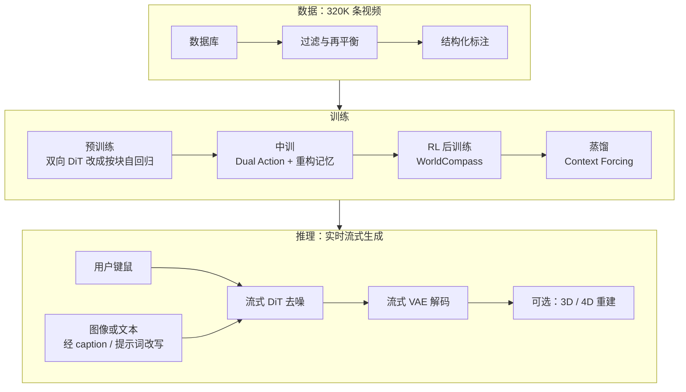
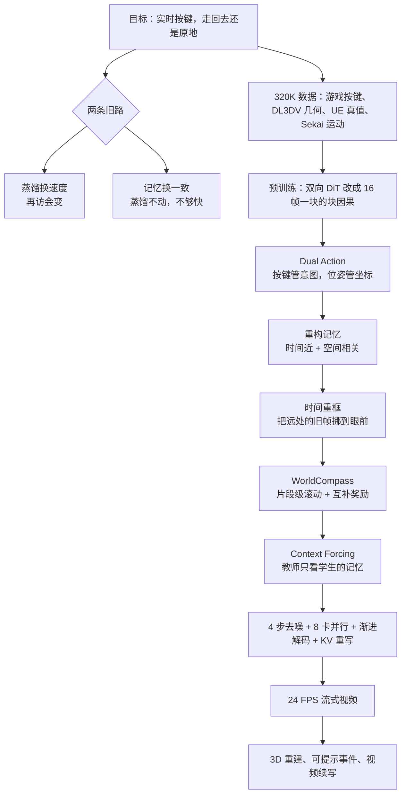

# HunyuanWorld 1.5：按键要实时，走回来还得是原地

<!-- release-date: 2025-12-17 -->

> 本文依据腾讯混元的技术报告 **HY-World 1.5: A Systematic Framework for Interactive World Modeling with Real-Time Latency and Geometric Consistency**，封面署名 Tencent Hunyuan，PDF 生成于 2025-12-14，共 20 页，没有 arXiv 编号。页码均指这份 PDF 自身的页码。文中区分三件事：**报告明确写了什么**、**我们怎么解释它**、**哪些是外部资料补充**。

## 读前先把几个词说成人话

这篇报告讲的是「可交互的世界模型」：你按键盘、拖鼠标，模型当场画出接下来的画面。难点不在画得好不好看，而在两件事能不能同时成立——够快，以及记得住。

先把会反复出现的词说清楚：

- **世界模型（world model）**：给定已经看到的画面和这一步的动作，预测接下来世界长什么样。它和普通视频生成的差别只有一条：中途能不能接收控制。
- **自回归（autoregressive）**：一次生成一小段，把结果接回输入，再生成下一段。交互必须这样跑，因为按键是边走边给的。
- **chunk（块）**：本报告每次生成的一小段视频，固定是 16 帧画面，对应潜空间里 4 个潜变量帧（PDF p. 7）。
- **扩散 Transformer（Diffusion Transformer，DiT）**：从噪声出发，用 Transformer 一步步去噪出画面。每去一次噪叫一**步**，步数越多越慢。
- **流匹配（flow matching）**：训练去噪网络的一种目标，让网络直接预测「从噪声走向数据」的速度。
- **3D VAE（三维变分自编码器）**：先把视频压成更小的潜变量，扩散在压缩空间里做，最后再解码回像素。
- **RoPE（Rotary Position Embedding，旋转位置编码）**：告诉注意力「两个 token 在序列里隔多远」。隔得越远，影响通常越弱。这个性质后面会变成记忆的敌人。
- **蒸馏（distillation）**：让一个步数很少、跑得快的学生，去模仿一个步数多、质量高的教师。
- **曝光偏差（exposure bias）**：训练时喂的是干净的真实历史，推理时喂的是模型自己刚画出的、带错的历史，错会顺着时间往下传。

报告自己起的五个名字：

- **WorldPlay**：HY-World 1.5 里那个流式视频扩散模型，负责「按了键之后下一块画面长什么样」。
- **Dual Action Representation（双重动作表示）**：同一个动作，既当离散按键喂进去，也当连续相机位姿喂进去。
- **Reconstituted Context Memory（重构上下文记忆）**：每生成一块，都从历史里重新挑一份上下文，并改写这些旧帧的时间位置。
- **WorldCompass**：给长程自回归视频模型做的强化学习后训练。
- **Context Forcing（上下文强制）**：蒸馏时让教师和学生面对同一份记忆，免得学生为了变快把记忆丢掉。

## 一句话先说清

前作 HunyuanWorld 1.0 能从文字或图片生成可以走进去的 3D 世界，但报告开篇就点明它的缺口：生成过程**漫长且离线**，**没有实时交互**（PDF p. 1、p. 3）。1.0 是「先把城建好，再请你走进去」；建的时候你不能按 `W`。

HY-World 1.5 换了一条路：不先建几何，而是用视频扩散模型**边走边画**。任务被写成 **next chunk 预测**——每次按用户动作生成下一块 16 帧（PDF p. 3）。

这条路上真正卡住前人的，是两列打不齐的账（PDF p. 3–4）：

> **要实时（快），就得蒸馏到很少的去噪步；要长期几何一致（记得住），就得带复杂记忆。可带了复杂记忆的模型，普通蒸馏又蒸不好。**

1.5 用四个设计按顺序把这两列接上（PDF p. 1、p. 3）：

1. **Dual Action**：按键负责「好学」，相机位姿负责「能定位」；
2. **重构上下文记忆 + 时间重框**：把空间上相关、时间上很远的旧帧挑回来，并在位置编码里把它们「挪近」；
3. **WorldCompass**：用强化学习显式地校正复杂组合动作和画质；
4. **Context Forcing**：让带记忆的教师与学生看同一份记忆再蒸馏，降到 4 步去噪（PDF p. 10）。

报告给出的结果，全部要带着设置读：

- 完整模型生成流式视频的速度是 **24 FPS**（PDF p. 1、p. 4）。报告没写分辨率与硬件；推理一节写的并行方案用 8 张 GPU（PDF p. 11）。
- 在 600 条测试上的**长程往返**（≥ 250 帧）评测里，完整模型 PSNR **18.94**，最好的基线 Gen3C 是 15.37；**去掉 Context Forcing** 的版本只有 16.27，而且长程的另外四项指标都不如 Gen3C（PDF p. 13，Table 2）。
- 人工偏好对四个基线是 72.9%–92.1% 的胜率，对**双向教师**只有 **48.1%**，略输（PDF p. 13，Figure 9b）。

所以最该带走的不是四个名字，而是这条判断：

> **实时世界模型的难点不在单点，而在控制、记忆、后训练和蒸馏四环之间互相拆台。每一环都要替下一环留好接口，否则最后一步蒸馏会把前面攒下的记忆全蒸掉。**

### 一条阅读路线

报告正文短，消融几乎都放在另外两篇论文里。只有半小时的话：

1. **p. 3–4 的引言与 Table 1**：快与记得住为什么对立。
2. **p. 7 Figure 4、p. 8 Figure 6**：生成循环长什么样，旧帧的时间下标怎么改写。
3. **p. 10 式 5 与 p. 11 算法 1**：Context Forcing 到底对齐了什么。
4. **p. 13 Table 2**：短程与长程两组数字，外加「去掉 Context Forcing」那一行。

p. 14–17 主要是定性图；p. 18–20 是贡献者与 36 条参考文献。

## 主要矛盾：快的不记路，记路的不够快

报告把已有的交互视频世界模型分成两派（PDF p. 3）：

| 路线 | 报告点名的代表 | 换到了什么 | 丢掉了什么 |
|---|---|---|---|
| 蒸馏优先 | Oasis、Genie 2、Matrix-Game 2.0 | 低延迟 | 回到去过的地方，场景变了 |
| 记忆优先 | 显式：VMem、Gen3C；隐式：WorldMem、Context-as-Memory | 再访更稳 | 复杂记忆让蒸馏变得很难，做不到实时 |

Table 1 把这件事摊成一张勾叉表（PDF p. 4）：

| | Oasis | Matrix-Game 2.0 | GameGenX | GameCraft | WorldMem | VMem | Ours |
|---|---|---|---|---|---|---|---|
| 动作空间 | 离散 | 离散 | 离散 | 连续 | 离散 | 连续 | 连续 + 离散 |
| 实时 | ✔ | ✔ | ✗ | ✗ | ✗ | ✗ | ✔ |
| 长期一致性 | ✗ | ✗ | ✗ | ✗ | ✔ | ✔ | ✔ |
| 长时域 | ✗ | ✔ | ✔ | ✗ | ✗ | ✗ | ✔ |
| 场景域 | Minecraft | 通用 | 通用 | 通用 | Minecraft | 静态场景 | 通用 |

读这张表要知道两件事。第一，勾叉是作者的定性归类，「实时」「长时域」都没有给出阈值。第二，表里没有 HunyuanWorld 1.0，因为它根本不在流式视频这条赛道上，1.0 和 1.5 不能放进同一张「谁更实时」的表里比。

报告把 WorldPlay 形式化成（PDF p. 7）：

$$
N_{\theta}(x_t \mid O_{t-1}, A_{t-1}, a_t, c)
$$

也就是：给定过去的观察 $O_{t-1}=\{x_{t-1},\ldots,x_0\}$、过去的动作 $A_{t-1}$、当前动作 $a_t$，以及描述这个世界的一段文字或一张图 $c$，生成下一块 $x_t$。条件里必须有**当前这一步的动作**，否则就退回普通视频生成。后文为了简洁省掉 $A$、$a$、$c$。

矛盾于是变成一句话：$O_{t-1}$ 会无限变长。全部塞进去既算不起、也蒸不动；只塞最近几块，走回原地时模型已经忘了那里长什么样。

## 先看全景：一份数据，四段训练，一次流式推理

报告的 Figure 2 把系统分成数据、训练、推理三块（PDF p. 5）。下面按该图重画，表达的是阶段顺序，不是时长或算力配比。

真正干活的循环在 Figure 4（PDF p. 7）：

图注：引自原文 Figure 4（PDF p. 7）。

这张图里有两个接口，后面四节都挂在它们上面：

- **Reconstitute**：每生成一块（图中是第 10 块和第 20 块），从底部的记忆缓存里挑出空间记忆 $C^S$ 和时间记忆 $C^T$；
- **Dual-Action**：用户输入同时变成离散按键和连续相机。

四个训练阶段各还一笔账，顺序不能随便调：

| 阶段 | 旧问题 | 这一段之后 | 页码 |
|---|---|---|---|
| 预训练 | 双向视频模型不能无限往下画 | 按 16 帧一块因果生成 | PDF p. 6–7 |
| 中训 | 能生成，但按键不可靠、没有长期记忆 | 能跟动作，再访更稳 | PDF p. 8–9 |
| 后训练 I | 像素监督只能隐式地教跟动作 | 复杂组合动作更准、伪影更少 | PDF p. 9 |
| 后训练 II | 自回归又慢又累积误差，普通蒸馏会蒸掉记忆 | 4 步去噪实时，记忆还在 | PDF p. 9–11 |

没有分块自回归，后面的记忆和蒸馏都没有接口；没有 Dual Action 里的连续位姿，空间记忆没法检索；没有记忆，Context Forcing 就没有东西可对齐。

## 数据：320K 条视频，补的是「按键」和「几何」两种标签

训练集共 320K 条筛选后的视频片段，分四类（PDF p. 5，Figure 3 在 p. 6）：

| 来源 | 条数 | 占比 | 它补什么 |
|---|---:|---:|---|
| 3A 游戏录屏（第一 / 第三人称） | 170K | 53.125% | 复杂的智能体行为、物理与环境交互；按键可以直接录到 |
| 真实 3D（DL3DV，先做 3D 重建，再设计导航式相机轨迹） | 60K | 18.75% | 真实外观与准确场景结构；专门覆盖各种移动和旋转 |
| 合成 4D（Unreal Engine 渲染） | 50K | 15.625% | 动态物体、可控光照、精确真值 |
| 真实动态视频（Sekai 数据集） | 40K | 12.5% | 自然运动与物体行为的先验 |

四类各有分工：游戏给**可交互的动态**，DL3DV 给**靠谱的几何**，UE 给**带真值的动作**，Sekai 给**真实世界的运动**。

过滤分三条线（PDF p. 5–6）：视觉质量（美学打分、水印与 UI 检测、压缩伪影）；运动一致性（光流去掉剧烈抖动，再检查相机轨迹是否平滑合理）；多样性（用动态帧率覆盖不同播放速度和相机运动）。

标注是给后面两个模块准备的（PDF p. 6）：

- 文本：用 HunyuanVideo 1.5 的 caption 模型写结构化描述；
- 连续相机位姿：用 VIPE 估计，或从 UE 与 3D 渲染管线直接导出；
- 离散动作：从相机轨迹归类成移动命令和视角旋转；只有 3A 游戏的按键是直接录下来的。

值得带走的一点：**大部分视频本来没有按键日志，按键是从相机轨迹反推出来的。** Dual Action 要两路信号，数据管线就得先把两路都备齐。

报告没写每类滤掉了多少、动态帧率怎么采样、位姿估计失败怎么处理。

## 预训练：借一块会画视频的画布，改成可以无限往下接

报告认为，现在的双向视频扩散模型已经在网络规模数据上学到了感知和模拟真实世界的能力（PDF p. 6）。它们的通用做法是：3D VAE 压缩视频；DiT 在潜空间生成，每块有 3D 自注意力、条件交叉注意力（或双流注意力）和前馈网络；用流匹配训练（PDF p. 6，式 1）：

$$
\mathcal{L}_{\mathrm{FM}}(\theta)=\mathbb{E}_{k,z_0,z_1}\bigl\|N_{\theta}(z_k,k)-v_k\bigr\|^2
$$

$z_0$ 是视频潜变量，$z_1$ 是高斯噪声，$z_k$ 是扩散时刻 $k$ 的带噪潜变量，$v_k$ 是目标速度。网络预测的速度越接近真值越好。

这一段报告写得很短，因为它不是新贡献。报告引用了 HunyuanVideo 1.5 与 Wan 作为这类双向模型的代表（PDF p. 6），但**没有写 WorldPlay 从哪个底座、哪组权重接着训**，也没有参数量。

双向模型的问题很硬：它不是因果的，无法做无限长的交互生成（PDF p. 7）。改造有三步（PDF p. 7）：

1. 把视频切成 chunk，每块 4 个潜变量帧，对应 16 帧画面；
2. 借鉴 Diffusion Forcing，训练时给不同块加不同强度的噪声；
3. 把双向自注意力改成**块因果注意力**：块内互相可见，块与块之间只能看过去。

损失仍与式 1 相同。这个自回归模型是后面接动作和记忆的底座。

**我们如何解释它。** 为什么是 16 帧一块？一帧一帧生成，对 DiT 来说太碎，延迟与误差都更差；一次画完整段，又回到了不能中途插入按键的双向模型。16 帧是「响应按键的粒度」和「每次计算的粒度」之间的一刀。报告没有消融块大小。

## 核心设计一：Dual Action，因为按键和坐标各自只对一半

### 旧问题：离散好学但找不回原路，连续能定位但训不稳

报告把前人的动作表示分成两种，各打一条（PDF p. 3、p. 8）：

- **只用离散按键**（W/A/S/D 一类）：跨尺度都学得动。大场景里走一步和小场景里走一步是同一个符号，模型自己学出「这里一步有多远」。但记忆检索要的是「我以前站过的那个精确位置」，按键太含糊。
- **只用连续相机位姿**（旋转与平移 $(R,T)$）：坐标精确，控制和检索都准。但训练数据里场景尺度差别很大，只拿位姿训会不稳。

交互世界两件都要：按 `W` 得往前走得像回事；转一圈回来，系统还得知道这是同一个坐标。

### 新设计：同一个动作，拆成两条通路进网络

图注：引自原文 Figure 5（PDF p. 7）。左边是一个 DiT 块，右边放大了其中的因果自注意力。

**离散按键**走左下角：一个零初始化的 MLP 把动作嵌入投影后加到时间步嵌入上，再通过 AdaLN 调制每个 DiT 块（PDF p. 8）。零初始化的意思是，刚开始训练时这条支路对已经会画视频的主干毫无扰动，动作控制是慢慢长出来的。

**连续相机**走右边：用 PRoPE（Projective Positional Encoding，投影位置编码）把相机信息打进自注意力。原来那一路注意力照旧，只带视频潜变量的 3D RoPE（PDF p. 8，式 2）：

$$
\mathrm{Attn}_1=\mathrm{Attn}(R^{\top}\odot Q,\ R^{-1}\odot K,\ V)
$$

再加一路刻画相机之间视锥关系的注意力（PDF p. 8，式 3）：

$$
\mathrm{Attn}_2=D^{\mathrm{proj}}\odot\mathrm{Attn}\bigl((D^{\mathrm{proj}})^{\top}\odot Q,\ (D^{\mathrm{proj}})^{-1}\odot K,\ (D^{\mathrm{proj}})^{-1}\odot V\bigr)
$$

$R$ 是 3D RoPE，$\odot$ 是矩阵与向量相乘，$D^{\mathrm{proj}}$ 由相机的内参和外参构造。两路相加，第二路同样过零初始化层：$\mathrm{Attn}_1+\mathrm{zero\_init}(\mathrm{Attn}_2)$（PDF p. 8）。

可以把它想成手柄上的两个通道：按键告诉模型「玩家想往前走」，这句话在大世界和小世界里都成立；位姿告诉模型「这一帧的相机恰好在这个视锥里」，下一节的记忆检索就靠它算视野重叠和相机距离。

### 它接在系统哪里

Dual Action 有两个下游：生成当前块时，DiT 用它决定「这一步怎么动」；记忆模块用连续位姿检索「哪些旧帧和我现在看的是同一块空间」。报告把「稳健控制」和「精确的位置缓存」写成同一设计的两个收益（PDF p. 3、p. 8），原因就在这里。

报告没有给 Dual Action 的消融数字，明确让读者去看 WorldPlay 论文（PDF p. 14）。

### 可迁移启发

要把「人的操作」和「几何检索」接进同一个模型时，先问：这个动作符号是为了好学，还是为了好定位？两者的需求不同，硬塞进一条嵌入往往两头都不满。**把意图和坐标拆开，再用零初始化接到训好的主干上**，是可以直接带走的接法。PRoPE 依赖相机模型，动作空间不是相机时不能原样用。

## 核心设计二：重构记忆 + 时间重框，因为找回来不等于用得上

### 旧问题：全历史太贵，普通检索又被位置编码冲淡

长期几何一致的字面意思是：回到去过的地方，内容不该变（PDF p. 8）。最笨的办法是把所有过去的块都当上下文，报告说这对长序列既算不起、又冗余（PDF p. 8）。

前人已经在做检索式记忆。报告认为自己多走了两步：一是每生成一块都**重新拼一份**上下文；二是处理 Transformer 位置编码的长程衰减（PDF p. 3、p. 8–9）。

### 新设计第一步：时间近的保动作，空间近的保几何

每生成新块 $x_t$，都从过去的观察 $O_{t-1}$ 里重构一份记忆上下文 $C_t$，由两部分拼成（PDF p. 8–9）：

- **时间记忆 $C_t^{T}$**：最近的 $L$ 块 $\{x_{t-L},\ldots,x_{t-1}\}$，保证短程运动平滑；
- **空间记忆 $C_t^{S}$**：从不相邻的过去帧里采样，满足 $C_t^{S}\subseteq O_{t-1}-C_t^{T}$，挡住长程几何漂移。采样按「几何相关性分数」来，分数同时考虑**视野（FOV）重叠**和**相机距离**。

这就是 Dual Action 必须带连续位姿的原因：没有相机，这两项分数都算不出来。

### 新设计第二步：把旧帧的时间下标改写掉

检索回来之后，问题转到怎么让模型真的用上它们。报告指出标准 RoPE 在这里有一个根本缺陷（PDF p. 9）：当前块和旧记忆之间的距离会随时间无限增长。

- 距离超出训练时见过的范围，外推就出伪影；
- 更要命的是，距离越远，这些**空间上重要、时间上很远**的帧对当前预测的影响就越弱。

几何上你该看的那堵墙，在位置编码里已经变成「很久以前的事」。

**Temporal Reframing（时间重框）** 的做法是：丢掉这些上下文帧的绝对时间下标，给它们动态地重新分配位置编码，让它们与当前待预测块之间保持一个**固定的、很小的相对距离**，不管真实时间隔了多远（PDF p. 9）。报告的说法是，这等于把重要的旧帧「拉近」，强迫模型把它们当成最近发生的事（PDF p. 3）。

图注：引自原文 Figure 6（PDF p. 8）。红格是记忆，蓝格是当前要预测的块，格内数字是 RoPE 里的时间下标；为了简化，每块只画一帧。

逐格读最后一行就够了：

- (a) 全上下文：当前块下标 8，前面 0–7 全部在场，越往后越长；
- (b) 检索 + 绝对下标：只取回 4 块，但它们还是 2、3、6、7，当前块仍是 8，距离照样在涨；
- (c) 检索 + 相对下标：同样取回 4 块，下标被重排成 0、1、2、3，当前块固定是 4。无论走了多远，最远的记忆也只隔 4 格。

### 收益和边界

报告的说法是，这个带记忆的模型训完之后，动作控制和长期几何一致都有了，可以进入后训练（PDF p. 9）。本报告里**没有**记忆模块的消融表，也没有给 $L$ 取多少、空间记忆每次取几帧、几何相关性分数怎么合成。

**我们如何解释它。** 时间重框是一种很猛的干预：它主动告诉模型「这些旧帧是刚刚发生的」。内容是真的，远近感是假的——这份假远近感恰恰是要的。代价是模型失去了真实的时间间隔感：三分钟前看到的墙和三秒前看到的墙，在位置编码里分不开了。报告保留一段时间记忆 $C_t^{T}$ 专门管最近几块，部分对冲了这个代价。

### 可迁移启发

任何用 Transformer 做长期记忆的系统都可以问两句：检索回来的条目，在位置编码里是不是已经远到被冲淡？如果是，能不能不改内容、只改它们的位置，让模型重新认真对待？如果任务里真实时间间隔本身有意义（节奏、倒计时），这一招不能原样搬。

## 核心设计三：WorldCompass，因为像素监督教不会复杂组合动作

### 旧问题：前两段训练只是在隐式地跟动作

中训之后，模型已经能按基本探索动作生成画面。但报告认为前两段都依赖原始像素的监督，只能**隐式地**教模型跟动作、探索环境；结果是长程交互的准确度进入平台期，视觉伪影留下来，在复杂组合动作下尤其明显（PDF p. 9）。

「复杂组合动作」可以想成：一边按 `W` 前进、一边转视角，场景里还有第三人称角色。像素损失并不直接打分「三件事都做对没有」。

强化学习能给出显式的信号，但报告说用在世界模型上有独特难处（PDF p. 9）：长时域让轨迹生成（rollout）非常贵；什么奖励能同时抬高动作跟随和画质、选什么 RL 算法，都还缺少探索。

### 新设计：clip 级滚动、互补奖励、DiffusionNFT

报告在这里只写了三件事，并明确说完整技术细节请看 WorldCompass 论文（PDF p. 9）：

1. **Clip-Level Rollout（片段级滚动）**：不为整条长视频做一次巨大的 rollout，而在片段粒度上滚动。理由有三：rollout 更省；奖励信号更细；更关键的是，逼模型依赖自己不完美的预测，从而缓解曝光偏差。
2. **Complementary Reward Functions（互补奖励）**：一个动作跟随分，一个视觉质量分，多种反馈互相牵制，用来压住奖励作弊（reward hacking）。
3. **算法用 DiffusionNFT**，外加若干效率策略。

报告的章节导读还提了一句：这一阶段利用了「3D 反馈和视觉反馈」（PDF p. 4）。5.2 节没有展开 3D 反馈怎么算，不要把它扩写成一套公式。

**我们如何解释它。** 只有动作分，模型可以用糊掉的画面假装走到了；只有画质分，模型可以画出好看但完全不跟键的镜头。两个分数会互相拆台，正是它们能互相制衡的原因。

### 本报告里的证据

没有定量表。证据是 Figure 11 的定性对比（PDF p. 14）：

图注：引自原文 Figure 11（PDF p. 14）。每组上一行是基础模型，下一行加了 WorldCompass；右下角的方块是每一段的按键。

报告的评价是：没有 RL 的模型在复杂动作下会与交互信号错位、画面退化；RL 之后动作跟随和视觉保真都明显更好（PDF p. 13–14）。这是作者观察加定性图，能支持「作者认为这一段有用」，不能支持「比某种 RL 基线高多少」。

### 可迁移启发

长程生成模型的像素模仿，往往在「会不会做基本动作」上就饱和了。再往上要一个直接打在目标上的信号。可以带走的是两条原则：**滚动单位要小到奖励能定位是哪一段错了**；**至少两路会互相拆台的奖励**，专门对付只优化一个数的作弊。完整配方以 WorldCompass 论文为准，本报告不够复现。

## 核心设计四：Context Forcing，因为普通蒸馏会把记忆蒸掉

### 旧问题：学生只能看过去，教师却连未来都看得见

自回归世界模型有两个病：长视频上误差累积，去噪过程慢（PDF p. 10）。近来的标准疗法，是把一个双向扩散模型蒸馏成少步的自回归学生，用分布匹配损失让学生的分布 $p_{\theta}(x_{0:t})$ 贴近教师（PDF p. 10，式 4）：

$$
\nabla_{\theta}\mathcal{L}_{\mathrm{DMD}}=\mathbb{E}_{k}\bigl(\nabla_{\theta}\mathrm{KL}(p_{\theta}(x_{0:t})\,\|\,p_{\mathrm{data}}(x_{0:t}))\bigr)
$$

这个梯度可以用两个扩散模型给出的 score 之差来近似。

报告认为，这套办法对**带记忆的模型**会失效，原因不是步数，而是两边的条件根本不同（PDF p. 10）：

- 双向教师能看到过去和未来；
- 因果学生只能看过去，而且只看自己那套记忆；
- 即便给教师也装上记忆，它的双向本质仍然和学生的因果过程不同。

于是两边的条件分布 $p(x \mid C)$ 对不上，分布匹配就失败了。引言里的说法更直接：这相当于训练一个有记忆的自回归学生，去模仿一个无记忆的双向教师（PDF p. 3）。

### 新设计：学生先自己滚 4 块，教师只看学生的那份记忆

图注：讲解示意，据 PDF p. 10 式 5 与 Figure 7、p. 11 算法 1 重画；每块的记忆集合是举例。

学生从记忆出发，自己连续生成 4 块，每块只条件于它自己的记忆 $C_i$（PDF p. 10）：

$$
p_{\theta}(x_{j:j+3}\mid x_{0:j-1})=\prod_{i=j}^{j+3}p_{\theta}(x_i\mid C_i)
$$

教师 $V_{\beta}$ 是一个装了记忆的双向扩散模型。它的上下文被做成「学生这 4 块用过的全部记忆，去掉这 4 块本身」（PDF p. 10，式 5）：

$$
p_{\mathrm{data}}(x_{j:j+3}\mid x_{0:j-1})=p_{\beta}(x_{j:j+3}\mid C_{j:j+3}-x_{j:j+3})
$$

$C_{j:j+3}$ 是学生生成这 4 块时用到的所有记忆块。教师要去噪的就是这 4 块，看得到的历史恰好是学生当时看得到的那些，既不多看未来，也不换一套检索结果。

可以把它想成开卷考试。学生答题时桌上摊着自己检索来的几页笔记；如果阅卷老师摊的是整本教科书，老师心中的「标准答案分布」学生根本写不出来，学生为了像老师，只能学些自己推理时拿不到的捷径，记忆机制就被绕开了。Context Forcing 让老师也只看那几页笔记。

算法 1 把训练循环写全了（PDF p. 11）：

1. 逐步增大允许的最大块长 $m$；
2. 均匀采样历史长度 $j\in\{0,\ldots,m\}$，从数据里取出真实历史 $x_{0:j-1}$；
3. 对要生成的 4 块逐块：从高斯噪声出发 → 重构记忆 $C_i$ → 随机抽一个去噪步数 $s\in\{1,\ldots,d\}$ → 用学生按 $C_i$ 和 $s$ 步生成；
4. 对齐教师上下文 $C^{\mathrm{tea}}\leftarrow C_{j:j+3}-x_{j:j+3}$；
5. 给这 4 块加噪，分别用 fake 与 real 两个双向模型算 score，按分布匹配损失更新学生 $\theta$，按 Self Forcing 的做法用流匹配损失更新 fake 模型 $\beta$。

原文第 15 行把 real score 也记成了 $S^{\mathrm{fake}}$，按上下文是笔误。

蒸馏的结果，报告写成：**4 步去噪**的实时生成，同时保住长期一致性、缓解误差累积（PDF p. 10）。

### 它在评测里站在哪

Table 2 里「去掉 Context Forcing」那一行，是本报告唯一把某个设计单独拿掉的定量结果（PDF p. 13）。去掉它，模型不再实时；短程 PSNR 从 21.92 降到 21.27；长程 PSNR 从 18.94 降到 16.27，$R_{\mathrm{dist}}$ 从 0.332 升到 0.611。

所以 Context Forcing 同时做了两件事：**把模型变快，也把长程误差按住。** 它不是「只换速度、质量不变」的工程蒸馏。

**我们如何解释它。** 这一行不是干净的消融：「无 Context Forcing」的模型想必步数更多、没经过蒸馏阶段的自滚训练，报告没说它具体用了多少步。长程变好，既可能来自对齐的记忆，也可能来自自滚训练对曝光偏差的缓解，报告本身把后者也算作 Context Forcing 的收益（PDF p. 10）。

### 可迁移启发

只要学生和教师**看到的条件不同**，分布匹配就可能在对错的东西。带检索、带记忆、带工具调用的生成模型做蒸馏时，先画一张「这一刻双方各看见什么」的表，再谈损失。Context Forcing 把它变成一条可执行的规则：**教师的条件 = 学生推理时真能拿到的条件**。

## 推理：4 步还不够，延迟还得在工程上拆

蒸馏把去噪压到 4 步，报告仍说要实现实时流式交互还需要更多优化（PDF p. 11）。这一节只讲机制，没有延迟拆解表。

- **DiT 与 VAE 的混合并行**：在 8 张 GPU 上对 DiT 主干和 VAE 解码器都做序列并行。它不复制整个模型，也不只沿时间维切，而是把**每一整块**的 token 分到各卡上，结合注意力并行，让单块计算均匀摊开（PDF p. 11）。
- **流式部署与渐进解码**：用 NVIDIA Triton 推理框架部署。DiT 一吐出潜变量，就分小批做多步 VAE 解码，解一批立刻推给客户端；生成与送达用异步处理和帧缓冲解开，压低首帧时间（PDF p. 11）。
- **量化与高效注意力**：注意力用 SageAttention 做混合精度；权重与激活做浮点量化；计算重的线性层做矩阵乘量化；自回归用 KV cache 免去重复计算（PDF p. 11）。

算法 2 补了 KV cache 的一个细节（PDF p. 12）：每生成一块，先重构记忆 $C_i$；在最高噪声那一步、且块序号 $i>1$ 时，用「重构记忆、时刻 0」重新算一遍 KV 并**整体替换**缓存，然后按 $k_d,\ldots,k_1$ 去噪。

**我们如何解释它。** KV cache 不是沿时间线一路追加，而是每块按重构记忆重写一次。这和核心设计二是同一个思想在推理时的落地：模型该看的是重构出来的那份上下文，不是原始时间线上的全部 token。

报告说这些技术「在我们的实验中」保住了视觉保真（PDF p. 11），但没有速度消融表。24 FPS 没有写分辨率、是否包含网络传输、是否必须 8 卡满配。

### 键鼠之外：用一句话改正在发生的世界

§7.2 把交互从导航扩展到**可提示事件**（PDF p. 12）：生成过程中输入一段自然语言，就能触发事件，类别包括物体增删、环境变化（天气、光照）、动态效果（爆炸）和角色行为（NPC 动作）。Figure 8 是草原上出现热气球和彩虹（PDF p. 12）；Figure 1(e) 和 Figure 13 还有烟雾扩散、天色变暗、喷火、行人和狗（PDF p. 4、p. 15）。

这是能力演示，不是单独的模块设计。报告没写文本事件怎么注入 DiT。

## 实验：短程大家都能看，拉开差距的是走远再走回来

### 协议

600 条测试用例，来自真实视频、游戏录屏和 AI 生成的图像（PDF p. 12）。两条协议（PDF p. 12–13）：

- **短程（61 帧）**：用测试视频的相机轨迹当输入位姿，生成帧与真值逐帧比。画面用 PSNR、SSIM、LPIPS，相机准确度用 $R_{\mathrm{dist}}$、$T_{\mathrm{dist}}$（旋转与平移误差）。
- **长程（≥ 250 帧）**：设计往返轨迹，沿一条路走出去，再沿原路走回来，用回程帧对比去程时对应的帧。这直接在测「回到原地还像不像」。

基线分两组（PDF p. 13）：没有记忆的动作控制模型 CameraCtrl、SEVA、ViewCrafter、Matrix-Game 2.0、GameCraft；有记忆的 Gen3C、VMem。库里的 WorldCrafter 一篇沿用了这套长程往返评测，可以对照读。

### 结果

图注：据原文 Table 2（PDF p. 13）重画，只画 PSNR 一项。

Table 2 全表如下（PDF p. 13）。粗体照原表：

| 方法 | 实时 | 短程 PSNR↑ | SSIM↑ | LPIPS↓ | $R_{\mathrm{dist}}$↓ | $T_{\mathrm{dist}}$↓ | 长程 PSNR↑ | SSIM↑ | LPIPS↓ | $R_{\mathrm{dist}}$↓ | $T_{\mathrm{dist}}$↓ |
|---|---|---:|---:|---:|---:|---:|---:|---:|---:|---:|---:|
| CameraCtrl | ✗ | 17.93 | 0.569 | 0.298 | 0.037 | 0.341 | 10.09 | 0.241 | 0.549 | 0.733 | 1.117 |
| SEVA | ✗ | 19.84 | 0.598 | 0.313 | 0.047 | 0.223 | 10.51 | 0.301 | 0.517 | 0.721 | 1.893 |
| ViewCrafter | ✗ | 19.91 | 0.617 | 0.327 | 0.029 | 0.543 | 9.32 | 0.277 | 0.661 | 1.573 | 3.051 |
| Gen3C | ✗ | 21.68 | 0.635 | 0.278 | **0.024** | 0.477 | 15.37 | 0.431 | 0.483 | 0.357 | 0.979 |
| VMem | ✗ | 19.97 | 0.587 | 0.316 | 0.048 | 0.219 | 12.77 | 0.335 | 0.542 | 0.748 | 1.547 |
| Matrix-Game-2.0 | ✔ | 17.26 | 0.505 | 0.383 | 0.287 | 0.843 | 9.57 | 0.205 | 0.631 | 2.125 | 2.742 |
| GameCraft | ✗ | 21.05 | 0.639 | 0.341 | 0.151 | 0.617 | 10.09 | 0.287 | 0.614 | 2.497 | 3.291 |
| Ours（无 Context Forcing） | ✗ | 21.27 | 0.669 | 0.261 | 0.033 | 0.157 | 16.27 | 0.425 | 0.495 | 0.611 | 0.991 |
| Ours（完整） | ✔ | **21.92** | **0.702** | **0.247** | 0.031 | **0.121** | **18.94** | **0.585** | **0.371** | **0.332** | **0.797** |

报告自己的读法是：短程上视觉保真出色、控制精度有竞争力；到了长程，各基线的控制精度因误差累积而退化，差距被拉开（PDF p. 13）。图已经画出了这个走势，下面只补三件表上读得出、正文没说的事。

**第一，短程旋转最准的不是 WorldPlay。** Gen3C 的短程 $R_{\mathrm{dist}}$ 是 0.024，完整模型是 0.031，原表也把 Gen3C 那一格加粗。报告在定性部分说 Gen3C 的显式 3D 缓存对中间结果和深度估计很敏感（PDF p. 13），这解释的是它长程不稳，而不是短程不准：真正持有 3D 的方法，短程转了多少度可以更准。

**第二，去掉 Context Forcing 之后，长程只在 PSNR 一项上赢过 Gen3C。** 16.27 高于 15.37；但 SSIM 0.425 对 0.431、LPIPS 0.495 对 0.483、$R_{\mathrm{dist}}$ 0.611 对 0.357、$T_{\mathrm{dist}}$ 0.991 对 0.979，四项都是 Gen3C 更好，其中相机旋转误差差了将近一倍。长程五项全部拿第一的，只有完整模型。**长程上的领先，很大一块是蒸馏阶段挣来的，不只是中训的记忆模块。**

**第三，唯一另一个实时的基线是 Matrix-Game-2.0**，它在长程上的相机误差（$R_{\mathrm{dist}}$ 2.125）是完整模型的 6 倍多。这正是 Table 1 里「快的不记路」那一格的实测。

### VBench 与人工评测

Figure 9a 是 VBench 雷达图，对照 Gen3C、ViewCrafter、GameCraft、Matrix-Game-2.0（PDF p. 13）。报告没有列出各维分数，本文也不从雷达图上估数。

Figure 9b 是两两偏好（PDF p. 13），从图上读到：

| 对照 | 选 Ours | 选对方 |
|---|---:|---:|
| vs GameCraft | 88.5% | 11.5% |
| vs Matrix-Game-2.0 | 78.4% | 21.6% |
| vs ViewCrafter | 92.1% | 7.9% |
| vs Gen3C | 72.9% | 27.1% |
| vs 双向教师 | 48.1% | 51.9% |

对四个基线是大胜。对**双向教师**是 48.1% 对 51.9%，略输，报告正文没有讨论这一行。**这是我们从图上读出的观察**：少步的自回归学生，在人眼里还没完全追上双向教师，实时是用一点观感换来的。人评的题数、是否盲评、评分口径，报告都没写。

### 定性图在说什么

Figure 10 用红框标出再访时的一致性（PDF p. 14）。报告据此点了三条（PDF p. 13）：Gen3C 的显式 3D 缓存受中间结果和深度估计拖累；Matrix-Game 2.0 与 GameCraft 没有专门的记忆，撑不住自由探索；其他方法难以泛化到第三人称，而 WorldPlay 能。第三人称没有单独的定量表。

报告最后一句写，动作表示、记忆、Context Forcing 与 RL 的详细消融见 WorldPlay 与 WorldCompass 两篇论文（PDF p. 14）。

## 应用：一致的视频，可以再变成点云、事件和续写

§8.2 的三个应用，都建立在「长期几何还在」这个前提上（PDF p. 15）：

- **3D 场景重建**：把生成的多视角画面交给 WorldMirror 这类重建管线，得到点云（Figure 12）。理由是生成时几何一致，重建伪影更少。这里的 3D 是**事后重建**，不是 1.0 那种生成时就分层出网格。
- **动态事件**：改天气、触发喷火、加入新物体和角色（Figure 13 上半）。报告认为这类罕见情景对训练智能体有用。
- **视频续写**：给一段初始视频，往后接的内容在运动、外观和光照上保持一致（Figure 13 下半，PDF p. 15–16）。摘要里的「无限世界延伸」对应这一类能力（PDF p. 1），报告没有定义长度上限。

Figure 14、15 是更多定性结果和长视频示例（PDF p. 16–17），Figure 15 每条序列展示到第 378 帧，没有新数字。

## 报告明确写了、没写的，和不要补进去的

一份 20 页的系统报告不是复现说明。下面这些报告没写：

- 底座从哪组权重接着训、训了多少步、用多少卡、花多少钱；参数量、层数、宽度；
- 320K 里各类滤掉的比例、动态帧率的采样方式、位姿估计失败如何处理；
- 时间记忆长度 $L$、空间记忆条数、FOV 重叠与相机距离如何合成一个分数；
- Dual Action、时间重框、WorldCompass 的消融数字——报告自己指向另外两篇论文（PDF p. 14）；
- WorldCompass 的奖励公式、「3D 反馈」的定义、片段长度与 DiffusionNFT 超参；
- 「无 Context Forcing」那一行用了多少去噪步；
- 可提示事件在网络里怎么注入；
- 24 FPS 对应的分辨率、硬件与是否含传输；
- 人评协议。

结论对限制只有一句未来工作：把系统扩展到更长的视频、多智能体交互和复杂物理动态（PDF p. 16）。它承认当前重心仍是导航控制，没有单独的限制一节。

## 可迁移启发

### 1. 先承认「快」和「记得住」会互相拆台

Table 1 不是装饰。蒸馏路线和记忆路线各自优化自己那一列，另一列就塌。做实时生成系统，不要默认「先把质量做好再压速度」能保住检索与记忆。

### 2. 动作通道按下游用途拆

意图（好学、跨尺度）与坐标（好检索）不是同一种监督。零初始化把新通道接到旧主干上，是低风险的接入方式。

### 3. 检索回来不等于能被用上

位置编码会把「空间上近、时间上远」的记忆自动降权。时间重框说明，有时该改的不是内容，而是模型感知到的距离；同时留一条短程时间记忆，保住真实的先后顺序。

### 4. 像素模仿会在基本动作上饱和

复杂组合动作需要显式奖励，奖励至少两路、彼此牵制，滚动单位要小到能定位错误。

### 5. 蒸馏先对齐条件，再对齐分布

Context Forcing 最可迁移的不是 DMD 公式，而是「教师的条件必须是学生推理时真能拿到的条件」。检索增强、带工具、带记忆的学生做蒸馏，都适用。

### 6. 实时是生成、解码、传输三条流水线

4 步去噪之后，报告还要按块切 token 并行、渐进解码、Triton 流式推送、按重构记忆重写 KV cache。首帧时间和稳态帧率往往不是同一个优化对象。

### 7. 交互发生在生成过程中，还是发生在已有几何上

1.5 用视频做实时交互，再用重建把一致的视频变成点云；1.0 是先生成网格再走。两条路的一致性来源完全不同，自己的项目要先定这一点。后作 HunyuanWorld-2.0 又回到了 3D 表示，见那一篇。

## 用一张图把因果链串回去

这张图按 PDF p. 3–12 的叙事重画，是因果示意，不是时间线。

## 关键词回看

- **HY-World 1.5**：腾讯混元的交互式世界建模框架；WorldPlay 是其中的流式视频模型，WorldCompass 是 RL 后训练。
- **next chunk 预测**：每次生成 16 帧（4 个潜变量帧），条件里带当前动作。
- **块因果注意力**：块内双向、块间因果，是双向视频模型改成交互模型的接口。
- **Dual Action**：离散按键经零初始化 MLP 进时间步嵌入；连续相机经 PRoPE 多开一路注意力，零初始化加回。
- **重构上下文记忆**：时间记忆取最近 $L$ 块，空间记忆按 FOV 重叠和相机距离从更早的帧里采样。
- **时间重框**：丢掉取回帧的绝对时间下标，重排成离当前块固定且很近的位置。
- **WorldCompass**：片段级 rollout、动作与画质两路互补奖励、DiffusionNFT。
- **Context Forcing**：学生自滚 4 块；教师条件为这 4 块的记忆并集减去它们自身；4 步去噪。
- **长程往返评测**：≥ 250 帧，沿原路走回，用回程帧比去程帧。

## 最后的判断

HY-World 1.5 最清楚的叙事，不是「又做了一个更好看的世界模型」，而是：**1.0 证明了离线 3D 世界可以走；要把「走」变成「实时按」，就得换成视频生成这条路，并且把「快」和「记得住」当成同一个设计问题来解。**

证据分三层：

- **有定量支撑的**：短程与长程两组指标相对所列基线更好；长程往返上领先最明显；去掉 Context Forcing 后长程明显变差、只在 PSNR 一项上仍领先 Gen3C（Table 2）；人工偏好对四个基线大胜（Figure 9b）。
- **只有定性图或作者观察的**：WorldCompass 的收益（Figure 11）；第三人称与风格化场景的泛化（Figure 10、14）；可提示事件与续写。
- **报告没有公开的**：底座与规模、记忆的具体超参、全部消融、24 FPS 的测量口径、人评协议。

还有两处读者要自己校准：对双向教师的人评是略输的；「去掉 Context Forcing」那一行同时改变了速度和训练方式，不是只拿掉对齐这一件事。

如果只带走一句：

> **实时交互世界不是把 1.0 的网格跑得更快，而是让视频模型每一步都接得住按键，并在位置编码里拒绝忘掉回程时该看见的那几帧。**

## 资料与阅读边界

**原始依据**

- 本地 `papers/Tencent/HunyuanWorld-1.5.pdf`，封面标题见文首，20 页，没有 arXiv 编号。官方项目页托管的技术报告（[HYWorld_1.5_Tech_Report.pdf](https://3d-models.hunyuan.tencent.com/world/world1_5/HYWorld_1.5_Tech_Report.pdf)）与本地原件是同一份文件，没有更新修订。

**首发日证据**

- `release-date` 取 **2025-12-17**：官方仓库 [Tencent-Hunyuan/HY-WorldPlay](https://github.com/Tencent-Hunyuan/HY-WorldPlay) 的 News 写明 2025 年 12 月 17 日发布开源模型 HY-World 1.5（WorldPlay），同日给出技术报告；Hugging Face 权重仓库 [tencent/HY-WorldPlay](https://huggingface.co/tencent/HY-WorldPlay) 的权重文件提交于 2025-12-16 16:23 UTC，即北京时间 12 月 17 日凌晨，与 News 同一天。仓库更早的空提交不算公开。

**同系列的另外两篇论文（外部补充，不是本报告内容）**

- [WorldPlay（arXiv:2512.14614）](https://arxiv.org/abs/2512.14614)，v1 提交于 2025-12-16，2026-06-09 有 v2 修订。它是另一份原件，贡献切分与本报告不同，并带有本报告没有的消融。本文没有用它的数字补写上面的结论。
- [WorldCompass（arXiv:2602.09022）](https://arxiv.org/abs/2602.09022)，2026-02-09 提交，是本报告第 5 节指向的完整 RL 方法。本文没有用它补写 §5 的实现。

**原文里的小问题**

- 算法 1 第 15 行把 real score 写成了 $S^{\mathrm{fake}}$（PDF p. 11）；算法 2 把「推理块数」这条前提写了两遍（PDF p. 12）；Table 2 里 VMem 的引用号是 [28]，而参考文献 [28] 是 MotionCtrl，正文同处用的是 [14]（PDF p. 13、p. 19–20）。

**外部补充（不是本报告原文）**

- 官方仓库 News 显示，推理代码的量化加速、WorldPlay-8B 训练代码、基于 Wan 的 WorldPlay-5B 轻量权重与 WorldCompass 训练代码都在 2026 年 1–3 月陆续放出。它们不是这份 20 页报告评测的对象。
- 在线体验：[sceneTo3D 的 WorldPlay 标签页](https://3d.hunyuan.tencent.com/sceneTo3D?tab=worldplay)。

**本文推算与读图**

- 「6 倍多」（2.125 / 0.332）等比值是我们按 Table 2 计算的；Figure 9b 的偏好率读自原图标注。
