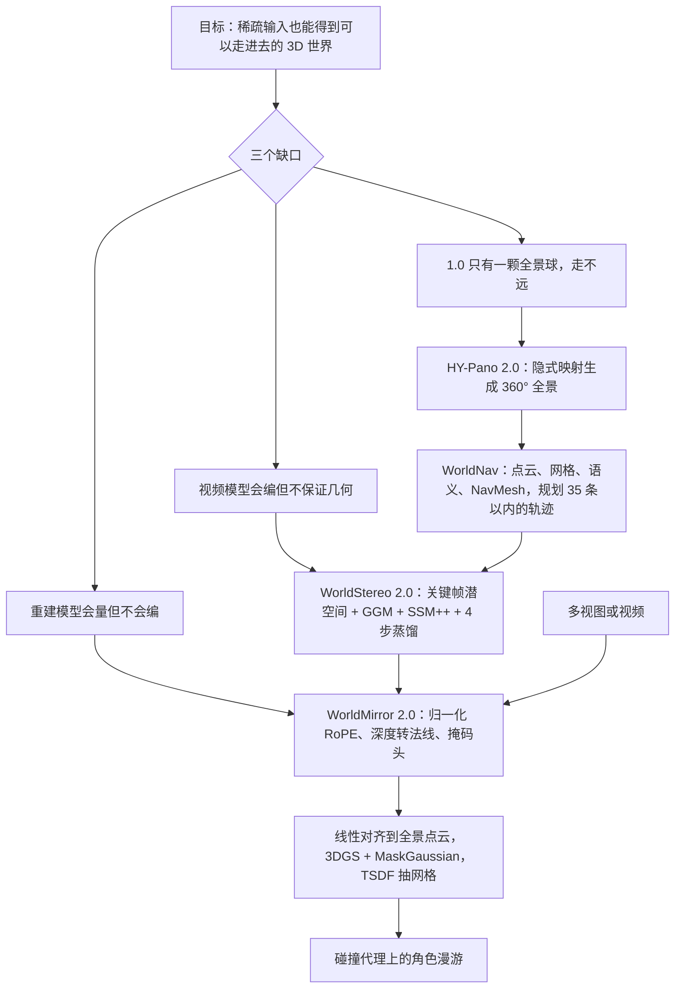

# HunyuanWorld 2.0：全景只给出生点，世界要沿规划好的路长出来

<!-- release-date: 2026-04-16 -->

> 本文依据腾讯混元的 **HY-World 2.0: A Multi-Modal World Model for Reconstructing, Generating, and Simulating 3D Worlds**，arXiv:2604.14268v1，2026-04-15 提交，共 44 页（正文与实验到 p. 37，p. 38 为贡献者名单，p. 39–44 为参考文献）。页码均指 PDF 自身的页码。文中会区分三件事：**报告明确写了什么**、**我们怎么解释它**、**哪些是外部资料或本文推算**。

## 阅读前先认识几个词

这篇报告横跨全景生成、视频扩散、前馈重建和 3D 高斯泼溅四个领域，名词很多。先把反复出现的几个说成人话：

- **全景图与 ERP**：站在一个点上把四周 360° × 180° 全拍下来的一张图。存成矩形时常用等距柱状投影（Equirectangular Projection，ERP），左右两边在球面上其实是相邻的，所以生成时最怕左右接不上（PDF p. 5–6）。
- **3DGS（3D Gaussian Splatting，3D 高斯泼溅）**：用成百万个带位置、形状、颜色和不透明度的小椭球去拟合一个场景，渲染快、可以换视角看。这是本报告世界生成的最终交付物（PDF p. 21–22）。
- **世界生成 vs 世界重建**：输入是一句话或一张图时，大部分场景没人拍过，模型要「想象」出来，叫世界生成；输入是多视图或视频时，场景已经被拍过，模型要把几何「收回来」，叫世界重建（PDF p. 4）。
- **前馈重建（feed-forward reconstruction）**：一次前向就从一组图片直接吐出深度、法线、点云、相机参数，不做逐场景的迭代优化。本报告的 WorldMirror 就是这一类（PDF p. 15）。
- **NavMesh（Navigation Mesh，导航网格）**：游戏里给角色寻路用的那张「哪里能走」的地面网格（PDF p. 7–8）。

报告里的四个自有组件名先列在这里，后文逐个展开：

| 阶段 | 组件 | 一句话 |
|---|---|---|
| 1 全景生成 | HY-Pano 2.0 | 文本或单图生成 360° 全景，当世界的初始化 |
| 2 轨迹规划 | WorldNav | 在全景里解析几何与语义，规划最多 35 条不撞墙的相机路径 |
| 3 世界扩展 | WorldStereo 2.0 | 沿这些路径用视频扩散生成新视角关键帧，带记忆保证前后一致 |
| 4 世界合成 | WorldMirror 2.0 + 3DGS | 把关键帧的深度对齐到全景坐标，训练 3DGS，再抽网格做碰撞 |

另有一个 **WorldLens**：报告称它是 3DGS 渲染平台，但正文几乎没写它，后文单独说。

## 一句话先说清

HunyuanWorld 1.0 的做法是生成一张全景，把它当成整个世界，再分层抬成网格（见 HunyuanWorld-1.0 一篇）。那个世界的边界就是那颗球：能转头、能在原点附近挪几步，走远了就没有东西。

HY-World 2.0 没有扔掉全景，而是把它降成**第一站**：

> **全景负责出生点，轨迹规划负责「该去看哪」，视频扩散负责把没拍到的地方补出来，前馈重建负责把补出来的画面钉成一块能走进去的 3DGS。**

同一个前馈重建模型 WorldMirror 2.0 还能单独工作：给它多视图或视频，它直接做世界重建。报告因此自称「第一个在离线 3D 世界模型范式里统一生成与重建的开源系统」（PDF p. 4）。

如果只记三个数字：

- 一次完整的世界生成在 NVIDIA H20 上共 **712 秒**，其中轨迹规划 182 秒、世界扩展 286 秒，两段占去约三分之二（PDF p. 31，Table 10；占比为本文算术）；
- 3DGS 合成阶段相对 6M 高斯的基线，把高斯数减到约 1.38M，**少 77%**，PSNR 只掉约 0.15 dB（PDF p. 29，Table 9）；
- WorldMirror 1.0 换到高分辨率时相机位姿 AUC@30 从 86.13 掉到 66.29，2.0 反而从 86.48 升到 86.89（PDF p. 34，Table 12）。

## 先看全景：四段流水线，两条入口

*图：引自原文 Figure 2（PDF p. 5）。*

图上只画了世界生成这一条。世界重建是第二条入口，写在第 6 节：多视图或视频直接送进 WorldMirror 2.0，出点云、深度、法线、相机和 3DGS 属性（PDF p. 15）。两条入口在 WorldMirror 这里汇合。

四段的先后不能换，原因是每一段都在给下一段提供它缺的东西：

1. 没有 360° 全景，就没有初始几何，后面的轨迹规划无从下手，扩展阶段也没有可检索的初始记忆；
2. 没有轨迹，视频模型不知道镜头该往哪走，要么围着原点打转，要么穿墙；
3. 没有扩展出来的新视角，重建只能看到全景那一个点，遮挡背后和远处都是空洞；
4. 没有重建与对齐，生成的关键帧只是一堆 2D 图片，拼不成一个坐标一致的 3D 世界。

报告在引言里还说，世界扩展阶段「借用视频扩散模型的生成先验」，才让可探索空间比 1.0 大得多（PDF p. 4）。这句话是理解整篇报告的钥匙：**视频模型在这里只是一个「补画面」的工具，交付物仍然是 3D 资产，不是一段播完就没的视频**。这是它和 Genie、Cosmos 那类像素视频世界模型最根本的区别，也和同系列、做实时交互视频的 HunyuanWorld-1.5 是两条线。

## 先讲矛盾：生成与重建为什么一直是两家

报告开篇把现状概括成「分叉」（PDF p. 4）：

| 路线 | 擅长 | 卡住的地方 |
|---|---|---|
| 生成（文本、单图） | 从稀疏输入想象出可探索的场景 | 很难保持严格的重建精度 |
| 重建（多视图、视频） | 把深度、法线、点云精确收回来 | 没有生成先验，看不见的区域补不出来 |
| 闭源统一产品（点名 World Labs 的 Marble） | 两件事都能做 | 开源社区没有对等的基础模型 |

把这张表翻成一个具体矛盾：**稀疏输入想走得远，就必须「编」；编出来的东西想变成 3D，就必须「量」**。编的一方（视频扩散）不保证几何一致，量的一方（重建）不会编。1.0 用一张全景同时承担编和量，所以只能停在球里。

2.0 的解法是把「编」和「量」拆给不同模块，再用两样东西把它们粘住：

- **一份共享的几何**：第 4 节从全景估出的点云 $P_{\mathrm{pan}}$，贯穿轨迹规划、世界扩展和世界合成三个阶段（PDF p. 7）；
- **一个两边都能用的重建器**：WorldMirror 2.0 既吃生成出来的关键帧，也吃真实拍摄的多视图（PDF p. 15）。

下面按流水线顺序逐段讲。每段都回答同一组问题：旧做法卡在哪，新设计是什么，靠什么证明，代价是什么。

## 第一段：HY-Pano 2.0，不再需要相机内参的全景生成

### 旧问题：先量相机，再贴到球面

1.0 从一张普通照片扩出全景，要先知道这张照片的焦距和视场角，按几何关系把它「贴」到 ERP 球面上的正确位置，再让模型补全其余部分。报告指出这条路有两个硬伤（PDF p. 6）：

- 真实照片的相机元数据经常没有，或者不准；
- 一旦贴错位置，投影畸变就直接写进了全景。

### 新设计：让注意力自己学「这张照片该贴在哪」

HY-Pano 2.0 用 MMDiT（Multi-Modal Diffusion Transformer，多模态扩散 Transformer）。做法是把条件图的潜变量和全景的噪声潜变量**拼成一条 token 序列**，靠自注意力自己学出透视图到 ERP 的对应关系，不再需要显式的相机先验（PDF p. 6）。原文 Figure 3 画的是三路输入并排进堆叠的 MMDiT Block：文本编码、带循环填充的全景潜变量、条件图潜变量（PDF p. 7）。

用一个比方：1.0 是先拿尺子量好照片该贴在地球仪的哪块，再补空白；2.0 把尺子收起来，让模型在特征空间里自己找位置。

ERP 左右边界接不上的老问题，2.0 分两级处理（PDF p. 6）：

- **潜空间循环填充（circular padding）**：去噪时把左右边界当邻居，强制周期性；
- **像素空间线性融合（pixel blending）**：解码回像素后，再沿左右边缘线性混合一次。

数据沿用 1.0 的管线，但加大规模：大量高分辨率真实全景提供光照和纹理，Unreal Engine 等引擎渲染的合成场景提供精确几何和难采集的想象型场景；过滤掉有明显拼接伪影、或者拍到了全景相机本身的样本（PDF p. 6）。**数据条数、分辨率、过滤阈值和模型参数量，报告都没给。**

### 效果：图生全景五项全胜，文生全景不是

Table 4（PDF p. 23）。CLIP-T / CLIP-I 衡量和条件的对齐，Q-Align 给感知质量（Qual）与美学（Aes）分数，每项分别在 ERP 原图和 12 个透视投影的平均上报：

| 任务 | 指标 | 1.0 之外最强的对照 | HY-World 1.0 | HY-Pano 2.0 |
|---|---|---:|---:|---:|
| 文生全景 | CLIP-T | 0.248（DiT360） | 0.250 | **0.258** |
| 文生全景 | Q-Align Qual（透视） | 3.788（DiT360） | 3.992 | **4.103** |
| 文生全景 | Q-Align Qual（ERP） | 4.436（DiT360） | **4.493** | 4.403 |
| 文生全景 | Q-Align Aes（透视） | 2.882（DiT360） | **3.404** | 3.376 |
| 文生全景 | Q-Align Aes（ERP） | 4.072（DiT360） | 4.186 | **4.247** |
| 图生全景 | CLIP-I | 0.831（GenEx） | 0.831 | **0.844** |
| 图生全景 | Q-Align Qual（透视） | 2.938（CubeDiff） | 3.317 | **4.026** |
| 图生全景 | Q-Align Qual（ERP） | 3.868（GenEx） | 4.076 | **4.277** |
| 图生全景 | Q-Align Aes（透视） | 2.445（GenEx） | 2.638 | **3.208** |
| 图生全景 | Q-Align Aes（ERP） | 3.646（GenEx） | 3.767 | **4.056** |

报告说「多数指标最好」，表里对得上：图生全景五项全胜，而且在透视视角的质量分上领先 1.0 最多；文生全景有两项（ERP 质量分、透视美学分）1.0 仍略高。**这一点和设计动机是一致的**：隐式映射解决的是「照片没有可靠内参」的图生全景问题，文生全景本来就不涉及贴图。

### 这一段可以带走什么

当一步几何变换依赖的元数据经常缺失时，与其把估计误差硬塞进输入，不如让模型在特征空间里学这个变换。代价是对应关系不再可检查，必须用下游指标证明它学对了。报告没有给隐式映射的失败案例。

## 第二段：WorldNav，先决定往哪看，再允许世界变大

### 旧问题：出生点附近有几何，别处都是洞

一张全景加上单目深度，只能描述出生点能看到的东西。前景物体的背面、走廊的尽头、屋顶上方，全都没有。如果让视频模型自由发挥，它会穿模、会反复看同一块、会把真正的洞留着。WorldNav 的任务不是画图，而是给下游一份**覆盖尽量全、又不会撞墙**的相机路径清单，并给每条路径配文字指令（PDF p. 6）。

### 先把全景「读懂」：四样中间产物

规划之前，先从全景里解析出四样东西（PDF p. 7，Figure 4）：

1. **全景点云 $P_{\mathrm{pan}}$**：用 MoGe-2 的优化框架，把 ERP 切成多个透视视图，逐视图估单目深度，再用最小二乘求解器 LSMR 对齐拼起来。视图数从默认的 12 个加到 **42 个**，用 GPU 版 LSMR 扛住计算量；再用视觉—语言接地管线遮掉无界的天空，去掉深度跳变处的边缘浮点。这坨点云之后贯穿规划、扩展、合成三个阶段。
2. **全景网格**：沿用 1.0 的做法但分辨率更低，只用来在规划时做严格的碰撞检测。**1.0 的网格没有被扔掉，而是降级成了规划期的碰撞体。**
3. **语义地标**：Qwen3-VL 找出关键地标和障碍物，SAM3 给出 2D 掩码，再把质心抬到 3D，用统计滤波去掉背景离群点。
4. **NavMesh**：用开源的 Recast Navigation 标出可走区域，再做三步修补——射线把悬空顶点吸到地面，KD-Tree 加速的边界腐蚀让相机别贴着障碍物走，最后在孤立的可走区之间合成「桥」多边形，保证整张图连通（PDF p. 7–8）。

### 五种轨迹

*图：引自原文 Figure 5（PDF p. 8）。原图注说明部分轨迹为了清晰没有画出。*

五种模式都从全景中心出发（PDF p. 8–9，Table 1）：

| 模式 | 最多几条 | 绑定物体 | 迭代 | 做法 |
|---|---:|---|---|---|
| 常规（Regular） | 9 | 否 | 否 | 把全景均分成 3 个 120° 视场的透视视图，以每个视图中位深度处的点为轨道中心；先做 +45° 俯仰，再做 ±120° 方位；俯仰轨道再加一次 +60° 方位补空中视角 |
| 环绕（Surrounding） | 5 | 是 | 否 | 围着显著物体转，半径随物体 3D 尺寸变；沿理想圆均匀取 72 个候选点，用射线对 NavMesh 验证，双向贪心连成弧，末端偏离圆周的部分剪掉，再用 Dijkstra 把起点接过去 |
| 重建感知（Recon-Aware） | 10 | 是 | 是 | 在全景网格里找长宽比超过阈值的「又长又尖」的退化面（那是没被看到的区域被拉伸出来的），用 NMS 取簇中心、挂到最近的语义地标上；相机对准缺失区，再绕它转一圈 |
| 漫游（Wandering） | 3 | 否 | 否 | 把 NavMesh 按原点分成 8 个扇区，每个可达扇区里用 Dijkstra 距离场找最远的点走过去；适合街道和走廊 |
| 空中（Aerial） | 8 | — | 否 | 给已有的环绕和漫游轨迹加 +45° 仰角，撞到全景网格就动态减小仰角 |
| 合计 | 35 | | | |

两处容易漏的细节：

- **常规轨迹先俯仰、后方位**。报告的理由是先拿到全局俯瞰，便于后续背景生成保持一致（PDF p. 8）。这是在给第三段的记忆机制铺路：先有一张「整场的样子」，再去补局部。
- **上限不是固定的**。环绕和重建感知的条数上限还受全景里检测到的物体段数限制；因碰撞几乎走不动的轨迹直接丢弃（PDF p. 8，Table 1 表注）。

### 证据：每加一类轨迹，场景就补上一块

*图：引自原文 Figure 19（PDF p. 27），五个场景，从左到右依次加入各类轨迹生成的视图。*

报告对这张图的读法（PDF p. 23、p. 25）：只用全景视图训 3DGS 会有大片几何空洞；常规轨迹消掉了大部分大尺度伪影，但汽车、木屋、街机的侧面和背面仍然残缺；环绕与重建感知轨迹专门补这些物体；漫游轨迹补远处的墙和地面纹理；空中轨迹加进鸟瞰视角。

**这是定性证据，不是定量覆盖率**。报告没有给「每类轨迹补了多少百分比的空洞」这类数字，也没有和学习式规划器比较。

### 代价与边界

- 五种模式全是手写的启发式规则，不是学出来的；五类如何按场景取舍，报告没写。
- 规划本身不便宜：Table 10 里轨迹规划要 182 秒，是全景生成 15 秒的 12 倍（PDF p. 31；倍数为本文算术）。
- 规划依赖第一步的点云和网格。点云错了，轨迹会绕着错的几何走，后面再强的视频模型也在补错的地方。

**可迁移的启发**：生成模型很贵时，不要让它自己决定走向哪里。先用便宜的几何与规则把「覆盖」问题从「生成」问题里拆出去，生成模型只负责填内容。

## 第三段：WorldStereo 2.0，视频先验只用来补画面

这是 1.0 最缺的一截，也是整条流水线最贵的一段（286 秒，PDF p. 31）。WorldStereo 2.0 是混元此前 WorldStereo（arXiv:2603.02049，报告参考文献 [62]）的升级版，训练分三个阶段：域适应学相机控制、中期训练学记忆一致性、后蒸馏学快速推理（PDF p. 9，Figure 6）。

*图：引自原文 Figure 7（PDF p. 10）。左边的记忆库对应空间立体记忆，右边的全景点云对应全局几何记忆。*

### 旧问题：下游要的不是好看的视频，是能重建的多视角

现成的相机控制视频扩散模型有两种用法，报告用 Table 2 把它们和 WorldStereo 2.0 并排（PDF p. 10）。表里原本用笑脸、平脸、哭脸打分，这里转写成好 / 中 / 差：

| | 原生视频扩散 | 自回归视频 | WorldStereo 2.0 |
|---|---|---|---|
| 感受野 | 双向 | 自回归 | 双向 |
| 轨迹长度 / 条数 | 长 / 单条 | 长 / 单条 | 中等 / 多条 |
| 潜空间 | 视频片段 | 视频片段 | 关键帧图像 |
| 帧质量 | 中 | 差 | 好 |
| 帧冗余 | 差 | 差 | 好 |
| 精确相机控制 | 好 | 中 | 好 |
| 一致性 | 中 | 中 | 好 |
| 效率 | 差 | 好 | 好 |

**这是作者的设计主张，不是实测分数**。但它把问题说清了：重建需要的是**稀疏、清晰、视角差大**的帧；原生视频模型为了覆盖视角要一次生成很长的视频，帧又密又冗余；自回归模型能接得很长，但误差会累积。

### 为什么潜空间要改成关键帧

*图：引自原文 Figure 9（PDF p. 11）。*

普通视频 VAE 同时压缩空间和时间（图上时间维除以 4）。报告观察到，在这种时空压缩的潜空间里，镜头运动一快，重建和生成都会明显变差（PDF p. 10–11，Figure 8）。

Keyframe-VAE 的做法是：每张关键帧当作独立图像，用带因果填充的图像编码器各编一次，空间压到 $H/8 \times W/8$，**时间维不压**（PDF p. 10–11）。能这么做的原因藏在脚注里：多数开源视频 VAE 本来就把第一帧当图像单独编码，以便图生视频时保真，所以架构可以直接沿用（PDF p. 11 脚注 1）。

代价是同样的 token 长度下，关键帧张数远少于视频帧数（$T_{kf} \ll T_{vid}$）。报告的补法是**加大采样间隔**，让更少的帧覆盖同样大的视角变化，并主张丢掉的帧大多是重复的，对重建没用（PDF p. 11）。帧之间互相独立还带来一个副作用：编码解码可以并行。

### 相机怎么控：点云加射线，只解冻一部分骨干

WorldStereo 2.0 建在一个预训练的视频 DiT 上，外挂一个从零训练的轻量 Transformer 相机适配器，相机引导有两路：每个像素的 Plücker 射线（告诉模型这个像素朝哪个方向看），以及点云（PDF p. 12）。

域适应阶段还不用全景点云，只用参考视图估出来的点云 $P_{\mathrm{ref}}$，按目标相机投影到每个目标视图（PDF p. 12，式 1）：

$$
P^{\mathrm{tar}}_{i}(x) \simeq R^{c \to w}_{i}\, D(x)\, K_{i}^{-1} \hat{x}
$$

读法：参考图上像素 $x$ 的齐次坐标 $\hat{x}$，先乘内参的逆 $K_i^{-1}$ 变成一条射线方向，乘上单目深度 $D(x)$ 得到相机坐标系里的 3D 点，再用相机到世界的变换 $R^{c \to w}_{i}$ 放进统一坐标。这些点按目标相机渲染成图，再经 Keyframe-VAE 编码，当作「目标视图大概长这样」的提示。

骨干解冻多少，Table 7 做了消融（PDF p. 27）。报告明说常用指标和人眼感受不一致，所以**以用户研究为准**选模型：

| 冻结部分 | VAE | RotErr ↓ | TransErr ↓ | ATE ↓ | Q-Align ↑ | 相机偏好 | 质量偏好 |
|---|---|---:|---:|---:|---:|---:|---:|
| 主 DiT（WorldStereo 1.0 做法） | Video-VAE | 0.762 | 1.245 | 2.141 | 4.149 | 84.85% | 46.46% |
| 主 DiT | Keyframe-VAE | 0.768 | 1.149 | 2.027 | 4.060 | — | — |
| 不冻结 | Keyframe-VAE | 0.578 | 1.115 | 2.245 | **4.237** | **93.81%** | 60.61% |
| 交叉注意力 | Keyframe-VAE | 0.684 | 1.243 | 2.111 | 4.181 | 93.13% | 60.95% |
| **交叉注意力 + FFN** | Keyframe-VAE | **0.492** | **0.968** | **1.768** | 4.205 | 92.44% | **64.39%** |

报告的解释：Keyframe-VAE 改变了潜空间的分布，不训主网络直接换 VAE 不公平、收益也有限；全解冻视觉指标最好，但会过拟合，生成过程中整体画风会轻微漂移，相机精度反而变差。冻结交叉注意力和前馈层是最终选择：相机三项误差最低、质量偏好最高，代价是相机偏好比全解冻低 1.37 个百分点（PDF p. 26–27；差值为本文算术）。

### 两块记忆：粗结构用点云钉，细纹理用拼接补

沿多条轨迹分别生成，最大的风险是不同轨迹看到的同一处对不上。WorldStereo 2.0 在中期训练阶段加两块互补的记忆（PDF p. 12–14）。

**全局几何记忆（Global-Geometric Memory，GGM）**。域适应阶段的点云只是「软引导」，模型经常不理会点云里的结构，哪怕点云本身是对的。为了逼模型真的遵守几何，中期训练把点云扩成 $P_{\mathrm{glo}} = [P_{\mathrm{ref}}, \hat{P}]$，其中 $\hat{P}$ 是从 $T_g = 2$ 个新视角随机采来的附加点，用这种更完整的点云渲染出的视频来微调（PDF p. 12，式 2，Figure 10a）。推理时直接用第二段的全景点云 $P_{\mathrm{pan}}$ 当全局几何（PDF p. 13）。

**改进的空间立体记忆（Spatial-Stereo Memory++，SSM++）**。点云粗，还会累积误差，细纹理要靠别的办法。常见做法是检索历史帧、和所有帧一起做全注意力；但全景场景里检索到的帧往往不连续、无序，反而干扰学习（PDF p. 13）。WorldStereo 1.0 借鉴传统立体匹配，把检索到的参考帧和目标帧**左右拼在一起**，让模型在这一对里找对应。

*图：引自原文 Figure 11（PDF p. 13）。*

SSM++ 相对 1.0 改了四处（PDF p. 13）：

1. 去掉独立的记忆分支，检索到的关键帧直接进主 DiT；
2. 改位置编码：拼接后的一对共享同一个时间下标，宽度变成 $2W$（即上图）；
3. 不再强制每帧都检索，只挑最相关的，数量上限 $T_r < T_{kf}$（PDF p. 14）；
4. 中期训练放开注意力范围（交叉注意力层除外），改用全自注意力看全局；并把 1.0 的显式点图引导换成隐式相机 token——相机位姿统一到世界坐标，写成 7 维向量（四元数加平移），经 3 层 MLP 编码后零初始化地加到特征上。

训练 SSM++ 需要「同一场景、不同轨迹」的数据对，这很难找。报告按数据来源分两种检索（PDF p. 14，Figure 10b）：已有的多视图数据集用**时间错位检索**，从检索轨迹里挑与目标帧时间重叠 30%–90% 的帧，故意混进目标轨迹之外的帧提高难度；UE 渲染的合成数据每个资产有多条轨迹，用**多轨迹检索**，按 3D 视场相似度从其他轨迹里挑。推理时，全景切出的透视视图是初始记忆库，之后每生成一批关键帧就存进去（RGB 加相机），按 3D 视场检索（PDF p. 14）。

**记忆增强：故意把训练条件弄脏**。推理时的点云和检索帧都不完美，训练时就要模拟（PDF p. 14）：

- GGM：50% 的深度图做双线性降采样，模拟深度「渗色」；10% 的样本加小高斯滤波，人造浮点；真实数据中 50% 的样本保留未经过滤的单目对齐深度；
- SSM++：检索帧随机做运动模糊和颜色抖动，目标帧和检索帧随机裁剪，模拟不同的可见范围与视场重叠。

报告特别写了一条负面经验：点云扭曲那种过强的增强不适合 GGM，它会把几何引导削弱到多条视频之间几何不一致（PDF p. 14）。

### 蒸馏：4 步，而且连记忆一起蒸

后训练用改进版的分布匹配蒸馏（DMD，报告引用的是 DMD2，即参考文献 [83]），把生成器蒸成 **4 步 DiT**（PDF p. 14，式 3）。学生 $G_\theta$、冻结的真实分数函数 $s_{\mathrm{real}}$、可训的假分数函数 $s_{\mathrm{fake}}$ 都从中期训练后的同一个模型初始化；每更新 1 次生成器，假分数更新 5 次；用随机梯度截断稳定训练；去掉了 GAN 损失，因为收益不明显还拖慢训练。

和 WorldStereo 1.0 的区别在于：1.0 因为缺少对齐良好的记忆训练数据，只蒸相机控制、冻结记忆分支；2.0 的 SSM++ 不再依赖显式点图，UE 数据又充足，所以**蒸馏时连记忆一起全量微调**。报告说这样更贵，但相机精度和记忆能力都涨（PDF p. 14）。

### 证据

**记忆与蒸馏的消融**（PDF p. 28，Table 8）。$\mathrm{PSNR}_m$、$\mathrm{SSIM}_m$ 只在有效的投影掩码内算，用来衡量多轨迹一致性：

| 配置 | PSNR ↑ | LPIPS ↓ | $\mathrm{PSNR}_m$ ↑ | ATE ↓ |
|---|---:|---:|---:|---:|
| 只有相机控制的基线 | 16.13 | 0.349 | 28.81 | 0.071 |
| A：加 GGM 与 SSM++ | 20.94 | 0.170 | 30.27 | 0.046 |
| B：再解冻 FFN | 21.56 | 0.162 | 30.44 | 0.035 |
| C：再加点云增强 | 21.36 | 0.163 | 30.72 | 0.053 |
| D：再加参考帧增强 | 20.86 | 0.165 | 30.66 | 0.067 |
| E：再换隐式相机嵌入 | 21.06 | 0.164 | 30.58 | 0.048 |
| A*：SSM 改成时间维拼接 | 19.83 | 0.219 | 29.77 | 0.114 |
| F：batch 翻倍到 64（最终记忆模型） | 21.63 | 0.156 | 30.76 | 0.041 |
| G：蒸馏后（最终模型） | **21.84** | 0.165 | **30.93** | 0.072 |

读表要知道三件事：

1. **记忆是大头**。加上 GGM 和 SSM++，PSNR 从 16.13 跳到 20.94，后面所有改动加起来只再涨不到 1 dB。
2. **增强在干净指标上是负收益**。C、D 两步 PSNR 回落，报告承认「在干净数据指标上有一点差距」，但认为对鲁棒性关键（PDF p. 28）。这一点表里无法验证，因为测试集本身就是干净的。
3. **左右拼接这个设计有对照**。把空间拼接换成时间拼接（A*），所有指标都变差，是这张表里最干净的一条设计证据。

蒸馏后光度与一致性指标略涨，ATE 从 0.041 回到 0.072，报告的说法是「保持了可比的相机控制」（PDF p. 28）。

**单图生成再重建**（PDF p. 27，Table 5）。在 Tanks-and-Temples 和 MipNeRF360 上，从单张图生成场景、重建点云，和多视图立体重建出的伪真值比。WorldStereo 2.0 的 F1 在 MipNeRF360 上最高（51.27）；在 Tanks-and-Temples 上最高的是蒸馏版（43.16），未蒸馏版 41.43 次之，都高于 SEVA、Gen3C、Lyra、FlashWorld。Lyra 在 Tanks-and-Temples 上精度最高（50.38）但召回低。

读这张表时留一个疑点：表注说 F1 是精度和召回的调和平均，但 SEVA 在 Tanks-and-Temples 上的 F1（36.73）比它的精度（33.59）和召回（35.34）都高，蒸馏版的 F1（43.16）也高于精度 40.41 与召回 44.41 的算术平均。调和平均不可能这样，逐场景平均也不会，所以这两格要么是笔误，要么 F1 用了和精度、召回不同的口径（本文算术，报告没有说明）。

**相机控制**（PDF p. 27，Table 6）。只比较仅做了域适应、不带记忆的模型（标 *），在 100 张分布外图片、较难的轨迹上测（PDF p. 26）。WorldStereo 2.0* 的旋转误差、平移误差、ATE 为 0.492 / 0.968 / 1.768，三项都是表内最低，低于 SEVA、Gen3C、WorldStereo 1.0*，也低于混元自家视频世界线的 WorldPlay 和 WorldCompass（后两者在这里只作相机控制基线）。

### 这一段可以带走什么

- **生成的表示按下游选，不按预训练基座选**。视频 VAE 是为「连续好看的视频」压缩的；重建要的是稀疏、清晰、视角差大的帧，所以宁可少帧、加大间隔。
- **记忆分两种分辨率**。全局结构用便宜的几何（点云）钉住，局部细节用检索加拼接修；两块记忆各走各的通道，互不抢。
- **推理时一定会脏的条件，训练时就要弄脏**，但要掌握力度：弄得太狠，模型会学会忽略这个条件。

## 第四段之前：WorldMirror 2.0，一个重建器服务两条入口

报告把 WorldMirror 2.0 放在第 6 节、世界合成之前讲，因为它既是生成流水线的几何抽取器，又是世界重建的独立入口（PDF p. 15）。

### WorldMirror 1.0 的底子

1.0 是一个统一的前馈模型（arXiv:2510.10726，报告参考文献 [44]），核心设计是**任意模态标记化（Any-Modal Tokenization）**：图像、相机位姿、内参、深度图都编成同一条 token 序列；训练时每种先验以 0.5 的概率独立丢掉，所以推理时可以随意给或不给。Transformer 骨干做全局—局部注意力，多个 DPT 解码头一次前向同时输出点图、多视图深度、法线、相机参数和逐像素的 3DGS 属性（PDF p. 15，Figure 12）。

2.0 要修的是 1.0 的三处伤（PDF p. 15）：

1. 离开训练分辨率，效果大幅下降；
2. 深度头和法线头各训各的，几何上不一致；
3. 视图一多，显存和延迟吃不消。

原文 Table 3 把改动收成一张对照表（PDF p. 16）：

| 组件 | WorldMirror 1.0 | WorldMirror 2.0 |
|---|---|---|
| 位置编码 | 绝对 RoPE | 归一化 RoPE |
| 深度监督 | 只有真值深度 | 真值深度 + 真值 / 伪法线 |
| 无效像素 | 只有置信度 | 置信度 + 深度掩码头 |
| 加速 | 无 | Token / 帧级序列并行 + BF16 + FSDP |
| 数据 | 开源数据 | 再加内部 UE 渲染 |
| 伪标签 | 无 | 法线伪标签 |
| 分辨率与视图数采样 | 各自独立 | 按 token 预算动态决定 |
| 课程 | 2 段 | 3 段 |
| 分辨率采样范围 | 100K–250K 像素 | 50K–500K 像素 |

### 伤一：换分辨率就崩，用归一化 RoPE 把外推变内插

*图：本文讲解图，按 PDF p. 16 第 6.2.1 节的 8 / 16 patch 例子与式 4 绘制，是机制示意。*

旋转位置编码（RoPE）按位置给注意力里的查询和键做旋转，让模型知道谁在谁旁边。1.0 给每个图像块（patch）分配绝对整数坐标 $(i, j)$。测试分辨率比训练大时，一部分下标训练里从没出现过，这就是位置外推；测试分辨率更小时，下标空间又用不满，注意力模式也会偏（PDF p. 16）。

2.0 借鉴 DINOv3，把坐标按高和宽各自归一化到 $[-1, 1]$（PDF p. 16，式 4）：

$$
\hat{x}_i = \frac{2i+1}{H_p} - 1,\qquad
\hat{y}_j = \frac{2j+1}{W_p} - 1
$$

$H_p$、$W_p$ 是 patch 网格的高和宽。分子加 1 是为了对齐像素中心，免得边上的 patch 正好落在 $\pm 1$；高宽分开归一，长宽比信息就保住了。

报告用 Figure 13 验证（PDF p. 17）。把中心点的编码和其他分辨率下的编码算余弦相似度，读自 Figure 13(a) 的柱顶数字：

| 分辨率 | 256 | 512 | 1024 | 2048 |
|---|---:|---:|---:|---:|
| 归一化 RoPE | 0.995 | 0.999 | 0.998 | 0.997 |
| 标准 RoPE | 0.257 | 0.236 | 0.259 | 0.008 |

Figure 13(b)(c) 显示编码值的均值和标准差：归一化版几乎是水平线，标准版随分辨率单调漂移。

这个设计有下游数字直接撑腰，见后文实验一节的 Table 11–13：1.0 到高分辨率全面变差，2.0 不跟着掉。

### 伤二：深度和法线脱节，用深度转法线损失把两者绑起来

真实多视图数据集的深度标注又吵又缺，拿单目模型造的伪深度又彼此不一致（PDF p. 17）。2.0 加了一条不依赖可靠深度真值的监督通路：把预测深度反投影成点，用有限差分求出表面法线，再和法线目标算夹角误差（PDF p. 17，式 5–6）：

$$
L_{\mathrm{d2n}} = \frac{1}{|V|}\sum_{x \in V} \arccos \frac{\tilde{N}_i(x) \cdot \hat{N}_i(x)}{\lVert \tilde{N}_i(x) \rVert \, \lVert \hat{N}_i(x) \rVert}
$$

$\tilde{N}_i$ 是从预测深度推出的法线，$\hat{N}_i$ 是法线目标，$V$ 是有效像素。法线目标按数据来源分：合成数据用真值深度走同一套深度转法线；真实数据用一个单目法线教师模型给出的伪法线（PDF p. 17）。

为什么伪标签选法线而不选深度？报告的理由很具体：逐视图独立估出的伪深度，拼起来会在点云里看到「分层」；法线只描述局部朝向，不要求全局尺度一致，所以在多视图里更稳（PDF p. 18）。

另外加了一个**深度掩码头**：逐像素输出一个「这个像素可不可信」的 logit，用二元交叉熵训练；合成数据的掩码来自渲染管线，真实数据用极端深度值、大深度跳变和天空区域造伪标签。1.0 只用置信度给训练损失加权，推理时下游只能自己设阈值；2.0 推理时直接给出掩码（PDF p. 17–18，式 7）。

### 伤三：视图一多就爆显存

推理侧三件套（PDF p. 18）：骨干按 token 切分做序列并行，每层注意力用 All-to-All 重新分发；DPT 解码头是卷积、在单帧特征图上独立运算，所以改按帧切分；参照 VGGT-X 做选择性混合精度，大部分参数用 BF16、少数数值敏感模块留 FP32；再用 FSDP 把每个 Transformer 块和每个 DPT 头分片。

训练侧两件（PDF p. 18–19）：

- **token 预算优先**：每张卡固定一个 token 上限 $T_{\max}$（文中例子是 25,000），先采样分辨率（50K–500K 像素）和长宽比，再反推这张卡最多能放几个视图，上限 $N_{\mathrm{cap}}$ 的例子是 48；视图不够时把多个样本打包进同一张卡填满预算。1.0 分辨率和视图数各自独立采样，只能按「最高分辨率乘最多视图」的最坏情况预留显存，大部分时候都浪费了。
- **三段课程**：第 1 段只用原生标注训几何头，不加伪标签、不加深度转法线损失；第 2 段加上深度转法线损失，并大幅提高合成数据比例；第 3 段冻结骨干和所有几何头，只训从深度头权重初始化的 3DGS 头。

**报告没有给 WorldMirror 2.0 的参数量、训练数据条数和训练算力。**

### 这一段可以带走什么

一个模块要同时服务「干净的真实拍摄」和「生成出来的脏关键帧」，靠的不是训两个模型，而是三件事：先验做成可以随机丢的 token，位置做成与分辨率无关的归一化坐标，无效像素做成显式输出。

## 第四段：世界合成，把关键帧钉进全景的坐标系

输入是全景 $I_{\mathrm{pan}}$、全景点云 $P_{\mathrm{pan}}$、以及 WorldStereo 沿轨迹生成的 $T_{ex}$ 张关键帧和对应相机（PDF p. 19）。分两步：先扩展点云，再训练 3DGS。

### 点云扩展：WorldMirror 出深度，线性对齐到全景

先从全部关键帧里降采样出一个子集，和全景切出的透视视图一起送进 WorldMirror 2.0，**已知相机作为几何先验**，得到每帧的深度和法线（PDF p. 20，式 10）。WorldMirror 并不是专门为全景重建训的，但报告称配上生成关键帧效果仍好，而且在同样给相机的条件下，点云比 MapAnything 和 Depth Anything 3 更连贯（PDF p. 20，Figure 15）。

*图：引自原文 Figure 14（PDF p. 19）。引导深度上的红框标出的是遮挡造成的错误。*

WorldMirror 的深度有尺度歧义，对不上 $P_{\mathrm{pan}}$ 的世界坐标；在很难的户外场景里也仍会出错（Figure 15 第三行）。对齐做法（PDF p. 20–21，式 11–13）：

1. 把 $P_{\mathrm{pan}}$ 从相机 $C_i$ 的视角渲染成稀疏的引导深度 $D^g_i$；
2. 可靠性掩码 $M_i$ 取五个掩码的交集：WorldMirror 置信度有效区、引导深度的有效投影区（两者都去掉边缘浮点）、法线一致区（WorldMirror 法线与全景法线夹角超过 90° 的排除）、按百分位统计滤掉相对深度差异过大的离群点（专门对付遮挡错误）、以及 SAM3 视频模式分出的非天空区；
3. 在掩码内用 RANSAC 估一个尺度 $\gamma_i$ 和偏移 $\beta_i$：$D^a_i = \gamma_i D^m_i + \beta_i$。脚注说明实践中是在视差空间里做，对前景对齐更好（PDF p. 21 脚注 2）。

报告认为 WorldMirror 的初始深度质量够高，**逐帧线性对齐就够了**，不需要复杂的非线性修正（PDF p. 21）。但掩码太稀或轨迹太刁钻时，系数仍会估飞。兜底办法是看全局统计：在场景深度范围内均匀取 $Q = 9$ 个锚点深度，算每帧变换后锚点相对所有帧中位数的最大相对偏差；超过第 90 百分位的那组系数判为离群，换成同一段视频里最近的正常系数；整段都离群就丢掉这段的全部深度（PDF p. 21，式 13）。对齐后的深度反投影成 $P_{ex}$，与 $P_{\mathrm{pan}}$ 合并后体素降采样，得到最终点云 $\tilde{P}$。

和同期的 video2world 对照（PDF p. 28–29，Figure 20）：两边都用 WorldStereo 2.0 生成的 300 张图（这正好是 video2world 在一张 H20 上的显存上限）。video2world 用特征匹配的 ICP 迭代配准，点云质量不错，但难以并行，每个场景约 5 小时；本方法利用已知相机做线性对齐，不到 2 分钟（Figure 20 图注标约 1.7 分钟），质量相当。报告还说，因为 WorldStereo 2.0 生成的序列一致性远高于 video2world 原本配合的 SEVA，video2world 里那种感知非刚性形变的 3DGS 在这里就不需要了（PDF p. 29）。

### 3DGS：生成场景和拍摄场景是两回事

**不用球谐函数**。标准 3DGS 用球谐函数（Spherical Harmonics，SH）表达「从不同方向看颜色不同」。报告观察到生成的场景几乎没有视角相关效果，所以每个高斯只存一个与视角无关的 RGB（PDF p. 21）；实验里还发现 SH 会在新视角渲染出颜色伪影（PDF p. 29，Figure 20(d)）。

**加密的两难**。点云 $\tilde{P}$ 疏密不均，天空和平面这类低频区域堆了大量冗余高斯，拖慢渲染；均匀体素降采样能减冗余，却会伤到需要密集高斯的高频纹理；打开标准的自适应加密（按视空间梯度克隆和分裂）能把细节找回来，但天空区域没有深度监督，会冒出大量浮点（PDF p. 21）。

解法分两步（PDF p. 22）：

1. 把点云分成天空和场景两部分，**只在场景部分做加密**；
2. 接入 MaskGaussian：每个高斯的「存在」由一个可学习 logit 经 Gumbel-Softmax 采样出二值掩码 $M_k$，写进光栅化（PDF p. 22，式 14）：

$$
c(x)=\sum_{k=1}^{N} M_k\, c_k\, \sigma_k\, T_k,\qquad
T_{k+1}=T_k\,(1-M_k \sigma_k)
$$

$c_k$、$\sigma_k$ 是第 $k$ 个高斯的颜色和不透明度，$T_k$ 是按深度排序累计到它时的透射率。$M_k = 0$ 时这个高斯既不贡献颜色、也不挡光，但因为 Gumbel-Softmax 松弛，它反向时仍有梯度，重要性可以随优化重新评估。再加一项平均掩码激活的平方作为稀疏正则；激活概率长期接近 0 的高斯被永久剪掉。

总损失四项（PDF p. 22，式 16–18）：颜色（L1 + SSIM + LPIPS，监督图是全景切出的视图和生成关键帧的并集）、几何（对齐后深度的 L1，只用在做过对齐的那部分帧上；加上 MoGe-2 法线的余弦项，法线不需要对齐，所以能用在所有帧上）、尺度正则（惩罚过尖的高斯）、掩码稀疏。最后从 3DGS 渲染 RGB 与深度，融合进 TSDF 体积，用 Marching Cubes 抽网格，去掉小连通块并简化，供碰撞检测与物理用（PDF p. 22）。

**证据：10 个场景的消融**（PDF p. 29，Table 9），每个场景用 20 个视图做验证：

| 体素降采样 | 自适应加密 | MaskGaussian | 高斯数 | PSNR ↑ | SSIM ↑ | LPIPS ↓ |
|---|---|---|---:|---:|---:|---:|
| | | | 6.000M | 25.176 | 0.751 | 0.209 |
| ✓ | | | 1.000M | 24.504 | 0.720 | 0.276 |
| ✓ | ✓ | | 5.254M | 25.158 | 0.750 | 0.210 |
| ✓ | ✓ | ✓ | 1.383M | 25.017 | 0.747 | 0.216 |
| ✓ | ✓（仅非天空） | ✓ | 1.381M | 25.023 | 0.747 | 0.215 |

报告的读法（PDF p. 29）：基线从 $\tilde{P}$ 随机采 6M 个高斯，质量最高但渲染开销大；只做体素降采样到 1M，PSNR 掉 0.68 dB、LPIPS 升 32%，说明均匀抽稀专伤细节；打开加密，质量回到基线附近，数量却涨回 5.254M；加上 MaskGaussian，数量砍掉 73.7%，PSNR 只掉 0.14 dB；再把加密限制在非天空区域，抑制浮点。完整配置比基线少 77% 的高斯。

有一点要如实说：**最后一行和倒数第二行在这张表上几乎没有差别**（1.381M 对 1.383M，PSNR 差 0.006）。「只在非天空加密能抑制浮点」这条主张，表里的平均指标撑不起来，要靠肉眼看渲染里的浮点，报告没有给专门的定量指标。

### 这一段可以带走什么

生成式重建不要照搬拍摄式重建的全套配方。已知相机时，线性对齐往往比通用 ICP 划算两个数量级；没有真实的视角相关光照时，SH 是负担不是能力；没有深度监督的区域，不要让自适应加密自由生长。

## WorldLens：宣布了一个平台，正文几乎没写

摘要给 WorldLens 列了四个卖点：引擎无关的架构、自动 IBL（Image-Based Lighting，基于图像的光照）、高效碰撞检测、训练与渲染协同设计，并支持带角色的交互探索（PDF p. 1）。结论又说它支持角色和光照控制（PDF p. 37）。目录里没有 WorldLens 的独立章节（PDF p. 2）。

正文里能对上的只有这些：

- 从 3DGS 抽出的网格当碰撞代理，支持实时物理反馈；为了加载快，网格被优化成轻量拓扑（PDF p. 22、p. 29）；
- Figure 22 展示用户操纵虚拟角色（图里能看到一只熊猫和一只企鹅）在楼梯、室内、户外场景里走动，图注写的是实时碰撞检测与物理上合理的反馈（PDF p. 31）。图注没有出现 WorldLens 这个名字。

引擎怎么做到无关、IBL 从哪来、训练与渲染协同设计改了什么，**报告都没写**。标题里的「Simulating」在正文中基本落地为碰撞代理上的角色漫游，不是一个可学习的动力学模型。

## 实验：WorldMirror 单独当重建模型

前面各段的证据已经随设计讲过，这里补上世界重建这条入口的评测。所有任务都在三种推理分辨率下测：低（正文写 189×259，Table 11 表注写 182×252，两处不一致）、中（378×518，1.0 的默认分辨率）、高（756×1036）；基线都只在中分辨率评（PDF p. 32、p. 34）。

**点图重建**（PDF p. 34，Table 11），Accuracy 越低越好，取均值：

| 设置 | 7-Scenes | NRGBD | DTU |
|---|---:|---:|---:|
| VGGT（中） | 0.046 | 0.051 | 1.338 |
| π³（中） | 0.048 | 0.026 | 1.198 |
| WorldMirror 1.0 中 / 高 | 0.043 / 0.079 | 0.041 / 0.077 | 1.017 / 2.271 |
| WorldMirror 2.0 中 / 高 | 0.033 / 0.037 | 0.039 / 0.046 | 1.005 / 0.845 |
| WorldMirror 2.0 高 + 全部先验 | 0.012 | 0.015 | 0.554 |

不给先验时，2.0 在 7-Scenes 和 DTU 上中、高分辨率都优于 VGGT 与 π³；但在 NRGBD 上 π³（0.026）仍好于 WorldMirror 1.0 和 2.0 的所有无先验设置，所以报告「1.0 在中分辨率已超过全部基线」这句（PDF p. 32）在 NRGBD 的 Accuracy 上并不成立。加上全部先验之后，高分辨率 2.0 在 7-Scenes 和 DTU 上是全表最好，NRGBD 上最好的是中分辨率加全部先验的 0.013。

**相机位姿、深度与新视角合成**（PDF p. 34，Table 12）。位姿与深度在 RealEstate10K 上测，新视角合成是 RealEstate10K 与 DL3DV 的平均：

| 模型 | 位姿 AUC@30 ↑ | 深度 AbsRel ↓ | 新视角 PSNR ↑ | 新视角 LPIPS ↓ |
|---|---:|---:|---:|---:|
| WorldMirror 1.0（中） | 86.13 | 0.178 | 21.34 | 0.181 |
| WorldMirror 1.0（高） | 66.29 | 0.195 | 17.78 | 0.379 |
| WorldMirror 2.0（中） | 86.48 | 0.167 | 20.07 | 0.186 |
| WorldMirror 2.0（高） | 86.89 | 0.162 | 19.98 | 0.235 |

**法线**（PDF p. 36，Table 13）：ScanNet / NYUv2 / iBims-1 上，2.0 中分辨率的平均角误差为 12.3° / 13.9° / 14.2°，三项都优于 1.0 和所列的单目法线专用方法；1.0 在 ScanNet 上从中分辨率的 13.8° 退到高分辨率的 17.6°，2.0 高分辨率是 12.5°（PDF p. 33）。

深度一栏也要看全表：π³ 的 AbsRel 是 0.151，仍低于 2.0 高分辨率的 0.162；2.0 高分辨率拿到的是 $\delta<1.25$ 这一项的最好成绩（0.815）（PDF p. 34）。

这三张表合起来支持的结论是**高分辨率不再崩**，而不是「样样超过 1.0」：新视角合成在中分辨率上，1.0 的 PSNR 21.34 仍高于 2.0 的 20.07。报告在正文里也只说 2.0「跨分辨率保持稳定」、并拿到高分辨率下最好的 SSIM（0.726），没有声称新视角 PSNR 全面领先（PDF p. 33）。

**先验注入**（PDF p. 36，Figure 27）：在高分辨率下、7-Scenes / NRGBD / DTU 平均，和 Pow3R、MapAnything 比较「无先验、给内参、给深度、给相机位姿、全部给」五种条件。报告说 2.0 在相机位姿和全部先验两种条件下领先最多。这正是世界合成阶段用到的能力：给定相机，点云更连贯（Figure 15）。

**推理效率**（PDF p. 37，Table 14），518×378 分辨率、H20：

| 配置 | 卡数 | 128 视图显存 / 耗时 | 256 视图显存 / 耗时 |
|---|---:|---|---|
| 基线（FP32，1.0 的设置） | 1 | 59.26 GB / 18.00 s | 显存不足 |
| + BF16 | 1 | 41.73 GB / 16.96 s | 75.05 GB / 56.96 s |
| + 序列并行 | 4 | 61.53 GB / 6.27 s | 显存不足 |
| + 序列并行 + BF16 + FSDP | 4 | 42.71 GB / 5.60 s | 78.78 GB / 17.52 s |

完整组合在 128 视图上相对基线快 3.2 倍、每卡显存少 28%（PDF p. 37）。注意这里的「显存」是每卡数字，4 卡方案的总显存并没有减少。

## 实验：和闭源 Marble 的比较只有图

报告和 World Labs 的闭源产品 Marble 比了两组：同一张全景输入（Figure 23）、同一张透视图输入（Figure 24）（PDF p. 29、p. 32–33）。脚注写明比的是截至 2026-03-30 的 Marble 1.0（PDF p. 29 脚注 3）。报告的主张是：Marble 的 3DGS 常常偏离输入条件，在条件明确覆盖的区域也不忠实；大视角变化下出现严重模糊和几何缺失；HY-World 2.0 更贴输入，栅栏、汽车、家具、山体、街机的结构更完整（PDF p. 29、p. 31）。

**没有任何数字**。摘要里「与闭源 Marble 结果可比」这句（PDF p. 1），全文只有两整页定性图支撑，样例怎么挑的也没有说明。

## 限制与没公开的东西

报告没有 Limitations 一节，结论直接收在「开源最好、可比闭源」上（PDF p. 37）。读完全文，能明确说出的边界有这些：

**报告自己露出的限制：**

- WorldMirror 在很难的户外场景里仍会出错，需要靠全景点云对齐兜底（PDF p. 20）；
- 深度对齐可能整段失败，此时整段深度被丢弃（PDF p. 21）；
- 全解冻的 WorldStereo 会过拟合、画风漂移（PDF p. 26）；过强的点云增强会让多条视频几何不一致（PDF p. 14）；
- 3DGS 用视角无关的颜色，意味着反光、镜面这类视角相关外观被放弃（这是本文从设计推出的后果，报告只说生成场景「几乎没有」视角相关效果）。

**报告没有公开的：**

- 任一组件的参数量、训练数据条数、训练步数和算力；视频 DiT 的预训练基座名称；
- WorldLens 的架构、IBL 算法和引擎适配方式；
- 与 Marble 的任何定量对比；
- 轨迹覆盖率、最大可探索范围、户外尺度上限这类「世界有多大」的指标；
- 失败案例统计，以及动态物体；
- Table 10 的 712 秒用了几张 H20，表里没有写。

## 最值得带回自己项目的六条

### 1. 代理只负责出生点时，要单独设计「覆盖」

1.0 把全景当世界，2.0 把全景当原点，再用规划器列出「哪里还没看到」。任何「先生成全局草稿再细化」的系统都可以问：草稿之外的洞，是模型碰巧撞上的，还是规划器列出来的？

### 2. 生成表示按下游消费方选

重建要稀疏、清晰、视角差大的帧，所以 WorldStereo 放弃视频 VAE 的时间压缩，改成逐帧编码、加大间隔。选潜空间之前先问：下游到底要什么样的输入？

### 3. 记忆分辨率要分层

全局用便宜的几何钉结构，局部用检索拼接修细节。两块记忆走不同通道，一块出错另一块还能兜住。

### 4. 同一个几何网络服务干净数据和脏数据，靠的是输入接口的弹性

先验做成可丢 token、位置做成归一化坐标、无效像素做成显式输出。WorldMirror 能一身二职，不是因为训了两遍。

### 5. 已知相机时，先试最简单的对齐

线性对齐加全局统计剔除离群，把 5 小时的 ICP 压到 2 分钟以内。前提是上游已经把一致性做好了：简单的后处理能成立，是因为前面的生成足够好。

### 6. 端到端耗时表比单项指标更能暴露瓶颈

全景生成 15 秒，轨迹规划加世界扩展 468 秒。优化要打在真正占墙钟的地方，而这份报告里最贵的一段恰恰是规则写成的规划器，不是神经网络。

## 用一张图重新串起全文

## 关键词回看

- **世界生成 / 世界重建**：稀疏输入要想象，稠密输入要回收几何；2.0 让两者在 WorldMirror 汇合。
- **HY-Pano 2.0**：MMDiT 把条件图和全景噪声拼成一条序列，隐式学透视到 ERP 的映射；循环填充加像素融合消接缝。
- **WorldNav**：五种启发式无碰撞轨迹，合计最多 35 条；常规轨迹先俯仰后方位。
- **Keyframe-VAE**：逐帧当图像编码，只压空间不压时间，用更大的采样间隔覆盖同样的视角变化。
- **GGM / SSM++**：点云钉全局结构；目标帧与检索帧左右拼接、共享时间下标，修局部细节。
- **WorldMirror 2.0**：任意模态 token 的前馈几何模型，生成与重建共用。
- **归一化 RoPE**：把 patch 坐标映射到 $[-1, 1]$，分辨率外推变成内插。
- **深度转法线损失**：从预测深度推法线，用法线监督深度，真实数据用伪法线。
- **MaskGaussian**：可学习的存在掩码，剪掉低频区域的冗余高斯。
- **WorldLens**：报告宣布的渲染平台，正文几乎没有实现细节。

## 最后的判断

HY-World 2.0 最值得学的不是「全景模型更大了」，而是它承认 1.0 的全景只能给出一个出生点，然后把「往哪走、路上长什么、怎么钉成 3D」拆成一条先后不能乱的因果链，每一环交给最擅长它的工具：规则管覆盖，视频扩散管想象，前馈重建管几何，3DGS 管呈现。

证据强度是分层的：

- **有定量对照撑着的**：Keyframe-VAE 与部分解冻的相机控制收益（Table 7）、记忆机制与左右拼接的必要性（Table 8）、MaskGaussian 的高斯数削减（Table 9）、WorldMirror 2.0 的跨分辨率稳定性（Table 11–13）、推理加速（Table 14）、端到端耗时（Table 10）。
- **只有定性图的**：五种轨迹各自的必要性（Figure 19）、「只在非天空加密能抑制浮点」、与 Marble 的比较、交互漫游。
- **完全没有公开的**：模型规模、训练数据与算力、WorldLens 的实现。

还有几处表述需要读者自己校准：「与 Marble 可比」没有数字；「只需 10 分钟」对应的是 712 秒，约 11.9 分钟（本文算术）；Table 5 有两格 F1 与精度、召回在数学上对不上；标题里的「Simulating」指的是碰撞代理上的角色漫游。

如果只带走一句：

> **想让稀疏输入走得远，就把「编」和「量」拆给不同的模块，再用一份共享几何和一个两边都能吃的重建器把它们粘起来。**

## 资料与阅读边界

**原始依据**

- 本地 `papers/Tencent/HunyuanWorld-2.0.pdf`，即 [arXiv:2604.14268v1](https://arxiv.org/abs/2604.14268)，2026-04-15 提交，44 页。核验时 arXiv 只有 v1，与本地件一致。

**首发日证据**

- 官方仓库 [Tencent-Hunyuan/HY-World-2.0](https://github.com/Tencent-Hunyuan/HY-World-2.0) 的新闻栏写明 2026-04-16 发布技术报告与部分代码，同日开源 WorldMirror 2.0 推理代码与权重；腾讯新闻同日发布开源稿（[链接](https://news.qq.com/rain/a/20260416A03QFK00)）。
- Hugging Face 仓库 [tencent/HY-World-2.0](https://huggingface.co/tencent/HY-World-2.0) 在 2026-04-10 就已建库并上传文件，早于官宣，属于预置后解禁，不取作首发日；arXiv v1 早一天提交，但不是模型可用事件。因此 `release-date` 取 **2026-04-16**。

**外部补充（不是报告内容）**

- 官方仓库 README 的 Model Zoo 给出参数量：WorldMirror-2 约 1.2B，HY-Pano-2 约 80B，另有约 425M 的 HY-Pano-2-Qwen（下载项是一份 LoRA 权重），WorldStereo-2 约 17B；并记录后续分批开源：2026-05-11 开源 HY-Pano 2.0，2026-05-18 开源世界生成推理代码与 WorldStereo 2.0 权重，2026-07 更新到 HY World 2.1。这些是报告之后的仓库状态，不是论文内容。
- 文中提到的前作与引用：[HunyuanWorld 1.0](https://arxiv.org/abs/2507.21809)、[WorldStereo](https://arxiv.org/abs/2603.02049)（报告参考文献 [62] 未印编号，此为作者公开的 arXiv 页）、[WorldMirror](https://arxiv.org/abs/2510.10726)、[MaskGaussian](https://arxiv.org/abs/2412.20522)、[DMD2](https://arxiv.org/abs/2405.14867)、[video2world](https://arxiv.org/abs/2603.16736)、[Marble](https://marble.worldlabs.ai/)。
- 报告正文说语义地标用的是 Qwen3-VL，参考文献 [76] 却列的是 Qwen3 技术报告，两处不一致，以正文为准。

**本文推算的部分**

- 轨迹规划与世界扩展占总耗时约三分之二（468 / 712）、规划耗时是全景生成的 12 倍、712 秒约 11.9 分钟、Table 7 相机偏好差 1.37 个百分点、Table 5 两格 F1 的数学矛盾，都是本文对报告数字的算术。
