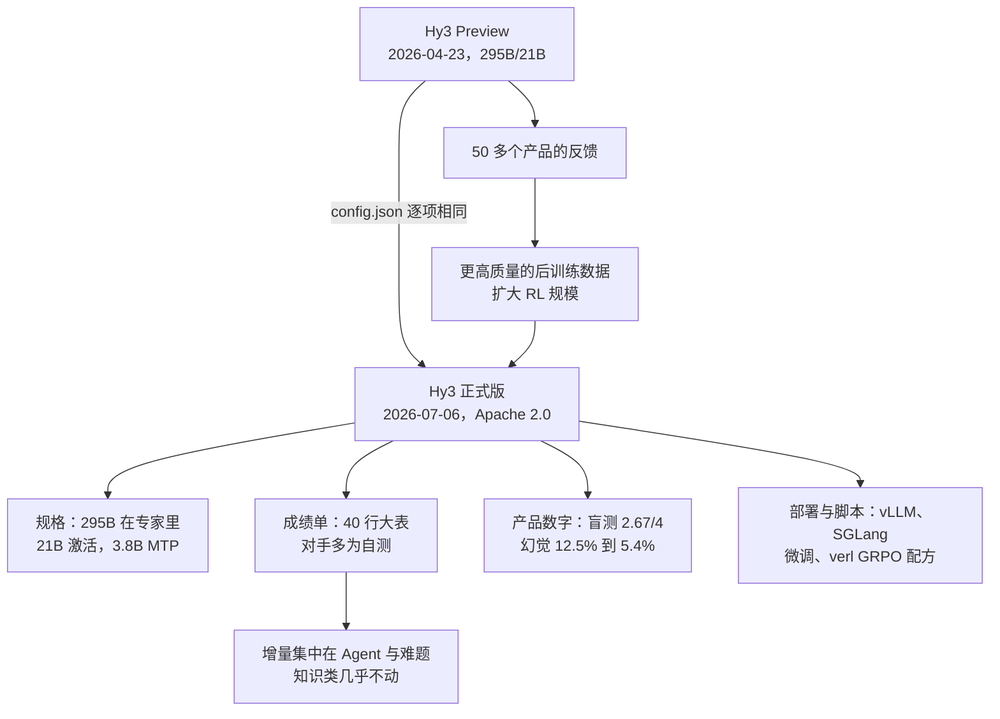

# Hy3：一张 295B 开源模型卡，给了规格与成绩单，没给训练过程

<!-- release-date: 2026-07-06 -->

> 本文依据网页原件：Hugging Face 模型卡 [tencent/Hy3](https://huggingface.co/tencent/Hy3)（英文 `README.md` 与中文 `README_CN.md`）和 GitHub 仓库 [Tencent-Hunyuan/Hy3](https://github.com/Tencent-Hunyuan/Hy3) 的 README（两者正文一致），连同仓库里的 `config.json`、`chat_template.jinja`、`finetune/README.md` 与 `rl/README.md`。访问日期 2026-09-29。页面没有小节编号，下文按原文小节名引用，如「原文 Model Introduction 节」；成绩数字大多只出现在图里，引用时注明读自哪张图。官方没有发布技术报告。文中区分三件事：**原件明确写了什么**、**我们怎么解释或推算它**、**哪些是外部资料补充**。

## 阅读前先认识几个词

- **MoE（Mixture-of-Experts，混合专家）**：把前馈网络拆成很多个「专家」小网络，每个 Token 只让其中几个干活。总参数可以很大，单次计算量却不必同比增长。
- **激活参数**：处理一个 Token 时真正参与计算的参数量。Hy3 总参数 295B，激活 21B。
- **GQA（Grouped-Query Attention，分组查询注意力）**：多个查询头共用一份 Key 和 Value，用来缩小生成时要缓存的 KV。
- **MTP（Multi-Token Prediction，多 Token 预测）**：额外挂一层，一次预测后面几个 Token，推理时当投机解码的草稿，由主模型并行验证。
- **快慢思考**：同一套权重，靠请求里的 `reasoning_effort` 字段切换是否先写一段思维链。
- **脚手架（scaffold / harness）**：把模型包成 Agent 的那层程序——给什么工具、多少轮、多长超时。同一个模型换脚手架，Agent 分数可以差很多。

## 一句话先说清

Hy3 是腾讯混元团队开源的指令模型：295B 总参数、21B 激活参数，另有 3.8B 的 MTP 层，上下文 256K，Apache 2.0 许可（原文 Model Introduction 节、License 节）。

它的模型卡是一份**规格说明书加一张成绩单**，不是一篇训练论文：

- 讲清了架构尺寸、部署命令、微调与强化学习的脚本入口；
- 给了一张 11 个模型、40 个基准的对比大表，外加几条产品侧的内部评测数字；
- **没有**预训练数据、Token 量、算力、训练超参、消融，也没有技术报告。

模型卡自己对这次发布的定位只有一句：4 月底发布 Hy3 Preview 后，从 50 多个产品收集反馈，用更高质量的数据扩大了后训练（原文 Model Introduction 节）。本文对照了两版的 `config.json`，除一个无关的 dtype 字段外逐项相同——正式版与 Preview 是**同一个架构、只换了后训练**。

所以读这张卡，要回答的不是「它怎么训出来的」，而是三件事：

1. 295B 与 21B 这两个数落在网络的哪里，部署要多大机器；
2. 成绩单上哪些数是自报、哪些是自测对手、哪些是内部基准；
3. 「只改后训练」换来了什么、没换来什么。

## 先看全景：295B 放在哪，21B 用在哪

模型卡给的规格表（原文 Model Introduction 节）：

| 项 | 值 |
|---|---|
| 总参数 / 激活参数 / MTP 层参数 | 295B / 21B / 3.8B |
| 层数（不含 MTP） / MTP 层数 | 80 / 1 |
| 注意力 | 64 个查询头，GQA 8 个 KV 头，每头 128 维 |
| 隐藏维度 / FFN 中间维度 | 4096 / 13312 |
| 专家 | 192 个，每 Token 激活 top-8 |
| 上下文 / 词表 | 256K / 120832 |
| 支持精度 | BF16 |

`config.json` 还多交代了几件表里没有的事：第 1 层是稠密 FFN（`first_k_dense_replace = 1`），其余 79 层是 MoE；每个专家的中间维是 1536，另有 1 个共享专家；路由用 sigmoid 打分并带逐专家偏置（`moe_router_use_sigmoid`、`moe_router_enable_expert_bias`），`rl/README.md` 明说这是「无辅助损失」的负载均衡，训练时不加均衡损失；注意力带 QK 归一化；RoPE 的 base 是 11158840；词嵌入与输出层不共享。

上图的拆分是本文按这些配置推算的：

- **总量几乎全在路由专家里。** 每个专家是 3 个 $4096 \times 1536$ 的矩阵，79 层 × 192 个，约 286.3B，占 295B 的 97%。
- **激活量是 21B 的来历。** 每个 Token 只点亮 8 个路由专家，约 11.9B；注意力 80 层约 6.0B；共享专家约 1.5B；词嵌入、输出层与首层 FFN 约 1.2B。合计约 20.7B，与卡上的 21B 吻合。
- **MTP 另计。** 1 层注意力加 1 层 192 专家的 MoE，约 3.75B；每步草稿只激活约 0.28B，是主干的七十分之一左右。
- **对账。** $295.0 + 3.75 \approx 298.8$B，与 Hugging Face 统计的权重张量总数 298,786,155,776 对得上。所以 295B 不含 MTP，托管页显示的约 299B 就是两者之和。

这张账有一个实用推论：**部署看 295B，计算看 21B。** 显存要装下全部专家，每个 Token 的算力却只花在其中很小一部分上。

### 部署要多大机器

模型卡只写了一句：8 卡部署建议用 H20-3e 或显存更大的卡（原文 Deployment 节）。按上面的配置可以把这句话算清楚（本文算术）：

- **权重**：约 298.8B 参数 × 2 字节 ≈ 598 GB（BF16）。SGLang 官方 cookbook 写的是「约 590GB」（外部补充）。
- **KV Cache**：每个 Token 每层存 K、V 各 8 头 × 128 维，80 层共 $2 \times 8 \times 128 \times 80 = 163{,}840$ 个元素，BF16 下约 320 KB。一条 256K 的请求约 80 GiB。
- **结论**：8 × H20-3e（141 GB）合计约 1128 GB，放下权重后还剩五百多 GB 给 KV；8 × H100（80 GB）合计 640 GB，放完权重只剩约 40 GB，连一条满长请求都装不下。vLLM 官方 recipe 也写明 8 × H100 或 A100 80GB 需要跨节点（外部补充）。

GQA 把 KV 头压到 8 个，是 256K 上下文能在单机上讨论的前提；如果是 64 个 KV 头的标准多头注意力，每 Token 缓存要大 8 倍。

## 成绩单：一张 40 行的大表

原文 Benchmark Appendix 节整节就是一张图（`assets/benchmark-appendix.png`），没有文字表格。下面把它转写成表。原图用星号标「我们自己测的」，这里改用 † 标出；带斜杠的格子原图就写着两个数，脚注没有解释两个数分别是什么。

对照模型共 9 个，下表选 5 个最常被拿来比的，其余几列（GLM-5.1、DeepSeek-V4 flash、Seed-2.1 pro、Gemini-3.1-pro-preview）只在正文引用时给出。

### 公开基准

| 分组 | 基准 | Preview | Hy3 | GLM-5.2 | DeepSeek-V4 pro | Qwen-3.7 Max | Claude-opus-4-8 | GPT-5.5 |
|---|---|---:|---:|---:|---:|---:|---:|---:|
| Agent 编程 | SWE-bench Multilingual | 68.3 | 75.8 | 83.0† | 76.2 | 78.3 | 84.4 | 77.3† |
| | SWE-bench Verified | 74.4 | 78.0 | 84.2† | 80.6 | 80.4 | 88.6 | 84.4† |
| | SWE-bench Pro | 46.0 | 57.9 | 62.1 | 55.4 | 60.6 | 69.2 | 58.6 |
| | Terminal-Bench 2.1 | 58.0 | 71.7 | 81/77.3† | 64/60.5† | 75/71.5† | 85/85.4† | 84/79.8† |
| | NL2repo | 35.3 | 45.6 | 48.9 | 41.5† | 47.2 | 69.7 | 50.7 |
| | DeepSWE | 0.9 | 28.0 | 46.2/42.5† | 8.0/9.7† | 18.0/14.2† | 58.0/62.8† | 70.0/70.8† |
| Agent 搜索 | BrowseComp | 67.1 | 84.2 | — | 83.4 | — | 84.3 | 84.4 |
| | WideSearch | 67.8 | 76.4 | — | 75.7† | 72.3† | 72.9† | 80.0† |
| | DeepSearchQA | 82.8 | 91.0 | — | 90.4† | 88.4† | 93.1 | 95.5† |
| 工作型 Agent | MCP Atlas（公开集） | 66.1 | 79.1 | 76.8/82.6† | 73.6/79.7† | 76.4/79.6† | 82.2/84.1† | 81.6/82.9† |
| | Toolathlon | 32.1 | 48.5 | 48.2/46.6† | 51.8/45.7† | 45.1† | 59.9 | 55.6 |
| | Apex-Agent（pass@1） | 12.4 | 25.6 | 29.9† | 20.4† | 22.2† | 42.5 | 38.4 |
| | ClawEval（pass^3） | 55.0 | 68.5 | 62.4† | 58.4/62.1† | 65.2 | 72.1† | 67.8† |
| | WildClawBench（35 题，纯文本） | 45.3 | 53.6 | 59.2† | 50.5† | 41.5† | 58.4† | 63.2† |
| | SkillsBench（79 题，纯文本） | 29.1 | 55.3 | 51.9† | 40.5† | 59.2/46.8† | 64.6† | 61.6† |
| 科研 Agent | HLE（带工具，纯文本） | 35.4 | 53.2 | 54.7 | 48.2 | 53.5 | 57.9 | 52.2 |
| 推理 | GPQA Diamond | 87.2 | 90.4 | 91.2 | 90.1 | 92.4 | 93.6 | 93.6 |
| | HLE（无工具，纯文本） | 30.0 | 37.0 | 40.5 | 37.7 | 41.4 | 49.8 | 46.9† |
| | FrontierScience-Research | 19.0 | 21.3 | 19.8† | 21.3† | 24.8† | 32.9† | 33.9 |
| | FrontierScience-Olympiad | 70.0 | 74.8 | 72.5† | 70.0† | 74.3† | 74.3† | 73.8† |
| | USAMO 2026 | 37.3 | 72.0 | 41.3† | 59.2† | 57.1† | 92.9† | 98.4† |
| | MathArena Apex | 12.6 | 38.7 | 16.8† | 38.3 | 44.5 | — | 85.4† |
| | ArxivMath | 46.1 | 52.2 | 44.2† | 56.4† | 56.0† | 71.8 | 71.5 |
| | HorizonMath（pass@12） | 1.8 | 7.1 | 7.1† | 5.3† | 6.2† | — | 11.6† |
| | PHYBench | 71.4 | 77.4 | 71.5† | 75.4† | 76.5† | 79.6† | 77.5† |
| | CMT-Benchmark | 19.4 | 37.8 | 34.1† | 35.0† | 40.0† | 43.8† | 43.6† |
| | IMOAnswerBench | 84.3 | 90.0 | 91.0 | 89.8 | 90.0 | 83.5 | 92.1† |
| | SuperChem | 47.0 | 54.9 | 60.2† | 61.2† | 60.5† | 66.9† | 66.2† |
| 上下文学习 | CL-bench | 22.8 | 23.8 | 23.1† | 18.1† | 18.4† | 24.8† | 27.8† |
| | CL-bench life | 15.7 | 17.0 | 21.0† | 14.3† | 13.0† | 16.9† | 21.1† |
| | AA-LCR | 66.3 | 73.4 | 73.4† | 71.3† | 70.2† | 72.2† | 76.4† |

### 腾讯内部基准

| 基准 | Preview | Hy3 | GLM-5.2 | Claude-opus-4-8 | GPT-5.5 |
|---|---:|---:|---:|---:|---:|
| Hy-Backend 2.0 | 12.2 | 25.0 | 30.4† | 38.9† | 38.7† |
| Hy-SWE Max | 30.0 | 49.0 | 63.1† | 63.2† | 65.4† |
| Hy-CompanyBench | 8.3 | 41.7 | 55.0† | 65.0† | 51.7† |
| e-bench | 10.9 | 50.2 | 52.3† | 68.8† | 72.0† |
| Hy-FinModelBench | 26.6 | 69.0 | 77.2† | 74.3† | 85.1† |
| ProdBench（pass^3） | 10.3 | 23.0 | 21.4† | 27.8† | 21.4† |
| Hy-SkillsWorld | 26.4 | 45.8 | 56.9† | 59.7† | 56.9† |
| Hy-Euler pro（带工具） | 2.3 | 24.2 | 42.4† | 64.4† | 77.3† |
| Hy-Math | 26.1 | 60.9 | 16.4† | — | 91.4† |

（两张表均读自原文 Benchmark Appendix 节的图，† 为原图星号，即腾讯自测。）

### 这张表怎么读

**第一，Preview → 正式版的增量分布很不均匀。** 增幅最大的几行都是 Agent 与难题：e-bench +39.3、Hy-FinModelBench +42.4、USAMO 2026 +34.7、Hy-CompanyBench +33.4、DeepSWE 从 0.9 到 28.0、MathArena Apex +26.1、SkillsBench +26.2。增幅最小的是知识与上下文学习：CL-bench +1.0、CL-bench life +1.3、FrontierScience-Research +2.3、GPQA Diamond +3.2、SWE-bench Verified +3.6（本文按表相减）。这与「架构不变、只加后训练」的叙事一致：后训练改的是**怎么用工具、怎么把长任务做完**，很少改变模型**知道多少**。

**第二，和对手比，Hy3 在同尺寸里强，离闭源旗舰还有距离。** 公开基准里 Hy3 明显领先的是 BrowseComp（84.2，与 Claude-opus-4-8 的 84.3、GPT-5.5 的 84.4 持平，只低于 Seed-2.1 pro 的 86.2 与 Gemini-3.1-pro-preview 的 85.9）和 DeepSearchQA；仓库级编程（SWE-bench Verified 78.0 对 Claude 的 88.6）、Terminal-Bench 2.1、竞赛数学（USAMO 72.0 对 GPT-5.5 的 98.4†）和 HLE 仍有明显差距。和它明着比的开源对手 GLM-5.2，多数 Agent 行都在 Hy3 之上。

模型卡说 Hy3「比肩参数量大 2–5 倍的旗舰开源模型」（原文 Model Introduction 节），但卡上没有列对手的参数量。作为外部补充：Nemotron-3-Ultra 一篇的对照表把 GLM-5.1 写作 744B-A40B、DeepSeek-V4-Pro 写作 1.6T-A49B，分别约是 295B 的 2.5 倍与 5.4 倍。

**第三，对手的分数大多是腾讯自测。** Agent 行里对照列几乎全带 †。脚注说所有模型的推理档位都拉到最高、SWE-Bench 系列用 SWE-agent 脚手架、Terminal-Bench 2.1 用 Terminus-2（超时 4 小时、16 核 CPU、32 GB 内存、最多 500 轮）、NL2Repo 用 Claude Code（250 轮、12000 秒）、MCP-Atlas 按 Scale 2026 年 4 月的方法以 Gemini 2.5 Pro 当裁判、ClawEval 用内部脚手架与 Gemini-3.5-flash 当裁判、Agent 搜索用内部脚手架（原图 Notes）。**同一套脚手架跑所有模型，公平是公平了，但这套脚手架是腾讯选的。**

**第四，斜杠两数没有解释。** Terminal-Bench 2.1、DeepSWE、MCP Atlas、Toolathlon 等行的对照格里常有「81/77.3」这样的两个数，Notes 里没有说明各是什么（比如官方报告值与自测值）。

**第五，首页主图是这张大表的子集，挑数方式没有交代。** 原文 Stronger Agent Capabilities 节的主图（`assets/benchmark.png`）是 12 个小柱状图，每格只放 5 个对手，而且每格挑的对手不同。本文逐格对回大表，有三处要知道：

- BrowseComp 那格标着 GLM 图标的是 79.3，在大表里是 GLM-5.1 的数（GLM-5.2 那格为空），而主图图例写的是 GLM5.2；
- FrontierScience-Olympiad 那格 Hy3 的 74.8 看上去最高，但大表里 Gemini-3.1-pro-preview 是 79.0，没放进这格；Seed-2.1 pro 的格子写着「75/70.1」，主图取了 70.1；
- SkillsBench 那格 Qwen3.7 Max 取了「59.2/46.8」里的 46.8，另一个数 59.2 高于 Hy3 的 55.3。

这些不是错数，但说明**只看首页主图会高估 Hy3 的相对位置**，要回到大表看全列。

## 产品侧的数字：只有结论，没有评测集

模型卡最用力论证的其实不是榜单，而是「实用」。原文 Stronger Agent Capabilities 节说公开榜不能说明全部，于是：

- **270 位专家盲测**：用各自工作里的任务打分，Hy3 均分 2.67/4，GLM-5.1 为 2.51/4，前端开发、数据与存储、CI/CD 类优势最明显。

原文 More Reliable Product Experiences 节又给了三组内部数字：

| 维度 | 之前 | 之后 |
|---|---:|---:|
| 幻觉率 | 12.5% | 5.4% |
| 常识错误率 | 25.4% | 12.7% |
| 多轮问题率（指代消解、省略还原、多轮约束继承） | 17.4% | 7.9% |
| MRCR（长对话理解，只见于中文卡） | 42.9% | 75.1% |

以及跨脚手架稳定性：在 CodeBuddy、Cline、KiloCode 等脚手架上跑 SWE-bench Verified，英文卡写「accuracy variance」在 4% 以内，中文卡写「分数标准差」在 4 个百分点以内——两版用的统计量说法不同，也没有给出各脚手架的分数。

怎么看这些数：

- 盲测只和 GLM-5.1 比，而大表里更强的 GLM-5.2 没有进盲测；2.67/4 是四分制里的中上，不是接近满分；专家构成、题目、每个模型是否同一套题都没写。
- 幻觉、常识、多轮三组数都没有评测集名字，「之前」指 Preview 还是更早的模型也没写（从上下文推测是 Preview）。它们能说明「产品侧声称变好了」，不能对标任何公开榜。
- 大表里没有 MRCR 这一行，75.1% 只有中文卡里一句话。

## 快慢思考：一套权重，三个档位

`reasoning_effort` 取 `no_think`、`low`、`high` 三个值（原文 Quickstart 节）。`chat_template.jinja` 里：没传这个字段时默认 `no_think`；传了别的值会直接报错；另有一个 `reasoning_toolcall_retry` 回退策略，会强制切到 `high`。推荐采样参数是 temperature 0.9、top_p 1.0。

原件内部有一处说法不一致：Quickstart 与模板都以 `no_think` 为默认，`finetune/README.md` 却写「模型的默认输出是慢思考模式」。以模板为准，线上不传字段就是不思考。

这件事对读成绩单很重要：大表脚注说所有模型都拉到最高推理档位，那些分数对应的是 `high`；线上默认的 `no_think` 延迟与费用完全是另一档。拿 `no_think` 的速度配 `high` 的分数，是常见的误读。

## 部署：命令会过时，显存账不会

模型卡给了两套从源码安装的启动命令（原文 Deployment 节）：

| | vLLM | SGLang |
|---|---|---|
| 并行 | `--tensor-parallel-size 8` | `--tp-size 8` |
| 工具与推理解析器 | `hy_v3` | `hunyuan` |
| MTP | `--speculative-config.method mtp`，草稿 2 个 Token | EAGLE，2 步、每步 top-1、3 个草稿 Token |

两边解析器名字不同，是因为各引擎各自实现；SGLang 的 cookbook 解释了原因：正式版 tokenizer 给每个特殊符号加了统一后缀（如 `<tool_calls:TAG>`），解析器要在运行时从词表里查出真实符号，同一套解析器因此能同时服务没有后缀的 Preview 和有后缀的正式版（外部补充）。

跟进模型卡链接的两份引擎文档（外部补充，不是模型卡正文）：

- **vLLM recipe**：要求 vLLM 0.28.0 及以上，有专用镜像 `vllm/vllm-openai:hy3`；8 × H200、8 × H20-3e、8 张 AMD MI300X 系列可单机跑 BF16，8 × H100 或 A100 80GB 要跨节点；AMD 上需设 `VLLM_ROCM_USE_AITER_MOE=0` 避开 MoE 内核崩溃。它还给了一组 FP8 权重在 4 × GB300、输入 8192 输出 1024、并发 32 下的测量：输出吞吐 934.26 Token/秒，平均首 Token 延迟 2352.29 毫秒。这是引擎侧的数，不是模型卡的。
- **SGLang cookbook**：BF16 权重约 590GB；默认 `no_think`；`reasoning_effort: max` 会被拒，要用 `high`。

量化只给了两样东西：独立的 FP8 权重仓 `tencent/Hy3-FP8`，以及指向腾讯压缩工具包 AngelSlim 的链接（原文 Quantization 节）。没有 FP8 相对 BF16 的掉分表。

## 微调与 RL：能复现的是脚本，不是分数

### 微调（`finetune/README.md`）

- **数据格式**：每条样本带 `reasoning_effort`，慢思考样本的思考内容放在 `reasoning_content` 字段里。
- **硬件**：在序列长 4096、不开 ZeRO-3 offload 的测试条件下，LoRA 至少单机 8 卡、每卡 80GB；全量微调至少 4 机 32 卡。
- **三条路径**：DeepSpeed 原生脚本、LLaMA-Factory、ms-swift 4.2.2。LLaMA-Factory 的 LoRA 默认 rank 64、alpha 128，学习率全量 $1\times10^{-5}$、LoRA $2\times10^{-4}$，全量可把 `cutoff_len` 设到 262144；ms-swift 的 LoRA 默认 rank 8、alpha 16，LoRA 学习率 $3\times10^{-4}$。两边默认值差 8 倍，是工具默认，不是架构建议。
- **两个坑**：ms-swift 默认模板把 `<｜hy_eos｜>` 当字符串，会被切成多个 Token、生成停不下来，必须加载仓库里的补丁；训练加载时线性层 bias 缺失的警告可以忽略，但路由器的 `e_score_correction_bias` 是 buffer，加载失败不能忽略。
- ZeRO-3 下 LoRA 权重不能在训练中合并，要离线执行合并脚本。

### RL（`rl/README.md`）

这一页是**在 verl 框架上跑 GRPO 的社区配方**，不是 Hy3 自己的后训练记录：训练用 Megatron-LM（通过 Megatron-Bridge 在线转换权重），rollout 用 vLLM，默认数据是 DAPO-Math-17k、验证集是 AIME-2024。与 Hy3 相关的必需设置只有三条：开启逐专家偏置、偏置更新率设为 0（冻结）、不加负载均衡损失。

页面给了一次示例运行：128 张 H20，每步 128 个 prompt × 16 个采样，学习率 $1\times10^{-6}$，裁剪 0.2/0.28（dual-clip 常数 10），不加 KL，最大回复 8192 Token，温度 0.9。配图 `assets/rl-training.png` 是这次运行约 190 步的六条曲线：rollout 与训练的对数概率差始终低于 0.015、训练奖励从约 0.4 升到 0.7–0.8、验证准确率从约 0.84 升到约 0.877 后回落到约 0.86（读自该图）。页面说奖励和验证分「稳步增长」，但图上的验证曲线先跌后涨、末段回落，并不单调。

这张图能说明「Hy3 可以在 verl 上稳定地跑 GRPO」，不能说明官方后训练用了什么奖励、多少数据、多大算力。

## Preview 与正式版不要混

| 项 | Hy3 Preview | 正式 Hy3 |
|---|---|---|
| 公开时间 | 2026-04-23 | 2026-07-06 |
| 架构 | 295B / 21B / 256K | 与 Preview 的 `config.json` 逐项相同 |
| 许可证 | Tencent Hy Community License | Apache 2.0 |
| 权重仓 | `tencent/Hy3-preview` | `tencent/Hy3`、`tencent/Hy3-FP8` |
| tokenizer 特殊符号 | 无后缀 | 统一带后缀 |

许可证与 tokenizer 两行来自 Preview 模型卡与 SGLang cookbook（外部补充）。所以 Preview 的许可证不能用正式版的 Apache 2.0 回溯覆盖，Preview 的模板与解析也不能假定直接套用正式版。

腾讯混元官方博客的发布文还给了几组产品数字（外部补充，不是模型卡正文）：WorkBuddy 内部测评里，相比 Preview，任务解决率从 72% 升到 90%、平均耗时缩短 34%；高频办公任务上 Token 消耗低于 GLM-5.2，文档处理省 47.4%、PPT 制作省 49.0%；API 价格为每百万 Token 输入 1 元、输出 4 元、缓存命中 0.25 元；以及「1 月底重建基础设施，4 月发布 Preview」的时间线。

## 模型卡没有公开的

- 预训练 Token 量、数据配比、语言与代码比例；
- 训练算力、GPU 型号与时长、并行策略；
- 路由与负载均衡的训练细节（只能从配置看出是 sigmoid 路由加偏置）、共享专家与专家粒度的消融；
- MTP 的训练目标与接受率，以及开 MTP 后的实际加速；
- 后训练的数据规模、奖励设计、SFT 与 RL 各占多少；
- 270 人盲测的题目与评分细则，幻觉、常识、多轮三组内部评测的数据集；
- 大表里斜杠两数的含义；
- FP8 相对 BF16 的精度表；
- 技术报告。

## 最值得带回自己项目的四条

### 1. 读 MoE 规格，先分开「部署量」和「计算量」

295B 决定要几张卡，21B 决定每个 Token 花多少算力，3.8B 的 MTP 另算。把三件套一起说，才不会在「这是个 20B 小模型」和「这要一千张卡」之间摇摆。

### 2. 从配置文件能推出模型卡没写的东西

一个 `config.json` 就能把 295B 拆到每一类矩阵、算出每 Token 的 KV 大小、判断哪种卡能单机部署，并和权重文件的参数总数对账。模型卡越简略，这一步越值钱。

### 3. 只改后训练，先涨的是 Agent 行为，不是知识

Preview 与正式版同一架构，增量集中在 Agent 与难题，GPQA、上下文学习几乎不动。做产品迭代时，如果手里只有后训练预算，应当预期它主要改变「会不会用工具、能不能坚持把任务做完」。

### 4. 成绩单要回到全表、回到脚注

首页主图每格挑五个对手、斜杠两数取其一；对手分数多为自测；脚手架由发布方选。引用 Agent 分数时，要连同「哪个脚手架、谁测的、哪一档思考」一起引。

## 用一张图重新串起全文

## 关键词回看

- **激活参数**：处理一个 Token 真正参与计算的参数；Hy3 是 21B，其中路由专家约 11.9B。
- **路由专家 / 共享专家**：前者 192 个里每次选 8 个，后者每个 Token 都走；Hy3 有 1 个共享专家。
- **无辅助损失负载均衡**：不加均衡损失，靠路由打分上的逐专家偏置调节负载；Hy3 的 RL 配方里把偏置冻结。
- **GQA**：64 个查询头共用 8 组 KV，每 Token 缓存约 320 KB（BF16）。
- **MTP**：挂在主干后的 1 层草稿模块，约 3.75B，每步草稿只激活约 0.28B。
- **`reasoning_effort`**：`no_think`、`low`、`high` 三档，模板默认 `no_think`，成绩单用的是最高档。
- **脚手架**：包裹模型的 Agent 程序；同一模型换脚手架分数会变，所以大表脚注逐项规定了脚手架。
- **自测（†）**：发布方用自己的脚手架给对手跑的分数。

## 最后的判断

Hy3 的模型卡证明了三件事：腾讯把一个 295B、21B 激活的 MoE 以 Apache 2.0 开源，并同时给了 BF16 与 FP8 权重；这一版相对 Preview 只动了后训练，换来的是 Agent 与难题上的大幅提升；发布方愿意把脚手架配置写进脚注，而不是只报一个峰值。

它证明不了的是：训练用了什么、花了多少；产品侧那些「之前 → 之后」的数字在公开数据上能否复现；以及在不是腾讯选的脚手架上，它和 GLM-5.2、Claude-opus-4-8 的真实差距。

证据强度分三层：

- **可核验的**：规格与配置（本文据此对上了权重文件的参数总数）、部署命令、微调与 RL 脚本。
- **官方自报、可以对表的**：40 行大表，包括大量自测的对手分数。
- **官方自报、无法对表的**：270 人盲测、幻觉与常识错误率、多轮问题率、MRCR，以及跨脚手架差异在 4% 以内。

如果只带走一句：

> **一张模型卡里最可靠的是 `config.json`，最需要小心的是首页那张柱状图。**

## 资料与阅读边界

**原始依据**

- Hugging Face 模型卡 https://huggingface.co/tencent/Hy3 与 GitHub 仓库 https://github.com/Tencent-Hunyuan/Hy3，2026-09-29 访问。仓库最后一次改动在 2026-07-20（`config.json` 补了一个 dtype 字段），README 最后一次改动在 2026-07-17（加入 RL 一节），两张成绩图自 2026-07-06 首发起未变；GitHub README 与 Hugging Face 英文卡正文一致，只有相对链接写法不同。发布当天的首版英文卡措辞与现行版略有不同，例如曾写盲测收集了 312 份有效对比，现行版删去了这个数。
- 页面没有标注发布日，也没有「技术报告待发布」之类的声明；截至访问日未找到官方技术报告。

**首发日证据**

- [腾讯混元官方博客「Hy3 正式发布」](https://hunyuan.tencent.com/research/hy3) 署期 2026 年 7 月 6 日，写明当日以 Apache 2.0 在 GitHub、Hugging Face、ModelScope、AtomGit 开源并下调 API 价格；新华网等同日报道「7 月 6 日，腾讯混元 Hy3 正式发布」。
- Hugging Face 权重仓的提交记录里，权重文件在 2026-07-04（UTC）上传，模型卡 `README.md` 与 `README_CN.md` 在 2026-07-06 才首次提交；GitHub 仓库的首个提交在 2026-07-05。按本库口径，权重仓会提前建好、发布当天才公开，7 月 4 日的文件上传只作预置旁证。因此 `release-date` 取 **2026-07-06**。
- Hy3 Preview 的公开日 2026-04-23 取自新华网报道；它是另一个具名 checkpoint，不影响本文日期。

**跟进过的链接与取到的背景（均为外部补充）**

- 腾讯混元官方博客发布文：WorkBuddy 任务解决率与耗时、相对 GLM-5.2 的 Token 节省、API 价格、研发时间线。
- [vLLM recipe](https://recipes.vllm.ai/tencent/Hy3)：引擎版本、硬件下限、AMD 环境变量、FP8 吞吐测量。
- SGLang cookbook（本地 `projects/推理服务/sglang/docs/cookbook/autoregressive/Tencent/Hy3.mdx`，与模型卡所链线上版同源）：BF16 权重约 590GB、tokenizer 特殊符号后缀、`reasoning_effort` 的用法。
- [Hy3-preview 模型卡](https://huggingface.co/tencent/Hy3-preview)：许可证为 Tencent Hy Community License；其 `config.json` 与正式版逐项相同。
- [verl](https://github.com/volcengine/verl) 的 Hy3 GRPO 脚本、DAPO-Math-17k 与 AIME-2024 数据集：RL 页面示例运行的背景。
- 对手模型的参数量取自 Nemotron-3-Ultra 一篇所依据报告的表 10。
- 大表里的多数基准只在图上出现名字，模型卡没有逐个说明它们测什么；本文只转写分数与脚注，不替原件补定义。

**本文做的推算与读图**

- 参数拆分、KV 缓存大小、显存余量都是按 `config.json` 的算术；两张成绩表与主图的三处对照是本文读图所得；RL 曲线的数值是读图近似。
