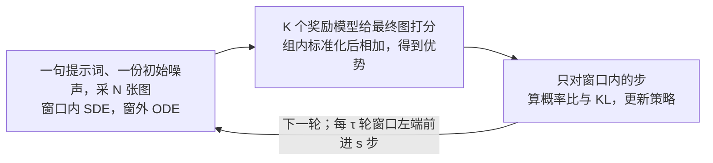

# MixGRPO：GRPO 不必在每一步都走 SDE

<!-- release-date: 2025-07-29 -->

> 本文依据腾讯混元主导的 **MixGRPO: Unlocking Flow-based GRPO Efficiency with Mixed ODE-SDE**，arXiv:2507.21802v7，2026-06-28，共 36 页。页码均指 PDF 文件自身页码；附录从 p. 19 起把印刷页码重新从 1 算，不要拿附录页脚去对。文中始终区分三件事：**报告写了什么**、**我们如何解释**、**哪些是外部补充**。从图上读出来的数会明说。

## 读前先把几个词说成人话

这篇是本站 Flow-GRPO 一篇的直接后续。Flow-GRPO 回答的是「确定的流模型怎么才能做在线强化学习」；本篇假设那件事已经成立，追问一句更实际的话：**每一步都随机、每一步都拿去优化，是不是买贵了。**

- **流匹配（flow matching）与校正流（rectified flow）**：在干净图和噪声之间拉一条直线，网络学这条线上每一点的速度，推理时从噪声沿速度走回去。本篇主实验的底板是 FLUX.1-dev。
- **常微分方程（ODE）**：给定当前位置和速度，下一步被完全决定。同一份噪声、同一句提示词，走 ODE 得到同一张图。
- **随机微分方程（SDE）**：速度之外再加一项随机扰动，同一步可以走出很多条不同的路。前作正是靠它把去噪写成「可以写出概率」的策略。
- **马尔可夫决策过程（MDP）**：把「从噪声走到干净图」看成一串状态和动作。奖励只在最后一张图上给一次。
- **组相对策略优化（GRPO）**：同一句提示词采一组图，用组内平均分当尺子，不另训价值网络。出处是 DeepSeekMath。
- **函数求值次数（NFE）**：训练里网络被前向了多少次。本篇把它拆成两截：$\mathrm{NFE}_{\pi_{\theta_{\mathrm{old}}}}$ 是旧策略把整张图走完、好去打分的次数；$\mathrm{NFE}_{\pi_\theta}$ 是当前策略只为算重要性比而前向的次数（PDF p. 9）。
- **信噪比（SNR）**：这一步的图里，干净信号相对噪声有多强。去噪早期 SNR 低，决定的是「这是牛还是马」；后期 SNR 高，决定的是毛发和纹理。

## 一句话先说清

Flow-GRPO 和 DanceGRPO 已经证明：把流模型的 ODE 改写成边际不变的 SDE，就能对同一句提示词采出一组不同的图，再用 GRPO 往奖励上推。

代价是 MDP 的**每一个去噪步**都要随机采样，也几乎都要进优化。DanceGRPO 的补丁是随机抽一部分步来更新，但步数一少，分就掉：

MixGRPO 的回答不是再发明一种强化学习算法，而是重新分配采样器的职责（PDF p. 1–3）：

1. 只在一条**滑动窗口**里走 SDE，也只对窗口内的步做 GRPO；
2. 窗口外走 ODE，这些步不进重要性比，也不进 KL；
3. 窗后的 ODE 既然不参与优化，就可以用 DPM-Solver++ 这类高阶求解器走快，得到 **MixGRPO-Flash**；
4. 窗口内的随机离散还可以从标准 SDE 换成 **CPS**（保系数采样），少一点颗粒伪影，奖励信号更干净。

头条数字在摘要与 Table 1（PDF p. 1、p. 9），口径要先说清：

- 相对 DanceGRPO 官方设定（25 步里随机优化 14 步，每轮 291.284 秒），MixGRPO 只优化 4 步、每轮 149.326 秒，训练时间约少一半；
- 摘要写 MixGRPO-Flash 能少约 71%。表里对上 71% 的是冻住窗口的 **MixGRPO-Flash\***（83.278 秒）；不带星号的 Flash 是 112.372 秒，约少 61%（本文计算）；
- 对齐指标同时涨：FLUX 底座的 ImageReward 从 1.088 到 1.645，高于 DanceGRPO 的 1.436（PDF p. 9）。引言写的 1.629 是 SDE 版，Table 1 这行已经换成了 CPS（PDF p. 3、p. 14）。

如果只记一句：

> **策略梯度需要随机性，但不需要整条轨迹每一步都随机。把 SDE 关进一条会移动的窗口，窗外走确定的 ODE，GRPO 照样写得出来，账单却短了一大截。**

### 一条阅读路线

36 页里正文到 p. 14 结束，p. 15–18 是参考文献，p. 19 起是附录。只有半小时，建议这样读：

1. **p. 2 Figure 1 与 p. 4 Figure 2**：砍步掉分的矛盾，以及窗口怎么摆；
2. **p. 4–6 式 1–10**：混合采样怎么写，窗外为什么不进比值和 KL；
3. **p. 6–7 Algorithm 1**：窗口的三个超参 $w$、$\tau$、$s$；
4. **p. 9 Table 1**：主效率表；**p. 12–14 Table 2–10**：跨奖励、换底板、消融、求解器与 CPS；
5. **p. 24–25 附录 13**：为什么只能压窗后的 ODE；**p. 31–32 附录 17–18**：固定组内噪声，与推理期挡奖励黑客。

附录 14–15 的 80B 图像与视频实验只有曲线，第一次可以只看结论。

## 主要矛盾：随机性和优化预算被绑成了一件事

### 裂缝一：全轨迹 SDE 让优化账单和采样账单叠在一起

算重要性比，需要旧策略 $\pi_{\theta_{\mathrm{old}}}$ 和新策略 $\pi_\theta$ 在同一步上的条件概率。每一步都是 SDE，就意味着每一步都可能进入优化，前向次数随去噪步数线性涨（PDF p. 2）。

打个比方：强化学习要的是「同一场戏多拍几条，好的留下」。全轨迹 SDE 等于每个镜头都多拍、都送进剪辑室。DanceGRPO 随机抽 14 步，只是少送一些镜头去剪，拍摄本身仍是 25 个镜头全随机。

### 裂缝二：早步和晚步的梯度在抢方向

早期去噪改的是全局结构，晚期改的是细节。两种梯度同时回传到同一套权重，会互相冲突，论文把这叫「unfocused and inefficient optimization」（PDF p. 2）。随机子集没有按时间顺序组织这件冲突，只是少算一些步。

开头那张图把「少算就能便宜」这条捷径堵上了：步数砍下去，分就掉。所以本篇要修的不是「流模型能不能做 RL」，而是：**随机性和优化预算，能不能只花在此刻最值得探索的那几步上。**

## 先看全景：窗口内才是 MDP，窗外只负责把图走完

图上读不出、但要一起记住的四件事：

- 窗外的转移是确定的（狄拉克分布），这些步从重要性比和 KL 里删掉（PDF p. 6）。有效 MDP 从长度 $T$ 缩成窗宽 $w$，默认 $w = 4$（PDF p. 4、p. 13）；
- 奖励仍然只在最后一张图上给一次，窗口内每一步共享同一个优势（PDF p. 4，式 1；p. 6，式 10）；
- 窗口从低 SNR 滑到高 SNR 时，探索空间收窄。原图右半给了三档样本的协方差迹：5.05、1.51、1.06（PDF p. 4，读自该图）；
- 同一组 $N$ 张图**共用一份初始噪声**，随机性全靠窗口里的 SDE 提供，这一点跟 DanceGRPO 走（PDF p. 7，Algorithm 1 第 6 行）。附录 Table 17 显示，不固定时 HPS-v2.1、Pick Score、ImageReward 是 0.342、0.228、1.448，固定后是 0.367、0.237、1.629（PDF p. 31）。

最后一条值得多想一步。本站 Flow-GRPO 一篇记录了前作在 SD3.5-M 上的相反观察：每条 rollout 换一份初始噪声更好。两篇底板、组大小和噪声注入位置都不同，不能判谁错；**本文的读法**是，组内起点要不要锁死是一个要单独消融的旋钮，不是 GRPO 的定理。

训练循环本身很短：

上图依据 PDF p. 7 的 Algorithm 1 改写。多奖励时先对每个奖励模型做组内标准化再相加（第 17 行），默认各奖励等权（PDF p. 23）。

## 核心设计一：混合 ODE-SDE，边际还在，随机性缩短

### 旧问题

GRPO 的重要性比要求写出 $q_\theta(\mathbf{x}_{t+\Delta t}\mid\mathbf{x}_t,c)$。ODE 是一对一映射，写不出有意义的概率密度；SDE 能写，但若每一步都是 SDE，要优化的就是整条轨迹。

### 新设计

定义一个区间 $S=[t_l,t_r)\subseteq[0,1)$，只在 $S$ 里走 SDE，外面走 ODE（PDF p. 4–5，式 4、式 6）。校正流上离散之后（PDF p. 5，式 7）：

$$
\mathbf{x}_{t+\Delta t}=
\begin{cases}
\mathbf{x}_t+\boldsymbol{\mu}_\theta(\mathbf{x}_t,t)\,\Delta t+\sigma_t\sqrt{\Delta t}\,\epsilon,& t\in S\\
\mathbf{x}_t+\mathbf{v}_\theta(\mathbf{x}_t,t)\,\Delta t,& \text{其他}
\end{cases}
$$

下面一行是窗外的普通欧拉步；上面一行是窗口内的随机步，$\epsilon\sim\mathcal N(0,I)$。窗口内的漂移就是 Flow-GRPO 那套「速度加分数补偿」（PDF p. 5）：

$$
\boldsymbol{\mu}_\theta(\mathbf{x}_t,t)=\mathbf{v}_\theta(\mathbf{x}_t,t)+\frac{\sigma_t^2}{2t}\bigl(\mathbf{x}_t+(1-t)\mathbf{v}_\theta(\mathbf{x}_t,t)\bigr)
$$

于是 $t\in S$ 时，每一步的策略是一个方差已知的高斯（PDF p. 5，式 8）：

$$
q_\theta(\mathbf{x}_{t+\Delta t}\mid\mathbf{x}_t,c)=\mathcal N\bigl(\mathbf{x}_t+\boldsymbol{\mu}_\theta\Delta t,\ \sigma_t^2\Delta t\,\mathbf{I}\bigr)
$$

目标函数只在窗口上平均（PDF p. 6，式 9）。对同一句提示词采 $N$ 张图，第 $i$ 张、窗口内第 $t$ 步取

$$
\min\bigl(r_t^i(\theta)A^i,\ \operatorname{clip}(r_t^i(\theta),1-\varepsilon,1+\varepsilon)A^i\bigr)-\beta\,\mathcal J_{\mathrm{KL}}
$$

$r_t^i$ 是新旧策略在这一步的概率比，$A^i$ 是这张图的奖励减去组内均值、再除以组内标准差（PDF p. 6，式 10）。因为两边都是同方差高斯，KL 可以闭式写成两个均值的距离：

$$
\mathcal J_{\mathrm{KL}}=\frac{\lVert\mathbf{x}_{t+\Delta t}(\theta)-\mathbf{x}_{t+\Delta t}(\theta_{\mathrm{old}})\rVert^2}{2\sigma_t^2\Delta t},\qquad t\in S
$$

附录 8 用 Fokker–Planck 方程证明：在常规正则条件下，混合过程每个时刻的边际分布与纯 ODE 一致，误差只来自离散和分数近似（PDF p. 20）。人话是：窗口里路径可以分叉，但任意时刻「图整体该像什么样」仍跟原来的概率流一样。这是前作 ODE→SDE 改写的局部化版本。

读公式时有一个记号陷阱（本文的提醒）：Algorithm 1 的离散下标 $t=0,\ldots,T-1$ 是**去噪步序号**，$\mathbf{x}_0$ 是初始噪声；附录 9 的校正流连续时间里却是 $t=1$ 对应噪声、$t=0$ 对应数据（PDF p. 21，式 15）。两套 $t$ 不要混着代入。

### 收益

Table 1 是主证据（PDF p. 9，FLUX 底座）：

| 方法 | $\mathrm{NFE}_{\pi_{\theta_{\mathrm{old}}}}$ | $\mathrm{NFE}_{\pi_\theta}$ | 每轮秒数 | HPS-v2.1 | Pick Score | ImageReward | Unified Reward |
|---|---:|---:|---:|---:|---:|---:|---:|
| FLUX 底座 | / | / | / | 0.313 | 0.227 | 1.088 | 3.370 |
| DanceGRPO 官方设定 | 25 | 14 | 291.284 | 0.356 | 0.233 | 1.436 | 3.397 |
| DanceGRPO 随机 4 步 | 25 | 4 | 149.978 | 0.334 | 0.225 | 1.335 | 3.374 |
| DanceGRPO 冻在起始 4 步 | 25 | 4 | 150.059 | 0.333 | 0.229 | 1.235 | 3.325 |
| **MixGRPO** | 25 | 4 | 149.326 | **0.369** | **0.238** | **1.645** | **3.419** |
| MixGRPO-Flash | 平均 16 | 4 | 112.372 | 0.358 | 0.236 | 1.528 | 3.407 |
| MixGRPO-Flash\* | 8 | 4（冻在起始） | 83.278 | 0.357 | 0.232 | 1.624 | 3.402 |

公平性那两行最有信息量：把 DanceGRPO 也砍到 4 步，时间和 MixGRPO 几乎一样，分却全面落后。所以 MixGRPO 的好处不是「只优化 4 步所以快」，而是**同样 4 步，连续窗口比随机子集更会花钱**。

§4.2 正文写 MixGRPO 把每轮时间从 291.284 秒降到 150.839 秒，与表里的 149.326 秒不一致（PDF p. 10 与 p. 9）；本文跟表。

### 代价与边界

- **等价的是边际，不是单条路径**，与 Flow-GRPO 同一句话；
- **窗外没有探索**。关键决策若发生在窗外，窗口再怎么滑也吃不到；
- **没有 Flash 时，rollout 侧的 NFE 没降**：旧策略仍要走完 25 步才能打分（PDF p. 6）；
- **KL 的参考是 $\theta_{\mathrm{old}}$**：式 10 如此书写，与式 1 里对 $\pi_{\mathrm{ref}}$ 的 KL 写法不是一件事，论文没有另做对照。

### 可迁移启发

已经有一条「每一步都能写概率」的轨迹时，下一个问题不是「要不要随机」，而是**随机性的支撑集要多长**。把 MDP 视界从 $T$ 收到 $w$，就是只给当前最有杠杆的那几步发探索预算。

## 核心设计二：滑动窗口，先探索结构，再打磨细节

### 旧问题

窗口若冻死在某几步，模型会在那一段过优化，后面的细节步从未被碰过；每轮随机乱跳，又回到「不按 SNR 组织冲突」。需要的是一门随训练推进的课程，而不是又一个随机掩码。

### 新设计

沿去噪步放一个宽度为 $w$ 的窗口 $W(l)=\{t_l,\ldots,t_{l+w-1}\}$，$l\le T-w$（PDF p. 6，式 11）。三个超参管它怎么动（PDF p. 6–7）：

| 符号 | 含义 | FLUX 默认 |
|---|---|---|
| $w$ | 窗口里有几步，也就是 $\mathrm{NFE}_{\pi_\theta}$ | 4 |
| $\tau$ | 每隔多少次训练迭代挪一次 | 25 |
| $s$ | 每次左端前进几步 | 1 |

训练开始时 $l = 0$，窗口贴在最低 SNR 的一端；每 $\tau$ 次迭代 $l\leftarrow\min(l+s,\,T-w)$。默认日程叫 **progressive-constant**（匀速前移）。论文把这套课程类比成强化学习里的时间折扣：先在探索空间最大的地方定结构，再把预算挪到细节（PDF p. 2、p. 7）。这是作者的类比，不是单独的对照实验。

### 收益：消融怎么说

FLUX 上的主消融（PDF p. 13，Table 4–7），只摘读表要知道的几行：

| 设置 | HPS-v2.1 | Pick Score | ImageReward | Unified Reward |
|---|---:|---:|---:|---:|
| 冻住窗口（frozen） | 0.354 | 0.234 | 1.580 | 3.403 |
| 每轮随机位置（random） | 0.365 | 0.237 | 1.513 | 3.388 |
| 匀速前移，默认 $\tau=25$、$w=4$、$s=1$ | 0.367 | 0.237 | 1.629 | 3.418 |
| $\tau = 30$ | 0.350 | 0.229 | 1.589 | 3.385 |
| $w = 1$ | 0.359 | 0.234 | 1.629 | 3.235 |
| $w = 6$ | 0.370 | 0.238 | 1.547 | 3.398 |
| $s = 3$ | 0.370 | 0.236 | 1.578 | 3.404 |

（消融表用的是 SDE 版，默认行的 ImageReward 1.629 与 Table 10 的 SDE 版一致。）

- **前移优于随机，冻住也不差**：frozen 的 ImageReward 仍有 1.580，random 掉到 1.513。论文据此说早期去噪步对优化收益的贡献不成比例（PDF p. 7）；
- **$\tau$ 挪得太慢会过优化**：$\tau = 30$ 四项一起掉，论文的读法是窗口在某几步停太久（PDF p. 28）；
- **$w = 4$ 是开销与分数的折中**：$w = 6$ 的 HPS 略高，但 ImageReward 掉到 1.547，且 $\mathrm{NFE}_{\pi_\theta}$ 从 4 涨到 6；$w = 1$ 的 Unified Reward 掉到 3.235；
- **$s = 1$ 综合最好**：窗宽 4、步幅 1 时，窗口里有 3 步会在下一轮被重复优化，论文认为后几步相对欠拟合，重复有好处（PDF p. 29）。

附录 16 把同一组默认值拿到 HPD-v2 与 Pick-a-Pic-v1 上对调训练，域内域外都仍是这组最强（PDF p. 27–30，Table 13–16）；Figure 5 的 ImageReward 曲线在合理区间内较平，且始终高于 DanceGRPO、Flow-GRPO 的虚线（PDF p. 13，读自该图）。论文据此说对超参不敏感。**本文的读法**：表支持的是 $w$ 在 2–6、$\tau$ 在 15–25 都还能用；越出这个区间，尤其 $\tau = 30$，会明显掉。「不敏感」不等于「不用调」。

### 代价与边界

- **日程是手写的**。限制节把自适应调度（按奖励收敛或梯度方差挪窗口）列为未来工作（PDF p. 14）；
- **换底板、换模态要重调**：FLUX 用 $\tau = 25$，SD3.5-M 写的是 $\tau = 150$（PDF p. 23），视频把 $w$ 改成 6、$\tau$ 改成 100（PDF p. 27）。可迁移的是结构，不是那几个整数。

### 可迁移启发

连续时间生成里，探索预算可以做成课程。先问「哪一段的随机性最能改变最终奖励」，再让窗口从那段开始滑。重复优化不一定是浪费，有时是在补欠拟合。

## 核心设计三：MixGRPO-Flash，只加速不进梯度的那一段

### 旧问题

混合采样把 $\mathrm{NFE}_{\pi_\theta}$ 从 14 收到 4，但旧策略仍要把图走完才能打分，$\mathrm{NFE}_{\pi_{\theta_{\mathrm{old}}}}$ 还是 25。优化侧已经瘦了，rollout 侧是下一刀。

### 新设计

窗后的 ODE 不进重要性比，怎么走到终点理论上无所谓，可以用高阶求解器把多步并成少步。**但只能压窗后，不能压窗前**（PDF p. 8）。窗前若也压缩，数值误差会被窗口里的随机性放大，进窗口的状态分布跟着变，奖励信号随之变坏。附录 13 把「窗前窗后都压」叫 Dual，「只压窗后」叫 Post：

| 变体 | HPS-v2.1 | Pick Score | ImageReward |
|---|---:|---:|---:|
| Flash（Dual） | 0.335 | 0.223 | 1.235 |
| Flash（Post） | 0.358 | 0.236 | 1.528 |

表来自 PDF p. 24 的 Table 12。Figure 6 的对照图里，Dual 丢高频细节、颜色过饱和，而且随训练越来越重（PDF p. 25）。论文的解释是窗前那段决定了进入 RL 窗口的状态分布。

实现上，他们把 DPM-Solver++ 改写到校正流上：先用速度反推出干净图的预测 $\mathbf{x}_\theta=\mathbf{x}_i-\mathbf{v}_\theta\cdot t_i$，再套多步二阶更新（PDF p. 21，式 17–21）。这说明扩散的求解器可以原样搬到流模型上，不是新的采样理论。Flash\* 把窗口冻在 $l = 0$，窗后几乎整段 ODE 都能压，理论加速比是 $T/(w+(T-w)\tilde r)$，$\tilde r$ 是窗后 ODE 的压缩率（PDF p. 23，式 22）。Flash 的窗口会动，窗前那 $l$ 步只能走一阶，平均加速更小（式 23）。

### 收益

Table 1 里 Flash 平均 16 步、每轮 112.372 秒，四项仍高于 DanceGRPO 官方设定；Flash\* 只走 8 步、83.278 秒，ImageReward 1.624，接近完整 MixGRPO（PDF p. 9）。

求解器阶数的扫描（PDF p. 14，Table 8）选了二阶中点法：它在 Pick Score、ImageReward、Unified Reward 上最高，但一阶的 HPS（0.367）其实高于中点（0.358）。「二阶中点最优」指的是多数指标，不是每一列。

rollout 步数再往下压（PDF p. 14，Table 9）：Flash 平均 13 步时 HPS 掉到 0.344、ImageReward 掉到 1.447；Flash\* 收到 8 步、每张图 3.789 秒，ImageReward 1.624 反而高，但 Pick Score 只有 0.232。**加速和四项一起涨不是同一件事。**

### 代价与边界

- **71% 属于 Flash\***：摘要把它写在 MixGRPO-Flash 名下（PDF p. 1），表里 83.278 秒在带星号那一行（PDF p. 9）；
- **Flash 比完整 MixGRPO 弱一截**：ImageReward 从 1.645 掉到 1.528，论文的定位是可接受的折中；
- **加速的是训练期 rollout**，不是用户侧推理，论文没有把 Flash 的求解器当部署采样器来评。

### 可迁移启发

加速之前先问：**这段轨迹的结果会不会流进梯度**。会，就不能用改变状态分布的近似；不会，才是高阶求解器的合法压缩区。窗前那段看上去同样是确定的 ODE，但它决定了 RL 看见什么样的状态。

## 核心设计四：CPS，把窗口里的随机采样换干净

CPS（Coefficients-Preserving Sampling，保系数采样）出自另一篇独立工作（PDF p. 17 引 [43]），不是 MixGRPO 的原始贡献，是修订版换上的窗口内采样器。

**旧问题**：欧拉—丸山离散的 SDE 每步都注入一份独立高斯，论文说会在图上留下颗粒状的高频伪影；HPS、Pick Score 这类奖励模型会盯着纹理给高分，结构却没学到，形成另一种奖励黑客（PDF p. 32）。

**新设计**：CPS 借 DDIM 的系数，保住流匹配的线性插值结构，再单独加一项受控噪声（PDF p. 32，式 25）：

$$
\mathbf{x}_{t_{i-1}}=\frac{1-t_{i-1}}{1-t_i}\mathbf{x}_{t_i}+\Bigl(t_{i-1}-\frac{1-t_{i-1}}{1-t_i}\,t_i\Bigr)\mathbf{v}_{t_i}+\sigma_{t_i}\epsilon_i
$$

实现上 CPS 只替换窗口内的随机离散，GRPO 用的高斯协方差仍按 $\sigma_t^2\Delta t\,\mathbf{I}$ 计，重要性比与 KL 的公式都不用改（PDF p. 9）。换采样器，不换 RL 目标。

**收益**：同一套训练（25 步 rollout、$w = 4$、$s = 1$、固定初始噪声、三奖励、300 步），Table 10（PDF p. 14）：

| 模型 | HPS-v2.1 | Pick Score | ImageReward | Unified Reward |
|---|---:|---:|---:|---:|
| FLUX | 0.313 | 0.227 | 1.088 | 3.370 |
| MixGRPO-SDE | 0.367 | 0.237 | 1.629 | 3.418 |
| MixGRPO-CPS | 0.369 | 0.238 | 1.645 | 3.419 |

四项都涨，幅度不大。Figure 13 的对照图里 SDE 版更容易过饱和、发脏（PDF p. 36）。

**边界**：SDE 版已经全面超过 DanceGRPO，CPS 是升级零件，不是必要条件。附录 8 的边际等价证明写的是标准混合 SDE，没有覆盖 CPS；也没有单独扫 $\sigma_{t_i}$ 的日程。

**可迁移启发**：探索噪声的**形状**和「要不要噪声」是两件事。只要 RL 目标只依赖「这一步是方差已知的高斯」，采样器内部怎么构造均值就可以换；先保住对数概率的闭式，再换更干净的离散。

## 实验：哪些结论有证据

### 设定

主实验跟 DanceGRPO 对齐（PDF p. 9–10、p. 23）：底板 FLUX.1-dev；提示词来自 HPDv2，训练集 103,700 条、四种风格，论文说用到 9,600 条、不到一个 epoch 就已对齐得很好，测试集 400 条；四个偏好奖励 HPS-v2.1、Pick Score、ImageReward、Unified Reward。训练配方：32 张 NVIDIA GPU，每卡 batch 1，最多 300 次迭代；训练采样 25 步；每条提示词 12 张图；优势裁到 $[-5, 5]$；AdamW，学习率 $1\times10^{-5}$；bf16 混合精度、主权重 fp32。

### 跨奖励：不是只刷训练用的那个分

Table 2（PDF p. 12）把训练奖励和没见过的奖励分开：

| 训练奖励 | 方法 | HPS-v2.1 | CLIP Score | Pick Score | ImageReward | Unified Reward |
|---|---|---:|---:|---:|---:|---:|
| 无 | FLUX | 0.313 | 0.388 | 0.227 | 1.088 | 3.370 |
| HPS-v2.1 | DanceGRPO | 0.367 | 0.349 | 0.227 | 1.141 | 3.270 |
| HPS-v2.1 | MixGRPO | 0.373 | 0.372 | 0.228 | 1.396 | 3.370 |
| HPS-v2.1 与 CLIP Score | DanceGRPO | 0.346 | 0.400 | 0.228 | 1.314 | 3.377 |
| HPS-v2.1 与 CLIP Score | MixGRPO | 0.349 | 0.415 | 0.229 | 1.416 | 3.430 |

只拿 HPS 训练时，DanceGRPO 的域外 Unified Reward 反而掉到底座之下（3.270），MixGRPO 持平底座。表支持的结论是：**在这些代理奖励之间，MixGRPO 没有出现「域内涨、域外崩」**。它不说明奖励黑客被消灭了，限制节自己也承认后期照样会黑客（PDF p. 14）。

### 换底板：SD3.5-M 上对其他对齐方法

Table 3（PDF p. 12）。各方法按自己论文的最佳配置跑，不是同一套超参重跑；奖励是 HPS-v2.1、Pick Score、ImageReward 三者等权。

| 方法 | $\mathrm{NFE}_{\pi_{\theta_{\mathrm{old}}}}$ | $\mathrm{NFE}_{\pi_\theta}$ | HPS-v2.1 | Pick Score | ImageReward |
|---|---:|---:|---:|---:|---:|
| SD3.5-M 底座 | / | / | 0.307 | 0.227 | 1.163 |
| 离线 Flow-DPO | 40 | 40 | 0.304 | 0.222 | 1.452 |
| 在线 Flow-DPO | 40 | 40 | 0.313 | 0.221 | **1.500** |
| DiffusionNFT | 10 | 10 | 0.313 | 0.235 | 1.494 |
| Flow-GRPO | 10 | 10 | 0.331 | 0.232 | 1.457 |
| DanceGRPO | 10 | 10 | 0.309 | 0.226 | 1.433 |
| MixGRPO | 10 | 4 | **0.342** | **0.236** | 1.485 |

读表要知道的三件事：

- **MixGRPO 在 HPS 和 Pick Score 上最高，ImageReward 不是**，在线 Flow-DPO 的 1.500 更高。论文写「能收敛到最好」，表是两胜一负；
- **这张表测的是偏好模型奖励**。Flow-GRPO 一篇里那组 GenEval、文字渲染的大幅提升是另一套规则奖励实验，不要当成本篇结果；
- **效率优势在 $\mathrm{NFE}_{\pi_\theta}$ 这一列**：rollout 侧和 Flow-GRPO 一样是 10 步（沿用前作的训练 10 步、评测 40 步，PDF p. 23）。

附录 12 在 SD3.5-Large 上对比 ReNO（在单步生成器上用奖励梯度优化初始噪声，要先做步数蒸馏）：MixGRPO 的 HPS 0.366、Pick Score 0.237 更高，ImageReward 1.659 低于 ReNO 的 1.725（PDF p. 24，Table 11）。论文说的是「更好的效率与对齐折中」，不是三项全赢。

### 80B 图像与视频：附录只有曲线

**HunyuanImage-3.0**（约 80B，512 张 NVIDIA GPU，PDF p. 25–26）：附录说相对 Flow-GRPO、DanceGRPO 这类全轨迹优化有约 70% 的加速，收敛也更稳。Figure 7 只画了 Flow-GRPO 一条对照：每步耗时约 129 秒对约 50 秒，500 步时奖励约 0.329 对约 0.346（本文读数；按这两个读数算，时间少约 61%，与正文的「约 70%」有出入）。奖励曲线的纵轴只写「Value」，没说是哪个奖励模型；窗口超参、组大小也都没给。

**HunyuanVideo-1.5**（PDF p. 26–27）：64 张 H800，Muon 优化器，每条提示词 8 段视频，480×864、121 帧，25 步采样，$w = 6$、$\tau = 100$、$s = 1$，奖励是 HPSv3 与 VideoAlign 等权。Figure 8 的四条训练曲线里，MixGRPO 在 HPSv3、运动质量、视觉质量三项上稳步上升，Flow-GRPO 涨得少、有的阶段还掉；文本对齐那一项两者相近，正文也没把它算进「单调提升」（PDF p. 27，读自该图）。没有终点数字表。

这两组都是方法论文自己的对照实验。本站 HunyuanImage-3.0 与 HunyuanVideo-1.5 两篇把 MixGRPO 写成产品后训练流水线里的一站，那两边的奖励与数字属于各自的技术报告，不要和这里互相填。

## 奖励黑客：训练算法解不掉，推理期挡一下

限制节说得很直接（PDF p. 14）：GRPO 的天花板是奖励模型，模型打不准，后期就会黑客。MixGRPO 的目标是在现有、不完美的奖励下更快收敛，不是消灭黑客。

附录 18 给了一个推理期补丁，出处是 Flow-GRPO 仓库里的一段讨论（PDF p. 17 引 [51]）：去噪前段用训完的模型，后段退回原模型。混合比例 $p_{\mathrm{mix}}$ 表示前 $p_{\mathrm{mix}}T$ 步走 GRPO 模型（PDF p. 31）。同一段里前一句说训完的模型走低 SNR 步，后一句又把前段写成「high-SNR」，两句自相矛盾；按「前段是噪声端、先定结构」读，前一句是对的。

Table 18（PDF p. 31，摘录）：

| $p_{\mathrm{mix}}$ | HPS-v2.1 | Pick Score | ImageReward | Unified Reward |
|---|---:|---:|---:|---:|
| 0% | 0.313 | 0.226 | 1.089 | 3.369 |
| 40% | 0.356 | 0.235 | 1.539 | 3.395 |
| 80% | 0.366 | 0.238 | 1.610 | 3.411 |
| 100% | 0.369 | 0.238 | 1.607 | 3.378 |

HPS 在 100% 最高，但 Unified Reward 从 3.411 掉到 3.378；论文选 **80%** 当经验值。Figure 9 的雪景在 100% 时被标出「HACKING」（PDF p. 32）。作者还写明，为了公平，其他基线的展示也用了同一套混合推理（PDF p. 31）。看定性图时要记得，那不一定是 100% GRPO 模型的输出。

这是**推理期**的混合，和训练期的混合 ODE-SDE 不是一件事：训练时窗外走 ODE 是为了省优化，推理时后段退回原模型是为了关掉被奖励带偏的细节步。

## 报告写下的限制，和它没写的东西

限制节两条（PDF p. 14）：奖励模型决定上限，作者计划以后自己训更强的奖励模型；窗口日程仍是手写超参，自适应调度是未来工作。

没写、读的人容易以为有的：

- 80B 与视频上的超参全貌、绝对奖励值、Flash 的墙钟；
- Table 1 每轮秒数的测量口径（附录写训练用 32 张 GPU，但没说测开销时的硬件与 batch）；
- SD3.5-M 上 LoRA 的秩与插入位置；
- CPS 与 ODE 边际等价的证明；
- 逐步奖励或过程监督：优势仍是整条轨迹广播；
- 在 GenEval 这类规则奖励上与 Flow-GRPO 的对照。

证据分层：

- **被表支持**：相对 DanceGRPO 官方设定，4 步窗口拿到更高的四项偏好分、时间约减半；Flash\* 约少 71%；同样 4 步时窗口优于随机子集和冻窗口；跨奖励没有域内涨、域外崩；SD3.5-M 上 HPS 与 Pick Score 最高；窗前压缩会塌；固定组内噪声更好；CPS 略优于 SDE；
- **作者观察、没有同精度对照**：80B 上约 70% 的加速；视频上「显著优于」Flow-GRPO；「对超参不敏感」；
- **没有公开**：80B 与视频的完整配方，CPS 噪声日程的细节。

## 可迁移启发

1. **先问随机性的支撑集，再问算法名字**。「能写出概率」和「每一步都要写」可以分开：窗外确定，窗口内高斯，GRPO 公式不用改；
2. **探索预算可以做成课程**。低 SNR 定结构、高 SNR 修细节，比随机抽步更贴合去噪自己的时间结构；随机掩码省的是计算，课程省的是冲突；
3. **只压缩不进梯度的那一段**。高阶求解器会改状态分布，窗前那段压了就等于给 RL 喂错状态；
4. **换采样器时保住对数概率的闭式**。CPS 能直接插进来，是因为方差约定没变；
5. **代理奖励上涨时，至少留一个没见过的奖励和一条推理期退路**。Table 2 是前者，80% 混合推理是后者；
6. **效率数字要带对照设定**。约 50% 和约 71% 都是相对 DanceGRPO 的 14 步官方设定；把 DanceGRPO 也砍到 4 步时，时间本来就在 150 秒附近，那时 MixGRPO 赢的是分，不是秒。

最后留一个判断：这篇论文做对的，是把前作刚打通的「流匹配加在线 RL」拆成两张可以分别砍价的账单——**随机性是用来写对数概率的，不是每一步的义务；高阶求解器是给不进梯度的轨迹用的，不是给 RL 状态用的。** 它不是免费午餐：主结果绑在 FLUX、HPDv2、偏好模型奖励与最多 300 次迭代上；SD3.5-M 上 ImageReward 没赢过在线 DPO；80B 与视频只有附录曲线。

## 关键词回看

| 词 | 在这篇论文里指什么 |
|---|---|
| Global-SDE | 每个去噪步都走 SDE 并进入优化，DanceGRPO 与 Flow-GRPO 的默认（PDF p. 1–2） |
| 混合 ODE-SDE | 窗口内 SDE、窗外 ODE，边际与纯 ODE 一致（PDF p. 4–5、p. 20） |
| 滑动窗口 $W(l)$ | 连续 $w$ 步的优化支撑集，从低 SNR 滑到高 SNR（PDF p. 6–7） |
| $w$、$\tau$、$s$ | 窗宽、平移间隔、步幅，FLUX 默认 4、25、1（PDF p. 13） |
| MixGRPO-Flash / Flash\* | 窗后用 DPM-Solver++ 压缩；Flash\* 把窗口冻在起点，压得更多（PDF p. 8–9、p. 22–23） |
| Post / Dual | 只压窗后 / 窗前也压；Dual 会塌（PDF p. 24–25） |
| CPS | 保住线性插值系数的随机离散，Table 1 的 1.645 用的是它（PDF p. 9、p. 14、p. 32） |
| 组内固定噪声 | 一组 $N$ 张图共用初始噪声（PDF p. 7、p. 31） |
| $p_{\mathrm{mix}}$ | 推理期前段走训后模型、后段退回原模型的比例，经验值 80%（PDF p. 31–32） |

## 资料与阅读边界

**原件与版本**：arXiv:2507.21802 共有 v1（2025-07-29）到 v7（2026-06-28）七个版本，本文依据的 v7 即最新版。CPS、SD3.5-M 上与 Flow-DPO 等方法的对照、HunyuanImage-3.0 与 HunyuanVideo-1.5 的实验都是修订期加入的，本文按 v7 实际写到的内容覆盖。

**首发日**：`release-date` 取 **2025-07-29**。这是一篇方法论文，按规则取该技术首次官方公开日，即 arXiv v1 的提交日（[abs/2507.21802](https://arxiv.org/abs/2507.21802)）。官方仓库 README 把论文与代码发布记在 2025-07-30，晚于 v1 提交，不回写。

**外部补充（不是论文内容）**：

- 官方代码 <https://github.com/Tencent-Hunyuan/MixGRPO>。README 的更新记录：2025-07-30 发布论文、代码与基于 FLUX.1-dev 的权重；2025-10-02 更新与 Flow-GRPO、Flow-DPO 的对照；2026-02-03 加入 CPS；2026-07-01 录用为 ECCV 2026；
- CPS 原文：[Coefficients-Preserving Sampling for Reinforcement Learning with Flow Matching](https://arxiv.org/abs/2509.05952)（Wang 与 Yu，2025-09）；DanceGRPO：[arXiv:2505.07818](https://arxiv.org/abs/2505.07818)；
- 署名：腾讯混元为第一单位，合作方有北京大学、清华大学工程物理系与中国移动（PDF p. 1）。

**本文自己算或读的**：149.326 与 291.284 之比约 51%，即少约 49%；83.278 对应少约 71%、112.372 对应少约 61%；正文 150.839 秒与表中 149.326 秒不一致；引言 1.629 对应 SDE 版、表中 1.645 对应 CPS 版；Figure 1、Figure 2 右半、Figure 7 的数值读自原图。

**跨篇**：流匹配为什么能接 GRPO，见 Flow-GRPO 一篇；同样把流匹配 RL 用在图像模型上、并讨论组合奖励与混合 CFG 的，见 Qwen-Image-2.0-RL 一篇。
