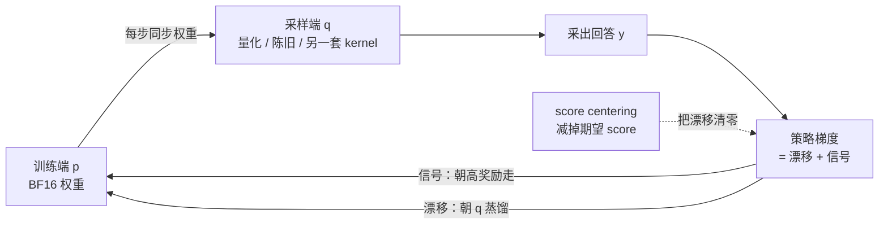

# Score Centering：训推不一致下 RL 为什么会崩，减掉「期望 score」就能止住

<!-- release-date: 2026-09-17 -->

> 本文依据 Together AI 的 Martin Marek 与 Max Ryabinin 所写 **Score Centering Stabilizes Off-policy Reinforcement Learning**，arXiv:2609.20807v1，2026-09-17，共 16 页（正文 9 页，其余为参考文献与附录）。页码均指 PDF 的物理页码。文中把三件事分开标：**论文明确写了什么**、**我们如何解释或验算它**、**哪些是外部资料补充**。

## 读前先把几个词说成人话

这篇论文的正文到第 9 页就结束了，却几乎每句话都踩在几个统计学名词上。先把它们说清楚。

- **Rollout（采样回答）**：让模型对一道题自己写出一整段回答。强化学习（Reinforcement Learning，RL）就是拿这些回答打分、再按分数改模型。
- **Sampler（采样端）与 Trainer（训练端）**：为了快，RL 框架把活拆给两个程序。采样端是推理引擎，一个 Token 一个 Token 往外吐回答；训练端把整段回答一次喂进去，并行算每个位置的概率再反传。论文把采样端的分布记作 $q_\theta$，训练端记作 $p_\theta$（PDF p. 2）。
- **训推不一致（Training-Inference Mismatch，TIM）**：两边用同一份权重，理论上 $q_\theta = p_\theta$，实际上总有细小差别（PDF p. 2）。
- **Score（得分函数）**：某个 Token 的对数概率对参数的梯度，$s_v = \nabla_\theta \log p_v$。它指向「让这个 Token 更可能出现」的方向。策略梯度就是把每个被采到的 Token 的 score 乘上奖励再加起来（PDF p. 2，式 1）。
- **Advantage（优势）**：奖励减去某个基准后的值，正的鼓励、负的压低。
- **组内中心化（group centering）**：GRPO 的做法，同一道题采 $G$ 条回答，每条的奖励减去这组的平均奖励（PDF p. 14，式 13）。
- **重要性采样（Importance Sampling，IS）**：手里的样本来自 $q$，想算的是 $p$ 下的期望，就给每个样本乘一个比值 $p/q$（PDF p. 3）。
- **TIS / MIS**：截断重要性采样（Truncated IS）把比值上限截到某个数；掩码重要性采样（Masked IS）把落在区间外的样本直接丢掉。两者都是给比值加护栏（PDF p. 16，Table 1）。
- **Staleness（陈旧）**：异步训练时，采样端用的还是几步之前的权重。

本文的主角是两个新词：

- **漂移（drift）**：策略梯度里一项与「哪条回答对、哪条错」无关、只因两边分布不同而出现的系统性偏置。
- **Score centering（得分中心化）**：从每个 score 里减掉它在采样端分布下的期望，把漂移精确抵消。

GRPO 的组内优势见 DeepSeekMath 一篇；序列级重要性比见 GSPO 一篇；用 FP16 缩小训推不一致见 FP16-Training-Inference-Mismatch 一篇。它们在本文里都是对照对象。

## 一句话先说清

大模型 RL 对训推两边一丁点数值差异都很敏感，重则奖励彻底崩溃（PDF p. 2）。常规修法是重要性采样，但原始比值方差太大，实践中都要截断或掩码，而截断又会带回偏差（PDF p. 3）。

论文给了一个不同的诊断和一个不同的药方。

**诊断**：训推不一致下，策略梯度的期望可以拆成两项。一项是真正的学习信号；另一项是漂移，效果等于「把训练端往采样端蒸馏」。采样端是训练端的一份有偏拷贝，又每一步从训练端同步回去，于是偏差一轮一轮复利累积，最终把训练拖崩（PDF p. 5）。漂移项为零，当且仅当训练与采样两个策略一致（PDF p. 2）。

**药方**：每个 score 减掉它在采样端分布下的期望 $\bar{s}$。这一减让漂移在每个前缀上精确归零，不用任何重要性比值，不截断，没有超参数（PDF p. 3、p. 9）。

论文的头条证据是 30B 模型在三档逐级加重的采样端量化下的训练曲线：


三幅从左到右，就是「不一致越重，方法之间拉得越开」这一句话。正文给出的数字（PDF p. 8）：

- FP8 采样端时，连不加纠偏的策略梯度也稳，训练准确率到 58%；
- KV Cache 降到 FP4 后，策略梯度 200 步内崩，MIS 在训练后期崩，score centering 52%、TIS 51%，都保持稳定；
- INT8 权重激活加 INT4 KV Cache 时，score centering 30%，TIS 12%，其余方法都低于 5%。

另外两条结论：因为它是**加法**修正，可以叠在 TIS 或 MIS 上面，严重陈旧的设定下叠加版最好（PDF p. 8）；实现上只需采样端每步多记 top-128 的 logprob，墙钟开销在 1% 以内（PDF p. 12）。

### 一条阅读路线

1. **p. 2–3**：训推不一致从哪来，重要性采样为什么总要截断。
2. **p. 3–4 与 Figure 2**：离线与在线的对照实验，把嫌疑人缩小到「在线」。
3. **p. 4–5 式 (3)–(5)**：漂移与信号的分解，以及 score centering 的一行定义。全文的核心。
4. **p. 6**：它和重要性采样、和经典 baseline 的区别，以及单 Token 的 JAX 实现。
5. **p. 7–8 与 Figure 3、4**：人为加噪、量化、陈旧三类不一致；再回看 Figure 1 的 30B 放大实验。
6. **p. 12–15 附录 A 与 Figure 5**：top-$k$ 近似、与 IS 的叠加公式、$k$ 的消融。

## 主要矛盾：SFT 吃得下别人的数据，RL 却被一点数值误差弄崩

### 训推不一致从哪来

论文按严重程度列了三类来源（PDF p. 2）：

1. **两边精度不同，或者干脆是两套代码**，各有各的难查 bug，输出就会有细微差别。
2. **即使两边都对、用同一套 kernel，浮点加法也不满足结合律。** 采样是自回归的，训练沿序列并行，同一个 kernel 被喂进不同形状的输入，归约顺序一变，结果就差在最低位。论文脚注举了一个 FP4（`fp4_e2m1`）的例子：$(0.5 + 0.5) + 2 = 3$，而 $0.5 + (0.5 + 2) = 2$（PDF p. 2 脚注 2）。批次不变（batch-invariant）kernel 能消掉这层依赖，但工程量大、GPU 利用率更差；两边都从 BF16 换成 FP16 能大幅缩小差距，但不能完全消除（PDF p. 2）。
3. **即使 kernel 完全一致，也还有陈旧。** 要把 GPU 用满，就得把训练和推理拆开异步跑，推理端再用连续批处理；于是同一个训练批次，甚至同一条回答的不同片段，都可能出自不同版本的权重。Agent 编程这类长任务里，有的回合几分钟结束，有的要跑几小时甚至几天（PDF p. 2）。

论文的立场很明确：从硬件利用率看，与其把不一致彻底消掉，不如在算法上让训练在不一致下也稳（PDF p. 2–3）。

### 重要性采样：能精确纠偏，代价是方差

如果回答来自采样端 $q_\theta$，策略梯度可以用重要性采样精确改写。下面这个式子算的是「期望奖励对参数的梯度」（PDF p. 3，式 2）：

$$
\nabla_\theta \mathbb{E}_{p_\theta}[R]
= \mathbb{E}_{p_\theta}\bigl[R\,\nabla_\theta \log p_\theta(y)\bigr]
= \mathbb{E}_{q_\theta}\Bigl[\frac{p_\theta(y)}{q_\theta(y)}\,R\,\nabla_\theta \log p_\theta(y)\Bigr]
$$

$R$ 是奖励，$y$ 是回答，$\nabla_\theta \log p_\theta(y)$ 就是 score，比值 $r = p_\theta(y)/q_\theta(y)$ 是重要性比值。式子是按整条序列写的，实践中比值通常按 Token 算（PDF p. 3）。

问题在比值本身：罕见 Token 上它可以任意大，梯度估计的方差被放大。所以实践中的方法都要给比值设界，而设界不可避免地带回偏差（PDF p. 3）。

论文把流行的纠偏方法整理成一张网格（PDF p. 16，Table 1）。它们只在三处不同：比值按 Token 还是按序列算、在哪个区间外截断或丢弃、对哪种符号的优势生效。

| 方法 | 粒度 | 统计量 | 下界 | 上界 | 区间外 | 作用符号 | 本文实现备注 |
|---|---|---|---:|---:|---|---|---|
| Naive IS | token | ratio | 0 | ∞ | — | 全部 | — |
| TIS / CISPO | token | ratio | 0 | 2.0 | 截断 | 全部 | 省略 CISPO 的动态采样与长度惩罚 |
| MIS（IcePop） | token | ratio | 0.5 | 5.0 | 丢弃 | 全部 | 省略策略版本间的另一个 PPO 代理目标 |
| PPO | token | ratio | 0.8 | 1.2 | 丢弃 | ppo | 双裁剪阈值 3（verl 默认） |
| DAPO | token | ratio | 0.8 | 1.28 | 丢弃 | ppo | 双裁剪阈值 3；省略动态采样与超长奖励惩罚 |
| GSPO | seq | ratio | 0.9997 | 1.0004 | 丢弃 | ppo | Token 梯度求和而非按回答平均；加了双裁剪阈值 3 |
| TOPR | seq | ratio | 0 | 1.0 | 截断 | 仅负优势 | — |
| DPPO | token | tv | 0 | 0.2 | 丢弃 | ppo | 不对重要性比值做裁剪 |

表中「ppo」指 PPO 的悲观裁剪：取加权目标与裁剪目标中较小的那个，所以裁剪只在「会让目标变大」的方向生效。「仅负优势」指只对负优势 Token 乘权重，正优势 Token 权重保持 1。双裁剪指负优势且比值大于 3 的贡献被丢掉（GSPO 是整条回答丢掉）。GSPO 的序列比值取各 Token 比值的几何平均。DPPO 用二值总变差（total variation）而不是比值来划掩码区间，但目标函数里仍用 IS 权重（PDF p. 3、p. 15–16）。

**我们如何解释它。** 这张表的意思是：迄今的方法本质上都在同一件事上做文章，即怎样给一个乘法系数加护栏。论文还点名了一篇不在表里的工作，给训练端隐状态注入可学习扰动，用扰动后的策略当比值分子，减轻比值的重尾而不是截断它，但它同样依赖重要性采样（PDF p. 3）。Score centering 则完全不在这张网格上：没有比值、没有掩码、没有截断，是一个加法修正项（PDF p. 3）。

### 真正让人困惑的地方

SFT（监督微调）在远比这严重的不一致下都稳：拿另一个模型离线生成的数据来训，不做任何重要性采样修正，照样没事。换句话说，SFT 对陈旧和 kernel 选择完全不敏感（PDF p. 3）。

那么 RL 究竟在哪里和 SFT 不同？论文注意到：如果奖励是二值、优势取 $+1/0$（不做中心化），并且训练完全离线（采样端从不更新），策略梯度就**退化成 SFT**（PDF p. 3）。于是 RL 与 SFT 只剩两处差别：

1. **奖励形式**：RL 的优势几乎总带负值，比如组内中心化之后（PDF p. 3 脚注 3）；
2. **陈旧程度**：RL 的采样端会跟着训练端更新。

脚注 4 还补了一个容易被忽略的对照（PDF p. 3）：同策略时，奖励整体平移一个常数不改变期望梯度，组内中心化只把它缩放 $1 - 1/G$ 倍，中心化的作用是降方差；离策略时这条不再成立，$+1/0$ 的 SFT 收敛到最大似然估计，$0/-1$ 的 SFT 却是退化的，损失无界、可能把模型训崩。

哪一处才是对不一致敏感的根源？论文用一个受控实验来区分。

## 第一步：一个受控实验，把嫌疑人缩小到「在线」


实验用 Qwen3-1.7B 在 Countdown 算术游戏上训练，给采样端权重加一个小扰动，制造可控的训推不一致；三种奖励形式（$+1/0$、$+1/-1$、组内中心化）各跑离线与在线两种（PDF p. 3）。

两幅的走向恰好相反。论文据此假设有两套互不相干的机制：一套让「离线 + 负奖励」不稳，另一套让「在线 + 正奖励」不稳（PDF p. 4）。

前一套不是本文重点。论文引用 Ren 与 Sutherland 的解释：对数概率没有下界，离线时负奖励会把某些 Token 的对数概率一路压向负无穷；在线训练只会采到高概率 Token，就没有这个问题。只用正样本（蒸馏、拒绝采样微调）即使离线也完全稳，是同一种不对称（PDF p. 4）。

后一套才是主角。**在线 + $+1/0$ 奖励 + 训推不一致，本身就是一种蒸馏**：训练端拟合采样端的成功回答，而采样端是它自己的有偏拷贝，每一步又从训练端刷新。它和离线蒸馏唯一的区别是老师跟着学生动，所以不稳一定出在这里（PDF p. 4）。

**我们如何解释它。** 这一步的价值是把问题从「数值误差有多大」换成了「误差会不会累积」。离线蒸馏的老师可以和学生差得很远，但它是固定的，学生最终收敛到对老师的最大似然拟合；在线时老师只和学生差一点点，但这一点点每步都朝同一个方向推。后面的推导就是要把「这一点点」写成一个显式的项。

## 全景：一个会自我强化的反馈环



这张图按 PDF p. 4–5 的论证重画，是机制示意，不是论文原图。关键在最上面那条同步边：训练端被往采样端拉一点，下一步采样端又从训练端同步过去，再带上同样方向的偏差。蒸馏的对象跟着学生一起动，所以误差不收敛，反而复利累积（PDF p. 5）。论文在结论里把这件事压成一句话：要紧的不是不一致有多大，而是老师是固定的，还是跟着学生走（PDF p. 9）。

## 核心推导：把策略梯度拆成「漂移」和「信号」

### 一个思想实验：奖励恒为 1，模型应该学到什么

设环境对任何回答都给 $+1$。奖励不含任何信息，模型不该学到任何东西（PDF p. 4）。

同策略下确实如此。在某个前缀之后，训练端对下一个 Token 的 score 期望为零。下面这一串等式算的是「按训练端自己的分布采样时，score 的平均值」（PDF p. 4）：

$$
\mathbb{E}_p[s_{y_t}]
= \sum_v p_v \nabla_\theta \log p_v
= \sum_v \nabla_\theta p_v
= \nabla_\theta \sum_v p_v
= \nabla_\theta 1
= 0
$$

$v$ 遍历词表，$p_v$ 是训练端给 Token $v$ 的概率。第二步用了 $p_v \nabla \log p_v = \nabla p_v$；最后一步是因为概率总和恒为 1，对常数求导为零。这个恒等式对任何分布都成立。

但在训推不一致下，Token 是从采样端 $q$ 抽的，score 却是在训练端 $p$ 上算的。于是期望 score 变成（PDF p. 4–5）：

$$
\bar{s} = \mathbb{E}_q[s_{y_t}] = \sum_v q_v\, s_v \neq 0
$$

权重换成了 $q_v$，「概率总和为 1」这条捷径就用不上了。

### 协方差恒等式拆出两项

用协方差恒等式 $\mathbb{E}[AB] = \mathbb{E}[A]\,\mathbb{E}[B] + \mathrm{Cov}(A, B)$（PDF p. 5 脚注 5），把一个前缀上策略梯度更新的期望拆开。这个式子算的是「在采样端分布下，奖励乘 score 的平均值」（PDF p. 5，式 3）：

$$
\underbrace{\mathbb{E}_q[R\, s_{y_t}]}_{\text{策略梯度更新}}
= \underbrace{\mathbb{E}_q[R]\;\bar{s}}_{\text{漂移}}
+ \underbrace{\mathrm{Cov}_q(R,\, s_{y_t})}_{\text{信号}}
$$

$\mathbb{E}_q$ 是对这个前缀之后、按采样端走完的整段回答取期望；$R$ 是这条回答的奖励或优势。

两项的含义完全不同（PDF p. 5）：

- **信号项** $\mathrm{Cov}_q(R, s_{y_t})$ 知道「哪个 Token 引向了哪个奖励」，是真正在学东西的部分。
- **漂移项** $\mathbb{E}_q[R]\,\bar{s}$ 只通过奖励的**平均值**依赖奖励，完全不知道哪条回答成功了。它的方向由 $\bar{s}$ 决定，而 $\bar{s}$ 正好是「以采样端为老师的交叉熵（SFT）损失」的负梯度。

所以论文的判词是：漂移是训推不一致的产物，作用是把训练端往采样端蒸馏，力度正比于这个前缀上的期望奖励（PDF p. 5）。同策略时 $\bar{s} = 0$，漂移自动消失。

### 用一个两词表的小例子看清漂移（我们的示例，不是论文内容）

设词表只有两个 Token，训练端直接用 logits $z$ 参数化，$p = \mathrm{softmax}(z)$。对 logits 求导时，Token $v$ 的 score 是 $e_v - p$，其中 $e_v$ 是第 $v$ 位为 1 的独热向量。于是

$$
\bar{s} = \sum_v q_v\,(e_v - p) = q - p
$$

假设训练端 $p = (0.5,\ 0.5)$，采样端因为量化略偏成 $q = (0.6,\ 0.4)$（虚构的数）。那么 $\bar{s} = (0.1,\ -0.1)$。即使奖励恒为 1、没有任何信息，一步梯度上升也会把第一个 Token 的 logit 抬高、第二个压低，恰好朝 $q$ 的方向走。这就是「朝采样端蒸馏」在最小尺度上的样子。

同一个例子也预告了 score centering 做什么：减掉 $\bar{s}$ 之后，被采到的 Token $y$ 的修正 score 是 $(e_y - p) - (q - p) = e_y - q$，它在 $q$ 下的期望恰好为零。任何参数化下 $\log p_v$ 都等于 $z_v$ 减去一个与 $v$ 无关的归一化项，所以这个结论经链式法则对整网参数同样成立。这是我们的代数整理。

### 为什么蒸馏向一个会动的老师就要出事

蒸馏向一个**固定**的老师是无害的，它收敛到对老师的最大似然拟合（PDF p. 5）。

但采样端不固定。它是训练端的一份有偏拷贝（量化了，或者陈旧了）：每一步把训练端往采样端推一点，训练端的权重又同步回采样端，偏差在反馈环里不断复利，而不是收敛（PDF p. 5）。

这就解释了 Figure 2 里「在线 + 全正奖励」为什么最不稳：$+1/0$ 奖励下 $\mathbb{E}_q[R]$ 恒为正，漂移一直在同一个方向上推。论文也指出，Dong 等人（ICML 2026）独立地把系统性偏差认定为训推不一致下失稳的根因，并展示它通过正反馈环累积（PDF p. 5）。

### 组内中心化为什么不够

GRPO 的组内中心化让同一道题各条回答的优势之和为零。看起来 $\mathbb{E}[R]$ 就是零了，漂移应该消失？

论文说不对。漂移发生在**每一个前缀**上，而某个前缀之后的期望优势一般不为零：一个很可能引向正确答案的前缀，期望优势为正；一个已经犯了错的前缀，期望优势为负（PDF p. 5）。于是漂移恰好在那些携带学习信号的前缀上非零：期望优势为正的前缀之后，训练端被拉向采样端；期望优势为负的前缀之后，被推离采样端，不管这个位置的 Token 对奖励有没有影响（PDF p. 5）。

组内中心化确实比 $+1/0$ 缩小了漂移，这和它在 Figure 2 在线设定里最稳一致；但它消除不了漂移（PDF p. 5）。

## 核心设计：score centering，一行定义

### 旧问题：漂移藏在每个前缀里，而现有护栏都是乘法

重要性采样也能精确消掉漂移，但它是一个随机的乘法系数，罕见 Token 上可以非常大，所以几乎所有实用实现都要截断或掩码，而这一截，漂移又回来了（PDF p. 6）。组内中心化只在整道题的层面把优势压到零，管不到单个前缀。

### 新设计：每个 score 减掉它在采样端下的期望

目标很直接：即使在训推不一致下，也让每个前缀上的期望 score 为零，像同策略时那样。做法就是每个 score 减去它在采样端分布下的期望（PDF p. 5，式 4）：

$$
\tilde{s}_{y_t} = s_{y_t} - \bar{s}
$$

$s_{y_t}$ 是被采到的 Token 在训练端的 score，$\bar{s} = \sum_v q_v s_v$ 是它在采样端分布下的期望，$\tilde{s}_{y_t}$ 就是中心化后的 score。

### 工作机制：漂移项整个被消掉，信号项原封不动

用中心化 score 替换原 score 之后，期望更新变成下面这样，算的仍是「采样端分布下奖励乘 score 的平均」（PDF p. 5，式 5）：

$$
\mathbb{E}_q[R\,\tilde{s}_{y_t}]
= \mathbb{E}_q[R]\;\underbrace{\mathbb{E}_q[\tilde{s}_{y_t}]}_{=\ \bar{s} - \bar{s}\ =\ 0}
+ \mathrm{Cov}_q(R,\, \tilde{s}_{y_t})
= \mathrm{Cov}_q(R,\, s_{y_t})
$$

第一项因为 $\tilde{s}$ 在 $q$ 下均值为零而整个消掉；第二项里 $\bar{s}$ 在给定前缀时是常数，减一个常数不改变协方差，所以等于原来的信号项。没有训推不一致时，$p_\theta = q_\theta$，修正项恰好为零，score centering 什么也不做（PDF p. 5）。

### 收益：加法、确定、无超参数

论文把它和重要性采样放在一起比（PDF p. 6）：

| | 重要性采样 | score centering |
|---|---|---|
| 修正方式 | 乘一个比值 | 减一个向量 |
| 修正量随不随采到的 Token 变 | 随，比值依赖采到哪个 Token | 不随，给定前缀就确定 |
| 对方差 | 放大方差，罕见 Token 上比值可以很大 | 不引入随机乘子 |
| 能否精确消掉漂移 | 原始比值可以，但实践中都要截断或掩码，漂移又回来了 | 可以，且可精确计算 |
| 超参数 | 截断或掩码区间 | 无 |

因为两者纠偏的途径互不相干，它们可以叠加（PDF p. 6）。

它和经典 baseline 也不是一类（PDF p. 6）。从策略梯度里减一个零均值的量，是经典的降方差技巧：奖励 baseline 与 score function 控制变量都依赖 $\mathbb{E}_p[s_{y_t}] = 0$。Score centering 是**纠偏**，不是降方差：它减掉的向量在给定前缀时是确定的，目的就是移动更新的均值；而同策略时的奖励 baseline 只改方差、不改均值。离策略时，如果奖励 baseline 恰好等于这个前缀上的期望奖励（即一个精确的价值函数），也能在期望上消掉漂移；score centering 不需要 critic 就拿到了同样的期望更新。

据作者所知，此前没有方法减的是期望 score 本身：同策略时它是零，没必要减；经典离策略 RL 里它要对整个动作空间求期望，算不动，只能用重要性采样。大模型 RL 的特殊之处在于，期望 score 既不为零，又能精确算出来，因为动作空间就是词表，求和就是对下一个 Token 的 logprob 加权求和（PDF p. 6）。

**我们如何解释它。** 这是全文最值得记住的判断：一个在经典 RL 里「算不出来所以没人用」的量，在语言模型里变成了「一次 softmax 就能算」。换了问题结构，老工具的可行域也跟着变了。

### 代价与边界：协方差是在采样端下量的

式 (5) 的结论是：score centering 的期望更新和同策略更新只差一件事，即协方差是在哪个分布下度量的。同策略、以及训推不一致下做完整重要性采样时，协方差在训练端 $p_\theta$ 下量；score centering 在采样端 $q_\theta$ 下量（PDF p. 5）。

**我们如何解释它。** 这句话就是方法的边界。只要 $q$ 和 $p$ 差得不多，「在 $q$ 下量协方差」和「在 $p$ 下量」几乎是一回事；差得远了，剩下的这点不一致就会冒出来。后面陈旧实验里单用 score centering 明显不如叠加重要性采样的版本，论文正是用这件事来解释（PDF p. 8–9）。

### 可迁移启发

任何「样本来自 A、梯度在 B 上算」的场景，都先问一句 $\mathbb{E}_A[\nabla \log B]$ 是否为零。不为零，就有一项与奖励无关的系统性推力；能精确算出来，就直接减掉，而不是用随机权重去近似。

## 实现：采样端只记 top-$k$ 个 logprob

### 为什么不能存完整分布

精确的 score centering 要用采样端在每个位置的完整下一 Token 分布。论文算了一笔账（PDF p. 12）：Qwen3 词表约 152K，一个 Token 的完整 logprob 用 FP32 存约 608KB；一个批次 1024 条回答、每条 32K 长，就要约 20TB。所以实验里一律只存采样端的 top-$k$ logprob，$k = 128$ 是保守的默认值（PDF p. 12）。

### 尾部用训练端的分布补上


只取头部 $k$ 个 Token 还不够：直接在头部上求期望，会漏掉尾部的质量。做法是头部 $H$ 取自采样端，尾部 $T$ 用训练端的分布按比例缩放补上，让整个分布的和为 1。下面这个式子定义的是「近似的采样端分布」$\hat{q}$（PDF p. 12，式 7）：

$$
\hat{q}_v =
\begin{cases}
q_v, & v \in H \\
\rho\, p_v, & v \in T
\end{cases}
\qquad
\rho = \frac{1 - \sum_{v \in H} q_v}{1 - \sum_{v \in H} p_v}
$$

算 $\hat{q}$ 下的期望 score 时，利用「训练端下 score 的期望为零」把尾部的和写成「零减去头部的和」（PDF p. 12，式 8）：

$$
\mathbb{E}_{\hat{q}}[s_{y_t}]
= \sum_{v \in H} q_v s_v + \rho \sum_{v \in T} p_v s_v
= \sum_{v \in H} q_v s_v + \rho\Bigl(0 - \sum_{v \in H} p_v s_v\Bigr)
= \sum_{v \in H} (q_v - \rho\, p_v)\, s_v
$$

结果只涉及头部的 $k$ 个 Token，但尾部建模覆盖了整个词表。

### 写成一个标量损失

score 是梯度，直接减向量在自动微分框架里不方便。论文把期望 score 写成「训练端 logprob 按采样端概率加权求和」，再对采样端概率做 stop-gradient，就得到一个标量损失（PDF p. 13，式 11）：

$$
L = -R\Bigl(\log p_{y_t} - \sum_v \mathrm{sg}[q_v]\,\log p_v\Bigr)
$$

$\mathrm{sg}[\cdot]$ 表示 stop-gradient，不对采样端概率求导。对它求负梯度就回到 $R(s_{y_t} - \bar{s}) = R\,\tilde{s}_{y_t}$。换成 top-$k$ 近似，求和只跑头部，系数换成 $q_v - \rho\,p_v$（PDF p. 6，式 6）：

$$
L = -R\Bigl(\log p_{y_t} - \sum_{v \in H} \mathrm{sg}[q_v - \rho\, p_v]\,\log p_v\Bigr)
$$

论文正文给了一段单 Token 的最小 JAX 实现（PDF p. 6）：

```python
import jax.numpy as jnp
from jax.lax import stop_gradient

def score_centering_loss(train_logp, samp_logp, topk_ids, sampled_token, advantage):
    train_head_logp = train_logp[topk_ids]
    tail_mass_ratio = (1 - jnp.exp(samp_logp).sum()) / (1 - jnp.exp(train_head_logp).sum())
    head_prob_residual = jnp.exp(samp_logp) - tail_mass_ratio * jnp.exp(train_head_logp)
    logp_correction = (stop_gradient(head_prob_residual) * train_head_logp).sum()
    return -advantage * (train_logp[sampled_token] - logp_correction)
```

`train_logp` 覆盖整个词表，`samp_logp` 是采样端的 top-$k$ logprob，`topk_ids` 是这 $k$ 个 Token 的编号。整件事就是在普通策略梯度损失里，把被采 Token 的 logprob 减去一个加权和。附录的通用版本另外把尾部质量下限钳在 `eps = 1e-6` 以防除零，并多收一个参数：被采 Token 在采样端的 logprob，即使它落在头部之外也要保留（PDF p. 13–14）。

### 和重要性采样叠加

TIS、MIS 先用权重 $w_v = f(r_v)$ 给 score 重新加权，其中 $r_v = p_v / q_v$。叠加时，score centering 减的不再是原始 score 的期望，而是**加权 score 的期望**。这个式子是叠加后每个 Token 的更新（PDF p. 13，式 9）：

$$
R\bigl(w_{y_t} s_{y_t} - \mathbb{E}_q[w_{y_t} s_{y_t}]\bigr),
\qquad
\mathbb{E}_q[w_{y_t} s_{y_t}] = \sum_v q_v\, w_v\, s_v
$$

不管权重函数 $f$ 长什么样，常数奖励下的期望更新都精确为零，漂移按构造被消掉（PDF p. 13）。

top-$k$ 近似照样适用。尾部上 $p_v / \hat{q}_v = 1/\rho$ 是常数，所以中心化项仍只跑头部，只是把 $\rho$ 换成一个标量 $\alpha$（PDF p. 13，式 10）：

$$
\mathbb{E}_{\hat{q}}[\hat{w}_{y_t} s_{y_t}] = \sum_{v \in H} (q_v w_v - \alpha\, p_v)\, s_v,
\qquad
\alpha = \rho\, f(1/\rho)
$$

两个特例可以当作检查（PDF p. 13）：取 $f = 1$，$\alpha = \rho$，回到原版 score centering；取原始重要性采样 $f(r) = r$，$\alpha = 1$ 且 $q_v w_v = p_v$，中心化项整个消失，因为精确的重要性采样本来就让加权 score 的期望为零，没什么可减的。实验里 TIS 用 $f(r) = \min(r, 2)$，MIS 在 $0.5 \le r \le 5$ 时保留 $r$、区间外置零（PDF p. 14）。

### 开销

相同硬件上，$k = 128$ 的运行在 0.6B 与 30B 两种模型上的墙钟时间都与基线方法相差 1% 以内（PDF p. 12）。他们的采样端是自研 JAX 采样器，解码时顺带算 top-$k$ logprob；vLLM 与 SGLang 原生就能输出 top-$k$ logprob，但论文**没有测**它们的开销（PDF p. 12）。

### 可迁移启发

需要对端的完整分布、但只存得起 top-$k$ 时，用本地分布按质量比缩放补尾，再用「期望为零」把求和收回到头部。这个套路对蒸馏、KL 估计同样适用；修正项做成加法，也才能和别的修正叠加。

## 实验怎么证明

### 统一目标：只比纠偏规则本身

现有方法常常把好几招捆在一起：DAPO 同时有非对称裁剪和动态采样，IcePop 同时有训推之间的 MIS 和策略版本之间的 PPO 裁剪（PDF p. 6–7）。为了单独比较纠偏规则，所有方法共用同一个目标：带组内中心化奖励的 REINFORCE，每种纠偏单独叠在上面；共用同一个采样端、训练端、优化器和优势，每个批次只做一步 SGD；所有重要性比值都用采样端记录下来的概率（PDF p. 7）。

基础目标是（PDF p. 14，式 13）：

$$
J_{\text{base}}(\theta) = \frac{\sum_i A_i \sum_{t=1}^{L_i} \log p_\theta(y_{i,t} \mid y_{i,<t})}{\sum_i L_i},
\qquad
A_i = R_i - \bar{R}_{\text{group}},
\qquad
R_i \in \{-1, +1\}
$$

$i$ 遍历批次里的回答，$L_i$ 是第 $i$ 条的长度，$\bar{R}_{\text{group}}$ 是同一道题各条回答的平均奖励。分母是整个批次的 Token 数，所以这是按 Token 平均的损失。不加任何纠偏的「PG」就是这个目标本身（PDF p. 15）。

其余设定（PDF p. 14）：

| 项 | Qwen3-0.6B / Countdown | Qwen3-30B-A3B-Base / INTELLECT-2 数学 |
|---|---|---|
| 优化器 | SGD，固定学习率 $10^{-2}$ | 同左 |
| 每题采样数 | 8 | 8 |
| 每批题数 / 回答数 | 64 / 512 | 16 / 128 |
| 最长序列 | 512 | 1024 |
| 每批优化步数 | 1 | 1 |

用 SGD 是跟随 Mukherjee 等人的做法。论文说这个学习率在所有实验里都稳，效果与 AdamW 相当，最多省下 240GB 显存（PDF p. 14），但文中没有给 SGD 与 AdamW 的对照曲线。序列更长会加大训推不一致，但会让多种子、多基线的对比贵到做不起（PDF p. 14）。纠偏方法的参数一律取原论文或 verl 的默认值，不另调（PDF p. 15）。小模型在引言里写作 Qwen3-0.6B，实验设定一节写作 Qwen3-0.6B-Instruct（PDF p. 2、p. 6）。

### 为什么故意把不一致放大

论文坦白：自然设定下，很难找到严重到能在几个 GPU 小时内让最强几种方法拉开统计显著差距的训推不一致（PDF p. 7）。作者认为这本身就是漂移累积的后果：不一致轻时，漂移要攒更多步才够量，在那之前最好的几种方法曲线重叠。既然负担不起在超长训练上做有统计显著性的消融，他们就刻意放大不一致，把这些结果当作「更温和的不一致 + 更长训练」的代理（PDF p. 7）。

这也被用来调和前人的分歧：有工作发现 FP8 rollout 只用 Token 级重要性采样就稳，有工作在尽力缩小不一致、用 BF16 采样的情况下仍看到训练发散。论文认为两者都符合漂移累积：短训练里要看到失稳，不一致必须严重；温和的不一致同样会失稳，只是要更多步（PDF p. 7）。

### 人为加噪：不一致越大，崩得越早


设定是给采样端权重加一个固定的高斯偏移：$\theta_{\text{sampler}} = \theta_{\text{trainer}} + \Delta\theta$，$\Delta\theta$ 在训练开始时从各向同性高斯分布抽一次，之后不变（PDF p. 7）。这是最不真实的设定，但崩得最快、方法之间分得最开，而且能连续调节不一致的大小（PDF p. 7）。

论文的读法：三档噪声下表现最好的是 SC、TIS、MIS 以及叠加版 MIS + SC、TIS + SC；最大噪声下只有 score centering 本身和它与 MIS / TIS 的叠加训得稳（PDF p. 7）。崩的方法随噪声变大崩得更早，正文点名了两个例子（PDF p. 7）：

| 方法 | 噪声 0.01 | 噪声 0.02 | 噪声 0.05 |
|---|---|---|---|
| DPPO | 约第 160 步崩 | 约第 80 步崩 | 约第 20 步崩 |
| TIS | 稳 | 约第 180 步崩 | 约第 40 步崩 |

论文把这张表当作「漂移随训练累积」的直接证据（PDF p. 7）。**我们如何解释它。** 如果失稳是一次性的数值事故，崩的时间点不该随噪声大小这样整齐地提前；它符合「偏差每步累加、攒够就崩」的图景。但这仍是相关性证据，论文没有直接测量漂移项的大小随训练的变化。

### 量化与陈旧：前者 SC 单用就够，后者要叠 IS


两种不一致都故意做得很重（PDF p. 8）：

- **量化**：只量化采样端的权重、激活和 KV Cache，训练端保持 BF16。
- **陈旧**：推理引擎**每 64 步才更新一次**，不是「最多陈旧 64 步」。论文也承认实践中应尽量频繁地更新采样端，并让训练端和采样端用同一种量化方案。

左幅和加噪实验结论一致：score centering 单用、以及叠在 TIS / MIS 上，都最好（PDF p. 8）。右幅结论变了：叠加版 TIS + SC 与 MIS + SC 最好，明显胜过单用 score centering（PDF p. 8）。单用的 SC 在右幅里剧烈起伏，大部分时间低于 PPO / DAPO（读自 Figure 4）。

论文的解释回到式 (5)：score centering 在采样端而不是训练端下度量协方差。陈旧时两次同步之间训练端会走得离采样端很远；TIS 先部分纠正采样分布，score centering 再清掉剩余的漂移。所以作者建议：**只要训练端在两次同步之间可能走得离采样端很远，就把 score centering 和一种重要性采样纠偏叠在一起用**（PDF p. 8）。

还有一个值得记住的对照：PPO 和 DAPO 扛得住陈旧，却在量化和加噪下崩。论文认为这和裁剪的设计初衷一致：裁剪是为「策略移动产生的比值」设计的，陈旧会产生这种比值，数值误差不会（PDF p. 8）。

### 放大到 30B：量化越狠，差距越大

最后回到开篇的 Figure 1：Qwen3-30B-A3B-Base 在 INTELLECT-2 的数学子集上，对采样端做三档逐级加重的量化（PDF p. 8）。三档的数字已在开篇列出。图上还能读出一件正文没展开的事：即使在最轻一档、策略梯度自己都稳的设定里，几种带 PPO 式裁剪或掩码的方法（如 PPO、DAPO、GSPO、TOPR）反而先往下滑（读自 Figure 1）。这和上面「PPO 类裁剪不适合数值误差」的观察方向一致。

Qwen3-30B-A3B 是 MoE 模型，训练端和采样端还可能在专家路由上不一致。论文**没有**回放路由索引，并说实践中回放会更好（PDF p. 8）。

### top-$k$ 近似够不够：$k = 32$ 就和全词表一样


每个子图里三条曲线基本重合，论文的结论是 $k = 32$ 和 $k = 128$ 在每个设定下都与全词表 score centering 相当（PDF p. 14）。

为什么尾部模型够用？论文每步都记录了头部覆盖的采样端概率质量：$k = 128$ 时，除 30B 的 INT8 + INT4 KV 外，所有设定平均覆盖超过 99.9%；那个最重的设定平均覆盖 99.45%，最差的一个批次 95.8%，而这恰是尾部被量化扭曲得最厉害的地方，$k = 32$ 和 $k = 128$ 在那里仍与全词表一致（PDF p. 14）。

要注意 30B 那三幅的种子数：$k = 128$ 的曲线直接取自 Figure 1，所以是多种子；$k = 32$ 与全词表为省算力都只跑了单种子（PDF p. 16）。

### 种子数与算力

图中阴影是 ±1 标准误。Figure 2、3 报的是留出评测集上的准确率；Figure 1、4、5 报的是**训练准确率**，即采样回答的平均奖励，并做了居中滑动平均（PDF p. 15）。

0.6B 与 1.7B 的每个实验、每种方法都跑了 3 个种子。30B 太贵，先让每种方法各跑 1 个种子，再只给表现最好的方法加种子：FP8 KV 那幅全部单种子；FP4 KV 与 INT4 KV 两幅里，score centering 分别 5 与 4 个种子，TIS 4 与 3，MIS 3 与 3，原始 IS 2 与 1，其余方法都是单种子（PDF p. 15–16）。

复现各图所需算力（PDF p. 16，Table 2；实验主要跑在 8 卡 H100 SXM 节点上）：

| 实验 | 对应图 | 种子数 | 独立运行数 | 约合 H100 卡时 |
|---|---|---|---:|---:|
| 离线 vs 在线 | Figure 2 | 3 | 18 | 190 |
| 人为加噪 | Figure 3 | 3 | 108 | 280 |
| 量化与陈旧 | Figure 4 | 3 | 72 | 1,120 |
| 30B 数学 | Figure 1 | 1–5 | 47 | 3,750 |
| top-$k$ 消融 | Figure 5 | 见图例 | 51 | 840 |
| 合计 | | | 296 | 6,180 |

## 读完要留下的判断

### 被实验支持的

- **单独消掉漂移，就足以在严重量化下稳住训练。** 0.6B 的 INT8 与 30B 的三档量化里，不带任何重要性比值的 score centering 都在最好的一档（PDF p. 8）。论文据此把漂移认定为失稳的原因（PDF p. 9）。
- **不一致越大崩得越早**，与「漂移逐步累积」一致（PDF p. 7）。
- **top-$k$ 近似几乎零成本**：$k = 128$ 的墙钟时间与基线相差 1% 以内，$k = 32$ 已与全词表相当（PDF p. 12、p. 14）。
- **可以与重要性采样叠加**，陈旧设定下叠加版最好（PDF p. 8）。

### 只是作者的解释或假设

- 「离线负奖励不稳」与「在线正奖励不稳」是两套机制：来自 Figure 2 的对照，论文称之为假设（PDF p. 4）。
- 「温和的不一致在更长训练里也会崩，所以严重不一致的短实验能代表它」：这是实验设计的前提，本身没有被长训练实验验证（PDF p. 7、p. 9）。
- PPO / DAPO 扛陈旧不扛数值误差，是因为裁剪的设计对象不同：作者的解释（PDF p. 8）。

### 论文自己承认的限制

结论的限制一节写了两条（PDF p. 9）：score centering 消掉漂移后，剩下的更新度量的是采样端而不是训练端下的协方差，严重陈旧时这点会起作用，所以要叠加重要性采样；头条结果来自**刻意严重的不一致加短序列**，是更温和不一致下长训练的代理。

### 读者还需要记住的边界

- **单用 SC 在陈旧设定下并不好。** 摘要说「在陈旧实验中，叠加版胜过纯重要性采样基线」（PDF p. 1），指的是叠加版，不是单用。
- **序列很短**：0.6B 最长 512，30B 最长 1024（PDF p. 14）。动机里提到的 Agent 编程长任务没有实验。
- **30B 大多数方法是单种子**（PDF p. 15–16）。
- **30B 的 MoE 路由没有回放**，路由不一致混在「量化」这一类不一致里（PDF p. 8）。
- **所有实验都是 SGD**，没有给 AdamW 下的对照曲线（PDF p. 14）。
- **vLLM / SGLang 下的 top-$k$ 开销没测**（PDF p. 12）。
- **比较的是纠偏规则本身，不是各方法的完整配方**：DAPO 的动态采样、CISPO 的长度惩罚、IcePop 的另一个 PPO 代理目标都被去掉（PDF p. 7、p. 16）。表中「DAPO」等方法的表现不等于它们原论文里的完整系统。

## 与本站相关篇目的关系

FP16-Training-Inference-Mismatch 一篇走的是另一条路：把训推不一致的根因归到 BF16 尾数太短，换成 FP16 来**缩小**不一致。本文引用了那篇（Qi 等人 2025），归为「大幅缩小但不能完全消除」的一类（PDF p. 2）；本文的出发点是「不一致消不干净，那就让训练在不一致下也稳」。两条路并不冲突：一个缩小误差的来源，一个阻止误差复利。本文还把同一组作者后来的 DPPO（Qi 等人 2026）列进了对照网格（PDF p. 16）。

GSPO、DAPO、MiniMax-M1（CISPO 的出处）三篇在本文里只作为 Table 1 的一行出现，而且被剥掉了各自的配套技巧，完整设计要回到各自的篇目。异步训练为什么必然带来陈旧，可以对照 AReaL 一篇（本文在 PDF p. 2 引用了它）。

## 可迁移启发

1. **先把梯度拆成「与信号有关」和「与信号无关」两部分。** 协方差恒等式是一把通用的刀：任何「样本来自 A、梯度在 B 上算」的场景，都可以先问 $\mathbb{E}_A[\nabla \log B]$ 是否为零。
2. **区分「偏差大」和「偏差会复利」。** 离线蒸馏的老师差得再远也稳，在线训练差一点点也会崩。排查训练不稳时，先问偏差是否会通过同步、回放、自举回流到下一步的输入里。
3. **能精确算的修正量，就别用随机估计去近似。** 重要性比值是随机的乘法修正，方差大到必须截断；期望 score 是给定前缀下确定的加法修正，可以精确算。
4. **修正项做成加法，才能和别的修正叠加。** Score centering 能叠在 TIS / MIS 上，正因为它不去改那个乘法权重，只从加权后的 score 里再减一次期望。
5. **只存头部、用自己的分布补尾部。** 对端分布只存得起 top-$k$ 时，按质量比缩放本地分布补尾，再用「期望为零」把求和收回头部。
6. **诊断实验要先把可疑因素拆干净。** 本文把 RL 与 SFT 的差别归结为「奖励形式」和「是否在线」两项，再用两种跑法乘三种奖励的小实验定位（PDF p. 4），比直接上大规模对比更省也更清楚。
7. **看裁剪类方法时，先问它的比值是为哪种偏差设计的。** PPO 的裁剪针对策略移动；量化误差、kernel 差异带来的比值不是那一类，照搬裁剪区间反而可能先崩。

## 关键词回看

- **训推不一致（TIM）**：训练端 $p$ 与采样端 $q$ 对同一份权重给出不同概率。来源有精度与代码差异、浮点不满足结合律、异步陈旧。
- **Score**：$\nabla_\theta \log p_v$。同策略下期望为零，训推不一致下期望 $\bar{s}$ 一般不为零。
- **漂移**：$\mathbb{E}_q[R]\,\bar{s}$，与哪条回答成功无关，效果是把训练端朝采样端蒸馏；采样端又从训练端同步，于是复利累积。
- **信号**：$\mathrm{Cov}_q(R, s_{y_t})$，真正的学习信号。
- **组内中心化不够**：它让整道题的优势和为零，但漂移发生在每个前缀上，前缀的期望优势不为零。
- **Score centering**：$\tilde{s}_{y_t} = s_{y_t} - \bar{s}$。加法、确定、无超参数，没有训推不一致时退化为无操作。
- **剩余差别**：协方差在 $q$ 而不是 $p$ 下度量，严重陈旧时要叠加 TIS / MIS。
- **top-$k$ 尾部模型**：头部取采样端，尾部用训练端按 $\rho$ 缩放；中心化项只跑头部 $k$ 个 Token。$k = 32$ 已与全词表相当。
- **叠加公式**：减加权 score 的期望，系数 $\alpha = \rho\, f(1/\rho)$；$f = 1$ 回到原版，$f(r) = r$ 时中心化项消失。

## 资料与阅读边界

### 版本与首发日

[arXiv:2609.20807](https://arxiv.org/abs/2609.20807) 截至 2026-09-29 只有 v1，提交于 2026-09-17 17:58 UTC，主分类 cs.LG。这是一篇只讲公开技术的方法论文，没有对外可用的模型或服务，`release-date` 取 arXiv v1 日 2026-09-17。官方代码仓的提交记录早于这一天，但仓库在 2026-09-18 才加上 arXiv 链接，没有证据表明它在论文之前已经公开，所以不改首发日。

### 覆盖了原文哪些部分

摘要与 Figure 1；第 1 节引言；第 2 节 TIM 来源与重要性采样纠偏；第 3 节离线与在线对照、Figure 2 与脚注 3–4；第 4 节漂移与信号分解、score centering、与 IS 和经典 baseline 的对比、4.1 实现；第 5 节共享目标、放大不一致的理由、Figure 3–4、30B 实验；第 6 节结论与限制；附录 A.1–A.4（top-$k$ 近似、与 IS 叠加、损失形式与通用实现、Figure 5）；附录 B.1–B.3 与 Table 1–2。

### 外部资料补充（不是 PDF 原文）

- 官方代码仓 [martin-marek/score-centering](https://github.com/martin-marek/score-centering)（MIT 许可，PDF p. 2 脚注 1）：README 给了 JAX 与 PyTorch 两个批量版损失函数，并提醒三件实现细节：logprob 用 float32、不要把 top-$k$ 头部重新归一化、被采 Token 落在头部之外时仍要保留它的采样端 logprob。仓库还附带作者自研的 JAX 训练框架 postax 与各图的扫参配置。
- README 的示例命令里 0.6B 模型用的是 `Qwen/Qwen3-0.6B`；Hugging Face 上 Qwen 官方没有公开名为 Qwen3-0.6B-Instruct 的模型。论文实验设定里的「Qwen3-0.6B-Instruct」大概率指以对话格式使用的 Qwen3-0.6B，这是我们的推断。
- 本站相关篇目：DeepSeekMath、GSPO、DAPO、MiniMax-M1、FP16-Training-Inference-Mismatch、AReaL。

### 原文没有公开的缺口

- 长序列、长时程 Agent 任务上的实验；
- 温和不一致下的长训练验证（用严重不一致的短训练作代理）；
- 漂移项大小随训练变化的直接测量；
- AdamW 下的对照曲线（只有「效果相当」一句话）；
- MoE 路由回放与 score centering 的组合；
- vLLM、SGLang 等常用推理引擎下记录 top-$k$ logprob 的开销。
