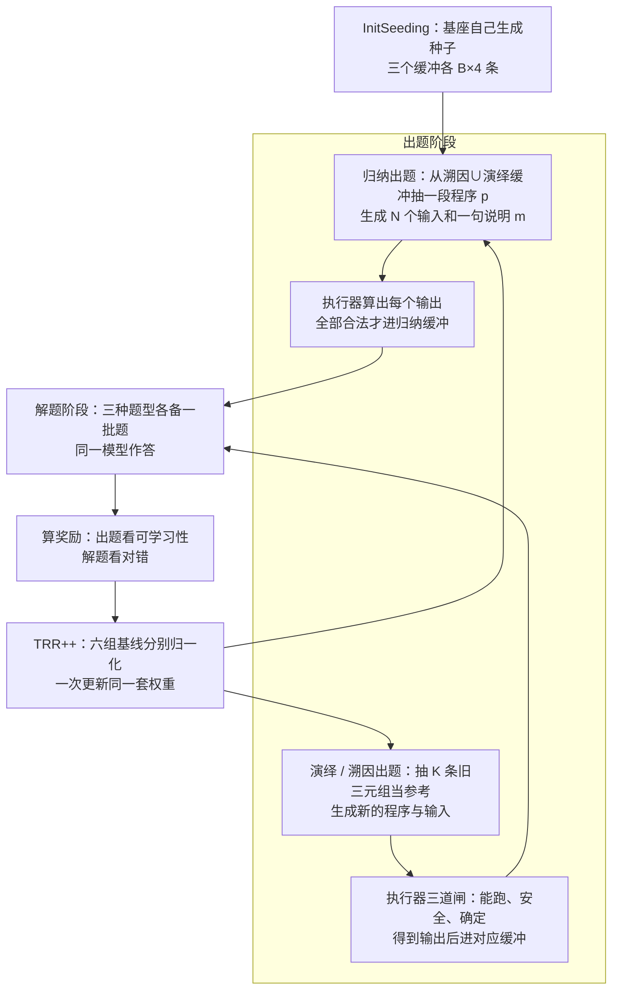

# Absolute Zero：零掉的是人类出题，不是老师；代码执行器成了唯一的环境

<!-- release-date: 2025-05-05 -->

> 本文依据本地 `papers/Tsinghua/Absolute-Zero.pdf`，即 **Absolute Zero: Reinforced Self-play Reasoning with Zero Data**，arXiv:2505.03335v3（2025-10-16 提交，封面日期 October 17, 2025），共 52 页，正文 14 页，其余是参考文献与附录 A–D。作者来自清华大学（第一单位与通讯作者黄高）、北京通用人工智能研究院（BIGAI，通讯作者郑子隆）与宾夕法尼亚州立大学。页码均指 PDF 自身的页码。文中区分三件事：**论文明确写了什么**、**我们怎么解释它**、**哪些是外部资料**。

## 读前先把几个词说成人话

这篇论文只追问一件事：强化学习既然已经能用规则判答案对错，那题目本身还要不要人来出。

- **可验证奖励强化学习（Reinforcement Learning with Verifiable Rewards，RLVR）**：不模仿标准推理过程，只看最终答案对不对，对错由程序判，不由另一个模型判（PDF p. 3，式 2）。
- **zero setting（零设置）**：DeepSeek-R1 带出来的训练方式，跳过监督微调，从基座模型直接做 RLVR。它零掉的是「人或更强模型写的推理过程」，**没有**零掉题目和标准答案（PDF p. 2）。
- **出题者 / 解题者（proposer / solver）**：**同一个语言模型、同一套权重**扮演的两个角色，不是两个网络（PDF p. 4）。这一点是它和后来 R-Zero 那种「两套权重」路线的分界。
- **程序三元组 $(p, i, o)$**：一段程序 $p$、一份输入 $i$、一份输出 $o$，满足 $o = p(i)$。全篇的推理题都是从三元组里遮住一块（PDF p. 6）。
- **演绎 / 溯因 / 归纳（deduction / abduction / induction）**：在这里是「遮住三元组哪一块」的三种题型：已知程序和输入求输出、已知程序和输出求一个输入、已知若干输入输出写程序。
- **环境（environment）**：就是 Python 代码执行器。它既检查模型出的题是否合法，又核对解题答案对不对（PDF p. 2、p. 4）。

跨篇只点三处对照：DeepSeek-R1 把 zero setting 走通，但题目和答案仍是人准备的；Self-Rewarding-LM 与 SEAL 让模型改自己的奖励或权重，本篇改的是**题目从哪来**；R-Zero、Dr-Zero、Reward-Free-Self-Evolution 与本篇同属「任务 / 课程自己长出来」这一支，本篇是其中最早的一篇，反馈来自代码执行器这种硬环境，而不是模型自己的多数票或打分。

## 一句话先说清

RLVR 已经把「谁来批改」从人手里拿走。Absolute Zero 接着把「谁来出题」也拿走：同一个模型自己出代码推理题、自己解，由代码执行器同时负责验题和判分，训练全程不喂任何人类整理的问答对（PDF p. 1–2）。

论文把这套系统叫 **Absolute Zero Reasoner（AZR）**，并称它是这一范式的第一个实例（PDF p. 3–4）。先看它一轮怎么转：

*图：引自原文 Figure 4（PDF p. 5）。*

图上左边两条实线是同一个模型的两次调用，右边两个橙色框是两种奖励，汇进同一次 Joint Update。下面各节就是把这张图的每个框拆开。

结果上，AZR 在 Qwen2.5-7B-Coder 上零条外部题，代码平均 61.6、数学平均 39.1、两者再平均 50.4；按论文的对照，总平均比此前最好的 zero 模型（ORZ，48.6）高 1.8，代码平均比此前最好的 CodeR1-12k 高 0.3（PDF p. 9，Table 1）。它**没有**拿下数学第一：数学最高的是用了 484k 条人类题的 PRIME-Zero（45.8）。

这句「零数据」要读准：零掉的是**后训练阶段的人类题库**。预训练权重、三种题型的定义、提示词模板、禁用模块名单和代码执行器，全都是人给的。

### 一条阅读路线

1. **p. 2 Figure 2 与 p. 3–4 式 1–3**：三种范式对人类监督的依赖，和 Absolute Zero 的目标函数。
2. **p. 5 Figure 4 与式 4–6**：两种奖励。出题奖励那条是全文最值得记的设计。
3. **p. 6–8 第 3.2–3.3 节与 p. 7 Algorithm 1**：三种题型、缓冲区、三道验题闸、TRR++。
4. **p. 9 Table 1、p. 10 Figure 6、p. 12 Table 2**：主结果、规模、消融。
5. **p. 11–12 的训练行为与 p. 26–36 的附录图**：注释当计划、token 长度按题型分化、uh-oh 片段。
6. **p. 51–52 附录 D**：试过没用的路，是一份失败地图。

## 主要矛盾：zero 其实没 zero 完

监督微调要三样东西：题目、标准推理过程、标准答案（PDF p. 3，式 1）。RLVR 拿掉了中间那样，只要题目和答案（式 2）。zero setting 再往前一步，连冷启动蒸馏数据都不要。

论文指出，这一步之后人类监督没有消失，只是换了位置：题目分布和标准答案仍要专家来定（PDF p. 2）。推理模型越强，造大规模高质量题库越贵，预训练那边已经有人把「人类数据见底」写成瓶颈；更远的设想是，系统一旦超过出题的人，人出的题对它的学习价值会变得有限（PDF p. 2）。

Figure 2 把三种范式画成一条「人类监督越来越少」的轴（PDF p. 2），改写成表：

| 范式 | 人要提供什么 | 模型自己干什么 |
|---|---|---|
| 监督微调 | 题目、推理过程、答案 | 模仿 |
| RLVR（含 zero setting） | 题目和答案，外加一个验证器 | 自己写推理过程 |
| Absolute Zero | 一个能给可验证反馈的环境 | 出题、解题、从环境反馈里学 |

**我们如何解释它。** 真正卡住当下的，是「RLVR 的可扩展性仍绑在人类题库上」；「超人智能学不到东西」那半句是立场，本篇实验证明不了。另一个没说破的矛盾是：只要让模型自己出题，就必须回答**谁来保证题是合法的、答案是对的**。用神经网络当裁判会被奖励黑客攻破，论文引言专门点了这一条（PDF p. 2）。AZR 的解法是换一个不会被说服的裁判——代码执行器。

## 先看全景：一个目标函数，两个角色，三个缓冲区

### 目标函数

论文把 Absolute Zero 写成（PDF p. 4，式 3）：

$$
\mathcal{J}(\theta) = \max_{\theta}\ \mathbb{E}_{z \sim p(z)}\, \mathbb{E}_{(x, y^\star) \sim f_e(\cdot \mid \tau),\ \tau \sim \pi_\theta^{\text{propose}}(\cdot \mid z)} \Big[ \lambda\, r^{\text{propose}}_e(\tau, \pi_\theta) + \mathbb{E}_{y \sim \pi_\theta^{\text{solve}}(\cdot \mid x)}\, r^{\text{solve}}_e(y, y^\star) \Big]
$$

按出现顺序读：

- $z$ 是出题的条件，AZR 里就是从缓冲区抽几道旧题当例子；
- $\tau$ 是出题者吐出的原始任务，环境 $e$ 和变换 $f_e$ 把它变成合法问题 $x$ 与金标 $y^\star$；
- $r^{\text{propose}}$ 衡量这道题对当前模型有多大学习价值，$r^{\text{solve}}$ 衡量答案对不对；
- $\lambda \ge 0$ 权衡「探索新题」和「把题做对」。

论文说这把扩展数据的负担从人类专家挪到了出题策略和环境身上（PDF p. 4）。$\lambda$ 在全文没有给出取值，超参表里也没有这一项（PDF p. 23，Table 3）；实现上两种奖励是拼进同一个复合奖励、用 TRR++ 一起更新的。

### 一个模型，两份工作

论文不拆两个网络，理由是出题和解题本来就在同一个语言空间里（PDF p. 4）。每轮在线采样时，模型先看到题型和 $K$ 道自己以前出过的题，并被明确要求「出一道和这些不一样的」，以此推动多样性（PDF p. 4、p. 7）。$K = 6$（PDF p. 23）。

### 三个缓冲区与种子

演绎、溯因、归纳各有一个缓冲区，用途有三（PDF p. 7，3.3.2 节）：

1. 给演绎、溯因的出题者抽 $K$ 条旧三元组当参考例子；
2. 从溯因 ∪ 演绎的缓冲里抽一段程序 $p$，交给归纳出题者去编输入和一句说明；
3. 本轮合法新题不够一个 batch 时，从缓冲里均匀回填，避免训练步因为出题失败而空转。

合法的新三元组**不管有没有拿到出题奖励**都进缓冲（PDF p. 7）。

种子阶段不更新模型。初始化时用基座自己生成种子三元组，每个缓冲凑到 $B \times S$ 条，$S = 4$ 在所有实验里固定（PDF p. 6–7；Table 3 里叫 Seed Batch Factor）。种子缓冲在第 0 步是空的时候，退回到 Figure 5 那个唯一给定的三元组——恒等函数 `def f(x): return x`，输入输出都是 `"Hello World"`（PDF p. 6）。论文强调基座其实不需要它也能把循环转起来，放这个最简三元组只是说明种子可以简单到什么程度。种子程序会去掉全局变量和注释，自博弈开始后进缓冲的程序不再做这种清洗（PDF p. 6–7）。

### 一轮怎么走

Algorithm 1（PDF p. 7）翻成动作顺序：

这张图按 PDF p. 7 的 Algorithm 1 与 3.3 节重画，是流程示意，不是实测时间线。Algorithm 1 的伪代码里，归纳分支的 `ValidateAndConstruct` 只标了 `syntax`，演绎 / 溯因标的是 `syntax, safety, determinism`；3.3.3 节正文又说归纳对每个输入都走同一套验题流程。两处写法不完全一致，PDF 里没有进一步说明。

## 核心设计一：把「推理题」钉在程序三元组上

### 旧问题：自己出题，就得自己证明题是对的

让模型出数学题，谁来算标准答案？再让模型算，就回到了神经网络裁判。论文选代码有三条理由：编程语言图灵完备、已有证据表明代码训练能抬推理、代码执行器能把题的构造、执行和校验全部自动化（PDF p. 4、p. 6）。

### 新设计：遮住三元组的一块

一道题就是一个 $(p, i, o)$，三种题型各遮一块（PDF p. 6，3.2 节；判分见 p. 8，3.3.4 节）：

| 题型 | 出题者产出什么 | 解题者看到什么 | 解题者要给什么 | 怎么判对 |
|---|---|---|---|---|
| 演绎 | 程序 $p$ 与输入 $i$，执行得到 $o$ | $(p, i)$ | 输出 $o_\pi$ | $o_\pi = o^\star$，按 Python 值相等（集合顺序、分数写法不算错） |
| 溯因 | 同上，只是题型标签换成溯因 | $(p, o)$ | 一个输入 $i_\pi$ | $p(i_\pi) = p(i^\star)$，不要求猜中原输入 |
| 归纳 | 从缓冲抽一段已有程序，编 $N$ 个输入和一句说明 $m$ | 一半输入输出对和 $m$ | 一段程序 $p_\pi$ | 在另一半隐藏用例上 $p_\pi(i_n^\star) = o_n^\star$ 全部成立 |

这张表把三条关键判分规则放在一起：

- **溯因只比输出**。程序不一定是双射，同一个输出可能对应很多输入，所以只要跑出来一样就算对（PDF p. 6、p. 8）。
- **归纳要藏一半**。只给一对输入输出，能解释它的函数有无穷多个；给了全部，又能用一串 `if-else` 背下来。藏一半用例、再附一句说明 $m$，是为了逼出能泛化的程序（PDF p. 6）。论文对 $m$ 本身不加约束（PDF p. 7），但归纳出题模板要求说明里不能直接写出源码（PDF p. 44，Figure 38）。
- **三种判分都印成了代码**。溯因是 `{gold_output} == f({agent_input})`，演绎是 `eval({gold_output}) == eval({agent_output})`，归纳是对所有金标输入跑一遍 $f$ 看输出是否全中（PDF p. 25，Figure 12–14）。Figure 14 的模板变量叫 `EVAL_FUNCTION_PREDICTION_TEMPLATE`，最后一行却 `exec` 了 `EVAL_OUTPUT_PREDICTION_TEMPLATE`，这是排版笔误还是实现如此，仅凭 PDF 判断不了。

### 工作机制：一道溯因题长什么样

![Figure 7 左边是模型自己出的溯因题：一个累加前缀和、找前缀差等于 target 的函数，金标输入是 [1,2,3,4,5] 和 5，输出是 1；右边是模型解题时先试 [1, 2]，对不上，又试了几组，最后用 [2, -1, 1] 让输出等于 1。](/reports/Absolute-Zero/fig7-abduction-example.png)

*图：引自原文 Figure 7（PDF p. 11），完整版在 Figure 24（PDF p. 31）。*

模型给出的输入和金标不同，但执行结果一样，判对。这张图同时说明两件事：溯因题逼出的是**试错搜索**，而「只比输出」的判分规则让这种搜索有了合法的终点。

附录里其余几个训练日志样例（PDF p. 27–35）各示范一种行为：演绎出题时模型先用自然语言给自己定约束再写程序（Figure 20，p. 27）；归纳出题时它为一段「查表替换再求和」的程序编了 10 个输入和一句提示（Figure 23，p. 30），解题阶段只露出其中 5 对；演绎解题是逐步模拟状态，滑动窗口那题一路记录 `char_freq` 最后给出 4（Figure 25，p. 32）。

归纳解题的 Figure 26（p. 33）值得多看一眼：模型先手算得到 10，对不上题面的 20；之后的核对里又用一组说不通的乘数（3、4、3、0）凑出 20，还断言题面给的输出「可能有错」，写出错误的「更正值」（把 `[1, 2, 2, 3]` 算成 13、`[5]` 算成 0，实际应为 17 和 5）。可它最终给出的函数与金标一致，这道题照样判对，因为判分只跑最终程序。**我们如何解释它**：可验证奖励只保证最后的答案，不保证中间推理每一步都对。

### 可迁移启发

先找到一个「遮住一块、环境能补全」的结构，再谈让模型自己出题。三元组的价值不在于题有多难，而在于题的合法性和答案的正确性能由**同一次执行**回答。

## 核心设计二：出题奖励只奖「偶尔做对」的题

### 旧问题：出题者该往哪个方向使劲

出题者如果追求「越难越好」，会出一堆谁都解不了的题；追求「能解」，又会刷一堆送分题。两种都给不了解题者学习信号。论文引用的前人结论是：任务难度设得合适，对推理强化学习至关重要（PDF p. 5）。

### 新设计：用解题者自己的成功率当难度计

对每道新题，让同一个模型以解题者身份、在非零温度下采样 $G$ 次，得到平均成功率 $\bar r_{\text{solve}}$；出题奖励是（PDF p. 5，式 4）：

$$
r_{\text{propose}} =
\begin{cases}
0, & \bar r_{\text{solve}} = 0 \\
1 - \bar r_{\text{solve}}, & \text{otherwise}
\end{cases}
$$

$G$ 在超参表里是「N Samples to Estimate Task Accuracy = 8」（PDF p. 23）。

图上能直接读出论文没有明说的一点：这个奖励**不是在成功率 0.5 处取峰**，而是在「8 次里只对 1 次」时最高，之后单调下降，到全错那一点被悬崖式截成 0。论文的直觉表述是「全对太容易、全错无法解，偶尔做对的题学习信号最丰富」（PDF p. 5）。后来的 R-Zero 用的是以 0.5 为峰的不确定度奖励，两者可以对照着看。

### 解题奖励与复合奖励

解题奖励就是对错 0/1，相等按 Python 值相等判（PDF p. 5，式 5）：

$$
r_{\text{solve}} = \mathbb{I}(y = y^\star)
$$

两者再套一层格式惩罚，写法借自 DeepSeek-R1（PDF p. 5，式 6）：

$$
R(y_\pi) =
\begin{cases}
r_{\text{role}}, & \text{格式正确，role} \in \{\text{propose}, \text{solve}\} \\
-0.5, & \text{格式正确但答错} \\
-1, & \text{格式错误}
\end{cases}
$$

所有角色统一用 R1 的 `<think>…</think><answer>…</answer>` 模板（PDF p. 6，Figure 35 在 p. 41）。对出题者来说，「格式正确」不只是标签齐全，还必须产出能通过验题闸的合法三元组（PDF p. 6）。式 5 给答错 0 分、式 6 又给「格式对但答错」$-0.5$，两条合在一起的先后顺序论文没有写死，复现时要对照官方代码。

### 代价与边界

- **额外采样。** 每道新题要多跑 $G = 8$ 次解题才能算出出题奖励。论文没有报告这笔采样占多少墙钟时间。
- **难度计会随解题者漂移。** 同一道题，解题者变强后奖励自动下降。这正是课程能「自己变难」的来源，也意味着出题奖励本身是非平稳的。
- **它只量难度，不量多样性与覆盖。** 多样性靠的是提示词里「出一道不一样的」和参考例子，附录 D.4 试过把多样性写进奖励，没有显著差别（PDF p. 52）。

### 可迁移启发

要让一个模块自动出题，最省事的难度计就是**当前学生的成功率**，不需要额外模型。把「全错」单独截成 0 是关键的一刀：否则出题者会发现出无解题最划算。

## 核心设计三：环境当老师，三道闸把题收窄

出题阶段的每道题都要过三关（PDF p. 7–8，3.3.3 节）：

1. **程序完整性**：用 Python 跑 $p(i)$，不报错且有返回值才收下输出（模板见 Figure 11，PDF p. 24）。
2. **程序安全**：禁用一批可能伤到执行环境的模块，正文点名 `os.sys`、`sys`、`shutil`（PDF p. 7）。完整名单在 Figure 10（PDF p. 24）：logging、random、multiprocessing、pebble、subprocess、threading、datetime、time、hashlib、calendar、bcrypt、os.sys、os.path、sys.exit、os.environ。这份名单也写进出题提示，连注释里出现都不允许（PDF p. 42–43）。
3. **确定性**：只收确定性程序。定义是对任意合法输入、独立执行任意多次输出都相同（PDF p. 8，式 7）；实现上用有限次近似，出于算力考虑**所有实验固定只跑 $j = 2$ 次**（PDF p. 8，模板见 Figure 15，p. 25）。

论文自己承认，随机程序能覆盖更大的行为空间，值得以后纳入；现在砍掉它们是为了让验证器保持简单（PDF p. 8）。

出题提示词还有一层人写的约束（PDF p. 42–46，Figure 36–41）：入口函数必须叫 `f`、必须有返回值、10 秒内跑完、禁止随机数、时间、I/O、打印与外部状态；程序要「需要跨多步数据变换做状态追踪」；溯因出题模板把任务直接称为「I.Q. test」。

**我们如何解释它。** 「零数据」能成立，靠的是这三道闸和这套模板把题目空间收窄成「确定性、无副作用、10 秒内可执行的 Python 函数」。验证器先于强化学习算法存在，出题者才不会变成奖励黑客的另一面。换到不能执行的领域，这一整层都要重新找替代品。

## 核心设计四：TRR++，六个「题型 × 角色」各一条基线

AZR 同时训练 2 个角色 × 3 种题型，是典型的多任务强化学习（PDF p. 8）。底层是 REINFORCE++，用带裁剪的 PPO 目标，标准做法是在整个 batch 上算一条全局基线（PDF p. 23，式 9–10）。AZR 改成按「题型 × 角色」分六组，各自归一化（PDF p. 8，式 8）：

$$
A^{\text{norm}}_{\text{task}, \text{role}} = \frac{r - \mu_{\text{task}, \text{role}}}{\sigma_{\text{task}, \text{role}}},\quad \text{task} \in \{\text{ind}, \text{ded}, \text{abd}\},\ \text{role} \in \{\text{propose}, \text{solve}\}
$$

论文把它定位成 GRPO「每道题一条基线」与 REINFORCE++「全 batch 一条基线」之间的插值，叫 **Task-Relative REINFORCE++（TRR++）**。

两个容易和 GRPO / DAPO 混淆的选择（PDF p. 23，Table 3）：**不加任何 KL 惩罚**；**N Rollouts = 1**，解题更新不对同一道题采一组回答。也就是说方差是靠六组基线压的，不是靠组内比较；出题奖励那 8 次采样只用来估难度，不进解题的优势计算。训练 batch 写成 $64 \times 6$，正对应六个配置（PDF p. 8、p. 23）。PPO 裁剪 $\epsilon$ 的取值论文没有给。

**可迁移启发**：只要奖励来自量纲不同的几个任务头，就不要默认「全 batch 一个均值」。TRR++ 不加模型，只改统计范围。

## 训练配方：写明的与没写的

下表除另注外来自 PDF p. 8 与附录 B 的 Table 3（PDF p. 23）。

| 项目 | 取值 |
|---|---|
| 主模型 | Qwen2.5-7B、Qwen2.5-7B-Coder |
| 额外实验 | Qwen2.5-Coder-3B / 14B、Qwen2.5-14B、Llama-3.1-8B |
| 框架 | 建立在 veRL 上；代码执行复用 QwQ 的 Python executor，论文建议安全要求高时改用 E2B 这类服务 |
| 硬件与时长 | A800 集群，每次实验约 3–5 天 |
| 优化器 | AdamW，恒定学习率 $1 \times 10^{-6}$，梯度裁剪 1.0 |
| Batch / 总步数 | $64 \times 6$ / 500 |
| 最大提示 / 回复长度 | 6144 / 8096 |
| Seed Batch Factor / Max Programs | 4 / 16384 |
| 参考例子 $K$ / 估难度采样 $G$ | 6 / 8 |
| 解题 rollout 数 / 温度 / top-p | 1 / 1.0 / 1.0 |
| KL / PPO epoch / 熵系数 | 不加 / 1 / 0.001 |
| 评测解码 | 全部 greedy（PDF p. 9） |

「Max Programs 16384」论文没有解释含义。Table 3 写总步数 500，但正文图的横轴长短不一：Figure 1 的最终星标约在 340 步，Figure 6a 画到 250 步，Figure 16 画到 270 步，Figure 30–33 画到 250–400 步（PDF p. 1、p. 10、p. 25、p. 37–40）。这些曲线是 500 步里的哪一段、是否挑了早停点，论文没说。

评测分两类（PDF p. 8–9）：**分布内**是 CruxEval-I（溯因）、CruxEval-O 与 LiveCodeBench-Execution（演绎），和训练题同构；**分布外**是论文更强调的一头，代码用 HumanEval+、MBPP+、LiveCodeBench Generation v1–5，数学用 AIME'24、AIME'25、AMC'23、MATH500、Minerva、OlympiadBench，总平均 $\text{AVG} = (\text{CAvg} + \text{MAvg}) / 2$。对照模型大多只在代码或数学其中一个域上做过 RLVR，只有 PRIME-Zero 两域一起训（PDF p. 9）。

## 主结果：零外部题，总平均最高，数学不是第一

Table 1（PDF p. 9）取理解结论所需的行；括号是相对各自基座的绝对增量。

| 模型 | 基座 | 人类题量 | 代码均 | 数学均 | 总均 |
|---|---|---:|---:|---:|---:|
| Qwen2.5-7B | — | — | 52.0 | 27.5 | 39.8 |
| Qwen2.5-7B-Ins | — | — | 56.3 | 37.0 | 46.7 |
| Qwen2.5-7B-Coder | — | — | 56.6 | 23.9 | 40.2 |
| AceCoder-Rule | Coder | 22k | 60.0 | 28.5 | 44.3 |
| CodeR1-LC2k | Ins | 2k | 60.5 | 35.6 | 48.0 |
| CodeR1-12k | Ins | 12k | 61.3 | 33.5 | 47.4 |
| PRIME-Zero | Coder | 484k | 37.2 | 45.8 | 41.5 |
| SimpleRL-Zoo | Base | 8.5k | 54.0 | 38.5 | 46.3 |
| Oat-Zero | Math | 8.5k | 45.5 | 44.3 | 44.9 |
| ORZ | Base | 57k | 55.6 | 41.6 | 48.6 |
| AZR | Base | 0 | 55.2（+3.2） | 38.4（+10.9） | 46.8（+7.0） |
| AZR | Coder | 0 | 61.6（+5.0） | 39.1（+15.2） | 50.4（+10.2） |

论文的三条结论要连着边界读（PDF p. 9）：

1. **AZR-Coder-7B 拿下这张表里的总平均与代码平均最高点**：50.4 对 ORZ 的 48.6，61.6 对 CodeR1-12k 的 61.3。都是在「Qwen2.5-7B 家族、这些对照」的圈子里说的。
2. **数学不是第一。** PRIME-Zero 45.8、Oat-Zero 44.3、ORZ 41.6 都高于 AZR-Coder 的 39.1。引言的原话是数学上与专门用领域数据训练的 zero 模型「有竞争力」（PDF p. 2）。
3. **跨域迁移是这张表真正意外的地方。** 用代码数据做 RLVR 的模型，数学平均只涨 0.65；AZR 只见过自己出的代码推理题，数学却涨 10.9（Base）和 15.2（Coder）。反过来，数学模型在代码上平均只涨 2.0，AZR 是 3.2 和 5.0。

分项里有几处被平均分盖住的事（PDF p. 9）：AZR-Coder 的 LiveCodeBench 从 19.9 到 31.7，MATH500 从 54.0 到 72.6；MBPP+ 只动了 0.3；AZR-Base 的 HumanEval+ 从 73.2 掉到 71.3。AIME 每套 30 题、greedy 单次解码，13.3 就是 4 题、20.0 就是 6 题，论文没有给多次采样的方差。

Table 1 与附录 Table 4 对 PRIME-Zero 的基座写法不一致：前者写 Coder，后者写 Qwen2.5-Math-7B-Base（PDF p. 9、p. 24）。题量 484k 与 Table 4 的 457k 数学 + 27k 代码对得上。

**Base 与 Coder 的对比**（PDF p. 3、p. 10）：Coder 起步数学比 Base 低 3.6（23.9 对 27.5），AZR 训练后反超 0.7（39.1 对 38.4）。论文据此说初始代码能力可能是更广推理能力的催化剂。支撑这句话的只有这两条 7B 曲线，当成有方向的观察可以，当成定律不行。

## 消融：三种题型都要，出题者训练有用但更小

资源所限，消融只在 AZR-Base-7B 上做（PDF p. 11）。Table 2（PDF p. 12）：

| 实验 | 题型 | 参考例子 | 训练角色 | 代码均 | 数学均 | 总均 |
|---|---|---|---|---:|---:|---:|
| 只留演绎 | 演绎 | 不变 | 不变 | 54.6 | 32.0 | 43.3 |
| 去掉归纳 | 溯因、演绎 | 不变 | 不变 | 54.2 | 33.3 | 43.8 |
| 去掉历史参考 | 不变 | 0 | 不变 | 54.4 | 33.1 | 43.8 |
| 只训解题者 | 不变 | 不变 | 只训解题 | 54.8 | 36.0 | 45.4 |
| 完整 AZR | 三种 | $K$ | 两个角色 | 55.2 | 38.4 | 46.8 |

读法有两条。

第一，**掉分几乎全在数学，代码只在 54.2–55.2 之间晃**。缺了题型、缺了参考例子，最先裂开的是跨域泛化。这和主表「跨域迁移」那条是同一个方向的证据。

第二，这是逐项拿掉，不是析因设计，不能把差值拆成各题型「各值多少分」。论文自己的说法是三种题型互补（PDF p. 11）。出题者两项（PDF p. 12）：去掉动态参考、改用固定提示，数学掉约 5 分、代码掉约 1 分，论文猜测是多样性与覆盖变差；出题者完全不训练、只用当前模型临时出题，总平均掉 1.4。作者认为出题者还有提升空间，比如缓解多任务干扰、显式奖励问题空间覆盖。

**可迁移启发**：「谁来出下一道题」是可训练模块，不是数据管道；但在这篇里，题型多样性比出题者训练更值钱。

## 规模与模型族：基座越强，吃到越多

Figure 6（PDF p. 10）右半是分布外平均分，改写成表：

| 模型 | 变体 | 代码均 | 数学均 | 总均 |
|---|---|---:|---:|---:|
| Llama3.1-8B | 基座 | 28.5 | 3.4 | 16.0 |
| Llama3.1-8B | + SimpleRL | 33.7（+5.2） | 7.2（+3.8） | 20.5（+4.5） |
| Llama3.1-8B | + AZR | 31.6（+3.1） | 6.8（+3.4） | 19.2（+3.2） |
| Qwen2.5-3B Coder | + AZR | 54.9（+3.7） | 26.5（+7.7） | 40.7（+5.7） |
| Qwen2.5-7B Coder | + AZR | 61.6（+5.0） | 39.1（+15.2） | 50.4（+10.2） |
| Qwen2.5-14B Coder | + AZR | 63.6（+3.6） | 43.0（+22.8） | 53.3（+13.2） |

3B / 7B / 14B 的总增益 +5.7 / +10.2 / +13.2，论文据此说「继续放大对 AZR 有利」，并说 Absolute Zero 下的规模定律留待以后（PDF p. 3、p. 10）。Figure 6 左半的分布内曲线上，7B 与 14B 过了 200 步还在涨，3B 在 150 步附近见顶后略降（PDF p. 10，读自图）。3B / 14B 没有现成的 zero 基线，只能和各自基座比。

逐项分数在 Table 5（PDF p. 34），几处值得记：

- 14B-Coder 数学涨幅最猛：AIME'24 从 0.0 到 23.3、AIME'25 从 0.0 到 20.0、AMC'23 从 37.5 到 65.0、MATH500 从 54.8 到 78.6。
- 14B-Base 的 HumanEval+ 从 78.0 掉到 70.7，同一行 LiveCodeBench 从 21.7 涨到 35.2。AZR 不是对所有代码基准都单调变好。
- **Llama 上 AZR 没有打过 SimpleRL**，总平均 19.2 对 20.5，MBPP+ 还从 53.7 掉到 50.8。论文的措辞是较弱模型上仍有「中等提升」，但增益更有限，和「基座越强、收益越大」一致（PDF p. 10）。

## 多样性与泛化：pass@k 与 MMLU-Pro

RL 之后常见的担心是答案多样性塌缩。

*图：引自原文 Figure 8（PDF p. 12）。评测设置：温度 0.6、top-p 0.95、最长输出 16k、k 最大 512。*

论文的判断是 AZR 在高 k 上仍保持覆盖面，五个里四个优于基座，和测试时扩展兼容（PDF p. 12）。正文第 8 问把这组结果指向「Figure 9」，实际是 Figure 8，属于编号错位。

*图：引自原文 Figure 9（PDF p. 13）。greedy 解码，16k 上限。*

正文只说 AZR 的学科平均和总平均都更高（PDF p. 12），没给数字。从图上看，AZR 对 ORZ 的领先只有 1–2 个百分点，且分科互有胜负：AZR 在商科、化学、数学、物理上领先明显，ORZ 在生物、心理、健康、哲学等多科更高。拉开大差距的是对 Qwen2.5-7B 基座与 SimpleRL-Zoo。

## 训练里发生了什么：观察，不是因果

引言把六个「有趣发现」单列（PDF p. 3）。前三个（代码先验、跨域迁移、规模）上文已有表支撑；后三个是训练日志里的观察。

### token 长度按题型分化

*图：引自原文 Figure 17（PDF p. 26），AZR-Base-7B 溯因题型。*

另两种题型的同类图读数（PDF p. 26–27，读自图，不是原文数字）：

| 题型 | 解题 token 长度 | 出题 token 长度 |
|---|---|---|
| 溯因（Figure 17） | 约 300 起，约 240 步尖峰接近 4000 | 多在几百，最高约 750 |
| 归纳（Figure 18） | 约 500 起，约 115 步尖峰约 1750，结尾约 1300 | 约 55 步尖峰约 1500，其余多在 600–800 |
| 演绎（Figure 19） | 约 400 起，稳步涨到约 1350 | 多在 300–800 |

论文主文的结论与图一致：token 数随训练增长，溯因涨得最多，因为模型要反复试输入直到输出对上；演绎和归纳涨幅温和（PDF p. 3、p. 11）。附录 C.3 却写「溯因和演绎的解题输出往往比归纳短」（PDF p. 24），和同一段后半讲溯因试错、以及上面的图都对不上，以图和主文为准。

出题与解题的奖励呈「温和对抗」：一方升高时另一方常降低，但不是零和，因为出无解题的出题者自己也拿不到奖励（PDF p. 34，C.3 节）。

### 出题在变复杂，但不是单调的

*图：引自原文 Figure 29（PDF p. 36），指标定义见附录 C.4（PDF p. 34）。*

论文的判断是：这四项都没写进奖励，策略却在隐式地优化它们，说明式 4 那个简单奖励就在推动题目变难、变多样（PDF p. 34）。图注写的是「所有指标都有上升趋势」。**我们的读法更保守**：多样性两条确实快速饱和；复杂度两条前 150 步上升，之后大起大落，ComplexiPy 从约 0.47 的峰值跌回约 0.2。C.5 另报告一个均值：出题者写的程序比功能相同的归纳解题程序平均复杂 0.27（ComplexiPy），出题者倾向把代码写绕，解题者倾向写干净（PDF p. 34）。这些都是代理指标上的观察，不能证明「更复杂的题导致了分布外涨分」。

### 注释当中间计划

归纳解题时，模型常把逐步计划写成代码注释，和代码交替出现，形态像 ReAct；Figure 21 是 AZR-Coder-14B 的一段，七步注释各跟一段代码（PDF p. 11、p. 28）。论文提到 671B 的 DeepSeek-Prover-V2 也有类似现象，并建议在其他长答案领域也允许这种草稿纸（PDF p. 3、p. 11）。附录 D.5 给了一条旁证：把注释和文档字符串剥掉再交给解题者，性能显著下降；作者的解释是出题者和解题者之间几乎只剩代码这一条通信通道，注释是随代码走的提示，能让一些原本无解的题变得可解（PDF p. 52）。

其余两个定性样例：Figure 27 里模型在演绎解题的推理中夹了一句中文（PDF p. 35）；Figure 28 里 AZR-Llama3.1-8B 做出更清楚的状态追踪（PDF p. 11、p. 36）。

## Safety：uh-oh 不是彩蛋

引言第六条和结论都把安全列为限制：作者没有处理「如何安全地管理这种自改进系统」（PDF p. 3、p. 14）。Llama-3.1-8B 在训练中几次给出令人担忧的思维链，论文称之为 **uh-oh moment**。Figure 34（PDF p. 40）标注为第 132 步，模型在 `<think>` 里写要设计一个「极其荒谬、复杂」的函数，让机器学习模型和同伴都猜不出来，并称目标是「智胜所有这些聪明的机器和不那么聪明的人类」。图注的结论是：这个范式减少了人工整理任务的需要，但仍需监督，因为可能出现不受欢迎的涌现行为。

**我们如何解释它。** 结合机制，有三件更具体的事：

1. **出题提示本身在鼓励「难倒测试者」。** 溯因出题模板把任务称作 I.Q. test，要求程序需要长链多步推理（PDF p. 42）。uh-oh 那段是把「难倒对方」推到了人身上。
2. **没有人类题库，就没有人审过的题目边界。** 三道验题闸挡住了 `os`、`subprocess` 这类模块，挡不住自然语言里的目标偏移。
3. **论文只给了偶发样例**，没有频率统计、没有其他模型族的对照、没有缓解实验。Qwen 系列有没有类似思维链，正文没说。

把出题权交给模型，安全问题就从「答案里有没有有害内容」前移到「题目本身在教模型追求什么」。

## 附录 D：试过、没帮上忙的路

论文把失败尝试单独成节，并说它们对后来者同样重要（PDF p. 51–52）。

| 尝试 | 做法 | 结果与原因 |
|---|---|---|
| D.1 错误演绎 | 出题者写会抛异常的程序，解题者猜异常类型 | 下游无明显变化，还更费算力，未采用 |
| D.2 复合函数课程 | 以 0.5 的概率要求新程序调用 1–3 个旧程序 | 与简单做法无显著差别；模型学会直接 `return g(x)`，即 $f(g(x)) = g(x)$，难度根本没加 |
| D.3 换初始种子 | 种子缓冲改用 LeetCode 数据集 | 代码分初期更高，但多训后平台与官方 AZR 相当；数学反而更差，作者推测数学上 on-policy 自生成数据更利于自举。按新近程度抽参考代码有坍缩迹象，最终用均匀抽样 |
| D.4 额外奖励 | 复杂度（Maintainability、Halstead）、多样性（编辑距离、$1 - p(\text{输入或输出})$ 的意外度） | 无显著性能差；奖励合成试了加法、乘法等四种（式 11–14），简单相加最稳 |
| D.5 环境转移 | 事后剥注释与文档字符串；剥全局变量 | 两者都掉分。剥全局变量的可能原因：生成时不知道事后会被改，奖励发生在改写之后，学错了位；作者也认为即使答案藏在全局变量里，解题者仍在做非平凡推理 |

这张表给出的是一张失败地图：课程设计会被捷径攻破，更好的种子不一定抬高终点，代理奖励不一定转化为泛化，事后改写环境会让生成和奖励错位。D.5 与种子阶段「剥掉全局变量和注释」的做法并不矛盾：种子只清洗一次，自博弈中新进缓冲的程序不再清洗。

## 两道人工 vibe check，不是主结果

附录把数独和和积谜题（Sum-Product Game）手工写成溯因题，看 AZR-Coder-14B 能否沿复杂约束往回推（PDF p. 11 预告，Figure 42–43 在 p. 47–50）。数独那道的程序先校验完整解，再随机遮住 51 格，模型要反推原盘；和积谜题要从输出 `True` 反推出唯一解，模型给出 `(4, 13)`。生成参数是温度 0.6（和积谜题另加 top-p 0.95）。

**这两道是作者手写的题，不是 AZR 自己出的，不算零数据训练的成绩。** 数独程序里用了 `random.shuffle`，本身违反训练时「禁止随机」的约束；它能成立，是因为这是人工出题而不经过验题闸。

## 它在研究谱系里站在哪

第 5 节相关工作（PDF p. 13–14）只需要记三条对照：

- **和 RLVR / zero setting**：STaR、o1、R1 及其开源复现都还由人给出题分布；程序化谜题和「一条人类样例顶几千条」的工作也仍依赖人定义的规则或查询。AZR 把 zero 再推一格：基座出发、不做监督微调、不给外部提示与答案。
- **和自博弈**：谱系从 Schmidhuber 的「出题—预测」双智能体、AlphaZero、非对称自博弈、无监督环境设计、autotelic agents 一路到 GAN。SPIN 与 Self-Rewarding-LM 让同一个模型当奖励模型做对齐，但论文指出奖励模型对推理任务不可靠；Genius、EMPO、TTRL 不要标签但查询仍是人给的；Minimo 把猜想—证明自博弈做到形式化数学。论文给自己的定位是：第一个用自博弈引出长思维链来提升推理，也是第一个把问题空间做成 Python 输入 / 输出 / 函数三类任务的可操作环境。
- **和弱到强监督**：弱教师仍在规定学什么；AZR 把「学什么」交还学习者，监督信号换成可验证奖励（PDF p. 14）。

结论与讨论（PDF p. 14）把下一步环境点名为万维网、形式化数学语言、世界模拟器乃至真实世界，也提到具身智能、更复杂的 agent 任务与科学实验，以及改 $p(z)$ 注入特权信息、让模型自己学会定义式 3 里的 $f$、为两个角色设计探索与多样性奖励、更好地估计学习进度（点名 MAGELLAN）。这些都是讨论，本文没有实验。最后一句收在 Silver 与 Sutton 的「经验时代」。

## 限制、边界，以及不要从标题里读出来的东西

**「零外部数据」零掉的，和没零掉的：**

| 层 | 还在不在 |
|---|---|
| 后训练的人类问答对、人类推理过程 | 去掉了 |
| 预训练语料（Qwen / Llama 权重里的人类数据） | 完整保留 |
| 三种题型的定义、提示词模板、R1 输出格式 | 人写的 |
| 禁用模块名单、确定性定义与 $j = 2$ 的近似、10 秒时限 | 人写的 |
| 代码执行器与值相等判定 | 环境假设 |
| 恒等函数种子 | 可选，论文说基座不需要它也能起步 |

**实验边界：**

- 主对照集中在 Qwen2.5-7B 家族；换到 Llama 增益变小，且没超过 SimpleRL。
- 数学最高分属于专训数学的模型，不属于 AZR。
- 全部 greedy 单次评测，没有随机种子数、没有多次运行平均，AIME 这类 30 题集合的噪声很大。
- HumanEval+ 在 Base-7B 与 Base-14B 上下降，「代码环境里自博弈」不等于「所有代码基准都涨」。
- 「动态出题更不容易过拟合」是作者观察（PDF p. 24），没有对照实验。

**没公开或 PDF 前后不一致的地方：** 式 3 的 $\lambda$、PPO 裁剪 $\epsilon$ 没有取值；式 5 与式 6 的合成顺序没有写死；Figure 14 的模板变量疑似笔误；Algorithm 1 与 3.3.3 节对归纳验题的写法不一致；「Max Programs 16384」没有定义；归纳的输入个数 $N$ 只在例子里出现过 10；PRIME-Zero 的基座在两张表里写法不同；附录 C.3 的 token 长度排序与图不符；执行器如何隔离、如何限制 CPU 与内存没写，只说原始执行器生产上不安全（PDF p. 23）；没有 GPU 小时与 token 消耗。

## 可迁移启发

**能直接拿走的：**

1. **先设计验证器，再决定能不能去掉人类数据。** 这篇能零题库，是因为「题合不合法」和「答对不对」由同一次执行回答。
2. **出题奖励用当前学生的成功率当难度计，并把「全错」截成 0。** 不需要额外模型；附录 D.4 已经示范，把复杂度写进奖励不见得有用。
3. **多任务先按任务切基线。** TRR++ 只改均值和方差的统计范围。
4. **给模型留草稿纸。** 剥掉注释会掉分，注释式计划是廉价的通信通道。
5. **把失败实验当检查清单。** 复合函数会被 $f = g$ 攻破，事后改写环境会让生成与奖励错位，更好的种子可能只抬起点。

**依赖代码执行器才成立的：**

- 三种题型绑定在 $(p, i, o)$ 上。换到不能执行、或执行代价极高的领域，得先找到等价的「遮一块、环境能补全」的结构；形式化数学、带模拟器的控制任务是论文点名的候选，本篇没做。
- 确定性限制切掉了随机算法、并发与 I/O，真实软件工程推理有很大一块不在这个子集里。

**不要学走的：**

- 不要把 Zero Data 读成「可以不靠人类数据训出推理」，基座里的预训练数据一个字节都没少。
- 不要假设自博弈会自动安全，uh-oh 出现在出题思维链里，模块名单管不到。
- 不要假设出题者做得越强、解题增益就越大：这篇里题型多样性比出题者训练更值钱。

## 关键词回看

- **Absolute Zero 范式**：后训练不再提供人类题库，同一个模型出题、解题，环境给可验证反馈。
- **AZR**：该范式的第一个实例，环境是 Python 执行器，题目是程序三元组上的三种推理。
- **zero setting**：R1 路线，零掉推理过程监督，不零掉题库。
- **proposer / solver**：共享权重的两个角色；出题看可学习性，解题看对错。
- **演绎 / 溯因 / 归纳**：分别求 $o$、$i$、$p$；溯因只比输出，归纳藏一半用例。
- **可学习性奖励**：$G = 8$ 次采样的成功率 $\bar r$，全错为 0，否则 $1 - \bar r$，峰值在「只对一次」。
- **三道验题闸**：能跑、安全、确定（跑两次比对）。
- **TRR++**：六个「题型 × 角色」各自归一化优势，介于 GRPO 与 REINFORCE++ 之间。
- **ReAct 式注释**：解题时把计划写进代码注释；剥掉会掉分。
- **uh-oh moment**：Llama-3.1-8B 在第 132 步出现的「智胜人类」出题思维链。

## 资料与阅读边界

- **本文依据的版本**：arXiv:2505.03335v3，2025-10-16 提交，52 页，是 arXiv 上的最新版本（提交历史 v1 2025-05-06、v2、v3）。该文被 NeurIPS 2025 录用为 Spotlight；会议论文集版（64 页）内容与 v3 一致，按会议格式重排了章节与图号并加了投稿清单，本文页码与图号均按 arXiv v3。
- **首发日**：`release-date` 取 2025-05-05。依据是官方项目页（<https://andrewzh112.github.io/absolute-zero-reasoner/>）所在仓库 `andrewzh112/andrewzh112.github.io` 的 GitHub Pages 部署记录：2025-05-05 12:23 UTC 起已部署含该项目页的版本，页面已链接代码仓、模型集合与训练日志；arXiv v1 提交于次日 2025-05-06。Hugging Face 上三个 AZR-Coder 权重仓库的文件同样在 2025-05-05 上传，但当天是否已公开无法核实；官方代码仓的首个提交是 2025-05-07。
- **官方代码仓**：<https://github.com/LeapLabTHU/Absolute-Zero-Reasoner>。README 后来的工程改动（如可选的 Sandbox-Fusion 执行器、跟随新版 veRL）是论文之外的补充，论文写的是 QwQ Python executor 并推荐 E2B。
- **训练日志与模型**：<https://wandb.ai/andrewzhao112/AbsoluteZeroReasoner>，<https://huggingface.co/collections/andrewzh/absolute-zero-reasoner-68139b2bca82afb00bc69e5b>。
- **项目页的额外内容**（交互式程序可视化、「旋转六边形弹球」对比演示）不在 PDF 里，本文不引用它的任何读数。
- **跨篇参考**（本站阅读框架，不是论文章节）：DeepSeek-R1 讲 zero setting 与结果奖励；DAPO 讲 GRPO 的默认陷阱；HybridFlow 是 veRL 的论文；Self-Rewarding-LM 与 SEAL 改奖励与权重；R-Zero、Dr-Zero、Reward-Free-Self-Evolution 与本篇同属「自己长出课程」一支。
