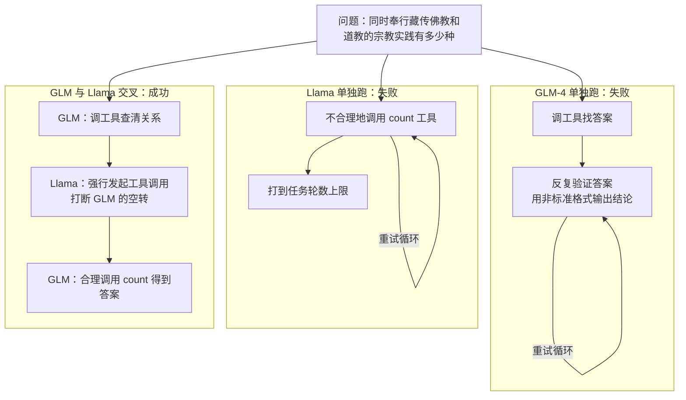

# 同步 RL 只能等最长的那条多轮轨迹跑完：AgentRL 把生成和训练拆开，再按任务归一化优势

<!-- release-date: 2025-10-05 -->

> 本文依据本地 `papers/Tsinghua/AgentRL.pdf`，即 **AgentRL: Scaling Agentic Reinforcement Learning with a Multi-Turn, Multi-Task Framework**，arXiv:2510.04206v1、2025-10-05 提交，共 24 页。页码均指 PDF 自身的页码。作者来自清华大学与 Z.AI，多位作者标注为在 Z.AI 实习期间完成（PDF p. 1）。文中会区分三件事：**论文明确写了什么**、**我们怎么解释它**、**哪些是外部资料或本文推算**。

## 读前先把几个词说成人话

这篇不发布新模型结构，也没有预训练配方。它讲的是：把语言模型放进会多轮回应的环境里做强化学习，同时训五个不一样的环境，框架和算法各自要改什么。先把反复出现的词说清楚：

- **强化学习（Reinforcement Learning，RL）**：策略跟环境交互、按累计奖励更新自己。这里的策略就是语言模型本身。
- **可验证奖励强化学习（RL with Verifiable Rewards，RLVR）**：奖励由程序判定，比如数学对错、单测、任务有没有完成，不靠学出来的奖励模型（PDF p. 2、p. 15）。
- **GRPO（Group Relative Policy Optimization，组相对策略优化）**：同一道题采一组轨迹，用组内回报的相对高低当优势，不训价值网络。本篇拿它当基线算法（PDF p. 16、p. 18）。
- **展开（rollout）**：模型在环境里走完一整条轨迹，得到观察、动作和奖励。与之相对的 **训练（training）** 是拿这些轨迹算损失、改参数。
- **智能体强化学习（agentic RL）**：模型走一步、环境回一个观察、模型再走一步，直到成功、失败或超时。论文把它写成马尔可夫决策过程；只有一步时退化成多臂老虎机，多步才是本篇的对象（PDF p. 3、p. 15）。
- **函数调用（function call）**：模型不直接吐「go to cabinet 1」这类自由文本，而是按约定格式调用工具，环境只执行工具参数。
- **离策略偏差（off-policy bias）**：用稍旧的策略采的数据去更新新策略，梯度会偏。异步训练天然带来它。

对照时会点到几篇站内解读：verl 的论文见 HybridFlow 一篇；GRPO 的出处见 DeepSeekMath 一篇；另一条全异步 RL 系统见 AReaL 一篇。

## 一句话先说清

2025 年的语言模型 RL，多半还是「一次生成、一个任务」：数学题写完就打分，每个任务单训一个模型。论文把智能体场景的难处拆成一张二乘二的表（PDF p. 3，Table 2）：

| | 基础设施 | 算法 |
|---|---|---|
| 单轮 | 同步 rollout | 稳定、可扩展的训练 |
| 多轮 | 同步 rollout 算力利用差，需要异步训练；可交互的同构环境难以大规模拉起 | 状态空间更大，需要更多探索，但探索在训练中衰减 |
| 多任务 | 异构环境难以统一 | 任务之间互相干扰，泛化不足 |

AgentRL 对这四格各给一个设计：生成和训练分资源组异步跑；环境统一成函数调用、容器化、由中央控制器管理；跨策略采样撑开探索；按任务归一化优势稳住多任务。

五个 AgentBench 任务上，32B 相对自己的提示基座涨了多少，是 Figure 1(a) 的柱（PDF p. 1）。改写成表，数字与 Table 3 一致（PDF p. 7）：

| 任务 | Qwen2.5-32B-Instruct 提示 | AgentRL 32B | 增益 |
|---|---:|---:|---:|
| OS | 37.0 | 51.7 | +14.7 |
| WebShop | 27.5 | 58.6 | +31.1 |
| DB | 55.8 | 70.4 | +14.6 |
| KG | 33.8 | 77.0 | +43.2 |
| ALFWorld | 32.1 | 94.5 | +62.4 |
| 平均 | 37.2 | 70.4 | +33.2 |

平均一行的增益是我们用表 3 算的。70.4 高于 GPT-5（52.2）、Claude-Sonnet-4 Thinking（58.2）和 DeepSeek-R1（49.3）的提示结果（PDF p. 7）。另一条同样重要的结论在 Table 4：一个模型同时训五个任务，平均 67.7，和五个单任务专家各取最好拼出来的 67.8 几乎一样（PDF p. 7）。

两处容易读过头，后面会拆开：70.4 是他们自己改造的 **AgentBench-FC** 口径下的五任务平均，不是每一格都第一；「超过 GPT-5」只在这五个环境里成立。

### 一条阅读路线

1. **p. 3 的 Table 2**：先看清四格难处，后面四个设计一一对准它们。
2. **p. 4 的 Figure 3、p. 5 的 Figure 4**：同步和异步的时间线，以及吞吐翻倍的证据。
3. **p. 5 的 Figure 5、p. 16–17 的附录 D**：环境框架怎么把五个任务收成同一套接口。
4. **p. 5–6 的 Figure 6 与式 (1)**：跨策略采样和任务优势归一化，一个管探索，一个管尺度。
5. **p. 7 的 Table 3、Table 4**：主结果和「一个模型对五个专家」。
6. **p. 8 的 Table 6、Figure 7，p. 9 的 Figure 8**：两个算法改动的消融与验证。
7. **p. 20 的 Table 7**：RL 到底教会了什么——很大一块是「把任务做完」。

## 主要矛盾：轨迹长短差一个量级，任务快慢差一个量级

多轮智能体和单轮数学题，差的不是轨迹长一点。

模型每走一步都要等环境：查知识图谱、跑 SQL、点网页、在 Ubuntu 里执行 bash。有的轨迹三步结束，有的走到最大轮数才被掐掉。单轮 RL 常用的做法是先生成一整批、再训练、再生成（PDF p. 3）。放到多轮上，**处理短轨迹的卡只能空转着等长轨迹**。论文把这写成扩展障碍：效率下降，RL 推不到更大规模（PDF p. 3）。

多任务又叠了一层。多数 LLM 智能体工作是一个任务训一个策略（PDF p. 3）。想要一个通才，五个环境的动作格式、状态表示、算力需求都不一样；学习速度也不齐——一个任务的奖励已经抬头，另一个几乎不动，标准 RL 会被快的那个带着走（PDF p. 6）。

所以要解决的不是「一个更聪明的优势估计」，而是四件事同时成立：长短轨迹不必互相等，环境不必为训练循环各写一套代码，多轮后期还在探索，快慢任务能用同一把尺子进同一个 batch。

Table 1 把当时的系统摆在一起（PDF p. 2）：

| 方法 | 多轮 | 多任务 | 全异步 | 训练时实时交互 | 异构环境 |
|---|---|---|---|---|---|
| VeRL、OpenRLHF、NeMo-Aligner、EasyR1、ToolRL | 否 | 否 | 否 | 否 | 否 |
| AReaL | 是 | 否 | 是 | 否 | 否 |
| AgentTuning | 是 | 是 | 否 | 否 | 否 |
| DigiRL、RAGEN、GiGPO、ARPO | 是 | 否 | 否 | 是 | 否 |
| AgentRL | 是 | 是 | 是 | 是 | 是 |

勾叉是论文自己的分类，不是独立评测。它证明的是「当时没有系统同时占满这五格」，不是别的系统在各自问题上没用。

## 先看全景：训练框架和环境框架，中间隔一个控制器

原图引自 PDF p. 5 的 Figure 5。左半是训练框架，右半是环境部署框架，两边只通过中间的控制器说话：训练侧只看得见 Start、Action 和回来的观察与奖励，看不见环境是 Ubuntu 容器还是 MySQL。

四个设计各落在图上的一块：

| 缺口 | 设计 | 落在哪 |
|---|---|---|
| 多轮轨迹长短差大，同步 batch 让 GPU 空转 | 生成、训练分资源组，协程调度，动态 batch | 左半：Training 与 Rollout 分开 |
| 要同时拉起大量可交互环境，还要异构 | 函数调用接口、容器化、中央控制器 | 中间与右半 |
| 多轮状态空间大，训练后期探索塌缩 | 跨策略采样 | Rollout 里每一步由谁生成 |
| 多任务难度、长度、采样效率差太多 | 任务优势归一化 | Training 算损失之前 |

训练框架的出处写在附录：在 verl 上做了一次「完全异步改造」（PDF p. 18）。HybridFlow 一篇讲的是 verl 如何让几类模型之间调度；AgentRL 接着回答的是多轮环境交互时，生成和训练怎么叠着跑。

## 核心设计一：生成和训练拆开，按「已完成」而不是按「整批」触发训练

原图引自 PDF p. 4 的 Figure 3。上半的同步架构里，蓝色环境块在各条轨迹上的分布长短不一，但 Training 必须等最长那条的虚线到了才开始；下半的异步架构里，Rollout 和 Training 各占 4 张卡，两条带子并排一直转。

### 旧问题

同步架构把 rollout 和 training 排成一条时间线。一批里只要有一条长轨迹，整批卡都得等（PDF p. 3–4）。

### 新设计与工作机制

rollout 引擎放在**专用资源组**上，和训练异步执行。训练模块每次更新后，从 rollout 引擎拉取**已经完成的数据**，不等整批结束；batch 大小允许在一定范围内浮动；调度器用协程把空闲的 GPU 槽填上（PDF p. 4）。

异步必然带来离策略偏差。论文压它的办法只有两条（PDF p. 5）：

1. 数据队列设最大长度；
2. 每一步把轨迹**全部**搬进训练引擎，让数据尽量贴近最新策略。

原话是这样做的效果「later experiments suggest to be acceptable」（PDF p. 5）。正文和附录都没有一张专门量化偏差的图或表，「可接受」是作者的判断，不是带数字的实验结论。

### 收益

Figure 4 在 WebShop 上用 Qwen2.5 的 14B 模型比吞吐，双轴都是对数坐标（PDF p. 5）。图上的标注改写成表：

| GPU 数 | 同步基线 | AgentRL 异步 | 倍数（本文推算） |
|---:|---:|---:|---:|
| 16 | 9K tokens/s | 17K tokens/s | 约 1.9 |
| 32 | 16K tokens/s | 33K tokens/s | 约 2.1 |
| 64 | 29K tokens/s | 56K tokens/s | 约 1.9 |

图上还有一条 Perfect Scaling 参考线，异步曲线贴着它走。论文没有把吞吐换算成端到端墙钟，也没有报一次完整训练要多少 GPU 小时。吞吐证明的是这一段流水线更快，不是同样质量下总账更低。

### 代价与边界

- 两份模型同时在场：一份生成，一份训练，参数要在两组之间搬。图上画了 Params Transfer，没有测它占一轮的比例。
- 动态 batch 意味着下游的优势估计、梯度裁剪不能默认「每步样本数固定」。论文只说「在一定范围内浮动」，没给上下界。
- 最小配置是 16 张 H800 训 14B，卡越多越快（PDF p. 18）。

### 可迁移启发

多轮 RL 的空转，往往不是算子慢，而是**同步屏障放错了位置**。按「已完成轨迹」而不是「整批结束」触发训练，短轨迹就不必陪长轨迹等。轨迹长度方差大的负载都适用：智能体、长思维链、带工具的搜索。但一定要同时写清两道闸：队列上限和每步搬空，否则异步就是在无限制地吃旧数据。

## 核心设计二：把五个异构环境收成同一套函数调用

### 旧问题

五个任务本来不说同一种话：OS 要 bash，DB 要 SQL，KG 要图查询，ALFWorld 要文本动作，WebShop 要搜索和点击（PDF p. 17–18）。若每个环境自己定义「模型该怎么说话」，训练引擎就要为每个任务写一套解析、会话管理和监控，成本按任务数线性涨（PDF p. 3、p. 6）。

### 新设计

环境部署框架三件套（PDF p. 5）：

1. **基于函数调用的统一 API**：用工具调用替换各环境自定义的动作格式，从而能集中管理和监控；
2. **容器化部署**：每个任务环境是一个隔离的执行单元，并发会话之间故障隔离；
3. **中央高性能控制器**：训练引擎的全局编排者，管理「数千个」并行训练回合的生命周期。

多任务再加两层一致性（PDF p. 6）：Worker 侧，所有任务用同一组生命周期操作实例化和管理；训练侧，控制器只给 RL 引擎留一个网关，多任务执行对训练循环而言是单任务的透明扩展。

### 工作机制：AgentBench-FC

附录 D 把 AgentBench 的五个环境改造成函数调用版本，他们称为 **AgentBench-FC**（PDF p. 16–17）：

- 按 OpenAI Function Call 格式为每个环境抽出工具。KG 环境实现了七个工具，点名的有 `get_relations`、`get_neighbors`、`count`；
- 各环境的交互逻辑改成接受外部函数调用请求；
- 控制器与 Worker 的接口重写：`start_sample` 开一个任务，`interact` 负责多轮交互，另加 `list_sessions`、`list_workers` 监控容器内的会话和 Worker。

Worker 内部还有一层抽象的环境控制器，负责建会话、处理交互、强制超时和清理；执行逻辑因此和物理部署分开，后端可以换，负载变化时能弹性伸缩。控制器本身用非阻塞分发，靠严格的加锁层级避免死锁，用超时做故障检测，不稳定的节点自动注销再接回（PDF p. 18）。

奖励统一压到 $[0,1]$：没有内在奖励信号的任务，答对 1、答错 0；异常终止（超出最大交互轮数或最大回复长度）再罚 $-0.2$，用来鼓励正常收束（PDF p. 17–18）。$-0.2$ 已经越出 $[0,1]$，论文把两句并排写，没有解释如何再缩放。

### 收益

收益首先是**异构能扩展**，不是某一格涨了几分。五个任务能放进同一次 GRPO 训练，靠的就是这套接口；没有它，后面的「一个模型对五个专家」根本跑不起来。

### 代价与边界

统一成函数调用，等于把「模型会不会按格式说话」变成训练的一部分：

- Qwen2.5-7B 在 ALFWorld 评测时生成不了合法的工具调用格式，只好给一条一次示范（PDF p. 7，Table 3 脚注）；
- GLM-4-9B 要先用少量监督微调适应函数调用格式，才进入 RL；Qwen 系列则不做热身 SFT，直接 RL（PDF p. 7、p. 18）；
- KG 环境上，API 基线的结果是在一次示范下测的，保证它们能正确调工具；训练出来的模型训练和评测都不带示范（PDF p. 17）。

**接口统一省的是框架代码，税收在模型的格式学习上。** 「数千个并行回合」是论文给的量级，没有并发上限、延迟分布或控制器开销的测量。

### 可迁移启发

多任务 RL 的第一笔投资，往往不是更聪明的损失，而是先让环境对训练引擎长得一样。把「开会话、走一步、收观察、关会话」收成一组固定动词，新任务就是一个 Worker 镜像，而不是一次框架分叉。函数调用是目前最省事的动词表；换成别的协议也行，关键是训练循环看不见任务差异。

## 核心设计三：跨策略采样，让一条轨迹不只听一个模型的

### 旧问题

RL 训练里，模型的探索会随时间衰减；多轮设定的状态空间大，这个问题更重（PDF p. 5）。论文还援引了 **模型崩塌（model collapse）**：反复在自己生成的数据上训练，能力下降、方差变小（PDF p. 5）。

**我们如何解释它。** 单轮题里探索不够，最多是没见到某种解法；多轮里某一步走偏，后面整条成功路径都进不了训练数据。探索不足会被轨迹长度放大。

### 新设计

原图引自 PDF p. 5 的 Figure 6。空白块是模型 1，斜线块是模型 2。**Mix 不是 Cross**：Mix 只是把两个模型各自的完整轨迹拼进同一个数据集；Cross 是在同一次与环境的交互里，每一步都可能换模型。

**跨策略采样（cross-policy sampling）**：构造轨迹时，每一步的动作从可用的模型池里随机抽，不固定于一个模型（PDF p. 5–6）。附录 C 写成（PDF p. 16，式 20）：

$$
a^{c,(t)} \sim \mathrm{random}(\mathcal{M})(\cdot \mid s^{(t)})
$$

$\mathcal{M}$ 是模型池，$s^{(t)}$ 是复合状态：环境状态加上到这一步为止的语言上下文。

论文给的直觉是：语言状态经一个落地函数映到环境状态；成功集合在语言空间里有一个「合法且能走到成功」的前像。跨策略采样扩大了对这个前像的覆盖，同时每一步仍是某个正常模型的输出，所以不会滑进不连贯的语言区域（PDF p. 6、p. 16）。**这是形式化的直觉，不是被证明或直接测过的覆盖率定理**；它的证据是下面的 pass@k 实验。

训练时很难把不同架构的模型塞进同一条流水线，所以实际做法是让模型和**自己的旧版本**交叉：把一部分 rollout 引擎标成 **陈旧引擎（stale engine）**，它们隔多步才更新一次参数，而不是每步都更新（PDF p. 6）。间隔是多少，论文没写。

### 收益：先看推理，再看训练

原图引自 PDF p. 9 的 Figure 8。

**推理侧（左图）。** 不训练，直接在 WebShop 上用 Qwen2.5-14B-Instruct 和 Llama-3.1-8B-Instruct 做跨策略推理（PDF p. 9）。论文的读法是：$k$ 小时跨策略略低于最好的单模型；$k$ 变大后它超过两个单模型，也超过 mix，说明它探到了两个模型各自能力边界之外的路径（PDF p. 9）。mix 的最大 $k$ 是其他策略的两倍，因为两个模型的数据合在一起；即便多给了一倍尝试次数，它在 256 的读数仍低于跨策略在 128 的读数（我们读图约 0.68 对 0.70）。

**训练侧（右图）。** 这是 WebShop 上的预备实验，图注写明设置和主实验不完全相同（PDF p. 9）。两条训练后的曲线在 pass@1 上都远高于未训练的基座；带跨策略的一条在整条曲线上都更高，论文的读法是它在提升能力的同时保住了多样性（PDF p. 9）。我们读图，pass@1 处约 0.49 对 0.42，pass@128 处约 0.78 对 0.74。

**消融。** Table 6 在 14B 上关掉跨策略，平均从 65.0 掉到 60.7，KG 从 67.7 掉到 55.7，OS 从 45.1 掉到 39.7（PDF p. 8）。完整表在下一节。

### 一个互补失败的例子

附录 E.5.1 给了一个 KG 问答案例（PDF p. 19–20，Figure 9）。改画成流程：

按 PDF p. 20 的 Figure 9 与 p. 19–20 的文字重画，是案例示意，不是统计结果。GLM-4 能推出答案，却绕过「用工具验证」的协议，反复用非标准格式输出结论；Llama 对工具的理解是错的，一直用错误逻辑调工具（PDF p. 19）。交叉之后，Llama 的策略虽然自己也调不对，却起到了「逼回工具调用」的作用，给 GLM 创造了一次合法调用的机会（PDF p. 20）。

**我们如何解释它。** 这说明的是**互补的失败模式**，不是「两个弱模型平均一下变强」。跨策略的价值取决于池子里的策略真的不同；两个副本只会犯同一种错，交叉换不来新路径。

### 代价与边界

- 论文自己在限制里写了：融合不同策略会带来轻微的分布偏移，训练动态上可能出现温和、短暂的不稳，这是换更宽状态覆盖的代价；自适应策略加权留给未来（PDF p. 24）。
- **推理实验和训练主结果不是同一种交叉。** Figure 8(a) 与 Figure 9 是两个不同家族的模型；训练里用的是「当前策略 × 自己的陈旧副本」（PDF p. 6）。两者相关，但论文没有做「训练时交叉 Qwen 和 Llama」的实验。

### 可迁移启发

多轮探索不一定要加噪声或熵奖励，还可以**在时间轴上把策略切开**，让不同策略在同一条轨迹里接力。最便宜的第二个策略来源是自己的旧 checkpoint，不必真维护第二套模型。要预期的代价是轻微的分布偏移。

## 核心设计四：按任务归一化优势，别让好学的任务吃掉难学的任务

### 旧问题

五个任务的难度、序列长度、采样效率差得很远。标准 RL 会让它们以很不同的速度学：一个任务的奖励明显抬头，另一个几乎不动，于是训练不稳、表现失衡（PDF p. 6）。GRPO 只在「同一道题的一组轨迹」内部做相对比较，管不到跨任务的尺度。

### 新设计

一次高层动作 $a_t$ 是一串 token。每个 token 有一个优势估计 $\hat{A}_{i,s,g,t,k}$，下标依次是：任务 $i$、该任务里的第 $s$ 个样本、该样本的第 $g$ 条轨迹、环境步 $t$、动作里第 $k$ 个 token（PDF p. 6）。

把任务 $i$ 在当前 batch 里全部 token 的优势收成集合 $\mathcal{A}_i^{\mathrm{tok}}$，逐个减去均值、除以标准差（PDF p. 6，式 1）：

$$
\tilde{A}_{i,s,g,t,k} = \frac{\hat{A}_{i,s,g,t,k} - \mu_i}{\sigma_i},
\qquad
\mu_i = \mathrm{mean}(\mathcal{A}_i^{\mathrm{tok}}),\quad
\sigma_i = \mathrm{std}(\mathcal{A}_i^{\mathrm{tok}})
$$

结果是每个任务在本 batch 里的 token 级优势都是零均值、单位方差，任务之间的方差差异被抹平（PDF p. 6）。

**我们如何解释它。** 附录里 GRPO 的优势是轨迹级的组内相对回报（PDF p. 16，式 19），式 (1) 的输入 $\hat{A}$ 是已经算好的 token 级优势。按这个写法读，顺序是先组内、再任务内：组内回答「同一道题哪条轨迹更好」，任务内回答「这个任务的优势和另一个任务的优势能不能用同一把尺子」。论文没给伪代码，**这个叠加顺序是我们的解释，不是原文保证**。

### 收益

原图引自 PDF p. 8 的 Figure 7，纵轴是训练时的通过率。

- **左图（KG，跨策略）**：关掉跨策略的曲线在 400 步前甚至略高，之后走平；论文的原话是它「reaches the top earlier」（PDF p. 8）。**我们如何解释它**：更早见顶不是学得更快，而是探索过早收束，把能力边界冻在较低处。
- **中图（ALFWorld，任务归一化）**：关掉归一化后抬升明显变慢，要多走约 100–200 步才追上（读图约值）；论文说训练效率严重下降、在一些任务上出现波动，模型倾向于按不同速率学不同任务，而不是一起学（PDF p. 8）。
- **右图（五环境平均）**：完整方法全程最高；去掉跨策略的曲线在约 400 步后走平，去掉任务归一化的曲线起步最晚，到 700 步时两条消融曲线汇到约 0.68（读图约值）。

Table 6 是同一组消融的最终数字（PDF p. 8）：

| 方法 | ALFWorld | DB | KG | OS | WebShop | 平均 |
|---|---:|---:|---:|---:|---:|---:|
| AgentRL-14B | 93.1 | 64.0 | 67.7 | 45.1 | 55.0 | 65.0 |
| 去掉跨策略采样 | 91.9 | 61.6 | 55.7 | 39.7 | 54.5 | 60.7 |
| 去掉任务优势归一化 | 91.1 | 62.6 | 54.7 | 38.0 | 50.6 | 59.4 |

两刀都主要伤在 KG 和 OS。KG 掉得最狠（约 12–13 个点），和「越开放的环境越需要探索、越怕被别的任务淹没」是一个方向。

### 代价与边界

- 把每个任务都拉到单位方差，等于告诉优化器「五个任务同样重要」。想让某个任务多学一些时，这个设计会帮倒忙。
- 它和数据侧配套：小数据集被复制到与最大任务出现次数大致相同，再按任务轮流交错输出（PDF p. 6）。归一化对齐尺度，采样对齐次数，两者缺一都不完整。
- 它稳定的是联合训练过程，不保证每个任务都到最优：WebShop 上单任务专家仍然更高（见下一节 Table 4）。

### 可迁移启发

一个 batch 里混着多种难度的任务时，先问优势在哪一层归一化。只在全局归一，难任务的信号被吞；只在组内归一，跨任务的步长仍不可比。按任务再做一次标准化，是几乎不改模型结构的低成本稳定器。

## 训练时实际怎么跑

基座是现成的 Qwen2.5-Instruct（3B、7B、14B、32B）和 GLM-4-9B-0414（PDF p. 7、p. 18）。附录 E.2 给出的配置（PDF p. 18）：

| 项目 | 论文写了什么 |
|---|---|
| 算法 | GRPO 为基线，加第 3 节的改动 |
| 推理引擎与训练并行 | SGLang；FSDP |
| 采样 | 温度 0.8，每次 rollout 采 8 条 |
| 奖励 | 整条轨迹对错的二值分；超最大轮数或最大回复长度罚 $-0.2$ |
| 硬件 | H800，14B 最少 16 卡 |
| 步数 | 多任务混合设定下超过 1000 步 |
| 冷启动 | Qwen 不做热身 SFT；GLM-4-9B 先用少量 SFT 适应函数调用格式 |
| 评测 | 温度 0.8，每个任务连续跑 4 次取平均；API 模型同样参数 |

训练数据（PDF p. 16）：ALFWorld 与 WebShop 直接用官方训练集；OS、KG、DB 没有现成训练数据，用 Self-Instruct 生成，调用 o3 与 claude4-sonnet 的 API 采样和过滤；DB 另混入 BIRD 的 Text-to-SQL 训练样本。

Figure 1(b) 画的是 32B 的训练进度，横轴是训练样本数（单位 M，0–3.0），起点标着 37.2%（w/o SFT）（PDF p. 1）。论文没有定义这里的样本指轨迹、环境步还是 token。

**论文没写的**：学习率、KL 系数、裁剪范围、最大轮数、最大回复长度、各任务样本数、陈旧引擎的更新间隔、动态 batch 的上下界、训练墙钟。

## 实验证明了什么，没证明什么

### 主结果：平均分的第一，不是每一格的第一

Table 3 报四次重复的均值（PDF p. 7），摘主要行：

| 模型 | ALFWorld | DB | KG | OS | WebShop | 平均 |
|---|---:|---:|---:|---:|---:|---:|
| Claude-Sonnet-3.7 Thinking | 54.1 | 68.4 | 38.2 | 53.1 | 36.0 | 50.0 |
| Claude-Sonnet-4 Thinking | 69.0 | 68.4 | 64.4 | 51.0 | 38.3 | 58.2 |
| GPT-5（2025-08-07） | 65.4 | 63.2 | 64.1 | 34.5 | 33.7 | 52.2 |
| DeepSeek-R1（2025-05-28） | 51.4 | 60.4 | 50.2 | 53.6 | 31.0 | 49.3 |
| Qwen2.5-14B-Instruct | 8.7 | 48.4 | 35.3 | 26.0 | 17.6 | 27.2 |
| AgentLM-13B | 76.0 | 33.7 | 26.8 | 18.1 | 70.8\* | 45.1 |
| AgentLM-70B | 86.0 | 37.7 | 47.0 | 21.5 | 64.9\* | 51.4 |
| AgentRL w/ Qwen2.5-3B | 92.4 | 60.0 | 55.0 | 40.5 | 52.1 | 60.0 |
| AgentRL w/ Qwen2.5-7B | 91.5† | 63.7 | 57.8 | 40.8 | 56.1 | 62.0 |
| AgentRL w/ Qwen2.5-14B | 91.5 | 72.2 | 72.8 | 43.6 | 58.5 | 67.7 |
| AgentRL w/ Qwen2.5-32B | 94.5 | 70.4 | 77.0 | 51.7 | 58.6 | 70.4 |
| AgentRL w/ GLM-4-9B-0414 | 93.3 | 66.9 | 75.7 | 33.2 | 55.9 | 65.0 |

\* 是直接摘自原论文的奖励值，不是本篇复测；† 是给了一次示范（PDF p. 7）。

读表要一起记住的几条：

1. **第一说的是五任务平均。** WebShop 上 AgentLM-13B 的 70.8\* 高于 AgentRL 32B 的 58.6；OS 上 DeepSeek-R1 的 53.6、Claude-Sonnet-3.7 Thinking 的 53.1 都高于 51.7（PDF p. 7）。
2. **3B 到 32B 平均单调上升**：60.0、62.0、67.7、70.4（PDF p. 7，Table 3）。附录称之为 scaling law 趋势（PDF p. 19），这是四档的观察，不是拟合过的定律。
3. **3B 已经高过 GPT-5 的平均。** 论文写「从 3B 到 32B 全部超过」这几个强基线（PDF p. 8）。这更多说明针对这五个可验证环境做 RL 很值，而不是 3B 通用智能体超过了 GPT-5。
4. **口径不完全对称。** KG 上 API 基线带一次示范、训练模型不带（PDF p. 17）；ALFWorld 上 7B 带示范（PDF p. 7）。
5. **GLM-4-9B 的 OS 只有 33.2**，明显低于其他 AgentRL 行。能接上不同家族，不代表每个任务都涨。

### 一个多任务模型 ≈ 五个专家拼盘，而专家几乎不迁移

Table 4 在 14B 上比较单任务与多任务（PDF p. 7）：

| 只在该任务上训 | ALFWorld | DB | KG | OS | WebShop | 平均 |
|---|---:|---:|---:|---:|---:|---:|
| ALFWorld 专家 | 89.7 | 49.7 | 22.3 | 33.7 | 15.9 | 42.3 |
| DB 专家 | 0.2 | 73.9 | 26.2 | 43.1 | 16.0 | 31.9 |
| KG 专家 | 4.6 | 57.6 | 72.2 | 40.3 | 19.5 | 38.8 |
| OS 专家 | 5.7 | 58.2 | 25.3 | 39.8 | 22.0 | 30.2 |
| WebShop 专家 | 0.0 | 57.9 | 30.7 | 40.1 | 60.3 | 37.8 |
| 五个专家各取最好 | 89.7 | 73.9 | 72.2 | 43.1 | 60.3 | 67.8 |
| 一个多任务模型 | 91.5 | 72.2 | 72.8 | 43.6 | 58.5 | 67.7 |

多任务模型在 ALFWorld、KG、OS 三格略高，DB、WebShop 略低，平均只差 0.1。对照 Table 3 里 14B 的提示基座（ALFWorld 8.7、WebShop 17.6），DB 专家在 ALFWorld 上是 0.2、WebShop 专家是 0.0，比没训之前还差。

**这张表证明的是：在这五个环境上，联合训练几乎不牺牲峰值。** 它没有证明任意新任务都能这么便宜地加进来。单任务方向的负迁移很狠，说明共享的「工具调用协议」不会自动变成跨任务技能。

### 没见过的任务：BFCL-v3

只在五个 AgentBench 任务上训过的 32B，拿到 Berkeley Function Calling Leaderboard v3 上测（PDF p. 8，Table 5）：

| | 单轮 nonlive | 单轮 live | 多轮 | 总体 |
|---|---:|---:|---:|---:|
| Qwen2.5-32B-Instruct | 86.0 | 77.4 | 16.2 | 59.9 |
| AgentRL 32B | 85.8（−0.2） | 79.3（+1.9） | 19.2（+3.0） | 61.4（+1.5） |

多轮 +3.0，总体 +1.5，单轮 nonlive 略降。论文把它读成对函数调用泛化有帮助（PDF p. 8）。幅度不大，而且 BFCL 仍是函数调用；作为分布外证据，它是温和的正信号。

### RL 很大一块在教「把任务做完」

Table 7 对比 Qwen2.5-14B 基座和 AgentRL 的两种终止状态（PDF p. 20）。**Completed 只表示提交了答案，不保证正确**；两种状态不穷尽，加起来不一定到 100%。

| 环境 | 基座 Completed | 基座打到轮数上限 | AgentRL Completed | AgentRL 打到轮数上限 |
|---|---:|---:|---:|---:|
| ALFWorld | 0.070 | 0.68 | 0.926 | 0.074 |
| DB | 0.957 | 0.043 | 0.993 | 0.007 |
| KG | 0.747 | 0.213 | 0.947 | 0.033 |
| OS | 0.548 | 0.444 | 0.847 | 0.118 |
| WebShop | 0.725 | 0.275 | 0.980 | 0.020 |

ALFWorld 变化最大：基座 68% 的回合耗尽轮数，训完 92.6% 会提交答案。附录 E.5.3 用「把盐瓶放进抽屉」拆开行为差（PDF p. 21）：基座四次都失败，反复发出非法动作 `look` 而不用 `take_action` 工具、死盯柜子；RL 后四次都成功，会正确用 `take_action`、优先搜台面、在台面 3 找到盐瓶，再走到抽屉 1、打开、放进去。

**我们如何解释它。** 这和奖励设计是对齐的：$-0.2$ 的异常终止惩罚明确告诉模型「先学会结束」。成功率的上涨里，有一部分来自不再耗尽回合和工具格式用对了，不全是「更会推理」。

### 消融表和主表的 14B 对不上

Table 6 的 AgentRL-14B 平均是 65.0，Table 3 同尺寸是 67.7；各格也不同，比如 ALFWorld 93.1 对 91.5，DB 64.0 对 72.2（PDF p. 7–8）。论文没有说明两张表是否来自同一次训练、同一套超参或同一个 checkpoint。**Table 6 三行内部比较是合法的**；把 65.0 当成 Table 3 的 67.7 来读不行。

## 限制、边界，以及不要补进去的实现

论文在附录 G.1 只列了两条（PDF p. 24）：跨策略采样带来轻微分布偏移和短暂不稳；实验只在受控环境里做，更复杂、更动态的真实场景是下一步。

读完还必须留下的判断：

- **离策略偏差没有被测量。** 只有「队列上限 + 每步搬空」两条措施和一句「可接受」。
- **跨策略的两条证据链不是同一设置。** 推理与案例用异模型，训练用同模型的陈旧副本，间隔未公开。
- **任务归一化与 GRPO 组内归一化的叠加顺序没有伪代码。**
- **14B 的主表与消融表对不上**，原因未说明。
- **没有开放环境。** 相关工作提到 GUI 智能体，实验里没有真实浏览器、真实 GUI 或开放互联网。
- **AutoGLM 只是一句声明。** 摘要说算法和框架被用于构建 AutoGLM（PDF p. 1），但没有 AutoGLM 的新数字，也没说 AgentRL 在其中占哪一段。不要把 70.4 读成 AutoGLM 的成绩。
- **未公开的超参**：见上一节末尾那张清单。

## 可迁移启发

1. **先拆同步屏障，再谈算法。** 多轮 RL 的第一瓶颈常是「短的等长的」。按完成而不是按整批触发训练，代价是离策略偏差和参数搬运，必须显式限队列。
2. **环境对训练引擎要长得一样。** 函数调用、容器、控制器三件套的价值，是让「加第 N 个任务」变成加一个 Worker。统一接口的税是模型要先学会格式——冷启动 SFT 或一次示范要预留。
3. **探索可以在轨迹内部换策略。** 跨策略不是「多采几条」，是「一步换一个老师」；最便宜的第二个老师是自己的旧权重。只有失败模式互补时它才有用。
4. **多任务先对齐优势的尺子，再对齐采样次数。** 任务归一化和均匀采样是一对。
5. **单任务专家的迁移可能接近零甚至为负。** 若目标是一个模型覆盖一类环境，联合训练是能不能用的前提；只上线一个环境时，单任务专家可能仍略强。
6. **奖励会改行为，不只改分数。** 评估时把「提交率」和「正确率」分开看，否则会把「学会收尾」误读成「学会推理」。
7. **平均第一要连着口径读。** AgentBench-FC、温度 0.8、四次平均、五任务等权、API 基线在 KG 上带示范。

## 关键词回看

- **智能体强化学习**：模型作为策略在环境里多轮行动。单步退化为多臂老虎机，多步才是本篇的对象。
- **全异步生成–训练**：rollout 与 training 分资源组，训练按已完成轨迹拉数据，batch 可浮动；队列上限与每步搬空压离策略偏差。
- **AgentBench-FC**：把 AgentBench 五个环境改成 OpenAI 函数调用协议后的训练与评测口径。
- **控制器 / Worker**：`start_sample`、`interact`、`list_sessions`、`list_workers`；控制器是训练引擎唯一的网关。
- **跨策略采样**：轨迹的每一步从模型池随机抽动作。与 Mix（轨迹级拼数据）不同。
- **陈旧引擎**：隔多步才同步参数的 rollout 副本，训练中充当「另一个策略」。
- **任务优势归一化**：每个任务的 token 级优势在本 batch 内标准化为零均值、单位方差。
- **Best of Five**：五个单任务专家各取最好拼出的上界，67.8；一个多任务模型 67.7。
- **异常终止惩罚**：超轮数或超长度罚 $-0.2$，把「学会结束」写进目标。

## 资料与阅读边界

### 本文依据的版本与首发日

- 原件：`papers/Tsinghua/AgentRL.pdf`，24 页，页边水印 `arXiv:2510.04206v1 [cs.AI] 5 Oct 2025`。正文到 p. 10，参考文献 p. 10–13，附录 A–H 在 p. 14–24。
- 官方页：[arXiv:2510.04206](https://arxiv.org/abs/2510.04206)。截至本文核验只有 v1，提交于 2025-10-05 13:40:01 UTC（[arXiv API](https://export.arxiv.org/api/query?id_list=2510.04206)）。
- `release-date` 取 **2025-10-05**。AgentRL 是框架与算法，论文没有放出训练后的模型权重；可用的是代码。官方仓库 [THUDM/AgentRL](https://github.com/THUDM/AgentRL) 第一条带内容的提交是 `3b8a255617`（init，2025-10-09 17:21 UTC），首批 release 标签 worker-v0.2.0、controller-v0.1.0 同日发布；论文所用的 AgentBench-FC 环境与数据在 [THUDM/AgentBench](https://github.com/THUDM/AgentBench) 的 `5bf4eb27f0`（publish agentbench_fc，2025-10-14）公开。两者都晚于 arXiv v1，所以最早的官方公开事件是 arXiv v1。

### 外部资料补充（不是 PDF 原文）

- 仓库 README 写明项目分训练框架与环境部署框架两部分，代码部分派生自 AgentBench 与 verl；并写了「以支持最多 10,000 个并发会话为目标，用 Go 重写了控制器」。论文正文只写「数千个并行回合」和附录 E.3 的自愈策略，没有 Go 或 10,000。
- 仓库之后持续演进（2026-01 仍有 release）。本文没有读源码，源码现状不在本篇时间轴内。
- AutoGLM 是更早的 GUI 智能体工作（Liu et al., 2024b，arXiv:2411.00820），本篇只声明被用于构建它。

### 报告明确写了、本文覆盖了的部分

摘要与 Figure 1；第 1–2 节的问题定义与 Table 1–2；第 3 节异步训练、环境框架、跨策略采样、任务优势归一化与 Figure 2–6；第 4 节 Table 3–6、Figure 7–8；附录 B 的 GRPO 写法、附录 C 的跨策略形式化、附录 D 的数据与 AgentBench-FC、附录 E 的训练设置、部署细节、案例与 Table 7、附录 G 的限制。附录 A 的 PPO / GAE / DAPO 背景与附录 F 的系统提示词只作背景，未展开。

### 原文没有公开、本文也不补的缺口

- 学习率、KL、裁剪、最大轮数、最大长度、陈旧引擎更新间隔、动态 batch 范围；
- 各任务训练样本量与 Self-Instruct 的过滤比；
- 离策略偏差、参数同步耗时、控制器开销、端到端 GPU 小时的实测；
- 任务归一化与组内归一化的精确计算顺序；
- Table 6 与 Table 3 的 14B 不一致原因；
- 真实开放环境上的结果，以及在 AutoGLM 中的具体作用。
