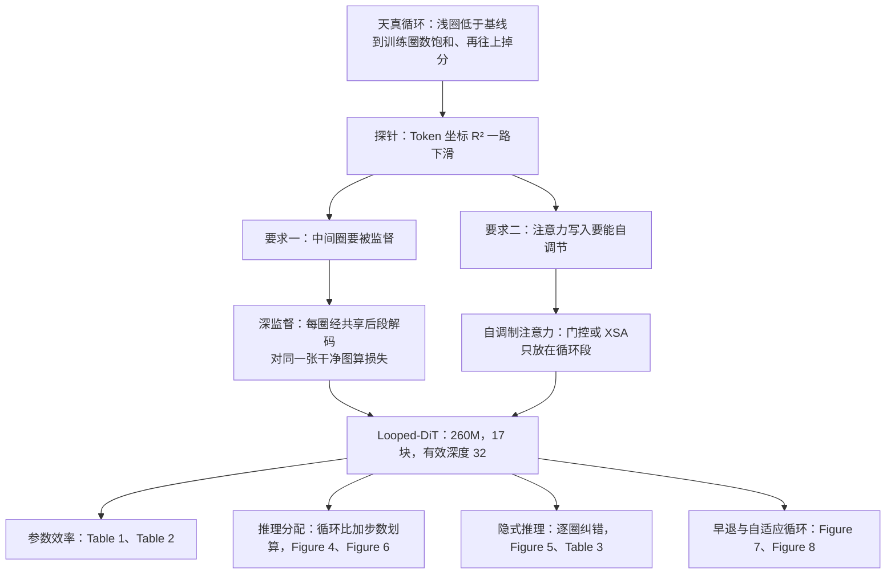
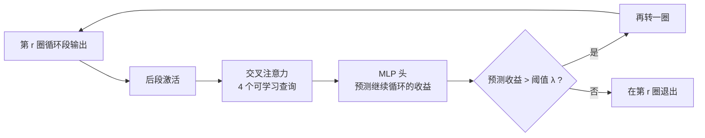

# 把中间几层在每个去噪步里多跑几圈：Looped-DiT 用循环深度换参数

<!-- release-date: 2026-09-30 -->

> 本文依据本地 `papers/Tsinghua/Looped-DiT.pdf`，即 **Looped Diffusion Transformer**，arXiv:2609.40305v1，页边标注 2026-09-30 提交，PDF 首页写的日期是 2026-10-01，共 21 页。作者来自 SenseTime Research、清华大学 LeapLab 与南洋理工大学，通讯作者是黄高（LeapLab）。页码均指 PDF 自身的页码。文中会区分三件事：**论文明确写了什么**、**我们怎么解释它**、**哪些是外部资料或本文推算**。

## 读前先把几个词说成人话

这篇论文的主角只有一个动作：把网络中间的几层，在同一个去噪步里反复用几遍。难点不在动作本身，而在「为什么天真地重复会坏掉」和「坏掉之后怎么修」。先把会反复出现的词说清楚：

- **扩散模型 / 流匹配（flow matching）**：从纯噪声出发，一步步把图「去噪」成清晰图像。每一步叫一个 **去噪步（denoising step）**，每步都要完整跑一遍网络。本文用的是流匹配这一族，训练目标是让网络预测「干净图该往哪个方向走」。
- **DiT / MMDiT**：DiT（Diffusion Transformer）是用 Transformer 当去噪网络的扩散模型；MMDiT（Multimodal DiT）是 Stable Diffusion 3 提出的变体，图像 Token 和文本 Token 各走各的参数，但在注意力里拼成一条序列互相看（PDF p. 18）。MMDiT 的来龙去脉见 Stable-Diffusion-3 一篇。
- **像素空间（pixel space）**：直接在像素上去噪，不先用 VAE 压成隐变量。本文的骨干 MiniT2I 就是像素空间模型（PDF p. 3）。
- **块（block）**：Transformer 的一层，含注意力和前馈网络。
- **循环 Transformer（Looped Transformer）**：把同一组块的参数重复使用 $N$ 次，计算深度变成 $N$ 倍，参数一个不加（PDF p. 2）。$N$ 叫 **循环深度（loop depth）**。
- **深监督（Deep Supervision）**：不只在最后一圈算损失，而是每一圈的中间结果都解码出来、都对着同一张干净图算损失。
- **自调制注意力（Self-Modulating Attention，SMA）**：在注意力输出写回残差流之前，按当前隐状态把它「调小」或「投影掉一部分」。论文试了两种：**门控注意力（Gated Attention）** 和 **排他自注意力（Exclusive Self Attention，XSA）**。
- **残差流（residual stream）**：每一层都在上一层的隐状态上「加一笔」，这条被反复累加的主干就叫残差流。注意力写进去的那一笔叫 **注意力更新**。
- **岭回归探针（ridge-regression probe）**：拿一个线性回归器，试着从隐状态里读出某种信息（这里是每个图像 Token 的二维坐标），用 $R^2$ 衡量读得准不准。读不准，说明这份信息在隐状态里变模糊了。
- **思维链（Chain-of-Thought，CoT）**：先用文字写出推理过程再作答。文生图里的 CoT 通常是先让语言模型改写、展开提示词。

这篇论文把语言模型里已有的循环 Transformer 思路搬到文生图上。语言模型一侧的循环模型见 Ouro 一篇与 Huginn 一篇，本文不重复。

## 一句话先说清

文生图模型变强，过去只有两条路：**把模型做大**，或者 **多走几个去噪步**。前者加参数、加部署成本；后者每多一步都要把整网再跑一遍。

Looped-DiT 走第三条路：**在每个去噪步内部，把中间 5 个块重复跑 4 遍**。参数仍是 260M，有效深度从 17 层变成 32 层（PDF p. 16）。

但天真地循环并不好用：循环圈数少时分数反而低于不循环的基线，圈数多了又饱和、再往上还掉分（PDF p. 2–3）。作者把病因追到两处，各配一味药：

1. **中间圈没人管** → 深监督：每一圈都解码、都算损失；
2. **注意力一圈圈往残差流里写得太猛，把空间位置信息冲淡** → 自调制注意力：按当前状态限制每次写入的量。

摘要给出的结论（PDF p. 1）：

- 一个 260M 参数的 Looped-DiT B/16，在多个文生图基准上超过参数多 6.5 倍的模型，推理计算少 4.9 倍；
- 同样的推理预算，加循环深度比加去噪步数更划算；
- 越往后的圈会纠正前面圈犯的错，表现出「隐式推理」的迹象。

读者要带走的边界是：这一切都在 **260M、512 × 512、像素空间** 这一档上验证（PDF p. 21）。更大模型、隐空间模型、更高分辨率上是否成立，论文明确说还不知道。

### 一条阅读路线

如果只有半小时读原文，建议按这个顺序：

1. **p. 3 的 Figure 3**：天真循环怎么坏、坏在哪。整篇论文的动机都在这张图上。
2. **p. 2 的 Figure 2，p. 3–5 式 (1)–(6)**：三段式结构、深监督、两种自调制注意力。
3. **p. 7 Table 2**：同参数、同推理计算、同训练计算三把尺子下，循环还赢不赢。这张表比 Table 1 更干净。
4. **p. 8 Table 4、p. 10 Table 5**：两个组件各贡献多少，XSA 为什么对循环模型特别有用。
5. **p. 9 Figure 7、p. 10 Figure 9**：深监督让早退可用，XSA 保住空间信息。
6. **p. 5 Table 1、p. 6 Figure 4–5**：和外部模型比的排行榜与效率前沿，读的时候要记得它是跨训练数据、跨设置的比较。

附录 A.1（p. 16–18）的配置表、训练超参与算力账，是复现时的对照尺。

## 主要矛盾：想加计算不想加参数，可天真循环会把图「冲糊」

先看旧路线卡在哪。作者开篇就点了两条主流扩展方式各自的代价（PDF p. 2）：

- **更深或更宽的 Transformer**：计算涨多少，参数也跟着涨多少。Qwen-Image、FLUX.2 这类模型已经到数十亿参数，部署成本很高；
- **思维链**：推理时生成更长的 Token 序列来换计算。

循环 Transformer 提供了一个折中：反复用同一组中间块去精修隐状态，计算深度加上去了，参数量和序列长度都不变（PDF p. 2）。

作者认为这对文生图还有一层额外的吸引力。生成一张连贯的图，模型要做三件事（PDF p. 2）：

1. 推断提示词隐含的画面内容；
2. 同时满足互相牵制的约束（「镜子挂在墙上且不被遮挡」「架子靠墙」）；
3. 生成过程中发现并纠正不一致。

这些事本质上是视觉的，在隐状态里反复精修比写成文字推理更自然。而且中间圈的预测可以直接对着同一张目标图监督，不需要额外标注（PDF p. 2）。

但作者先做的实验泼了冷水。

图读法：虚线是不循环的标准 MMDiT，实线是训练时循环 4 圈、推理时改成 1–8 圈的天真循环模型（PDF p. 3）。

三件事同时发生：

- **浅圈低于基线**。只跑 1 圈时，PRISM 和 CoReBench 都远低于虚线。训练时只在第 4 圈算损失，前几圈的状态根本没被训练成「能直接出图」。
- **到训练圈数就饱和**。PRISM 在第 4 圈到 51.1，基线是 51.2；CoReBench 在第 3 圈到 39.3，基线是 39.2（PDF p. 3，Figure 3）。循环把计算翻了将近一倍，分数却只追平。
- **超过训练圈数就掉分**，PRISM 掉得最明显。

右幅给了一个可能的病因。作者在每一圈后面拟合一个岭回归探针，从图像 Token 的隐状态预测它在二维 patch 网格里的坐标。$R^2$ 从第 1 圈后的 0.865 掉到第 8 圈后的 0.562，绝对下降 0.303（PDF p. 3）。

**我们如何解释它。** 同一个变换反复作用，每一圈都在残差流上「再加一笔」。如果每一笔都不小、方向又相似，图像 Token 原本携带的局部信息（我是哪个位置的 patch）就会被一层层盖掉。位置一模糊，画面的空间结构就跟着乱。这是作者的假设，探针下降是支持它的相关证据，不是因果证明。

作者据此提出两条要求（PDF p. 3）：**中间圈的预测要有像样的监督，注意力更新的强度要能随表示的演化自适应地调节**。下面两个核心设计正是对着这两条来的。

## 先看全景：三段式结构，中间一段循环

骨干是 MiniT2I，一个极简的像素空间 MMDiT（PDF p. 3）。作者选它的理由是训练管线简单，便于把「循环深度」这一个变量单独拎出来研究。

把 17 个 MMDiT 块切成三段（PDF p. 3，式 1）：

$$
h^{(0)} = \mathcal{A}(h_{\text{input}}),\qquad
h^{(r)} = \mathcal{B}(h^{(r-1)}),\ r = 1,\dots,N,\qquad
\hat{x}_0 = \mathcal{C}(h^{(N)})
$$

符号的意思是：$h_{\text{input}}$ 是带噪图像 $x_t$ 和文本条件 $y$ 对应的 Token 表示；$\mathcal{A}$ 是前段，跑一次；$\mathcal{B}$ 是中段，参数共享、跑 $N$ 次，每一圈同时更新图像和文本两路隐状态；$\mathcal{C}$ 是后段，跑一次，输出对干净图的预测 $\hat{x}_0$。

两个要点：

- **循环发生在去噪步之内**。采样器每推进一步之前，中段先转完 $N$ 圈（PDF p. 4）。所以循环深度和去噪步数是两根独立的旋钮。
- **参数只算一份**。中段 5 个块转 4 圈，每个去噪步有 32 次块计算，但只有 17 个带参数的块（PDF p. 16）。

具体配置见附录 Table 6（PDF p. 16）：

| 配置 | Looped-DiT B/32 | Looped-DiT B/16 |
|---|---|---|
| 分辨率 | 512 × 512 | 512 × 512 |
| patch 大小 | 32 | 16 |
| 图像 Token 数 | 256 | 1024 |
| 联合序列长度 | 512 | 1280 |
| 隐藏维 | 768 | 768 |
| 不同的 MMDiT 块 | 17 | 17 |
| 前段 / 循环段 / 后段 | 6 / 5 / 6 | 6 / 5 / 6 |
| 训练循环深度 | 4 | 4 |
| 每步有效块计算次数 | 32 | 32 |
| 注意力头 × 头维 | 12 × 64 | 12 × 64 |
| SwiGLU 隐藏维 | 2048 | 2048 |
| 文本前置块 | 2 | 2 |
| patch 嵌入瓶颈维 | 128 | 128 |
| 最大文本长度 | 256 | 256 |
| 参数 | 260M | 260M |

两个变体共享同一套主干，差别只在 patch 大小，因而图像 Token 数差 4 倍。正文精确参数是 B/32 260.2M、B/16 258.1M（PDF p. 16）。主结果用 B/16，分析与消融用更轻的 B/32（PDF p. 5）。

还有一个容易漏掉的细节：MiniT2I 保留原始嵌入层、pre-RMSNorm、QK 归一化和旋转位置编码，**没有显式的时间步条件**（PDF p. 16）。

[6, 5, 6] 的切分和「训练 4 圈」都是作者在资源受限下选的简单缺省，不是搜出来的最优解（PDF p. 16、p. 21）。其他切分与训练深度留给后续工作。

整条论证链可以画成下面这样：

这张图按 PDF p. 2–3 的叙事与第 3 节的实验顺序重画，是论证结构示意，不是论文原图。

## 核心设计一：深监督，让每一圈都得出一张能看的图

### 旧问题：只监督最后一圈，前面几圈的梯度路太长

只在第 $N$ 圈算损失时，梯度要倒着穿过后面所有圈才能到达早期的状态。圈数越多，这条路越长、越间接，早期状态几乎拿不到直接的学习信号（PDF p. 4）。Figure 3 里「只跑 1 圈就远低于基线」，就是这种训练方式的直接后果：第 1 圈的状态从没被要求能单独出图。

### 新设计：每一圈都过一遍共享的后段，都对着同一张干净图

做法借鉴了 2015 年的 Deeply-Supervised Nets（PDF p. 4）。对每个循环深度 $n = 1,\dots,N$，把该圈的隐状态送进同一个后段解码：

$$
\hat{x}_0^{(n)} = \mathcal{C}\bigl(h^{(n)}\bigr)
$$

加噪方式是标准的流匹配插值。$t$ 越接近 1 越干净：

$$
x_t = t\,x_0 + (1-t)\,\tilde{\epsilon},\qquad \tilde{\epsilon}\sim\mathcal{N}(0,\sigma_{\text{noise}}^2 I),\qquad t\in(0,1)
$$

每一圈的损失写成对干净图的预测误差（PDF p. 4，式 2）：

$$
\ell_n = \mathbb{E}\left[\frac{\lVert \hat{x}_0^{(n)} - x_0 \rVert_2^2}{d_x\, c(t)^2}\right],\qquad c(t) = \max\{1-t,\ \tau\}
$$

$d_x$ 是图像元素个数，用来把误差归一到每个像素；$c(t)$ 是按噪声水平给的权重，$\tau > 0$ 防止 $t$ 接近 1 时分母趋零、权重爆掉。附录里同一目标写成速度预测的形式，分母是 $\max(1-t,\ 0.05)$，即 $\tau = 0.05$（PDF p. 16，式 9）。

所有圈共用同一份带噪输入和同一个时间步。总损失是各圈加权和（PDF p. 4，式 3）：

$$
\mathcal{L} = \sum_{n=1}^{N} w_n\,\ell_n,\qquad w_n \ge 0
$$

### 权重怎么配

论文比了两套权重（PDF p. 8，Table 4 表注；PDF p. 17）：

| 方案 | $(w_1, w_2, w_3, w_4)$ | 含义 |
|---|---|---|
| Exponential | (1/8, 1/4, 1/2, 1) | 越早的圈权重指数级越小 |
| Final + Mean | (1/3, 1/3, 1/3, 1) | 最后一圈的损失，加上前三圈损失的平均 |

直觉是最后一圈经历了完整的精修，应该拿最大权重（PDF p. 17）。在 B/32 上 Final + Mean 更好，于是 B/16 沿用（PDF p. 17）。

### 代价：只在训练时付

中间圈复用后段 $\mathcal{C}$，而且只在训练时解码。所以深监督 **不加参数，也不加推理计算**（PDF p. 4）。

代价全部落在训练侧。前三圈的状态都要额外过一遍 6 块的后段，每个样本每步的训练计算从 809 GFLOPs 涨到 1,246 GFLOPs，大约是同推理计算的更深、更宽基线的 1.54 倍（PDF p. 18，Table 8）。作者把这笔账写成「一次性摊销到之后所有生成里」（PDF p. 18），并在限制一节承认它是要继续压的开销（PDF p. 21）。

### 收益：早退变得可用

论文的读法（PDF p. 9）：深监督在 1–8 圈全程都更好，大幅减轻早退的惩罚，超过训练时的 4 圈也能保持。更值得注意的一句：**有深监督的循环模型只跑 1 圈，就已经胜过标准的不循环基线**；多跑几圈，同一个模型还能继续涨分。

**我们如何解释它。** 深监督把一个「必须跑满 4 圈」的模型，变成一串「每圈都能交卷」的模型。这件事有两个后果。一是推理时可以按预算挑圈数，第二节的自适应循环正是建在这上面。二是它说明同一组共享参数被训练成了一个「精修算子」：给它一张粗稿，它往好里改一点；而不是一条只在第 4 圈才对齐到输出空间的长流水线。

### 可迁移启发

做任何「同一模块重复用」的结构（循环、递归、迭代精修），先问每一次迭代的中间状态有没有直接监督。只监督末端，迭代次数就被焊死在训练值上；每一步都监督，才能在推理时自由增减迭代、甚至按样本早退。如果有现成的共享解码头，这份监督在推理侧是免费的。

## 核心设计二：自调制注意力，限制每一圈往残差流里写多少

### 旧问题：softmax 只管「听谁的」，不管「写多重」

标准 softmax 注意力决定的是各个源 Token 的相对权重，权重加起来恒为 1。它不控制这次更新的总强度（PDF p. 4）。同一组块被反复调用时，每一圈的注意力更新可能高度冗余，一遍遍覆盖或冲淡图像 Token 的表示（PDF p. 4）。

### 新设计：在注意力头输出上乘一个随状态变化的调制因子

对任一 Token $i$（图像或文本），注意力头 $h$ 的原始输出是（PDF p. 4）：

$$
o_{i,h} = \sum_j \alpha_{ij,h}\, v_{j,h}
$$

$\alpha_{ij,h}$ 是 Token $i$ 给源 Token $j$ 的注意力权重，$v_{j,h}$ 是 $j$ 的值向量，求和范围覆盖图像和文本 Token。自调制注意力在 **拼接各头、做输出投影之前**，把它换成（PDF p. 4）：

$$
z_{i,h} = G_{i,h}\, o_{i,h}
$$

所以它改的是「每个头往残差流里写什么」，不改注意力权重本身（PDF p. 19）。

**实现一：门控注意力。** $G$ 是一个按 Token、按头计算的标量门（PDF p. 4，式 4）：

$$
G^{\text{gate}}_{i,h} = \sigma\bigl(w_{g,h}^{\top} u_i + b_{g,h}\bigr)
$$

$u_i$ 是 Token $i$ 归一化后的隐状态，$\sigma$ 是 sigmoid，$w_{g,h}$ 和 $b_{g,h}$ 是可学习参数，图像和文本两路各有一套（PDF p. 20）。门的取值在 0 到 1 之间，直接决定这个头这次写多重。这个机制来自语言模型的门控注意力工作，见 Gated-Attention 一篇。

**实现二：排他自注意力（XSA）。** $G$ 换成一个投影算子，把输出里沿 Token 自己值向量方向的分量去掉（PDF p. 5，式 5）：

$$
G^{\text{xsa}}_{i,h} = I - \hat{v}_{i,h}\hat{v}_{i,h}^{\top},\qquad \hat{v}_{i,h} = \frac{v_{i,h}}{\lVert v_{i,h}\rVert_2}
$$

人话版：每个 Token 都有一个「我自己」的方向 $\hat{v}_{i,h}$。XSA 规定注意力这一笔只能往与「我自己」正交的方向写。因为 $G^{\text{xsa}}_{i,h} v_{i,h} = 0$，展开后变成（PDF p. 5，式 6；PDF p. 20，式 18）：

$$
z^{\text{xsa}}_{i,h} = \sum_{j \ne i} \alpha_{ij,h}\, G^{\text{xsa}}_{i,h}\, v_{j,h}
$$

附录还讲了两点（PDF p. 20）：

- XSA **不等于** 把输出乘以 $1 - \alpha_{ii,h}$。它不仅去掉了 Token 对自己的直接贡献，还去掉了其他 Token 值向量里沿「我自己」方向的分量；
- 正交投影不会放大向量：$\lVert z^{\text{xsa}}_{i,h}\rVert_2 \le \lVert o_{i,h}\rVert_2$。也就是说，XSA 在每个头的输出上是「非扩张」的，天然只会让写入变小或不变。

两者的差别（PDF p. 20）：门控用可学习的标量 **显式** 控制幅度；XSA 没有任何参数，靠随状态变化的投影 **隐式** 约束更新。两者都在每一圈根据当前表示重新计算，所以虽然循环段的参数是共享的，调制本身每圈都不同（PDF p. 20）。

### 只放在循环段

前段和后段用标准注意力，自调制注意力只放在循环段 $\mathcal{B}$ 里（PDF p. 5、p. 20）。理由是它就是为「反复更新」设计的。XSA 几乎不加计算，也不改变报告的训练或推理 GFLOPs（PDF p. 18）。

### 证据：它确实把写入压小了，空间信息也保住了

论文的读法（PDF p. 10）：随着圈数增加，无调制注意力的相对更新范数最大、Token 位置可解码性下降最猛；XSA 更新最小、位置可解码性最高；门控注意力居中。这个排序和它们在 Table 4 里的分数排序一致。

从 (a) 读出来还有一条正文没展开的信息：**只加深监督、不加自调制注意力（DeepSup 那条线），$R^2$ 在第 5 圈约落到不循环基线的 0.668，第 6 圈起低于它**；它在第 1 圈约 0.83，甚至低于天真循环的 0.865（读自 Figure 9(a)，PDF p. 10）。深监督解决「中间圈有没有被训练」，不解决「空间信息被冲淡」；后者要靠 XSA。两味药对的是两种不同的病。

(c) 是一个具体的失败样例。提示词是「2 只玩具大象和 4 个白气球」。不加 XSA 时，第 1 圈已经画对了 4 个气球，后续几圈仍在继续修改，第 2 圈起多出第 5 个；加 XSA 后，后面几圈的写入被压住，已经正确的结构保留下来（PDF p. 10）。

### 关键对照：XSA 对循环模型特别有用，对不循环模型几乎没用

Table 5（PDF p. 10），B/32，平均分取 4 个推理相关基准：

| 组别 | 循环 | 有效深度 | 深监督 | 注意力 | 平均分 | XSA 带来的增量 |
|---|---|---:|---|---|---:|---:|
| 不循环，同参数 | ✗ | 17 | ✗ | 标准 | 55.2 | |
| 不循环，同参数 | ✗ | 17 | ✗ | XSA | 55.1 | −0.1 |
| 不循环，同推理计算 | ✗ | 32 | ✓ | 标准 | 58.1 | |
| 不循环，同推理计算 | ✗ | 32 | ✓ | XSA | 58.8 | +0.7 |
| 循环 | ✓ | 32 | ✓ | 标准 | 57.5 | |
| 循环 | ✓ | 32 | ✓ | XSA | **59.1** | +1.6 |

同参数的浅模型加 XSA 反而略降；同计算的 32 层不循环模型加 XSA 涨 0.7；循环模型加 XSA 涨 1.6（PDF p. 10）。作者据此说：调制在反复更新的结构里尤其重要。

**我们如何解释它。** 把这张表横着读，还能看到一件正文没强调的事：**不加 XSA 时，循环模型（57.5）输给同推理计算、同样加了深监督的 32 层不循环模型（58.1）**；两边都加 XSA 后，循环模型才以 59.1 对 58.8 领先 0.3（PDF p. 10）。换句话说，在「同计算」这把尺子上，循环相对加深的优势很薄，而且要靠 XSA 才翻过来。循环真正稳拿的是 **参数**：32 层不循环模型有 473M 参数，循环模型只有 260M（PDF p. 7）。

### 可迁移启发

1. **重复调用的模块要能「少写」。** softmax 只分配权重不控制总量；一旦同一组参数被调用很多次，每次写入的总强度就要有一个随状态变化的刹车。
2. **XSA 是零参数的刹车。** 它在数学上保证不放大头输出，而且实现只是一次向量投影。对任何循环、递归、权重共享的 Transformer，这是一个代价极低、值得先试的改动。
3. **先用探针看病，再开药。** 「位置信息能不能线性读出」这种廉价探针，把「循环后画面变乱」这个模糊现象，变成了一条能比较各方案的曲线。

## 实验一：参数效率，和外部模型比

### 排行榜

Table 1（PDF p. 5）在 6 个基准上比较 Looped-DiT B/16 与外部模型，外部模型用各自官方推理设置：

| 模型 | 参数 | GenEval | DPG | PRISM | CoRe | Spatial | TIIF-Short | 平均 |
|---|---:|---:|---:|---:|---:|---:|---:|---:|
| **不用 CoT 的模型** | | | | | | | | |
| E-MMDiT | 0.30B | 69.1 | 80.4 | 51.6 | 30.7 | 45.7 | 63.4 | 56.8 |
| SANA-0.6B | 0.59B | 65.8 | 83.3 | 56.4 | 39.8 | 47.4 | 69.4 | 60.4 |
| DeCo-XXL/16 | 1.1B | 82.0 | 82.0 | 52.6 | 34.8 | 49.8 | 70.4 | 61.9 |
| URSA-0.6B | 0.86B | 64.1 | 85.6 | 59.6 | 43.4 | 52.0 | 67.6 | 62.1 |
| TiM-T2I | 0.87B | 82.8 | 83.2 | 51.4 | 36.7 | 48.2 | 70.6 | 62.2 |
| DreamLite | 0.39B | 71.6 | 85.2 | 55.5 | 42.2 | 53.9 | 72.6 | 63.5 |
| CogView4 | 6.4B | 73.0 | 85.1 | 60.9 | 45.0 | 53.3 | 66.9 | 64.0 |
| MiniT2I-B/16 | 0.26B | 87.5 | 84.1 | 55.6 | 44.0 | 52.0 | 75.0 | 66.4 |
| MiniT2I-L/16 | 0.91B | 88.3 | 84.8 | 58.9 | 44.4 | 52.2 | 75.0 | 67.3 |
| UniLiP-3B | 1.6B | 90.3 | 83.4 | 58.5 | 45.0 | 51.6 | 78.2 | 67.8 |
| InternVL-U | 1.7B | 85.0 | 85.2 | 63.5 | 48.2 | 54.5 | 77.7 | 69.0 |
| **用 CoT 推理的模型** | | | | | | | | |
| GoT-R1 | 6.9B | 72.5 | 84.0 | 56.4 | 42.2 | 50.0 | 74.1 | 63.2 |
| T2I-R1 | 6.9B | 78.8 | 84.7 | 57.1 | 35.5 | 49.7 | 77.6 | 63.9 |
| Uni-CoT | 6.6B | 81.2 | 84.1 | 58.8 | 45.8 | 53.8 | 76.8 | 66.8 |
| Looped-DiT B/16 | 0.26B | 87.4 | **87.0** | **67.0** | **53.5** | **54.6** | **79.7** | **71.5** |

6 个基准各测什么（PDF p. 17–18）：

| 基准 | 测什么 |
|---|---|
| GenEval | 以物体为中心的组合对齐：计数、颜色、空间关系 |
| DPG-Bench | 含多物体、多属性、多关系的长描述能否被遵循 |
| TIIF-Bench | 不同复杂度提示下的细粒度指令遵循；只用短提示子集，因为训练数据主要是不超过 256 Token 的短描述 |
| T2I-CoReBench | 复杂组合与多步推理 |
| PRISM-Bench | 各类有挑战性的生成任务上的图文对齐与推理 |
| SpatialGenEval | 信息密集场景里的空间理解与推理 |

论文的结论（PDF p. 5）：Looped-DiT B/16 在 DPG、PRISM、CoReBench、SpatialGenEval、TIIF-Short 上都是最好；对次好的 InternVL-U，平均分高 2.5，参数少 6.5 倍。

读这张表要知道三件事：

1. **GenEval 是唯一没赢的一项。** 87.4 低于 UniLiP-3B 的 90.3、MiniT2I-L/16 的 88.3，甚至比不循环的 MiniT2I-B/16 的 87.5 还低 0.1（PDF p. 5）。GenEval 测的是计数、颜色、位置这类以物体为中心的组合，Looped-DiT 在这里与同骨干的 MiniT2I-B/16 一行基本持平，看不出循环的增益。涨分集中在更偏推理与长约束的那几项。
2. **这是跨训练数据、跨推理设置的比较。** 外部模型都用官方设置；Looped-DiT 和 MiniT2I 用的训练数据是表里最少的，其余公开了数据规模的模型都至少用了 2 倍（PDF p. 17）。数据更少还能赢，是对 Looped-DiT 有利的方向；但架构、分辨率、采样器全不一样，这张表不能当成「循环」这一个变量的对照。
3. **「6.5 倍」对标的是 InternVL-U。** 1.7B / 0.26B ≈ 6.5（本文推算）。InternVL-U 是理解、推理、生成、编辑的统一多模态模型，不是专门的文生图模型。

最直接的同骨干对照是 MiniT2I-B/16 这一行：同为 0.26B，平均分从 66.4 到 71.5（PDF p. 5）。论文没有说明这一行是作者在同等训练步数下重训的，还是取自 MiniT2I 的公开结果。

### 摘要里的 3 个倍数

Figure 1(b) 把 Looped-DiT B/16 与 InternVL-U 并排放（PDF p. 1）：

| | InternVL-U | Looped-DiT B/16 | 倍数 |
|---|---:|---:|---:|
| 参数（B） | 1.7 | 0.26 | 6.5 倍少 |
| 每张图推理计算（TFLOPs） | 732 | 150 | 4.9 倍少 |
| 每张图延迟（秒） | 2.1 | 0.65 | 3.2 倍少 |

Figure 1(a) 的两个增量也来自 Table 1：CoReBench 53.5 对 InternVL-U 的 48.2，高 5.3；PRISM 67.0 对 63.5，高 3.5（PDF p. 1）。

延迟测法：单张 NVIDIA H100、batch 1，丢掉开头几次预热，取之后 100 次生成的平均（PDF p. 18）。Looped-DiT 的默认推理是 Euler 采样 100 步、无分类器引导强度 6.0、循环 4 圈（PDF p. 18）。

### 效率前沿

论文的读法：Looped-DiT B/16 在计算和延迟两把尺子上都描出了帕累托前沿，循环深度和去噪步数一起提供了灵活的预算旋钮（PDF p. 6）。从 1 圈到 4 圈分数持续上升，作者把这当成逐步精修的定量支持（PDF p. 6）。

从图上能读出一个更细的对照：「循环 1 圈、100 步」那个点和 MiniT2I-B/16 的横坐标相近，但纵坐标明显更高（读自 Figure 4，PDF p. 6）。这和 Figure 7 的「深监督训出的循环模型只跑 1 圈也胜过不循环基线」是同一件事，只是换到了 B/16 上。

## 实验二：循环是不是非要不可

这一节全部用 B/32，平均分取 DPG、PRISM、CoReBench、SpatialGenEval 4 个推理相关基准（PDF p. 5、p. 18）。作者要排除三种替代解释：加深加宽、多走去噪步、显式思维链（PDF p. 7）。

### 同参数、同推理计算、同训练计算

Table 2（PDF p. 7）：

| 模型 | 训练 GFLOPs | 推理 GFLOPs | 参数（M） | 有效深度 | 隐藏维 | 深监督 | 循环 | 平均分 |
|---|---:|---:|---:|---:|---:|---|---|---:|
| MiniT2I B/32 | 441 | 146 | 260 | 17 | 768 | ✗ | ✗ | 55.2 |
| 更深的 MiniT2I B/32 | 809 | 267 | 473 | 32 | 768 | ✗ | ✗ | 57.7（+2.6） |
| 更宽的 MiniT2I B/32 | 805 | 268 | 489 | 17 | 1056 | ✗ | ✗ | 58.6（+3.5） |
| 更深 + 深监督 | 1,246 | 267 | 473 | 32 | 768 | ✓ | ✗ | 58.1（+3.0） |
| Looped-DiT B/32 | 1,246 | 267 | 260 | 32 | 768 | ✓ | ✓ | **59.1（+4.0）** |

训练 GFLOPs 是每个样本一次完整训练步（含前向、反向与深监督出口）的计算；推理 GFLOPs 是每次去噪前向的计算（PDF p. 18）。

三把尺子各自怎么搭（PDF p. 7）：

- **同参数**：原始 MiniT2I B/32，260M；
- **同推理计算**：更深的基线把「5 个共享块转 4 圈」换成 20 个各不相同的块，有效深度同为 32；更宽的基线把隐藏维加到 1056，让前向计算大致对齐；
- **同训练计算**：给更深的基线也加上深监督，训练 GFLOPs 同为 1,246。

论文的结论（PDF p. 7）：相对同参数基线高 4.0；参数更少，却胜过两个同推理计算的基线；同训练计算下 59.1 对 58.1。

**我们如何解释它。** 两点值得记住。

第一，「更宽」比「更深」更强（58.6 对 57.7），而 Looped-DiT 只比「更宽」高 0.5（PDF p. 7）。循环相对「同计算的普通扩展」的优势是真的，但不大；它更大的意义是用 260M 参数拿到了 470M–490M 参数模型的分数。

第二，结合上一节的 Table 5，这 59.1 里有 XSA 的功劳；给 32 层不循环模型同样加上 XSA，能到 58.8（PDF p. 10）。Table 2 的「同训练计算」一行没有给基线加 XSA。

括号里的增量都比两个一位小数直接相减大 0.1（例如 57.7 − 55.2 = 2.5，表上写 +2.6），应是用未取整的分数算的：按 Table 4 的分项，基线 4 项平均其实是 55.175、Looped-DiT 是 59.125，相减 3.95，取整正好是 +4.0（PDF p. 8）。这是本文推断，论文没有说明。

### 加循环 vs 加去噪步

两个对照组的设计很讲究（PDF p. 7）：一个是 **同一个 checkpoint 关掉循环**，学到的权重和训练历史完全相同，只是把计算从「圈」挪到「步」；另一个是 **同架构、不循环训练** 的模型。两者都用更多去噪步，把每张图的推理计算补到和 4 圈相同。

论文的结论：在 25 到 50 步的设定下，把计算花在循环深度上，一致地比花在额外去噪步上更好（PDF p. 7）。

**我们如何解释它。** 去噪步和循环圈是两种不同的「迭代」。去噪步在像素空间里迭代：每一步都要把整网跑一遍、把结果投回带噪图像、交给采样器。循环圈在隐状态里迭代：中段在同一个时间步上反复精修表示，不经过「投回图像」这道有损的工序。从 Figure 6 能读出，在这个尺度上，单次前向从 50 步加到 100 步、计算翻倍，4 个基准只涨约 0–0.7 分；而循环 4 圈只走 25 步（约 14 TFLOPs），4 个基准就都高于单次前向走 100 步（约 28 TFLOPs）（读自 Figure 6，PDF p. 7）。论文没有测更少步数（例如 10 步以下）时两者的交换关系。

### 循环 vs 文字思维链

对照组是让 Qwen3 改写提示词：把隐含内容讲明白、把空间布局说清楚，不添加无关细节（PDF p. 8）。Table 3（PDF p. 8）是相对「不循环、原始提示词」的增量：

| 能力 | CoT 改写 | 循环 | 两者叠加 |
|---|---:|---:|---:|
| 基准平均 | +2.1 | +4.0 | +5.5 |
| **约束求解（循环占优）** | | | |
| PRISM / 长文本 | +3.1 | +9.1 | +9.4 |
| CoRe / 多关系 | +1.2 | +8.3 | +8.4 |
| CoRe / 流程类 | +4.7 | +9.4 | +9.6 |
| Spatial / 朝向 | +0.0 | +6.0 | +6.2 |
| Spatial / 运动 | +0.1 | +6.0 | +6.3 |
| **推断隐含内容（CoT 占优）** | | | |
| CoRe / 泛化 | +22.2 | +7.5 | +24.5 |
| CoRe / 假设 | +9.4 | +3.5 | +11.6 |
| CoRe / 重构 | +6.2 | +3.4 | +8.9 |

「循环」一列的平均增量 +4.0 与 Table 2 的 B/32 一致，应是同一组模型（本文推断）。

论文的读法（PDF p. 8）：要同时满足关系、流程、空间约束的子任务上，循环带来的提升大得多，再叠 CoT 几乎不加分；要从示例和规则里推断画面该有什么的子任务上，CoT 提升更大。两者叠加总分最高，说明长处互补。

**我们如何解释它。** 这张表把开篇那三件事拆开验证了：「推断隐含内容」是语义问题，语言模型把它写成明确描述最省事；「满足互相牵制的约束」是视觉布局问题，在隐状态里反复调整更自然。对系统设计的含义是：提示词改写和循环不是二选一，而是分工。

## 实验三：逐圈纠错，是不是「隐式推理」

论文的读法（PDF p. 6）：随着圈数增加，模型补上缺失的内容、重新摆放物体以满足空间约束、纠正文字渲染错误或去掉多余物体；而右侧更大的不循环模型和显式 CoT 模型，仍保留这些错误。

Figure 1(c) 也是同一类例子：一段标语文字在第 1–3 圈都有拼写错误，第 4 圈才写对，InternVL-U 仍然写错（PDF p. 1）。

**我们如何解释它。** 这些是挑选出来的样例，是「与推理一致的行为」，不是推理的机制证据。作者自己在限制一节写得很清楚：隐式视觉推理的证据主要是行为层面和表示层面的；逐圈纠错与迭代推理一致，但没有给出这种行为如何产生的完整机制解释（PDF p. 21）。定量上真正能撑住的，是 Figure 4 与 Figure 7 里「圈数增加、分数单调上升」，以及 Table 3 里循环在约束类子任务上的大幅增益。

还要注意 Figure 9(c) 的反例：没有 XSA 时，后面的圈会把已经画对的图改错（PDF p. 10）。「越往后越正确」不是循环的天然性质，是加了深监督和 XSA 之后才成立的。

## 自适应循环：按样本决定转几圈

深监督让每一圈都能交卷，于是可以按样本早退。

这张图按 PDF p. 9 的文字重画，是流程示意。

门控网络很轻：一个交叉注意力层用 4 个可学习查询，从后段激活里抽信息，后面接一个 MLP 头，预测「第 $r$ 圈之后继续循环」的预期收益 $\hat{y}_r$（PDF p. 9）。训练目标是「每多转一圈，未来能拿到的最大损失下降」（PDF p. 9，式 7）：

$$
y_r = \max\left\{0,\ \max_{k = r+1,\dots,N} \frac{\ell_r - \ell_k}{k - r}\right\},\qquad r = 1,\dots,N-1
$$

$\ell_k$ 是第 $k$ 圈预测与真实图像之间的重建误差。这个目标不假设最后一圈一定最准；如果后面没有任何一圈比当前更好，目标就是 0（PDF p. 9）。推理时设阈值 $\lambda$：$\hat{y}_r > \lambda$ 就继续，第一次 $\hat{y}_r \le \lambda$ 时停下。调 $\lambda$ 就能按预算调平均圈数，不用重训（PDF p. 9）。

论文的结论（PDF p. 9）：在相同平均圈数下，自适应循环胜过固定圈数；在少圈设定（平均 1.25 圈）下把掉分减半；在平均 2.70 圈时就到达与固定 4 圈相当的平台。

**我们如何解释它。** 不同提示词需要的「思考量」差别很大，固定圈数要么对简单样本浪费、要么对难样本不够。这和语言模型里按 Token 自适应递归深度的思路一致。但这一节的实现细节很少：门控网络在什么数据上、训多少步、是否冻结主干，论文都没写；Figure 8(b) 的分数也只覆盖 B/32 的 4 个基准平均（纵轴在 57.5–59.5 之间，读自 Figure 8(b)）。

## 组件消融：两味药各管多少

Table 4（PDF p. 8），B/32，4 个基准：

| 循环 | 深监督 | 注意力 | DPG | PRISM | CoRe | Spatial | 平均 |
|---|---|---|---:|---:|---:|---:|---:|
| ✗ | 只监督末圈 | 标准 | 82.0 | 51.2 | 39.2 | 48.3 | 55.2 |
| ✓ | 只监督末圈 | 标准 | 84.4 | 51.1 | 39.3 | 49.9 | 56.2 |
| ✓ | Exponential | 标准 | 84.3 | 52.1 | 41.0 | 51.0 | 57.1 |
| ✓ | Final + Mean | 标准 | 84.4 | 53.9 | 40.6 | 50.9 | 57.5 |
| ✓ | 只监督末圈 | 门控 | 84.0 | 53.0 | 39.5 | 49.7 | 56.6 |
| ✓ | 只监督末圈 | XSA | 84.2 | 54.5 | 43.2 | 52.1 | 58.5 |
| ✓ | Final + Mean | XSA | **85.3** | 54.4 | **44.5** | **52.3** | **59.1** |

论文的读法（PDF p. 8）：单独循环就比基线好；两种深监督权重都胜过只监督末圈，Final + Mean 更好；两种自调制注意力都胜过无调制，XSA 增益更大；Final + Mean 加 XSA 最高。

读这张表要知道：

- **单独循环只涨 1.0**，而且几乎全来自 DPG 和 Spatial；PRISM 和 CoRe 基本没动（PDF p. 8）。这和 Figure 3 的「追平基线」是同一个现象。
- **单独 XSA 是最大的单项**：从 56.2 到 58.5，涨 2.3；CoRe 一项就从 39.3 到 43.2（PDF p. 8）。
- **两者叠加不是简单相加**。深监督单独涨 1.3（Final + Mean），XSA 单独涨 2.3，叠加后只比单独 XSA 多 0.6（PDF p. 8）。两者有一部分在修同一件事。
- **零参数的 XSA 胜过有参数的门控**：58.5 对 56.6（PDF p. 8）。作者没有进一步解释原因。

## 训练配方

训练数据与 MiniT2I 相同：在 CC12M 上预训练，在 BLIP3o-60K、DALL-E 3 数据集、ShareGPT-4o-Image 的混合上微调（PDF p. 17）。所有图像短边缩放到 512 像素、中心裁成 512 × 512、归一化到 $[-1, 1]$；不做随机翻转或其他增广（PDF p. 17）。

流匹配目标在像素空间上直接训练。噪声 $\epsilon \sim \mathcal{N}(0, 4I)$，即噪声尺度 2.0；$t$ 从 $\mu = -0.8$、$\sigma = 0.8$ 的 logit-normal 分布采样；以 0.1 的概率丢掉文本条件，以支持无分类器引导（PDF p. 16–17）。深监督作用在第 1、2、3 圈，每个中间状态都过 6 个共享后段块，再过最终的归一化与预测层（PDF p. 17）。

超参见 Table 7（PDF p. 17）：

| 超参 | B/32 预训练 | B/32 微调 | B/16 预训练 | B/16 微调 |
|---|---|---|---|---|
| 训练步数 | 250K | 40K | 500K | 80K |
| 节点 × GPU | 2 × 8 | 2 × 8 | 4 × 8 | 4 × 8 |
| 学习率调度 | 预热后恒定 | 恒定 | 预热后恒定 | 恒定 |
| 预热步数 | 5K | 无 | 5K | 无 |
| 初始学习率 | $1\times 10^{-6}$ | 无 | $1\times 10^{-6}$ | 无 |

两档共用：全局 batch 1024；AdamW，$(\beta_1, \beta_2) = (0.9, 0.95)$；权重衰减 0；峰值学习率 $4\times 10^{-4}$；梯度裁剪 0.1；EMA 衰减 0.99995；条件丢弃 0.10；深监督权重 Final + Mean（PDF p. 17）。微调不再预热，直接沿用恒定学习率（PDF p. 17）。

评测：默认用 EMA 权重，Euler 采样 100 步，无分类器引导 6.0，循环 4 圈，从 $\mathcal{N}(0, 4I)$ 起采样；每个结果取 3 个不同随机种子的平均（PDF p. 18）。论文没有报告种子间的方差。

训练用的 GPU 型号、总 GPU 时、墙钟时间都没有写；只有延迟测试明确写了 H100（PDF p. 18）。

## 和最近的工作是什么关系

最接近的是 Elastic Looped Transformers（ELT，arXiv 2604.09168），它把循环用在类别条件的图像与视频生成上，也允许推理时改变圈数（PDF p. 11、p. 19）。ELT 也观察到早退会掉分，用的是 **圈内自蒸馏**：让浅圈去拟合最大圈数配置的输出。Looped-DiT 的深监督则让中间圈直接对着同一个训练目标，不需要教师配置或蒸馏目标（PDF p. 19）。另一个差别是任务：ELT 只有类别标签作条件，Looped-DiT 要满足开放的自然语言约束（PDF p. 19）。

另一条相关线是少步、一步生成（一致性模型、蒸馏、MeanFlow 等），它们靠减少 **外部** 采样步数来省推理（PDF p. 19）。Looped-DiT 的立场是把一部分迭代 **内化** 到循环深度里，给推理计算多一根在「采样步」和「隐状态精修」之间分配的旋钮（PDF p. 19）。两者并不冲突，但论文没有做「循环 + 少步蒸馏」的组合实验。

作者称这是对文生图循环计算的第一次系统研究（PDF p. 3、p. 11）。这是作者的表述，本文没有独立核实。

## 限制、边界，以及不要补进去的东西

论文自己写的四条限制（PDF p. 21）：

1. **只在约 260M、512 × 512、基于 MiniT2I 的像素空间 MMDiT 上验证。** 能否推广到大得多的模型、隐空间架构、更高分辨率，尚不清楚。
2. **切分固定为 [6, 5, 6]、训练循环深度固定为 4。** 循环放在哪、训练转几圈、共享块占多大比例，如何与模型规模和推理预算相互作用，都没有探索。
3. **深监督增加训练计算。** 推理侧没有这笔开销，但训练侧要多付；按附录的算力账，大约是同推理计算基线的 1.54 倍（PDF p. 18）。
4. **隐式视觉推理的证据是行为层面和表示层面的**，没有完整的机制解释。

我们读完还要留下的判断：

- **同计算下，循环相对普通扩展的优势很薄。** Table 2 里对「更宽」只高 0.5；Table 5 里给 32 层不循环模型也加上 XSA 后，差距只剩 0.3。循环稳拿的是参数效率。
- **GenEval 没有涨。** 循环的增益集中在推理与约束类基准，不是全面提升。
- **Table 1 是跨设置的比较。** 训练数据、架构、采样设置都不同；「6.5 倍」「4.9 倍」对标的是一个统一多模态模型。
- **样例图是挑选的。** Figure 1(c)、Figure 5、Figure 9(c) 都是定性证据。
- **评测只报均值。** 3 个种子取平均，没有方差或置信区间；B/32 上很多差距在 1 分以内。
- **自适应循环的门控网络训练细节没有公开。**

## 可迁移启发

1. **「加深度不加参数」要先解决中间状态没人管的问题。** 循环、递归、迭代精修，只要中间步骤没有直接监督，迭代次数就被锁死在训练值上。每步都监督，推理时才能自由增减。
2. **反复写同一条残差流，要给写入加刹车。** softmax 管权重不管总量。XSA 这种零参数、非扩张的投影，是循环结构里代价最低、最值得先试的改动。
3. **对比实验要同时锁三本账。** 参数、推理计算、训练计算各给一条基线，才能说清收益从哪来。这篇论文的 Table 2 是好范例；也正因为三本账都摆出来，读者才看得出「同计算下优势很薄、参数上优势很厚」。
4. **推理预算有两根旋钮。** 在去噪步数已经接近饱和的区间，把计算挪给循环深度更划算。部署时可以先把步数压到饱和点，再用圈数调质量。
5. **按样本分配计算。** 深监督让每一圈都能交卷之后，一个很轻的「还值不值得再转一圈」预测器，就能把平均圈数压到 2.70 而不掉到平台以下。
6. **提示词改写和循环是分工，不是替代。** 语义推断交给语言模型改写，空间与约束求解交给隐状态里的循环；叠加最好。
7. **先用廉价探针定位病因。** 一个线性探针把「图变乱」变成「位置信息每圈掉多少」，进而能比较门控、XSA、深监督各自修了什么。

## 关键词回看

- **循环深度 $N$**：中段共享块在一个去噪步内重复的次数。训练取 4，推理可在 1–8 之间改。
- **三段式切分 [6, 5, 6]**：前段 6 块跑一次，中段 5 块循环，后段 6 块跑一次；17 个带参数的块，每步 32 次块计算。
- **天真循环的三种病**：浅圈低于基线、到训练圈数饱和、超出后掉分；伴随 Token 坐标的 $R^2$ 从 0.865 掉到 0.562。
- **深监督**：每圈经共享后段解码，对同一张干净图算损失。不加参数、不加推理计算，训练计算约为同推理计算基线的 1.54 倍。
- **Final + Mean**：权重 (1/3, 1/3, 1/3, 1)，优于指数权重。
- **自调制注意力**：在头输出写回残差流前乘调制因子，只放在循环段。
- **门控注意力**：按 Token、按头的 sigmoid 标量门，图像与文本各一套参数。
- **XSA**：投影掉 Token 自身值向量方向的分量；零参数、非扩张；单项增益最大。
- **加循环 vs 加步数**：同推理计算下，加圈胜过加去噪步。
- **约束求解 vs 推断隐含内容**：前者循环占优，后者 CoT 占优，叠加最高。
- **自适应循环**：轻量门控预测继续循环的收益，低于阈值即退出；平均 2.70 圈到达平台。

## 资料与阅读边界

### 本文依据的版本

- 本地原件：`papers/Tsinghua/Looped-DiT.pdf`，21 页，页边标注 `arXiv:2609.40305v1 [cs.CV] 30 Sep 2026`，首页 Date 写 2026-10-01。arXiv 页面是否已有更新修订未能核实，本文以 v1 为准。
- `release-date` 取 2026-09-30：这是只公开技术、没有对外可用模型服务的论文，按 arXiv v1 提交日取值。
- 官方代码仓库：PDF 首页给出 `https://github.com/OpenSenseNova/Looped-DiT`（PDF p. 1）。仓库内容与是否附带权重未能核实。

### 论文明确写了、本文覆盖了的部分

摘要与 Figure 1；第 1 节动机、Figure 3 与三项贡献；第 2 节三段式结构、深监督（式 1–3）、自调制注意力（式 4–6）与 Figure 2；第 3.1 节 Table 1、Figure 4–5；第 3.2 节 Table 2、Figure 6、Table 3；第 3.3 节 Table 4、Figure 7–9、式 7、Table 5；第 4 节相关工作；第 5 节结论；附录 A.1 的 Table 6–8、训练目标、数据、评测与算力账；A.2 的扩展相关工作；A.3 的 SMA 细节（式 10–19）；A.4 的限制。

### 外部资料补充（不是 PDF 原文）

- MMDiT 的来源见 Stable-Diffusion-3 一篇；门控注意力见 Gated-Attention 一篇；语言模型里的循环 / 递归深度模型见 Ouro 一篇与 Huginn 一篇。这些只作背景，论文本身对它们的引用见 PDF p. 2、p. 4、p. 19。
- 「6.5 倍」「4.9 倍」「3.2 倍」3 个倍数的除法、Table 2 增量的取整差异、Table 3 与 Table 2 是同一组 B/32 模型，都是本文根据表中数字的推算或推断。

### 原文没有公开、本文也不补的缺口

- 训练用的 GPU 型号、总 GPU 时与墙钟时间；
- Table 1 中 MiniT2I-B/16 一行是否在同等设置下重训；
- 自适应循环门控网络的训练数据、步数与是否冻结主干；
- 种子间方差与显著性；
- 其他切分方式、其他训练循环深度、更大模型与隐空间模型上的结果；
- 循环与少步蒸馏结合的实验；
- 隐式视觉推理的机制级分析。
