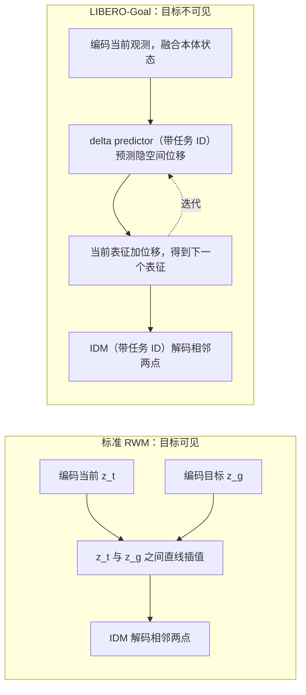

# 不学前向动力学、不做搜索：Representation World Model 把规划做进表征几何

<!-- release-date: 2026-09-24 -->

> 本文依据本地 `papers/Tsinghua/Representation-World-Model.pdf`，即 **Representation World Model: Learning States, Transition and Executable Plans in Representation**，arXiv:2609.29171v1，2026-09-24 提交，共 17 页（正文 9 页，参考文献与附录 8 页）。作者 Yijun Yuan、Hang Zhao 等 10 人，署名机构只有清华大学交叉信息研究院（IIIS）一家（PDF p. 1）。页码均指 PDF 自身页码。文中区分三件事：论文明确写了什么、我们怎么解释它、哪些是外部补充。

## 读前先把几个词说成人话

这篇论文短，但它挑战的是世界模型规划里一个默认的分工：表征负责「记住状态」，动力学模型负责「推演下一步」，搜索负责「找动作」。读它之前先把几个词说清楚：

- **观测（observation）与表征（representation）**：观测是相机拍到的一帧或几帧图；编码器把它压成一个向量，叫隐表征或 latent，记作 $z$。
- **前向动力学模型（Forward Dynamics Model，FDM）**：给定当前 $z_t$ 和动作 $a_t$，预测下一步 $z_{t+1}$。论文里记作 $f_\psi$（PDF p. 4）。
- **逆动力学模型（Inverse Dynamics Model，IDM）**：反过来，给定前后两个状态，猜中间做了什么动作。论文里记作 $f_\phi$（PDF p. 5）。
- **基于搜索的规划**：用 FDM 在脑子里推演很多条候选动作序列，挑最后离目标最近的那条。CEM（交叉熵方法）和 MPPI 是两种常见的采样搜索器（PDF p. 3）。
- **目标条件策略 / GC-IDM**：不搜索，直接把「当前状态 + 目标状态」映射成动作（PDF p. 4）。
- **表征塌缩（representation collapse）**：只靠预测未来来学表征时，最省事的解是把所有输入都编码成同一个点，预测永远「准」。LeWM 这一系靠 SIGReg 之类的正则压住它（PDF p. 2）。
- **成功率（Success Rate，SR）**：一次评测里达到目标的比例。
- **探针（probe）**：冻结编码器，只训一个小 MLP 从表征里读出某种信息；读得越准，说明这种信息越被表征保留。论文用 $R^2$ 衡量（PDF p. 8）。

外部补充：SIGReg 出自 LeJEPA，是把嵌入分布往各向同性高斯推的正则，用来防塌缩，细节见 LeJEPA 一篇。本 PDF 只点名，不展开。

## 一句话先说清

RWM 的做法可以压成一句：**在两个已编码状态之间连一条直线，逼着编码器把空间捏成「沿直线走，每一小步都能被逆动力学解码成正确动作」的形状**。训练时只学编码器和 IDM，不学 FDM；推理时编码起点与目标，在两者之间插值出一串中间表征，再让 IDM 两两解码出动作，没有递归推演，也没有动作空间搜索（PDF p. 1、p. 5–6）。

这张图（PDF p. 1，Figure 1）是整篇论文的主张。左边一格一格往前推的 $f_\psi$，是「规划在推理时临时算」；右边每条指向 $z_g$ 的虚线直线就是一份计划，沿它走一小段、执行、落到实线轨迹上的新状态，再从那里重拉一条直线，是「规划被实例化在表征空间里」。原文的说法是把表征空间里「原本不受约束的区域」变成连接 $z_s$ 与 $z_g$ 的可行路径（PDF p. 1）。

结果上，论文报了三件事：

- 四个连续控制任务（PushT、Cube、Reacher、TwoRoom）上宏平均 SR 98.25%（PDF p. 7），高于表中所有基于搜索的方法，也高于同协议下的 INTACT 目标条件 IDM 基线 95.33%（PDF p. 7）；
- LIBERO-Goal 十个任务平均 SR 93.0%，模型 0.03B，高于同设定的 LeWM（71.2%）与 RC-aux（81.2%），低于 7B 的 OpenVLA-OFT（97.0%）（PDF p. 7）；
- 不用任何显式表征正则，表征里的状态与动作信息大体与 LeWM 相当（PDF p. 8）。

### 一条阅读路线

原文正文只有 9 页，建议按这个顺序读：

1. **p. 2 引言第二、三段**：两个矛盾，一个关于表征学什么，一个关于表征与规划器谁负责。
2. **p. 4 Figure 2 与 p. 5 的插值式**：整套方法就是一个线性插值加一个 IDM 损失。
3. **p. 6 「Why IDM on interpolation shapes the representation」**：为什么这样不会塌缩。
4. **p. 7 Table 1 与 Table 2**：注意表注里「外部行不是配对对照」这句。
5. **p. 8–9 Figure 3–5 与 Table 3**：插值点里到底有没有信息，闭环间隔有多敏感，哪项损失在干活。
6. **p. 12–13 附录 A**：训练配置，以及 LIBERO 上为什么要额外加一个 delta predictor。

## 主要矛盾：动作监督很强，但它会被规划器吃掉

论文从两个矛盾开场，第二个才是这篇的真正起点。

**矛盾一：代理预测学到的东西不对（PDF p. 2）。** 现有隐空间世界模型（论文点名 LeWM 一系）靠「预测下一步表征」这种代理目标学表征，再加 SIGReg 这类预设先验防塌缩。论文认为有三个问题：

1. 先验对隐空间形状做了固定假设，数据和任务变大后可能变成束缚；
2. 预测目标会让表征保留一切对预测有用的东西，包括和动作无关的状态；
3. 预测目标并不要求隐空间的几何结构本身按「转移」和「规划」来组织。

所以更自然的办法是直接用动作级监督学表征：任务信号本身就排除了塌缩解，也决定了该强调什么信息、该怎么组织（PDF p. 2）。

**矛盾二：动作监督一旦端到端，功劳会被规划器拿走（PDF p. 2）。** 如果编码器和规划器一起学，动作损失只约束两者的合成输出，表征与规划之间谁干多少活是欠定的。规划器强，就能替烂表征兜底；规划器太简单，编码器又吸收不了本该由规划承担的计算，端到端训练反而学不好。

于是论文的问题是：**怎样让动作级监督落到表征本身上**（PDF p. 2）。

它的答案是把规划器砍到几乎没有自由度：规划只允许是表征空间里一个固定的几何构造，也就是端点之间的直线插值；动作监督施加在这条构造出来的路径上。规划器没有参数可以兜底，梯度只能流向编码器，去改变空间的形状（PDF p. 2、p. 3）。

**我们如何解释它。** 这是一个「把自由度从规划器挪进表征」的设计。IDM 本身也有参数，但它只看相邻两个点，是局部的；「从哪走到哪、中间怎么过渡」这件全局的事，被固定成了一条直线。全局结构只能由编码器来提供。

## 先看全景：三种规划范式

论文把自己定位为第三种规划范式（PDF p. 4）。下图按 PDF p. 3–4 的相关工作与 p. 4 的问题设定重画，是机制示意，不是论文原图：

论文对三者的区分是：RWM 不像搜索式那样评估候选未来；也不像目标条件策略那样把端点直接映射到动作，而是先在表征空间里构造一条路径，再把路径解码成动作（PDF p. 4）。

搜索式的规划目标，论文写成（PDF p. 4）：

$$
\mathbf{a}^{*}
=
\arg\min_{\mathbf{a}=(a_s,\dots,a_{s+H-1})}
d\bigl(f_\psi^{(H)}(z_s,\mathbf{a}),\,z_g\bigr)
$$

$f_\psi^{(H)}$ 是用前向模型连推 $H$ 步，$d$ 是隐空间里的距离。每评估一条候选序列都要推演 $H$ 次，候选有几百条，推理代价就在这里。Table 1 的推理列写着「CEM 300×30」这类配置，就是这笔账的规模（PDF p. 7）。

## 核心设计一：路径不是学出来的，是插出来的

### 旧问题：已观测状态之间的空间没人管

编码器只在真实观测上被训练。两个真实状态的表征之间那片区域，通常没有任何约束，里面的点不对应任何物理状态，更不对应可执行的转移。

### 新设计：端点直线插值

从同一条轨迹里取两帧 $o_t$、$o_u$（$t<u$），编码成 $z_t=f_\theta(o_t)$、$z_u=f_\theta(o_u)$，中间第 $m$ 个时间位置的表征按时间比例线性插值（PDF p. 5）：

$$
\tilde z_m=(1-\alpha_{t,m,u})\,z_t+\alpha_{t,m,u}\,z_u,
\qquad
\alpha_{t,m,u}=\frac{m-t}{u-t}
$$

插值系数只由时间位置决定，按比例线性插值，这一步本身没有可学习参数。

论文紧接着强调：$\tilde z_m$ 在学习之前只是个几何点，插值本身不保证它是合法的转移或可执行的轨迹；RWM 要做的，就是训练表征，让这些构造出来的中间点获得状态、转移与动作的语义（PDF p. 5）。

### 工作机制：监督打在中间，梯度流回端点

每个中间点都是两端表征的函数。沿路径施加的监督，梯度会一路回到 $z_t$ 和 $z_u$，也就是回到编码器，于是改变的是整个表征空间的几何（PDF p. 5）。

推理时用同一套构造。给定当前与目标观测，编码成 $z_t$、$z_g$，对 $m=t+1,\dots,g-1$ 按同样的 $\alpha_m=\frac{m-t}{g-t}$ 插值，加上两个端点，就得到潜在转移路径（PDF p. 5）：

$$
P_{s:g}=\bigl(\tilde z^{t}_{t},\,\tilde z^{t}_{t+1},\,\dots,\,\tilde z^{t}_{g}\bigr)
$$

与推演式规划不同，每个中间点都直接由端点算出，不递归预测。

**原文没写的一处。** 推理时插值步数由 $g-t$ 决定，但目标观测离当前还有多少步，推理时并不知道。论文没有说明 $g-t$ 在评测里怎么取（固定值、按任务设定，还是别的规则），这是复现时要先问清的参数。

### 可迁移启发

想让一个约束真正落到表征上，就把表征下游的模块做到没有全局自由度。这里用「固定的几何构造」代替「可学习的规划器」，和对比学习里用固定相似度函数逼编码器是同一类思路。代价是：直线这个先验本身就是一个假设，见后文的边界一节。

## 核心设计二：沿构造路径做逆动力学

上图是论文 Figure 2（PDF p. 4）。(b) 里 IDM 的输入是两个绿色空心圈，即构造点 $\tilde z$，而不是真实编码 $z$；(c) 里每执行一段就从新的 $z_1$、$z_2$ 出发重新插一条直线指向目标，这就是闭环。

### 主损失：构造路径上的逆动力学

对采样的轨迹段 $(o_t,a_t,\dots,a_{u-1},o_u)$，先按上一节构造 $\tilde z_i$（$i=t,\dots,u$），再训一个 IDM $f_\phi:\mathcal Z\times\mathcal Z\to\mathcal A$，从相邻两个构造点恢复真实动作（PDF p. 5，式 2）：

$$
\mathcal L^{\mathrm{int}}_{\mathrm{IDM}}
=
\frac{1}{u-t}\sum_{i=t}^{u-1}
\bigl\lVert f_\phi(\tilde z_i,\tilde z_{i+1})-a_i\bigr\rVert_2^2
$$

意思是：直线上每相邻两点之间，必须能读出示范轨迹里那一步真实执行的动作。这样端点之间的区域被迫表示「可执行的转移」，而不是随便什么几何中点（PDF p. 5）。

### 为什么这样不会塌缩

论文给了两条论证（PDF p. 6）：

1. **防平凡塌缩**：如果所有观测都编码成同一个点，相同的输入要对应不同的动作，IDM 损失无法被满足。
2. **逼编码器保留与转移相关的状态**：如果两种不同的物体构型被压到相近的端点，它们会生成相近的插值路径，却要解码出不同的动作，监督互相冲突。

**我们如何解释它。** 这两条是论证，不是定理。它们说明塌缩到一个点不可能是最优解，但不排除「只保留动作相关信息、丢掉其余」——而这正是论文想要的。代价是，与动作无关、却对长程目标有用的信息，没有任何项要求保留。

### 两个可选项

**编码状态上的 IDM（可选）**：直接对相邻的真实编码做逆动力学（PDF p. 5）：

$$
\mathcal L^{\mathrm{enc}}_{\mathrm{IDM}}
=
\frac{1}{u-t}\sum_{i=t}^{u-1}
\bigl\lVert f_\phi(z_i,z_{i+1})-a_i\bigr\rVert_2^2
$$

论文说它对构造本身不是必需的，只是给已观测转移一个直接的动作信号。

**软插值一致性（可选）**：让构造点贴近同一时间位置的真实编码（PDF p. 6）：

$$
\mathcal L_{\mathrm{consist}}
=
\frac{1}{u-t-1}\sum_{i=t+1}^{u-1}
\bigl\lVert \tilde z_i-z_i\bigr\rVert_2^2
$$

它不决定表征该保留什么信息，只防止构造路径偏离真实轨迹的几何。Figure 2(a) 里那根从空心圈指向实心圈的小箭头，我们读作这一项的示意，原文图注没有点明。

**总目标**是三项加权和（PDF p. 6，式 3）：

$$
\mathcal L_{\mathrm{all}}
=
\mathcal L^{\mathrm{int}}_{\mathrm{IDM}}
+\lambda^{\mathrm{enc}}_{\mathrm{IDM}}\,\mathcal L^{\mathrm{enc}}_{\mathrm{IDM}}
+\lambda_{\mathrm{consist}}\,\mathcal L_{\mathrm{consist}}
$$

训练时只学编码器 $f_\theta$ 和 IDM $f_\phi$，不需要 FDM（PDF p. 6）。两个 $\lambda$ 的取值，正文和附录 Table 4 都没有给。

### 可迁移启发

「在构造出的插值点上加任务监督」这一招，本质是把监督从数据流形上推到流形之间的空白区。自己的项目里如果推理时要在隐空间里做插值、混合或外推，训练时就应该在同样的构造点上加监督，而不是只在真实样本上训完、指望中间点自然好用。

## 推理：编码、构造、解码

推理只编码当前与目标两张观测，按上面的式子插出中间表征，共享的 IDM 对每一对相邻点解码动作（PDF p. 6）：

$$
\hat a_m=f_\phi\bigl(\hat z^{t}_{m},\,\hat z^{t}_{m+1}\bigr),
\qquad m=t,\dots,g-1
$$

因为所有中间点都直接由端点算出，这串动作可以并行解码，用于开环执行；闭环控制则在每执行完一个动作块后重新编码当前观测，重新构造指向目标的路径（PDF p. 6）。

**原文没写的一处。** 论文强调了「无搜索、可并行」，但没有报推理耗时、每步延迟或与 CEM 基线的墙钟对比。「比搜索快」在结构上成立（一次编码加一串 MLP 前向，对比几百条候选的多步推演），但文中没有数字。

## 实验设定

连续控制部分沿用 INTACT 的任务定义与评测协议：PushT、Cube、Reacher、TwoRoom 四个环境；每个模型用 3 个训练种子各训一次，每个再用 3 个评测种子评测，报 3 个训练种子上的均值与标准差（PDF p. 6–7）。

训练细节在附录 A.1 与 Table 4（PDF p. 12–13），除特别说明外沿用 LeWM 的数据预处理与训练协议：

| 设置 | 取值 |
|---|---|
| 输入分辨率 | 224 × 224 |
| 跳帧 | 5，两帧观测之间的底层动作合成一个动作块 |
| 训练 / 验证划分 | 90% / 10%，按样本划分 |
| 编码器 | ViT-Tiny，patch 14，从零训练 |
| IDM | 3 层 MLP，观测历史 3 |
| 优化器 | AdamW，学习率 $5\times10^{-4}$，权重衰减 $10^{-3}$ |
| 学习率调度 | 线性热身 + 余弦衰减 |
| batch / 轮数 | 128 / 10 epoch |
| 精度 / 梯度裁剪 | bfloat16 / 1.0 |
| 训练种子 | 0、42、3072 |
| 训练硬件 | RTX 5090 × 8 |

正文里还有一句「Reacher 用 $5\times10^{-5}$」，括号挂在权重衰减之后，但原文没说明它替换的是学习率还是权重衰减（PDF p. 12）。

两处需要留意的细节：

- Table 4 写 IDM 的观测历史是 3（PDF p. 13），而方法一节把 IDM 定义为只吃相邻两个表征 $f_\phi:\mathcal Z\times\mathcal Z\to\mathcal A$（PDF p. 5）。两者怎么对上，原文没解释。
- 没有给隐表征维度、训练时轨迹段长度 $u-t$ 的采样方式、动作块长度，也没有给两个 $\lambda$。

## 连续控制：不搜索，宏平均 98.25%

下表转自 Table 1（PDF p. 7），单位是 SR（%）。

| 类别 | 方法 | 推理方式 | PushT | Cube | Reacher | TwoRoom | 宏平均 |
|---|---|---|---:|---:|---:|---:|---:|
| 搜索式 | DINO-WM | CEM | 74.0±4.5 | 86.0±4.7 | 79.0±5.1 | 100.0±.0 | 84.75 |
| 搜索式 | LeWM | CEM 300×(30/10) | 96.0±4.0 | 74.0±3.0 | 86.0±5.0 | 87.0±2.5 | 85.75 |
| 搜索式 | Fast-LeWM | CEM | 96.0 | 80.0 | 88.0 | 98.0 | 90.50 |
| 搜索式 | Fast-LeWM + SC | CEM + score | 98.0 | 82.0 | 90.0 | 98.0 | 92.00 |
| 搜索式 | Qantara† | CEM 300×30，K = 4 | 90.1±1.1 | 93.7±.7 | 80.9±1.8 | 100.0±.0 | 91.18 |
| 搜索式 | PRISM† | MPPI 128×30 | 89±4 | 79±6 | – | – | – |
| 搜索式 | C-JEPA† | CEM 300×30 | 88.67 | – | – | – | – |
| 搜索式 | INTACT | Pure CEM 300×30 | 88.44±1.17 | 68.44±.77 | 83.67±.67 | 82.89±.84 | 80.86±.51 |
| 搜索式 | INTACT | Actor-guided CEM 300×30 | 93.56±.96 | 96.89±.19 | 86.67±.88 | 98.00±1.15 | 93.78±.77 |
| 搜索式 | INTACT | Guarded actor 128×3 | 92.22±.69 | 99.78±.19 | 97.44±.77 | 98.00±1.15 | 96.86±.38 |
| 直接式 | GC-IDM | 目标条件 IDM | 84.7±5.0 | 99.3±1.2 | 100.0±.0 | 100.0±.0 | 96.00 |
| 直接式 | INTACT | 目标条件 IDM | 85.78±1.54 | 100.00±.00 | 97.67±.00 | 97.89±1.26 | 95.33±.58 |
| 直接式 | RWM | 表征计划 + IDM | 95.44±0.69 | 100.00±.00 | 97.89±.19 | 99.67±.00 | 98.25±.14 |

表注有一句必须先读：**表中外部方法的数字是引用值，不是配对对照**；† 表示任务覆盖不全，或与 INTACT 的复现协议不同（PDF p. 7）。

论文的读法（PDF p. 7）：

- RWM 高于所有搜索式方法，包括最强的 INTACT Guarded actor（96.86%），后者推理时要评估 384 条候选轨迹（即表中的 128×3）；
- 相对同协议的 INTACT 目标条件 IDM（95.33%），增益最大在 PushT，85.78% 到 95.44%。

**我们如何解释它。** 真正干净的对照只有 INTACT 那几行，因为 RWM 显式跟的是 INTACT 协议。在这几行里，RWM 与「INTACT 目标条件 IDM」的差别主要落在 PushT 一格：Cube、Reacher、TwoRoom 上两者相差都在 2 个百分点以内（按 Table 1 相减，PDF p. 7）。PushT 要用推杆把 T 形块推到指定位姿（附录 Figure 6 的渲染图就是这个场景，PDF p. 14），是四个任务里最依赖多步接触的，直接从端点映射动作最难；在这格上领先近 10 个点，比宏平均领先 2.92 个点（我们按 Table 1 算）更能说明「中间路径」有用。其余外部行的协议不同，只能当量级参考。

## LIBERO-Goal：目标图看不到时，换一个 delta predictor

LIBERO-Goal 是十个机器人操作任务，与上面最大的不同是：**测试时拿不到目标观测**，只有任务（PDF p. 12）。RWM 的标准做法依赖编码目标 $z_g$，这里直接断了。

下图按附录 A.2 的文字重画（PDF p. 12–13），是机制示意，不是论文原图；delta predictor 每次预测一步还是多步，原文没写：

附录 A.2 的改法（PDF p. 12–13）：

- 额外训一个 **delta predictor**，预测构造下一个表征所用的隐空间位移；
- 训练时有完整示范轨迹，用其中的未来状态定义目标位移来监督它；
- 测试时用预测的位移代替缺失的「指向目标的位移」，逐步迭代地构造隐路径；
- 编码器换成 ViT-Small，视觉表征与机器人本体状态融合后再往下传；
- 任务 ID 作为条件同时喂给 delta predictor 和 IDM。

**我们如何解释它。** 这一步其实改变了方法的性质：路径不再是两个已知端点之间的固定直线，而是由一个学出来的网络一步步往前推。它离「无需前向模型」的主张远了一步，更接近一个在隐空间里预测下一步位移的策略。delta predictor 的结构、它预测的是一步还是多步位移、训练损失的具体形式，附录都没有写。

比较设定沿用 RC-aux 论文对 LeWM、RC-aux 的设置，OpenVLA-OFT 7B 只作为大规模预训练的外部参考（PDF p. 7）。下表转自 Table 2（PDF p. 7）：

| 方法 | 规模 | T0 | T1 | T2 | T3 | T4 | T5 | T6 | T7 | T8 | T9 | 平均 |
|---|---:|---:|---:|---:|---:|---:|---:|---:|---:|---:|---:|---:|
| LeWM + OFT-head | 0.07B | 0.64 | 0.78 | 0.70 | 0.76 | 0.90 | 0.44 | 0.60 | 0.94 | 0.70 | 0.66 | 0.712 |
| RC-aux + OFT-head | 0.07B | 0.92 | 0.86 | 0.80 | 0.78 | 0.96 | 0.48 | 0.70 | 0.96 | 0.86 | 0.80 | 0.812 |
| RWM | 0.03B | 1.00 | 0.98 | 0.94 | 0.92 | 0.96 | 0.90 | 0.64 | 1.00 | 1.00 | 0.96 | 0.930 |
| OpenVLA-OFT | 7B | 0.98 | 0.92 | 0.96 | 0.86 | 1.00 | 1.00 | 1.00 | 1.00 | 1.00 | 0.98 | 0.970 |

论文点名 T5：RWM 90%，LeWM 44%，RC-aux 48%（PDF p. 7）。表里另有一格论文没提：T6 上 RWM 是 0.64，低于 RC-aux 的 0.70（PDF p. 7），是 RWM 唯一一格落后于小模型基线的任务。论文没有给十个任务各是什么，也没有给每个任务评了多少回合、用了几个种子。

## 插值点里到底有没有信息：两组探针

方法成立的前提是：构造出来的 $\tilde z$ 不只是两个向量的中点，而真的携带物理状态和动作信息。论文用冻结编码器加小 MLP 探针来量（PDF p. 8）：状态探针从单个表征预测仿真器构型（不含速度），动作探针从相邻两个表征预测动作；探针都只训 1 个 epoch，报按回合划分的验证集上的 $R^2$。

### 探针一：没有显式正则，编码表征比 LeWM 差吗

下表读自 Figure 3 柱顶标注（PDF p. 8）：

| 环境 | 状态探针 LeWM | 状态探针 RWM | 动作探针 LeWM | 动作探针 RWM |
|---|---:|---:|---:|---:|
| PushT | 0.988 | 0.982 | 0.862 | 0.883 |
| Cube | 0.611 | 0.633 | 0.704 | 0.878 |
| Reacher | 0.566 | 0.565 | 0.166 | 0.167 |
| TwoRoom | 1.000 | 0.891 | 0.241 | 0.243 |

论文的判断：状态信息在 PushT、Cube、Reacher 上相当，TwoRoom 上 RWM 更低；动作信息在三个环境持平，Cube 上明显更好。结论是 RWM 不靠前向预测、不靠显式正则，也保留了 LeWM 所捕获的大部分状态与动作信息（PDF p. 8）。

**我们如何解释它。** 外部背景：TwoRoom 在 LeWM 一系的基准里是两间屋子隔一堵墙、经门洞相通的导航任务，本 PDF 没有描述环境。在直线插值的约束下，要让「直线」对应可执行路径，编码器就得把「穿门」这类绕行压成直线，这可能会扭曲与真实坐标的线性关系，让状态探针变差。这只是一个猜测，论文没有讨论 TwoRoom 为什么掉。

### 探针二：离开观测流形之后，信息还剩多少

这一组只在编码表征 $z$ 上训探针，再拿到构造表征 $\tilde z$ 上测；动作探针只在真实相邻对 $(z_t,z_{t+1})$ 上训，测三种对：$(z_t,z_{t+1})$、$(z_t,\tilde z_{t+1})$、$(\tilde z_t,\tilde z_{t+1})$（PDF p. 8）。下表读自 Figure 4 柱顶标注（PDF p. 8）：

| 环境 | 状态 $z$ | 状态 $\tilde z$ | 动作 $z$–$z$ | 动作 $z$–$\tilde z$ | 动作 $\tilde z$–$\tilde z$ |
|---|---:|---:|---:|---:|---:|
| PushT | 0.983 | 0.950 | 0.884 | 0.722 | 0.547 |
| Cube | 0.633 | 0.596 | 0.878 | 0.701 | 0.603 |
| Reacher | 0.565 | 0.559 | 0.167 | 0.070 | 0.034 |
| TwoRoom | 0.890 | 0.854 | 0.243 | 0.113 | 0.089 |

论文的读法（PDF p. 8–9）：状态从 $\tilde z$ 上几乎和从 $z$ 上一样可读；动作在把一端或两端换成构造点后仍然可读，PushT 和 Cube 上尤其明显；越多构造点参与，动作可读性越低，但 $\tilde z$ 不是任意中点。

读这张表要知道三件事：

1. 这是一个偏保守的测法。探针从没见过 $\tilde z$，是零样本迁移过去的；状态 $R^2$ 只掉 0.006–0.037（按 Figure 4 相减，PDF p. 8），说明 $\tilde z$ 落在编码表征张成的同一片区域里。
2. 动作这一列掉得很明显，Reacher 和 TwoRoom 的 $\tilde z$–$\tilde z$ 只剩 0.034 和 0.089（PDF p. 8，Figure 4）。但这两个环境连真实对上的动作 $R^2$ 都只有 0.167 和 0.243（PDF p. 8，Figure 4），用 1 个 epoch 的小探针读动作本来就难；控制成功率靠的是 RWM 自己训练过的 IDM，不是这个探针。
3. 同一个 RWM 编码器，Figure 3 与 Figure 4 的数字有细小出入（PushT 状态 0.982 对 0.983、动作 0.883 对 0.884，TwoRoom 状态 0.891 对 0.890），原文没有解释，可能是探针重训的随机性。

附录 Figure 6–9 把状态探针的输出渲染回仿真器，给了定性证据（PDF p. 13–17）：

图里（PDF p. 14）每一行的起点不同，但插值出来的中间状态都在两端之间连续演化，没有出现不合物理的跳变或重影。论文的说法是构造表征保留了大量物理状态信息（PDF p. 13）。Cube、Reacher、TwoRoom 的同类图在 PDF p. 15–17，形式相同。行标 offset 的含义原文图注没有解释，这里按图面读作起始帧编号。

## 闭环间隔：规划频率比想象中敏感

固定训练好的模型，只改两次重规划之间执行的动作数 $h$。下表读自 Figure 5 柱顶标注（PDF p. 9），单位是 SR（%）：

| $h$ | PushT | Cube | Reacher | TwoRoom | 宏平均 |
|---:|---:|---:|---:|---:|---:|
| 5 | 95.67 | 100 | 98 | 99.67 | 98.33 |
| 10 | 87 | 100 | 97.33 | 99.33 | 95.92 |
| 15 | 71.33 | 97.67 | 95 | 99.33 | 90.83 |
| 20 | 68.33 | 96.33 | 97.33 | 99 | 90.25 |
| 25 | 26 | 90 | 63 | 97.67 | 69.17 |

论文取 $h=5$ 为默认值；越接近开环，性能越差，$h=25$ 时宏平均掉到 69.17%，主要被 PushT 和 Reacher 拖下去，Cube 和 TwoRoom 相对稳；结论是必须定期吸收新观测来纠正累积的执行误差（PDF p. 9）。

**我们如何解释它。** 这组数据给「无推演」这件事划了边界。直线计划本身不看环境反馈，也不模拟动作后果；它的鲁棒性几乎全靠高频重规划来补。PushT 在 $h=25$ 时只剩 26%，说明一条一次性插出的直线在接触密集的任务上远不能当完整计划用。换句话说，RWM 的「规划」更接近一个每 5 步刷新一次的局部方向，而不是一条能长时间开环执行的轨迹。好在每次重规划只要一次编码加一串 MLP，便宜，高频重规划在它这里是可负担的。

## 三项损失各干了什么

下表转自 Table 3（PDF p. 9），都在 PushT 上、训练种子 3072：

| 损失组合 | $\mathcal L^{\mathrm{int}}_{\mathrm{IDM}}$ | $\mathcal L^{\mathrm{enc}}_{\mathrm{IDM}}$ | $\mathcal L_{\mathrm{consist}}$ | PushT SR |
|---|:---:|:---:|:---:|---:|
| 只有插值 IDM | ✓ | | | 95.56 |
| 编码 IDM + 一致性 | | ✓ | ✓ | 39.37 |
| 插值 IDM + 编码 IDM | ✓ | ✓ | | 96.17 |
| 插值 IDM + 一致性 | ✓ | | ✓ | 95.23 |
| 全部 | ✓ | ✓ | ✓ | 96.00 |

论文的结论（PDF p. 9）：

- 插值 IDM 是控制的关键：去掉它，PushT SR 从 96.00% 掉到 39.37%；只要含这一项，SR 都在 95.23–96.17% 之间；
- 编码 IDM 提高物理状态可读性，状态探针 $R^2$ 从 0.95 升到 0.98（原文没点明是哪个环境）；一致性项在几何上把构造点和真实编码对齐；
- 默认用全部三项，SR 与最好的消融变体相当，同时保留这些互补性质。

**我们如何解释它。** 最有信息量的是第二行：编码 IDM 加一致性损失，已经把「真实状态上能解码动作」和「插值点贴近真实编码」都做了，但 SR 只有 39.37%（PDF p. 9）。这说明「中间点离真实轨迹近」不等于「中间点可执行」；必须直接在插值点上监督动作，路径才真能用。反过来，只留插值 IDM 一项已经有 95.56%（PDF p. 9），另外两项对成功率几乎是中性的。

另外，Table 3 的全量模型（96.00%）、Figure 5 的 $h=5$（95.67%）与 Table 1 的 RWM（95.44±0.69）三者不同，前两者是单种子 3072 的消融，后者是 3 个训练种子的均值（PDF p. 7–9），不必对齐。

## 限制、边界，以及论文没写的东西

论文自己划出的，以及我们读完必须留下的判断：

- **直线是先验，不是学出来的。** 所有路径都是端点之间的直线，编码器必须把「可执行转移」都捏成直线。这在论文的四个连续控制任务上成立，但任务里有障碍、有多条可行路线、有必须先远离目标再靠近的情形时，直线假设会不会反过来成为束缚，论文没有实验。这与它批评 SIGReg「固定假设可能随数据与任务扩大而变得受限」（PDF p. 2）是同一类风险。
- **重度依赖闭环。** $h=25$ 时宏平均 69.17%，PushT 26%（PDF p. 9）。开环能力弱。
- **需要目标观测。** 标准形式要编码 $z_g$；LIBERO-Goal 拿不到目标图，就得加一个 delta predictor，路径变成学出来的迭代预测（PDF p. 12）。这时「不学前向模型」的说法要打折扣。
- **对照多为引用值。** Table 1 外部行不是配对对照（PDF p. 7）；LIBERO 的 OpenVLA-OFT 只作外部参考。
- **推理速度没有数字。** 结构上省掉了几百条候选的多步推演，但没有墙钟、延迟或吞吐对比。
- **超参不全。** 两个损失权重 $\lambda$、隐表征维度、轨迹段采样、动作块长度、推理时插值步数 $g-t$ 的取法都没有给。IDM「观测历史 3」与方法一节的两输入定义如何对上，也没有说明。
- **LIBERO 细节不全。** delta predictor 的结构与损失、十个任务的名字、每任务评测回合数与种子数都没有给。
- **代码与权重。** PDF 首页只给了项目页地址（PDF p. 1），正文没有提到代码或权重是否公开。

## 可迁移启发

1. **想让监督落到表征上，就拿走下游模块的全局自由度。** 端到端训「编码器 + 规划器」，动作损失会被规划器吸收。把规划换成固定的几何构造，梯度只能去改表征。这条原则对任何「表征 + 可学习头」的系统都适用。
2. **在推理时会用到的构造点上训练。** 推理要插值，就在插值点上加监督。只在真实样本上训、指望中间点自然好用，Table 3 第二行的 39.37%（PDF p. 9）就是反例。
3. **任务信号本身可以防塌缩。** 逆动力学目标下，塌缩解直接违反损失，不需要额外的分布正则。前提是任务信号足够丰富：动作相同的状态会被合并，这既是特性也是风险。
4. **不搜索的代价是高频闭环。** 如果规划便宜到只需一次编码加一串 MLP，就把省下的算力花在更频繁的重规划上，而不是更长的开环。
5. **评「中间点质量」要分两问。** 状态可读（Figure 4 前两列）与转移可执行（动作列与 SR）是两件事；只看其一会误判。
6. **对照要看协议。** 同一张表里混着引用值与同协议复现，真正能下结论的是同协议那几行。

## 关键词回看

- **RWM（Representation World Model，表征世界模型）**：把状态、转移和可执行计划都放进同一个表征空间，训练只学编码器与 IDM。
- **构造路径 / 端点插值**：$\tilde z_m=(1-\alpha)z_t+\alpha z_u$，$\alpha$ 按时间位置等比例，训练与推理共用。
- **插值 IDM 损失 $\mathcal L^{\mathrm{int}}_{\mathrm{IDM}}$**：相邻两个构造点必须能解码出真实动作；去掉它 PushT SR 掉到 39.37%（PDF p. 9）。
- **编码 IDM 与一致性损失**：可选项，前者提升状态可读性，后者让构造点贴近真实编码。
- **无推演、无搜索的推理**：编码—构造—解码；可并行解码，闭环时每 $h$ 步重构路径，默认 $h=5$（PDF p. 9）。
- **第三种规划范式**：区别于搜索式（评估候选未来）与目标条件策略（端点直接映射动作）。
- **delta predictor**：LIBERO-Goal 上目标不可见时，替代「指向目标的位移」的额外网络。
- **98.25% / 93.0%**：连续控制宏平均 SR 与 LIBERO-Goal 平均 SR（PDF p. 7）。

## 资料与阅读边界

### 本文依据的版本

- 本地原件：`papers/Tsinghua/Representation-World-Model.pdf`，17 页，页边标注 arXiv:2609.29171v1 [cs.RO] 24 Sep 2026，首页标注 Preprint。
- 官方页：[arXiv:2609.29171](https://arxiv.org/abs/2609.29171)，截至核验只有 v1，提交于 2026-09-24。`release-date` 取 2026-09-24：论文只讲一项技术，未见更早的官方代码、权重或博客发布，按技术首次官方公开日取 arXiv v1。项目页 [tsinghua-mars-lab.github.io/RepresentationWorldModel](https://tsinghua-mars-lab.github.io/RepresentationWorldModel) 是否放出代码，未能核实。

### 论文明确写了、本文覆盖了的部分

摘要与 Figure 1；第 1 节两个矛盾与三项贡献；第 2 节相关工作中的三种规划范式；第 3 节问题设定、端点插值、插值 IDM、防塌缩论证、两个可选损失、总目标与无推演推理；第 4 节连续控制设定与 Table 1、LIBERO-Goal 与 Table 2、Figure 3–5 与 Table 3；第 5 节结论；附录 A.1 训练细节与 Table 4、A.2 LIBERO 实现、A.3 与 Figure 6–9。

### 外部资料补充（不是 PDF 原文）

- SIGReg 的来历与作用取自本站 LeJEPA 一篇，PDF 只点名。
- DINO-WM、LeWM、INTACT、GC-IDM、RC-aux 等基线的方法细节不在本 PDF 里；本站有 DINO-WM 一篇可对照。

### 原文没有公开、本文也不补的缺口

- 损失权重 $\lambda^{\mathrm{enc}}_{\mathrm{IDM}}$、$\lambda_{\mathrm{consist}}$，隐表征维度，训练轨迹段长度的采样方式，动作块长度；
- 推理时插值步数 $g-t$ 如何确定；IDM 观测历史 3 与两输入定义的关系；Reacher 那个 $5\times10^{-5}$ 替换的是哪个超参；
- 推理耗时与相对搜索式基线的墙钟对比；
- LIBERO-Goal 上 delta predictor 的结构与训练损失、任务名单、评测回合数与种子数；
- 代码与权重是否公开。
