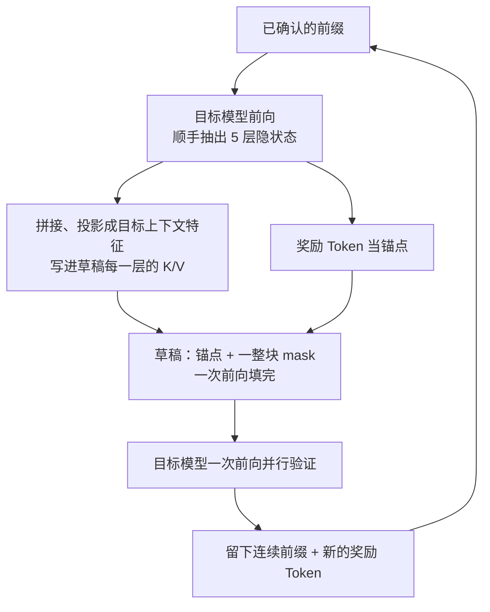

# DFlash：用块扩散一次写出整段草稿，投机解码才不再卡在 2–3×

<!-- release-date: 2026-01-05 -->

> 本文依据 UC San Diego 的 **DFlash: Block Diffusion for Flash Speculative Decoding**，arXiv:2602.06036v2，2026-05-28，ICML 2026 相机就绪版，共 13 页：正文到 p. 9，参考文献在 p. 10–11，附录 A 在 p. 12–13。页码均指这份 PDF 自身的页码。文中区分三件事：**报告明确写了什么**、**我们怎么解释它**、**哪些是外部资料或本文推算**。

## 读前先把几个词说成人话

- **Token（词元）**：模型读写文本的最小单位。
- **目标模型 / 草稿模型（target / draft）**：目标模型是真正对用户负责的大模型；草稿模型是先猜后面几个 Token 的小模型。
- **投机解码（speculative decoding）**：草稿先猜 $\gamma$ 个 Token，目标模型用一次前向把它们一起验证，留下对得上的一段。为什么这样能加速、经典规则为什么无损，知识库「投机解码」篇有通用讲解；本篇只写 DFlash 自己做了什么。
- **接受长度 $\tau$**：一轮平均留下多少个 Token。论文把范围写成 $\tau\in[1,\gamma+1]$，多出来的 1 是目标模型自己补的**奖励 Token（bonus token）**（PDF p. 3）。
- **自回归草稿**：草稿也一个 Token 接一个地写。EAGLE-3 走这条路。
- **块扩散（block diffusion）**：把一段连续位置当成一块，块内的 mask 位置一次并行填上，块与块之间仍按先后走。DFlash 只在草稿阶段用它。
- **mask Token**：占着「还没写出来」的位置。
- **锚点（anchor）**：一块草稿的第一个位置，是目标模型给出的干净 Token；推理时就是上一轮验证留下的奖励 Token。
- **KV 注入**：把目标模型的隐状态特征写进草稿每一层注意力的 Key 和 Value，让每一层都能读到。

## 一句话先说清

投机解码的验证早就是并行的：目标模型一次前向验一整串。可 EAGLE-3 这类当时最强的方法，草稿还在逐 Token 自回归地写。论文认为，这种串行草稿既慢，又会累积误差，把实际加速比封在大约 2–3×（PDF p. 1）。

扩散语言模型擅长并行填空，但开源的扩散大模型生成质量普遍不如自回归模型，要保住质量又得多步去噪，并行的速度优势被吃掉（PDF p. 1）。

DFlash 的拆法是：

> **并行只发生在草稿里，对错仍由自回归的目标模型拍板；草稿不从零推理，而是读目标模型已经算好的多层隐状态。**

论文把第二句概括成 *the target knows best*（PDF p. 2）。落到数字上：关掉思考模式、温度 0、Transformers 后端时，Qwen3-8B 在 MATH-500 上加速 6.08×，七项平均 4.86×；同表里树大小 60 的 EAGLE-3 七项平均是 2.02×（PDF p. 6，Table 1）。摘要里的「超过 6×」「相对 EAGLE-3 最高 2.5×」都出自这组设置，后文会把峰值和均值分开。

### 一条阅读路线

1. **p. 3 式 (1)–(3) 与 Figure 3**：自回归草稿为什么越写越贵，块扩散为什么不会。
2. **p. 4 第 4.1 节与 Figure 2、p. 12 附录 A.2–A.3**：条件为什么必须来自目标模型，又为什么要写进每一层。
3. **p. 5 第 4.2 节与 Figure 4**：训练怎么对齐推理时「锚点 + 一整块 mask」的形状。
4. **p. 6 Table 1、p. 7 Table 2–3**：主结果、思考模式和 SGLang 服务结果。
5. **p. 8–9 第 5.5 节 Table 5–9**：同数据对 EAGLE-3、层数、特征数、块长和注入方式的消融。
6. **p. 12–13 附录**：训练超参、去掉目标特征的对照、更多模型与 vLLM、损失衰减和随机锚点。

## 主要矛盾：验证早就并行了，草稿还在一个一个写

论文先把投机解码的账摊开（PDF p. 3，式 1）：

$$
L=\frac{T_{\mathrm{draft}}+T_{\mathrm{verify}}}{\tau}
$$

$L$ 是平均每留下一个 Token 花的时间，分子是一轮里写草稿和验证的时间，分母是这一轮留下多少个。相对目标模型自己逐个生成的加速比是 $\eta=L_{\mathrm{target}}/L$。要加速，要么让 $\tau$ 变大，要么让 $T_{\mathrm{draft}}$ 变小。

自回归草稿每写一个都要一次前向（PDF p. 3，式 2）：

$$
T_{\mathrm{draft}}=\gamma\cdot t_{\mathrm{step}}
$$

$\gamma$ 一开大，草稿成本就线性涨。为了不涨爆，现成方法把草稿压得很浅，EAGLE-3 只有 1 层 Transformer（PDF p. 3）。层数不够，草稿质量上不去，$\gamma$ 再大 $\tau$ 也很快饱和。两根杠杆在自回归草稿上互相打架。

块扩散草稿把一整块 mask 一次前向填完（PDF p. 3，式 3）：

$$
T_{\mathrm{draft}}=t_{\mathrm{parallel}}
$$

论文的判断是：对体量相近的模型，现代 GPU 跑一次并行前向远比跑 $\gamma$ 次串行前向便宜，$t_{\mathrm{parallel}}\ll\gamma\cdot t_{\mathrm{step}}$；块不是特别大时，$T_{\mathrm{draft}}$ 对 $\gamma$ 基本不敏感（PDF p. 3）。

图上真正要看的是两件事。草稿费用不再随长度涨，草稿才有资格做深；做深之后，5 层 DFlash 写 16 个 Token 比 1 层 EAGLE-3 写 8 个还便宜，接受长度还更高，所以它落在「草稿质量–草稿成本」更好的一侧（PDF p. 4）。

同页还点了两条已经走过的「扩散当草稿」路线，说明换扩散不等于自动赢（PDF p. 2）：

- DiffuSpec、SpecDiff-2 用 7B 量级的大扩散模型当草稿，接受长度可以很长，但草稿自己又贵又占显存，实际加速停在 3–4×；
- PARD 把小自回归模型训成模仿扩散式并行，模型太小，接受长度上不去，加速上限约 3×。

**我们如何读 2–3× 这个说法。** 它不是定理，是作者对「草稿仍自回归、又不敢做深」这片设计空间的经验上限。Table 1 里 EAGLE-3 在 Qwen3 上的七项平均只有 1.76×–2.08×（PDF p. 6），落在这个区间里。

## 先看全景：一轮里谁做什么

这张图按 PDF p. 4 Figure 2 与第 4.1 节重画，是机制示意，不是实测时间线。提示词进来时，目标模型先做一次普通 prefill、吐出第一个 Token，顺手从浅到深抽出几层隐状态（PDF p. 4）。论文把草稿叫做**扩散适配器（diffusion adapter）**：它不从零推理，而是把目标模型已经建好的深层上下文转换成一块并行草稿（PDF p. 2）。

下面三节对应三个设计：条件从哪来，条件放在哪，训练怎么对齐推理。

## 核心设计一：条件必须来自目标模型

只把草稿换成块扩散，不够。作者训了一个 5 层块扩散草稿，**不接任何目标特征**，在几个数学基准上测（PDF p. 12，Table 10）：

| 温度 | GSM8K 加速 / $\tau$ | MATH-500 | AIME24 | AIME25 |
|---|---|---|---|---|
| 0 | 2.83× / 3.38 | 3.73× / 4.61 | 3.43× / 4.12 | 3.35× / 4.07 |
| 1 | 2.76× / 3.29 | 3.31× / 4.12 | 2.66× / 3.23 | 2.65× / 3.24 |

正文把它概括为「通常只有大约 2–3×」（PDF p. 4）。MATH-500 greedy 的 3.73× 略高于这句概括，但数量级没变：没有目标特征，块扩散并不会自动变成 6×。

原因按论文的说法是：大自回归模型的隐状态比 Token 级的 logits 信息多得多，装着长程依赖和任务语义，而且**隐式编码了未来若干个 Token**，这一点引自 Samragh 等 2025 年的观察（PDF p. 2、p. 4）。小草稿没有这些表示，就只能从零去猜未来。

抽哪些层是固定的：从目标模型第 2 层到倒数第 3 层之间均匀取 5 层，拼接后过一个很浅的投影，得到一条紧凑的目标上下文特征（PDF p. 4、p. 6）。

## 核心设计二：特征写进每一层的 K/V，而不是只在入口喂一次

EAGLE-3 也用目标模型的隐特征。区别在于放在哪：EAGLE-3 把特征和草稿的 Token 嵌入融合，**只作为草稿的输入**；草稿一加深，目标信息一层层被稀释，加层的收益递减（PDF p. 4）。DFlash 把融合后的特征当成持久上下文，直接写进每一层的 Key 和 Value。

附录 A.3 把机制写成了公式（PDF p. 12）。先把选中的目标层拼起来，一次投影到草稿隐空间：

$$
\mathbf{H}_t=\mathrm{RMSNorm}\bigl(W_c[\mathbf{H}^{(l_1)};\ldots;\mathbf{H}^{(l_5)}]\bigr)
$$

$\mathbf{H}_t$ 被所有草稿层共享。到第 $i$ 层，Query 只来自草稿位置 $\mathbf{H}_d$；Key 与 Value 是目标特征和草稿位置沿序列维的拼接：

$$
\mathbf{Q}_i=W_i^{Q}\mathbf{H}_d,\qquad
\mathbf{K}_i=[W_i^{K}\mathbf{H}_t;\ W_i^{K}\mathbf{H}_d]_{\mathrm{seq}},\qquad
\mathbf{V}_i=[W_i^{V}\mathbf{H}_t;\ W_i^{V}\mathbf{H}_d]_{\mathrm{seq}}
$$

所以目标特征只是给 mask 块多备了一段可读的记忆，它不走 Q 投影、不走输出投影和自注意力更新，也不走 FFN；投影结果存进草稿的 KV 缓存，多轮之间复用（PDF p. 4、p. 12）。

额外参数几乎只有 $W_c\in\mathbb{R}^{D\times 5D}$。论文以 Qwen3.5-35B-A3B、$D=2048$、BF16 为例，$5\times2048\times2048\times2\approx42$ MB，对照约 70 GB 的目标模型可以忽略；batch 1、序列 2048 时投影的输入输出激活约 40 MB 与 8 MB，块长 16 解码时临时激活低于 400 KB（PDF p. 12）。按二进制算是 40 MiB，十进制约 41.9 MB，与论文的约 42 MB 一致。

注入位置单独拆出来的消融是 Table 9：Qwen3-4B、5 层草稿、块长 8，每格是 $\tau$ / 加速比（PDF p. 9）：

| 草稿方式 | 注入方式 | GSM8K | HumanEval | MT-Bench |
|---|---|---|---|---|
| 自回归（EAGLE-3-5L） | 只在输入融合 | 4.2 / 2.1× | 4.3 / 2.2× | 3.1 / 1.4× |
| 自回归（DFlash-AR） | KV 注入 | 4.8 / 2.4× | 4.6 / 2.3× | 3.4 / 1.5× |
| 块扩散（DFlash） | 只在输入融合 | 3.5 / 2.9× | 3.5 / 2.9× | 2.6 / 2.0× |
| 块扩散（DFlash） | KV 注入 | 4.2 / 3.3× | 4.0 / 3.2× | 3.0 / 2.2× |

这张表把两件事拆开了。同样是自回归草稿，KV 注入的 $\tau$ 在三个任务上都高于输入融合；同样是块扩散，KV 注入也更高。再看对角：块扩散 + KV 注入的 $\tau$ 与 EAGLE-3-5L 相当（GSM8K 都是 4.2），加速比却高得多（3.3× 对 2.1×），因为整块是一次前向写出来的。论文的总结是 DFlash 同时吃到了更强的条件和更快的并行草稿（PDF p. 9）。

**我们如何解释它。** 表里还有一格值得注意：「KV 注入 + 自回归」的 $\tau$（GSM8K 4.8）比块扩散版（4.2）更长，但加速只有 2.4×。$\tau$ 高不等于快，分母里还有草稿自己的耗时。这一点在后文的服务实验里会再出现一次。

对自己的项目，这一节比「上扩散」更可迁移：**条件要在每一层都还在，不能只在门口给一次。** 草稿一加深，入口融合就会稀释；把条件做成 KV 里的持久记忆，接受长度才跟得上层数。

## 核心设计三：训练必须长得像推理

标准块扩散训练是把回复均匀切块、块内随机遮一些位置再重填。DFlash 认为这和推理对不上：推理时草稿看到的第一个位置永远是目标模型刚给出的干净 Token，要并行预测的是后面 `block_size − 1` 个位置（PDF p. 5）。

于是造块方式改成：从回复里随机抽**锚点**，每个锚点当一块的第一个位置，其余位置全部 mask。多块拼进一条序列，用稀疏注意力掩码一次前向、一次反向一起训，实现用的是 Flex Attention（PDF p. 5）。

图里读得出一条正文没有单独强调的约束：每块能看到的目标特征只到它的锚点之前为止，块 1 看到 p1–p4，块 2 多看到 r1，块 3 看到 r2 为止。这正对应推理时「目标模型只算过已确认的前缀」。

随机锚点相对标准切块的效果是 Table 13：两边都是 3 层草稿、5 条目标特征、块长 16、第 5.5 节的 10 万条子集（PDF p. 13）：

| 造块方式 | MATH-500 加速 / $\tau$ | HumanEval | MT-Bench |
|---|---|---|---|
| 标准均匀切块 | 4.13× / 4.94 | 3.29× / 3.86 | 2.13× / 2.80 |
| 随机抽锚点 | 4.69× / 5.64 | 3.90× / 4.61 | 2.38× / 3.18 |

三个任务的 $\tau$ 和加速比一起涨。论文给的理由有两层：训练分布贴住了「上一轮奖励 Token + 本轮一整块 mask」的推理形状；锚点随机，草稿见到的目标特征更多样（PDF p. 5）。

还有三条训练细节。

**长上下文训练成本有界。** 论文点名 EAGLE-3 的 training-time test 在长上下文上很贵；DFlash 每条序列固定草稿块数，每个 epoch 重抽锚点，既做了数据增强，又把训练成本压住（PDF p. 5）。

**位置加权损失。** 块里越靠前的错会让后面全部作废，所以第 $k$ 个位置的交叉熵乘一个指数衰减权重（PDF p. 5，式 4）：

$$
w_k=\exp\!\left(-\frac{k-1}{\gamma}\right)
$$

这里的 $\gamma$ 是衰减速率，不是草稿长度：块长 16 时取 7，块长 10 时取 5，块长 8 时取 4（PDF p. 12）。附录 Figure 5 是 MATH-500 上接受长度随 epoch 的曲线（PDF p. 13）。按图的矢量坐标读，带衰减的曲线前 4 个 epoch 高出约 0.1–0.2（第 1 个 epoch 约 4.43 对 4.22），第 5 个 epoch 两条线重合在约 6.21；带衰减的在第 7 个 epoch 到最高约 6.43，不带的约 6.36；到第 9 个 epoch 两者都回到约 6.35。论文的图注是「收敛更快也更好」，从图上看，「更快」很清楚，「更好」只体现在中段高点，终点几乎一样。

**共享并冻结词嵌入与 LM 头**，只更新草稿的 Transformer 层。可训练参数更少，也逼着草稿当一个贴住目标表示空间的轻量适配器（PDF p. 5–6）。

附录 A.1 的其余超参（PDF p. 12）：AdamW，学习率 $6\times10^{-4}$，梯度裁剪 1.0，余弦学习率，warmup 比例 0.04，6 个 epoch；最长序列 3072（Qwen3-Coder 为 4096），每条序列随机抽 512 个锚点。训练可以在线（每步现算目标隐状态），也可以离线（先缓存再训）。

## 无损：只按这篇论文自己写到的程度

这篇 13 页没有写出接受–拒绝的概率公式。论文对无损的表述是这几处：

- 投机解码范式「实现无损加速」，草稿由目标模型并行验证（PDF p. 1）；
- 扩散负责高速并行草稿、自回归目标模型负责验证，「以保证最终输出仍然无损」（PDF p. 1）；
- 摘要把主结果写成 *over 6× lossless acceleration*（PDF p. 1）；
- 结论说投机验证为输出质量提供「原则性保证」，因此可以把去噪步数压到最少（PDF p. 9）；
- 相关工作里，TiDAR 被明确写成最终生成质量「还不是无损」，作为反衬（PDF p. 3）。

操作层面正文只写到：草稿提出 $\gamma$ 个，目标模型并行验证，$\tau$ 含奖励 Token（PDF p. 3）；下一轮草稿的锚点就是上一轮的奖励 Token（PDF p. 5）；温度 0 是 greedy 解码，温度 1 是 non-greedy 采样（PDF p. 6）。

所以能负责任说的是：DFlash 放在标准投机解码框架里，无损来自「留下的 Token 由目标模型验证决定」，不来自草稿自己的质量。论文没有给接受规则的伪代码，也没有做「开 DFlash 前后输出分布是否一致」的检验；工程上用的是严格的推测采样还是别的接受规则，PDF 本身不够判定。

## 实验：快在哪一种设置里

设定（PDF p. 6）：除非另说，都在 NVIDIA H200 上跑。草稿 5 层（Qwen3-Coder 为 8 层），块长 16（LLaMA-3.1 为 10），目标特征取 5 层。训练数据约 80 万条，来自 NVIDIA Nemotron Post-Training Dataset V2 与 CodeAlpaca，**回复由目标模型重新生成**以贴住目标分布。对照只有自回归基线和 EAGLE-3：其他扩散草稿方法没有开源实现，没比。Qwen3 上的 EAGLE-3 权重来自 AngelSlim，LLaMA-3.1 上用 EAGLE-3 官方权重。

### 主表：峰值过 6×，平均约 4.9×，聊天最弱

Table 1 用 Transformers 后端，思考模式关闭，最多生成 2048 个 Token（PDF p. 6）。EAGLE-3 两组：树大小 16，与 DFlash 块长 16 的草稿预算对齐；树大小 60，沿用 EAGLE-3 论文冲接受长度的设置，验证更贵；两组的草稿步数都是 7、top-$k$ 都是 10。温度 0 时每格是加速比 / $\tau$：

| 目标 | 方法 | GSM8K | MATH-500 | AIME25 | HumanEval | MBPP | LCB | MT-Bench | 平均 |
|---|---|---|---|---|---|---|---|---|---|
| Qwen3-4B | EAGLE-3（16） | 1.99× / 3.30 | 1.83× / 3.08 | 1.79× / 3.05 | 1.84× / 3.05 | 1.78× / 2.95 | 1.73× / 2.91 | 1.74× / 3.02 | 1.81× / 3.05 |
| | EAGLE-3（60） | 2.27× / 3.77 | 2.10× / 3.52 | 2.13× / 3.51 | 2.12× / 3.47 | 2.02× / 3.38 | 1.90× / 3.22 | 2.04× / 3.49 | 2.08× / 3.48 |
| | DFlash（16） | 5.15× / 6.53 | 6.09× / 7.84 | 5.68× / 7.27 | 5.21× / 6.64 | 4.78× / 6.09 | 5.41× / 7.09 | 2.85× / 4.35 | 4.91× / 6.54 |
| Qwen3-8B | EAGLE-3（16） | 1.94× / 3.23 | 1.81× / 3.02 | 1.79× / 3.00 | 1.89× / 3.17 | 1.69× / 2.82 | 1.57× / 2.65 | 1.63× / 2.83 | 1.76× / 2.96 |
| | EAGLE-3（60） | 2.23× / 3.71 | 2.05× / 3.49 | 2.05× / 3.44 | 2.17× / 3.65 | 1.93× / 3.25 | 1.81× / 3.03 | 1.90× / 3.26 | 2.02× / 3.40 |
| | DFlash（16） | 5.15× / 6.54 | 6.08× / 7.87 | 5.62× / 7.08 | 5.14× / 6.50 | 4.65× / 5.95 | 5.51× / 7.27 | 2.75× / 4.24 | 4.86× / 6.49 |

温度 1 时七项平均（PDF p. 6）：

| 目标 | EAGLE-3（16） | EAGLE-3（60） | DFlash（16） |
|---|---|---|---|
| Qwen3-4B | 1.72× / 2.95 | 1.93× / 3.36 | 4.24× / 5.69 |
| Qwen3-8B | 1.68× / 2.83 | 1.88× / 3.26 | 4.03× / 5.48 |

数学和代码上 DFlash 明显领先，聊天最弱：Qwen3-8B 的 MT-Bench 温度 0 只有 2.75×，温度 1 是 2.47×。DFlash 即使对树大小 60 的 EAGLE-3 也接受得更长，而验证更便宜：树 60 要一次验很多分支，块 16 只验一条长度 16 的链（PDF p. 6–7）。

### 宣传口径怎么和表对上

**「超过 6×」是峰值。** Table 1 里只有 MATH-500 跨过 6：Qwen3-4B 6.09×，Qwen3-8B 6.08×；引言的「最高 6.1×」是 6.08 的四舍五入（PDF p. 2、p. 6）。七项平均是 4.9× 量级，不是每个任务都 6×。

**「2.5×」要对设置。** Figure 1 的柱子与 Table 1 里 Qwen3-8B、温度 0、EAGLE-3（60）那一行逐项对齐（PDF p. 2）。按表复算相对倍数：

| 任务 | DFlash | EAGLE-3（60） | DFlash / EAGLE-3 |
|---|---:|---:|---:|
| GSM8K | 5.15× | 2.23× | 2.31 |
| MATH-500 | 6.08× | 2.05× | 2.97 |
| AIME25 | 5.62× | 2.05× | 2.74 |
| HumanEval | 5.14× | 2.17× | 2.37 |
| MBPP | 4.65× | 1.93× | 2.41 |
| LiveCodeBench | 5.51× | 1.81× | 3.04 |
| MT-Bench | 2.75× | 1.90× | 1.45 |
| 平均 | 4.86× | 2.02× | 2.41 |

Figure 1 图注的「超过 2.5×」对 MATH-500、AIME25、LiveCodeBench 成立，对 MT-Bench 不成立；引言「在多数基准上接近 2.5×」更贴近这张表（PDF p. 2）。

**正文有一处括号对不上表。** 第 5.1 节写 greedy 平均 4.9×，「相当于相对 EAGLE-3（16）提升 2.4×」；温度 1 时「相对 EAGLE-3 提升 2.2×」（PDF p. 6）。按表复算，相对 EAGLE-3（16）是 4.91 / 1.81 与 4.86 / 1.76，约 2.7–2.8 倍；相对 EAGLE-3（60）才是约 2.4 倍。温度 1 的 2.2 倍同样只对得上树 60（4.24 / 1.93 与 4.03 / 1.88）。引用相对倍数时以表中的绝对数字为准。

### 打开思考模式：约 4.5× 与 3.9×

草稿改在带推理轨迹的目标输出上训，评测换成 GPQA、MATH-500、AIME25，后端仍是 Transformers（PDF p. 7，Table 2）：

| 目标 | 温度 | GPQA 加速 / $\tau$ | MATH-500 | AIME25 |
|---|---|---|---|---|
| Qwen3-4B | 0 | 4.23× / 5.23 | 4.59× / 5.74 | 4.39× / 5.54 |
| | 1 | 3.67× / 4.55 | 3.93× / 4.89 | 3.64× / 4.68 |
| Qwen3-8B | 0 | 4.17× / 5.17 | 4.64× / 5.82 | 4.51× / 5.74 |
| | 1 | 3.75× / 4.65 | 4.03× / 5.06 | 3.70× / 4.69 |

正文概括为大约 4.5× 与 3.9×，是 greedy 与采样两组的约数（PDF p. 7）。思考模式下 MATH-500 的 $\tau$ 约 5.7–5.8，低于关掉思考时的 7.8 左右，加速也从 6× 落到 4× 出头。**我们如何解释它**：长推理没有让草稿更好猜；论文强调的是推理模型生成时间长，同样的倍数省下的绝对时间更多。

### 真实服务框架：SGLang 上并发 1–32 都还在赚

第 5.3 节换到单卡 B200、SGLang、FlashAttention-4 后端，打开 Spec-v2 的调度重叠（PDF p. 7）。Table 3 同时给吞吐、加速比和平均 $\tau$，下面保留加速比与 $\tau$：

| 目标与任务 | 并发 1 | 4 | 8 | 16 | 32 | 平均 $\tau$ |
|---|---|---|---|---|---|---|
| Qwen3-4B MATH-500 | 4.8× | 4.3× | 4.1× | 3.5× | 2.9× | 8.01 |
| Qwen3-4B HumanEval | 4.0× | 3.6× | 3.2× | 2.7× | 2.2× | 6.63 |
| Qwen3-8B MATH-500 | 5.1× | 4.5× | 4.5× | 3.9× | 2.8× | 8.01 |
| Qwen3-8B HumanEval | 4.2× | 3.6× | 3.6× | 3.0× | 2.4× | 6.50 |
| Qwen3-Coder-30B-A3B HumanEval | 3.5× | 3.0× | 3.2× | 3.2× | 3.1× | 8.09 |
| Qwen3-Coder-30B-A3B LCB | 2.6× | 2.4× | 2.3× | 2.4× | 2.3× | 6.42 |
| Qwen3-Coder-30B-A3B MBPP | 3.2× | 3.0× | 3.2× | 3.3× | 3.1× | 7.23 |

以 Qwen3-8B MATH-500 为例，吞吐从基线的 230 / 5694 token/s（并发 1 / 32）变成 1175 / 16076 token/s（PDF p. 7）。4B、8B 的倍数随并发明显下降，这是投机解码的老现象：batch 变大，验证侧从访存受限走向算力受限，白算的草稿开始抢算力。Coder-30B-A3B 是 MoE，激活约 3B，倍数反而很稳。论文没有把「MoE 更稳」写成结论，这是表上看得出的现象。

### 同一份训练数据对 EAGLE-3：$\tau$ 高的反而先跌破 1×

第 5.5.1 节控制训练数据：DFlash 在 LLaMA-3.1-8B-Instruct 上用和 EAGLE-3 完全相同的 UltraChat 与 ShareGPT 训练，块长 10，对照 EAGLE-3 官方权重；因为 Spec-v2 不支持 EAGLE-3 的树草稿，用 SGLang Spec-v1，单卡 B200、Flashinfer 后端（PDF p. 7–8，Table 5）。

树开到 60，$\tau$ 确实更长（三个任务分别 4.55、4.65、4.07），但并发 16 起加速比跌破 1，比不用投机还慢。DFlash 的 $\tau$ 不一定最高（GSM8K 上 4.32 低于树 60 的 4.55），可是草稿一次前向、只验一条链，高并发时仍然赚。这是式 (1) 的现场版：只看 $\tau$ 会选错方法。

### 更多模型与 vLLM

附录 Table 11 在 SGLang、单卡 B200、并发 8 下扩到更多目标模型，每格是 $\tau$ / 加速比（PDF p. 12）：

| 目标 | 方法 | MATH-500 | HumanEval | MT-Bench |
|---|---|---|---|---|
| Qwen3.5-4B | MTP | 6.5 / 1.5× | 6.3 / 1.6× | 5.3 / 1.3× |
| | DFlash | 7.1 / 3.0× | 7.3 / 2.9× | 5.6 / 2.3× |
| Qwen3.5-9B | MTP | 6.7 / 1.7× | 6.6 / 1.7× | 5.3 / 1.3× |
| | DFlash | 7.3 / 3.5× | 7.9 / 3.4× | 5.5 / 2.5× |
| Qwen3.5-35B-A3B | MTP | 6.9 / 1.7× | 7.1 / 1.6× | 5.2 / 1.2× |
| | DFlash | 7.2 / 2.4× | 7.9 / 2.3× | 5.4 / 1.7× |
| Qwen3.5-27B | DFlash | 7.7 / 3.8× | 9.1 / 3.9× | 5.5 / 2.5× |
| Qwen3-Coder-Next | DFlash | 6.0 / 1.9× | 7.2 / 1.9× | 3.9 / 1.2× |
| GPT-OSS-20B | DFlash | 5.1 / 2.2× | 4.3 / 2.2× | 4.2 / 2.0× |
| GPT-OSS-120B | DFlash | 5.4 / 1.6× | 4.4 / 1.7× | 3.7 / 1.3× |

目标模型自带 MTP 时，DFlash 的 $\tau$ 往往只高一点，加速比却接近翻倍。**我们如何解释它**：原因还是式 (2) 对式 (3)，MTP 头仍按自回归方式往前滚，DFlash 一块一次。GPT-OSS-120B 只有 1.3×–1.7×，Qwen3-Coder-Next 的 MT-Bench 只有 1.2×，说明大模型加难猜的对话，这块并行草稿并不万能。

Table 12 是 vLLM 上的 Qwen3.5-9B，每格是 DFlash 吞吐（token/s），括号里是相对自回归的加速比（PDF p. 12）：

| 并发 | MATH-500 | HumanEval | MT-Bench |
|---:|---|---|---|
| 1 | 849（4.0×） | 969（4.6×） | 627（3.0×） |
| 8 | 5096（3.2×） | 5434（3.4×） | 3536（2.2×） |
| 16 | 7669（2.5×） | 8131（2.7×） | 5297（1.7×） |
| 32 | 9836（1.9×） | 10258（2.1×） | 6787（1.3×） |

低并发很强，高并发仍为正但在收敛。vLLM 与 SGLang 两张表不是同一口径的对照，绝对值不能直接比。

### 长上下文：4K 训的草稿，1.6K 条样本就能接上去

基础草稿在 4K 上下文上训，超过 4K 接受长度会掉。作者拿 Qwen3.5-27B 的基础草稿，用 LongAlign-10K 里 1.6K 条样本微调 3 个 epoch，在 LongBench 上按长度切片看 $\tau$（PDF p. 7–8，Table 4）：

| 上下文 | hotpotqa 基础 / 微调 | qasper 基础 / 微调 | gov_report 基础 / 微调 |
|---|---|---|---|
| 1K | 4.91 / 4.99 | 5.27 / 5.38 | 4.53 / 4.53 |
| 2K | 4.97 / 5.06 | 5.50 / 5.67 | 4.35 / 4.38 |
| 4K | 4.91 / 5.41 | 5.17 / 5.80 | 3.93 / 4.25 |
| 8K | 4.46 / 5.76 | 4.17 / 5.62 | 3.32 / 4.04 |
| 16K | 3.61 / 6.05 | 3.57 / 6.00 | 2.67 / 3.81 |
| 32K | — | — | 2.09 / 3.56 |

基础草稿过了 4K 就单调变差；微调后在 hotpotqa、qasper 上随长度不降反升，gov_report 仍在下降但慢得多。论文的解释是抽出来的目标特征在长上下文里仍有代表性，草稿用很轻的适配就能学会更长程的模式（PDF p. 7）。32K 只有 gov_report 有数。

### 消融：接受长度不是唯一目标

消融默认用全量数据里随机抽的 10 万条，单卡 H200，greedy，在 SGLang 上评的除外（PDF p. 7）。每格是加速比 / $\tau$。

**草稿层数**（块长 16、5 条目标特征，PDF p. 8，Table 6）：

| 层数 | MATH-500 | HumanEval | MT-Bench |
|---:|---|---|---|
| 3 | 4.69× / 5.64 | 3.90× / 4.61 | 2.38× / 3.18 |
| 5 | 4.71× / 5.99 | 3.96× / 4.94 | 2.35× / 3.37 |
| 8 | 4.64× / 6.33 | 3.96× / 5.29 | 2.23× / 3.50 |

8 层 $\tau$ 最长，5 层平均加速最好，聊天上 8 层已经更慢。论文的结论是最优层数取决于部署，不是越深越好（PDF p. 8）。

**目标特征条数**（3 层草稿、块长 16，PDF p. 8，Table 7）：取 3 层时是 4.49× / 5.38、3.80× / 4.47、2.32× / 3.07，取 5 层时是 4.69× / 5.64、3.90× / 4.61、2.38× / 3.18，5 条全面更好。代价是离线训练时缓存隐状态的存储随条数线性涨。

**训练块长与推理块长**（8 层、5 条特征，PDF p. 8，Table 8）：

| 训练 → 推理 | MATH-500 | HumanEval | MT-Bench |
|---|---|---|---|
| 16 → 16 | 4.64× / 6.33 | 3.96× / 5.29 | 2.23× / 3.50 |
| 16 → 8 | 3.87× / 5.09 | 3.39× / 4.44 | 2.12× / 3.18 |
| 8 → 16 | 3.78× / 5.02 | 3.24× / 4.28 | 2.09× / 3.09 |
| 8 → 8 | 3.97× / 5.21 | 3.53× / 4.61 | 2.22× / 3.29 |

训练与推理匹配时，块长 16 在数学、代码上明显更长。块长 8 的模型在 MATH-500 上有 35.7% 的轮次整块被接受，说明 8 常常不够用（PDF p. 9）。泛化不对称：大块训、小块推，接近小块训小块推；反过来不行。论文由此提出动态调块长：大 batch、算力已满时把块改小，验证更便宜；但自适应调度留作未来工作（PDF p. 9）。

## 限制与没有公开的部分

- **接受规则与服务实现**：接受–拒绝概率、残差分布、随机数怎么处理，以及 CUDA Graph、设备端长度这类实现，正文都没写。无损停在框架层面的定位。
- **草稿规格**：每层隐藏维度、头数、参数量没有一张表；附录只给了 Qwen3.5-35B-A3B 上投影矩阵约 42 MB。
- **训练成本**：GPU 小时、卡数、在线与离线训练各花多久都没给。致谢列了 Qualcomm、Amazon 的资助和 Modal、Yotta Labs、Eigen AI、InnoMatrix 的算力（PDF p. 9），没有量化。
- **与其他扩散草稿的对照**：DiffuSpec、SpecDiff-2、TiDAR、Samragh 等都因缺开源实现没比（PDF p. 6）。
- **聊天为什么弱**：MT-Bench 在主表、附录和更多模型里都是最低的一列，论文没有做误差分析。
- **动态块长**：只证明了「大块训的模型可以缩小使用」，没有在线策略。
- **部署问题**：多卡张量并行下目标特征怎么广播、PD 分离后特征从哪抽、草稿能不能量化，13 页里都没有。
- **质量对拍**：除加速比与 $\tau$ 外，没有「开 DFlash 前后」的输出质量或分布检验表。

## 可迁移启发

1. **草稿的串行，是投机解码给自己设的天花板。** 验证已经并行了，草稿还在逐 Token 走，$\gamma$ 和 $T_{\mathrm{draft}}$ 一起涨，$\tau$ 却因为浅草稿饱和。式 (2) 换成式 (3)，草稿才有资格做深。
2. **并行填空可以只发生在草稿里。** 不必先把基座改成扩散语言模型；扩散负责一块一次写完，自回归目标模型负责对错。Table 10 说明，没有目标特征，并行本身只能回到 2–3×。
3. **条件要活过每一层。** 入口融合在草稿加深时会被稀释；把同一条特征写成每一层的 KV，接受长度才跟得上层数。Table 9 把这件事从「是不是扩散」里单独拆了出来。
4. **训练分布要长得像推理。** 随机锚点模拟奖励 Token，块内双向、块间隔离模拟一块一次的注意力，位置加权模拟「前面错了后面全废」。
5. **$\tau$ 不是选方法的充分统计量。** Table 5 里 $\tau$ 更长的 EAGLE-3 树 60 在高并发时比不开还慢；最终指标是墙钟加速比，分母里既有草稿成本也有验证成本。
6. **大块和小块不是同一只模型的两个开关。** 只能从大往小泛化；想在高并发时把块改小，要在大块上训过。

## 关键词回看

- **自回归草稿天花板**：草稿成本随 $\gamma$ 线性涨、浅草稿让 $\tau$ 饱和，经验加速约 2–3×。
- **块扩散草稿**：锚点加一整块 mask，一次前向填完；$T_{\mathrm{draft}}=t_{\mathrm{parallel}}$。
- **the target knows best**：用目标模型隐状态里已有的未来信息，而不是让小草稿从零推理。
- **KV 注入**：$\mathbf{H}_t$ 作为每一层额外的 K/V，只被 Query 读，不进 FFN；额外参数约 42 MB 量级。
- **随机锚点**：训练时在回复里随机抽块的起点，对齐推理时的奖励 Token。
- **位置加权 $w_k$**：块内越靠前的交叉熵越重；衰减速率在块长 16 / 10 / 8 时取 7 / 5 / 4。
- **6.08× / 4.86× / 2.41**：Qwen3-8B 温度 0 的 MATH-500 峰值、七项平均，以及相对 EAGLE-3（60）的平均倍数。
- **5.1×**：SGLang 单卡 B200 上 Qwen3-8B MATH-500 并发 1 的加速，并发 32 仍有 2.8×。
- **扩散适配器**：冻结目标模型的嵌入与 LM 头，只训浅草稿层。

## 资料与阅读边界

### 本文依据的版本

- 原件：`papers/UCSD/DFlash.pdf`，页边标注 arXiv:2602.06036v2、2026-05-28，13 页。[arXiv 官方页](https://arxiv.org/abs/2602.06036) 有 v1（2026-02-05）与 v2（2026-05-28）两版，v2 注明为 ICML 2026 相机就绪版，即最新版。
- `release-date` 取 **2026-01-05**，即 DFlash 草稿权重与代码首次对外可用日，早于论文。官方仓库 [z-lab/dflash](https://github.com/z-lab/dflash) 的首批代码提交在 2026-01-05 15:11–16:26 UTC，当时的 README 写着「Paper (Coming Soon)」，链接项目博客与 Hugging Face 模型集合，示例代码直接加载 `z-lab/Qwen3-8B-DFlash-b16`；Hugging Face 的 [DFlash 模型集合](https://huggingface.co/collections/z-lab/dflash) 创建于同日 16:22 UTC。2026-01-06 07:28 UTC 起已有外部 fork 与 issue，Wayback 在 2026-01-07 存下的项目博客也已列出这两个模型。arXiv v1 晚一个月，v2 修订都不回写首发日。

### 本文覆盖的部分

摘要与 Figure 1；第 1 节动机与贡献；第 2 节相关工作；第 3 节式 1–3 与 Figure 3；第 4.1 节 Figure 2、目标特征与 KV 注入；第 4.2 节 Figure 4、随机锚点、长上下文训练、式 4、共享嵌入与 LM 头；第 5 节设定与 Table 1–9；第 6 节结论、致谢与影响声明；附录 A.1–A.5，含 Table 10–13 与 Figure 5。

### 外部资料补充（不是 PDF 原文）

- 论文首页链接的项目页 <https://dflash.z-lab.ai>、代码仓库 <https://github.com/z-lab/dflash> 与模型集合，能证明代码与权重早于论文公开；本文没有据此补写 13 页里没有的层宽、接受规则或后续更新的加速比。仓库在论文之后还加入了更多目标模型和推理引擎的接入，那些是后续工作，本篇数字一律以 v2 PDF 为准。
- DSpark 以 DFlash 为并行骨干、在其上加轻量顺序头与置信度调度，见站内 DSpark 一篇；投机解码的通用原理见知识库「投机解码」篇。这些不是本篇的实验证据。
- 文中标为「我们如何解释它」「按表复算」「从图上读」的内容，是对论文数据的二次处理，不是论文原文结论。Figure 3 与 Figure 5 的读数取自 PDF 内嵌矢量图的坐标。
