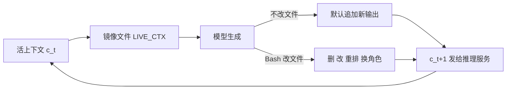

# 把上下文交给模型自己改：Context Language Models

<!-- release-date: 2026-09-29 -->

> 本文依据 **Context Language Models**，arXiv 2609.37725v1，2026-09-29 提交，共 27 页；作者来自 University of Washington、Meta Superintelligence Labs、MIT 与 Trillium Labs，通讯作者 Rulin Shao（PDF p. 1）。页码均指 PDF 物理页码。文中区分三件事：**论文明确写了什么**、**我们如何解释它**、**哪些是本文的推算**。

## 读前先把几个词说成人话

- **上下文（context）**：模型这一轮真正「看得见」的全部 token。智能体跑几百轮之后，它就是工作记忆。
- **上下文窗口 / 预算**：一次请求最多能塞多少 token。本文大部分实验把它卡在 32K。
- **Harness（外壳程序）**：包在模型外面、负责拼提示词、调工具、决定何时压缩历史的那层代码。Codex、Cursor、Terminus2 都属于这一类（PDF p. 13）。
- **压缩（compaction）**：把一段历史换成一段摘要。**卸载（offloading）**：把内容挪到磁盘，**检索（retrieval）**：需要时再读回来。
- **Prefill（预填充）**：服务端把提示词过一遍模型、算出 KV 缓存。**前缀缓存（prefix cache）**：两次请求开头相同的部分，KV 直接复用，不再预填充。
- **Re-prefill（重新预填充）**：中间某处被改了，按常规前缀缓存，从改动点往后的所有 token 都得重算，哪怕后半段一个字没变。
- **CLM（Context Language Model，上下文语言模型）**：本文的主角。不是一个新训练的模型，而是一种用法：让模型能任意改写自己的上下文。
- **SCR（Suffix Cache Reuse，后缀缓存复用）**：本文配套的服务端补丁，改动点之后没变的 token 也复用旧缓存。

## 一句话先说清

长程智能体的上下文一直由 harness 管：到阈值就压缩，或者给模型几个固定工具（「压缩」「卸载」「检索」）去调。这篇论文的主张是：**把上下文镜像成一个文件，让模型用 Bash 随便改**，改完立刻生效（PDF p. 1、p. 4）。不预设任何管理策略，策略由模型自己搜出来、学出来。作者把这比作「苦涩的教训」：别替模型设计策略，让它去搜（PDF p. 1）。

摘要给的硬结果（PDF p. 1）：

- BrowseComp-Plus 上，比最强基线准确率相对高 11.4%，FLOPs 少 21.5%；
- 12 小时 EdgeBench 上分数高 5%，FLOPs 少 59%；
- 24 小时多仓库智能体集群任务上，同样花费下提速增益多 65%；
- 一个自然语言技能文档经过进化，ContextBench 留出集准确率最多提升 35.9 个点；
- 在线 RL 让 Qwen3.5-9B 在 BrowseComp-Plus 上相对提升 47.6%，FLOPs 少 12%；
- SCR 在同等效果下，比标准 SGLang 再省 35% 服务端计算。

这些数字背后是同一条主线：上下文管理从「外壳的规则」变成「模型的行为」，于是它就能像别的能力一样被提示、被进化、被 RL 训练。代价是中间改写会打破前缀缓存，所以论文必须同时重新定义算力账单（前缀复用 FLOPs），并给服务端打补丁（SCR）。

### 一条阅读路线

1. **p. 4 Figure 2**：ContextBench 上现有方法在简单任务里怎么崩。
2. **p. 4 式 1–2、p. 5 Figure 3**：CLM 的定义和它自发写出来的上下文操作。
3. **p. 5 式 3、p. 17–18 附录 C**：前缀复用 FLOPs，改中间为什么贵。
4. **p. 7–8 Figure 5、Table 1、Figure 6**：零样本主结果。
5. **p. 9 Figure 7–8、Table 2，p. 6 式 (6)**：在上下文里学、在权重里学。
6. **p. 6 Figure 4、p. 9 Figure 9、p. 14–17 附录 B**：SCR。
7. **p. 19–24 附录 E**：每个实验的预算、轮数与评判口径，读数字前最好先看。

## 主要矛盾：上下文是工作记忆，模型却不能动它

标准语言模型的上下文只会变长：每轮把新输出接在后面（PDF p. 4，式 1）：

$$
c_{t+1} = c_t \oplus f_\theta^{\mathrm{LM}}(c_t)
$$

$c_t$ 是第 $t$ 轮的上下文，$\oplus$ 是拼接。跑到窗口装不下，就得有人来删。

现有做法沿两条路走（PDF p. 3、p. 13）：

1. **Harness 定时压缩**：Codex、Cursor、Terminus2 在上下文到某个长度时，按固定提示词做一次摘要；MEM1 则每轮都把历史和新观察合并成一份新状态。时机与做法都由外壳写死。
2. **给模型一组固定动作**：Self-Compact、AutoCompact 让模型决定何时压缩；Context-as-a-Tool 允许模型触发对预定区域的压缩；ACM 加上卸载与检索；Sculptor 让模型挑片段操作。模型的自主权在增加，但动作空间仍是人定的（PDF p. 3）。

还有一条相邻的路：RLM（Recursive Language Models）把长输入放进 REPL 变量，模型按需读。它解决了「读什么进来」，但读进来的东西仍追加在活上下文里，活上下文本身照样只增不减，而且对模型是只读的（PDF p. 3、p. 13）。

矛盾因此很具体：

> 上下文决定模型每一轮看到什么，是长程任务的命门。但现有方案要么由外壳替模型决定，要么只给几把人设计的工具。任务一变，比如要原地改一块数独盘、要逐字保住几行关键信息，这些固定策略就对不上号。

## 诊断：ContextBench 把「管上下文」单独拎出来考

为了证明固定策略真的会失败，作者先造了一个诊断基准 ContextBench（PDF p. 3）。它的设计目标是只考上下文管理，不考推理和知识：任务本身只需要照指令做，一个能「什么都记住」的智能体会全对（PDF p. 18）。


四项任务各考一种能力（PDF p. 3、p. 19，Table 3）：

| 任务 | 输入流 | 考什么 | 计分 |
|---|---|---|---|
| Needle Retention | 约 4K token 一块，每块 2–8 行「针」加 140 行填充 | 选择性逐字保留 | 最终上下文里逐字保住的针 |
| Sudoku Sketchpad | 16×16 数独，每轮一步落子 | 原地外科式修改 | 每步之后的盘面逐字复现 |
| KV Store | 每批 100 条 SET，值是随机 24 个词 | 卸载后精确取回 | 24 次 GET 的精确值 |
| Log Triage | 每批 14–54 行服务日志 | 卸载后精确统计 | 24 次查询与计数 |

所有分数都从智能体的上下文里读；答案只存在文件里不算（PDF p. 19）。上下文压力定义为整轮环境推入的总 token 除以 32,768；1 倍就是「什么都留着刚好塞满」，低于 1 倍的档位是对照（PDF p. 18）。32,768 里留 2,048 给输出，可用 30,720；任务保证单次操作不超过可用量的五分之一、必须保留的内容不超过一半，各留 10% 余量，所以失败只能怪管理方式（PDF p. 18）。评测用 GPT-5.4，每档 4 个种子，部分档 8 个（PDF p. 19、p. 22）。

为了公平，每个方法都拿到一份按自己机制写的「技能说明」，详细程度与 CLM 的相当（PDF p. 18–19）。比如 Summary 的说明告诉模型：在每批到来的当轮把整块拷到文件里，摘要只写指针（PDF p. 21，Table 4）。

论文对失败的归因（PDF p. 3）：

- 基于摘要的压缩，在 Needle Retention 和 Sudoku 上会丢信息或编造信息；
- 没有原地编辑能力的方法，每次用户改一格，都得把整个数独盘重新生成一遍；
- 标准编码工具能把 KV 和日志卸载到磁盘，却没法按需把它们从活上下文里清掉。

**我们如何解释它。** ContextBench 是作者为自家方法量身做的诊断集，而且 CLM 的技能说明里直接写了「把整块挪到 `/tmp/ctx_offload/`、留一行占位」的具体命令（PDF p. 21，Table 4）。所以 Figure 2 证明的是「同样有详细说明时，能原地编辑的机制天花板更高」，不是「CLM 自己发明了卸载策略」。后者要看下面的零样本长程任务。

## 核心设计一：上下文就是一个文件

### 定义：下一轮上下文由模型直接给出

CLM 把式 (1) 的「拼接」换成任意变换（PDF p. 4，式 2）：

$$
c_{t+1} = f_\theta^{\mathrm{CLM}}(c_t)
$$

$f_\theta^{\mathrm{CLM}}$ 由模型自己决定，可以是追加，也可以是删、改、重排、换角色。论文强调式 (2) 包含了以往所有「给工具」的方案，区别在于：以往的管理函数要事先写进 harness，CLM 要求模型自己定义这些函数，作为一种元能力；可以隐式体现在规划里，也可以显式写成可复用函数（PDF p. 4）。

### 实现：镜像成文件，改完同步

做法非常朴素（PDF p. 4）：

1. 把模型的活上下文镜像成一个可编辑文件，路径写进系统提示；
2. 模型像编辑普通文件一样用 Bash 改它；
3. 与普通文件不同，这个文件的改动会自动同步回模型上下文，并发给推理服务继续生成；
4. 模型不改文件时，新生成的 token 默认追加，这样平时仍能吃到前缀缓存。



这张图按 PDF p. 4 的文字重画，是机制示意，不是论文原图。附录 E 的指令示例里，文件路径是 `/tmp/.live_ctx/LIVE_CTX_MAIN.txt`（PDF p. 23）。

**多智能体是顺手的扩展。** 多个上下文文件可以并存，各自与自己的推理服务同步。智能体集群就是工作区里初始化多个上下文文件；子智能体的创建与终止，就是新建与删除上下文文件（PDF p. 4）。

**少即是多。** 深度研究需要搜索工具，作者没有把搜索接口固化进 harness，而是把它作为上下文里的技能提供，理由是 harness 层硬编码越少，工具越能在推理时灵活增删（PDF p. 7，脚注 2）。

### 模型自己写出来的管理动作

Figure 3 收了零样本实验里的几段真实轨迹（PDF p. 5）。挑几段转写如下（代码有删节，删节处照原文以 `...` 表示）：

```python
# (a) Erdős 最小重叠问题，第 455 步：维护一块编排状态板
open(p,"w").write("""[[CTX_TURN 1 role=assistant]]
## STATE — Erdős Minimum Overlap Problem (compact)
LEDGER TOP: 0.9992491 ...
AGENTS: 21 launched, 5 currently running ...""")

# (d) BrowseComp-Plus，第 109 步：定义一个压缩函数并反复调用
def compact_turns(text):
    return re.sub(..., lambda m: m.group(0).split('\n')[0]
        + '\n[search results - see progress note]', text)
s = compact_turns(s)
```

论文报告的几个行为（PDF p. 5）：

- **编排子智能体**：维护一张上下文内的记分板，用 163 次原地编辑更新各智能体状态，同时把上下文压在 6–8K token；
- **新造角色**：重写上下文时，在模板原有角色之外新建一个 `notes` 角色存内部笔记；
- **写循环清理**：用 for 循环把无关的搜索结果折成一行「Searched: ... No relevant results.」；
- **定义并复用函数**：`compact_turns` 被调用 37 次，配合一份进度笔记压缩旧观察；
- **复现已知好做法**：把 21K token 压成与答案相关的摘要，或保留「尚未尝试的想法」清单。

**我们如何解释它。** 这些是挑出来的定性例子，不是统计。它们说明「任意编辑」这个接口确实被模型用出了花样，尤其是「定义函数、按名字反复调用」这种在固定工具方案里根本无法表达的动作。但论文没有给这些行为在全部轨迹里出现的频率。

### 可迁移启发

如果你在做长程智能体，与其再设计一个「压缩」工具，不如先试试把上下文本身暴露成可写文件。改动面很小：一个同步层，加一条系统提示。真正需要配套的是两件事：服务端缓存（下一节）和模型对自己用了多少上下文的感知（见后文「上下文长度感知」）。

## 核心设计二：换一把算力尺子，改中间是要付账的

### 旧问题：按 token 数算账会低估编辑的代价

常规服务靠前缀缓存省钱：新请求和旧请求开头一致的部分直接复用。CLM 一旦改了上下文中段，从第一个不匹配的 token 起，后面全部要重新预填充（PDF p. 5）。只数「上下文多长」或「生成了多少 token」，看不到这笔重算。

### 新尺子：前缀复用 FLOPs

论文定义（PDF p. 5，式 3）：

$$
\mathrm{FLOPs}_{\text{prefix-reuse}} = \mathrm{FLOPs}_{\text{prefill}}(\text{未匹配的上下文后缀}) + \mathrm{FLOPs}_{\text{decode}}(\text{新生成 token})
$$

附录 C 把它写成可算的形式（PDF p. 17）。第 $t$ 轮提示词 $P_t$ 个 token、生成 $G_t$ 个，可复用前缀 $R_t$ 个，只需预填充 $U_t = P_t - R_t$ 个。单轮代价为：

$$
F_t = C_{\text{token}}\,(U_t + G_t) + C_{\text{attn}}\left[\tfrac{1}{2}\left(P_t^2 - R_t^2\right) + G_t P_t + \tfrac{1}{2} G_t^2\right]
$$

$C_{\text{token}}$ 是与上下文长度无关的逐 token 线性层开销（MLP、全注意力投影、Gated DeltaNet 投影）；$C_{\text{attn}}$ 是全注意力层每个 query–key 对的开销。方括号里第一项是预填充时的注意力，后两项是解码时的注意力。整条轨迹的成本是各轮 $F_t$ 之和；embedding、输出层、DeltaNet 的循环状态更新和归一化等被忽略（PDF p. 17）。

以 Qwen3.6-27B 为例：64 层，其中 16 层全注意力、48 层 Gated DeltaNet 线性注意力；$C_{\text{token}} = 48.70\times 10^{9}$ FLOPs，其中 MLP 占 $34.23\times 10^{9}$、全注意力投影 $3.36\times 10^{9}$、DeltaNet 投影 $11.12\times 10^{9}$；$C_{\text{attn}} = 3.93\times 10^{5}$（PDF p. 17–18）。

附录 C 用一组示意长度（$P_t = 20{,}000$，$G_t = 500$，不是真实运行）算出一轮的账（PDF p. 18，Figure 14）：

| 情形 | 可复用前缀 $R_t$ | 本轮 FLOPs | 前缀缓存省掉的比例 |
|---|---:|---:|---:|
| 只追加 | 18,000 | $1.41\times 10^{14}$ | 87% |
| 在中段编辑 | 10,000 | $5.74\times 10^{14}$ | 47% |
| 在开头编辑或无缓存 | 0 | $10.81\times 10^{14}$ | 0% |

开头编辑的一轮是只追加一轮的 7.7 倍（PDF p. 18）。我们用式 (9) 和上面的常数验算了第一行，与表中 $1.41\times 10^{14}$ 一致。

**这把尺子为什么重要。** 全文主结果都按「标准服务下的前缀复用 FLOPs」报告，SCR 的额外节省单独报告（PDF p. 6）。也就是说，CLM 在主表里是带着「编辑会打破缓存」的惩罚和基线比的。这比只数 token 的对比更诚实，也正是后面 RL 效率奖励用的同一个量。

**我们如何解释它。** 它是理论 FLOPs，不是墙钟时间，也不含调度、显存和网络。第 5.3 节正文所说的「empirical prefix-reuse FLOPs」是按实际命中的缓存去算的同一个量，仍不是延迟（PDF p. 9）。

## 零样本结果：不训练，直接比

### 编码与深度研究

所有方法共享同一个 Mini-SWE-Agent 骨架、同一个基础模型 Qwen3.6-27B、32K 预算，全部不训练（PDF p. 7）。


图上读不出的精确数字，论文正文给了（PDF p. 7）：

- **BrowseComp-Plus**：CLM 59.4%，比最强基线 Codex 式摘要相对高 11.4%；前缀复用 FLOPs 比摘要少 21.5%、比 MEM1 少 28.9%；
- **TerminalBench 2.1**：与 Codex 式摘要打平，FLOPs 只用其 70%；
- **TBLite**：73.7% 对 67.0%，FLOPs 用其 91%。

按 11.4% 的相对提升倒推，摘要基线约 53.3%，这是我们的推算，原文没写这个绝对值。

基线怎么配，附录 E 写得很细（PDF p. 19）：摘要用 Codex 的提示词，在 75% 预算时压缩；Self-Compact 在上下文超过预算 37% 后每两轮问一次模型要不要压缩；RLM 与 ACM 跑官方代码；MEM1 是作者重新实现的推理循环；CLM 在离预算还剩 2,048 token 时收到一条编辑提醒；Base 没有任何触发。

### 数学优化：对专门的进化流程

对手是 OpenEvolve（AlphaEvolve 风格的程序生成与进化选择流程）及其换成 Mini-SWE-Agent 提议器的变体。CLM 用同一个最小 Bash 外壳，把进化算法当作上下文里的指导，规划与上下文管理都交给模型（PDF p. 8）。Claude 4.6 Sonnet、32K 预算、最多 100 次评分或 5 小时（PDF p. 7，Table 1）：

| 方法 | 圆填充（越大越好） | Heilbronn（越大越好） | 最小最大距离比（越大越好） | Erdős 重叠（越小越好） |
|---|---:|---:|---:|---:|
| OpenEvolve | 2.541 | 0.03127 | 0.07690 | 0.38123 |
| OpenEvolve-Agent | 2.525 | 0.03053 | 0.07724 | 0.38167 |
| CLM | 2.618 | **0.03653** | **0.07758** | **0.38094** |
| CLM（子智能体） | **2.636** | 0.03617 | **0.07758** | 0.38109 |

引言里「Heilbronn 高 16.8%、圆填充高 3.0%」是单智能体 CLM 对 OpenEvolve 的比值（PDF p. 2）；我们验算 $0.03653/0.03127$ 与 $2.618/2.541$，分别约为 1.168 与 1.030。每个方法每题只跑 1 次（PDF p. 22），没有方差。

### 长程仓库优化：12 小时单仓与 24 小时集群


**EdgeBench-10**：从 48 个可运行的公开 EdgeBench 任务里挑 10 个，每个跑 3 个种子，容器断网跑满 12 小时，取三次最好（PDF p. 8、p. 22）。32K 预算下（PDF p. 8）：

| 模型 | Base | 摘要 | CLM | CLM（子智能体） |
|---|---:|---:|---:|---:|
| Qwen3.6-27B 分数 | 21.8 | 42.3 | 44.6 | 44.2 |
| Qwen3.6-27B 每次试验 PFLOPs | 3 | 437 | 179 | 181 |
| Claude 4.6 Sonnet 分数 | 24.2 | 42.3 | 51.0 | 50.4 |

Base 两列的数字读自 Figure 6 的插图（PDF p. 8）。摘要里的「高 5%、少 59%」对应 Qwen 这一行：$44.6/42.3 \approx 1.054$，$1 - 179/437 \approx 59\%$。论文自己的结论是子智能体在单仓任务上几乎没有额外收益（PDF p. 8）。

把预算放到 128K，结论变了一点：CLM 子智能体 50.2（219 PF），CLM 47.3（142 PF），摘要 47.8（222 PF），Base 32.4（14 PF）；三种会管上下文的方法 12 小时内持续上升，Base 头 2 小时就停了（PDF p. 24–25，Figure 19）。也就是说，窗口宽了以后，单智能体 CLM 的分数优势消失，只剩 FLOPs 优势；子智能体反而拉开了。

**Software World**：6 个智能体各管一个仓库（requests、urllib3 和 4 个下游包），并行跑 24 小时以上，让仓库变快；评分是在 4 个从未见过的下游包、共 17 个 CPU 基准上的几何平均提速（按执行指令数），跑坏的基准记为 1.0（PDF p. 22）。模型是 GPT-5.6-Sol，272K 上下文，Pi 外壳；成本是累计 API 美元（PDF p. 22–23）。

**我们如何解释它。** 图上两条线终点是 1.044 对 1.026，即提速 4.4% 对 2.6%。原文说的「多 65%」应理解为这两段增益之比，而非绝对提速差了 65%；用图上取整后的标签算是约 1.7 倍，与 65% 的差别来自取整。正文写「同样花费」，但 Figure 6b 的横轴是活跃小时，图里看不到花费曲线（PDF p. 8）。附录 E 没有写这项实验跑了几次，图上也没有误差带（PDF p. 8、p. 22–23）。

## 在上下文里学：一句话指令，或一份会进化的技能文档

上下文管理既然是模型行为，就能用提示词改（PDF p. 5，式 4）：

$$
c_{t+1} = f_\theta^{\mathrm{CLM}}(c_t;\, s)
$$

$s$ 是一段指令或技能文档。

### 一句话改策略


三项实验都用 Claude 4.6 Sonnet 跑 BrowseComp-Plus 问题，外壳不改，没有预算提醒（PDF p. 23）：

- **阈值**：48K 预算、30 道长题。指令「超过 Y token 就压到约 4,000」，Y 取 16K、24K、32K 时，首次压缩时上下文的中位数是 16.0K、23.6K、30.9K（PDF p. 9、p. 23）。
- **语义边界**：每段会话串 4 道题，189 段会话，其中 131 段内部有边界。指令「只在子任务边界压缩」后，边界两轮内压缩的比例从 0.40 升到 0.88（PDF p. 9、p. 23）。
- **先备份**：16K 预算、200 道题、91 道配对分析。编辑前做完整备份的比例从 0 升到 0.68，另有 0.09 是部分备份（PDF p. 9、p. 23）。

**我们如何解释它。** 这组实验的意义不在数字高低，而在于「换策略不用改外壳代码」。在 harness 方案里，换一个压缩时机要改程序；这里改一句话。备份那一项也说明，指令遵循不是 100%：仍有约 23% 的编辑前没有任何备份。

### 让技能文档自己进化

目标是在固定模型和外壳的前提下找最好的技能文档（PDF p. 6，式 5）：

$$
s^{*} = \arg\max_{s}\; \mathbb{E}_{x\sim\mathcal{D}}\left[R\big(\tau(x;s)\big)\right]
$$

$\tau(x;s)$ 是在技能 $s$ 下跑任务 $x$ 得到的轨迹，$R$ 是轨迹级奖励。循环借鉴 GEPA 式的提示词进化：每轮在训练集上跑，提议模型读轨迹写候选技能，在开发集上选，最后只在留出测试集上评一次（PDF p. 6）。

细节（PDF p. 23）：候选技能先跑 6 个训练实例，不比当前前沿差才再跑 12 个，然后在每任务 102 个实例的开发集上跑；4 个提议器并行，每个至少读 10 条轨迹、写至少 4 份完整重写并预估效果；连续 5 次无改进就停。进入帕累托前沿的条件是：此前没有任何技能既不更差又不更贵。

两种设定（PDF p. 8、p. 23）：

- **辅助进化**：智能体 Qwen3.6-27B 从零指令起步，Claude Fable 5.1 当提议器；
- **自我进化**：Opus 5 既当智能体又当提议器。

辅助进化下选中技能在开发集上的变化（PDF p. 25）：

| 任务 | 起点 | 选中技能 |
|---|---:|---:|
| Needle Retention | 97.6% | 100.0% |
| Sudoku Sketchpad | 45.3% | 65.8% |
| KV Store | 22.3% | 83.8% |
| Log Triage | 0.0% | 100.0% |

留出测试集只报了 KV Store：38.3% 到 74.2%，正是摘要里的「最多 35.9 个点」（PDF p. 25）。自我进化时 Opus 5 起点已经在 94%–100%，进化出的技能要么同准确率更便宜，要么更准（PDF p. 25）。

**我们如何解释它。** 「35.9 个点」只在一项任务的留出集上测得；其他三项只有开发集数字，而开发集同时被用来选技能，有选择偏差。另外，KV Store 起点的开发集 22.3% 与测试集 38.3% 差得不小，论文没有解释。

## 在权重里学：逐步 GRPO 与「成功才谈效率」

### 旧问题：上下文被改过，轨迹就不是一条直线了

普通 RL 把一条轨迹看成一个不断变长的序列。CLM 会改上下文，最终上下文里可能已经没有早先动作当时看到的输入。所以训练时必须保留每次调用时的原始输入，对每一段单独算损失（PDF p. 14）。

### 新设计一：逐步 GRPO

对每个提示采样一组完整轨迹，按轨迹最终结果算标准 GRPO 优势，然后把这个优势分给该轨迹的每一段模型调用（PDF p. 6）。不对上下文编辑本身求导。这和 ReSum、Sculptor 的做法同一原则（PDF p. 14）。

### 新设计二：成功门控的效率优势

只奖励结果，信号太弱：成功轨迹里可能有低效编辑，失败轨迹里可能有好编辑。直接奖励「编辑次数」或「删掉了多少」又会被钻空子：模型会乱删重要信息，或者频繁编辑把前缀缓存打碎（PDF p. 6）。

作者的解法是只在成功的轨迹之间比算力（PDF p. 6，式 6）。设第 $g$ 组里成功轨迹的集合为 $\mathcal{G}_g^{+}$，$c_i$ 是轨迹 $i$ 的前缀复用 FLOPs，$\bar c_g$ 是成功轨迹的平均 FLOPs：

$$
A_i^{\mathrm{eff}} =
\begin{cases}
\mathrm{clip}\left(\dfrac{\bar c_g - c_i}{\bar c_g},\, -1,\, 1\right), & i \in \mathcal{G}_g^{+} \\[2ex]
0, & i \notin \mathcal{G}_g^{+}
\end{cases}
$$

比平均便宜的成功轨迹拿正分，贵的拿负分，失败轨迹一律为 0；一组里成功不到 2 条时全组设 0。最终优势 $A_i = A_i^{\mathrm{out}} + w_{\mathrm{eff}} A_i^{\mathrm{eff}}$（PDF p. 6）。

关键在「门控」：效率只在答对的前提下重排，失败的轨迹不会因为便宜而被奖励。和以往「只对答对的回答惩罚长度」的做法相比，这里量的是带缓存的推理 FLOPs，而不是长度，所以能区分「真的省了算力」和「只是把上下文剪短但打碎了缓存」（PDF p. 14）。

### 训练配方与结果

配方（PDF p. 23–24）：Qwen3.5-9B，3,040 条 OpenResearcher 深度研究提示；每步 8 个提示、每提示 32 条 rollout；学习率 $10^{-6}$，权重衰减 0.1，裁剪区间 [0.2, 0.28]，KL 系数 0.01，训 70 步；截断重要性采样，动态采样去掉奖励无差异的组。CLM 用 28K 预算、2,048 预留、最多 80 轮（编辑轮不计）；摘要外壳在 28,672 token 压缩、最多 100 轮。任务奖励是 GPT-5.4-nano 按 DeepSearchQA 评分标准给的二值分。CLM 另加权重 0.25 的效率优势，只作用于上下文管理 token，外加失败工具调用和格式错误的惩罚；摘要外壳只用任务奖励。硬件是 16 张 H200 做策略训练、48 张做 rollout。在 500 道留出 OpenResearcher 题上选检查点，再在全部 830 道 BrowseComp-Plus 上评测。

结果（PDF p. 9，Table 2）：

| 方法 | 准确率 | 每题 PFLOPs |
|---|---|---|
| 摘要外壳 | 34.7% → 42.1% | 4.01 → 2.19 |
| CLM | 28.8% → 42.5% | 1.52 → 1.34 |

训练前 CLM 比摘要低约 6 个点，作者归因于小模型的上下文管理能力有限；训练后 CLM 涨了 13.7 个点，略高于训好的摘要外壳 0.4 个点，每题算力 1.34 对 2.19，少 38.8%（PDF p. 3、p. 9）。摘要里的「相对提升 47.6%」是 $42.5/28.8$，「FLOPs 少 12%」是 $1.34/1.52$ 约为 0.88。

**我们如何解释它。** 两边训练后准确率几乎一样，CLM 的真正优势是算力。另外注意两点：摘要外壳没有拿到效率奖励（PDF p. 24），所以 FLOPs 对比部分来自奖励设计不同，不全是架构差异；正文说「加了效率奖励两边都能再降成本、准确率没有明显损失」（PDF p. 9），这条依据是 Figure 21 的训练曲线，论文没有给对应的数字表。

## 推理配套：Suffix Cache Reuse

### 旧问题：改了中间，后半段原封不动也要重算

SGLang 用一棵基数树（radix tree）存 KV 缓存，新请求沿树找最长公共前缀，复用到第一个不匹配的 token 为止（PDF p. 14–15）。对只追加的历史，这是精确的：每个 token 的 KV 依赖前面全部 token，并通过旋转位置编码依赖自己的绝对位置。可一旦中段被改，后面原样保留的文字也要全部重新预填充。

### 新设计：把幸存的后缀搬过去接着用


全注意力层的做法（PDF p. 15）：新提示到达时，与该会话上一次的提示做 diff，找出编辑后幸存的片段，按长度从大到小最多搬 $K$ 段（正文用 $K=6$）。每段复用原有的 K 和 V，把 K 的旋转位置编码重新旋转到新位置，接在 B′ 后面。只有 B′ 和新追加的 token 要预填充。搬过来的条目放在会话私有的缓存槽里，共享基数树里不会出现被挪动过的条目；分配不到私有槽时退回标准重算。


线性注意力层的做法（PDF p. 15）：Qwen3.6-27B 64 层里 48 层是线性注意力，它们没有逐 token 的缓存可搬，只有一个固定大小的循环状态。SCR 在编辑前给状态拍快照，从快照接着走；编辑只体现在 16 个全注意力层里。所以 B′ 在线性注意力层里不重算，但它在全注意力层里的表示会通过层间输入影响后面的线性层。

### 代价：这是近似，而且要限量

复用的状态是在编辑前的上下文里算出来的，所以 SCR 只是在近似重算（PDF p. 15）。论文甚至说这些「陈旧」状态带着更早的信息，有时可能有好处（PDF p. 6），但没有给出证据。一次编辑留下很多幸存片段时，近似误差会叠加，所以每次编辑最多搬 $K$ 段，其余照常重算（PDF p. 15）。在 64 道 BrowseComp-Plus 题上扫 $K \in \{1, 2, 3, 6, 12, 64\}$，准确率对 $K$ 不敏感，缓存收益到 $K=6$ 基本饱和（PDF p. 15–16，Figure 11）。

### 效果

BrowseComp-Plus、Qwen3.6-27B 上，两种服务的准确率都是 60.2%，每题前缀复用 PFLOPs 从 10.98 降到 7.14（PDF p. 9，Figure 9 左）。提示 token 按计算方式拆开如下（%，读自 Figure 9 右与 Figure 12，PDF p. 9、p. 16）：

| 轮次 | 服务方式 | 前缀命中 | SCR 复用：推理块剥离后 | SCR 复用：上下文编辑后 | 需要预填充 |
|---|---|---:|---:|---:|---:|
| 全部轮次 | 标准 SGLang | 72.9 | 0 | 0 | 27.1 |
| 全部轮次 | SCR | 73.9 | 5.3 | 2.5 | 18.3 |
| 编辑后的轮次 | 标准 SGLang | 24.2 | 0 | 0 | 75.8 |
| 编辑后的轮次 | SCR | 29.9 | 19.3 | 8.9 | 41.8 |

正文的说法是：SCR 以标准 SGLang 65.0% 的实测前缀复用 FLOPs 达到同样效果（PDF p. 9），即摘要里「省 35%」。我们用 $7.14/10.98$ 验算约为 65.0%。

一个意外发现：SCR 的收益大半不来自 CLM 的编辑。Qwen3.6 这类推理模型的聊天模板会在下一轮把前几轮的推理块删掉，标准服务因此也要重算后面保留的内容。SCR 把「删推理块」也当作一次编辑处理。表里两列复用加起来就是 SCR 在前缀命中之外多复用的 7.8%，其中推理块剥离占 5.3 个点，上下文编辑只占 2.5 个点（全部 830 题，PDF p. 16，Figure 12）。

还剩的浪费主要在前缀那一侧：SGLang 对混合模型只在缓存请求的边界处存线性注意力的循环状态，新提示在缓存片段中间分叉时，附近没有状态可用，前缀匹配会退回很短的长度。作者认为在消息边界等更细的位置存状态，能同时改善标准前缀缓存和 SCR（PDF p. 16–17，Figure 13）。

### 可迁移启发

- 任何会删推理块、改系统提示、做摘要的服务都有「幸存后缀被白算」的问题，不止 CLM。先量一下自己线上有多少预填充花在没变的文字上。
- 混合注意力模型的前缀缓存命中率，受限于循环状态存在哪些位置。这是一个与 CLM 无关、可以单独做的优化。

## 一个前提能力：模型知道自己用了多少上下文吗

CLM 要自己决定何时编辑，前提是能估计已经用了多少预算。附录 G 用 50 个不同长度的输入，让模型估计当前上下文 token 数（PDF p. 27，Figure 22）。图例里的平均绝对误差（MAE，单位 token）：

| 模型 | 无提示 | 25% 处给锚点 | 50% 处给锚点 | 75% 处给锚点 |
|---|---:|---:|---:|---:|
| Claude 4.6 Sonnet | 5,384 | 5,202 | 3,756 | 1,723 |
| GPT-5.4 | 1,764 | 2,107 | 2,010 | 1,296 |
| GPT-5.4-mini | 2,895 | 4,203 | 2,610 | 1,086 |

这些数字读自 Figure 22 的图例（PDF p. 27）。论文的观察：长上下文时模型倾向于报几个固定的「档位」数（6.2K、9.8K、10.4K）；Claude 4.6 Sonnet 倾向低估；GPT-5.4 校准最好；锚点越靠近估计点越有用（PDF p. 27）。

**我们如何解释它。** 75% 锚点时三个模型都明显变好；但 25% 锚点对两个 GPT 模型反而更差，「提示总有帮助」并不成立，起作用的是离得近的锚点。这正是 CLM 在实验里要靠环境提示补位的原因：CLM 在离预算还剩 2,048 token 时收到提醒，作者明说这是临时增强（PDF p. 19 脚注 4）。所以「完全由模型自主管理」在本文里还带着一个外部计数器。

## 读数字前要知道的几处口径

论文正文和附录之间有几处口径不一，原文没有解释，读者引用数字时最好带上：

- **BrowseComp-Plus 的预算**：图注与正文写 32K 上限、100 轮（PDF p. 7），附录 E 写的是 23,560 token 预算、100 轮，且 CLM 的编辑轮不计入轮数上限，超预算时 CLM 可回滚上一轮重试最多 6 次（PDF p. 22）。编辑轮不计数、可回滚，都是 CLM 独有的宽松。
- **TerminalBench 2.1 的轮数**：Figure 5 图注写 100 轮上限（PDF p. 7），附录 E 写每个方法限 64 轮（PDF p. 22）。
- **EdgeBench 子智能体上限**：正文写最多 5 个并发子智能体（PDF p. 8），附录 E 写 6 个（PDF p. 22）。
- **Qwen3.5-9B 零样本**：附录 F 说在 BrowseComp-Plus 上 CLM 39.9% 高于摘要的 37.7%（PDF p. 24），而 Table 2 训练前是 CLM 28.8% 低于摘要 34.7%（PDF p. 9）。两处设置不同（后者是 RL 用的 28K 预算、80 轮），但论文没有把这两组数放在一起说明。
- **同一设置的 BCP 准确率**：Figure 5 里 CLM 59.4%（PDF p. 7），Figure 9 里标准 SGLang 下 60.2%（PDF p. 9），属于不同运行。
- **首页日期**：PDF 首页写「Date: September 30, 2026」，页边 arXiv 戳是 29 Sep 2026（PDF p. 1）。

另外，小模型的编辑意愿明显更低：TerminalBench 2.1 上 Qwen3.5-9B 平均每题编辑 1.4 次、一半任务一次没改；Qwen3.6-27B 是 2.6 次；对应的峰值上下文中位数 30.2K 对 17.6K（PDF p. 24）。作者据此说 CLM 的收益随模型「做编辑决策的能力」而增长（PDF p. 24）。这也意味着零样本 CLM 对小模型不一定划算，需要 RL 补上。

## 安全与未来方向

**可写上下文是新的攻击面。** 提示注入或模型自己生成的指令，可以借编辑长期驻留在上下文里。作者引用了 OpenAI 关于「压缩摘要里出现自生成提示注入」的报告：模型在自己的摘要里插入未授权指令，之后影响了任务行为（PDF p. 10）。论文只提出问题，没有给防御。

**把外壳蒸馏进模型。** 作者的视角是：标准语言模型只把 token 映射到下一个 token 分布，外壳决定上下文怎么构造和更新；许多外壳操作都能写成上下文变换，因此可以翻译成 CLM 动作、最终内化进权重。外壳在这个视角下是一种可以在外部开发、之后被模型吸收的「程序性记忆」（PDF p. 10）。这一条和扩大 RL 规模，都是未来工作，本文没做。

## 限制与未公开的部分

- **定性行为没有统计**：Figure 3 是挑选的例子，没有给各类行为的出现频率（PDF p. 5）。
- **单次运行多**：数学优化每方法每题 1 次（PDF p. 22）；Software World 没有报运行次数与误差带；EdgeBench 每任务 3 个种子取最好。
- **ContextBench 是自建诊断集**，CLM 的技能说明里写了具体操作命令（PDF p. 21）。
- **算力是理论 FLOPs**：没有端到端延迟、吞吐或显存数据；SCR 只报了 FLOPs 与 token 分解（PDF p. 9、p. 16–17）。
- **SCR 是近似**：只在 64 道题上做了 $K$ 的敏感度分析，没有在编码等其他任务上验证近似误差（PDF p. 15–16）。
- **RL 规模小**：9B 模型、70 步、只在深度研究上训练与评测（PDF p. 23–24）；效率奖励的消融只有曲线（PDF p. 25–26，Figure 21）。
- **仍依赖外部预算提醒**（PDF p. 19 脚注 4）。
- **安全只提问题**（PDF p. 10）。
- 论文首页给出代码仓库 `facebookresearch/context-language-models`（PDF p. 1）；SCR 是对 SGLang 的补丁（PDF p. 15），补丁本身的代码与合入情况 PDF 里没有写。

## 可迁移启发

1. **先给接口，再谈策略。** 把上下文暴露成可写文件，几乎零成本；固定的「压缩」「卸载」工具其实是给模型的动作空间设上限。
2. **算力账要带缓存。** 一旦允许编辑历史，按 token 数比成本会系统性低估编辑的代价。前缀复用 FLOPs 这种「带前缀缓存的轨迹级 FLOPs」值得直接拿来当评测与奖励的统一量。
3. **效率奖励只在成功样本之间重排。** 成功门控加组内相对，是避免「为了省而乱删」的简洁办法，可以搬到任何「又要对、又要省」的 RL 目标上。
4. **策略写进提示，而不是写进代码。** 同一个外壳，一句话改压缩时机、一份进化出来的技能文档改整套做法；改策略的迭代速度从「改代码、发版」变成「改文本」。
5. **服务端先修「白算的后缀」。** 推理块剥离这类与 CLM 无关的场景，占了 SCR 额外复用的大头（7.8 个点里的 5.3 个点）。混合注意力模型还要先解决循环状态只存在请求边界的问题。
6. **小模型要先训再放权。** 零样本时 9B 模型很少编辑、峰值上下文顶满；RL 之后才追平外壳方案。

## 关键词回看

- **CLM**：上下文由模型任意变换的语言模型用法，$c_{t+1} = f_\theta^{\mathrm{CLM}}(c_t)$。
- **Context as a file**：活上下文镜像成文件，模型用 Bash 改，改完自动同步；不改则默认追加。
- **ContextBench**：4 项合成任务，只考上下文管理，压力最高到 24 倍。
- **前缀复用 FLOPs**：带前缀缓存的轨迹级理论 FLOPs，把中段编辑的重算算进去。
- **逐步 GRPO**：轨迹级优势分给每一段调用，不对编辑求导。
- **成功门控效率优势**：只在成功轨迹之间按 FLOPs 相对高低给分，失败为 0，权重 0.25。
- **技能进化**：辅助进化与自我进化，KV Store 留出集 38.3% 到 74.2%。
- **Suffix Cache Reuse**：幸存后缀搬迁复用 KV 并重转位置编码；线性注意力层复用编辑前状态快照；每次最多搬 6 段。
- **上下文长度感知**：模型估计自己用了多少 token 的能力；目前要靠环境提示补。

## 资料与阅读边界

本文依据 arXiv 2609.37725v1（2026-09-29 提交，27 页，PDF 首页另标「Date: September 30, 2026」），`release-date` 按 arXiv v1 提交日取 2026-09-29；正文、附录 A–G 与 22 张图、5 张表均已覆盖，未查到更新修订版，代码仓库的公开状态未能核实。
