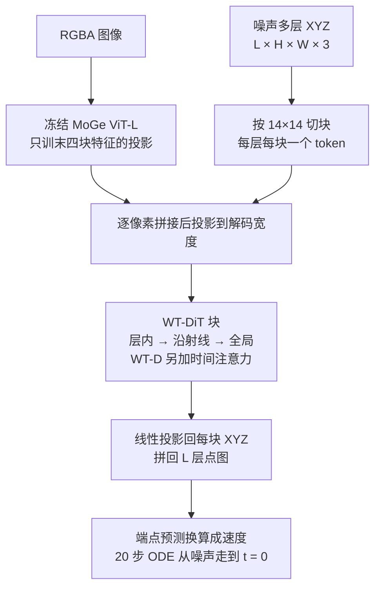

# World Tracing：每个像素一条射线，看得见的表面和挡住的表面叠在一起

<!-- release-date: 2026-05-29 -->

> 本文依据 World Labs 的技术报告 **World Tracing: Generative Pixel-Aligned Geometry Beyond the Visible**，arXiv:2606.13652v1，2026-06-11，共 26 页。页码均指 PDF 自身页码。文中始终区分三件事：**报告写了什么**、**我们如何解释**、**哪些是外部补充或本文推算**。

## 读前先把几个词说成人话

- **深度图（depth map）**：和原图同尺寸，每个像素存「这个方向上最近的表面离相机多远」。它只描述最近那一层，柜子后面的墙在深度图里不存在。
- **点图（pointmap）**：每个像素直接存一个相机坐标系下的 3D 点 $(X,Y,Z)$，而不是只存深度再另配相机内参。本报告的输出是多层点图（PDF p. 2、p. 4）。
- **相机坐标系与规范坐标系（canonical frame）**：前者以拍这张图的相机为原点，点和像素天然对应；后者是物体自己的「盒子」，物体摆到原点、缩到单位尺度。图生 3D 模型多在后者里生成，代价是「这根椅腿对应照片里哪几个像素」不再成立（PDF p. 2–3）。
- **分层深度图像（Layered Depth Image，LDI）与深度剥离（depth peeling）**：一条射线上不只记最近的表面，而记从前往后的若干次命中；深度剥离是造这种真值的渲染方法，同一相机反复渲染，每遍忽略已记下的更近表面（PDF p. 3、p. 22）。
- **流匹配（flow matching）与 DiT**：从噪声沿直线走到数据的生成模型，去噪网络是 Transformer 时叫 DiT。本报告直接在像素网格上的 XYZ 坐标上做流匹配，不经过学习到的 VAE 潜空间（PDF p. 4）。
- **MoGe**：一个单目点图估计器。本报告冻结它的 ViT-L 编码器（基于 DINOv2）提供图像特征（PDF p. 3、p. 5）。
- **Chamfer 距离（CD）与 F-score**：两组点云「彼此找最近邻」的平均距离，以及在某个距离阈值内命中的比例，用来衡量完整几何（PDF p. 22）。
- **SSI 对齐（scale–shift invariant）**：评深度时允许每个样本整体乘一个系数、加一个常数再算误差，避免尺度约定不同把方法比死（PDF p. 7–8）。

## 一句话先说清

给一张照片要 3D，现有两条路各缺一半（PDF p. 2）：

- **深度 / 点图估计**钉在输入像素上，很忠实，但停在第一层可见表面，背后什么都没有；
- **图生 3D**能给出完整形状，却在规范坐标系里生成，常常对不回输入图。

报告把下游真正要的东西叫 **忠实生成（faithful generation）**：可见表面重建得准，不可见表面生成得合理，而且都写在相机坐标系里（PDF p. 2）。

World Tracing（WT）的回答是换表示：**每个输入像素沿视线预测一叠有序的相机系 3D 点，第 0 层是看见的表面，后面几层是从前往后与被挡表面的交点**（PDF p. 1–2）。可见重建和遮挡补全不再是两个输出，而是同一张像素网格张量上前后相邻的层。

实现它的网络叫 WT-DiT：约 17 亿参数（其中约 14 亿可训练），在 $504\times 504$、6 层上训练，64 张 H100，推理 20 步（PDF p. 8）。同一套表示覆盖静态物体（WT-O）、静态场景（WT-S）和动态物体（WT-D）三个变体（PDF p. 5–6）。

> 对齐是像素网格自带的，完整是后面几层补的。

### 一条阅读路线

1. **p. 2 引言、p. 4 式（1）–（2）**：矛盾在哪，表示长什么样，空层怎么填。
2. **p. 3 Figure 2、p. 5 §3.2**：WT-DiT 的三路注意力。
3. **p. 6 §3.3、p. 21 Figure 6**：噪声日程。
4. **p. 7 Table 1、p. 8 Table 2、p. 10 Table 3–4**：物体、场景、动态和日程消融。
5. **p. 10 §4.3、p. 23 Table 5**：为什么用填充而不是掩膜。
6. **p. 24–25 Table 6**：再混入真实 RGBD 之后可见深度的变化。

## 主要矛盾：忠实和完整被表示拆开了

深度估计这一支从单目深度一路发展到能恢复尺度和内参的点图预测器、再到多视图重建器，但报告指出它们共享一个结构限制：**每个像素只有一个 3D 点**，第一个可见表面背后的几何根本不存在（PDF p. 3）。

图生 3D 这一支（前馈生成器、先生成多视图再重建、SDS 优化）给出完整几何，但通常在规范坐标系里，丢了与输入的像素对齐（PDF p. 3）。在报告的定性对比里，这会表现为前后腿关系翻转、多出一块并不存在的平面（PDF p. 24）。下游要插入物体、编辑场景、按相机轨迹渲视频时，还得事后再估一遍对齐。

报告还指出这个表示选择影响数据规模：像素对齐的表示可以直接吃深度图这类「和图像同网格」的监督；而多数图生 3D 基础模型主要从艺术家制作或扫描的 3D 资产学习，难以扩大和多样化，其图像骨干又常是「全局潜变量编码器 + 另一个 3D 生成器」，细粒度的像素证据在这一步就丢了（PDF p. 2）。

所以矛盾是：

> 能不能有一种表示，天生对齐输入像素，又能表达看不见的几何？

## 核心设计一：每个像素一叠点

### 新设计：相机系多层点图

给一张 RGBA 图 $I\in\mathbb{R}^{H\times W\times 4}$（RGB 加一张二值有效性掩膜），WT 预测（PDF p. 4，式（1））：

$$
\mathbf{X}\in\mathbb{R}^{L\times H\times W\times 3},\qquad \mathbf{X}[\ell,\mathbf{u}]=\mathbf{x}_{\ell}(\mathbf{u})
$$

$\mathbf{x}_{\ell}(\mathbf{u})$ 是穿过像素 $\mathbf{u}$ 的射线上从前往后第 $\ell$ 次与表面的交点，写在相机坐标系里。正文默认 $L=6$（PDF p. 5）。alpha 通道对物体模型是抠出前景，对场景模型是盖掉天空这类无穷远像素（PDF p. 4）。

相机内参不是输入。下游需要针孔相机时，用第 0 层点和像素坐标做最小二乘，闭式拟合 $(f_x,f_y,c_x,c_y)$，做法沿用 MoGe（PDF p. 2、p. 20）。

### 工作机制

报告的说法是：这把忠实 3D 生成变成了一个「带层号的多图生成问题」。第 0 层被观察像素死死约束，越往后的层越依赖条件生成（PDF p. 4）。所有层都在输入像素网格上，所以像素到 3D 的对应和相机位姿是表示自带的，不是事后对齐出来的。

物体和场景的坐标范围差几个数量级，所以训练在可逆归一化后的坐标上进行：物体和动态用数据集级、分通道的 z-score；场景先除以样本的中位深度 $m$，再对深度取 $\ln(z/m)$，对 $x,y$ 取带符号的 $\ln(1+|\cdot|/m)$（PDF p. 19，式（5）–（6））。同一个网络预测归一化后的张量，只换坐标变换。

### 代价与边界

$L$ 是固定的。附录统计了物体渲染图里每层的有效像素占比（按整张 $504\times 504$ 图算，含背景）：

| 层 | 平均占比 | 中位数 | 有效视图数 |
|---|---:|---:|---:|
| L0 | 8.14% | 6.21% | 964,508 |
| L1 | 7.90% | 6.01% | 963,163 |
| L2 | 2.53% | 1.46% | 910,810 |
| L3 | 1.74% | 0.86% | 835,007 |
| L4 | 0.72% | 0.21% | 696,663 |
| L5 | 0.60% | 0.15% | 516,342 |

（PDF p. 23，Table 5。）

前两层之后有效面积迅速下降。报告据此把 6 层称为实用的甜点：再加层能照顾树叶、笼子、格栅这类反复穿孔的形状，但显存上涨，而且本就稀疏的尾部更难监督（PDF p. 26）。

附录还比较过另一种输出：预测「深度 + 内参」而不是 XYZ。前者更紧凑，但焦距或主点的小误差会让整个形状一起变形；直接预测 XYZ 把标定误差吸收进点图本身，在裁切、掩膜和相机元数据都不确定的真实图上得到更合理的整体形状（PDF p. 26）。这一段是文字结论，没有配表。

### 可迁移启发

下游要「对着这张图做事」时，输出坐标系应该跟输入相机走，而不是跟训练资产的盒子走。把像素网格当原生坐标，比事后配准便宜，也更不容易悄悄翻面。

## 核心设计二：空层往前填，不再训一张掩膜

### 旧问题：稀疏的深层让掩膜头崩掉

很多射线打不满 $L$ 次。直接的多层做法要同时回归坐标、再给每层预测一张「这里有没有交点」的二值掩膜（PDF p. 4）。报告在 §4.3 给了两条诊断（PDF p. 10）：

- **两个任务的梯度在打架。** 早期联合训练深度加掩膜时，两者梯度的 EMA 余弦相似度接近 0 或为负，例如 500 步时是 $-0.19$，在靠前的解码块里最明显。
- **类别极不平衡。** 有效面积从 L0 的 8.14% 掉到 L5 的 0.60%，超过 13 倍，于是「全部无效」成了省事的答案，掩膜头把深层表面压没了。

### 新设计：目标向前填，背景输入填噪声

如果 $(\ell,\mathbf{u})$ 没有交点，就用更前面最近的有效层填上（PDF p. 4，式（2））：

$$
\mathbf{x}_{\ell}(\mathbf{u})\leftarrow\mathbf{x}_{\ell'}(\mathbf{u}),\qquad \ell'=\max\{k<\ell:\ \mathbf{x}_{k}(\mathbf{u})\ \text{有效}\}
$$

填进去的是重复点，不是新几何，恢复出的形状不变；网络预测「深层塌回前一层」就等于在说「这条射线已经结束了」（PDF p. 4）。

输入侧另有一条：第 0 层剪影以外的像素（物体背景、场景天空）不计入损失，并且训练和推理时都把这些位置的噪声几何换成新的高斯噪声再送进网络（PDF p. 19，式（7））。两条合起来，有效射线的每一层都有目标，无效像素只携带无信息的噪声（PDF p. 19）。

### 工作机制

训练目标因此变成单一的 XYZ 回归式去噪，没有每层掩膜头、剪影头或可见性分类头（PDF p. 5）。另加一项软的相邻层单调罚：只有当前一层的归一化深度大于后一层时才产生惩罚，系数 $\lambda_{\mathrm{mono}}=0.1$；两套归一化对深度都单调，所以这项不会把层序弄反。报告说它稳定了早期训练，对最终几何质量没有可测影响（PDF p. 19，式（8））。

### 收益、代价与边界

报告的诊断显示：原本就有效的深层像素，误差只比继承来的填充像素略高，两者在同一量级，说明填充是有效的稠密监督（PDF p. 10）。LaRI 那种深度加每层掩膜的做法，在他们的定性对比里掩膜常在前几层之后崩掉，实际只剩浅层几何（PDF p. 23）。

代价：推理时怎样从重复点里区分「真交点」和「填充点」，报告没有写；固定 6 层也意味着大量重复点仍占计算。§4.3 的诊断只给了一个数字（$-0.19$），没有配一张「填充 vs 掩膜」的最终精度对照表。

### 可迁移启发

稀疏标签上不要急着再开一个分类头。先问能不能把「没有事件」写成「和上一个事件相同」，让回归在稠密张量上进行。类别失衡的掩膜头，崩起来比坐标头更快。

## 核心设计三：WT-DiT 把层、射线、全局拆开做注意力

### 先看全景

这张图按 PDF p. 3 Figure 2 与 p. 5、p. 20 的文字重画，是结构示意，不是实测。

图像证据来自冻结的 MoGe ViT-L：聚合它最后四块的特征、投影到解码宽度，只训练这层投影，所以 WT-DiT 继承的是 MoGe 在野外图像上学到的视觉先验，而不是只从渲染几何里学（PDF p. 5、p. 20）。噪声 XYZ 在同一套像素网格上切块，每层每块一个几何 token；在每个 $(\ell,\mathbf{u})$ 上，几何与该像素的图像特征按通道拼接再投影，中间没有单独的交叉注意力通路（PDF p. 5、p. 20）。

### 新设计：三路分解注意力

$L\times P$ 个 token 上做全注意力既贵又没有结构，解码器于是在三种形状之间循环（PDF p. 5）：

| 注意力 | 张量形状 | 负责什么 |
|---|---|---|
| 层内 | $(B\cdot L,\ P,\ D)$ | 每层当一张 2D 图，带 $(y,x)$ 上的 2D RoPE |
| 沿射线 | $(B\cdot P,\ L,\ D)$ | 同一像素上从前往后的各层互相看，管层序和射线上的一致性 |
| 全局 | $(B,\ L\cdot P,\ D)$ | 恢复物体级或场景级上下文，代价最高 |

层号用 FiLM 注入：层嵌入经 MLP 变成逐通道的 $(\gamma_\ell,\beta_\ell)$，做 $h\leftarrow\gamma_\ell\odot h+\beta_\ell$，足以打破层的置换对称，不需要可学习的加性位置 token；扩散时间 $t$ 用标准 AdaLN，整叠共享（PDF p. 5）。

动态模型 WT-D 不改静态解码器，只在每个全局注意力块后插一块时间注意力：16 帧的片段，沿时间轴带 1D RoPE，残差上 LayerScale 初值 $\gamma=10^{-5}$，使得从单帧 WT-O 热启动时，$T=1$ 的输入逐位复现静态行为，再在微调中慢慢接上时间耦合（PDF p. 20）。

骨架规格：物体骨干 48 个 pre-norm DiT 块，宽度 $D=1536$，24 个注意力头；总参数约 17 亿，冻结 MoGe 后约 14 亿可训练（PDF p. 20）。

### 工作机制

层内注意力管「这一层像不像一张几何图」，全局注意力补整体关系。关键是沿射线那一路：报告对比 VGGT 在多视图输入上交替「帧内 / 全局」的做法，认为正是这条显式的射线轴让一个骨干能从单张图产出前后自洽的多层几何，也是深层不会从可见表面上漂走的关键原因（PDF p. 5）。

### 代价与边界

报告没有给「去掉沿射线注意力」的消融，上面那句是设计理由，不是实验结论。三路里全局注意力最贵，FLOPs 分解和推理耗时 PDF 都没有给。附录的小规模消融只覆盖两处细节：LayerScale 初值 $10^{-4}$ 在 1 万步时把总损失从 0.009258 降到 0.007018、XYZ 损失从 0.007242 降到 0.003537；单独加 RoPE 在小设置里是中性的，完整模型保留它是为了跨分辨率和裁切外推（PDF p. 26）。

### 可迁移启发

多轴数据先按数据自带的轴分解注意力：这里是层（图）、射线（深度顺序）、全局（物体）。哪条轴对应「不能漂」的物理约束，哪条就应该显式存在，而不是指望全连接自己学出来。冻结一个已经会看图的 2D 几何编码器，比在渲染资产上重学「图长什么样」便宜。

## 核心设计四：在 XYZ 上做流匹配，噪声日程按层分家

### 旧问题：可见层和遮挡层不是同一种不确定

第 0 层被输入图像强约束，更像重建；深层只被间接约束，更像条件生成。只用一种扩散时间分布，总会亏待其中一边（PDF p. 6）。报告把自己放在一条演进线上：MoGe 回归单层，PPD 把单层几何写成均匀时间步的扩散，WT 把它扩到多层流匹配（PDF p. 10）。

### 新设计：端点参数化

干净端点 $x_0=\tilde{\mathbf{X}}$，噪声 $x_1\sim\mathcal{N}(0,I)$，$x_t=(1-t)x_0+t\,x_1$。网络直接预测干净端点，损失是（PDF p. 5，式（3））：

$$
\mathcal{L}_{\mathrm{FM}}=\mathbb{E}_{x_0,x_1,t}\Bigl[\bigl\|A\odot\bigl(F_{\theta}(x_t^{\mathrm{net}},t,f_I)-x_0\bigr)\bigr\|_{2}^{2}\Bigr]
$$

$A$ 是 alpha 有效性掩膜，广播到所有层和 XYZ 通道；$x_t^{\mathrm{net}}$ 是把无效像素换成噪声后的网络输入；$f_I$ 是投影后的 MoGe 特征。推理时由端点预测得到速度 $v_{\theta}=(x_t-F_{\theta})/t$，从最大噪声积分到 $t=0$，共 20 步（PDF p. 5）。完整损失是 $\mathcal{L}_{\mathrm{FM}}+0.1\,\mathcal{L}_{\mathrm{mono}}$（PDF p. 19）。

### 新设计：两阶段噪声课程

课程分两段（PDF p. 6、p. 21）：

1. **训练早期**，各层独立采样时间：第 0 层用平台化 logit-normal，深层用标准 logit-normal。平台化变体引自 FLUX.2 的表示对比博客。
2. **各层稳住之后**，整叠改用一个共享时间步，取自两者的等权混合，使层间耦合与推理时一致。

图上有一处原文自相矛盾。附录文字说平台化变体「把中央平台展宽，给小 $t$ 更多概率」，以利于更像重建的第 0 层；但 Figure 6 画出的平台在 $t\ge 0.5$ 一侧，小 $t$ 处的密度反而低于标准 logit-normal（PDF p. 21）。按本文复原的曲线积分，$t<0.3$ 的概率从 0.198 降到 0.153。按式（3）前的插值定义，$t=0$ 是干净端点，所以两种读法对第 0 层的含义正好相反。报告没有说明哪一边是准的。

Table 4 的消融（CD-L2，越低越好，PDF p. 10）：

| 日程 | L0 | L1–L5 | 全部 |
|---|---:|---:|---:|
| 平台化 logit-normal | 0.021 | 0.033 | 0.031 |
| 标准 logit-normal | 0.023 | 0.028 | 0.027 |
| 混合 | 0.020 | 0.025 | 0.024 |

平台化帮了第 0 层、伤了深层；混合在三列都最好（PDF p. 10）。这张表没有写评测集和训练步数，只能当日程之间的相对比较。

### 代价与边界

20 步迭代采样是代价，报告把实时应用列为需要蒸馏或减步的未来工作（PDF p. 26）。采样器名称、是否使用无分类器引导（CFG）及其系数，PDF 都没有写。

### 可迁移启发

同一张输出里有「几乎被输入决定的通道」和「必须靠想象的通道」时，不要共用一个时间分布。先按不确定类型分开练，等结构稳住再合成一个共享日程，避免推理时各层时间不一致。另一条独立的选择是直接在物理量上做生成而不先学潜空间：报告站在前者，引用的是「让去噪模型直接去噪」这条线（PDF p. 4）。

## 核心设计五：同一套网络同时吃多层 3D 和单层 RGBD

### 新设计：沿层轴开关损失

单目深度模型只能吃单层监督，LaRI 只在合成的多层渲染上训过、从没见过真实 RGBD（PDF p. 7）。WT 用一个样本标记 $b_{\mathrm{single}}\in\{0,1\}$ 把损失掩膜沿层关掉（PDF p. 7，式（4））：

$$
A^{(\ell)}\leftarrow A^{(\ell)}\bigl(1-b_{\mathrm{single}}\,\mathbb{1}[\ell\geq 1]\bigr)
$$

单层样本只监督 L0，L1–L5 仍只由多层 3D 资产塑造；不加参数、不加头、不加「数据来源」嵌入（PDF p. 22）。

实际混合比例：每个 mini-batch 以 0.6 的概率抽 3D 资产语料、0.4 的概率抽 RGBD 风格语料；RGBD 内部按 $\sqrt{N_{\mathrm{rows}}}$ 加权，六个真实照片集再乘 1.5。RGBD 帧同样按 $504\times 504$ 读入，用原内参反投影成 XYZ，走场景的对数中位数归一化，再广播到 6 层（PDF p. 22）。12 个数据集分两族：真实的 ScanNet v2（约 250 万帧、1513 个室内扫描）、MegaDepth（约 15 万张）、BlendedMVS（约 1.7 万帧）、ArkitScenes（约 5000 个房间）、Argoverse2（1000 个驾驶场景）、Waymo Open（约 1150 段）；合成的 Hypersim（约 7.7 万）、Taskonomy（约 460 万帧、约 500 栋楼）以及另外三个较小的集合（PDF p. 22）。

### 实验怎么证明

这是附录里的加项。正文 Table 1–4 全部使用只训 3D 资产的检查点，只有 Table 6 单列混训的 WT-S（PDF p. 8、p. 25）。混训是在 3D 资产检查点上继续 5 万步，验证损失还在下降，作者把结果称为下界（PDF p. 25）。

| 方法 | NYU AbsRel | NYU δ<1.25 | ETH3D 室内 AbsRel | ETH3D 室外 AbsRel |
|---|---:|---:|---:|---:|
| Depth Anything 3 | 0.0458 | 0.9676 | 0.0575 | 0.0652 |
| LaRI-scene | 0.0480 | 0.9708 | 0.0523 | 0.0618 |
| VGGT | 0.0415 | 0.9731 | 0.0417 | 0.0562 |
| MoGe-2 | 0.0388 | 0.9758 | 0.0378 | 0.0501 |
| Pi3X | 0.0341 | 0.9827 | 0.0378 | 0.0434 |
| WT-S（只训 3D 资产） | 0.0398 | 0.9735 | 0.0398 | 0.0533 |
| WT-S（+ RGBD，20 步） | 0.0382 | 0.9750 | 0.0345 | 0.0495 |
| WT-S（+ RGBD，50 步） | 0.0374 | 0.9871 | 0.0332 | 0.0451 |

（PDF p. 25，Table 6，节选；NYU 1449 帧室内，ETH3D 室内 222 帧、室外 232 帧；所有方法同一套 SSI 对齐、评测分辨率 504；WT-S 为 8 个种子里按 AbsRel 选最好的一个。）

读这张表：

- 混训在 20 步下让 AbsRel 在 NYU、ETH3D 室内、室外分别降低 4.0%、13.3%、7.1%；改用 50 步推理后扩大到 6.0%、16.6%、15.4%（PDF p. 24–25）。
- 50 步混训版在 ETH3D 室内是全表最好；在 NYU 与 ETH3D 室外的 AbsRel 仍是第二，排在 Pi3X 之后；NYU 的 δ<1.25 是全表最好的 0.9871（PDF p. 25）。
- WT-S 用了 best-of-8 的种子选择，确定性的单层基线没有，这对 WT-S 有利。
- 表里「+ RGBD，20 步」一行在 ETH3D 室外的 RMSE 与 δ<1.25（0.2104、0.9537）和「只训 3D 资产」一行逐位相同，而同一行的 AbsRel 已经变了；这很可能是排版时复制出错，报告没有说明。

作者自己划的位置是：目标不是在可见表面上超过专用单层深度模型，而是额外给出这些基线都没有的遮挡层，同时在可见表面上保持竞争力（PDF p. 25）。只训 3D 资产的 WT-S 语料几乎全部来自 3D-FRONT 和一份内部场景集（大致各半），室外天然偏少，渲染帧数比 MoGe-2、Pi3X 等所用的真实 RGB-D 语料「小几个数量级」；室外残差集中在一个 playground 场景上（PDF p. 24）。这是作者的定性比较，没有给出各基线的具体帧数。

### 可迁移启发

想同时用「完整但合成」和「真实但残缺」的监督，先让表示容得下残缺：缺的层用掩膜从损失里拿掉，而不是改网络。数据来源的开关放在数据侧，比放在结构侧更容易加新语料。

## 数据与训练 recipe

**多层真值从深度剥离来。** 公开深度集和网格生成数据集都不带「一条射线上第 3 次命中」。报告对整理过的 3D 资产做深度剥离，保留每条射线的前 $L$ 个交点，用渲染内参反投影成相机系 XYZ；不足 $L$ 次的按式（2）填充（PDF p. 6、p. 22）。

三份语料（PDF p. 7、p. 21）：

- **物体**：约 30 万个独立资产、约 1700 万张渲染视图，来自 Objaverse-XL、Objaverse、3D-FUTURE、Toys4k、GSO，以及 Truebones 的绑定角色（按静态视图渲染）。
- **场景**：公开的 3D-FRONT 室内房间，加一份内部整理的场景集；内部集在评测里只当泛化探针。
- **动态**：约 1.68 万个动画资产切成短片段，来自 Objaverse-XL 动画子集和 Truebones 绑定角色；同来源的留出部分构成 Obj.-Val 与 Truebone 两个评测集。

光照、视点、内参都随机。在线增强包括几何（裁切、缩放、水平翻转、平面内旋转、小仿射）、光度（亮度、对比度、饱和度、色相、伽马、曝光、白平衡、模糊、压缩、传感器噪声）和掩膜（膨胀、腐蚀、边界扰动、丢细结构、补洞）；动态片段的几何与掩膜增强跨帧共享（PDF p. 23）。被掩膜扰动影响的像素继承填充后的几何目标，以降低的权重监督，不另加剪影损失；报告说这正是同一检查点能稳定接在依赖外部掩膜的下游流水线上的原因（PDF p. 20）。

**优化。** 物体模型先在 $196\times 196$ 上训 10 万步学表示，再在 $504\times 504$ 上训 10 万步；动态模型从静态物体检查点出发、加上时间块，在片段上再微调 5 万步（PDF p. 20）。AdamW，学习率 $10^{-4}$ 余弦衰减到 $10^{-5}$，2000 步预热，权重衰减 0.01，betas $(0.9,0.999)$；64 张 H100，每卡 batch 2、梯度累积 4，有效 batch 512；梯度裁剪到范数 1.0；预热后 EMA 衰减 0.9995；损失偶尔超过运行 EMA 的 4 倍时跳过该步，以免污染 Adam 统计量（PDF p. 20）。

**三个变体。** 共享表示、流匹配损失、深度填充、冻结编码器与结构化注意力，只在坐标归一化、输入分辨率和时间块上不同（PDF p. 6）。附录写明物体与动态模型都在 $504\times 504$ 上训练（PDF p. 20）；场景模型的分辨率与参数量正文没有单独给出，只在混训段落提到 RGBD 帧按与渲染语料相同的 $504\times 504$ 读入（PDF p. 22）。

## 实验：三类基准上的几何忠实度

评测刻意偏向几何一致性而不是视觉好看（PDF p. 8、p. 22）。生成类方法（含 TRELLIS 系基线与杂交方法）每个输入抽 8 个种子，报几何最好的那个（PDF p. 8）。

### 物体

可见表面深度，所有方法同一套逐样本 SSI 对齐（PDF p. 7，Table 1 左）：

| 方法 | MAE | RMSE | AbsRel | δ<1.25 |
|---|---:|---:|---:|---:|
| Depth Anything 3 | 0.0703 | 0.0920 | 0.0384 | 0.9973 |
| LaRI | 0.0366 | 0.0506 | 0.0198 | 0.9992 |
| Pi3X | 0.0317 | 0.0440 | 0.0172 | 0.9994 |
| MoGe-2 | 0.0261 | 0.0368 | 0.0141 | 0.9995 |
| VGGT | 0.0257 | 0.0370 | 0.0138 | 0.9995 |
| WT-O | 0.0149 | 0.0243 | 0.0079 | 0.9996 |

完整几何，100 个留出物体（PDF p. 7，Table 1 右）：

| 方法 | CD-L1 | CD-L2 | F@0.01 | F@0.05 | 输出 |
|---|---:|---:|---:|---:|---|
| TRELLIS.2 | 0.0566 | 0.00717 | 0.204 | 0.598 | 网格 |
| SAM 3D | 0.0475 | 0.00501 | 0.203 | 0.675 | 3DGS |
| LaS-Comp | 0.0477 | 0.00739 | 0.225 | 0.677 | 网格 |
| ReconViaGen | 0.0478 | 0.00528 | 0.228 | 0.677 | 网格 |
| WT-O*（接 TRELLIS.2 第二阶段） | 0.0326 | 0.00530 | 0.321 | 0.808 | 网格 |
| WT-O | 0.0213 | 0.00194 | 0.549 | 0.898 | 点云 |

读这两张表：

- 左表 WT-O 虽然预测 6 层，第 0 层的 MAE、RMSE、AbsRel 仍是最好，报告据此说生成遮挡几何没有牺牲可见表面（PDF p. 8）。δ<1.25 各家都在 0.997 以上，已经饱和。
- 右表 WT-O 输出的是点云，和网格、3DGS 不是同一载体。更公平的网格对照是 WT-O*：把 WT-O 当 TRELLIS.2 的第一阶段先验，F@0.01 从 0.204 升到 0.321。SAM 3D 的 CD-L2（0.00501）仍略好于 WT-O* 的 0.00530。
- 贡献列表里说「多层生成……同时提升了可见表面精度」（PDF p. 3），但表里比较的是不同方法；报告没有做「同一网络只预测一层」的对照，这句话没有被受控实验单独证明。

Figure 4 上半的输入刻意取自训练分布外（DAVIS 视频帧和生成图）。报告把优势归到两点：扩散比 LaRI 的回归头更能表达背面的多峰不确定性，也避开了深层掩膜崩塌；冻结 MoGe 带来的 2D 先验，比只在资产上训练的规范系生成器更能泛化到真实图，后者会翻转姿态或编出假平面（PDF p. 9、p. 23–24）。附录还提到一个层数更少、数据量与 LaRI 相当的小规模控制实验，趋势相同，说明增益不全来自数据放大（PDF p. 24）；这个实验没有配表。

### 场景

（引自 PDF p. 12，Figure 5，截取前四行；原图共九行，后七行都是分布外生成的室内房间，20 步采样。）

可复现的主基准是留出的 3D-FRONT（50 个样本）（PDF p. 8，Table 2）：

| 方法 | MAE | AbsRel | L0 CD-L1 | L0 F@0.05 | 全层 CD-L1 | 全层 F@0.05 |
|---|---:|---:|---:|---:|---:|---:|
| VGGT | 0.0393 | 0.0441 | 0.0345 | 0.7839 | – | – |
| Depth Anything 3 | 0.0369 | 0.0403 | 0.0330 | 0.7992 | – | – |
| LaRI-scene | 0.0319 | 0.0359 | 0.0268 | 0.8576 | 0.0575 | 0.6671 |
| MoGe-2 | 0.0248 | 0.0269 | 0.0213 | 0.9131 | – | – |
| Pi3X | 0.0234 | 0.0260 | 0.0192 | 0.9206 | – | – |
| WT-S*（只训 3D-FRONT） | 0.0106 | 0.0118 | 0.0097 | 0.9845 | 0.0224 | 0.8890 |
| WT-S | 0.0102 | 0.0114 | 0.0093 | 0.9867 | 0.0216 | 0.8951 |

全层指标只对多层方法有定义。WT-S* 几乎追平 WT-S，用来隔离内部场景语料的贡献（PDF p. 9）。

另一个 200 样本的内部测试集只当泛化探针：WT-S 的 MAE 0.0328、AbsRel 0.0470、L0 F@0.05 0.8720、全层 F@0.05 0.6500，仍是表上最好，但领先幅度明显小于 3D-FRONT；LaRI-scene 的全层 F@0.05 是 0.5565（PDF p. 8）。内部集不可对外复现。

Figure 4 下半与附录 E.2 的定性观察：在训练分布外的生成图上，MoGe-2 有时把本该平直的立面和墙掰弯，WT-S 保持得更直（PDF p. 9、p. 24）。这是定性观察，没有量化指标。

### 动态

全局 CD-L2，越低越好（PDF p. 10，Table 3）：

| 基准 | GVFDiffusion | SS4D | ActionMesh | WT-D |
|---|---:|---:|---:|---:|
| ActionBench | 0.0879 | 0.0882 | 0.0243 | 0.0291 |
| Truebone | 0.0166 | 0.0145 | 0.0120 | 0.0063 |
| Obj.-Val | 0.0248 | 0.0249 | 0.0142 | 0.0034 |
| 平均 | 0.0385 | 0.0381 | 0.0162 | 0.0105 |

WT-D 赢 Obj.-Val、Truebone 和平均；ActionMesh 赢 ActionBench，报告的解释是那里的真值是跟踪得到的动画表面，与 ActionMesh 的原生输出格式一致（PDF p. 10）。Obj.-Val 与 Truebone 都是 WT-D 训练数据同来源的留出集（PDF p. 21），ActionBench 不在其列，WT-D 恰好在这一项上输了。

### 这些数字没有证明什么

- 没有人评、没有外观或纹理指标，好看不在本榜范围内。
- 物体基准 100 个资产，场景主基准 50 个样本，都没有给区间估计。
- 附录 C 说下游流水线会分别测重投影对齐、几何一致性和配准质量（PDF p. 22），但正文明确说场景编辑与新视角视频只做定性展示（PDF p. 8），PDF 里也找不到这些下游数字。

## 下游：对齐像素之后，三件事免训练接上

三条下游复用同一个预测（相机系多层点叠加可恢复的内参），只加轻量、免训练的组合逻辑（PDF p. 10）。Figure 3 用「输入 → 点云 → 带纹理网格 → 渲染视频」把这条接口画了出来（PDF p. 6）。

- **文本驱动的 3D 场景编辑。** 先让 2D 编辑器增删替换图像内容，再用 WT-S 预测原场景、WT-O 预测新物体或改动区域；两者已在同一相机坐标系里、共享像素与点的对应，插入是闭式的，不需要逐次优化或渲染闭环（PDF p. 11）。报告的原话要点是：规范系物体生成器能给出像样的资产，但不知道它该放在输入相机的哪里。
- **几何引导的新视角视频。** 单层可见表面一旦相机移动，新露出的区域只能凭空编；WT 在生成前就提供完整的几何记忆，沿目标轨迹把点云栅格化，得到稠密的多视角深度引导，冻结的视频模型只需填充一个几何一致的信号（PDF p. 11）。PDF 只泛称「图生视频世界模型」，引用了 VACE 等工作，没有写具体配的是哪个视频模型。
- **位姿对齐的 TRELLIS 杂交。** TRELLIS 系的稀疏结构在规范系里生成，没有输入相机位姿；WT 把自己的点叠体素化，替掉 TRELLIS 的第一阶段稀疏结构，保留后面的网格与纹理解码器，不重训 TRELLIS（PDF p. 11）。Table 1 的 WT-O* 就是这条线的定量结果。

## 限制与未公开

附录 F.5 自己列出的边界（PDF p. 26）：

- 层数固定，高度穿孔的几何可能需要超过 6 个表面；
- 渲染监督带来合成到真实的差距，无纹理和反光区域仍有伪影；
- 迭代流采样，要实时就得蒸馏或减步；
- 动态模型只处理短片段，没有长程记忆和跨长视频的身份保持，也没有显式的跨帧点对应或 3D 轨迹；
- 场景只是单帧抬升，还没有把多帧融合成更大的相机对齐世界；
- 物体与场景仍是两个分开的专家。附录观察到没训过场景的物体模型在场景图上也能给出合理几何，一张图里的多个物体也能共存，因为预测的是每条射线一叠点而不是每个裁切一个规范资产（PDF p. 26）；作者把「训一个统一的物体–场景–动态模型」列为最主要的下一步。

报告没有写、本文也不补的：是否使用 CFG 及系数、ODE 求解器名称、场景模型的分辨率与参数量、训练墙钟与 GPU 小时、推理耗时、推理时如何从填充点中切出真实深层。

## 可迁移启发

1. **表示先决定下游能不能免训练。** 像素对应一旦丢掉，编辑、插入、按轨迹条件视频每一件都要再估对齐；WT 的三条下游不需要新的 3D 训练，是因为表示没有把对应扔掉。
2. **稀疏事件优先改成稠密重复，而不是再开分类头。** 目标向前填充与背景输入填噪声是一对：有效射线永远有目标，无效像素永远不贡献损失。
3. **不确定类型不同，噪声日程就应不同。** 可见层偏重建、遮挡层偏生成，Table 4 里混合日程两头都更好；但照搬之前要先确认「平台」到底放在哪一侧。
4. **监督来源用掩膜开关，不用结构开关。** 式（4）让多层资产和单层 RGBD 进同一个模型，不改架构。
5. **依赖规模的部分要分清。** 冻结 MoGe ViT-L、48 块宽 1536 的 DiT、约 30 万物体和 1700 万视图、64 张 H100 是规模条件；多层点图这个表示本身不依赖它们——深度剥离是确定性渲染，填充是几行索引操作。

与本站同方向篇目对照时不要串数字：TRELLIS、TRELLIS.2 等解决的是「完整资产长什么样、贴图对不对」，输出多在规范盒子里；World Tracing 卡在接口层，先给出和像素对齐、又超出可见范围的几何，再让那些生成器当解码器。

## 关键词回看

- **忠实生成**：可见表面要准，不可见表面要合理，而且都在相机坐标系里。
- **多层点图**：每个像素一叠 $(X,Y,Z)$，第 0 层可见，后面是从前往后的遮挡交点。
- **深度填充**：没有交点的深层复制更前的有效点；形状不变，监督变稠。
- **无效像素噪声填充**：剪影外的几何输入换成新噪声，损失忽略它们。
- **三路注意力**：层内、沿射线、全局；动态再加时间注意力。
- **层 FiLM**：用逐层缩放平移打破层的置换对称。
- **混合噪声日程**：第 0 层平台化、深层标准 logit-normal，稳住后整叠共用等权混合。
- **$b_{\mathrm{single}}$ 开关**：单层 RGBD 只监督 L0，深层仍只看多层资产。
- **WT-O / WT-S / WT-D / WT-O***：物体、场景、动态三个变体，以及接 TRELLIS.2 第二阶段的网格版。

## 资料与阅读边界

**原件与署名。** arXiv:2606.13652 目前只有 v1（2026-06-11），arXiv 备注为 World Labs Technical Report。第一作者 Hao Zhang 同时署 World Labs 与伊利诺伊大学厄巴纳-香槟分校（UIUC），Narendra Ahuja 署 UIUC，其余作者署 World Labs（PDF p. 1）。

**首发日。** `release-date` 取 2026-05-29：官方代码仓 [haoz19/world-tracing](https://github.com/haoz19/world-tracing) 与 Hugging Face 在线演示 [haoz19/world-tracing-demo](https://huggingface.co/spaces/haoz19/world-tracing-demo) 的第一条提交都是当天的「Initial public release」，早于 arXiv v1；仓库创建时间与门控权重仓的创建时间不能证明更早已对外可用。

**外部补充，不是本报告内容。**

- 项目页：<https://haoz19.github.io/world-tracing-page/>。
- 代码仓 README 后来列出的已发布检查点包括 $840\times 840$ 的场景模型和 $336\times 336$、16 帧的动态模型，规格与 PDF 附录（物体与动态都在 $504\times 504$ 训练）不同；那是论文之后放出的检查点，以 PDF 为准理解本文的实验。权重为门控发布，许可证在 arXiv 上线当天改为 CC BY-NC-ND 4.0。

**原文没有公开、本文也不补的缺口**：CFG 与采样器细节、场景模型规格、训练与推理耗时、从填充点恢复真实深层的规则、下游流水线的定量结果、Table 6 那行疑似重复数字的更正。
