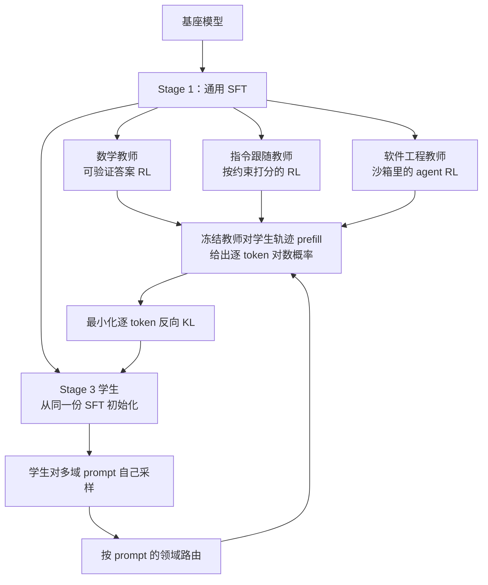

# MOPD：多域能力合不进一个模型，就把生产和整合拆开

<!-- release-date: 2025-12-16 -->

> 本文依据 **MOPD: Multi-Teacher On-Policy Distillation for Capability Integration in LLM Post-Training**，arXiv:2606.30406v1，2026-06-29，共 15 页。作者 Wenhan Ma、Jianyu Wei、Liang Zhao 等 13 人，来自北京大学、小米 LLM Core、香港大学与中国人民大学；通讯作者是北京大学的 Zhifang Sui 与小米的 Fuli Luo，第一作者的工作在小米实习期间完成（PDF p. 1）。页码均指这份 PDF 的页码。文中区分三件事：**论文写了什么**、**我们如何解释或验算它**、**哪些是外部资料补充**。
>
> 这是一篇后训练方法论文，不发布模型。MOPD 这个名字、三阶段流程和逐 token 优势公式，最早随 MiMo-V2-Flash 的开源发布公开；这篇论文补上了那次发布没有的东西：同一起点上与四类整合办法的受控对照、两种损失实现、同源教师为什么必要、多轮师生演化。

## 读前先把几个词说成人话

这篇论文要解决的事一句话就能说清：数学、代码、指令跟随各自用强化学习都能训好，可就是合不进同一个模型。后面所有设计都围着「怎么合」转。

先把会反复出现的词说清楚：

- **强化学习（Reinforcement Learning，RL）后训练**：模型写答案，按答案好坏给奖励，再把得分高的写法推上去。不同领域用不同的奖励：数学看最终答案对不对，软件工程在可执行沙箱里跑测试，指令跟随按约束清单打分（PDF p. 1）。
- **能力整合（capability integration）**：把几个领域各自练出的峰值，收进一个能上线的模型。
- **领域教师 $\pi_{\phi_d}$**：在领域 $d$ 上用 RL 训好、参数冻结的专家模型。学生训练时它不动。
- **学生 $\pi_\theta$**：最终要上线的那一个模型。
- **On-policy（在线策略）与 off-policy（离线策略）**：训练数据是学生**自己当前**写出来的，叫 on-policy；是教师事先写好的范文，叫 off-policy。
- **曝光偏差（exposure bias）**：训练时每一步都接在「正确前缀」后面，推理时前缀是自己写的，一步写偏就走进训练里没见过的状态（PDF p. 2）。
- **反向 KL（reverse KL）**：$D_{\mathrm{KL}}(\pi_\theta\,\|\,\pi_{\phi_d})$，按学生的分布取期望。人话是：学生走到哪里，就在哪里问教师「这一步你会给多大概率」。经典蒸馏常用的前向 KL 则是在教师写过的位置上监督学生（PDF p. 3）。
- **Prefill（预填充）**：把一整段已经写好的文本一次性喂进模型，拿到每个位置的概率。它没有逐 token 生成的串行依赖，比生成便宜得多。
- **同源（same-origin）**：教师和学生都从同一份 SFT checkpoint 长出来。这是全文最重要的适用前提（PDF p. 4、p. 9）。

组相对策略优化（Group Relative Policy Optimization，GRPO）与动态采样（Dynamic Sampling）的机制见 DeepSeek-R1 与 DAPO 两篇；这里只把它们当作领域教师的训练算法（PDF p. 15）。

还有一个同名的要先划清。arXiv:2605.12652 的缩写也是 MOPD，全称 Multi-Rollout On-Policy Distillation，做的是让教师参考同一道题的其他 rollout。那是另一篇论文，和这里无关。

## 一句话先说清

每条领域 RL 流水线单独跑都有效；真正想要的却是一个模型同时拥有所有这些能力，而已有的四类整合办法各自卡在一处（PDF p. 1–2）：

1. **Mix-RL**：把各领域的题混进一个数据集联合训练，训练信号互相干扰，出现跷跷板效应（see-saw effect），合出来的模型低于各领域教师。
2. **Cascade RL**：一个领域接一个领域串行训，先训好的能力在后面的阶段衰退，整段长跑放大稳定性风险。
3. **Off-Policy Finetune**：先训领域教师，再拿教师的 rollout 对学生做 SFT，落回曝光偏差。
4. **Param-Merge**：把教师权重做平均或任务算术（task arithmetic），融合结果不稳，到不了每个教师的峰值。

MOPD 的回答是把后训练拆成两件事：**能力生产**和**能力整合**。先按领域独立做 RL，得到一批冻结的领域教师；再让学生在自己的 rollout 上，按题目所属领域把轨迹交给对应教师，用教师逐 token 的对数概率当密集监督（PDF p. 2、p. 4）。整合发生在策略空间，不在权重空间，也不在一份静态数据集上（PDF p. 2）。

在 Qwen3-30B-A3B 的数学、指令跟随、软件工程三个领域上，MOPD 的归一化分数是 0.937，比第二名 Mix-RL 的 0.882 高 5.5 个点；三个领域都收回了教师相对 SFT 学生那截涨幅的 91%–95%（PDF p. 2、p. 7、p. 11）。同一套配方用在了工业级的 MiMo-V2-Flash 上（PDF p. 8）。

全文最该带走的不是「又一种蒸馏」，而是它的负结果：把数学教师换成更强但不同源的 Qwen3-235B-A22B，学生的数学反而退到 SFT 起点以下，top-$k$ 实现在第 18 步左右直接崩溃（PDF p. 9）。**教师要强，更要和学生长在同一个起点上。**

### 一条阅读路线

只有半小时读原文，建议按这个顺序：

1. **p. 2 的 Table 1**：四类整合办法在三根轴上各缺哪一样。
2. **p. 3–4 的 §3.1 与 Figure 1**：三阶段，以及教师和学生都从同一份 SFT 出发这件事。
3. **p. 5 的式 (1)–(5)**：反向 KL 如何变成 PPO / GRPO 里的一个 advantage，以及 top-$k$ 版本多出的那一项。
4. **p. 7 的 Table 2 与 Figure 2**：主结果和样本效率。
5. **p. 9 的 Table 4 与 Figure 3**：同源教师与外部强教师的对照，全文最硬的一刀。
6. **p. 10 的 Table 5**：多轮演化。附录 A 的超参（p. 15）在读表时当对照尺。

## 主要矛盾：三根轴，四种办法都凑不齐

论文把已有办法放到三根轴上比：监督是不是逐 token 密集的、训练是不是 on-policy、各领域能不能并行生产（PDF p. 2，Table 1）。

| 方法 | 密集监督 | On-policy | 可并行 |
|---|:---:|:---:|:---:|
| Param-Merge | × | — | ✓ |
| Off-Policy Finetune | ✓ | × | ✓ |
| Mix-RL | × | ✓ | × |
| Cascade RL | × | ✓ | × |
| MOPD | ✓ | ✓ | ✓ |

这是论文的定性归类，不是实验结果。

**我们如何解释它。** 三根轴之间有天然的拉扯。要密集监督，最顺手的是 SFT 式蒸馏，于是掉进 off-policy；要 on-policy，最顺手的是继续做 RL，于是要么混 batch、要么串行，领域之间就不能独立；要并行，最顺手的是合权重，于是离开了策略本身。MOPD 的设计目标就是同时咬住这三根轴，而代价会落到第四根论文没画出来的轴上：教师必须和学生同源。

两处细节决定了这张表怎么读。第一，Mix-RL 里每个样本仍然用自己领域的奖励和 advantage，混的是 batch 的组成，不是把奖励函数合成一个（PDF p. 3）。第二，论文把四类办法各配了一个出处：Mix-RL 对应 Qwen3 技术报告，Cascade RL 对应 Nemotron-Cascade，Off-Policy Finetune 对应 DeepSeek-V3.2，Param-Merge 对应 Model Soups 与 Task Arithmetic（PDF p. 1–2）。受控实验里这四类都是作者自己在同一起点上重新实现的，不是搬那几家的结果。

## 先看全景：三个阶段，一条同源的根

这张图根据 PDF p. 3–4 的 §3.1 与 Figure 1 重画，是流程示意，不含实测时间。原图 Stage 2 还画了 Search 与 Safety 作为示例领域；Qwen3-30B-A3B 的受控实验只用了数学、指令跟随、软件工程三个（PDF p. 6），MiMo-V2-Flash 的教师覆盖数学、代码、指令跟随、软件工程、工具使用五个（PDF p. 8）。

图里最该看的是那条同源的根：Stage 2 的每个教师和 Stage 3 的学生都从**同一份** Stage-1 SFT 出发，学生不继承任何一个教师的参数（PDF p. 3–4）。所以这不是「大模型教小模型」，也不是「从最强的那个教师接着训」，而是同一个起点上长出的几根分支，再合回一根。

## 核心设计一：先分头生产，再一次整合

### 旧问题：多域 RL 把几件需要不同信号的事绑在一次训练里

Mix-RL 让所有领域共享一次训练的学习率、batch 和步数，一个领域的梯度会踩到另一个领域。Cascade RL 把领域排成先后，后一阶段从前一阶段的 checkpoint 接着走，先练好的能力要靠运气撑过后面几段（PDF p. 1–2）。两者还有一个组织上的毛病：任何一个领域要调算法、调超参，都得把整次训练打回起点（PDF p. 10–11）。

### 新设计：三阶段，生产并行，整合只做一次

- **Stage 1 通用 SFT**：基座先在覆盖所有目标能力的语料上做监督微调。这份 checkpoint 同时是所有教师和学生的起点（PDF p. 3）。
- **Stage 2 领域 RL**：每个领域从 Stage-1 checkpoint 训一个专家，用本领域最顺手的配方，彼此独立、完全并行（PDF p. 3）。
- **Stage 3 MOPD**：学生从 Stage-1 SFT 初始化，教师冻结。每一步做四件事：采一批多域 prompt；学生为每道题写一条轨迹并记下沿途的概率分布；按题目领域把轨迹交给对应教师做 prefill，拿到教师的逐 token 概率；最小化学生与该教师之间的逐 token 反向 KL（PDF p. 3–4）。

路由依据的是题目的领域标签，在生成之前就知道。论文没有写这个标签从哪来，是数据自带还是另有分类器。

### 工作机制：论文列的五条结构性好处

论文给出五条（PDF p. 4），按性质可以分成三组：

| 性质 | 论文的说法 | 靠什么成立 |
|---|---|---|
| 算法性质 | 没有曝光偏差：学生在自己的 rollout 上训，训练与推理的状态分布按构造对齐 | 构造性论证，没有专门测量 |
| 算法性质 | 逐 token 密集监督：每个位置都有教师分布，比整条轨迹一个奖励密得多，方差更低、样本效率更高 | Figure 2 的样本效率 |
| 组织方式 | 在策略空间稳定整合：靠「这道题交给哪个教师」合并，不靠平均权重 | Table 2 与 Param-Merge 的对照 |
| 组织方式 | 教师模块化、可并行：一个教师失败或要调超参，不影响别的教师 | 流程设计，没有实验 |
| 适用前提 | 同源稳定：教师与学生出自同一份 SFT，初始 KL 低，蒸馏平滑 | Table 4 与 Figure 3 |

**我们如何解释它。** 前四条讲 MOPD 能做什么，第五条讲它在什么条件下能做到。后面的实验会显示，把教师换成不同源的外部模型，第五条一旦不成立，前四条一起失效。

### 收益、代价与可迁移启发

收益是把「每个领域练到头」和「合进一个模型」变成两个可以分别优化的问题。代价有三份：每个领域都要训一个教师；Stage 3 每条轨迹都要多一次教师 prefill；训练时必须知道每道题属于哪个领域。

对自己的项目，这条最直接的用处是分工：多个团队各管一个领域时，先各自把教师练到头，最后只在一个地方合，合的那一步只处理分布对齐。

## 核心设计二：把蒸馏写成 RL 里的一个 advantage

### 要算什么

Stage 3 只优化一个目标：在学生自己采样的前缀上，逐位置对被派来的教师做反向 KL（PDF p. 5，式 1）：

$$
\mathcal{L}_{\text{rev-KL}}
=
\mathbb{E}_{x,\,y\sim\pi_\theta}
\left[
\frac{1}{|y|}
\sum_{t}
\sum_{v}
\pi_\theta(v)\,
\log\frac{\pi_\theta(v)}{\pi_{\phi_d}(v)}
\right]
$$

$x$ 是题目，$y$ 是学生写出的整条轨迹，$|y|$ 是长度；$\pi_\theta(v)$、$\pi_{\phi_d}(v)$ 是在前缀 $(x, y_{<t})$ 下、下一个词取 $v$ 的概率，论文省略了条件部分。内层对 $v$ 求和扫过整个词表，所以这是同一位置上两个完整下一词分布之间的 KL。$\frac{1}{|y|}$ 把长短不一的轨迹放到同一尺度。期望按学生的 $\pi_\theta$ 取，前缀来自学生自己，这就是 on-policy。

直接按式 1 算，每个位置都要教师和学生各拿出一整张词表分布，传输和存储都很贵。论文给了两种省钱的实现。

### 策略梯度实现：只看实际采到的那个词

沿用 MiniLLM 的思路，式 1 对 $\theta$ 的梯度可以写成（PDF p. 5，式 2）：

$$
\nabla_\theta\mathcal{L}
=
-\mathbb{E}_{x,y}
\left[
\frac{1}{|y|}
\sum_{t}
\log\frac{\pi_{\phi_d}(y_t)}{\pi_\theta(y_t)}
\,\nabla_\theta\log\pi_\theta(y_t)
\right]
$$

这正是策略梯度的形状：括号里的对数差充当每个 token 的优势（advantage）（PDF p. 5，式 3）：

$$
\hat{A}_{\text{MOPD},t}
=
\operatorname{sg}\bigl[\log\pi_{\phi_d}(y_t)-\log\pi_\theta(y_t)\bigr]
$$

$\operatorname{sg}[\cdot]$ 是停梯度，只取数值不回传。为了稳定，再做双侧裁剪 $\operatorname{clip}(\hat{A}, -A_{\max}, +A_{\max})$，默认 $A_{\max}=5$（PDF p. 5、p. 15），最终损失是（PDF p. 5，式 4）：

$$
\mathcal{L}^{\text{PG}}_{\text{MOPD}}(\theta)
=
-\mathbb{E}_{x,y}
\left[
\frac{1}{|y|}
\sum_{t}
\hat{A}^{\text{clip}}_{\text{MOPD},t}\,
\log\pi_\theta(y_t)
\right]
$$

论文写：这个形式可以直接放进现成的 PPO / GRPO 框架，唯一要改的是 advantage 怎么算（PDF p. 5）。

**我们如何解释它，分三步。**

第一，式 1 在每个位置对整个词表求和，式 2 只留下学生实际采到的 $y_t$，等于用学生自己的样本做蒙特卡洛估计。方差变大，换来的是教师每个位置只需回一个标量对数概率。

第二，advantage 的符号就是更新方向。学生写出的 $y_t$ 若教师更认可，对数差为正，这个词被抬高；教师更不认可，被压低。只要师生大致走在同一片高概率区域，这就是细粒度的「这里多一点、那里少一点」。学生一旦写到教师看来几乎不可能的词，advantage 会系统性地变成大负数，学生反复挨罚，熵随之收窄。后面外部教师实验走的正是这条失败路径。

第三，裁剪把单个 token 的对数差限制在 $[-5, 5]$，对应概率比约 0.007 到 148。更大的差距被截断，避免个别极端 token 主导梯度。论文没有对 $A_{\max}$ 做消融。

### 它相对标准 GRPO 改掉的两处默认

附录里的超参（PDF p. 15）显示：领域教师的 GRPO 每题采 $N=8$ 条、开动态采样；MOPD 不用动态采样，每题只采 $N=1$ 条，batch 2048。

**我们如何解释它。** GRPO 的 advantage 来自同一道题几条回答之间的相对好坏，全对或全错时梯度为零，所以需要 $N>1$ 和动态采样把这些题筛掉。MOPD 的 advantage 来自师生对数差，每条轨迹的每个 token 都有非零信号，组内对比就不再必要。论文没有单独消融「$N=1$ 是否必要」，这是从两组超参读出来的。

### 可迁移启发

手上已有一套 PPO / GRPO 框架时，把教师的逐 token 对数差当成 advantage，就得到一个 on-policy 蒸馏器，不必另写训练循环。要准备的只是一个能对学生轨迹做 prefill 的教师服务。

## 核心设计三：top-$k$ 实现，以及它多出来的那一项

### 旧问题：一个采样词的信号太少

策略梯度实现每个位置只用一个采样词。低方差的替代是在教师概率最高的 $k$ 个词上做蒸馏，多用一点教师分布，实现仍然简单；出处是 Peng 等人关于预训练蒸馏设计空间的工作（PDF p. 5）。

### 新设计：截断之后补一项纠偏

令 $\mathcal{T}^{d}_{t}$ 为教师在位置 $t$ 概率最高的 $k$ 个词，损失是（PDF p. 5，式 5）：

$$
\mathcal{L}^{\text{TopK}}_{\text{MOPD}}(\theta)
=
\mathbb{E}_{x,y}
\left[
\frac{1}{|y|}
\sum_{t}
\sum_{v\in\mathcal{T}^{d}_{t}}
\Bigl[
\pi_\theta(v)\log\frac{\pi_\theta(v)}{\pi_{\phi_d}(v)}
-\pi_\theta(v)
+\pi_{\phi_d}(v)
\Bigr]
\right]
$$

实验默认 $k=64$（PDF p. 8、p. 15）。相对「只在 top-$k$ 上截断的朴素反向 KL」，式 5 多了 $\pi_{\phi_d}(v)-\pi_\theta(v)$ 这一项。论文写：这一项纠正 top-$k$ 截断引入的偏差，保证损失在 top-$k$ 词上于 $\pi_\theta=\pi_{\phi_d}$ 处取最小；朴素截断版没有这个性质（PDF p. 5）。

**我们的推导。** 只看一个词，记 $p=\pi_\theta(v)$、$q=\pi_{\phi_d}(v)$。朴素项 $p\log(p/q)$ 对 $p$ 求导得 $\log(p/q)+1$，零点在 $p=q/e$，会把学生系统性地压到教师的约 37%。补上 $-p+q$ 后导数变成 $\log(p/q)$，零点正好在 $p=q$。完整词表上两个分布都归一化，这个 $+1$ 会被约束抵消；截断之后约束没了，才需要这一项。这就是未归一化测度上 KL 的标准写法（有时叫 I 散度）。论文没有写这步推导，但结论一致。

除了正确性，top-$k$ 还减轻基础设施负担：教师 prefill 只需回 $k$ 个值，可以像一个轻量的奖励信号那样传输；全词表蒸馏则要为每个 token 运送整张词表分布（PDF p. 5）。

### 代价与边界

理论上 top-$k$ 方差更低、信息更多。后面的实验会显示，同源教师下它没有换来可测的收益；不同源教师下它崩得更快。

### 可迁移启发

任何在截断词集上做 KL 的地方，都记得补 $-\pi_\theta+\pi_{\phi}$ 这一项，否则最小化点不在「两个分布相等」。这个小技巧与 MOPD 无关，单独就能用。

## 核心设计四：教师 prefill 当成奖励服务

Stage 3 多出来的操作，是每条学生轨迹都要过一遍对应教师。一个自然的做法是把教师 prefill 塞进 RL 训练循环，但那会让基础设施变复杂，还多一段串行延迟（PDF p. 5–6）。

论文的观察是：教师 prefill 和 RL 里的奖励计算是同一类事。于是每个领域教师被部署成训练器外面的独立 prefill 服务。运行时，学生采样器持续生成；一条序列的 rollout 一结束，训练器就向对应教师服务发一个异步请求，教师算完逐 token 对数概率再返回。教师 prefill 和**其他序列**的采样在时间上重叠，所以墙钟时间由采样主导。论文写，在他们的部署里教师几乎没有可测的墙钟开销（PDF p. 6）。

**我们如何解释它。** 「几乎没有可测的墙钟开销」不等于教师不占 GPU，只说明关键路径上采样仍是瓶颈，教师的计算被藏到了后面。论文没有给教师侧的卡数、利用率或 prefill 吞吐，这句话不能读成「MOPD 几乎不加成本」。对自己的系统，要问的是采样与教师 prefill 两边的算力配比，而不是教师在不在关键路径上。

## 实验怎么设

### 起点、领域与评测

受控实验的载体是 Qwen3-30B-A3B。作者先在覆盖所有目标领域的语料上把 Qwen3-30B-A3B-Base 做成一份 SFT checkpoint，所有基线和 MOPD 都从这份 checkpoint 出发（PDF p. 6）。

| 领域 | 评测 | SFT 数据 | RL 数据 | 最大长度 |
|---|---|---|---|---|
| 数学 | AIME25、AIME26，每题采 32 次取平均（avg@32） | Mixture-of-Thoughts 的数学子集 | 多个开源集合过滤而来，含 BigMath、ORZ | 32,768 |
| 指令跟随 | IFBench、IFEval，各评一次 | 按 IFBench 方法构造 prompt，用 gpt-oss-120b 蒸馏 | 按 IFBench 配方合成 | 32,768 |
| 软件工程 | SWE-bench Verified，每任务评一次 | 从 R2E-Gym 任务用开源模型蒸馏 | R2E-Gym-Lite | 65,536，交互至多 50 轮 |

（PDF p. 6、p. 15。所有评测温度 1.0，不做 top-$p$ 或 top-$k$ 截断。）

### 训练配置

| 方法 | 学习率 | Batch | 每题条数 | 其他 |
|---|---|---:|---:|---|
| 领域 RL 教师 | $3\times 10^{-6}$ | 数学、指令跟随 144；软件工程 80 | 8 | on-policy GRPO + 动态采样；数学、指令跟随约 175K 条序列，软件工程约 150K 条 |
| Cascade RL | 同领域 RL | 同领域 RL | 8 | 顺序为指令跟随 → 数学 → 软件工程 |
| Mix-RL | $4\times 10^{-6}$ | 256 | 8 | batch 内领域比 0.35 : 0.35 : 0.3 |
| MOPD | 未单列 | 2048 | 1 | 不用动态采样；领域比同上；$A_{\max}=5$，top-$k$ 版 $k=64$ |

（PDF p. 15，附录 A。）

**我们如何解释它。** Mix-RL 每步 256 题 × 8 条 = 2048 条序列，MOPD 每步 2048 题 × 1 条 = 2048 条序列：序列数对齐，MOPD 覆盖的不同题目多 8 倍。附录没有写 MOPD 的学习率和训练步数。

### 归一化分数：把涨幅空间不同的领域放到一把尺上

三个领域的绝对涨幅差得很多，直接平均原始准确率会让涨幅空间大的领域主导分数（PDF p. 6）。对每个领域 $d$，记 SFT 学生的准确率 $s_d^{\mathrm{s}}$、该领域 RL 教师的准确率 $s_d^{\mathrm{t}}$、某方法的准确率 $s_d$：

$$
\tilde{s}_d
=
\frac{s_d-s_d^{\mathrm{s}}}{s_d^{\mathrm{t}}-s_d^{\mathrm{s}}}
$$

SFT 学生得 0，领域教师得 1，头条数字是三个领域的均匀平均。大于 1 表示超过了该领域教师，小于 0 表示比 SFT 起点还差（PDF p. 6）。

**我们的验算。** 一个领域有两个基准时，要先把两个准确率平均，再代入上式。按这个读法能精确复现 Table 2 的 0.9373 与 0.8818；把五个基准各自归一化再平均，MOPD 会得到 0.9226，对不上。论文正文没有写出「领域内先平均」这一步。

## 主结果：MOPD 赢的是「每个领域都收到差不多满」

（PDF p. 7，Table 2。准确率以 % 计；SFT 学生与 RL 教师是参照，不参与排名。）

| 方法 | AIME25 | AIME26 | IFBench | IFEval | SWE-bench Verified | 归一化分数 |
|---|---:|---:|---:|---:|---:|---:|
| 学生（仅 SFT） | 45.42 | 54.48 | 42.69 | 84.17 | 35.80 | 0.0000 |
| RL 教师 | 54.79 | 63.65 | 78.40 | 95.50 | 51.20 | 1.0000 |
| Mix-RL | 52.71 | 63.75 | 75.00 | 94.58 | 48.80 | 0.8818 |
| Cascade RL | 48.54 | 61.88 | 77.11 | 95.80 | 47.80 | 0.7752 |
| Off-Policy Finetune | 51.56 | 63.44 | 80.95 | 93.35 | 45.80 | 0.8241 |
| Param-Merge（线性平均） | 47.81 | 59.58 | 53.74 | 88.79 | 39.60 | 0.3280 |
| Param-Merge（任务算术） | 49.38 | 63.96 | 78.23 | 95.81 | 48.80 | 0.8574 |
| MOPD | 51.46 | 65.31 | 77.89 | 93.84 | 50.40 | 0.9373 |
| MOPD − 教师 | −3.33 | +1.66 | −0.51 | −1.66 | −0.80 | −0.0627 |

归一化分数只给了一个平均数。把它按领域拆开，各方法缺口的形状才看得见：

论文从这张表读出的四条观察里，有三条就是这张图（PDF p. 7–8）：Mix-RL、Cascade RL、Off-Policy Finetune 总量接近，但缺口的位置各不相同；MOPD 分数最高，三个领域的极差只有 0.044，是所有方法里最小的；参数融合对配方极度敏感，线性平均全面失败，任务算术在指令跟随上追平教师、在数学上只收回 73%，结果既取决于融合系数也取决于评测集。

图上读不出、要补的判断有四件。

**第一，缺口的位置对应失败的机制。** Cascade RL 的弱点在数学，而数学正是三段里的中间一段：先训的指令跟随收回 98%，第二段的数学只收回 57%（PDF p. 7）。Off-Policy Finetune 的弱点在软件工程，只收回 65%，指令跟随却超过教师（PDF p. 7）。论文只说「离线模仿在不同任务类型上迁移不均匀」。**我们的推断**：软件工程是多轮、带环境反馈的长轨迹，曝光偏差最伤——训练时每一步都接在教师的正确前缀后面，推理时前缀是自己滚出来的；指令跟随更接近单轮约束满足，范文分布和推理分布的差距小。论文没有做把长轨迹切开再蒸馏之类的对照来验证这一点。

**第二，MOPD 不是每一列的冠军。** AIME25 上 Mix-RL 的 52.71 高于 MOPD 的 51.46，IFBench 上 Off-Policy Finetune 的 80.95 高于 77.89，IFEval 上任务算术的 95.81 甚至略超教师。MOPD 赢在把三个领域都收到差不多满，不在单点峰值。

**第三，「几乎全部」的精确含义是 91%–95%。** 摘要说学生继承了每个教师几乎全部的能力，结论给的是每个领域收回 91%–95% 的涨幅空间（PDF p. 1、p. 11）。AIME25 差教师 3.33 分，是表上最大的单点缺口。

**第四，线性平均几乎没把软件工程从 SFT 起点推走。** 35.80 只到 39.60。三个 MoE 教师在权重空间里平均，路由和专家可能对不齐；论文没有分析这一层，只报告了失败。

### 样本效率：Figure 2 里 MOPD 那条线为什么这么短

论文用这张图支撑两件事（PDF p. 7–8）：Cascade RL 的数学在随后的软件工程阶段下降；MOPD 在约 25K 条指令跟随样本、约 30K 条软件工程样本内就到了教师级平台，而 Mix-RL 要吃满每个领域 150K–180K 的样本预算才接近同一水平。论文把原因归于教师的逐 token 监督比轨迹级奖励给每个样本更多的梯度信号。

**我们的读图与验算。** 红线在三个面板里都止于 40K 左右，说明 MOPD 整个训练只用了每个领域约四分之一的样本，不是和 Mix-RL 训到同样的预算再比。Figure 3 的横轴是 60 步；60 步 × 每步 2048 条 = 122,880 条序列，按 0.35 : 0.35 : 0.3 分下去是约 43K、43K、37K，和 Figure 2 红线的止点对得上。论文没有写 MOPD 的总步数，这是两张图拼出来的推断。

同一张图还说明 Cascade 的遗忘并不剧烈。指令跟随面板里，Cascade 后两段（蓝、绿）的指令跟随准确率一直贴着 85 左右，没有掉；数学面板里，软件工程阶段（绿）的数学曲线后半段多在 55 上下，比数学阶段后段略低，差距只有一两个点，和曲线本身的抖动同一量级。Cascade 数学只收回 57%，两方面都有份：数学阶段（蓝）从约 48 起步，低于 SFT 学生的约 50，到阶段末也只在 56–57 附近，没追上教师的 59 左右；随后的软件工程阶段又让它掉了一两个点。这是读图的判断，论文只点名了「数学在 SWE 阶段下降」。

## 扩到 309B 的 MiMo-V2-Flash：只有部署验证

为了确认方法能搬到工业级前沿模型，作者把完整三阶段流程用在 MiMo-V2-Flash 上，教师覆盖数学、代码、指令跟随、软件工程、工具使用，全部由 RL 训出（PDF p. 8，Table 3）。

| | AIME25 | HMMT25 | LCB | IFBench | SWE-Bench Verified | $\tau^2$-Bench | $\tau^2$-Telecom |
|---|---:|---:|---:|---:|---:|---:|---:|
| 学生 | 89.3 | 76.9 | 77.5 | 55.4 | 67.8 | 75.9 | 92.7 |
| 教师 | 93.9 | 82.6 | 82.6 | 68.9 | 74.2 | 79.6 | 95.0 |
| MOPD | 94.1 | 84.4 | 83.2 | 66.7 | 73.4 | 80.3 | 95.3 |
| MOPD − 教师 | +0.2 | +1.8 | +0.6 | −2.2 | −0.8 | +0.7 | +0.3 |

论文的结论是：多数基准上追平或超过对应教师；两处退步 IFBench −2.2 和 SWE-Bench Verified −0.8，相对其余项的收益是温和的（PDF p. 8）。

读这张表要留三个边界。第一，学生从 89.3 起步，远高于 Qwen3 实验里 SFT 学生的 45.42，这里的「学生」是 MiMo 自己流水线里进入 MOPD 之前的模型，论文没有交代它经过了哪些阶段。第二，这一档没有 Mix-RL 等对照，只有学生、教师、MOPD 后三行，证据强度弱于 Qwen3 上的受控实验。第三，论文没有写 MiMo 上用的是策略梯度还是 top-$k$ 实现，也没有写有无结果奖励。MiMo-V2-Flash 的模型报告在同一组数字之外还列了更多基准，两份材料的差别放在文末外部补充里。

## 两种损失相当，前提是教师同源

同一批教师、同一数据预算、同一套超参，top-$k$ 取 $k=64$，两种损失在 Qwen3-30B-A3B 上并排比较；下两行把数学教师换成 Qwen3-235B-A22B，其余不动（PDF p. 8–9，Table 4）。

| 数学教师 | 损失 | AIME25 | AIME26 | IFBench | IFEval | SWE-bench Verified | 归一化 |
|---|---|---:|---:|---:|---:|---:|---:|
| 同源 RL 教师 | 策略梯度 | 51.46 | 65.31 | 77.89 | 93.84 | 50.40 | 0.9373 |
| 同源 RL 教师 | top-$k$ | 51.77 | 64.79 | 75.85 | 93.07 | 50.20 | 0.9093 |
| Qwen3-235B-A22B | 策略梯度 | 45.63 | 51.56 | 79.25 | 93.99 | 50.60 | 0.6003 |
| Qwen3-235B-A22B | top-$k$ | 0.94 | 0.42 | 72.96 | 88.97 | 51.20 | −1.1898 |

四组 run 在数学领域上的训练过程画在 Figure 3：

### 同源时，两种实现几乎没有差别

同源教师下，top-$k$ 在数学上持平，在指令跟随和软件工程上略差，归一化 0.909 对 0.937，论文称两者能力整体相当（PDF p. 8）。两条训练曲线几乎重合：初始 KL 只有约 0.04 并单调下降，熵全程稳在约 0.30（PDF p. 8）。

论文的机制解释是：师生分布接近时，学生的 rollout 集中在教师的高概率区域，两种梯度估计收到的有效信号差不多，收敛到相近的终点；所以同源教师下策略梯度已经够稳，top-$k$ 带不来额外的稳定性或方差下降（PDF p. 8）。

**我们如何解释它。** 这句话比「两种损失都行」更硬。式 5 那套「方差更低、信息更多」的理由，在这篇论文真正关心的设定里没有变成可测收益。top-$k$ 剩下的价值在基础设施上：payload 小，像奖励信号一样传。算法上默认用策略梯度即可。

### 换一个更强的外部教师，蒸馏会崩

一个很自然的问题是：教师换成更强、但分布不同的外部模型，会不会更好？论文在数学领域做了受控实验，把原来的 Qwen3-30B-A3B 数学 RL 教师换成 Qwen3-235B-A22B（PDF p. 9）。

结果是两种损失下学生的数学都变差了。策略梯度版归一化从 0.937 掉到 0.600；top-$k$ 版 AIME25 只剩 0.94，归一化 −1.19，低于 SFT 起点（PDF p. 9）。

Figure 3 给出机制（PDF p. 9–10）：初始逐 token KL 约 0.19，是同源设定约 0.04 的 5 倍左右；策略梯度下数学准确率持续下滑，熵从 0.30 收缩到 0.21，论文的解释是学生主要从教师的低概率区域收到惩罚性梯度，策略向单峰收窄；top-$k$ 下训练在第 18 步前后灾难性发散，KL 和熵剧烈振荡，优化稳定性完全丢失。论文的结论是：同源教师对 MOPD 至关重要，紧密的分布对齐才能保证整个训练过程稳定（PDF p. 10）。

**我们的验算。** 把 Table 4 下两行按领域拆开：策略梯度版的数学归一化是 −0.15，指令跟随 0.99、软件工程 0.96；top-$k$ 版的数学是 −5.3。也就是说，换掉数学教师只伤了数学，另外两个领域照常收满，损伤被路由关在了出问题的那个领域里。

**我们的读图。** 论文没有说明 Table 4 报告的是哪个 checkpoint，Figure 3 左图与表也不完全对得上：同源策略梯度版曲线末点约 59，表上两项数学平均是 58.4；外部教师配策略梯度版的表值 48.6 只与曲线第 42 步附近的反弹点吻合，而曲线在第 50 步之后已跌出 45 以下。若按训练结束时取值，这一行的数学会比表上更差。

**我们如何解释它。** 这是全文最重要的负结果。on-policy 蒸馏的监督发生在学生自己的前缀上。教师若出自另一套数据、另一份 SFT、另一个规模，学生写出的前缀对它来说是离群点，它在这些前缀上的对数概率不是「更强模型的示范」，只是一组校准很差的分数。策略梯度每个位置只看一个采样词，惩罚是一个标量；top-$k$ 要在教师的 64 个高频词上逐一对齐，而前缀已经走偏，这 64 个词的监督会把学生往一个不存在的模式上拉，所以崩得更快。

论文在这里引了两篇讨论师生策略散度与 on-policy 蒸馏稳定性的工作（Ko et al., 2026；Li et al., 2026）（PDF p. 9），自己的贡献是把问题做成了「换一个更强外部模型」的受控实验。其中 Li et al. 2026 即 Rethinking-OPD 一篇。

### 可迁移启发

教师更强不是充分条件；分布一旦拉开，甚至不是好处。选教师之前，先在学生轨迹上量一次初始逐 token KL：同源设定是约 0.04，外部强教师是约 0.19，这个差距本身就是预警。

## 多轮演化：合回来的学生可以再长出更强的教师

单轮 MOPD 已经收回大部分涨幅空间，但数学和指令跟随仍有余量。论文的提案是：把 MOPD 之后的学生当作新起点，重新按领域做 RL 得到更强的教师，再做一次 MOPD（PDF p. 10）。

他们在 Qwen3-30B-A3B 上验证了一轮。第二轮只对数学和指令跟随做 RL 与蒸馏，软件工程两步都不做，其分数只反映另两个领域蒸馏的间接影响（PDF p. 10，Table 5）。

| 轮次 | AIME25 | AIME26 | IFBench | IFEval | SWE-bench Verified | 归一化 |
|---|---:|---:|---:|---:|---:|---:|
| 第一轮 MOPD | 51.46 | 65.31 | 77.89 | 93.84 | 50.40 | 0.937 |
| 第二轮 RL 教师 | 54.27 | 65.52 | 81.46 | 95.65 | 50.40 | 1.030 |
| 第二轮 MOPD | 53.44 | 64.90 | 79.76 | 95.44 | 50.20 | 0.986 |

论文的两条观察（PDF p. 10）：从第一轮学生出发再做领域 RL，确实得到了更强的教师，归一化 1.030，比第一轮 MOPD 高 0.093，说明单轮 MOPD 没有吃干领域上限；在新教师指导下，第二轮学生继续上涨，归一化从 0.937 到 0.986。

读这张表要留三个边界。第一，只做了一轮后续，不是一条长期自进化曲线。第二，软件工程没参与第二轮，50.20 对 50.40 只能说明「别的领域再蒸馏一次，软件工程没有被明显踩到」。第三，1.030 是用**第一轮**的 SFT 与教师当尺子算的，所以可以大于 1，意思是第二轮教师超过了第一轮的领域专家；而且第二轮教师那一行的软件工程 50.40 就是第一轮学生本身的分数，没有新训教师。

**我们如何解释它。** 第二轮之所以还能稳定蒸馏，是因为第二轮教师从第一轮学生长出来，师生仍然同源。多轮演化不是另一个独立的技巧，它是同源约束在时间上的延伸：每一轮都从同一个学生分叉，再合回来。

## 讨论：生产和整合拆开之后，组织方式会变

论文认为，MOPD 在分数之外的结构意义是拆掉多域后训练里固有的串行依赖，把 Stage 2 的领域 RL（生产）和 Stage 3 的蒸馏（整合）分开（PDF p. 10–11）。随之而来三条工作流后果：

- **并行开发**：各领域团队同时迭代自己的奖励、沙箱和数据流水线，没有固定顺序；算力足够时直接提高整体吞吐。
- **配方级解耦**：每个领域自选 RL 算法、rollout 流程、奖励函数和超参，不担心与别的领域冲突。
- **风险隔离**：RL 经常要为推能力或救稳定性而调参重跑。联合多域 RL 下，重跑把整次运行打回起点；MOPD 下，重跑只关在出问题的那一个领域。

**我们如何解释它。** 这一节没有新实验，是组织层面的主张。它成立的前提已经在外部教师实验里暴露了：并行和配方解耦在生产阶段是真的，整合阶段仍然要求这些并行产物在分布上不是陌生人。把「各领域爱怎么训就怎么训」推到「教师可以是任意外部强模型」，论文自己的负结果不允许。换句话说，解耦的是配方，不是起点。

## 限制、边界，以及不要补进去的实现

论文本身没有「限制」一节。对照原文，被实验支撑与没被支撑的要分开：

**实验覆盖。**

- 受控对照只有 Qwen3-30B-A3B 一个模型、三个领域。Figure 1 画了 Search 与 Safety，它们不在 Table 2 里。
- 没有「单个通才教师 + on-policy 蒸馏」的基线，还不能把收益完全归给「多教师」而不是「on-policy 蒸馏本身」。
- 没有多种子，没有显著性；数学用 avg@32 降方差，指令跟随与软件工程只评一次。
- 多轮演化只做了一轮后续，且不含软件工程。
- 309B 的验证没有整合基线。

**没写的实现细节。**

- 训练时领域标签从哪来。
- Param-Merge 的融合系数，Off-Policy Finetune 的 SFT 数据量与轮数。
- MOPD 的学习率与总步数；$A_{\max}=5$、$k=64$ 都没有消融。
- 教师 prefill 的 GPU 占用与吞吐，只有「几乎没有可测墙钟开销」一句。
- Table 4 与 Table 5 报告的是哪个 checkpoint。
- 没有代码或数据发布。

**主张与证据要分开的地方。**

- 「没有曝光偏差」是构造性论证。Off-Policy Finetune 在软件工程上落后可以当旁证，但论文没有专门测量曝光偏差。
- 「教师几乎不加墙钟时间」是部署观察，没有曲线或表。
- 「流程可以持续吸收更强教师的能力」目前只有一轮、两个领域的支持。

## 可迁移启发

1. **先把「把一个领域练到头」和「把多个头合进一个模型」拆开。** 合不进去时，先检查是不是把两件需要不同优化信号的事绑在同一次训练里了。
2. **整合放在策略空间，用 prompt 路由，不做权重平均。** Table 2 里线性平均 0.328、任务算术 0.857 且分域散乱，是直接证据。
3. **蒸馏可以写成 RL 的 advantage。** 师生对数差就是逐 token 奖励，放进现成的 PPO / GRPO 即可；advantage 自带逐 token 信号，每题一条回答就够。
4. **教师要同源。** 同源时两种损失都行；换成更强但不同源的 235B，数学蒸馏崩溃。先量学生轨迹上的初始 KL，再决定用哪个教师。
5. **密集监督省样本，但要确认省的是哪本账。** MOPD 大约用每个领域四分之一的样本就到了教师平台；每条样本却多一次教师 prefill，这笔账论文没算。
6. **截断词集上的 KL 要补纠偏项。** 补 $-\pi_\theta+\pi_{\phi}$，最小化点才在两个分布相等处。
7. **教师 prefill 按奖励服务来部署。** 放在训练循环外、异步请求，让它和其他序列的采样重叠。
8. **多轮演化要让每一轮都从同一个学生分叉。** 这样新教师与学生仍然同源，下一次整合才稳。

## 关键词回看

- **能力整合**：把多个领域各自练出的峰值收进一个可部署模型。
- **跷跷板效应**：提升一个领域导致另一个领域退步。Mix-RL 与 Cascade RL 的分域缺口是它的两种形状。
- **曝光偏差**：训练喂正确前缀、推理喂自己写的前缀，一步写偏就离开训练分布。Off-Policy Finetune 的病根。
- **MOPD（Multi-Teacher On-Policy Distillation，多教师在线策略蒸馏）**：先分域 RL 得到教师，再在学生自己的 rollout 上按领域路由，用教师逐 token 信号整合。
- **同源教师**：教师由与学生同一份 SFT 出发做领域 RL 得到，初始 KL 低（约 0.04）。方法的稳定性前提。
- **策略梯度实现**：以 $\operatorname{sg}[\log\pi_{\phi_d}(y_t)-\log\pi_\theta(y_t)]$ 为逐 token advantage，双侧裁剪到 $[-5, 5]$。
- **top-$k$ 实现**：在教师 top-64 上做带 $-\pi_\theta+\pi_{\phi}$ 纠偏的反向 KL；同源时与策略梯度相当，外部教师下先崩。
- **教师 prefill 服务**：教师部署在训练器外，异步处理学生轨迹，像奖励计算一样与采样重叠。
- **归一化分数**：SFT 学生记 0、领域教师记 1 的涨幅回收率，领域内先平均基准，再对领域取均匀平均。
- **多轮演化**：MOPD 后的学生再分叉出新教师，再整合一次；第二轮归一化 0.937 → 0.986。

## 资料与阅读边界

### 版本与首发日

- 依据 [arXiv:2606.30406](https://arxiv.org/abs/2606.30406) 的 v1，2026-06-29 提交；截至 2026-09-30 这是唯一版本。
- `release-date` 取 **2025-12-16**。这篇论文不发布模型，按技术首次官方公开日取值；而 MOPD 这项技术早于论文、随 MiMo-V2-Flash 开源发布首次公开：官方仓库 [XiaomiMiMo/MiMo-V2-Flash](https://github.com/XiaomiMiMo/MiMo-V2-Flash) 的首个发布提交（[65f0e73](https://github.com/XiaomiMiMo/MiMo-V2-Flash/commit/65f0e73804b030611b74235ddad9dc4ad1a6a586)，2025-12-16 16:07 UTC）同时放出了技术报告 PDF 与 README，两者都以 Multi-Teacher On-Policy Distillation（MOPD）之名介绍了这一范式；[Hugging Face 权重](https://huggingface.co/XiaomiMiMo/MiMo-V2-Flash)的文件提交也在同一天。该技术报告后以 [arXiv:2601.02780](https://arxiv.org/abs/2601.02780) 于 2026-01-06 上传，本论文 arXiv v1 更晚，都不回写。

### 本文覆盖了原文哪些部分

摘要；§1 四类整合办法与 Table 1；§2 相关工作；§3.1 三阶段、Figure 1 与五条结构优势；§3.2 式 (1)–(5)；§3.3 基础设施；§4.1 设定与归一化分数；§4.2 Table 2、Figure 2 与四条观察；§4.3 Table 3；§4.4.1–4.4.3 Table 4、Figure 3、Table 5；§5 讨论；§6 结论；附录 A 训练数据与超参；附录 B 评测协议。

### 我们的解释与验算（不是原文）

- 归一化分数「领域内先平均」的读法，以及按领域拆开的分数（图「六种整合办法各自在哪个领域留了缺口」由此算出）。
- top-$k$ 纠偏项的求导。
- MOPD 总样本约 122,880 条、每领域约 43K / 43K / 37K 的推断（由 Figure 3 的 60 步与附录 A 的 batch、领域比拼出）。
- Figure 2 中 Cascade 遗忘幅度、Figure 3 中 Table 4 取值点的读图判断。
- $N=1$ 为何够用、外部教师为何先伤 top-$k$ 的机制解释。

### 外部补充

- **MiMo-V2-Flash 模型报告**（[arXiv:2601.02780](https://arxiv.org/abs/2601.02780)，本库 MiMo-V2-Flash 一篇）：它的 Table 7（PDF p. 14）与本论文 Table 3 的 RL 教师各行数字一致，但不含 IFBench；另列了教师是学生自身或 SFT 模型的几行，例如 BrowseComp 的最强教师是 SFT 模型，MOPD 后仍差 6.3 分。那份报告还写了 MOPD 的 advantage 与结果奖励相加、训练与推理引擎之间的重要性采样权重；这些都没有出现在本论文里，不能读回这里的 Qwen3 实验。
- **后续工作**：Open-MOPD（[arXiv:2608.19098](https://arxiv.org/abs/2608.19098)，2026-08-19）在 SmolLM3-3B 上按领域给定路由重做多教师 on-policy 蒸馏，报告标准做法只收回 35.6% 的涨幅空间，并把失败归因于跨领域的 token 级优化预算分配失衡而不是梯度冲突，修正后到 83.4%。那是另一套模型与评测，数字不能与这篇论文的 0.937 互改。本库 Behavior-Leverage-Imbalance 一篇把本论文列为相关框架，研究的是路由给定之后教师 top-K 截断丢掉决策坐标的问题。
- **被引出处**（只用于标明范式来源）：MiniLLM（[arXiv:2306.08543](https://arxiv.org/abs/2306.08543)）；GKD（[arXiv:2306.13649](https://arxiv.org/abs/2306.13649)）；Peng 等人的预训练蒸馏设计空间（[arXiv:2410.16215](https://arxiv.org/abs/2410.16215)）；Qwen3（[arXiv:2505.09388](https://arxiv.org/abs/2505.09388)）；Nemotron-Cascade（[arXiv:2512.13607](https://arxiv.org/abs/2512.13607)）；DeepSeek-V3.2（[arXiv:2512.02556](https://arxiv.org/abs/2512.02556)）；Model Soups（[arXiv:2203.05482](https://arxiv.org/abs/2203.05482)）；Task Arithmetic（[arXiv:2212.04089](https://arxiv.org/abs/2212.04089)）；Ko et al. 2026（[arXiv:2603.11137](https://arxiv.org/abs/2603.11137)）；Li et al. 2026（[arXiv:2604.13016](https://arxiv.org/abs/2604.13016)）。

### 原文没有公开的缺口

- 代码、数据、checkpoint；
- MOPD 的学习率、训练步数、各表取值的 checkpoint；
- 领域标签的来源；
- 教师 prefill 的算力与吞吐；
- 309B 上的实现形式（策略梯度或 top-$k$、是否叠加结果奖励）与整合基线；
- 通才单教师 on-policy 蒸馏的对照、多种子与显著性。
