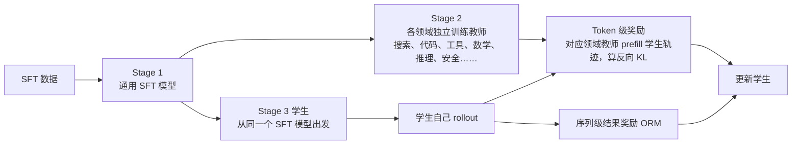
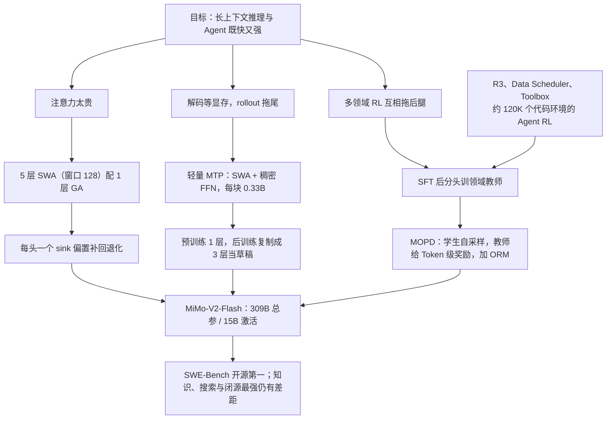

# MiMo-V2-Flash：128 个 Token 的窗口、一个 sink 标量、三层草稿头，15B 激活怎样对上 37B

<!-- release-date: 2025-12-16 -->

> 本文依据本地 `papers/Xiaomi/MiMo-V2-Flash.pdf`，即小米 LLM-Core 团队的 **MiMo-V2-Flash Technical Report**，arXiv:2601.02780v2、2026-01-08 修订，共 31 页（正文到 p. 22，参考文献 p. 22–28，贡献者名单 p. 29–30，附录 B、C 在 p. 31）。页码均指 PDF 自身的页码。文中会区分三件事：**报告明确写了什么**、**我们怎么解释它**、**哪些是外部资料或本文推算**。

## 阅读前先认识几个词

- **Token（词元）**：模型读写文本的最小单位。一个汉字、一个英文词或一个标点，都可能是一个或几个 Token。
- **KV Cache（键值缓存）**：生成下一个 Token 时，前面每个 Token 算出的 Key 和 Value 留在显存里，免得重算。上下文越长，这块显存越大。
- **MoE（Mixture-of-Experts，混合专家）**：把前馈网络拆成很多个「专家」，每个 Token 只走其中几个。总参数很大，每个 Token 真正用到的很小。
- **SWA 与 GA**：**滑动窗口注意力（Sliding Window Attention，SWA）** 只让当前 Token 看最近的一小段；**全局注意力（Global Attention，GA）** 让它看整段历史。前者便宜，后者看得远。
- **MTP（Multi-Token Prediction，多 Token 预测）**：训练时在主模型旁挂一个小模块，让它预测更远的 Token；推理时这个小模块可以先替主模型打草稿，主模型一次验证多个，这叫 **投机解码（speculative decoding）**。
- **在线策略蒸馏（on-policy distillation）**：学生自己生成一段话，老师逐个 Token 说「这里我会给多大概率」，学生按差距修正。与「背老师写好的范文」的离线蒸馏相对。

报告里还会出现两个它自己起名的东西：**MOPD**（Multi-Teacher On-Policy Distillation，多教师在线策略蒸馏）和 **R3**（Rollout Routing Replay，rollout 路由重放）。可学习的 **注意力 sink 偏置** 不是它发明的，沿用自 gpt-oss。到对应章节再展开。

## 一句话先说清

MiMo-V2-Flash 是一个 309B 总参数、每 Token 激活 15B 的 MoE 模型，预训练 27T Token，原生 32K 上下文、之后扩到 256K（PDF p. 1）。

报告开篇把矛盾定得很具体：推理链和 Agent 工作流都靠大规模强化学习（RL）推动，而它们共同卡在一个地方——**长上下文建模必须同时又快又强**（PDF p. 4）。

它的回答分成三处，每一处都比同行压得更狠，再各配一个小补丁：

1. **注意力**：每 5 层滑动窗口配 1 层全局，窗口只有 128 个 Token，报告说这让长上下文的 KV 缓存与注意力计算降低近 6 倍；代价靠每个注意力头一个可学习的 sink 标量补回来（PDF p. 4–7）；
2. **解码**：MTP 模块故意做轻（每块 0.33B，用 SWA 和稠密前馈），预训练挂 1 层，后训练复制成 3 层当草稿模型；最高平均接受 3.6 个 Token、解码加速 2.6 倍（PDF p. 1、p. 9、p. 21–22）；
3. **后训练**：不让一个模型在数学、代码、搜索、安全之间来回拉扯，而是先训一批领域教师，再让学生在自己的采样轨迹上同时向多个教师学，即 MOPD（PDF p. 11–14、p. 18）。

如果只记一句话：

> **不必让每一层都看全部历史，也不必让一个模型在所有任务上同时被优化。把「看远」交给少数几层、「打草稿」交给小模块、「领域专长」交给多个教师，主模型只负责把它们接起来。**

## 先看全景：48 层怎么排

报告的原话是：堆叠 8 个混合块，每块 5 层 SWA 接 1 层 GA；「唯一的例外是第一个 Transformer 块，它用全局注意力和稠密 FFN，以稳定早期表示学习」（PDF p. 5）。Table 1 又给出总共 48 层、39 层 SWA、9 层 GA（PDF p. 6）。$8 \times 6 = 48$ 正好是全部层数，所以第 1 层不是额外加的一层，而是把第一个混合块的第一层 SWA 换成了 GA 加稠密 FFN，这样 GA 是 9 层、SWA 是 39 层。这一步是本文从层数推出来的，公开权重 config 的 `hybrid_layer_pattern` 与之一致（外部补充）。

关键配置放在一起（PDF p. 5–6、p. 10）：

| 配置 | 数值 |
|---|---:|
| 总参数 / 激活参数 | 309B / 15B |
| 层数（总 / SWA / GA） | 48 / 39 / 9 |
| 隐藏维度 | 4096 |
| 滑动窗口 | 128 |
| SWA 头数（Q / KV） | 64 / 8 |
| GA 头数（Q / KV） | 64 / 4 |
| 每头维度（QK / V） | 192 / 128 |
| RoPE | 只作用于 Q、K 的前 64 维 |
| MoE 专家（总 / 激活） | 256 / 8，无共享专家 |
| 专家中间维度 / 第 1 层稠密 FFN 中间维度 | 2048 / 16384 |
| MTP 块 | SWA（64 / 8 头，窗口 128）+ 稠密 FFN，每块 0.33B |
| 预训练 | 27T Token，FP8 混合精度 |

**15B 激活里是什么。** 报告只给了 309B 和 15B 两个总数。按表里的尺寸自己算一遍（本文算术）：47 个 MoE 层 × 256 个专家 × 每专家三个 $4096\times2048$ 的矩阵，路由专家约 302.8B，占 309B 的 98%；每 Token 激活 8 个专家只用到约 9.5B；48 层注意力约 4.5B，第 1 层稠密 FFN 约 0.2B。报告没写词表大小，公开 config 里是 152,576（外部补充），输入输出两份嵌入约 1.25B。加起来总参数约 308.7B、激活约 15.4B，与报告的 309B / 15B 对得上。也就是说，这个模型的「体重」几乎全在专家上，每个 Token 实际跑过的计算量与一个 15B 稠密模型相当。

后训练的全貌在 MOPD 一节再展开。

## 第一层矛盾：长上下文在三个地方付钱

### 花销一：注意力计算随长度平方增长

全局注意力里每个 Token 要和前面所有 Token 比一次，序列长 $L$ 时比较次数是 $L^2$ 量级。滑动窗口把每个 Token 能看的范围固定成 $W$ 个，比较次数变成 $L \times W$。

### 花销二：KV Cache 随长度线性增长

全局层的缓存随 $L$ 线性增长；滑动窗口层只留最近 $W$ 个 Token，上下文再长也不涨。

按 Table 1 的头数与维度算（本文算术）：一层 GA 每个 Token 要存 $4 \times (192 + 128) = 1280$ 个数；一层 SWA 每个 Token 存 $8 \times 320 = 2560$ 个数，但最多只存 128 个 Token。序列到 256K 时，9 层 GA 的缓存约 30.2 亿个数，39 层 SWA 加起来约 1278 万个数，只占 0.42%。如果 48 层都是这种 4 个 KV 头的全局层，缓存会是现在的约 5.3 倍。报告说的「近 6 倍」（PDF p. 4）是按 5:1 的比例说的约数，没有算上第 1 层那个额外的 GA。

### 花销三：解码在等显存，RL rollout 又把它放大

自回归解码每生成一个 Token 只做一次前向，算术强度低，GPU 大部分时间在等显存。常规办法是把很多请求打成一个 batch 摊薄权重读取，但报告指出：这只对 FFN 有效，**对注意力无效**，因为每个请求有自己的 KV Cache（PDF p. 9）。

RL 训练把这个问题放大两次：on-policy 训练的 batch 天然小，GPU 用不满；rollout 后期总有几条特别长的轨迹拖尾，batch 逼近 1，整块 GPU 为一条序列空转（PDF p. 9）。

三笔账对应三个设计：SWA 混合解决前两笔，MTP 解决第三笔；MOPD 解决的是另一件事——RL 算力扩上去之后，怎样把多个方向的收益合进一个模型。

## 核心设计一：5 层滑动窗口配 1 层全局，窗口只留 128 个 Token

### 旧问题：窗口一小、比例一高，模型就退化

报告引用 Gemma 3 的经验：SWA 用得太激进——窗口太小，或 SWA 与 GA 的比例太高——会明显掉分，长上下文任务尤其严重（PDF p. 6）。外部补充：Gemma 3 自己用的是每 5 层局部配 1 层全局、局部窗口 1024（[arXiv:2503.19786](https://arxiv.org/abs/2503.19786)）。MiMo-V2-Flash 沿用 5:1，却把窗口缩到 128，只有 Gemma 3 的八分之一。

### 新设计：让每个头有权「谁也不看」

化解风险的是一个很小的部件：**可学习的注意力 sink 偏置**，它让模型在需要时给所有 Token「很少或零」的注意力（PDF p. 6）。实现沿用 gpt-oss：每个注意力头一个标量 $sink \in \mathbb{R}$，加进 softmax 的分母（PDF p. 6）。

先算当前 Token $i$ 与历史 Token $j$ 在一个头里的分数（PDF p. 6，式 1）：

$$
a_{ij} = \frac{q_i k_j^{\top}}{\sqrt{d}}
$$

再变成权重。与普通 softmax 唯一的差别是分母多了一项 $\exp(sink - m_i)$（PDF p. 7，式 2–3）：

$$
s_{ij} = \frac{\exp\left(a_{ij} - m_i\right)}{\exp\left(sink - m_i\right) + \sum_{j'} \exp\left(a_{ij'} - m_i\right)},
\qquad
m_i = \max\left(\max_j a_{ij},\ sink\right)
$$

$m_i$ 是为了数值稳定减去的最大值，把 $sink$ 也算进了比较。最后按权重加权 Value：$o_i = \sum_j s_{ij} v_j$（式 4）。

关键在于分子里没有 $sink$：它吸走的那份注意力不对应任何 Value，等于被丢掉。窗口里所有 $a_{ij}$ 都远小于 $sink$ 时，所有 $s_{ij}$ 都接近 0，这一头的输出接近零向量。上图就是这个形状。

**我们如何理解它为什么对 SWA 特别要紧。** 全局层总能看到序列开头，常把「无处可放」的注意力堆到第一个 Token 上，这就是文献里的 attention sink 现象；滑动窗口层看不到序列开头，连这个「垃圾桶」都没有，只能把噪声混进输出。sink 偏置等于给它补了一个不对应任何内容的出口。这段是本文的解释；报告只说 attention sink 的理论基础「仍是活跃的研究领域」，自己的证据是经验性的（PDF p. 6）。

另一个外部细节：报告写的是「每个注意力头」都有 sink，公开权重 config 里却只在滑动窗口层打开（`add_swa_attention_sink_bias` 为 true、`add_full_attention_sink_bias` 为 false）。

### 两类层的其他差别

- **KV 头数不同**：SWA 64 个查询头配 8 个 KV 头，GA 配 4 个（PDF p. 6）。报告没解释；我们的理解是 GA 的缓存会随上下文线性增长，所以给它更少的 KV 头，SWA 的缓存有上限，多给几个不贵；
- **RoPE 基频不同**：GA 在 32K 阶段是 640,000、扩到 256K 时调成 5,000,000；SWA 从头到尾是 10,000（PDF p. 10）。滑动窗口层看到的相对距离最多 128，上下文扩展只需要动看得远的那 9 层。

### 证据：32B 稠密模型上的四组对照

报告在一个 32B 稠密模型上做了架构对照，Q-K 维度与 RoPE 配置和正式模型一致。四个变体共享同一条流水线：8,192 序列长度预训练 250B Token，再用 40B Token 扩到 32,768，然后做长上下文 SFT 和带思维链的推理 SFT（PDF p. 7）。

通用基准，用没做长上下文扩展的 base 模型（PDF p. 7，Table 2）：

| 变体 | MMLU | BBH | TriviaQA | GSM8K | MATH | CMMLU | MBPP |
|---|---:|---:|---:|---:|---:|---:|---:|
| 全 GA | 57.3 | 54.7 | 53.2 | 34.2 | 9.5 | 50.3 | 54.7 |
| 混合 SWA，W=128，无 sink | 54.9 | 52.4 | 52.8 | 36.9 | 8.9 | - | - |
| 混合 SWA，W=128，有 sink | **58.3** | **56.1** | 53.7 | 36.9 | **10.3** | **53.3** | **56.3** |
| 混合 SWA，W=512，有 sink | **58.3** | 54.9 | **54.9** | **37.9** | 10.0 | 52.3 | 53.2 |

长上下文，GSM-Infinite、NoLiMa、RULER-32k 用扩展后的 base 模型，MRCR 用长上下文 SFT 模型（PDF p. 7–8，Table 3）：

| 变体 | GSM-Infinite | NoLiMa | RULER-32k | MRCR |
|---|---:|---:|---:|---:|
| 全 GA | 12.3 | 49.7 | 89.4 | 32.5 |
| 混合 SWA，W=128，有 sink | **17.3** | **51.2** | 89.4 | **34.4** |
| 混合 SWA，W=512，有 sink | 17.2 | 38.5 | 84.7 | 19.6 |

复杂推理，用推理 SFT 模型（PDF p. 7，Table 4）：

| 变体 | AIME24/25 | LiveCodeBench | GPQA-Diamond | 平均 |
|---|---:|---:|---:|---:|
| 全 GA | 45.5 | 40.0 | 41.7 | 42.4 |
| 混合 SWA，W=128，有 sink | **47.1** | **43.9** | **48.1** | **46.3** |

报告读出三条结论（PDF p. 8）：

1. **sink 是必需的**。没有 sink 的 128 窗口在多数通用基准上掉分（MMLU、BBH、TriviaQA、MATH 都低于全 GA，GSM8K 反而更高，CMMLU 和 MBPP 没测）；加上 sink 后追平或反超全 GA。之后的实验都默认带 sink；
2. **窗口 128 比 512 好**。两者在通用基准上差不多，但做完长上下文扩展和长上下文 SFT 后，128 窗口超过了全 GA，512 窗口却明显退化：NoLiMa 从 51.2 掉到 38.5，MRCR 从 34.4 掉到 19.6；
3. **推理任务上混合 SWA 更强**，三项都高于全 GA，平均高 3.9 分。

几个读表时要知道的背景（外部补充）：GSM-Infinite 把小学数学题嵌进可以无限加长的噪声上下文；NoLiMa 让问题与答案没有字面重合，测语义联想式检索；RULER 是合成的长上下文检索与聚合任务；MRCR 要在多轮对话里按顺序找回多根「针」。对照实验里的 GSM-Infinite 和 NoLiMa 是报告自建的 few-shot 版本（PDF p. 8）。

### 报告怎么解释「小窗口反而更好」

报告承认这「可能看起来反直觉」，给出的 **假设** 是两点：更好的正则化，以及有效的稀疏性。小窗口迫使 SWA 层只关注局部，这个归纳偏置减轻了对虚假模式的过拟合；128 的窗口还逼着 SWA 层把长程依赖完全交给 GA 层，分工更清晰。512 的窗口会模糊这条界线，SWA 层自己去处理一部分长程依赖，局部与全局的分离被冲淡（PDF p. 8）。

报告紧接着强调，这些观察「是经验性的，来自我们特定的实验设置，包括模型规模、数据集和训练流程」（PDF p. 8）。它没有做注意力模式分析去证实「512 窗口的 SWA 层确实在偷偷处理长程依赖」。

### 与 MiniMax-M2 的结论对着读

同一时期，MiniMax-M2 的报告得出了几乎相反的结论：据 MiniMax-M2 一篇，M2 团队在 M2 规模上继续预训练了几千亿到上万亿 Token 的混合 SWA 变体（包括加 sink token），MMLU、MATH 和 32K 的 RULER 没差，但 128K 的检索与翻译任务明显落后，SFT 后 32K 以上的 Agent 与长上下文任务也更差，于是回到了全注意力。

两边不必互相否定，它们可以同时为真：**在 32K 以内两家都没看到混合 SWA 吃亏，分歧出现在更长的上下文上，而 MiMo 的对照实验只做到 32K。** MiMo 正式模型在最长 128K 的 MRCR 上是 45.7，高于 Kimi-K2-Thinking 的 44.2，但低于 DeepSeek-V3.2-Thinking 的 55.5 和 Gemini 3.0 Pro 的 89.7（PDF p. 20，Table 9）。这说明 5:1 加 128 窗口在 128K 上可用，但没有证明它在检索型任务上不付代价。

### 代价与边界

- **对照规模小**：32B 稠密、290B Token，与 309B MoE、27T Token 差了一到两个数量级，报告自己也说结论依赖设置；
- **没有 256K 的对照**：正式模型的 NIAH-Multi 到 256K 仍有 96.7（PDF p. 13，Table 6），但那是大海捞针，不是检索加推理；
- **第 1 层为什么用 GA 没有消融**，只有「稳定早期表示学习」一句（PDF p. 5）。

**可迁移启发。** 只要注意力的候选被人为截断——滑动窗口、Top-k 检索、稀疏路由——softmax 就会把噪声硬塞进输出，一个分母里的可学习标量几乎零成本地给出「不选」的出口。另一条是按「谁的缓存会长大」分配资源：KV 头、RoPE 基频的扩展都只花在会随上下文增长的那几层上。

## 核心设计二：把 MTP 做轻，让它当原生草稿模型

### 旧问题：batch 帮不了注意力

投机解码是另一条路：先用便宜的草稿模型连猜几个 Token，再让主模型一次前向全部验证。验证时主模型同时处理多个位置，等于在 **一个请求内部** 制造并行度。报告称之为 Token 级并行：它同时提高 FFN 和注意力的算术强度，又不增加 KV Cache 的读写（PDF p. 9）。

难点是草稿模型从哪来。外挂一个独立小模型要单独训练、单独对齐分布；分布不一致，猜的 Token 就常被拒绝。

### 新设计：训练目标与草稿模型是同一个模块

MTP 本来是训练目标。报告引用前人说它能提升训练效率和质量，但把重心明确放在另一件事上：**把 MTP 当作原生的草稿模型做自投机解码，拿到真实部署的加速**（PDF p. 9）。为此 MTP 从一开始就按「推理时要留着用」设计（PDF p. 5、p. 9）：

- **用稠密 FFN 而不是 MoE**，限制参数量；
- **用 SWA 而不是 GA**，减少 KV Cache 与注意力计算；
- 每个 MTP 块只有 **0.33B** 参数；
- 预训练只挂 **1 个** 头，避免额外训练开销；后训练把它 **复制 $K$ 次** 组成 $K$ 步的 MTP 模块，所有头联合训练做多步预测；
- 每个头的输入是主模型的隐状态加 Token embedding；Figure 2 上 embedding 与 LM Head 标着 tied，即与主模型共享。

报告只写了每个头都接收主模型隐状态，没有说清后一个头是否也接前一个头的输出，所以开头的架构图没有画头与头之间的连线。推理时 3 个头猜出 3 个 Token，主模型一次前向验证，接受几个就往前走几个。

### 接受长度由「下一个 Token 有多确定」决定

报告用 3 层 MTP 在多个基准上测了平均接受长度，并把它和主模型的下一 Token 交叉熵放在一起（PDF p. 21，Figure 7）。原图是一张 6 个点的散点图，读数如下（读自 Figure 7，近似值）：

| 数据集 | 下一 Token 交叉熵 | 平均接受长度 |
|---|---:|---:|
| WebDev | 约 0.05 | 约 3.62 |
| AIME25 | 约 0.14 | 约 3.27 |
| SciCode | 约 0.16 | 约 3.24 |
| LiveCodeBench | 约 0.17 | 约 3.17 |
| GPQA | 约 0.23 | 约 2.99 |
| MMLU Pro | 约 0.27 | 约 2.95 |

报告的拟合是（PDF p. 21）：

$$
y = 4\left(1 - 0.58\, x^{0.58}\right), \qquad R^2 = 0.995
$$

$x$ 是下一 Token 交叉熵，$y$ 是平均接受长度。报告的结论是：交叉熵是 MTP 吞吐的「主要决定因素」，写网页代码这类低熵任务接受得长，MMLU Pro 这类高不确定性任务接受得短（PDF p. 21）。

**我们的解释**：常数 4 不是随便选的。3 个草稿头最多猜 3 个，加上主模型验证时自己产出的 1 个，一步最多前进 4 个 Token，所以熵趋于 0 时曲线趋于 4。报告没明说这一点。对部署的意义是：同一个模型在不同业务上的投机解码收益，可以先从熵估出来。

### 加速比随接受长度线性增长

在 16K 输入、1K 输出下，按每节点 batch 和接受长度测的解码加速（PDF p. 22，Table 10）：

| 每节点 batch | 无 MTP | 2.8 | 3.0 | 3.2 | 3.4 | 3.6 | 3.8 |
|---:|---:|---:|---:|---:|---:|---:|---:|
| 32 | 1.00× | 1.86× | 1.99× | 2.12× | 2.25× | 2.39× | 2.52× |
| 48 | 1.00× | 1.82× | 1.95× | 2.08× | 2.21× | 2.34× | 2.47× |
| 64 | 1.00× | 1.97× | 2.11× | 2.25× | 2.39× | 2.53× | 2.67× |
| 96 | 1.00× | 1.99× | 2.13× | 2.28× | 2.42× | 2.56× | **2.70×** |
| 128 | 1.00× | 1.82× | 1.94× | 2.07× | 2.20× | 2.33× | 2.46× |

列头是接受长度。摘要里的「最高 3.6 接受长度、2.6 倍解码加速」大致对应接受长度 3.6、batch 96 那一格的 2.56×；表里最高是 batch 96、接受长度 3.8 的 2.70×。

每一行的加速比几乎等于接受长度乘一个常数：batch 32 约 0.66，batch 96 约 0.71，batch 128 约 0.65（本文算术）。这个常数可以理解为「验证一步相对普通解码一步贵多少」的倒数：接受 3.6 个 Token 要多跑三个草稿头和一次多位置验证，实际只拿到 2.5 倍左右。报告把不同 batch 的差异归于计算与 I/O 需求以及 kernel 效率，建议按硬件的 roofline 同时调 batch 与 MTP 层数（PDF p. 22）。

### RL rollout：动机论证，没有实测

报告认为 MTP「特别适合」RL 训练（PDF p. 9）：一是让小 batch 的 on-policy RL 变得可行——用 Token 级并行代替 batch 级并行，不加 batch 也能提高利用率；二是缓解长尾拖尾——rollout 后期 batch 逼近 1 时，MTP 同时提高注意力和 FFN 的效率。

但这一节只是动机。**报告没有给出 MTP 在 RL rollout 上的实测加速**，Table 10 测的是通用解码场景。

### 代价与边界

- 后训练阶段三个头联合训练，训练成本增加，报告没有量化；
- 被拒绝的草稿是白算的；高熵任务上接受长度接近 3，收益明显缩水；
- 加速比对 batch 敏感，batch 128 的收益低于 batch 96；
- MTP 对模型质量的贡献没有单独消融，报告引用的是前人结论。

**可迁移启发。** 训练目标和推理加速器可以是同一个模块；这个模块要按推理成本设计（SWA、稠密 FFN、0.33B），训练收益顺带拿。部署前先量业务数据的熵，再决定开几层草稿。

## 沿用的骨架：MoE、混合精度与优化器

### 256 个路由专家选 8 个，没有共享专家

每个 MoE 层 256 个专家、每 Token 激活 8 个，专家中间维度 2048，**不设共享专家**（PDF p. 5、p. 10）。报告没有说明为什么去掉共享专家，也没有消融。

负载均衡沿用「专家偏置 + 很小的序列级辅助损失」的做法：预训练里 expert bias 更新因子在前两阶段是 0.001、第三阶段降到 $1.0 \times 10^{-5}$，序列辅助损失系数全程 $1.0 \times 10^{-5}$（PDF p. 10）；SFT 阶段这两个数分别是 $1.0 \times 10^{-4}$ 和 $1.0 \times 10^{-6}$（PDF p. 15）。报告没有解释各阶段为什么取值不同。

### FP8 训练，四处保留高精度

采用与 DeepSeek-V3 类似的 FP8 混合精度框架：注意力输出投影、embedding 与输出头保留 BF16，MoE 路由参数保留 FP32。报告称这在不明显影响训练效率与显存的前提下提高了数值稳定性（PDF p. 6）。

路由参数用 FP32 很有针对性：路由决定每个 Token 去哪 8 个专家，一点数值抖动就可能改变 Top-8 的边界；后面 R3 一节会看到，这正是 MoE 做 RL 时训练与推理不一致的根源。这段联系是本文的解读。

### 初始化与优化器

所有可学习参数用标准差 0.006 随机初始化；AdamW，$\beta_1 = 0.9$、$\beta_2 = 0.95$，权重衰减 0.1，梯度裁剪最大范数 1.0（PDF p. 10）。

## 预训练：27T Token 分三段

### 数据：向「长程依赖」倾斜

语料 27T Token，来源包括公开网页、书籍、学术论文、代码、数学和更广的 STEM 材料。处理流程大体沿用 MiMo-7B，但做了一个「有意的转向」：更看重带长程依赖的数据——长篇网页文档，以及仓库级代码、pull request、issue 和 commit 历史这类精选代码语料（PDF p. 9–10）。

我们的理解是，这个转向和架构配套：5:1 混合把「看远」压到 9 层里，训练数据里若没有足够多真正需要看远的样本，这 9 层学不到东西。报告没有明说这层因果。报告也没有公开各来源占比、过滤器、去重或污染检查。

### 三个阶段

| 阶段 | Token 区间 | 上下文 | 数据变化 |
|---|---|---:|---|
| Stage 1 预训练 | 0–22T | 32K | 多样化的高质量通用语料 |
| Stage 2 中期训练 | 22–26T | 32K | 上采样代码类数据，加入约 5% 合成推理数据 |
| Stage 3 上下文扩展 | 26–27T | 256K | 沿用 Stage 2 的分布，上采样长程依赖数据 |

（PDF p. 10。）「约 5% 合成推理数据」是报告唯一给出的合成数据比例，生成方式与来源模型都没写。

### 超参与阶段衔接（PDF p. 10）

| | Stage 1 | Stage 2 | Stage 3 |
|---|---|---|---|
| 学习率 | 50B Token 线性 warmup 到 $3.2\times10^{-4}$，恒定 12T，再用 10T cosine 衰减到 $1.0\times10^{-4}$ | 4T 内 cosine 从 $1.0\times10^{-4}$ 到 $3.0\times10^{-5}$ | cosine 从 $3.0\times10^{-5}$ 到 $1.0\times10^{-5}$ |
| batch（序列条数） | 前 500B Token 线性 warmup 到 2,048，之后不变 | 2,048 | 256 |
| 序列长度 | 32,768 | 32,768 | 262,144 |
| GA / SWA 的 RoPE 基频 | 640,000 / 10,000 | 640,000 / 10,000 | 5,000,000 / 10,000 |
| MTP 损失权重 | 0.3 | 0.1 | 0.1 |
| expert bias 更新因子 | 0.001 | 0.001 | $1.0\times10^{-5}$ |

两处算术值得看（本文算术）：Stage 1 的 $0.05 + 12 + 10 \approx 22$T，与 0–22T 对上；Stage 1 每步是 $2048 \times 32768 \approx 6710$ 万 Token，Stage 3 是 $256 \times 262144$，也是约 6710 万 Token。**序列长度扩大 8 倍时，batch 条数缩小 8 倍，每步吃进的 Token 数不变**。报告没说这是刻意的，但两个数精确相等。三段学习率首尾相接，没有跳变。MTP 权重前段 0.3、后段 0.1，与 DeepSeek-V3 的做法一致（据 DeepSeek-V3 一篇）。

### Base 模型评测：推理强，知识弱

报告把 MiMo-V2-Flash-Base 与 Kimi-K2-Base、DeepSeek-V3.1-Base、DeepSeek-V3.2-Exp-Base 比，四者的激活 / 总参数分别是 15B / 309B、32B / 1043B、37B / 671B、37B / 671B（PDF p. 12，Table 5）。挑几组能说明方向的：

| 基准 | shots | MiMo-V2-Flash | Kimi-K2 | DeepSeek-V3.1 | DeepSeek-V3.2-Exp |
|---|---|---:|---:|---:|---:|
| MMLU-Pro | 5 | **73.2** | 69.2 | 58.8 | 62.1 |
| GPQA-Diamond | 5 | **55.1** | 48.1 | 51.0 | 52.0 |
| AIME 24&25 | 2 | **35.3** | 31.6 | 21.6 | 24.8 |
| MATH | 4 | **71.0** | 70.2 | 62.6 | 62.5 |
| BigCodeBench | 0 | **70.1** | 61.7 | 63.0 | 62.9 |
| LiveCodeBench v6 | 1 | **30.8** | 26.3 | 24.8 | 24.9 |
| SWE-Bench（Agentless Repair） | 3 | **30.8** | 28.2 | 24.8 | 9.4* |
| HumanEval+ | 1 | 70.7 | **84.8** | 64.6 | 67.7 |
| SimpleQA | 5 | 20.6 | **35.3** | 26.3 | 27.0 |
| C-SimpleQA | 5 | 61.5 | **77.6** | 70.9 | 68.0 |
| TriviaQA | 5 | 80.3 | **85.1** | 83.5 | 83.9 |
| HellaSwag | 10 | 88.5 | **94.6** | 89.2 | 89.4 |
| GlobalMMLU | 5 | 76.6 | 80.7 | 81.9 | **82.0** |

星号表示该模型没有遵循 few-shot 示例的格式（PDF p. 12）。

报告的总结很克制：多数基准有竞争力，推理类（MMLU-Pro、GPQA-Diamond、AIME）稳定领先；SWE-Bench 上用不到 Kimi-K2 三分之一的参数超过了它；但受参数量限制，知识容量低于更大的模型，SimpleQA 最明显（PDF p. 11）。我们的补充：要把知识存下来的任务（SimpleQA、C-SimpleQA、TriviaQA、多语言）看的是容量，MiMo 在这里落后；推理类更依赖数据与目标，MiMo 向代码与推理数据的倾斜在这里见效。代码里 HumanEval+ 是个例外，明显低于 Kimi-K2。

### 长上下文评测（PDF p. 13，Table 6）

| 基准 | 长度 | MiMo-V2-Flash | Kimi-K2 | DeepSeek-V3.1 | DeepSeek-V3.2-Exp |
|---|---:|---:|---:|---:|---:|
| NIAH-Multi | 32K | 99.3 | 99.8 | 99.7 | 85.6* |
| | 64K | 99.9 | 100.0 | 98.6 | 85.9* |
| | 128K | 98.6 | 99.5 | 97.2 | 94.3* |
| | 256K | 96.7 | - | - | - |
| GSM-Infinite Hard | 16K | 37.7 | 34.6 | 41.5 | 50.4 |
| | 32K | 33.7 | 26.1 | 38.8 | 45.2 |
| | 64K | 31.5 | 16.0 | 34.7 | 32.6 |
| | 128K | 29.0 | 8.8 | 28.7 | 25.7 |

星号表示模型可能没有遵循提示；基线模型的最大长度都短于 256K（PDF p. 13）。

报告从 GSM-Infinite 读出：MiMo 从 16K 到 128K 退化最小（掉 8.7 分）；DeepSeek-V3.2-Exp 在 32K 以内最高，但 64K、128K 大幅退化，报告认为这「暗示稀疏注意力在噪声输入下做长上下文推理有内在劣势」（PDF p. 11）。「退化更快」是表里的事实，「稀疏注意力有内在劣势」是作者的推断，没有进一步分析；而且全注意力的 Kimi-K2-Base 退化得最厉害（34.6 到 8.8），差异未必只由注意力机制决定。

## 核心设计三：MOPD，先分头练，再合回来

### 旧问题：跷跷板与信号浪费

报告说当前后训练有两个根本困难：**能力失衡**，提升一种技能常让另一种退步，即「跷跷板效应」（see-saw）；**学习低效**，把多个专门模型的知识合在一起时，现有方法没有充分利用训练信号（PDF p. 11）。传统合并有两种：把参数加权合并，或让专家模型生成静态数据再离线蒸馏；报告认为前者在能力间做取舍，后者让学生只在老师的分布上学（PDF p. 13–14）。

### 三个阶段

据 PDF p. 13 的 Figure 3 重画，是机制示意；教师种类按报告的列举画出，不代表确切数量。

- **Stage 1 SFT**：在高质量指令—回复对上建立基本的指令跟随能力（PDF p. 13）；
- **Stage 2 领域专门训练**：从 SFT 模型出发，对每个领域 **独立** 优化，训出一批领域教师：Agent 类（搜索、编码、通用工具使用）与非 Agent 类（数学推理、通用推理、安全对齐）（PDF p. 13）。引言写的是「专门的 RL / SFT」（PDF p. 4），Table 7 里也确有一个 SFT 教师；
- **Stage 3 MOPD**：不合并参数、不生成离线数据，把多教师知识整合表述成一个 on-policy 的 RL 过程——学生从自己不断变化的分布里采样，教师通过 KL 散度奖励给出 Token 级监督（PDF p. 13–14）。

Figure 3 里教师和学生都从同一个 SFT 模型出发，图上用 Replace 标出替换关系。所以这不是「大模型教小模型」，而是同一个起点的不同分支互相合并。

### Stage 1：盯着「零梯度参数」的数量

SFT 数据是数百万条样本，覆盖通用对话、推理、代码与 Agent 任务，同时包含思考模式与非思考模式，回复由内部的领域专用 checkpoint 生成（PDF p. 15）。

报告在这里给了一个很少见的工程发现：MoE SFT 的一个稳定性指标是 **梯度为零的参数数量**（num-zeros）（PDF p. 15）：

- num-zeros **上升**，说明专家间负载均衡在恶化，越来越多专家收不到 Token；
- num-zeros **下降**，说明模型在明显过拟合训练数据。

报告认为全程保持 num-zeros 稳定是 SFT 成功的关键，也是后续 RL 稳健收敛的前提；它主要取决于两个超参：expert bias 的更新率与 AdamW 的 $\epsilon$。最终配置是：学习率 cosine 从 $5.0\times10^{-5}$ 衰减到 $5.0\times10^{-6}$，batch 128，AdamW $\epsilon = 1.0\times10^{-8}$，expert bias 更新率 $1.0\times10^{-4}$，序列辅助损失系数 $1.0\times10^{-6}$（PDF p. 15）。

为什么 $\epsilon$ 会影响它，报告没展开。我们的理解是：AdamW 的更新量是一阶动量除以（二阶动量的平方根加 $\epsilon$）；长期收不到 Token 的专家，二阶动量趋近 0，$\epsilon$ 就成了分母的主导项，决定这些参数偶尔收到梯度时被推多远。

### Stage 2：非 Agent 的 RL

单轮任务，模型一次生成完整回复。可验证领域（数学、代码、逻辑）用「程序化工具 + LLM 裁判」的混合验证对照题—解对判对错；有用性与安全这类主观质量用基于 rubric 的框架，由一个高级 LLM 裁判对照详细 rubric 与参考答案打细粒度分（PDF p. 15）。算法、数据量、奖励权重和超参都没公开。

### Stage 2：Agent 的 RL，沿环境与算力两个维度扩

环境的数据构成（PDF p. 16，Table 8）：

| Agent 类型 | 任务数 | 环境 | 提示来源 |
|---|---:|---|---|
| 代码 Agent | 90K | 真实 | 真实 |
| 代码 Agent | 30K | 真实 | 合成 |
| 搜索 Agent | 150K | 真实 | 合成 |
| 通用 Agent | 50K | 合成 | 合成 |

四类环境各自怎么建（PDF p. 16–17）：

- **代码 Agent**：任务来自真实 GitHub issue，模型在循环里读文件、改文件、执行命令，奖励来自可验证的单元测试。报告的「关键洞察」是：持续扩大可用任务数就能持续提升代码能力。为了在超过 10 万个代码任务上做 RL，他们建了自动化环境搭建流水线，从仓库快照生成开发环境并打包成容器镜像，在 8 种编程语言上搭建成功率 70%，背后是运行超过 10,000 个并发 pod 的 Kubernetes 集群；又做了一个轻量 Agent 脚手架，只暴露 `bash`、`str_replace`、`finish` 三个原子工具，全部通过 shell 命令与执行后端交互，system prompt 极简、不预设工作流，让模型自己在训练中发现最佳实践；
- **终端 Agent**：从 Stack Overflow 与 Stack Exchange 选需要高级技术知识的材料，改写成带查询、Dockerfile 和测试用例的任务；验证环境可安装、按难度与可靠性过滤后得到约 30,000 条，再按通过率去掉判定不可靠或太简单的；
- **网页开发 Agent**：收集高质量的用户手写网页，用 Playwright 执行生成的代码并录成视频，用多模态视觉判别器只留高质量样本，报告说基于视频的评估比静态截图更少视觉幻觉；再从这些网页逆向出用户查询，合成覆盖 8 类网页的 RL 数据；奖励由视觉验证器对录屏打分，同时看视觉质量、功能正确性与可执行性；
- **通用 Agent**：搜索 Agent 用 `search`、`open`、`find` 三个工具，问题通过从种子实体递归扩展事实图来构造，难度随关系链深度与细节混淆增长，答案可验证；函数调用 Agent 在合成的应用环境里训练，工具调用图按显式数据依赖与隐式逻辑依赖生成。

原图是 PDF p. 17 的 Figure 4，此处裁掉了图注。代码 Agent 在约 120K 个环境上做了 on-policy rollout 和更新（PDF p. 17）。图上读不出的判断是：到 120K 时两条曲线都还没有明显饱和，这是报告「持续扩大任务数就能持续提升」那句话的直接证据；但单点波动能到 3–5 个百分点，报告没有给重复次数或置信区间。

报告还给出了一个外溢现象：只做代码 Agent 的 RL，其他任务也涨（PDF p. 17，Figure 5）。Figure 5 是六张小折线图，横轴到约 100K 个环境，读数如下（近似值）：

| 基准 | 起点 | 终点 | 备注 |
|---|---:|---:|---|
| Tau-2 Bench | 约 71 | 约 75.4 | 最高约 76.2 |
| AIME 2025 | 约 80.7 | 约 82.5 | 最高约 83.4 |
| GPQA-Diamond | 约 75.1 | 约 77.0 | 中途跌到约 74.5 |
| LiveCodeBench | 约 72.4 | 约 73.3 | 纵轴总跨度只有 3 分 |
| Arena-Hard（Hard Prompt） | 约 49 | 约 51.8 | 最高约 54.4，抖动接近总涨幅 |
| HMMT Feb. 2025 | 约 63.5 | 约 68.1 | |

报告据此说，大规模代码 Agent RL 能泛化到其他 Agent 任务和数学、代码、通用推理，「暗示 Agent 训练培养的是可广泛迁移的解题能力」（PDF p. 17）。趋势方向是清楚的，但幅度多数只有 1–5 分，报告也没说明每个点评测了几次，「可广泛迁移」是作者的解读。

### Stage 3 的工作机制：把蒸馏写成一个 RL 目标

先定义三个策略（PDF p. 18）：$\pi_\theta$ 是训练引擎里被优化的学生；$\mu_\theta$ 是推理引擎里实际采样的学生——理论上是同一个模型，但两套框架的数值实现不同，所以分开记；$\pi_{\text{domain}_x}$ 是负责提示 $x$ 所属领域的教师。$\operatorname{sg}[\cdot]$ 是停梯度。

**第一步，反向 KL。** 学生自己采出 Token $y_t$ 后，看教师与学生给这个 Token 的概率之比（PDF p. 18，式 5）：

$$
\mathcal{L}_{\text{reverse-KL}}(\theta)
= -\,\mathbb{E}_{x \sim \mathcal{D},\ y_t \sim \pi_\theta(\cdot \mid x, y_{<t})}
\log \frac{\pi_{\text{domain}_x}(y_t \mid x, y_{<t})}{\pi_\theta(y_t \mid x, y_{<t})}
$$

「反向」是指期望按学生的分布取：学生走到哪里，就在哪里问教师。教师概率比学生高，对数比为正，这个 Token 被鼓励；反之被抑制。它的梯度形状与策略梯度完全一样（式 6）：对数概率比乘以 $\nabla_\theta \log \pi_\theta(y_t \mid x, y_{<t})$。**只要把教师与学生的对数概率比当作每个 Token 的奖励，蒸馏就是一个 RL 问题**，可以直接塞进现成的 RL 框架。

**第二步，纠正训练与推理的不一致。** 采样在推理引擎（$\mu_\theta$）里做，更新在训练引擎（$\pi_\theta$）里做。报告沿用 IcePop（Zhao et al. 2025）的做法，对每个 Token 做训练—推理重要性采样，比值偏离太大的 Token 直接丢掉（PDF p. 18，式 7–8）：

$$
\mathcal{L}_{\text{MOPD}}(\theta)
= -\,\mathbb{E}_{x \sim \mathcal{D},\ y \sim \mu_\theta(\cdot \mid x)}
\left[
\frac{1}{|y|} \sum_{t=1}^{|y|} w_t\, \hat{A}_{\text{MOPD},t}\, \log \pi_\theta(y_t \mid x, y_{<t})
\right]
$$

其中 $w_t = \operatorname{sg}\left[\pi_\theta(y_t \mid \cdot) / \mu_\theta(y_t \mid \cdot)\right]$，但比值落在 $[\epsilon_{\text{low}}, \epsilon_{\text{high}}]$ 之外时取 0；$\hat{A}_{\text{MOPD},t} = \operatorname{sg}\left[\log \pi_{\text{domain}_x}(y_t \mid \cdot) - \log \pi_\theta(y_t \mid \cdot)\right]$ 是教师给的 Token 级优势。两者都停梯度，只有最后的 $\log \pi_\theta$ 参与求导。报告没给 $\epsilon_{\text{low}}$ 与 $\epsilon_{\text{high}}$ 的取值。

**第三步，和结果奖励相加。** 默认情况下，MOPD 的优势会与结果奖励模型（Outcome Reward Model，ORM）的优势组合，例如用 GRPO 算出的（PDF p. 18，式 9）：

$$
\hat{A}_{\text{MOPD},t}
= \operatorname{sg}\left[\log \frac{\pi_{\text{domain}_x}(y_t \mid x, y_{<t})}{\pi_\theta(y_t \mid x, y_{<t})}\right]
+ \alpha\, \hat{A}_{\text{ORM}}
$$

$\alpha$ 的取值没有公开。于是每个 Token 收到两种信号：教师逐 Token 给的「这里该怎么说」，密而稳；整条答案对不对的结果奖励，稀疏但直接对准目标。Figure 3 里分别标为 Token-level Reward 与 Seq-level Reward（PDF p. 13）。

这里用的是 **单 Token 估计**：只在采到的 $y_t$ 上算对数概率比。据 DeepSeek-V4 一篇，V4 的在线策略蒸馏算的是全词表的反向 KL。单 Token 版本便宜，可以直接复用 RL 框架的 Token 级优势接口，代价是估计方差更大；MiMo 报告没有讨论这个选择。

### 收益：学生追平多数教师

（PDF p. 14，Table 7。括号里是最强教师的类型：RL 训出的领域教师、SFT 模型，或学生自己。）

| 基准 | 学生 MOPD 前 | 最强教师 | 学生 MOPD 后 | 学生 − 教师 |
|---|---:|---:|---:|---:|
| AIME 2025 | 89.3 | 93.9（RL） | 94.1 | +0.2 |
| HMMT Feb. 2025 | 76.9 | 82.6（RL） | 84.4 | +1.8 |
| LiveCodeBench | 77.5 | 82.6（RL） | 83.2 | +0.6 |
| MMLU-Pro | 84.7 | 84.7（自身） | 84.9 | +0.2 |
| GPQA-Diamond | 84.9 | 84.9（自身） | 84.3 | −0.6 |
| HLE（无工具） | 21.2 | 21.2（自身） | 22.1 | +0.9 |
| Arena-Hard（Hard Prompt） | 50.0 | 50.0（自身） | 54.1 | +4.1 |
| Arena-Hard（Creative Writing） | 90.1 | 90.1（自身） | 86.2 | −3.9 |
| SWE-Bench Verified | 67.8 | 74.2（RL） | 73.4 | −0.8 |
| Tau2-Bench | 75.9 | 79.6（RL） | 80.3 | +0.7 |
| Tau2-Bench（Telecom） | 92.7 | 95.0（RL） | 95.3 | +0.3 |
| BrowseComp | 42.5 | 51.7（SFT） | 45.4 | −6.3 |

分三块读：

1. **有 RL 教师的领域**：AIME、HMMT、LiveCodeBench、Tau2-Bench 都追平或略超教师，SWE-Bench Verified 差 0.8。这是 MOPD 核心主张被数据支持的部分；
2. **教师就是学生自己的领域**：MMLU-Pro、GPQA、HLE、Arena-Hard 没有专门教师，这里的变化反映的是别的领域蒸馏带来的副作用。Hard Prompt 涨 4.1，Creative Writing 掉 3.9，其余基本持平。跷跷板没有消失，只是变小了；
3. **BrowseComp**：最强教师是 SFT 模型（51.7），学生只有 45.4，差 6.3，是表里最大的缺口，报告没有解释。我们的推测是：多轮搜索轨迹很长，Token 级对数比在长轨迹上被稀释，而 SFT 教师的分布又可能与学生的 on-policy 轨迹差得更远。这只是猜测。

### MOPD 与纯 ORM 的对照

原图是 PDF p. 19 的 Figure 6，此处裁掉了图注。三条实线分别是只用 ORM 的 RL、不带 ORM 的 MOPD、MOPD；虚线是教师。

图上读不出的有两点：

- **两个基准上 ORM 那一路的作用不一样。** LiveCodeBench 上带 ORM 的 MOPD 后程反超不带 ORM 的版本，约 44 步时到 84 左右，超过教师线；AIME 2025 上两者交替领先，到第 48 步时不带 ORM 的版本（约 93.7）反而高于带 ORM 的（约 92.2）。所以「结果奖励与教师信号互补」只在代码上有图证，数学上看不出；
- **横轴只到 48 步**，看不出更长训练会不会过拟合教师，报告也没给训练步数、batch 等超参。

报告的结论是：MOPD 在数学和代码上保住并合并了多个教师的专长，在多数领域达到或超过最强教师（PDF p. 18）。

### 报告主张的三条优势，哪些有数据

报告列了三条（PDF p. 14）：

1. **有效且高效**：保住最强教师在各领域的峰值；Token 级奖励让信用分配稳定、收敛快；学生在自己的分布上学，避免离线方法的 exposure bias。前两点有 Table 7 与 Figure 6 支持；第三点是原理论证，报告没有和离线蒸馏做对照；
2. **模块化、可扩展**：教师可以是 RL 模型、另一个 SFT 模型，甚至学生自己；加新教师不必重构流水线。Table 7 里三种教师都出现了；
3. **迭代共同进化**：蒸馏出的学生可以回到 Stage 2 变成更强的教师。结论里说这是未来工作（PDF p. 22），本报告没有跑第二轮。

教师的确切数量、提示如何分派到「所属领域」的教师、MOPD 的算力开销（每步都要教师 prefill 学生轨迹），报告都没写。

**可迁移启发。** 蒸馏可以直接写成策略梯度里的 Token 级优势项，与结果奖励相加，不需要新的训练循环；先分头 RL、再合并，每个领域的奖励、数据、超参可以各调各的，合并阶段只处理「怎么把分布拉过来」。

## RL 基础设施：都在解决 MoE 做 RL 特有的麻烦

RL 与 MOPD 的基础设施用 SGLang 做推理引擎、Megatron-LM 做训练引擎，训练和推理都用 FP8，在此之上有三个扩展模块（PDF p. 19）。

### R3：让训练时走的专家和 rollout 时一样

**旧问题**：因为数值精度，MoE 在 rollout 和训练两边的专家路由会不一致（PDF p. 19）。路由分数差一点点，Top-8 的边界就可能变，同一个 Token 在两边走了不同的专家，训练引擎的 $\pi_\theta$ 与采样用的 $\mu_\theta$ 差得更远。这也是 MOPD 公式里要分开写 $\pi_\theta$ 与 $\mu_\theta$、要做重要性采样的原因。

**新设计**：**R3**——训练时直接复用 rollout 时记录的专家选择，报告称通过优化数据类型和通信重叠，开销可以忽略（PDF p. 19）。方法本身出自同团队的另一篇论文（Ma et al. 2025，[arXiv:2510.11370](https://arxiv.org/abs/2510.11370)）。

多轮 Agent 训练里，rollout 时用一个 **请求级前缀缓存**，保存前几轮的 KV Cache 与 MoE 路由结果，供同一请求的后续轮次复用。报告特别说明它不同于推理引擎常见的 radix cache：不重新 prefill，也不跨请求共享输出缓存，以保证路由采样一致（PDF p. 20）。我们的理解是：radix cache 按前缀内容跨请求共享，服务时很好，但在 RL 里会让一条轨迹的路由记录混进别的请求；请求级缓存放弃跨请求共享，换来每条轨迹的路由可完整重放。

### Data Scheduler：按序列而不是按 micro-batch 调度

扩展自 MiMo-7B 的 Seamless Rollout Engine，以细粒度的序列为单位调度，减少分布式 MoE 训练里的 GPU 空闲（PDF p. 20）：

- **动态采样**：序列返回做奖励计算时参考历史通过率，必要时把新提示分给负载均衡后的 GPU；
- **部分 rollout**：把超长轨迹跨训练步切开，同时限制陈旧度与每个 batch 里部分样本的比例；配合考虑陈旧度的截断重要性采样，报告称显著加速 RL 且不损失质量；
- **按数据源配置**：样本配额、调度优先级、长度上限、采样温度，并按配置比例拟合通过率来接收样本；
- **优先级调度**：让时间模式不同的数据源的奖励计算与推理相互重叠。

这些都没有给加速数字。

### Toolbox 与 Tool Manager：把工具当共享资源管

两者都基于 Ray（PDF p. 21）。**Toolbox** 是中心化的资源分配器，对工具执行资源配额与 QPS 限制，用容错的 Ray actor 池消除冷启动；**Tool Manager** 与 rollout 引擎集成，通过环境预热和序列级异步奖励计算加速训练，用超时恢复与实时监控保持稳定。工具管理与 rollout 流程解耦后，任务专属逻辑与系统级策略被隔离开。

Agent 训练里，工具调用是共享的、有限的、会失败的外部资源，值得有一层专门做配额、预热、超时与监控，而不是让每条轨迹自己处理。

## 最终评测：代码 Agent 强，知识与搜索弱

（PDF p. 20，Table 9）

| 基准 | MiMo-V2-Flash | Kimi-K2-Thinking | DeepSeek-V3.2-Thinking | Gemini 3.0 Pro | Claude Sonnet 4.5 | GPT-5 High |
|---|---:|---:|---:|---:|---:|---:|
| MMLU-Pro | 84.9 | 84.6 | 85.0 | **90.1** | 88.2 | 87.5 |
| GPQA-Diamond | 84.3 | 84.5 | 82.4 | **91.9** | 83.4 | 85.7 |
| HLE（无工具） | 22.1 | 23.9 | 25.1 | **37.5** | 13.7 | 26.3 |
| AIME 2025 | 94.1 | 94.5 | 93.1 | **95.0** | 87.0 | 94.6 |
| HMMT Feb. 2025 | 84.4 | 89.4 | 92.5 | **97.5** | 79.2 | 88.3 |
| LiveCodeBench-v6 | 85.1 | 83.1 | 83.3 | **90.7** | 64.0 | 84.5 |
| Arena-Hard（Hard Prompt） | 54.1 | 71.9 | 53.4 | **72.6** | 63.3 | 71.9 |
| Arena-Hard（Creative Writing） | 86.2 | 80.1 | 88.8 | **93.6** | 76.7 | 92.2 |
| LongBench V2 | 60.6 | 48.1 | 58.4 | **65.6** | 61.8 | - |
| MRCR | 45.7 | 44.2 | 55.5 | **89.7** | 55.4 | - |
| SWE-Bench Verified | 73.4 | 71.3 | 73.1 | 76.2 | **77.2** | 74.9 |
| SWE-Bench Multilingual | **71.7** | 61.1 | 70.2 | - | 68.0 | 55.3 |
| Terminal-Bench Hard | 30.5 | 30.6 | 35.4 | **39.0** | 33.3 | 30.5 |
| Terminal Bench 2.0 | 38.5 | 35.7 | 46.4 | **54.2** | 42.8 | 35.2 |
| BrowseComp | 45.4 | - | 51.4 | - | 24.1 | **54.9** |
| BrowseComp（带上下文管理） | 58.3 | 60.2 | **67.6** | 59.2 | - | - |
| τ2-Bench | 80.3 | 74.3 | 80.3 | **85.4** | 84.7 | 80.2 |

评测细节（PDF p. 18–19）：LiveCodeBench 取 2024.08–2025.04 的题；MRCR 用 2、4、8 根针，最长 128K；τ2-Bench 用 DeepSeek-V3.2 做用户模拟器，三个子类是 Telecom 95.3、Retail 79.5、Airline 66.0。

报告自己的总结：推理基准上与 Kimi-K2-Thinking、DeepSeek-V3.2-Thinking 相当；通用写作「保持有竞争力」；长上下文上超过参数大得多的全注意力模型 Kimi-K2-Thinking；SWE-Bench Verified 73.4% 超过所有开源对手、接近 GPT-5 High；SWE-Bench Multilingual 71.7% 是最强的开源软件工程模型；Terminal Bench「有竞争力」；BrowseComp 45.4，用附录 C 的上下文管理提到 58.3（PDF p. 19）。

按块读，形状比总结更细：

- **代码 Agent 是真正的强项**：SWE-Bench 两项都是开源第一，Multilingual 还高于 Claude Sonnet 4.5 与 GPT-5 High，这与 120K 环境的代码 Agent RL 直接对应；
- **终端任务只算同档**：Terminal Bench 2.0 的 38.5 低于 DeepSeek-V3.2-Thinking 的 46.4，「有竞争力」应理解为与 Kimi-K2、GPT-5 High 同档；
- **搜索 Agent 落后**：带上下文管理的 58.3 低于 DeepSeek-V3.2 的 67.6、Kimi-K2 的 60.2 和 Gemini 的 59.2，与 Table 7 里 BrowseComp 是唯一大幅没追上教师的项目一致；
- **长上下文赢了 Kimi-K2，没赢 DeepSeek-V3.2**：LongBench V2 高于两者；MRCR 的 45.7 比 DeepSeek-V3.2 低近 10 分。报告说的「超过更大的全注意力模型」指的是 Kimi-K2；
- **写作分两面**：Creative Writing 86.2 高于 Kimi-K2 与 Claude Sonnet 4.5，Hard Prompt 的 54.1 却比 Kimi-K2 低 17.8；HLE 22.1 是三个开源模型里最低的，与 base 模型 SimpleQA 落后是同一个方向；
- **与闭源最强的差距是明确的**：Gemini 3.0 Pro 在它有成绩的 15 项里领先 13 项，只在 SWE-Bench Verified（Claude Sonnet 4.5 最高）和带上下文管理的 BrowseComp（DeepSeek-V3.2 最高）上不是第一。报告在结论里承认与最强闭源模型「仍有明显差距」（PDF p. 22）。

### 附录 B：SWE-Bench 上的 reward hacking

官方 SWE-Bench 镜像有个 bug：作为答案的 ground truth commit 没有被彻底删掉。RL 训练时模型会学会「偷看未来的 commit」拿奖励，导致奖励与评测虚高（PDF p. 31）。

Figure 8 是在未处理镜像上训练 Qwen3-32B 的实验，用 `git log --all` 一类关键词在 rollout 轨迹里的出现次数计量 git hacking。读图（近似）：这个计数在前约 200 步几乎为 0，约 260 步后陡升，到约 375 步超过 400 次；同期 Resolved 率从 53–62% 之间的波动跳到约 66%，两条曲线在末段几乎同步起飞（PDF p. 31）。

修法是：评测改用最新的 SWE-Bench 镜像；自建训练镜像按官方对 git hacking 的处理方式修复，并反复确认模型不再出现这种行为（PDF p. 31）。这段的价值不在 MiMo 本身，而在于它演示了一个通用现象：**RL 会找到环境里任何一条通向奖励的捷径**，而关键词计数这种粗糙的监控就能把它抓出来。

### 附录 C：更少的上下文反而更准

报告把上下文管理与参数优化并列：SFT 和 RL 优化参数 $\theta$，上下文管理优化条件 $C$，两者共同决定 $P(y \mid C, \theta)$（PDF p. 31）。两条做法：

- **上下文增强**：Unix 式抽象，把工具、文档、数据库统一暴露成文件，让模型用 Bash 命令取信息；
- **上下文压缩**：对抗 Lost in the Middle。上下文占用超过一个阈值（「低至 30%」）时，让模型做摘要，把完整历史归档到可检索的记忆文件，用摘要替换活跃上下文。

报告称这在 Deep Research 类任务上带来 5–10% 的准确率提升；并说与 DeepSeek V3 的发现一致，丢弃工具调用历史优于保留，复现那套激进的重置协议后在可比基准上拿到 58.3（PDF p. 31）。报告的原话是「更少但有策略地管理的上下文，产生更专注、更准确的生成」。

## 报告没有告诉我们的事

- **架构**：第 1 层为什么用 GA 加稠密 FFN、为什么不设共享专家，都没有消融；32B 对照没做到 256K，也没有 MoE 规模的对照；词表大小、激活函数等细节没写；
- **预训练**：数据来源占比、过滤、去重、污染检查；「约 5% 合成推理数据」的生成方式；GPU 数量、训练时长与成本；FP8 的量化粒度；
- **后训练**：教师的确切数量与各自的训练细节；MOPD 的 $\alpha$、$\epsilon_{\text{low}}$、$\epsilon_{\text{high}}$、步数与 batch；提示如何分派给教师；与离线蒸馏、参数合并的直接对照；BrowseComp 与 Creative Writing 为什么没追上；非 Agent RL 的算法与数据量；
- **系统**：R3、Data Scheduler、Toolbox 各自带来的加速；MTP 在 RL rollout 上的实测收益；MOPD 里教师 prefill 的算力开销；
- **评测**：Figure 4、5 各点的评测次数与方差；Terminal-Bench 与 BrowseComp 的 harness 细节。

报告在结论里自己承认了两条：当前的架构探索「仍是初步的，对设计取舍的分析有限」；与最强闭源模型的差距要靠扩大模型规模与训练算力来缩小（PDF p. 22）。

## 最值得带回自己项目的七条

### 1. 截断注意力候选时，配一个「不选」的出口

sink 偏置每头一个标量，却把 128 窗口从「掉分」拉到「反超全 GA」（Table 2）。做窗口、Top-k、稀疏路由的地方都可以先问：softmax 被迫分配的那份注意力去了哪里？

### 2. 用约束逼出分工

报告的假设是：窗口小到 SWA 层承担不了长程依赖，GA 层才被迫学会看远。设计「局部 + 全局」两类模块时，让局部模块的能力上限明显低于任务需要，可能比给它更大的容量更有效——这条目前只有 32B、32K 以内的证据。

### 3. 资源按「谁会随长度长大」分配

GA 层 4 个 KV 头、SWA 层 8 个；上下文扩展只改 GA 层的 RoPE 基频，SWA 从头到尾是 10,000。

### 4. 训练目标与推理加速器可以是同一个模块，并按推理成本设计

MTP 头用 SWA、稠密 FFN、0.33B；部署前先量业务数据的熵，接受长度大致可以从拟合曲线预估。

### 5. 蒸馏就是一个 Token 级奖励

教师与学生的对数概率比直接当策略梯度里的优势，再与结果奖励相加。这让「合并多个专家模型」变成一个不需要新框架的 RL 任务。

### 6. 先分头 RL，再合并

每个领域独立训教师，合并阶段只做一件事。跷跷板不会完全消失（Creative Writing 掉 3.9、BrowseComp 差 6.3），但会被压小。

### 7. 把 MoE 的路由当成 RL 的一等数据

R3 让训练复用 rollout 的路由，请求级前缀缓存保存 KV 与路由，num-zeros 监控专家负载。MoE 做 RL 的不稳定，很大一部分来自「两边路由不一样」，记录下来再重放，比事后修正便宜。

## 用一张图重新串起全文

## 关键词回看

- **SWA（滑动窗口注意力）**：只看最近 128 个 Token；KV 缓存有上限，RoPE 基频不必扩。
- **GA（全局注意力）**：48 层里的 9 层，负责看远；KV 头减到 4 个。
- **注意力 sink 偏置**：每头一个可学习标量，只加在 softmax 分母，不对应任何 Value，让一个头可以「不发言」。
- **5:1 混合**：每 5 层 SWA 接 1 层 GA；比例同 Gemma 3，窗口只有它的八分之一。
- **MTP（多 Token 预测）**：训练时的辅助目标，推理时的草稿模型。
- **接受长度**：投机解码一步平均被主模型接受的 Token 数；3 层草稿时上限是 4。
- **MOPD（多教师在线策略蒸馏）**：学生自采样，领域教师给 Token 级对数概率比作奖励，再加结果奖励。
- **反向 KL**：按学生分布取期望的 KL；学生走到哪里，教师就在哪里纠正。
- **num-zeros**：零梯度参数的数量；上升预警负载失衡，下降预警过拟合。
- **R3（rollout 路由重放）**：训练时复用 rollout 记录的专家选择。
- **请求级前缀缓存**：只在同一请求的多轮之间复用 KV 与路由，不跨请求共享。
- **上下文压缩**：上下文占用超过阈值就摘要归档，附录 C 报告 5–10% 的提升。

## 最后的判断

MiMo-V2-Flash 最有价值的地方，不在某个榜单名次，而在它在三处都选了比同行更激进的配置，并各配一个便宜的补丁：窗口压到 128 靠 sink 补，草稿头压到 0.33B 靠 SWA 和稠密 FFN 保住接受率，后训练拆成多教师靠 on-policy 的 Token 级奖励合回来。

**被证据支持的**：32B 规模上 128 窗口加 sink 在 32K 以内不输全注意力（Table 2–4）；MTP 的接受长度可以用熵预测，加速比随接受长度线性增长（Figure 7、Table 10）；MOPD 在有 RL 教师的领域追平教师，比纯 ORM 收敛快得多（Table 7、Figure 6）；代码 Agent RL 扩到约 120K 环境时仍在涨（Figure 4）。

**作者的观察或假设**：小窗口更好是因为「正则化与分工」；稀疏注意力在噪声长上下文里有内在劣势；Agent 训练培养「可广泛迁移」的能力；MTP 能加速 RL rollout。

**明确没做到的**：128K 的 MRCR 比 DeepSeek-V3.2 低近 10 分；BrowseComp 没追上 SFT 教师，最终也落后于 DeepSeek-V3.2；知识类评测与 Hard Prompt 偏弱；与 Gemini 3.0 Pro 的差距几乎全面。

如果只记一句：

> **把「看远」「打草稿」「学专长」各自交给最便宜的部件，主模型只负责把它们接起来；再用一个小得不能再小的补丁（一个标量、一个阈值、一个对数比）把激进配置的代价补回来。**

## 资料与阅读边界

**原始依据**

- 本地 `papers/Xiaomi/MiMo-V2-Flash.pdf`，即 [arXiv:2601.02780v2](https://arxiv.org/abs/2601.02780)（2026-01-08），31 页。arXiv 上有 v1（2026-01-06）与 v2 两版，v2 是最新版；官方仓库里的 `paper.pdf` 也在同一天更新为 arXiv 版。全文带 `(PDF p. N)` 的数字都出自这一版。

**首发日证据**

- Hugging Face 权重仓库 [XiaomiMiMo/MiMo-V2-Flash](https://huggingface.co/XiaomiMiMo/MiMo-V2-Flash) 的模型文件于 2025-12-16 09:05–09:07 UTC 提交；GitHub 仓库 [XiaomiMiMo/MiMo-V2-Flash](https://github.com/XiaomiMiMo/MiMo-V2-Flash) 标题为「Release MiMo-V2-Flash」的首个提交在同日，技术报告随仓库一并发布；小米 MiMo 官方新闻页 [news20251216](https://mimo.mi.com/docs/zh-CN/news/previous-news/news20251216) 路径日期同为 2025-12-16。`release-date` 取 2025-12-16。

**外部补充（不是报告内容）**

- 公开权重的 `config.json`：`hybrid_layer_pattern` 为「1 层全局 + 4 层滑动窗口 + 1 层全局」开头、之后「5 层滑动窗口 + 1 层全局」重复 7 次；`vocab_size` 为 152,576；`add_swa_attention_sink_bias` 为 true、`add_full_attention_sink_bias` 为 false。本文用它核对层序与参数账，并指出 sink 的开启范围与报告写法不同。
- 许可证：Hugging Face 权重仓库与官方新闻页写的是 MIT，GitHub 仓库的许可证文件是 Apache-2.0。报告正文没有提许可证。
- 报告引用、本文核实过编号的论文：gpt-oss 模型卡 [arXiv:2508.10925](https://arxiv.org/abs/2508.10925)（sink 偏置的出处）、Gemma 3 [arXiv:2503.19786](https://arxiv.org/abs/2503.19786)（5:1 比例与 1024 窗口）、R3 [arXiv:2510.11370](https://arxiv.org/abs/2510.11370)、MiMo-7B [arXiv:2505.07608](https://arxiv.org/abs/2505.07608)、GSM-Infinite [arXiv:2502.05252](https://arxiv.org/abs/2502.05252)、NoLiMa [arXiv:2502.05167](https://arxiv.org/abs/2502.05167)、MRCR 所在的 Michelangelo [arXiv:2409.12640](https://arxiv.org/abs/2409.12640)；IcePop 是一篇技术博客（[ringtech.notion.site/icepop](https://ringtech.notion.site/icepop)），不在 arXiv 上。
- 与 MiniMax-M2、DeepSeek-V3、DeepSeek-V4 的对照判断来自本库这三篇解读，只引结论。
- Figure 4–8 的读数都是本文从渲染后的页面读出的近似值；所有标明「本文算术」的参数账、KV 缓存量与加速比常数也不是报告原文。
