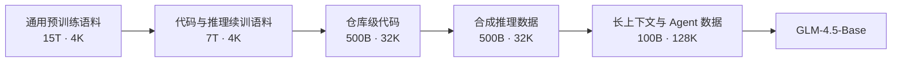
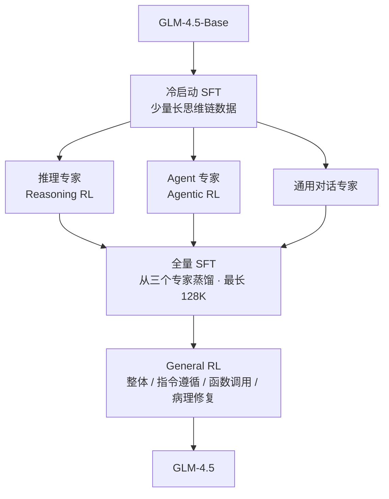
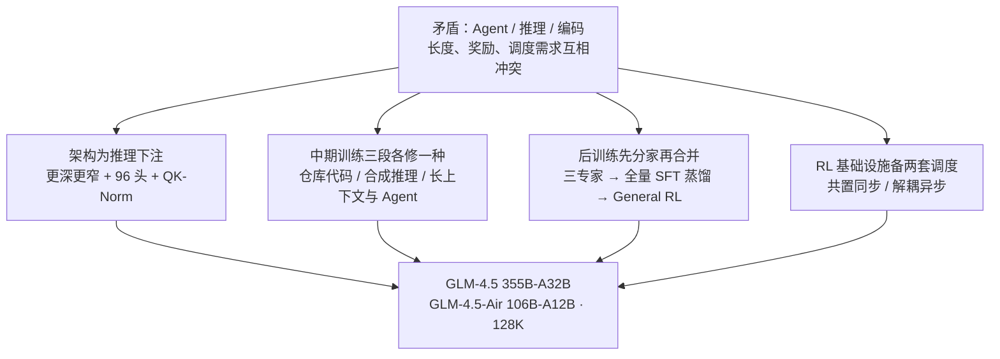

# GLM-4.5：三种能力先分开练，再蒸馏回一套权重

<!-- release-date: 2025-07-28 -->

> 本文依据 GLM-4.5 Team（智谱 Z.ai 与清华大学）的 **GLM-4.5: Agentic, Reasoning, and Coding (ARC) Foundation Models**，arXiv:2508.06471v1，2025-08-08 提交，共 26 页（正文 p. 1–21，作者名单 p. 22，参考文献 p. 23–26）。页码均指 PDF 自身的页码。文中区分三件事：**报告明确写了什么**、**我们怎么解释它**、**哪些是外部资料补充**。

## 阅读前先认识几个词

- **MoE（Mixture-of-Experts，混合专家）**：模型里放很多组「专家」参数，每个 Token 只激活其中几组。总参数很大，单次计算却不大。
- **GQA（Grouped-Query Attention，分组查询注意力）**：多个 Query 头共用一组 Key/Value，用来省 KV 缓存。
- **MTP（Multi-Token Prediction，多 Token 预测）**：训练时多预测后面几个 Token；推理时这一层可以当投机解码的草稿。
- **SFT 与 RL**：监督微调是拿「问题—答案」对直接训；强化学习是让模型自己生成，再按结果好坏调参数。
- **rollout（轨迹采样）**：RL 里模型实际生成的一次完整过程。对 Agent 来说，一条 rollout 可能含几十次工具调用。
- **harness（评测脚手架）**：跑 Agent 评测时套在模型外面的框架，负责给工具、管上下文、限步数。换 harness，分数会明显变。
- **蒸馏（distillation）**：先用昂贵的方式得到一个更强的模型，再让它生成数据，喂回一个更方便的模型。这篇报告把它用了三次。

## 一句话先说清

报告的标题就是骨架：**Agentic（用工具与外部世界打交道）、Reasoning（多步推理）、Coding（真实软件工程）三种能力，要住进同一套权重**（PDF p. 2）。

难处在于这三件事的训练条件处处相反：

- **输出长度相反**：推理 RL 把输出上限开到 64K（PDF p. 8）；Agent 每一轮要短促、格式严格、赶紧去调工具；闲聊最好一句话回完。
- **奖励形状相反**：数学对错可以程序判定；Agent 的奖励要等几十轮工具调用之后才知道。
- **训练系统的最优形态相反**：推理 RL 的 rollout 长度整齐，训练与推理共用一批 GPU 最省；Agent RL 的 rollout 长短悬殊，必须拆开异步，否则大半 GPU 在等最慢的那一条（PDF p. 13）。

GLM-4.5 的回答是报告自己起名的 **Expert Model Iteration（专家模型迭代）**（PDF p. 5）：

> **先让每种能力在最适合它的条件下单独练到最好，再把练出来的东西以数据的形式蒸馏回同一个模型。**

这条思路在报告里出现三次，颗粒度一次比一次细：

1. **整体**：先训推理、Agent、通用对话三个专家，再用它们生成的数据做一次全量 SFT，合成一个混合推理模型（PDF p. 5–6）；
2. **Agentic RL 内部**：RL 训到平台期，就用当前模型的输出替换冷启动数据，重训 SFT，再接着 RL（PDF p. 10）；
3. **单项能力**：端到端多轮函数调用先训专门的专家模型，再蒸馏进主模型（PDF p. 12）。

模型本身：GLM-4.5 是 355B 总参数、32B 激活的 MoE，另有 106B 总参数、12B 激活的 GLM-4.5-Air，两者都支持思考与直答两种模式，训练共 23T Token（PDF p. 1–3）。在 12 项 ARC 基准的平均分上，GLM-4.5 排第三、Agent 类排第二（PDF p. 1–2）。

## 先看全景

### 预训练与中期训练



按 PDF p. 4 Figure 3 重画，箭头只表示顺序。前两格是**预训练**，后三格是**中期训练**（mid-training）。五段合计 $15+7+0.5+0.5+0.1=23.1$T，与摘要的 23T 对得上（PDF p. 1）；逐段的 Token 数只出现在 Figure 3 里，正文没有逐项写。

### 后训练



根据 PDF p. 5–12 的文字重画，报告没有这张流程原图。

### 模型配置


Table 1 的完整数字（PDF p. 3）。参数计数**含 MTP 层，不含词嵌入与输出层**：

| 配置 | GLM-4.5 | GLM-4.5-Air | DeepSeek-V3 | Kimi K2 |
|---|---:|---:|---:|---:|
| 总参数 / 激活参数 | 355B / 32B | 106B / 12B | 671B / 37B | 1043B / 32B |
| 稠密层 / MoE 层 / MTP 层 | 3 / 89 / 1 | 1 / 45 / 1 | 3 / 58 / 1 | 1 / 60 / 0 |
| 隐藏维度 | 5120 | 4096 | 7168 | 7168 |
| 稠密 FFN 中间维度 | 12288 | 10944 | 18432 | 18432 |
| MoE 中间维度 | 1536 | 1408 | 2048 | 2048 |
| 注意力头维 / 头数 / KV 头数 | 128 / 96 / 8 | 128 / 96 / 8 | 192 / 128 / 128 | 192 / 64 / 64 |
| 专家总数 / 每 Token 激活 / 共享 | 160 / 8 / 1 | 128 / 8 / 1 | 256 / 8 / 1 | 384 / 8 / 1 |
| QK-Norm | 是 | 否 | 否 | 否 |

用表里的数做一次自洽检查（本文算术）：一个 MoE 层有 161 个专家、每个 $3\times 5120\times 1536\approx 23.6$M 参数，合约 3.80B；注意力的 Q、K、V、O 投影合约 0.14B；89 层约 350B，加上 3 个稠密层和 MTP 层，落在 355B 附近。每 Token 走 9 个专家，同口径算激活约 32B。表格自洽。

## 架构：为推理下注，更深、更多头

### 更深更窄：一句话的理由

报告拿来对照的 DeepSeek-V3 与 Kimi K2 都走宽路线：隐藏维度 7168，路由专家 256 到 384 个。GLM-4.5 反过来：**降低宽度（隐藏维度与路由专家数），增加高度（层数）**（PDF p. 2）。

理由只有一句：团队发现**更深的模型推理能力更好**（PDF p. 2）。没有对照实验，没有曲线，也没说在什么规模上试的。它是作者的观察，不是被实验证明的结论。

代价报告没写。按常理推（本文推断）：层数从 61 涨到 92，流水线的级数更多，每层的矩阵更小，单个算子的利用率会降。

### 96 个头：不降 loss，却涨分

惯例是「头数 = 隐藏维度 ÷ 头维」，5120 ÷ 128 = 40 个头。GLM-4.5 用了 96 个，报告称「2.5 倍」（PDF p. 3，按 96/40 实为 2.4 倍）。

报告说了一句反直觉的话：增加头数**并不降低训练 loss**，但**持续提升 MMLU、BBH 这类推理基准**（PDF p. 3）。

这句话的分量在于：训练 loss 是预训练唯一的直接优化目标，一个改动不降 loss 却涨下游分，说明 loss 与推理能力之间不是单调关系；只按 loss 做架构搜索，这个设计会被淘汰。可惜报告同样没给数字或曲线。

放进上图的对照里看还有一层：DeepSeek-V3 的 $128\times 192=24576$ 也是其隐藏维度的 3.4 倍，所以「注意力远宽于隐藏维度」并不是 GLM-4.5 独有的选择（本文对 Table 1 的读法）。代价是 Q 投影 5120→12288、输出投影 12288→5120，注意力的参数与计算按这个倍数放大，报告没有量化。

### 其余几件成熟配件

（PDF p. 2–3）

- **MoE 路由**：无辅助损失负载均衡（loss-free balance routing）加 sigmoid 门控；
- **GQA 加 partial RoPE**：96 个 Query 头共用 8 组 KV；partial RoPE 指只对头维的一部分做旋转，报告没写比例；
- **QK-Norm**：算注意力分数前对 Query 与 Key 各做归一化，稳住 logits 的取值范围。Table 1 里只有 GLM-4.5 开了，Air 没开，报告没解释；
- **MTP 层**：两个模型都加了一个 **MoE 层**作 MTP 层，用来在推理时支持投机解码。报告没有给任何接受率、加速比或部署配置，整篇也没有推理部署章节。

## 数据与课程：ARC 三件事在中期训练里各占一段

### 预训练：四类语料各有处理办法

语料来自网页、社交媒体、书籍、论文和代码仓库（PDF p. 3）。预训练分两段：第一段主要训网页通用文档；第二段上采样 GitHub 源码以及与编程、数学、科学相关的网页（PDF p. 4）。对照 Figure 3，两段是 15T 与 7T。

- **网页**（PDF p. 3–4）：借鉴 Nemotron-CC，按质量分把网页分桶，高分桶上采样、最低分桶丢弃；**最高质量的桶在预训练里贡献超过 3.2 个 epoch**。意图是既强调推理需要的高频知识，又保住长尾世界知识的覆盖。一个坑：大量由模板自动生成的相似网页拿到高分，而 MinHash 去重删不掉它们，于是额外跑 SemDedup，按文档向量的语义相似度再去一遍重。
- **多语言**（PDF p. 4）：来自自抓网页与 Fineweb-2，用判断「教育价值」的质量分类器上采样高质量文档。
- **代码**（PDF p. 4）：规则初筛 → 分语言的质量模型分高中低三档，上采样高质量、排除低质量 → **所有源码用 FIM（Fill-In-the-Middle，中间填空）目标** → 代码相关网页走两段召回（含 HTML 代码标签，或被 FastText 分类器判为代码相关），再按质量分三档 → 用细粒度解析器重新解析选中的网页，尽量保住代码的格式与内容。
- **数学与科学**（PDF p. 4）：用一个大模型给候选文档打「数学科学教育内容占比」分，再训一个小分类器去预测这个分，把预训练语料里超过阈值的文档上采样。

> **可迁移的一条：质量分类器和去重会互相打架。** 只看「像不像高质量文本」的分类器，恰恰喜欢结构工整的模板页；字面去重挡不住它们，要上语义去重。

### 中期训练：三段各修一种能力

报告对中期训练的定义是：不同于在大规模通用文档上的传统预训练，这些阶段用**中等规模的领域数据，含指令数据**（PDF p. 4）。三段正好对着 ARC：

- **仓库级代码（500B，32K）→ Coding**：把同一仓库的代码文件拼起来学跨文件依赖；再加模型筛过的 GitHub issue、PR 与 commit，相关的拼进同一个上下文，commit 用类 diff 格式（PDF p. 4–5）。序列长度扩到 32K 就是为了塞下大仓库。
- **合成推理数据（500B，32K）→ Reasoning**：从网页和书里收集数学、科学、编程竞赛的问答，用一个推理模型把推理过程合成出来（PDF p. 5）。题和答案是真的，中间过程是生成的。
- **长上下文与 Agent（100B，128K）→ Agentic**：扩到 128K，上采样预训练语料里的长文档，并加入大规模合成的 Agent 轨迹（PDF p. 5）。

### 打包：预训练不护边界，中期训练护

（PDF p. 5）预训练**不用** best-fit packing，因为随机截断对预训练文档是很好的数据增强；中期训练**用** best-fit packing，免得把推理过程或仓库级代码从中间截断。

一段推理链被截掉一半就是错的；一篇网页被截掉一半仍然是合法的语言。**样本的价值在完整性时才需要护边界。**

### 超参

（PDF p. 5）

- **优化器 Muon**，作用于除词嵌入、bias 与 RMSNorm 权重外的全部参数；Newton-Schulz 迭代 $N=5$，动量 $\mu=0.95$，**Muon 的更新 RMS 缩放到 0.2**。报告观察到 Muon 能加速收敛、容忍更大 batch。
- **学习率用余弦衰减，不用 WSD**（warmup-stable-decay）。早期实验里 WSD 训出的模型在 SimpleQA、MMLU 上更差，报告解读为稳定段欠拟合。学习率从 0 预热到 $2.5\times 10^{-4}$，一路衰减到 $2.5\times 10^{-5}$，直到中期训练结束——衰减跨越了预训练与中期训练，不是每段各来一次。
- **batch 预热**：前 500B Token 内从 16M Token 涨到 64M Token，之后不变。
- 权重衰减 0.1，不用 dropout。
- 扩到 32K 时 RoPE 基频从 10,000 调到 1,000,000。

有两个旋钮在训练中途换值：

| 旋钮 | 前 15T Token | 之后 |
|---|---:|---:|
| 无辅助损失均衡的偏置更新率 | 0.001 | 0.0 |
| MTP 损失权重 $\lambda$ | 0.3 | 0.1 |

另有一个权重 0.0001 的序列级辅助均衡损失，防止单条序列内部极端不均衡。偏置更新率设成 0，等于**从 15T 起冻结专家的负载分布**。两个旋钮都在 15T 换值，而 Figure 3 的通用预训练正好是 15T，所以 15T 就是「通用段结束、代码与推理段开始」的分界——这个对应是本文从两处数字读出来的，报告没有明说。

## 后训练：专家模型迭代

### 两段 SFT，两种用途

后训练分两段（PDF p. 5）：**阶段一（Expert Training）** 构造推理、Agent、通用对话三个专家；**阶段二（Unified Training）** 用自蒸馏把多个专家合成一个既能深思、也能直答的模型。

两段开头都做 SFT，目的不同（PDF p. 5–6）：

- **冷启动 SFT**：用少量带长思维链的数据，给每个专家打底，让后面的专家 RL 有东西可优化；
- **全量 SFT**：从三个专家收集数百万条样本——推理（数学、代码、科学）、通用对话（写作、翻译、摘要、闲聊）、Agent（基础工具使用、面向真实项目开发的编码）与长上下文理解——训练最长 128K。

混合推理怎么来的，报告只有一句（PDF p. 6）：闲聊这类要快速回应的领域不需要长思考，所以**仔细平衡了「带完整推理」与「不带显式思考」两类数据**。也就是说，**混合推理不是一个架构开关，是一个数据配比问题**。

### 函数调用模板：用 XML 标签代替 JSON 转义

这是全篇最小、也最好抄的一个改动（PDF p. 6）。函数调用参数通常用 JSON 表示；参数里装的是代码时，引号、反斜杠、换行都要转义，模型要生成大量转义字符，报告说这增加了学习负担。对以函数调用为核心能力的 Agent 基座，这不是小事。

新模板用 XML 风格的特殊 token 标签把键和值包起来。下面摘自报告 Figure 4 的示例（PDF p. 6–7，只保留模型输出的一段）：

```text
<tool_call>get_weather
<arg_key>city</arg_key>
<arg_value>Beijing</arg_value>
<arg_key>date</arg_key>
<arg_value>2024-06-27</arg_value>
</tool_call>
```

值的边界由标签决定，不由引号决定，所以绝大多数代码可以原样写进 `<arg_value>` 里，不必转义。报告给的结论是否定式的：实验表明新模板**不损害函数调用的执行表现，同时减少了转义**（PDF p. 6）——它没说提升了分数，也没给对照数字。同一个示例里 `<think>` 块和 `<tool_call>` 块并排出现，这就是混合推理在模板层面的样子。

### 三个提数据质量的做法

- **拒绝采样**（PDF p. 7）：删掉重复、过短、截断、不符合推理格式的样本；有客观答案的校验正确性；主观题用奖励模型过滤；工具调用场景检查调用协议，并**验证轨迹是否到达预期的终止状态**。最后一条是 Agent 数据特有的：每一步格式都对，事情却可能没做完。
- **提示筛选与回答级扩展**（PDF p. 7）：**按回答长度删掉后 50% 的提示**，数学与科学任务提升 2%–4%，而只用了一半数据；在剩下的难题上**每题生成四个回答**，再加 1%–2%。回答长度被当成难度的代理指标——几乎免费的信号替代了昂贵的难度标注。报告没说这是在什么基线与规模上测的。
- **自动构造 Agent SFT 数据**（PDF p. 7）：收集 Agent 框架、真实工具 API 与 MCP server，并用大模型构造、模拟一批工具 → 对成熟框架让大模型理解其功能后生成任务，对零散工具先选代表子集再造任务，覆盖单步与多步调用 → 用现有大模型生成调用轨迹，再让大模型扮演用户，把多步任务转成多轮对话 → 用多个裁判 Agent 判断是否完成，只留成功的轨迹。连工具本身都可以是造的。

## Reasoning RL：四个在小模型上验证的技巧

算法底子是 GRPO，**去掉了 KL 损失项**（PDF p. 7）。先记住报告自己写的边界：**本节的对比曲线来自更小的实验模型，不是 GLM-4.5**（PDF p. 7）。下面四组实验证明的是「这些技巧在小规模上有效」，不是它们在 355B 上贡献了多少分。

### 难度课程：让一组回答里重新有对有错


*引自 PDF p. 8 Figure 5。*

GRPO 类方法的优势是「本组内的相对好坏」。模型变强后简单题一整组全对，早期难题一整组全错，两种情况都没有奖励方差，也就没有梯度（PDF p. 7–8）。

做法是两阶段难度课程：第一阶段用中等难度题，每题采 16 条；第二阶段换成**极难题：pass@8 = 0 但 pass@512 > 0**，每题采 512 条（PDF p. 8）。这个定义很讲究：pass@8 = 0 保证对当前模型够难，pass@512 > 0 保证不是无解，512 次里能中一次，这道题就还能给出奖励方差。第二阶段的题**全部来自答案经过验证的题库**（PDF p. 8）。

图上 81.8% 是两条线的分岔点；此后基线没有再创新高，换了极难题的那条爬到 83.4%。代价报告没算：每题 512 条是第一阶段的 32 倍，题池多大、筛出 pass@512 > 0 本身要花多少采样，都没写。

### 直接在 64K 上做单阶段 RL


*引自 PDF p. 8 Figure 6。*

已有工作（报告引 DeepScaleR）建议分阶段逐步放开最大输出长度。报告的实验结论相反（PDF p. 8）：冷启动 SFT 已经让模型习惯生成 64K 长的回答，再插入上限更短的 RL 阶段会让模型「忘掉」长上下文能力，平均输出长度下降，性能出现「显著且不可逆」的下滑，最后的 64K 阶段也补不回来。终点是单阶段 83.4% 对多阶段 80.6%。

读图要多看一眼（本文的读法）：蓝线在多阶段训练里**一路在涨，看不到下滑段**；两条线的差距在第 0 步就有约 14 分（约 61 对 75），之后逐渐缩到 2.8 分。第 0 步还没训练，这个差距更像是 16K 上限本身截断了长回答，而不是 RL 让模型「遗忘」。结论「单阶段更好」有图支持，「多阶段造成不可逆下滑」这个机制解释从图上看不出来。另外这条结论依赖「冷启动已在 64K 上训过」这个前提；若冷启动模型本来就不会写长回答，渐进式课程未必错。

### 动态采样温度

固定温度的问题是：策略越来越集中（熵下降）时，同一个温度带来的实际多样性越来越少，后期探索不足（PDF p. 9）。做法：rollout 平均奖励趋稳时判定进入收敛期，**提高温度**；为防噪声，定期在留出验证集上扫一组温度，下一阶段取「**比当前最优掉分不超过 1% 的最大温度**」（PDF p. 9）。往探索方向贪心走，但不许越过一条可测量的红线。这一条没有给对照曲线。

### 代码 RL 与科学 RL


*引自 PDF p. 9 Figure 7。*

报告说数学之外的 RL 在文献里关注得少，于是各做了一组对照（PDF p. 9）：

- **代码 RL：损失怎么聚合**。token 加权平均损失对常规的序列平均损失。报告的解释是 token 加权给出更细、更稳的梯度信号，并缓解序列级奖励里固有的长度偏置，抑制过于简单或重复的「base case」样本。读图：两条线的终点几乎一样（46.5 对 46.3），token 加权早约 800 步到达。**赢的是速度，不是上限**，报告自己的措辞也是「收敛更快」。
- **科学 RL：数据质量**。只用一小批专家验证过的选择题，对混合质量的科学数据。报告说前者明显更好。读图要注意 65.8% 是一个单点尖峰，那条线之后回落到约 63%；两条线在大部分步数上相差约 1 分，而蓝线只画到约 230 步。「更好」成立，但 65.8 对 62.9 这组数字夸大了差距。

序列平均为什么有长度偏置（本文解释）：损失按序列平均时，一条 1000 Token 的回答里每个 Token 分到的权重只有一条 100 Token 回答的十分之一，模型于是倾向把回答写短，在代码里写短的极端就是只处理边界情况。

## Agentic RL：可验证性决定了挑哪些任务

### 只挑能自动判分的任务

报告的逻辑（PDF p. 9）：RL 在数学、编程竞赛上挖出了强推理与好的规模化行为，共同点是结果可客观验证。于是 Agentic RL 只聚焦**网页搜索**与**代码生成**两类，因为其中每一个动作或答案都能被自动检查，内建的可验证性提供了密集、可靠的奖励。

**不是挑最有商业价值的 Agent 任务，是挑能自动判分的。** 其余 Agent 能力只能靠泛化，或靠后面 General RL 里的函数调用 RL 单独补。

数据（PDF p. 10）：

- **网页搜索**：两条路线混合。自动化流水线在知识图谱上做多跳推理生成问题；人在环中从若干网页里抽取内容并做**选择性混淆**——把关键实体换成间接描述，逼模型真去搜；
- **软件工程**：收集大量 GitHub PR 与 issue，做成「用户提示 + 可执行单元测试」的真实开发基准，全部跑在一个加固的分布式沙箱里，兼顾横向扩展与强隔离。

### 目标函数：一个缺了一项的式子

对每个问题 $x$，从旧策略采 $K$ 条轨迹，报告写出的目标是（PDF p. 10）：

$$
L_{\mathrm{RL}}(\theta)=\mathbb{E}_{x\sim\mathcal D}\left[\frac{1}{K}\sum_{i=1}^{K}\big(r(x,y_i)-\bar r(x)\big)\right],
\qquad \bar r(x)=\frac{1}{K}\sum_{i=1}^{K}r(x,y_i)
$$

意思是：每条轨迹的奖励减去本组平均就是它的优势，比平均好的推高、差的压低，不需要价值网络。

但要读准一件事：**按字面，这个式子恒等于 0**——一组数减去自己的平均再求和就是 0，里面也没有出现 $\theta$。显然漏写了策略项（通常是优势乘以 $\log\pi_\theta(y_i\mid x)$ 或重要性比）。此外它没有除以组内标准差、没有 KL、没有裁剪项。报告没说明这些是省略还是有意去掉，读的时候不要假设它等价于某个已知算法（本文的判断）。

紧跟着一句重要的实现细节（PDF p. 10）：**只有模型生成的 Token 参与优化，环境反馈在损失里被忽略。** 一条 Agent 轨迹里既有模型写的思考与工具调用，也有工具返回、报错、模拟用户的话；后者不是模型的动作，算进损失就等于让模型学着预测工具会返回什么。

### 奖励与过程格式惩罚

（PDF p. 10）网页搜索用最终答案的正确性作整条轨迹的奖励；代码 Agent 主要用带可验证测试用例的 SWE 数据。在此之上加一道**过程格式惩罚**：生成过程中一旦工具调用格式出错，**立即中止，整条轨迹零奖励**。不是扣分，是清零加中止，格式正确成了一切奖励的前置条件。

报告还说，在网页搜索与 SWE 上做 RL 会带来其他任务的普遍提升，如通用工具使用与 Terminal-Bench（PDF p. 10）。这是一句观察，没有对照实验。

### 迭代自蒸馏

Agent 任务上的 RL 很慢，一条 rollout 要跑几十轮工具调用和沙箱执行（PDF p. 10）。做法：

1. 在冷启动模型上做 RL；
2. 训到一定步数或走平后，**用 RL 模型生成的回答替换原来的冷启动数据**，重训出一个更好的 SFT 模型；
3. 在这个模型上继续 RL，并逐步提高训练难度；
4. 循环。

RL 负责探索，SFT 负责把 RL 辛苦挣来的行为用便宜的监督学习一次固化，再从更高的起点重新爬。代价是每轮都要重训 SFT；自蒸馏会放大模型自己的偏好，多轮后多样性可能下降，报告没讨论后一点。

### 交互轮数是 Agent 的测试时扩展

推理模型的测试时扩展是多生成 Token；报告说 Agent 的对应物是**多和环境交互几轮**，比如为一条难找的信息反复搜索，或给编码任务写测试来自检自纠（PDF p. 10）。Figure 8（PDF p. 11）是 BrowseComp 准确率随测试时计算量（对数横轴，标 8 到 128）的散点，读图约值如下：

| 横轴位置 | 约 8 | 约 12 | 约 16 | 约 24 | 约 32 | 约 48 | 约 64 | 约 96 |
|---|---:|---:|---:|---:|---:|---:|---:|---:|
| BrowseComp 准确率 | 4.3% | 7.8% | 11.5% | 15.8% | 19.2% | 23.3% | 25.7% | 26.4% |

报告的说法是「准确率随测试时计算平滑扩展」。从 8 到 64 在对数轴上近似一条直线；最后一段从约 25.7% 到 26.4%，**已经明显变平**。最右一点与 Table 3 的 BrowseComp 26.4 一致（PDF p. 15）。报告没给每一轮的时间与 Token 成本。

## General RL：把剩下的坑一个个填

General RL 的核心是一个多源反馈系统：规则反馈的精确、人类反馈（RLHF）的细腻、模型反馈（RLAIF）的可扩展（PDF p. 10）。四个子任务：

**整体 RL**（PDF p. 11）：约 5,000 条提示的均衡数据集，覆盖 7 个一级、33 个二级、139 个三级类目。人类侧训一个偏好奖励模型，标注者按指令遵循、安全、事实正确等多维度比较；模型侧**按提示有没有客观标准答案设计两套评分细则**。

**指令遵循 RL**（PDF p. 11）：约束类型体系分 7 个大类、151 个小类；反馈由**确定性验证规则 + 奖励模型 + 批评模型**三部分组成。Figure 9 是**单独做指令遵循 RL、不混其他 General RL 任务**时的曲线：约 1000 步内奖励从约 0 升到约 2.0，SysBench-ISR 从 64.8 升到 77.2，两者同步。报告的措辞很克制：到约 1000 步为止，**没有观察到明显的奖励作弊迹象**（PDF p. 11）——是「这个窗口内没看到」，不是「不会发生」。

**函数调用 RL**（PDF p. 11–12）分两半：

- **分步规则 RL**：对调用流程明确的任务，为每一步标注真值调用；给定任务和之前各步，模型生成下一个回复。奖励严格二值：

$$
\mathrm{Reward}=
\begin{cases}
1, & \mathrm{FormatCorrect}(a_t)\ \text{且}\ \mathrm{Match}(a_t,a_t^{*})\\
0, & \text{否则}
\end{cases}
$$

$a_t$ 是模型的第 $t$ 次调用，$a_t^{*}$ 是真值；名称、参数、每个字段都完全一致才给 1。

- **端到端多轮 RL**：分步 RL 把任务拆成静态、预定的决策流，模型不能自主探索和规划。于是让模型先生成完整轨迹，再按任务是否完成给奖励：

$$
\mathrm{Reward}=
\begin{cases}
1, & \mathrm{FormatCorrect}(a_1,\dots,a_T)\ \text{且}\ \mathrm{TaskCompleted}(I,o_0,a_1,o_1,\dots,a_T,o_T)\\
0, & \text{否则}
\end{cases}
$$

$I$ 是原始任务，$o_t$ 是工具反馈或用户信息；是否完成由环境按预定义规则判定，或由一个 LLM 裁判 Agent 判定。任务分两类：单轮多步（基于 MCP server 自动合成的复杂任务，以及 AgentGym 这类带可运行环境的开源数据集）与多轮多步（还要和一个 LLM 模拟的用户交互来拿全任务信息）。

「先分家再合并」在这里出现了第三次：分步规则 RL 因为输出长度与收敛速度和其他任务相近，**直接并进通用 RL 框架**；端到端多轮 RL 则**先训专家模型，再蒸馏进主模型**（PDF p. 11–12）。判据是这个任务的 rollout 形态与其他任务差多远。

**病理 RL**（Pathology RL，PDF p. 12）：后训练的最后一步，专修语言混杂、过度重复、格式错误。这些毛病的发生率**往往不到输出的 1%**，在通用 RL 里顺带惩罚样本效率极低。做法是专门收集**极易触发这些行为的提示**建一个数据集，在上面集中施加惩罚。

> **可迁移的一条：发生率很低的问题，不要在通用数据上等它出现，去构造一个专门放大它的数据集。**

## RL 基础设施：slime，同步与异步都要

RL 基础设施建在团队自研开源的 slime 上（PDF p. 12）。Figure 10（PDF p. 13）给了三个模块：**Training（Megatron）** 从 Data Buffer 读数据训练，训完把参数同步给 rollout；**Rollout（SGLang + Router）** 生成新数据（含奖励与验证器输出）写回 Data Buffer；**Data Buffer** 管提示初始化、自定义数据与 rollout 生成策略。


同一套系统支持两种模式，按任务选（PDF p. 13）：

- **共置同步**：训练与推理引擎在同一批 worker 上，配合动态采样显著减少 GPU 空闲。适合通用 RL 与提升推理的任务（数学、代码生成）；
- **解耦异步**：rollout 组件直接暴露给 Agent 环境，训练与推理 GPU 独立调度，Agent 环境持续产数据而不被训练周期卡住。适合软件工程这类数据生成漫长、系统交互复杂的 Agent 任务。

底层靠 Ray 的资源调度，把推理与训练引擎灵活放在同一张卡或不同的卡上（PDF p. 13）。判据可以直接带走：**看 rollout 的长度分布**，整齐就共置省机器，长短悬殊就解耦省等待。

另外三件事（PDF p. 13–14）：

- **BF16 训练、FP8 推理**：每次策略更新后、参数下发去做 rollout 之前，在线做块级 FP8 量化，显著提升数据收集吞吐。没给倍数；训推两侧精度不同带来的概率不一致，报告没有讨论；
- **高并发 Docker 运行时**：为每个任务提供隔离环境，大幅降低 rollout 开销；完全异步的训练循环把 GPU 分成专用的 rollout 引擎与训练引擎，训练引擎定期把权重同步回去；
- **统一 HTTP 端点 + 中央数据池**：不同 Agent 框架各有所长，直接用它们既能提升任务表现，也能保持训练与推理一致。因为**大多数 Agent 框架产出的 rollout 都是 message-list 格式**，所有轨迹统一存进一个数据池，任务专属的 rollout 逻辑与 RL 训练干净解耦；数据池还支持按任务定制的过滤与动态采样。

第三条最有工程价值：**找到所有 Agent 框架都能落到的最小公共表示，再让所有任务在这个表示上汇合**，否则每接一个框架就要改一份训练代码。

## 评测：先看条件，再看分数

### 条件清单

| 评测 | 关键条件 |
|---|---|
| GLM-4.5-Base | 取**预训练最后一个 checkpoint**；未训过指令数据；内部评测框架（PDF p. 14） |
| TAU-bench | Retail 与 Airline 两个域，用**自己优化过的用户模拟器**，提示词全文见 Figure 11（PDF p. 15–16） |
| AIME 24 / GPQA | 分别取 32 次与 8 次采样平均；用一个 LLM 做答案校验（PDF p. 16） |
| HLE | 只评纯文本题，GPT-4o 判对错（PDF p. 16） |
| LiveCodeBench | 只取 2024-07-01 到 2025-01-01 的题（PDF p. 16 脚注） |
| SWE-bench Verified | OpenHands v0.34.0，限 100 轮，**历史截断以免超过 128K**，temperature=0.6、top_p=1.0（PDF p. 16–17） |
| Terminal-Bench | Terminus 框架，用标准函数调用而非直接提示（PDF p. 17） |
| 通用对话人工评测 | 660 条提示（英文 392、中文 108、其他语言 160），随机顺序，**同一位评委**打 0–10 分，不向评委展示思考内容（PDF p. 18） |
| CC-Bench | 基于 Claude Code 的 52 个编程任务，隔离容器，**人类专家多轮交互**测试（PDF p. 19–20） |

三件事直接影响分数怎么读：

1. **TAU-bench 的用户模拟器是自己调过的**，被要求不一次给出全部指令、不放松时间/预算/措辞约束、任务确认完成前不结束对话（PDF p. 15–16）。报告没说对照模型是否用了同一个模拟器。
2. **Base 取的是预训练最后一个 checkpoint**（PDF p. 14）。按字面，它可能不含中期训练里那 500B 合成推理数据；报告没有说清。
3. **人工评测只有一位评委**（PDF p. 18）。理由是同一人同一时间批量比较能减少个体偏好差异；代价是看不到评委间一致性。

### 基座

（PDF p. 14，Table 2，摘几行）

| Benchmark | Qwen3-235B-A22B Base | Llama4-Maverick 400B Base | DeepSeek-V3 Base | Kimi-K2 Base | GLM-4.5 Base |
|---|---:|---:|---:|---:|---:|
| 激活 / 总参数 | 22B / 235B | 17B / 400B | 37B / 671B | 32B / 1043B | 32B / 355B |
| SimpleQA | – | – | 26.6 | **35.3** | 30.0 |
| BBH | **88.9** | 87.1 | 88.4 | 88.7 | 86.2 |
| MMLU | **87.8** | 85.2 | 87.2 | **87.8** | 86.1 |
| EvalPlus | 77.6 | 65.5 | 65.6 | **80.3** | 78.1 |
| LiveCodeBench-Base | – | 25.1 | 24.6 | 26.3 | **28.1** |
| GSM8K | **94.4** | 87.7 | 87.6 | 92.1 | 79.4 |
| MATH | **71.8** | 63.3 | 62.6 | 70.2 | 61.0 |
| C-Eval | – | 80.9 | 90.1 | **92.5** | 86.9 |
| Chinese-SimpleQA | – | 53.5 | 72.1 | **77.6** | 70.1 |

报告的结论只有一句：GLM-4.5-Base 在英文、代码、数学、中文各类基准上都**稳定**，验证了把所有能力统一进一个模型的想法（PDF p. 14）。逐列看：

- **代码强**：LiveCodeBench-Base 28.1 全表最高，EvalPlus 78.1 仅次于总参数近三倍的 Kimi-K2 Base；
- **数学弱**：GSM8K 79.4、MATH 61.0 都是全表最低，与 Qwen3-235B 的 94.4 / 71.8 差很多；
- **BBH、MMLU 也是全表最低**。

报告没有解释数学为什么弱。上面第 2 条口径提醒：如果这个 checkpoint 确实不含中期训练，那弱项可能部分在中期训练里就补上了；报告没给中期训练后的基座分数，无从判断。最终模型的 AIME 24 是 91.0（PDF p. 16）。

### ARC 三张主表

**Agentic**（Table 3，PDF p. 15）：

| Benchmark | GLM-4.5 | GLM-4.5-Air | o3 | o4 mini | GPT-4.1 | Claude Opus 4 | Claude Sonnet 4 | Gemini 2.5 Pro | Kimi K2 | Grok 4 |
|---|---:|---:|---:|---:|---:|---:|---:|---:|---:|---:|
| TAU-Retail | 79.7 | 77.9 | 70.4 | 65.6 | 75.1 | **81.4** | 80.5 | 77.0 | 73.9 | 76.5 |
| TAU-Airline | 60.4 | **60.8** | 52.0 | 49.2 | 48.8 | 59.6 | 60.0 | 48.0 | 51.2 | 58.4 |
| BFCL V3 | **77.8** | 76.4 | 72.4 | 67.2 | 68.9 | 74.4 | 75.2 | 61.2 | 71.1 | 66.2 |
| BrowseComp | 26.4 | 21.3 | **49.7** | 28.3 | 4.1 | 18.8 | 14.7 | 7.6 | 7.9 | 32.6 |
| 平均 | 58.1 | 55.7 | **61.1** | 50.1 | 45.0 | 54.6 | 53.4 | 43.8 | 47.2 | 55.4 |

「平均」一行把 TAU 两个域先合成一项：$(79.7+60.4)/2\approx 70.1$，这就是摘要里的「TAU-Bench 70.1%」；再与 BFCL、BrowseComp 三项平均得 58.1（本文核算）。形状很清楚：**BFCL 第一，BrowseComp 离 o3 很远**（26.4 对 49.7），报告也承认 o3 在 BrowseComp 上远好于其他模型（PDF p. 15）。「Agent 类第二」主要靠 TAU 与 BFCL 撑起来，不是靠深度搜索。

**Reasoning**（Table 4，PDF p. 16）：

| Benchmark | GLM-4.5 | GLM-4.5-Air | o3 | Claude Opus 4 | Gemini 2.5 Pro | DeepSeek R1 0528 | Qwen3 235B 2507 | Grok 4 |
|---|---:|---:|---:|---:|---:|---:|---:|---:|
| MMLU Pro | 84.6 | 81.4 | 85.3 | **87.3** | 86.2 | 84.9 | 84.5 | 86.6 |
| AIME 24 | 91.0 | 89.4 | 90.3 | 75.7 | 88.7 | 89.3 | 94.1 | **94.3** |
| MATH 500 | 98.2 | 98.1 | **99.2** | 98.2 | 96.7 | 98.3 | 98.0 | 99.0 |
| SciCode | 41.7 | 37.3 | 41.0 | 39.8 | 42.8 | 40.3 | 42.9 | **45.7** |
| GPQA | 79.1 | 75.0 | 82.7 | 79.6 | 84.4 | 81.3 | 81.1 | **87.7** |
| HLE | 14.4 | 10.6 | 20.0 | 11.7 | 21.1 | 14.9 | 15.8 | **23.9** |
| LCB | 72.9 | 70.7 | 78.4 | 63.6 | 80.1 | 77.0 | 78.2 | **81.9** |
| AA-Index（估） | 67.7 | 64.8 | 70.0 | 64.4 | 70.5 | 68.3 | 69.4 | **73.2** |

报告说 GLM-4.5 在 AIME 24 与 SciCode 上超过 o3，平均超过 Claude Opus 4、接近 DeepSeek-R1-0528（PDF p. 16），与表相符。同时 HLE 14.4、GPQA 79.1 在表里偏后：竞赛数学强，知识密集的研究生级推理弱。

**Coding**（Table 5，PDF p. 16）：

| Benchmark | GLM-4.5 | GLM-4.5-Air | o3 | GPT-4.1 | Claude Opus 4 | Claude Sonnet 4 | Gemini 2.5 Pro | DeepSeek R1 0528 | Kimi K2 |
|---|---:|---:|---:|---:|---:|---:|---:|---:|---:|
| SWE-bench Verified | 64.2 | 57.6 | 69.1 | 48.6 | 67.8 | **70.4** | 49.0 | 41.4 | 65.4 |
| Terminal-Bench | 37.5 | 30.0 | 30.2 | 30.3 | **43.2** | 35.5 | 25.3 | 17.5 | 25.0 |
| 平均 | 50.9 | 43.8 | 49.7 | 39.5 | **55.5** | 53.0 | 37.2 | 29.5 | 45.2 |

Terminal-Bench 超过 Claude Sonnet 4，SWE-bench Verified 低于它。报告的总结是「在编码任务上 GLM-4.5 是 Claude Sonnet 4 最好的竞争者」（PDF p. 17），这个措辞承认了自己不是第一。

### 通用、安全与人工评测

通用对话（Table 6，PDF p. 17，摘几列）：

| Benchmark | GLM-4.5 | GLM-4.5-Air | GPT-4.1 | Gemini 2.5 Pro | Grok 4 | DeepSeek R1 0528 | DeepSeek V3 0324 | Kimi K2 |
|---|---:|---:|---:|---:|---:|---:|---:|---:|
| MMLU | 90.0 | 87.4 | 90.2 | 91.9 | 91.9 | 89.9 | 89.1 | 89.5 |
| SimpleQA | 26.4 | 14.5 | 42.3 | **54.0** | 51.9 | 27.8 | 27.7 | 31.0 |
| IFEval | 86.1 | 86.3 | 87.4 | 90.8 | **92.4** | 80.0 | 83.4 | 89.8 |
| SysBench | 81.0 | 77.4 | 80.6 | 82.2 | 81.5 | 81.2 | 79.8 | 79.0 |
| MultiChallenge | 52.8 | 42.5 | 38.3 | 57.5 | **65.2** | 46.5 | 37.0 | 54.1 |

SimpleQA 只有 26.4，明显低于 Gemini 2.5 Pro 与 Grok 4；报告的角度是参数效率：355B 的 GLM-4.5 与 671B 的 DeepSeek V3、R1 相当（PDF p. 17）。

安全（SafetyBench，11,435 道中英双语选择题、7 类，Table 7，PDF p. 17–18）：GLM-4.5 平均 89.9，与 Kimi K2（90.5）、GPT-4.1（89.7）相当。它自己最弱的一项是「不公平与偏见」77.4，报告点名要改进；但横向看这一列，77.4 仅次于 Gemini 2.5 Pro 的 78.0，高于 Kimi K2（71.3）与 GPT-4.1（74.0）——这一类对所有模型都难。

人工评测（Tables 8–10，PDF p. 18–19）总分：

| 提示语言 | GLM-4.5 | DeepSeek-R1-0528 | Kimi-K2 |
|---|---:|---:|---:|
| 英文（392 条） | **8.66** | 8.62 | 8.13 |
| 中文（108 条） | **8.37** | 8.05 | 7.03 |
| 其他语言（160 条） | **8.49** | 8.27 | 6.63 |

英文上与 DeepSeek-R1-0528 只差 0.04 分。单评委、0–10 分制下，这个差距说明不了什么。

### CC-Bench：报告如实给出的输局

报告的动机是：训练好的模型可能对预定义基准过拟合（PDF p. 17）。CC-Bench 基于 Claude Code，52 个编程任务，隔离容器执行；人类专家从标准化提示开始，根据模型输出反复调整输入，直到完成或失败，同一位专家对所有模型用一致的交互策略。主指标是任务完成度，打平时才看工具调用成功率与 Token 效率（PDF p. 19–20）。

对战结果（PDF p. 19–20，Figure 12）：

| 对手 | 胜 | 平 | 负 |
|---|---:|---:|---:|
| Claude Sonnet 4 | 40.4% | 9.6% | **50.0%** |
| Kimi K2 | **53.9%** | 17.3% | 28.8% |
| Qwen3-Coder | **80.8%** | 7.7% | 11.5% |

对 Claude Sonnet 4 是**输多赢少**，报告原样放进了正文。与 SWE-bench 的差距（64.2 对 70.4）方向一致。

次要指标（PDF p. 19，Figure 13）：

| 模型 | 工具调用成功率 | 每次交互平均 Token（多次调用的输入加输出，不含缓存） |
|---|---:|---:|
| GLM-4.5 | **90.6%** | 1,388,259 |
| Claude Sonnet 4 | 89.5% | **695,921** |
| Kimi K2 | 86.2% | 1,207,152 |
| Qwen3-Coder | 77.1% | 2,069,449 |

报告正文只强调了工具调用成功率最高（PDF p. 20），没评论 Token 消耗。但按图，GLM-4.5 每次交互的 Token 约是 Claude Sonnet 4 的两倍。「每一步都调用成功」与「高效完成任务」是两件事（本文的读法）。

### 逻辑推理与翻译

- **新造的逻辑题**（Table 11，PDF p. 20）：为避开网上常见逻辑题的污染，构造了结构不同的新题，人类专家按统一标准打分。Gemini 2.5 Pro 65.8、DeepSeek-R1-0528 62.1、GLM-4.5 62.0、GLM-4.5-Air 53.4、Kimi K2 51.9。报告的措辞是「与领先模型持平」。
- **翻译**（PDF p. 20–21）：报告先论证现代翻译依赖知识与推理，举了网络用语（「yyds」）、圈内黑话（摄影圈的「胖白」指一只佳能镜头）、表情符号（「鱼」指向闲鱼）、语境推理（「三花公主驾到」的「三花」是猫的花色）四类例子。在 100 个「现有工具常译错」的困难样例上做盲测人工打分（0–3 分）：GLM-4.5 1.71，Qwen-MT-plus 0.38、Qwen-MT-turbo 0.55、Seed-X 0.65（Table 12）。对手都是专用翻译模型，样例又是专挑它们常错的，所以这组数据支持的是「通用模型的世界知识在这类翻译上有优势」，不是「翻译整体好于专用模型」。

### 图与表对不上的几处

1. **Figure 1 的分面板与表格**（PDF p. 1 与 p. 15–16）：GLM-4.5-Air 的 Agentic 柱是 55.2、Coding 柱是 41.5，而 Table 3、Table 5 的平均是 55.7、43.8；GLM-4.5 的 Reasoning 柱是 68.8，而 Table 4 七项的简单平均约 69.0、AA-Index 是 67.7，两个口径都对不上。其余如 GLM-4.5 的 58.1、50.9 与总榜 63.2，都能由表算出。Figure 1 里 Claude Sonnet 4 的 Agentic 柱 53.0 对 Table 3 的 53.4，o4-mini (high) 51.0 对 Table 3 的 o4 mini 50.1（后者可能是不同配置）。
2. **长上下文**：做了 128K 训练，全文没有一项长上下文评测；而参考文献里列着 LongBench、LongBench v2、RULER、Michelangelo、QwenLong-L1 等长上下文工作，正文从未引用（PDF p. 23–26）。报告没解释。

## 报告没有写的东西

- **训练规模与成本**：GPU 型号、数量、训练时长、总算力、MFU，一个数字都没有；
- **预训练基础设施**：并行策略、通信、算子、显存管理全部空白，RL 基础设施是唯一的系统章节；
- **推理部署**：加了 MTP 层，却没有接受率、加速比、量化或服务配置；
- **架构细节与证据**：词表大小、partial RoPE 比例、上下文窗口配置值；「更深推理更好」「更多头涨分」两条判断都没有对照数据；
- **数据细节**：预训练各领域配比、去重阈值、质量分类器、多语言占比、污染检查；中期训练三段的组成；
- **后训练细节**：三个专家的规模与蒸馏配比；全部 RL 超参（组大小、batch、学习率、裁剪）；奖励模型与批评模型的构造；Agentic RL 目标函数的完整形式；
- **证据的规模**：Reasoning RL 的全部技巧都在小模型上验证，没有一项在 GLM-4.5 本体上消融；
- **评测**：长上下文评测完全缺席；逻辑新题集与翻译样例集未公开；
- **许可证**：报告正文没写。

## 论文之后

下一代 GLM-5 的报告回头描述了 GLM-4.5 的一处做法：Muon 把多头 Q、K、V 的投影矩阵各当成一整块做正交化，GLM-5 改成按头拆开。这一条在 GLM-4.5 报告里查不到，只能算 GLM-5 报告的追述；GLM-4.5 用的是 GQA，没有 MLA 意义上的上投影矩阵。架构、RL 基础设施与评测在下一代怎么变，见 GLM-5 一篇。

## 最值得带回自己项目的七条

### 1. 训练条件冲突时，先分家再合并

三种能力的输出长度、奖励形状、调度需求都不同，混在一起训只能取折中。各自练到最好，再用一次全量 SFT 把它们的输出蒸馏回一个模型（PDF p. 5–6）。判据是「这个任务的 rollout 形态与其他任务差多远」（PDF p. 12）。

### 2. 组相对 RL 的数据难度必须跟着模型走

全对和全错都等于没有梯度。用 pass@8 = 0 且 pass@512 > 0 这样可测量的定义划难度带（PDF p. 8），比人标难度靠谱；代价是采样成本翻几十倍。

### 3. 课程的每一段要和前一段兼容

冷启动已经会写 64K，再插一段短上限的 RL，只会与之冲突（PDF p. 8）。设计多阶段课程时，先检查每一段的约束会不会否定上一段的成果。

### 4. loss 不动不等于没用

更多注意力头不降训练 loss，却提升 MMLU 与 BBH（PDF p. 3）。只按 loss 做架构搜索会错过这类设计；反过来，loss 降了也不等于下游会涨。

### 5. 低发生率的问题要单独造数据集

语言混杂、重复、格式错误不到 1%，在通用 RL 里顺带惩罚极低效（PDF p. 12）。测试用例、数据标注、线上监控都适用同一条原则。

### 6. 表示格式的转义成本可以直接优化

参数里装代码时，XML 标签让绝大多数代码原样写出（PDF p. 6）。不改模型能力，只改每次要多生成多少字符与模型要学多少无谓的格式。

### 7. 评估 Agent 至少看三个量

CC-Bench 上 GLM-4.5 工具调用成功率最高，Token 消耗约是 Claude Sonnet 4 的两倍，对战却输多赢少（PDF p. 19–20）。任务完成率、单步可靠性、总资源消耗，缺一个都会看偏。

## 用一张图重新串起全文



## 关键词回看

- **ARC**：Agentic、Reasoning、Coding，报告用它组织全部叙事与 12 项基准的分组。
- **专家模型迭代**：先训专精模型，再把它的输出蒸馏回主模型；全文用了三次。
- **混合推理**：一套权重同时支持思考与直答，靠 SFT 数据里两类样本的配比实现。
- **无辅助损失均衡**：靠可调偏置均衡专家负载；GLM-4.5 在 15T 处把偏置更新率设成 0。
- **FIM 与 SemDedup**：源码全部用中间填空目标；用语义去重清掉 MinHash 删不掉的模板网页。
- **best-fit packing**：尽量不截断文档的打包方式；预训练不用，中期训练用。
- **XML 函数调用模板**：用 `<arg_key>` / `<arg_value>` 标签代替 JSON，免去代码参数的转义。
- **难度课程**：第二阶段只用 pass@8 = 0、pass@512 > 0 的题，每题采 512 条。
- **token 加权平均损失**：代码 RL 里代替序列平均，收敛更快，终点几乎不变。
- **过程格式惩罚与迭代自蒸馏**：格式一错整条轨迹清零；RL 走平后用当前模型的输出重训 SFT 再接着 RL。
- **病理 RL**：为发生率不到 1% 的毛病单独建数据集集中惩罚。
- **slime**：团队自研的开源 RL 框架，同时支持共置同步与解耦异步。
- **CC-Bench**：基于 Claude Code 的 52 个编程任务，人类专家多轮交互评测。

## 最后的判断

**有实验支撑的**：

- 难度课程、单阶段 64K、token 加权损失、专家验证数据四组对照（Figure 5–7）——但**全部在更小的实验模型上**（PDF p. 7），而且单阶段那张图的差距在第 0 步就已存在，科学 RL 那张图的峰值是单点尖峰；
- 交互轮数与 BrowseComp 的正相关（Figure 8），末段已经变平；
- 单独做指令遵循 RL 时约 1000 步内未见奖励作弊（Figure 9）；
- 12 项基准的总体排名与分项分数，评测条件写得比较清楚；
- CC-Bench 对 Claude Sonnet 4 输多赢少，一个对自己不利、却被如实呈现的结果。

**只有作者观察的**：「更深推理更好」「更多头涨分」「Agent RL 会泛化到其他任务」「新模板不损害函数调用」「多阶段 RL 造成不可逆下滑」。

**完全没公开的**：算力与成本、预训练基础设施、推理部署、全部 RL 超参、三个专家的规模与蒸馏配比、长上下文评测。

这份报告证明了一件具体的事：**在 355B 总参、32B 激活的规模上，可以用一套权重把 Agent、推理、编码三项同时做到接近前沿**，而不是三个专用模型——证据是 12 项基准的总榜第三（PDF p. 1–2）与 Figure 2 里落在 SWE-bench 分数对参数量的帕累托前沿（PDF p. 3）。它留下的缺口同样写在自己的数字里：真实交互式编码仍输给 Claude Sonnet 4，深度搜索离 o3 很远，基座数学在同代最弱，做了 128K 训练却没有长上下文评测。

最值得学的是它的组织方式：一个「三种能力互相冲突」的问题，被一路拆到中期训练的三段、后训练的三个专家、RL 的两种调度，每一层都能看到同一条主线。

> **不要指望一次训练同时满足几组互相矛盾的条件。让它们各自达到最好，再把成果搬回同一套权重里。**

## 资料与阅读边界

**原始依据**

- 本地 `papers/Z.ai/GLM-4.5.pdf`，即 [arXiv:2508.06471v1](https://arxiv.org/abs/2508.06471)（2025-08-08 提交，26 页）。arXiv 上只有 v1 一版。

**首发日证据**

- Z.ai 开发者文档的 [Release Notes](https://docs.z.ai/release-notes/new-released) 把 GLM-4.5 记为 2025-07-28 发布；Hugging Face 官方权重仓库 [zai-org/GLM-4.5](https://huggingface.co/zai-org/GLM-4.5) 的权重文件提交于 2025-07-28 04:44 UTC；报告 Figure 1 图注也写「评测截至 2025 年 7 月 28 日」（PDF p. 1）。`release-date` 取 **2025-07-28**。仓库 2025-07-20 的创建记录是预置，不作首发证据。本文覆盖 GLM-4.5 与 GLM-4.5-Air，两者同日发布。

**报告给出的公开产物**

- 代码 [zai-org/GLM-4.5](https://github.com/zai-org/GLM-4.5)（PDF p. 1）、评测工具 [zai-org/glm-simple-evals](https://github.com/zai-org/glm-simple-evals)（PDF p. 2、p. 16）、RL 框架 [THUDM/slime](https://github.com/THUDM/slime)（PDF p. 12）、CC-Bench 任务与轨迹 [zai-org/CC-Bench-trajectories](https://huggingface.co/datasets/zai-org/CC-Bench-trajectories)（PDF p. 19）。

**外部补充（不是报告内容）**

- 官方权重的 [config.json](https://huggingface.co/zai-org/GLM-4.5/blob/main/config.json) 可以查到报告没写的词表大小 151552、`partial_rotary_factor = 0.5`、`max_position_embeddings = 131072`，只用于定位。
- 相关篇目：同代的宽 MoE 对照见 DeepSeek-V3 与 Kimi-K2 两篇；Muon 规模化见 Muon-is-Scalable-for-LLM-Training 一篇；GRPO 的出处见 DeepSeekMath 一篇；下一代见 GLM-5 一篇。
- 本文中的推断与读数：参数账、头数倍数与 DeepSeek-V3 的对照、15T 分界的解释、TAU 70.1 与 Agentic 平均的核算、Figure 5–9 的读数（含 Figure 6 第 0 步差距的解读与 Figure 8 的约值）、Agentic RL 目标函数恒为 0 的判断、Base 口径的推断、Figure 1 与表格的比对，都不是报告原文。
