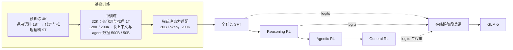
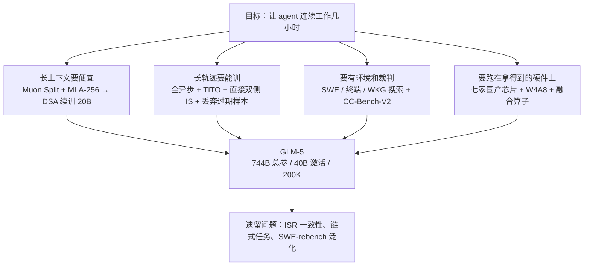

# GLM-5：让 agent 连续干几个小时的活，要改的一路从注意力改到评测

<!-- release-date: 2026-02-11 -->

> 本文依据 GLM-5 Team（Zhipu AI & Tsinghua University）的 **GLM-5: from Vibe Coding to Agentic Engineering**，arXiv:2602.15763v2，2026-02-24，共 40 页。页码均指这份 PDF 自身的页码。文中会区分三件事：**报告明确写了什么**、**我们怎么解释它**、**哪些是外部资料或本文算术**。

## 阅读前先认识几个词

- **Token（词元）**：模型读写文本的最小单位。
- **KV Cache（键值缓存）**：生成时把已读内容的 Key、Value 留在显存里，下一个 Token 不必重算整段历史。上下文越长，它越大。
- **MoE（Mixture-of-Experts，混合专家）**：一层里放很多组「专家」参数，每个 Token 只激活少数几组。总参数很大，单次计算不大。
- **GQA 与 MLA**：两种省 KV Cache 的注意力。GQA（分组查询注意力）让一组 Query 头共用一份 Key、Value；MLA（多头潜在注意力，出自 DeepSeek-V2）把 Key、Value 压成一条低维潜向量再缓存。
- **DSA（DeepSeek Sparse Attention，DeepSeek 稀疏注意力）**：出自 DeepSeek-V3.2。一个轻量的「索引器」先给所有历史位置打分，主注意力只读分数最高的 $k$ 个位置。
- **RL（强化学习）与 rollout**：让模型自己生成答案或轨迹，按结果好坏调参数。一次完整生成叫一条 rollout；对 agent 来说，一条 rollout 可能是几十次工具调用加几十分钟沙箱执行。
- **harness（评测脚手架）**：跑 agent 评测时套在模型外面的框架，决定给哪些工具、怎么管上下文、步数与时间上限。同一个模型换 harness，分数会变。

DSA 的内部机制不是这篇报告的贡献，见 DeepSeek-V3.2 一篇；本文只讲 GLM-5 怎么接入它、为它付了什么代价。

## 一句话先说清

标题里的「vibe coding」指人提示、模型写代码片段；「agentic engineering」指 agent 自己规划、实现、迭代（PDF p. 15）。这句口号在报告里是一条工程约束：一旦要求模型连续工作几小时，四件事同时变难。

1. **上下文又长又贵**。agent 的上下文是工具结果堆出来的，GLM-5 的中训练一路扩到 200K（PDF p. 8）。
2. **一条训练样本又长又慢**。同步 RL 里一步要等最慢的那条轨迹，GPU 大半时间在等（PDF p. 15）。
3. **没地方练，也没人判**。要可执行、可验证的环境，也要能判「整件事做完没有」的评测。
4. **硬件不一定拿得到**。报告用整整一节写七家国产芯片的适配（PDF p. 21–22）。

GLM-5 的四个回答（PDF p. 3–4）：

- 注意力换成 **DSA**，并先把 MLA 修好（Muon Split、MLA-256），再把多 Token 预测的草稿模型做成参数共享；
- 一套**全异步、生成与训练分离**的 RL 基础设施，加上 TITO 网关、直接双侧重要性采样、过期样本丢弃，按住随之而来的 off-policy 问题；
- 三条造环境的流水线（软件工程、终端、搜索）和一套自动评测 CC-Bench-V2；
- 从发布第一天起适配七家国产芯片平台。

结果是一个 744B 总参数、每 Token 激活 40B 的 MoE 模型，基座共训 28.5T Token（PDF p. 3–4）。报告称它在 8 个 agent、推理与编码基准上平均比 GLM-4.7 高约 20%，在 Artificial Analysis Intelligence Index v4.0 上得 50 分，是开放权重模型第一次到 50（PDF p. 2）。

如果只记一句话：

> **「让模型会做 agent」不是一个后训练问题。它会一路反推到注意力形状、优化器粒度、算子的确定性和评测方法。**

## 先看全景：训练流水线与模型配置

报告 Figure 5 把全流程画成一张图（PDF p. 4），按原图重画如下：

箭头是阶段顺序，不是耗时比例。两处读图要点：

- 预训练 18T + 9T = 27T，中训练 1T + 500B + 50B = 1.55T，合计 28.55T，对得上正文说的「基座共 28.5T」（PDF p. 3–4）。20B 的稀疏适配是否计入这个总数，报告没说。
- 蒸馏的老师来自 SFT、Reasoning RL 与 General RL 三个阶段，**Agentic RL 不在其中**；蒸馏从 General RL 的权重接着训（Figure 5 的虚线箭头，PDF p. 4；正文只写「前面 SFT 与 RL 阶段」，PDF p. 13）。

架构超参在附录 Table 10（PDF p. 36）：

| 配置 | GLM-4.5 | GLM-5 |
|---|---:|---:|
| 总参数 / 激活参数 | 355B / 32B | 744B / 40B |
| 稠密层 / MoE 层 / MTP 层 | 3 / 89 / 1 | 3 / 75 / 1 |
| Hidden 维度 | 5120 | 6144 |
| 稠密层中间维 / 专家中间维 | 12288 / 1536 | 12288 / 2048 |
| QK 头维 / V 头维 | 128 / 128 | 192 / 256 |
| Q 与 KV 的压缩维度（Q LoRA / KV LoRA） | – / – | 2048 / 512 |
| 注意力头 / KV 头 | 96 / 8 | 64 / – |
| 索引器头数 / 头维 | – / – | 32 / 128 |
| 专家总数 / 路由激活 / 共享 | 160 / 8 / 1 | 256 / 8 / 1 |
| 词表 | 151552 | 154880 |

参数量**含 MTP 层、不含词嵌入与输出层**（PDF p. 36）。能直接读出的判断：

- **更宽、更浅**。专家从 160 涨到 256，hidden 从 5120 涨到 6144，MoE 层从 89 降到 75。正文给的理由是减少专家并行的通信开销（PDF p. 4）。
- **注意力从 GQA-8 换成 MLA 加 DSA 索引器**。GLM-4.5 那一列有 8 个 KV 头、没有压缩维度，是 GQA；GLM-5 没有 KV 头这一项，换成了 512 维的 KV 压缩。
- 每 Token 仍激活 8 个路由专家加 1 个共享专家。总参数翻倍，激活参数只从 32B 涨到 40B。

训练超参沿用 GLM-4.5：Muon 优化器、cosine 衰减、batch size 预热；学习率从 0 预热到 2e-4，预训练结束时衰减到 4e-5，中训练再线性降到 1e-5（PDF p. 36）。

## 核心设计一：先把 MLA 修到能用

### 旧问题：换成 MLA，推理和代码反而掉分

MLA 的卖点是缓存小。GLM-5 想从 GQA-8（每层每 Token 2048 维 KV）换到 MLA（576 维潜向量），但报告发现：**在用 Muon 优化器的实验里，MLA 打不平 GQA-8**（PDF p. 4–5）。同规模对照是 Table 1（PDF p. 5）：

| 配置 | HellaSwag | MMLU | C-Eval | RACE | BBH | GSM8K | HumanEval |
|---|---:|---:|---:|---:|---:|---:|---:|
| GQA-8 | 77.3 | 61.2 | 60.0 | 79.6 | **53.3** | **47.6** | **38.5** |
| MLA | 77.3 | 61.5 | 59.7 | 77.8 | 48.9 | 46.2 | 33.5 |
| MLA + Muon Split | **77.8** | **62.5** | **62.1** | **79.9** | 51.8 | 45.0 | 36.7 |
| MLA-256 + Muon Split | 77.4 | 62.0 | 59.9 | 79.6 | 51.3 | 47.5 | 36.6 |

差距集中在 BBH（53.3 → 48.9）与 HumanEval（38.5 → 33.5）。压缩 KV 的代价不是均匀摊开的，先咬掉的是多步推理和代码。报告没给这组模型的规模与训练 Token 数。

### 新设计：Muon Split，按注意力头分别正交化

**Muon** 是一种优化器：累积动量之后，把二维权重矩阵的更新方向做近似正交化，让矩阵各方向的更新尺度更均衡。

报告说 GLM-4.5 的「原配方」是把多头 Query、Key、Value 的上投影矩阵 $W^{UQ}$、$W^{UK}$、$W^{UV}$ 各当成一整块做正交化；GLM-5 改成**按头拆成小矩阵，各自正交化**，叫 Muon Split，目的是「让不同注意力头的投影权重以不同尺度更新」（PDF p. 5）。结果见 Table 1 第三行：MLA 追平 GQA-8，MMLU 与 C-Eval 还更高。

报告还有一句观察：用了 Muon Split 之后，预训练期间注意力 logits 的尺度保持稳定，**不需要任何裁剪策略**（PDF p. 5）。这句没有给对照实验。

**我们的解释**（报告没有这一层分析）：正交化是在拉平一个矩阵各奇异方向的尺度。多个头拼成一块时，正交化连不同头之间的更新尺度也一起拉平，等于逼所有头同速学习；而 MLA 的所有头读的是同一份低维潜向量，本来就要从里面分工取不同信息。拆开之后，各头的步子可以不一样大。

**一处要读准的措辞**：GLM-4.5 用的是 GQA（Table 10 里它有 8 个 KV 头、没有压缩维度，PDF p. 36），没有 MLA 意义上的这几个上投影。所以「原配方」应读作「Muon 默认按整块矩阵正交化」，不是 GLM-4.5 专为 MLA 做过的设计。

### MLA-256：训练算力不变，解码算力降

MLA 的第二个毛病在解码。解码时 MLA 要对 576 维潜向量做点积，GQA 只做 128 维（PDF p. 5）。agent 场景恰恰解码密集。

报告的观察是：DeepSeek-V3 的注意力头数是按 H800 的 roofline（算力与带宽的平衡点）选的，换一种硬件就不合适（PDF p. 5，引 DeepSeek-V3 硬件反思那篇 ISCA 论文）。GLM-5 的调整是：利用 MLA 在训练与预填充时是多头注意力形态这一点，**把头维从 192 提到 256，头数减少三分之一**，报告称这样「训练计算量与参数量不变，解码计算量下降」，并把这个变体记作 MLA-256（PDF p. 5）。

我们的理解：解码时 MLA 走矩阵吸收后的形态，每个 Query 头都要对同一条潜向量做一次 576 维点积，所以解码的注意力计算量正比于头数，头数少三分之一就省三分之一；训练与预填充时计算量大致正比于「头数 × 头维」，一降一升大体抵消。报告没列式子，也没说清 192 和 256 分别指哪一段维度——Table 10 里 GLM-5 的 QK 头维是 192、V 头维是 256（PDF p. 36）。

效果见 Table 1 最后一行：报告说 MLA-256 与 Muon Split 下的 MLA「相当」。逐项看，GSM8K 从 45.0 升到 47.5，C-Eval 从 62.1 降到 59.9，其余基本持平。

### MTP 参数共享：草稿模型不随投机步数膨胀

**MTP（Multi-token Prediction，多 Token 预测）** 让模型训练时还预测后面几个 Token；推理时它可以当**投机解码**的草稿模型：草稿先猜几个 Token，主模型一次性验证，猜中的直接采用。每轮平均采纳的 Token 数叫**接受长度**。

旧问题：要预测后面 $n$ 个 Token 就要 $n$ 个 MTP 层，MTP 参数与它们的 KV Cache 随投机步数线性增长。DeepSeek-V3 的折中是只训 1 个 MTP 层、推理时拿它连猜 2 个，训推不一致会拉低第二个 Token 的接受率（PDF p. 5）。

GLM-5 训练时用 **3 个 MTP 层但共享参数**：草稿的显存和 DeepSeek-V3 的单层方案一样，但训练真的见过「连猜 3 步」（PDF p. 5）。同样 4 步投机，接受长度 DeepSeek-V3.2 是 2.55，GLM-5 是 2.76（PDF p. 5，Table 2）。

边界：这组对比跑在「私有 prompt 集」上；两个模型整体架构不同，差距不能全部归给参数共享。

### 这一节可以带走什么

- **评估压缩方案，先看最需要多步推理的那几列**。Table 1 里 MLA 的平均分几乎不掉，BBH 和 HumanEval 却掉得最多。
- **优化器的作用粒度也是设计维度**。Muon Split 没改结构、没加参数，只改了正交化的单位。多个子模块共享一份表示、又要分工时，别让优化器逼它们同步。
- **架构超参要按目标硬件重算**。同样的头数在一种卡上是最优，换一种卡可能就不是。

## 核心设计二：DSA，从稠密基座续训 20B Token

### 做法

DSA 的核心是用内容决定读哪些位置，而不是像滑动窗口那样按固定模式只看最近一段（PDF p. 5）。GLM-5 和 DeepSeek-V3.2 一样，从稠密基座**续训**接入 DSA，而不是从头训，分两段（PDF p. 6、p. 36）：

- **稠密暖启动**：从中训练结束的基座开始，1000 步，每步 14 条 202,752 Token 的序列，学习率从 5e-3 降到 2e-4；
- **稀疏适配**：沿用中训练的数据与超参，训 20B Token，学习率固定 1e-5。

DeepSeek-V3.2 在这一步花了 943.7B Token，GLM-5 只用 20B，报告说这已足够让 DSA 模型追平原来的 MLA 模型（PDF p. 6）。收益方面，报告称 DSA 让长序列的注意力计算量降低约 1.5–2 倍，「能以一半 GPU 成本处理 128K 上下文」（PDF p. 6）。这说的是**注意力这一部分**的计算量，不是端到端延迟或整机成本。报告还引 DeepSeek-V3.2-Exp 的结论，说它「证明了长上下文里 90% 的注意力项确实是冗余的」（PDF p. 6）——这是转述别家的结论，本报告没有自己的测量。

证据有三层（PDF p. 5–6）：

| 128K 长上下文（Table 3） | MQ-NIAH | MV-NIAH | SQuAD | HotpotQA |
|---|---:|---:|---:|---:|
| MLA 基座 | 100.0 | 95.5 | 79.7 | **66.3** |
| DSA 基座 | 100.0 | **97.0** | **86.0** | 63.0 |

其次，用同一批 SFT 数据分别微调两个模型，训练损失曲线几乎重合（Figure 6，内嵌的相对损失差在 ±0.0004 以内）；最后，评测基准上两者打平（PDF p. 6）。

要如实说：HotpotQA-128k 掉了 3.3 分，报告用「接近」带过，没有解释；四个数据点也不足以撑起「无损」。

### 为什么不是滑动窗口，也不是线性注意力

报告专门做了一节消融（§2.1.2，PDF p. 6–8）。基座是 GLM-9B：40 层全 GQA、已经做过 128K 微调。候选四个：

- **SWA Interleave**：全注意力层与滑动窗口层固定交替；
- **GDN（Gated DeltaNet）**：线性注意力，把二次复杂度的 softmax 注意力换成门控线性递归；
- **SWA Pattern**（他们提的）：受 PostNAS 启发，用 beam search 搜「哪几层换成滑窗」。beam 宽 8，每步定 2 层，40 层约 10 步收敛，只在 16K 上用 RULER 打分，搜出来的模式直接用到所有长度（PDF p. 6）；
- **SimpleGDN**（他们提的）：删掉 GDN 的 Conv1d 与显式门控，把预训练的 Q、K、V 投影直接映射进线性递归，不加新参数（PDF p. 7）。

**不续训、直接换**时的 RULER（PDF p. 7，Table 4；两种 SWA 都是全注意力层与滑窗层 1:1、窗口 4096）：

| | 4K | 8K | 16K | 32K | 64K | 128K |
|---|---:|---:|---:|---:|---:|---:|
| GLM-9B 全注意力 | 95.19 | 93.67 | 92.01 | 91.09 | 85.35 | 75.28 |
| SWA Interleave | 94.87 | 54.02 | 25.89 | 12.61 | 8.32 | 6.51 |
| SWA Pattern | **95.78** | 92.54 | 88.92 | 82.52 | 70.23 | 53.95 |

同样的比例、同样的窗口，只是换了**哪几层**做滑窗，128K 就从 6.51 拉到 53.95。结构位置的选择，收益可以比结构类型还大。

**各自续训 190B Token（64K 上下文，高效层与全注意力层仍 1:1）之后**（PDF p. 7，Table 5；括号内是相对基线的差）：

| 方法 | RULER 64K / 128K | MRCR 64K / 128K | HELMET-ICL 64K / 128K | RepoQA 64K / 128K |
|---|---|---|---|---|
| GLM-9B 基线 | 85.35 / 75.28 | 36.53 / 35.39 | 77.68 / 77.36 | 69.00 / 65.83 |
| SWA Interleave | 65.94 / 44.93（↓19.41 / ↓30.35） | 30.03 / 28.83（↓6.50 / ↓6.56） | 75.96 / 63.52（↓1.72 / ↓13.84） | 50.33 / 39.33（↓18.67 / ↓26.50） |
| SWA Pattern | 83.72 / 69.59（↓1.63 / ↓5.69） | 35.02 / 33.58（↓1.51 / ↓1.81） | 76.48 / 74.60（↓1.20 / ↓2.76） | 62.33 / 51.17（↓6.67 / ↓14.66） |
| GDN | 76.76 / 64.00（↓8.59 / ↓11.28） | 31.72 / 30.22（↓4.81 / ↓5.17） | 76.88 / 74.84（↓0.80 / ↓2.52） | 65.50 / 56.17（↓3.50 / ↓9.66） |
| SimpleGDN | 81.76 / 67.03（↓3.59 / ↓8.25） | 33.03 / 31.27（↓3.50 / ↓4.12） | 79.80 / 81.84（↑2.12 / ↑4.48） | 65.50 / 58.50（↓3.50 / ↓7.33） |

报告的结论：这些方法在细粒度检索上都留下「固有的精度缺口」，即使一半的层保留全注意力也一样，原因是续训适配时不可避免地丢信息；SimpleGDN 在复用预训练权重上最平衡（PDF p. 7）。然后是全节最关键的一句判断：

> DSA 在构造上是无损的：索引器做的是 Token 级稀疏，不丢任何长程依赖，所以可以用在所有层上而不降质（PDF p. 7）。

上图画的就是这句话的结构性论证：滑窗把窗口外的内容移出了视野，线性注意力把历史压成固定大小的状态，**信息被删掉了**；DSA 只是这一步**没去读**某些位置，它们的 KV 还完整存着，下一个 Token 的索引器可能选中。

但「构造上无损」不等于「实测无损」。报告在 GLM-4.7-Flash（MLA 架构）上做了小规模验证（PDF p. 7–8，Table 6）：

| RULER | 4K | 8K | 16K | 32K | 64K | 128K |
|---|---:|---:|---:|---:|---:|---:|
| GLM-4.7-Flash | 97.44 | 96.72 | 95.83 | 92.96 | 85.34 | 79.21 |
| + 只做 DSA 暖启动 | 97.51 | 96.54 | 95.40 | 90.09 | 84.05 | 71.35 |
| + 完整 DSA 训练 | 96.77 | 96.25 | 96.69 | 93.45 | 87.06 | 78.86 |

只训索引器（1000 步、batch 16、基座冻结）就保住了大部分能力，损失集中在 128K（79.21 → 71.35）；再联合训 150B Token 后，16K、32K、64K 反超基线（+0.86 / +0.49 / +1.72），128K 仍差 0.35（PDF p. 7–8）。

准确的说法是：**DSA 的缺口比滑窗和线性注意力小得多，续训后基本补平，但没有归零**；GLM-5 自己的 Table 3 里 HotpotQA 还差 3.3 分。

### 这一节可以带走什么

- **先问「信息是被删了，还是只是这一步没读」**。前者靠续训补不回来，后者可以。
- **结构搜索很便宜，值得默认一试**。SWA Pattern 只在 16K 上跑 beam search，128K 就从 6.51 提到 53.95。
- DSA 的代价：多一个索引器（32 头、128 维，PDF p. 36），推理多一份计算与缓存；它的 top-$k$ 还会在 RL 阶段制造稳定性问题，见后文。

## 数据与中训练：代码与长上下文加码

报告对数据给的是方向，不是配方（PDF p. 8–9）：

- **网页**：在 GLM-4.5 流水线上再加一个基于句向量的 DCLM 分类器，捞回标准分类器漏掉的高质量数据；再用一个「世界知识分类器」（用维基百科条目与 LLM 标注数据优化）从中低质量数据里提取长尾知识；
- **代码**：刷新主要代码托管平台的快照、扩充含代码的网页，模糊去重后的独立 Token 增加 28%；修正 Software Heritage 代码文件的元数据错位，换更准的语言分类；为 Scala、Swift、Lua 等低资源语言单训分类器；
- **数学与科学**：从网页、书籍、论文收集，改进网页抽取与 PDF 解析；用 LLM 给候选文档打分只留最有教育价值的，长文档用「分块再聚合」打分；**过滤掉合成、AI 生成或模板化的数据**。

中训练把上下文分三段扩展：32K（1T Token）、128K（500B）、200K（50B），后期上采样长文档与合成 agent 轨迹（PDF p. 8）。两类数据值得记：

- **软件工程数据**：沿用把仓库级代码、commit diff、issue、PR 和相关源文件拼成一条序列的做法；放宽仓库级筛选、加强单个 issue 的质量筛选，得到约 1000 万个 issue–PR 对，过滤后约 160B 独立 Token（PDF p. 8）；
- **长上下文数据**：自然数据来自书籍、论文与通用语料里的长文档；合成数据受 NextLong、EntropyLong 启发，把高度相似的文本交错打包成序列，缓解「中间遗忘」；200K 阶段还加了少量仿 MRCR 的多轮召回数据（PDF p. 9）。

报告的一条经验观察：**在 128K 之后再加一段 200K 中训练，连 128K 以内的表现也变好了**（PDF p. 9）。没有给数字。

没公开的：27T 语料的来源配比、去重阈值、质量分类器细节、污染检查，以及中训练各段的数据组成。

## 训练基础设施：五个省显存的办法

§2.4 全是方法、没有一个数字（PDF p. 9–10）。显存侧五项：

1. **MTP 灵活放置**。交错流水线并行下，MTP 模块同时含 embedding、transformer、输出层，显存远高于其他模块。把它的输出层与主输出层放在最后一级以共享参数，embedding 与 transformer 部分放到前一级。
2. **流水线里的 ZeRO2 梯度分片**。每个流水线 rank 管多个阶段，朴素做法每个阶段都要一份完整梯度缓冲。改成在数据并行 rank 之间分片，每个阶段只存 $1/dp$；同一时刻只给两个阶段留完整累积缓冲，双缓冲轮换——一个在累积，另一个在做梯度同步。
3. **Muon 分布式优化器零冗余通信**。朴素实现在每个数据并行 rank 上 all-gather 全部参数，造成显存尖峰与冗余通信；改成只 all-gather 本 rank 负责的分片，并与本地计算重叠。
4. **流水线激活卸载**。流水线暖启动期间前向跑在反向前面，激活寿命被拉长。按层把激活卸到主机内存、反向前再载回，调度上与计算重叠，并避开点对点通信和 MoE 的 token 分发、合并。
5. **分块计算输出投影**。输出投影与交叉熵要存激活、还要升精度算损失。把序列切块，每块独立算投影与损失、做完前后向就释放；块越多，峰值显存越低。

并行侧两项：把部分权重梯度计算推迟出关键路径以减少流水线气泡（引 Zero Bubble）；长序列训练用负载感知的序列重排、注意力计算动态再分配，把数据并行 rank 灵活切成**大小不等**的上下文并行组，再用分层 all-to-all 重叠 QKV 的节点内与节点间通信（PDF p. 9–10）。

另有一条：**SFT 阶段就做 INT4 量化感知训练（QAT）**，并写了一个训练与离线权重量化共用的量化 kernel，保证训练与推理「逐位一致」（PDF p. 10）。部署要量化，就让训练阶段已经跑在同一条数值路径上。

没公开的：集群规模、训练时长、MFU、吞吐，以及每项优化各省了多少。

## 后训练一：SFT、Reasoning RL，以及一个算子毁掉 RL 的故事

### SFT：三种思考方式

SFT 语料分三类：通用对话、推理、代码与 Agent；Agent 与代码数据规模比 GLM-4.5 显著扩大，最大上下文扩到 202,752 Token（PDF p. 10–11）。配合新的对话模板，模型支持三种思考方式（PDF p. 11）：

- **交替思考（Interleaved Thinking）**：每次回复、每次调工具之前都先想；
- **保留思考（Preserved Thinking）**：在编码 agent 场景下，跨多轮对话自动保留所有思考块，复用已有推理而不是从头推；
- **按轮思考（Turn-level Thinking）**：同一会话里逐轮开关思考，轻量请求关掉省延迟，复杂任务打开。

图里中间一列是常见做法：新一轮用户消息到来，旧思考清空。对聊天这是对的；对编码 agent，前一轮的「我判断 bug 在缓存失效逻辑里」正是这一轮还要用的前提，清掉它，模型要么重推一遍，要么推出不一样的结论。报告的说法是保留思考「减少信息丢失与不一致」（PDF p. 11）。脚注写明交替思考最早由 Claude 的扩展思考文档提出，保留思考 Claude 从 Opus 4.5 起也采用（PDF p. 11，脚注 4、5）。

SFT 数据上的几处具体做法（PDF p. 11）：

- 通用对话的回复风格比 GLM-4.5 更有条理、更简洁；角色扮演按指令遵循、表达力、创造性、逻辑连贯、长对话一致性几个维度做自动与人工筛选；
- 推理数据里，逻辑推理构造可验证的问题并用拒绝采样合成；数学与科学只留 GLM-4.7 做不对的难题；
- 代码与 Agent 数据来自大量执行环境里的轨迹，再用专家 RL 与拒绝采样提质量。**轨迹里出错的片段保留在上下文里，但在损失里掩掉**：模型能看到「出错 → 纠正」的完整过程，又不会去模仿那个错误动作。

### Reasoning RL：GRPO 加 IcePop，去掉 KL

底子是 **GRPO**（组相对策略优化）：同一个问题采样一组回答，用组内奖励的均值和标准差算优势，不要单独的价值网络。

GLM-5 在上面加了 **IcePop**，处理**训推不一致**：采样用推理引擎（为了快，精度与算子实现都和训练引擎不同），算梯度用训练引擎，同一个 Token 两边算出的概率会有细微差别，长思维链上逐 Token 放大（PDF p. 11）。报告把两个策略显式分开，定义训推失配比：

$$
\rho_{i,t}=\frac{\pi^{\text{train}}_{\theta_{\text{old}}}(y_{i,t}\mid x,y_{i,<t})}{\pi^{\text{infer}}_{\theta_{\text{old}}}(y_{i,t}\mid x,y_{i,<t})}
$$

再用一个 `pop` 算子处理它（PDF p. 12）：失配比落在 $[1/\beta,\beta]$ 之内，保持原值；落在外面，直接置 0。

$$
\operatorname{pop}(\rho_{i,t},1/\beta,\beta)=\begin{cases}\rho_{i,t}, & 1/\beta\le\rho_{i,t}\le\beta\\ 0, & \text{其他}\end{cases}
$$

这是**掩码**，不是裁剪：失配太大的 Token 完全不参与梯度。最终损失把它乘在标准的 PPO 裁剪项外面（PDF p. 11，式 1）：

$$
\mathcal L(\theta)=-\mathbb E\left[\frac1G\sum_{i=1}^{G}\frac{1}{|y_i|}\sum_{t=1}^{|y_i|}\operatorname{pop}(\rho_{i,t},1/\beta,\beta)\cdot\min\left(r_{i,t}\hat A_{i,t},\ \operatorname{clip}(r_{i,t},1-\epsilon_{\text{low}},1+\epsilon_{\text{high}})\hat A_{i,t}\right)\right]
$$

$r_{i,t}$ 是训练策略新旧之比，$\hat A_{i,t}$ 是组内标准化的优势。相比原版 IcePop，GLM-5 **去掉了 KL 正则**，理由是加快 RL 提升（PDF p. 11）。超参：$\beta=2$、$\epsilon_{\text{low}}=0.2$、$\epsilon_{\text{high}}=0.28$，完全 on-policy，组大小 32、批大小 32（PDF p. 12）。$\epsilon_{\text{high}}>\epsilon_{\text{low}}$ 是 DAPO 的 clip-higher 思路，见 DAPO 一篇。

数据是数学、科学、代码、工具集成推理（TIR）四个领域混合训练，大体均衡（PDF p. 12）：

- 数学与科学来自开源数据集和与标注供应商共建的题库，只留 **GLM-4.7 很少做对、但更强老师模型（如 GPT-5.2 xhigh、Gemini 3 Pro Preview）能做对**的题；
- 代码包括竞赛题（Codeforces、TACO、SYNTHETIC-2-RL 等）与科学计算题；
- TIR 复用更难的数学科学子集，再和标注供应商共建专门需要外部工具的 STEM 题；
- 各领域、各来源配专门的判分模型或评测系统，给**二值结果奖励**。

### DSA 给 RL 带来的新麻烦：top-k 必须确定

这是全文最具体的一段（PDF p. 12）。

DSA 的索引器每步挑 top-$k$ 个位置，这个结果对 RL 稳定性「至关重要」。MoE 有个现成的类比叫 **routing replay**（路由回放）：把推理时激活了哪些专家记下来，训练时照着复现。但搬到索引器上行不通：索引器的 $k=2048$，远大于 MoE 的 $k$，每个 Token 位置都存 2048 个下标，存储和训推引擎之间的通信都承受不了。

GLM-5 的解法很朴素：**换一个确定性的 top-$k$ 算子**。SGLang 的 DSA 索引器用的是非确定性的 CUDA top-$k$；训练引擎里直接换成朴素的 `torch.topk`，稍慢，但确定。报告说它「输出更一致，带来显著的 RL 收益」；而其他非确定性实现（CUDA 或 TileLang）「只训几步就性能剧烈退化，伴随熵的急剧下降」（PDF p. 12）。另外，所有 RL 阶段默认**冻结索引器参数**，为了加速、也防止索引器自己学出不稳定的行为。

熵急剧下降就是模型迅速塌缩到少数几种输出。一个算子的非确定性，几步之内就能毁掉一次大规模 RL。

> **离散选择一旦进了训练循环，它的确定性就不是实现细节，而是算法正确性的一部分。** 稀疏注意力的 top-$k$、MoE 路由、检索召回、剪枝掩码都属于这一类：先问训练侧和推理侧会不会选到同一批，再谈算子快不快。

## 后训练二：Agentic RL，把生成和训练彻底拆开

### 目标函数：只优化模型自己生成的 Token

Agentic RL 用的是组式策略优化：对每个问题从旧策略采 $K$ 条 agent 轨迹，以组内平均奖励为基线（PDF p. 15）：

$$
\mathcal L(\theta)=\mathbb E_{x\sim D}\left[\frac1K\sum_{i=1}^{K}\bigl(r(x,y_i)-\bar r(x)\bigr)\right],\qquad \bar r(x)=\frac1K\sum_{i=1}^{K}r(x,y_i)
$$

一条关键约定：**只有模型生成的 Token 参与优化，环境返回的内容不进损失**（PDF p. 15）。报告印出的这条式子只写了优势项，没写对数概率，实际形式以后面的式 3 为准。

### 为什么必须全异步

上半张是旧问题：agent 任务的生成长度极不均衡，同步 RL 要等一批全部生成完才能训练，大量 GPU 时间在空等（PDF p. 15）。下半张是新设计（PDF p. 15–16）：

- 训练引擎与推理引擎放在**不同的 GPU** 上；推理引擎持续生成，攒够预设数量就送去训练；
- 训练引擎每做 $K$ 次梯度更新，把新权重推回推理引擎；
- 因为 rollout 策略一直在变，每次推权重后优化问题其实换了一个，所以**每次权重更新后重置优化器**。

代价是：不同轨迹来自不同版本的模型，**off-policy 问题变得严重**（PDF p. 16）。后面四个机制都是在处理这件事。

多任务靠一个**服务化的 Multi-Task Rollout Orchestrator**：每个任务把自己的 rollout 与奖励逻辑实现成独立微服务、注册到中央编排器；编排器控制各任务的采样比例与生成速度；所有 agent 任务的轨迹统一成同一种 **message-list** 表示，软件工程这类复杂框架也能和别的任务联合训练。它支持超过 1000 条并发 rollout（PDF p. 16）。

### TITO：训练直接吃推理引擎的 Token ID

**Text-in-text-out** 把推理引擎当黑盒，拿回最终文本，训练侧再**重新分词**、重推边界与截断。**Token-in-token-out（TITO）** 则直接消费推理引擎产出的那串 Token ID 与元数据。

报告说这个「看起来很小的选择」后果很重：重新分词会在 Token 边界、空白与规范化、截断、特殊 Token 位置上引入细微失配，破坏动作与奖励、优势之间的步级对齐，尤其是 rollout 流式、被截断或在很多 actor 之间交错时（PDF p. 16）。工程上是一个 **TITO Gateway**：拦截所有 rollout 任务的生成请求，记下每条轨迹的 Token ID 与元数据；写 agent 任务的人不用再管 Token ID。

举个例子帮助建模（本文补的，不是报告原文）：模型生成了一段工具调用。文本往返之后，分词器可能把结束标记前的换行并进另一个 Token，「第 137 个 Token 是这次调用的结束」就错位一格：奖励记在第 137 位，梯度加在第 138 位。

### 直接双侧重要性采样：不追旧策略，直接和 rollout 比

同步设定里，重要性比的分母是采样时的旧策略 $\pi_{\theta_{\text{old}}}$。异步下，一条轨迹生成期间推理引擎可能已经换了好几次权重，要精确追踪就得保存一长串历史 checkpoint，做不到（PDF p. 16）。

GLM-5 分两步（PDF p. 16–17）。第一步，**直接复用 rollout 时记下的对数概率**当行为策略，把 $\pi_{\theta_{\text{old}}}$ 整个丢掉，也省掉「用旧策略再跑一遍前向」：

$$
r_t(\theta)=\exp\bigl(\log\pi_\theta(a_t\mid s_t)-\log\pi_{\text{rollout}}(a_t\mid s_t)\bigr)
$$

第二步，**双侧校准掩码**：比值落在 $(1-\epsilon_\ell,\ 1+\epsilon_h)$ 之内保持原值，否则置 0，整个 Token 不参与梯度：

$$
f(x;\epsilon_\ell,\epsilon_h)=\begin{cases}x, & 1-\epsilon_\ell<x<1+\epsilon_h\\ 0, & \text{其他}\end{cases}
\qquad
\mathcal L(\theta)=\mathbb E_t\bigl[f(r_t(\theta),\epsilon_\ell,\epsilon_h)\,\hat A_t\log\pi_\theta(a_t\mid s_t)\bigr]
$$

这和前面同步阶段的 `pop` 是同一种思路：信任域外的 Token 不截断、直接掩掉。报告自己说它与 IcePop 相似，但更简单，进一步去掉了 $\pi_{\theta_{\text{old}}}$；也写明了这笔交易：**接受一定程度、可控的 off-policy 偏差，换掉历史策略追踪**（PDF p. 17）。$\epsilon_\ell$、$\epsilon_h$ 的取值没给。

### 丢掉过期样本和环境噪声

两类脏数据要主动清（PDF p. 17）：

- **太陈旧的轨迹**。给每条响应记下它经历过的模型版本 $(w_0,\dots,w_k)$，$w'$ 是当前版本；若 $w'-w_0>\tau$ 就整条丢弃，即上图里那条黄色轨迹。
- **环境自己崩了**。编码 agent 的沙箱可能因为与模型无关的原因失败，这种失败反映的是环境不稳，不是模型能力。记录每个样本的失败原因，剔除环境崩溃的样本。剔完 GRPO 的组可能不完整：**有效样本超过组大小一半，就重复有效样本把组补齐；否则整组丢弃**。

这条规则承认了两件事：组内样本数影响优势估计的方差，不能随便变；重复采样带来的偏差在有效样本过半时可以接受，低于一半就不值得救。

### DP-aware routing：同一条 rollout 的请求总落在同一个 rank

多轮 agent 负载里，同一条 rollout 的连续请求共享完全相同的前缀。被随机打到不同的数据并行（DP）rank 上，就得反复 prefill。做法是一个有状态的路由层，用**一致性哈希**把 rollout ID 映射到固定 DP rank，跨轮保持稳定；为防长期不均衡，在哈希空间上叠一层轻量动态再平衡（PDF p. 17）。报告的原话是：rollout 越长，prefill 成本正比于**增量 Token** 而不是总上下文长度。

### slime：优化的是尾延迟，不是吞吐

底层仍是 GLM-4.5 时代的后训练框架 **slime**，报告强调 GLM-5 **没有引入新的系统组件**，只是用足了已有能力：可定制的 rollout 接口、通过 HTTP API 暴露 rollout 服务与推理路由、混合精度训练与 rollout、MTP、预填充与解码分离（PD 分离），以及心跳容错（PDF p. 14）。

§3.6.2 有一句定调的话：对 RL rollout，优化目标不是聚合吞吐，而是**由每步最慢样本决定的端到端延迟**（PDF p. 14）。围绕它的措施（PDF p. 14–15）：

1. **多节点推理加 DP-attention，避免排队**。例如 EP64、DP64 跨 8 个节点部署，提供足够的分布式 KV Cache；引入 DP-attention 主要是为了避免在 rank 之间复制 KV。
2. **FP8 rollout 加 MTP 压尾延迟**。尾延迟多半来自小 batch 的掉队者（罕见的长上下文、复杂多轮推理、工具密集的轨迹），而 MTP 恰在小 batch 解码时最有效，所以它对长尾的收益「不成比例地大」。
3. **PD 分离**。多轮场景里长前缀 prefill 很频繁；在 DP-attention 下 prefill 与 decode 混在同一批资源上会严重互扰，一次重 prefill 可能打断正在进行的 decode。
4. **心跳容错**。rollout 服务器定期发心跳，不健康的被主动终止并从推理路由里注销，重试自动导向健康节点。

第 2 条值得记：通常用 MTP 是为了提吞吐，这里的论证把它重新定位成**压尾延迟的工具**。同一个技术，优化目标一换，价值就变了。

## 后训练三：让 agent 有地方练

### 软件工程：一万多个可执行仓库

流程是（PDF p. 17–18）：收集大量真实的 issue–PR 对，用规则加 LLM 过滤出真实、高质量的 issue 描述；按 bug 修复、功能实现、重构等分类，补齐必要需求，保证模型的实现与测试补丁一致；再用基于 **RepoLaunch** 的流水线自动分析仓库的安装与依赖、构建可执行环境、生成测试命令，并让 LLM 写**按语言定制的日志解析函数**，从测试输出里抽出 **F2P（Fail-to-Pass，改前失败、改后应通过）** 与 **P2P（Pass-to-Pass，改前通过、改后仍应通过）** 两组用例。前者判断问题解决没有，后者判断有没有弄坏别的。

规模：超过 1 万个可验证环境，数千个仓库，9 种语言（Python、Java、Go、C、C++、JavaScript、TypeScript、PHP、Ruby）（PDF p. 18）。「让 LLM 写日志解析函数」是能不能规模化的关键：每个仓库的测试输出格式都不一样，人工写解析器就卡在这里。

### 终端：两条合成路线

**从种子数据合成**（PDF p. 18）：从真实软件工程与终端使用场景收集种子任务，让 LLM 生成大量可验证的任务草稿；一个构造 agent 把草稿实例化成 **Harbor** 格式的任务（结构化描述、Docker 执行环境、测试脚本）；一个精修 agent 按人工定义的评分细则反复检查，保证镜像能稳定构建、测试与描述一致、环境能**抵抗作弊和捷径**。产出数千个环境，Docker 构建成功率超过 90%。

**从网页语料合成**（PDF p. 18）：收集代码相关网页，用质量分类器过滤，挑出适合改写成终端任务的页面，按主题与难度分层采样；然后把 Harbor 的任务构造规范和选中的网页一起交给一个 coding agent，要求它合成任务，**并对自己的产出运行 Harbor 校验脚本**，失败就自己诊断、自己改，直到全部自动检查通过。只有过了这道自验证环的任务才进数据集。

> **让造数据的 agent 手里就拿着验证器。** 能自动验证时，把验证放进生成循环，比事后再筛便宜得多。

### 搜索：先建知识图谱，再从图谱里长出问题

深度搜索要的是「必须查很多个来源才能答」的多跳问题。GLM-5 先建一张 **WKG（Web Knowledge Graph，网页知识图谱）**（PDF p. 18）：从早期搜索 agent 的轨迹里收集、去重所有访问过的 URL，留下两百多万个高信息量网页；LLM 做实体识别、去噪、结构化抽取；图谱持续更新，并用下游验证信号做实体对齐、属性归一化、关系合并；**采样低到中频的实体做种子**，扩展多跳邻域形成子图，再把每个子图转成一个隐式编码多实体关系链的问题。

选低中频实体是关键：高频实体的问题，模型可能不用搜就知道答案。

然后三道过滤（PDF p. 19）：

1. 删掉「无工具的推理模型八次独立尝试里至少对一次」的题；
2. 删掉「早期 agent 用基础搜索、浏览、计算几步就能解决」的题；
3. 用验证 agent 做**双向校验**：从第 2 步的搜索轨迹里收集候选答案，分别验证候选答案与标注答案和问题的一致性，拒绝答案不唯一、证据不一致或标注错误的样本。

第 3 步不只验证「标注答案对不对」，还验证「agent 找到的别的答案是不是也说得通」；说得通，说明题目本身答案不唯一。

### 推理期的上下文管理：纯推理侧的 6.7 分

这一小节（§4.2.4，PDF p. 19）严格说是推理策略，但对 BrowseComp 的影响比很多训练改动还大。

**先说裁判。** 报告发现 BrowseComp 的分数对裁判提示词和裁判模型都很敏感，开源裁判会引入系统性偏差；于是统一用 OpenAI 官方评测提示词加专有模型 **o3-mini** 当裁判，理由是个案分析里它与人工标注最一致（PDF p. 19）。**看到任何 BrowseComp 数字，先问裁判是谁。**

**再说方法。** 已有做法 **Discard-all**：上下文太长时清空全部工具调用历史。报告观察到超长上下文（例如超过 10 万 Token）下准确率明显下降，于是用 **Keep-recent-$k$**：设轨迹为 $(q,r_1,a_1,o_1,\dots,r_n,a_n,o_n)$，$q$ 是问题，$r_i$ 是第 $i$ 轮的推理，$a_i$ 是动作（search、open、find、python 四个工具），$o_i$ 是工具返回。只把最近 $k$ 轮之前的**工具返回**替换成一句「Tool result is omitted to save tokens.」，推理与动作都保留。

也就是说，agent 记得自己做过什么、当时怎么想，只是不再保留那些又长又能重新去查的原始工具输出。$k=5$ 时，GLM-5 从 55.3% 升到 62.0%；换别的 $k$、或改成上下文到某个 Token 阈值才触发，结果一样（PDF p. 19）。

再叠一层 **HCM（Hierarchical Context Management，分层上下文管理）**：在 keep-recent 的同时，总上下文一旦超过阈值 $T$，就清空全部工具调用历史重新开始；$T=32\text{k}$ 是参数搜索选的，最终到 75.9（PDF p. 19）。

读 Figure 8 要注意一点：GLM-5 HCM 那条曲线大约在 600 步就结束了；图里另外两条 GLM-5 曲线（Pass@K、Fewest-step）一直画到约 1800 步、分数更高，但正文没有定义这两种策略是什么（PDF p. 19）。正文说「与单用 Discard-all 相比在所有预算下都有稳定增益」，图里却没有 GLM-5 单用 Discard-all 的曲线，只有 GLM-4.7 的。

### 幻灯片：把 reward hacking 摆出来讲

§4.2.5（PDF p. 20–21）是 HTML 幻灯片生成，看似小场景，却是全文把**奖励设计**讲得最细的一段。流程是 SFT 打底 → 多层奖励做 RL → 拒绝采样微调与掩码微调，把 RL 学到的东西注回训练语料，循环迭代。奖励分三层（PDF p. 20）：

- **Level-1 静态标记属性**：只看 HTML 里声明的定位、间距、颜色、排版、饱和度等，用一套基于设计原则的规则约束，保证可解析；再加幻觉图片与重复图片检测；
- **Level-2 运行时渲染属性**：真把页面渲染出来，检查 DOM 节点的宽高、包围盒等几何指标，为此建了一个分布式渲染服务；
- **Level-3 视觉感知特征**：对渲染结果做感知级评估，例如检测异常的空白模式。

图引自报告 Figure 9（PDF p. 20），红框是改动前，绿框是模型「作弊」后指标合规的样子。报告的应对不是加惩罚项，而是**修渲染器实现、堵住可利用的漏洞**，让奖励真正奖励好看的布局，而不是几何指标上的表面合规（PDF p. 20）。

> **reward hacking 通常不该靠加惩罚项治，而该让度量本身难以伪造。** 加惩罚是和模型比谁想得多，修度量是把作弊路径直接封死。

训练侧还有几处（PDF p. 21）：动态采样按概率丢掉一部分结构过于简单的样本；用 Token 级策略梯度损失（引 DAPO）稳定优化；把同一样本的不同 rollout 结果分散到多个训练批次；拒绝采样把 RL 的奖励函数改成过滤器，页面级查代码有效与可编译，轨迹级查工具执行正确与内容多样，按 Best-of-N 留最好的；只有少数页面有缺陷的轨迹不整条丢，而是**把坏页掩掉、留下好内容**。

效果（PDF p. 21）：严格符合 16:9 的页面比例从 40% 升到 92%，页面溢出明显减少；对比 GLM-4.5 的人工评测胜率是内容质量 60%、排版合理性 57.5%、视觉美感 65%、总体 67.5%。对手是 GLM-4.5，不是 GLM-4.7 或外部模型；评测集没公开。

## 后训练四：General RL 与跨阶段蒸馏

### General RL：三个维度、三种奖励

目标拆成三层（PDF p. 13）：**基础正确性**（指令遵循失败、逻辑不一致、事实错误、知识幻觉、语言不流畅，把错误率压到「可用」基线，是一切后续优化的前提）、**情商**（共情、有洞察、风格接近自然的人类交流）、**任务特定质量**（写作、文本处理、主客观问答、角色扮演、翻译各自精修）。

奖励是三种混合（PDF p. 13）：

| 奖励类型 | 优点 | 缺点 |
|---|---|---|
| 规则奖励 | 精确、可解释 | 只能覆盖写得成确定性规则的部分 |
| ORM（结果奖励模型） | 方差低、训练效率高 | 更容易被 reward hacking，策略会去钻表面模式 |
| GRM（生成式奖励模型） | 对这类钻空子更鲁棒 | 方差更高 |

还有一条**人在环中的风格对齐**：显式引入高质量的人写回答作为风格锚点。动机写得很坦率：纯靠模型生成来优化，会收敛到一眼能认出的「模型味」，冗长、程式化，缺少熟练人类写作的细腻（PDF p. 13）。

### 在线跨阶段蒸馏：最后一步把自己教回来

**旧问题**：顺序优化不同目标，会让先前学到的能力累积退化（PDF p. 13）。

**新设计**：把前面各阶段的最终 checkpoint 当老师，做一次在线策略蒸馏作为最后一步；训练提示从对应老师的 RL 训练集里采，按合适比例混合（PDF p. 13–14）。损失直接复用式 1，只把优势项换掉（PDF p. 14，式 2）：

$$
\hat A_{i,t}=\operatorname{sg}\left[\log\frac{\pi^{\text{infer}}_{\theta_{\text{teacher}}}(y_{i,t}\mid x,y_{i,<t})}{\pi^{\text{train}}_{\theta}(y_{i,t}\mid x,y_{i,<t})}\right]
$$

`sg` 是停止梯度。意思很直白：**优势 = 老师认为这个 Token 有多好，减去学生现在认为它有多好**。老师更看好的 Token 被推高，学生已经比老师更看好的被压低。

因为「和老师的差距」本身就是优势，不再需要一组样本来估基线，所以这一步 **GRPO 组大小设为 1、批大小 1024**（PDF p. 14）。组采样的唯一作用是估基线，基线有了别的来源，组就该退化成 1。

报告写明的未完成部分：目前用推理引擎取老师的 logits，计划把推理后端迁到训练引擎，并统一用 MLA 的 MQA 模式做推理（PDF p. 14）。也就是说，这一步本身现在也带着训推不一致，报告知道并打算修。

## 适配国产芯片：把 744B 放进一台机器

报告说 GLM-5 从第一天起就完成了七家国产芯片平台的全栈适配：华为昇腾、摩尔线程、海光、寒武纪、昆仑芯、沐曦、燧原（PDF p. 4、p. 21）。§5 以昇腾 Atlas 为例讲三件事（PDF p. 21–22）：

- **W4A8 混合精度量化**。为了把模型放进**单台 Atlas 800T A3**，用 msModelSlim 工具分组件定精度：常规 Attention 与 MLP 用 W8A8（INT8），MoE 专家压到 W4A8（INT4）；用 QuaRot 抑制离群值、Flex_AWQ_SSZ 做缩放校准。专家占了大部分参数、每个 Token 只用一小部分，压到 4 bit 收益最大；注意力与稠密层每个 Token 都要走，留在 8 bit。
- **融合算子**。Lightning Indexer 把打分、ReLU、TopK 融进一个 kernel，让 NPU 重叠计算与访存；Sparse Flash Attention 针对 GLM-5 的稀疏模式，并行处理「从 KV Cache 里挑 TopK」与稀疏注意力计算；MLAPO 把 13 个小的预处理算子融成一个「超级算子」，利用 Vector 与 Cube 单元之间的并行。
- **推理引擎**。适配 vLLM-Ascend 与 SGLang：异步调度把设备到主机的采样拷贝与下一步解码准备重叠；RadixCache 做前缀共享、Prefix Cache 把 KV 存储扩到系统内存；注意力数据并行加 MoE 专家并行，配 FlashComm 拆分 AllReduce 以隐藏通信；MTP 提高 NPU 计算密度。

结论是：**单个国产节点达到与「双 GPU 国际集群」相当的性能，长序列场景部署成本降低 50%**（PDF p. 22）。这句必须谨慎读：对照的是哪款 GPU、什么配置、序列多长、什么指标下「相当」、50% 的分母是什么，一概没写。这是结论式陈述，不是可复核的测量。

## 评测：先看条件，再看分数

### 评测条件

| 评测 | harness 或裁判 | 关键设置 |
|---|---|---|
| HLE 与其他推理题 | GPT-5.2（medium）当 HLE 裁判 | 最大生成 131,072，temperature 1.0，top_p 0.95；HLE 默认只测纯文本子集，带 * 的是全集；带工具时最大上下文 202,752 |
| SWE-bench Verified 与 Multilingual | OpenHands，**为 GLM-5 定制的指令提示词** | temperature 0.7，top_p 0.95，最大新生成 16384，200K 窗口 |
| Terminal-Bench 2.0 | Terminus-2 | 超时 2 小时，temperature 0.7，top_p 1.0，最大新生成 8192，128K 窗口，16 CPU / 32 GB 内存 |
| Terminal-Bench 2.0 | Claude Code 2.1.14（think 模式） | temperature 1.0，top_p 0.95，最大新生成 65536，**去掉墙钟时间上限**，5 次平均 |
| CyberGym | Claude Code 2.1.18（think 模式，无网页工具） | 最大新生成 32000，每任务 250 分钟，1,507 个任务单次 Pass@1 |
| MCP-Atlas | Gemini 3 Pro 当裁判 | 所有模型重跑 500 题公开集，每题超时从 4 分钟延长到 10 分钟 |
| BrowseComp | o3-mini 当裁判 | 不做上下文管理时保留最近 5 轮细节；做时用与 DeepSeek-V3.2、Kimi K2.5 相同的 discard-all |
| τ²-Bench | — | Retail、Telecom 调了用户模拟器提示词，避免模拟用户过早结束对话；Airline 用 Claude Opus 4.5 系统卡里的域修复 |
| Vending-Bench 2 | Andon Labs 独立运行 | — |

（PDF p. 22–24、p. 36–37。）四件事直接影响读分：

1. **SWE-bench 用了为 GLM-5 定制的提示词**（PDF p. 23、p. 36），其他模型是否同等定制没说。
2. **Terminal-Bench 2.0 两套 harness 宽松程度差很多**：Terminus-2 有 2 小时超时与 8192 输出上限，Claude Code 去掉墙钟限制、输出上限 65536。GLM-5 在两边都是 56.2，报告据此说编码能力能泛化（PDF p. 23）。另有一个修正了歧义指令的 verified 版本，GLM-5 分别到 60.7 与 61.1，数据集已公开（PDF p. 23）。
3. **τ²-Bench 改了用户模拟器**，附录 B.3 贴出了完整提示词（PDF p. 37–39）。修复合理，但基准变了。
4. **HLE（带工具）的比较跨了子集**：GLM-5 的 50.4 按默认是纯文本子集，而 Claude Opus 4.5、Gemini 3 Pro、GPT-5.2 的 43.4、45.8、45.5 都标了 *，是全集（PDF p. 23）。报告说 GLM-5 在这一项超过 Opus 与 Gemini（PDF p. 22），两边测的不是同一套题。

### 主表

Table 7（PDF p. 23），加粗为该行最高：

| | GLM-5 | GLM-4.7 | DeepSeek-V3.2 | Kimi K2.5 | Claude Opus 4.5 | Gemini 3 Pro | GPT-5.2 (xhigh) |
|---|---:|---:|---:|---:|---:|---:|---:|
| HLE | 30.5 | 24.8 | 25.1 | 31.5 | 28.4 | **37.2** | 35.4 |
| HLE（带工具） | 50.4 | 42.8 | 40.8 | **51.8** | 43.4* | 45.8* | 45.5* |
| AIME 2026 I | 92.7 | 92.9 | 92.7 | 92.5 | **93.3** | 90.6 | - |
| HMMT Feb. 2025 | 97.9 | 97.1 | 92.5 | 95.4 | 92.9 | 97.3 | **99.4** |
| HMMT Nov. 2025 | 96.9 | 93.5 | 90.2 | 91.1 | 91.7 | 93.0 | **97.1** |
| IMO-AnswerBench | 82.5 | 82.0 | 78.3 | 81.8 | 78.5 | 83.3 | **86.3** |
| GPQA-Diamond | 86.0 | 85.7 | 82.4 | 87.6 | 87.0 | 91.9 | **92.4** |
| LongBench v2 | 64.5 | 59.1 | 59.8 | 61.0 | 64.4 | **68.2** | 59.8 |
| SWE-bench Verified | 77.8 | 73.8 | 73.1 | 76.8 | **80.9** | 76.2 | 80.0 |
| SWE-bench Multilingual | 73.3 | 66.7 | 70.2 | 73.0 | **77.5** | 65.0 | 72.0 |
| Terminal-Bench 2.0（Terminus-2） | 56.2 / 60.7† | 41.0 | 39.3 | 50.8 | 59.3 | 54.2 | 54.0 |
| Terminal-Bench 2.0（Claude Code） | 56.2 / 61.1† | 32.8 | 46.4 | - | 57.9 | - | - |
| CyberGym | 43.2 | 23.5 | 17.3 | 41.3 | **50.6** | 39.9 | - |
| BrowseComp | **62.0** | 52.0 | 51.4 | 60.6 | 37.0 | 37.8 | - |
| BrowseComp（带上下文管理） | **75.9** | 67.5 | 67.6 | 74.9 | 57.8 | 59.2 | 65.8 |
| BrowseComp-ZH | 72.7 | 66.6 | 65.0 | 62.3 | 62.4 | 66.8 | **76.1** |
| τ²-Bench | 89.7 | 87.4 | 85.3 | 80.2 | **91.6** | 90.7 | 85.5 |
| MCP-Atlas（公开集） | 67.8 | 52.0 | 62.2 | 63.8 | 65.2 | 66.6 | **68.0** |
| Tool-Decathlon | 39.2 | 23.8 | 35.2 | 27.8 | 43.5 | 36.4 | **46.3** |
| Vending-Bench 2 | $4,432 | $2,377 | $1,034 | $1,198 | $4,967 | **$5,478** | $3,591 |
| GDPval-AA Elo | 1,409 | 1,198 | 1,195 | 1,288 | 1,400 | 1,201 | **1,462** |

\* 为 HLE 全集；† 为修正歧义指令后的 Terminal-Bench 2.0；GDPval-AA 的 Elo 记录于 2026-02-15（PDF p. 23）。Terminal-Bench 两行 GLM-5 的原始分都是 56.2，† 版本高于 Claude Opus 4.5、原始分低于它，两套题不能放在一起比，所以这两行不加粗。

读表的几点判断：

- **BrowseComp 优势最大**：不做上下文管理 62.0，对 Opus 4.5 的 37.0、Gemini 3 Pro 的 37.8 高出 20 多分。这和前面的 WKG 造题、三道难度过滤、上下文管理一一对应，训练目标和评测目标高度对齐。
- **纯知识与推理仍有差距**：GPQA-Diamond 86.0 对 GPT-5.2 的 92.4，HLE 30.5 对 Gemini 3 Pro 的 37.2。
- **长程工具任务偏弱**：Tool-Decathlon 39.2，低于 Opus 4.5（43.5）与 GPT-5.2（46.3）；τ²-Bench 与 MCP-Atlas 则接近。
- **Vending-Bench 2 在开源里第一，但不是全局第一**：$4,432 排在 Gemini 3 Pro（$5,478）与 Opus 4.5（$4,967）之后（报告说「开源第一」，PDF p. 2）。
- 报告正文对 LongBench v2 的描述前后打架，一句里既说「最高分」又说「仅次于 Gemini 3 Pro」（PDF p. 22）；按表是第二。

### 开篇 Figure 1 与主表对不上的地方

Figure 1（PDF p. 1）是全文的门面图，有两类不一致：

- 引言正文说 Figure 1 比的是「GLM-5、**GLM-4.7**、Claude Opus 4.5、Gemini 3 Pro、GPT-5.2」（PDF p. 2），但图例与图注都是 **DeepSeek-V3.2**，HLE 25.1、SWE-bench Verified 73.1、Vending-Bench 2 $1,034 这些柱子也确实是 Table 7 里 DeepSeek-V3.2 那一列。
- 图里有几根柱子和 Table 7 对不上：**BrowseComp** 面板里 GLM-5（75.9）、Gemini 3 Pro（59.2）、GPT-5.2（65.8）用的是带上下文管理的分数，DeepSeek-V3.2 却是不带时的 51.4（带时是 67.6），Claude Opus 4.5 标的 67.8 在 Table 7 里根本找不到（表里是 37.0 与 57.8）；**Terminal-Bench 2.0** 面板里 DeepSeek-V3.2 的 46.4 取自 Claude Code 那一行，其余模型取自 Terminus-2 那一行。

引用 Figure 1 的柱子前，先回 Table 7 核一遍。

### CC-Bench-V2：报告自己造的「真实工程」评测

报告的立场是「真实体验比排行榜更重要」（PDF p. 24）。CC-Bench-V2 **完全去掉人工标注**，通过 Claude Code 等 harness，用单元测试与 Agent-as-a-Judge 全自动跑，分前端、后端、长程三部分。结果见 Table 8（PDF p. 25）：

| 类别 | 任务 | 指标 | GLM-5 | GLM-4.7 | Claude Opus 4.5 |
|---|---|---|---:|---:|---:|
| 前端 | HTML | ISR / CSR | 38.9 / 76.3 | 35.4 / 64.9 | **52.2 / 82.2** |
| 前端 | React | ISR / CSR | 34.6 / **71.0** | 17.2 / 49.4 | **39.7** / 70.7 |
| 前端 | Vue | ISR / CSR | 32.7 / **77.1** | 24.5 / 53.8 | **46.9** / 74.3 |
| 构建 | React / Vue / Svelte / Next.js | BSR | 100 / 100 / 100 / 95.0 | 65.0 / 70.0 / 60.0 / 70.0 | 95.0 / 100 / 90.0 / 80.0 |
| 后端 | 工程任务 | Pass@1 | 25.8 | 19.6 | **26.9** |
| 长程 | 大仓库探索 | Pass@1 | **65.6** | 47.8 | 64.5 |
| 长程 | 链式任务 | Pass@1 | 52.3 | 43.0 | **61.6** |

三个前端指标（PDF p. 25）：**BSR**（构建成功率，项目能不能跑起来）、**ISR**（实例成功率，是否通过该项目的**全部**规格）、**CSR**（检查项成功率，所有检查项的细粒度完成率）。

报告自己把结论点破了：GLM-5 的 BSR 达 98.0%，CSR 与 Opus 4.5 相当，但**三个技术栈上都有明显的 ISR 差距**，说明它满足了大多数单项需求，端到端做完一整个任务仍不如 Opus 4.5（PDF p. 26）。这是全文最有信息量的一句自我评价：缺口不在「会不会做某个功能」，而在「一件事里每一项都做对」。ISR 是全或无的指标，本文举个算术例子：一个任务有 5 条规格、每条独立做对的概率 90%，全对只有 $0.9^5\approx59\%$。要提 ISR，得提一致性，不是提平均水平。

长程评测是同一个模式（PDF p. 26–27）：

- **大仓库探索**：在上万文件的高星仓库里，用业务语言提问（不提任何文件名、类名、函数名），问题要一两跳推理才能映射到实现；目标文件至少在三层目录深处、名字晦涩、功能独一无二。三次运行平均，读到目标文件就算解决。GLM-5 以 65.6 对 64.5 反超 Opus 4.5；
- **链式任务**：从高质量仓库里挖含测试、3–15 个 commit、线性历史的已合并 PR，用 LLM 给相邻 commit 的语义相关度打分，再用动态规划切成连贯的任务组；agent 从基准 commit 出发依次完成，每步累计应用之前所有任务的测试补丁再跑全量测试。GLM-5 以 52.3 对 61.6 明显落后。

报告对链式任务落后的解释：**错误沿任务链累积，某一步的次优编辑可能悄悄弄坏后面任务的测试**；缩小差距需要长上下文一致性与长程自我纠错上的进展（PDF p. 27）。这和 ISR 的诊断是同一件事的两种表现：单步质量已接近前沿，多步之间的一致性还没有。

后端部分是 85 个任务、6 种语言，每个任务配 5–10 个人写的单元测试，跑在从项目真实构建环境初始化的 Docker 里，全部通过才算解决（PDF p. 26）。

**Agent-as-a-Judge 可不可信。** 前端 bug 往往只在点按钮、改窗口大小时才暴露，所以让一个 Judge Agent 来判：Claude Code 配 Claude Sonnet 4.5，装 Playwright MCP 工具，在 Docker 里对每个检查项读源码、与活的页面交互（点击、按键、截图）、看终端输出，给通过或失败（PDF p. 25–26，Figure 10）。报告做了两个维度的验证（PDF p. 26）：

- **逐项一致性**：抽 130 个检查项让人类专家独立判，与 agent 一致 94%，分歧集中在主观的视觉质量标准上，不在功能规格上；
- **排序一致性**：用自动框架与人类专家分别评 8 个前沿模型，模型排序的 Spearman 相关 85.7%。

这是全文验证做得最扎实的一处。要保留的问号：裁判是 Claude Sonnet 4.5，被评的有 Claude Opus 4.5，同厂模型当裁判有没有偏好，报告没讨论。前端集的构造见附录 B.4.1：七类场景，HTML 113 题 / 490 检查项、React 58 / 249、Vue 49 / 210，经专家设计、Sonnet 4.5 合成检查单再由专家审、与人类交叉验证、**迭代删掉不再有区分度的简单题**，最终 220 题（PDF p. 39–40）。

一处数字对不上：正文的 BSR「98.0%」（PDF p. 26）与 Table 8 四个 BSR（100、100、100、95.0）的算术平均 98.75 不同，报告没说口径。

### SWE-rebench：最该认真读的一张表

报告测 SWE-rebench 的理由写得很好：SWE-bench Verified 是静态、公开、人工验证的题集，已经发布两年多；SWE-rebench 由自动流水线持续挖取新的真实 GitHub issue 修复任务，能做去污染、随时间稳健的评测（PDF p. 27）。结果（Table 9，2026 年 1 月版）：

| 模型 | 解决率 | 解决率标准误（±） | Pass@5 |
|---|---:|---:|---:|
| Claude Opus 4.6 | 52.9% | 1.06% | 70.8% |
| GPT-5.2 (xhigh) | 51.7% | 1.21% | 58.3% |
| Claude Sonnet 4.5 | 47.1% | 1.69% | 60.4% |
| Gemini 3 Pro | 46.7% | 2.04% | 58.3% |
| Claude Opus 4.5 | 43.8% | 0.93% | 58.3% |
| **GLM-5** | **42.1%** | **1.21%** | **50.0%** |
| GLM-4.7 | 41.3% | 2.12% | 56.3% |
| Kimi K2.5 | 37.9% | 1.21% | 50.0% |

报告的结论只有一句：「GLM-5 能有效泛化到新的 SWE 问题」（PDF p. 27）。**这句话和表格之间有不小的距离**，以下是本文的读法：

- **相对上一代的优势几乎消失**：42.1% 对 GLM-4.7 的 41.3%，差 0.8 个百分点，而两者的标准误是 1.21% 与 2.12%，差距在误差范围内。对照 SWE-bench Verified 上的 77.8 对 73.8，反差明显。
- **Pass@5 反而低于上一代**：50.0% 对 56.3%。给 5 次机会时，上一代解决的题更多。常见的解释是输出多样性下降，单次命中率上去了、候选池变窄；报告没有讨论。
- **排序变了**：两张表共有的 6 个模型里，GLM-5 在 SWE-bench Verified 上排第三，在 SWE-rebench 上排第四；Gemini 3 Pro 从第五升到第二。两套题不同，绝对分数不能直接相减。

所以这张表更像「SWE-bench Verified 上的一部分提升没有迁移到新题」的证据，而不是「有效泛化」的证据。报告肯把这张表放进来是诚实的，对它的解读偏乐观。

### 真实通用能力：只和自己上一代比

§6.3 评的是从线上高频用法里归纳出的五类能力，全部是 **GLM-5 对 GLM-4.7**，没有外部模型（Figure 11，PDF p. 28）：

| 域 | 指标 | GLM-4.7 → GLM-5 |
|---|---|---|
| 机器翻译 | ZMultiTransBench / MENT-SNS / 人工打分 | 1016 → 1050 / 993 → 1013 / 2.85 → 3.12 |
| 多语言对话 | LMArena Elo / ZMultiDialBench | 1441 → 1452 / 8.44 → 8.57 |
| 指令遵循 | IF-Badcase / IFBench / MultiChallenge | 78.5 → 83.2 / 68 → 72 / 61.9 → 64.8 |
| 世界知识 | SimpleQA / Chinese SimpleQA | 31.0 → 36.9 / 72.9 → 75.2 |
| 工具调用 | ToolCall-Badcase | 60.8 → 95.8 |

几个内部集的来历（PDF p. 28–30）：ZMultiTransBench 1,220 条、7 个中文到外语的语言对，由受过翻译训练的研究生整理核验，GPT-4.1 做成对比较；MENT-SNS 753 个英中句对，覆盖社交网络、跨文化、诗歌、文学；ZMultiDialBench 141 条，人工 1–10 打分；IF-Badcase 450 条、ToolCall-Badcase 200 条，都来自线上用户报告的失败案例。

ToolCall-Badcase 从 60.8 到 95.8 是全表最大的跳跃。这个集合本身就是「上一代做错的题」：大幅提升里有多少是真实能力、多少是这些具体失败模式被定向修复，报告没有区分。五个内部集都没公开。

### 基座：代码大涨，数学回退

附录 Table 11（PDF p. 37）：

| 基准 | DeepSeek-V3 Base | Kimi-K2 Base | GLM-4.5 Base | GLM-5 Base |
|---|---:|---:|---:|---:|
| 激活 / 总参数 | 37B / 671B | 32B / 1043B | 32B / 355B | 40B / 744B |
| SimpleQA | 26.6 | 35.3 | 30.0 | **36.0** |
| BBH | 88.4 | **88.7** | 86.2 | 87.4 |
| MMLU | 87.2 | 87.8 | 86.1 | **88.3** |
| HellaSwag | 88.9 | **94.6** | 87.1 | 88.1 |
| TriviaQA | 82.9 | **85.1** | 80.0 | 80.9 |
| EvalPlus | 65.6 | 80.3 | 78.1 | **87.0** |
| LiveCodeBench-Base | 24.6 | 26.3 | 28.1 | **34.4** |
| GSM8K | 87.6 | **92.1** | 79.4 | 68.8 |
| MATH | 62.6 | **70.2** | 61.0 | 56.4 |
| C-Eval | 90.1 | **92.5** | 86.9 | 88.8 |
| Chinese-SimpleQA | 72.1 | **77.6** | 70.1 | 74.6 |

代码两项是同表最高，SimpleQA、MMLU 也最高。**但数学两项相对 GLM-4.5 Base 回退**：GSM8K 79.4 → 68.8，MATH 61.0 → 56.4。报告没有提这件事，而 §2.2 写的是「收集高质量数学与科学数据以提升推理」（PDF p. 8）。

可能的原因（**全部是本文推测**，报告没有说明）：数据配比向代码与 agent 倾斜；数学科学数据明确过滤掉合成与模板化内容（PDF p. 8），而 GSM8K、MATH 恰恰受益于大量同分布题型；基座评测的 few-shot 设置变了。最终模型的数学表现是好的（AIME 2026 I 92.7、HMMT Nov. 2025 96.9，PDF p. 23），说明后训练补了回来。但「基座数学变差、后训练补回来」和「基座数学也变强」是两种模型，对拿基座继续训的人是重要信息。

## 报告里对不上的地方

1. **层数**：正文说「层数降到 80」（PDF p. 4），Table 10 是 3 稠密 + 75 MoE + 1 MTP = 79（PDF p. 36）。
2. **参数量**：§5 写「750B 参数的 GLM-5」（PDF p. 21），其余处都是 744B（PDF p. 3–4、p. 36）。
3. **Figure 1**：正文说对照的是 GLM-4.7，图里是 DeepSeek-V3.2；BrowseComp 与 Terminal-Bench 两个面板的若干柱子与 Table 7 的口径不一致，Opus 4.5 的 BrowseComp 67.8 在表里找不到（PDF p. 1–2、p. 23）。
4. **SWA 层模式串**：正文印出的 `SFSSFFSSSFFFFSSFSFFFFFFSFSFSSFSSFSFSSFSSS` 是 41 个字符（21 个 S、20 个 F），而 GLM-9B 是 40 层，Table 4 又说两种 SWA 都是 1:1（PDF p. 6–7）。
5. **BSR**：正文 98.0%（PDF p. 26）与 Table 8 四项平均 98.75（PDF p. 25）不同。
6. **LongBench v2**：正文同一句里既说最高又说仅次于 Gemini 3 Pro（PDF p. 22）。
7. **DSA 的参考文献**：§2.1.1 引 [9]，§2.1.2 引 [26]，两条都是 DeepSeek-V3.2，是重复条目（PDF p. 32–33）。

## 报告没有公开的东西

- **规模与成本**：训练用的芯片型号与数量、集群规模、时长、总算力、MFU、吞吐，一个数字都没有；§2.4 各项 infra 优化的收益也没有量化；「单个国产节点 ≈ 双 GPU 国际集群」的对照条件。
- **数据**：27T 预训练语料的配比、去重、质量模型、污染检查；中训练各段组成；SFT 规模。
- **RL**：Agentic RL 的 $\epsilon_\ell$、$\epsilon_h$、推权重间隔 $K$、轨迹阈值、过期阈值 $\tau$、组大小；各任务采样比例与奖励权重；General RL 的 ORM、GRM 构造；跨阶段蒸馏的老师混合比例；Figure 8 里 Pass@K 与 Fewest-step 的定义。
- **消融**：Muon Split、MLA-256、MTP 共享、DSA 各自在 GLM-5 规模上的独立贡献；TITO、双侧重要性采样、丢弃过期样本各自的贡献；「Muon Split 后不需要裁剪」与裁剪方案的对照。
- **评测**：CC-Bench-V2 与五个内部通用集都没公开；对照模型是否同等定制提示词；SWE-rebench 上 Pass@5 回退的原因。
- **安全**：没有安全评测章节。

## 最值得带回自己项目的七条

### 1. 离散选择进入训练循环时，确定性就是正确性

非确定性 top-$k$ 几步之内就让熵塌掉，换成慢一点但确定的 `torch.topk` 就稳了（PDF p. 12）。凡是训练与推理两侧都要做一次离散选择的地方，先保证两边选到同一批。

### 2. 优化器的作用粒度是一个免费的设计维度

Muon Split 只把正交化的单位从整块矩阵改成单个头，就补回了 MLA 相对 GQA 的差距（PDF p. 5）。共享一份表示、又要分工的子模块，别让优化器逼它们同步。

### 3. 先问信息是被删了，还是只是这一步没读

滑窗与线性注意力删信息，续训补不平；DSA 只是不读，续训基本补平（PDF p. 7–8）。评估任何「省算力」方案都可以先问这一句。

### 4. 让造数据的 agent 自带验证器

终端任务合成让构造 agent 自己跑校验脚本，失败自己修，过了才入库（PDF p. 18）。验证能自动化，就放进生成循环。

### 5. reward hacking 靠修度量，不靠加惩罚

`overflow: hidden` 与 `flex` 撑空白都骗过了几何指标，GLM-5 修的是渲染器（PDF p. 20）。

### 6. 分清优化吞吐与优化尾延迟，容错逻辑也要看分布

RL rollout 的目标是由最慢样本决定的端到端延迟，MTP 因此变成压尾延迟的工具（PDF p. 14–15）。剔除环境崩溃样本时，组内过半补齐、否则整组丢，本质是在问：丢掉的样本和留下的是不是同一个分布（PDF p. 17）。

### 7. 评测里同时放细粒度指标与全或无指标

CSR 相当、ISR 落后，仓库探索反超、链式任务落后（PDF p. 25–27）。只看其中一个，都会得出错的结论。

## 用一张图重新串起全文

这是本文对全文逻辑的归纳图，不对应报告里的任何原图，箭头是设计动机，不是数据流。

## 关键词回看

- **Muon Split**：把注意力上投影矩阵按头拆开各自正交化，让不同头以不同尺度更新（PDF p. 5）。
- **MLA-256**：头维 192 → 256、头数减三分之一，训练算力大体不变，解码算力下降（PDF p. 5）。
- **MTP 参数共享**：训练时 3 个 MTP 层共享参数，草稿显存不随投机步数增长，接受长度 2.55 → 2.76（PDF p. 5）。
- **DSA 续训**：稠密暖启动 1000 步加稀疏适配 20B Token，从 MLA 迁到 DSA（PDF p. 6）。
- **SWA Pattern 与 SimpleGDN**：报告自己提的两个对照方案，前者搜「哪几层换滑窗」，后者把预训练 QKV 直接映射进线性递归（PDF p. 6–7）。
- **`pop` 与双侧掩码**：失配比或重要性比出界的 Token 直接掩掉，不做截断（PDF p. 12、p. 17）。
- **确定性 top-k**：RL 训练引擎里用 `torch.topk`，并冻结索引器（PDF p. 12）。
- **TITO**：训练直接消费推理引擎产出的 Token ID，不做文本往返（PDF p. 16）。
- **Multi-Task Rollout Orchestrator**：任务即微服务，轨迹统一成 message-list，支持 1000+ 并发 rollout（PDF p. 16）。
- **DP-aware routing**：一致性哈希把 rollout ID 绑到固定 DP rank，prefill 只随增量 Token 增长（PDF p. 17）。
- **F2P / P2P**：改后应通过 / 改前后都应通过的两组测试（PDF p. 18）。
- **WKG**：两百多万网页建的知识图谱，用低中频实体的多跳子图造搜索题（PDF p. 18）。
- **Keep-recent-k 与 HCM**：只折叠旧的工具返回；超过 32k 再整体清空（PDF p. 19）。
- **在线跨阶段蒸馏**：前面各阶段的 checkpoint 当老师，优势 = 老师与学生的对数概率差，组大小退化为 1（PDF p. 13–14）。
- **BSR / ISR / CSR**：能不能跑起来 / 是否通过全部规格 / 检查项完成率（PDF p. 25）。
- **Agent-as-a-Judge**：装了 Playwright 的 agent 真去点页面来判，与人工逐项一致 94%、排序 Spearman 85.7%（PDF p. 26）。
- **W4A8**：注意力与 MLP 用 W8A8、MoE 专家用 W4A8，放进单台 Atlas 800T A3（PDF p. 21）。

## 最后的判断

**有直接实验支撑的**：Muon Split 让 MLA 追平 GQA-8（Table 1）；搜索出的 SWA 层模式远好于固定交替（Table 4、5）；DSA 的缺口远小于滑窗与线性注意力、续训后基本补平（Table 5、6）；Keep-recent-$k$ 把 BrowseComp 从 55.3% 提到 62.0%；Agent-as-a-Judge 与人工判断的两维一致性；CC-Bench-V2 上 CSR 相当、ISR 落后的能力形状。

**只是作者观察或论证的**：「DSA 构造上无损」是结构论证，实测仍有 0.35–3.3 分的残差；「有效泛化到新 SWE 问题」与 Table 9 距离不小；「单个国产节点相当于双 GPU 国际集群、成本降 50%」没有条件；「Muon Split 后不需要裁剪」没有对照；「200K 中训练让 128K 以内也变好」没有数字。

**没有公开的**：算力与成本、数据配比、infra 的量化收益、异步 RL 的全部超参、各项改动的独立消融、全部内部评测集。

这一代做完的是「单步质量」这一半：构建成功率接近满分，检查项完成率与 Opus 4.5 相当，仓库探索反超，BrowseComp 大幅领先，而且这些都能追溯到具体的训练设计——环境规模化对应 SWE，WKG 与上下文管理对应搜索，200K 中训练对应长上下文。留下的是「多步一致性」这一半，报告自己写得很清楚：ISR 差距、链式任务差距，加上本文从 Table 9 读出的代际优势消失与 Pass@5 回退。这几件事指向同一个问题：**RL 把单次命中率推高了，还没有把「每一步都不出错」一起推高。**

> **让模型学会做 agent，最难的不是让它单步更强，而是让它在几十步之后仍然没有走偏。**

## 资料与阅读边界

### 本文依据的版本与首发日

- 原件：arXiv:2602.15763v2，封面日期 2026-02-24，40 页。[arXiv 官方页](https://arxiv.org/abs/2602.15763) 截至 2026-09-30 只有 v1（2026-02-17）与 v2（2026-02-24），本地原件即最新版。
- `release-date` 取 **2026-02-11**，即权重首次对外开放日。官方权重仓库 [zai-org/GLM-5](https://huggingface.co/zai-org/GLM-5) 的权重文件于 2026-02-11 06:15–06:22 UTC 提交；Hugging Face 社区博客等第三方报道也记 2 月 11 日发布。Z.ai 开发者文档的发布日志把 GLM-5 记在 2026-02-12，晚于权重，不取。报告第 8 节提到的 OpenRouter 匿名测试「Pony Alpha」（PDF p. 30）是第三方网关上未署名的早期版本，不算首发。
- 报告之后：官方仓库 README 现已同时覆盖 GLM-5.1、5.2、5.3；GLM-5.2 的 IndexShare 另见 IndexCache 一篇。这些都不在本报告里。

### 外部资料补充（不是 PDF 原文）

- 首发日证据全部来自上面列出的官方仓库、文档与媒体报道，报告本身没写发布日期。
- 后训练框架 slime 的开源仓库是 [THUDM/slime](https://github.com/THUDM/slime)，报告只提名字没给链接。
- 报告给出的公开产物：[terminal-bench-2-verified 数据集](https://huggingface.co/datasets/zai-org/terminal-bench-2-verified)（PDF p. 23 脚注 8）、消融用的 [GLM-4.7-Flash](https://huggingface.co/zai-org/GLM-4.7-Flash)（PDF p. 7 脚注 3）、[Harbor 任务构造文档](https://harborframework.com/docs/tasks/task-tutorial)（PDF p. 18 脚注 6）。
- 本站相关篇目：DSA 机制见 DeepSeek-V3.2 一篇；MLA 的由来见 DeepSeek-V2 一篇；clip-higher 见 DAPO 一篇；Muon 的另一条稳定化路线（QK-Clip）见 Kimi-K2 一篇；前代见 GLM-4.5 一篇。这些篇目的结论都不是本文的依据。
- 文中所有「本文算术」「我们的理解」「本文推测」都是解读，不是报告原话；ISR 的 $0.9^5$ 例子、SWE-rebench 的排序对照、Figure 1 与 Table 7 的逐柱比对都是本文所做。
