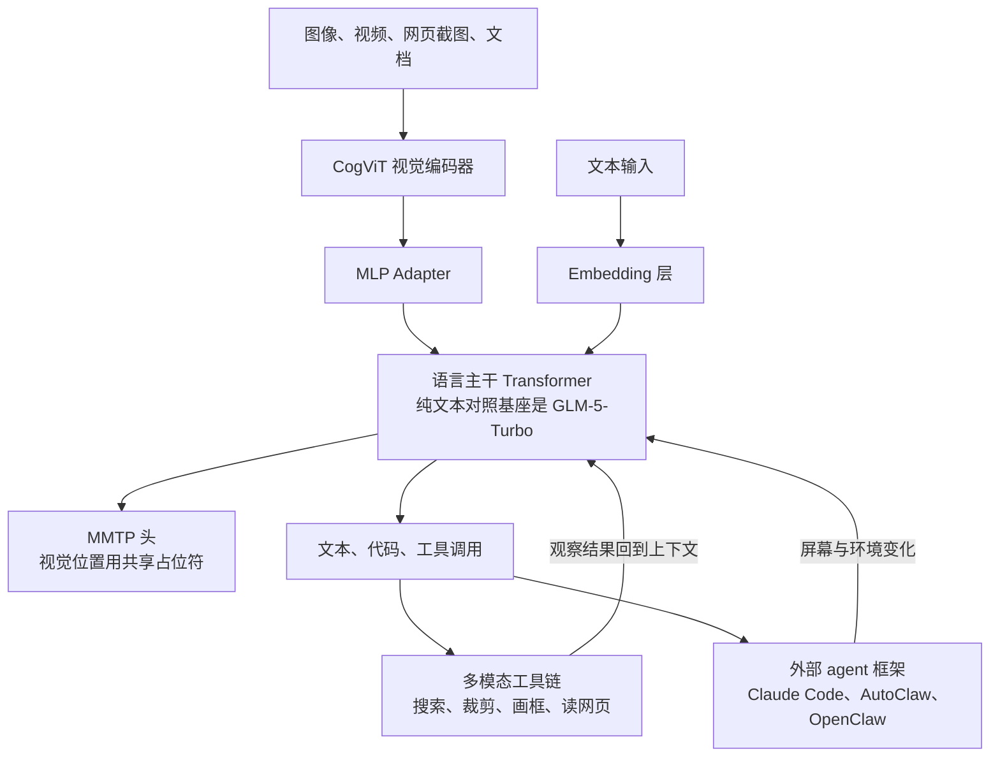
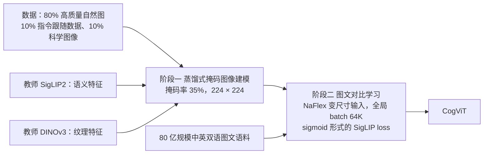
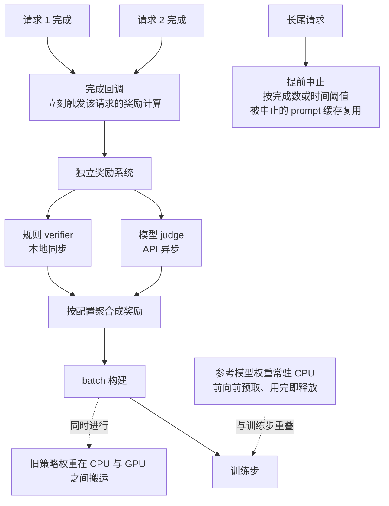
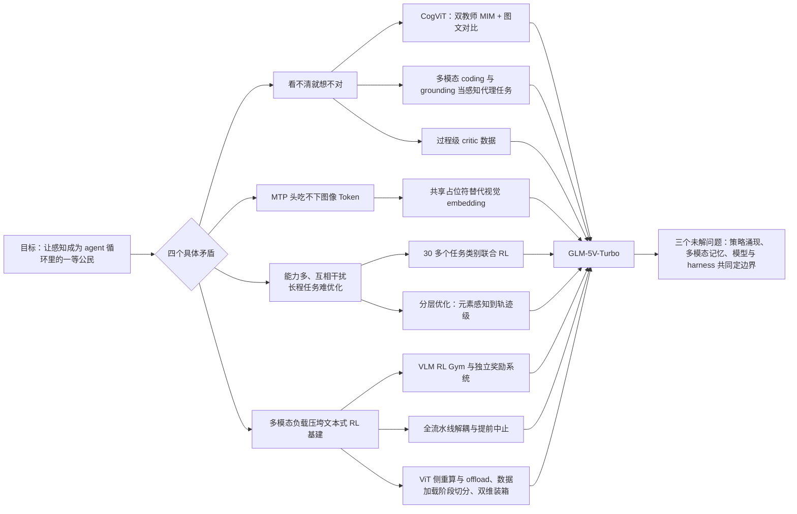

# GLM-5V-Turbo：把感知从输入接口变回决策回路的一部分

<!-- release-date: 2026-04-01 -->

> 本文依据 Z.ai 与清华大学的 **GLM-5V-Turbo: Toward a Native Foundation Model for Multimodal Agents**，arXiv:2604.26752v3，2026-05-12 提交的修订版，共 30 页。页码均指 PDF 自身的页码。文中会区分三件事：**报告明确写了什么**、**我们怎么解释它**、**哪些是外部资料或本文推算**。以引用块出现的报告观点是中译，不是逐字原文。

## 阅读前先认识几个词

这篇报告默认读者已经在做多模态与 agent。先把几个词换成人话：

- **视觉编码器（vision encoder）**：把一张图变成一串向量的模型，常见实现是 ViT（Vision Transformer）——先把图切成小方块（patch），每块变一个向量。
- **视觉 Token**：视觉编码器吐出的那串向量，和文本 Token 拼在同一条序列里送进语言主干。一张高分辨率图可能占几百到几千个 Token，后面很多问题都从这里来。
- **对比学习（contrastive learning）**：让配对的图和文在向量空间里靠近、不配对的推远，CLIP 与 SigLIP 都属于这一类。它擅长语义（这是什么），不一定擅长细节和位置。
- **掩码图像建模（Masked Image Modeling，MIM）**：遮住图的一部分，让模型补回来。它学纹理和结构，但不天然和文字对齐。
- **多 Token 预测（Multi-Token Prediction，MTP）**：训练时除了预测下一个 Token，再挂几个小模块预测更远的 Token；推理时这些小模块可以当草稿模型做投机解码，一次猜几个 Token 再由主模型验证。
- **Grounding（定位）**：让模型指出某个东西在图里的具体位置，通常输出一个框或一个点。GUI agent 的每一次点击本质上都是一次 grounding。
- **Harness（脚手架）**：包在模型外面的那层工程——怎么拆任务、给哪些工具、怎么管上下文、怎么判定成功。
- **Verifier（验证器）**：判定一次 rollout（模型把任务实际做一遍的过程）做得对不对的程序或模型。

报告自己起的三个名字：**CogViT**（这一代的视觉编码器）、**MMTP**（Multimodal Multi-Token Prediction，把 MTP 扩展到图像输入）、**ImageMining**（自建的以图为起点的深度搜索评测集）。

## 一句话先说清

这份报告最容易被误读的地方是：**它不是一份可复现的训练配方，而是一份方法与经验报告。**

30 页里，正文 12 页（PDF p. 1–12），作者名单 1 页、参考文献 4 页（PDF p. 13–17），剩下 13 页全是定性 demo（PDF p. 18–30）。参数量、层数、预训练 Token 数、RL 算法名与超参都没有公布，也没有任何一个组件在最终模型上的消融。

它公布的是另一类东西：一个视觉编码器的两阶段训练思路（PDF p. 2–3）；一个把 MTP 接到图像输入上的具体取舍（PDF p. 3）；跨 30 多个任务类别联合 RL 后各类能力涨了多少（PDF p. 4）；为多模态 RL 改造训练栈的四个方向（PDF p. 4–5）；三条设计判断与三个未解问题（PDF p. 9–12）。**读它要抄判断，不要指望抄配方。**

贯穿全文的主张是（PDF p. 1）：

> 多模态感知是推理、规划、工具使用与执行的核心组成部分，而不是接在语言模型前面的辅助接口。

这句话值不值钱，取决于它能不能落到具体设计上。下面按报告里的四个具体矛盾一条条验。

## 先看全景：这个系统由哪几块组成

这张图据 Figure 2 右半部分（CogViT + MLP Adapter、Embedding Layer、Transformer Block × L、MTP Module）与第 2、3 节的文字重画（PDF p. 3、p. 5–7），是结构示意。两条回到主干的边就是报告说的 perception–planning–execution loop（感知—规划—执行回路）：看一眼环境，决定做什么，做完再看一眼变化了的环境（PDF p. 5、p. 7）。

两件事要先说清：

- **它有一个纯文本的对照基座。** 报告称 GLM-5-Turbo 是它的 language-only base model，目标是加上视觉而不把原有的编程与 agent 能力弄坏（PDF p. 1）。两者的权重是什么关系（初始化、继续训练还是并行训练），报告没说。这决定了后面评测里那块纯文本对比的意义。
- **规格几乎全空白。** 官方 API 文档给出 200K 上下文与最大 128K 输出（外部补充，见文末）；参数量、层数与激活参数，报告和官方文档都没有公布。

## 第一个矛盾：agent 看不清，后面全是白算

### 旧问题：很多「高层失败」起点是看错了

近几年多模态的注意力都在往上走：规划、推理、反思。报告的观察正好相反（PDF p. 9，Lens 1）：

> 即使在当前最强的一批 VLM 里，细粒度感知与空间理解的错误依然常见，而且会一路传到下游的推理、决策与执行。很多看起来是高层的失败，起点是模型没把环境看清楚。

这对 agent 特别致命。文本 agent 读错一个字，下一步常能自我纠正；GUI agent 把按钮位置认偏一点，点下去的就是另一个东西，整条轨迹从此进入一个模型自己都不知道的状态。所以第一件事是重做视觉编码器。

### 新设计：CogViT 的两阶段预训练

CogViT 被定位为参数高效的视觉编码器，要同时具备通用物体识别、细粒度理解、几何与空间感知三种能力（PDF p. 2）。三件事有内在冲突：纯对比学习擅长语义却对细节和位置不敏感，纯掩码建模擅长纹理结构却不和语言对齐。CogViT 的办法是分两段，先补细节，再补对齐。

这张图据 PDF p. 2–3 的文字重画，报告没有给这张图。

**阶段一：双教师蒸馏式掩码图像建模。** 遮掉 35% 的区域，在 224 × 224 分辨率下，让学生 ViT 在两个教师的特征空间里把遮住的部分重建出来：SigLIP2 管语义，DINOv3 管纹理（PDF p. 2）。重建目标不是像素而是特征——**以下是本文的解释**：重建像素会逼模型去记噪声与光照，重建特征等于告诉学生「把这块补成语义上和纹理上都对的东西」，两个教师各管一个维度。数据按质量混合：80% 高质量自然图、10% 指令跟随数据、10% 科学图像（PDF p. 2）。

优化器是 Muon 配 cosine 衰减，另外引入 QK-Norm：在注意力计算前把 query 与 key 归一化，抑制 logit 爆炸、保证大规模下的稳定（PDF p. 2）。点积 logit 会随向量模长放大，先归一化再点积，等于只比方向不比音量。

**阶段二：图文对比学习。** 相对阶段一有三处升级（PDF p. 2–3）：

1. 固定 224 × 224 换成 NaFlex，处理变尺寸输入并保留原始宽高比；
2. 全局 batch 提到 64K，用 sigmoid 形式的 SigLIP loss，配一个双向的分布式实现；
3. 使用 80 亿规模的中英双语图文语料。

第一条对 agent 是刚需：截图、设计稿、网页长图的宽高比千奇百怪，硬缩成正方形会毁掉版式比例，而版式比例正是 UI-to-code 任务的答案本身。第二条里 sigmoid 的意义是（**本文解释**）：softmax 对比损失要在整个 batch 内归一化，batch 越大全局同步越贵；sigmoid 把每个图文对当独立的二分类，64K 这种 batch 在工程上才可行。

这一段仍用 Muon，但视觉、文本、投影三个部分**各配各的学习率与衰减曲线**（PDF p. 3）。一个模型里不同模块的梯度尺度本来就不一样，全局一个学习率只是默认值。

### 收益：Figure 1 说了什么

Figure 1 把 CogViT-L 与三个主流编码器并排（PDF p. 2，数字读自柱顶标注）：

| 基准 | CogViT-L（403M） | SigLIP2-SO（427M） | DFN-H（632M） | MetaCLIP2-H（632M） |
|---|---:|---:|---:|---:|
| ImageNet-1K（零样本） | **83.5** | 83.3 | 83.4 | 79.8 |
| 38 CLIP Bench（均值） | **70.4** | 69.1 | 69.6 | 67.7 |
| 14 General Obj Bench（均值） | **45.1** | 41.5 | 43.9 | 45.0 |

要老实读这三行：

- ImageNet-1K 上三家咬死，领先 SigLIP2 与 DFN 只有 0.2 与 0.1；
- 38 CLIP Bench 领先 0.8–2.7，是最扎实的一行；
- 14 General Obj Bench 对 MetaCLIP2-H 只高 0.1，但参数少了约 36%。

准确的说法是：**CogViT 用更小的编码器拿到持平或略好的成绩**，报告自己用的词也是 competitive，不是全面领先。还有一处要注意：正文说 CogViT 强在通用识别、细粒度理解与几何空间感知三方面（PDF p. 2），但 Figure 1 的三组基准都偏通用识别，细粒度与空间感知这两项主张在图里没有对应的数据。

### 代价与边界

- CogViT 的层数、隐藏维、patch 大小、Token 上限都没公开，图上只有 CogViT-L（403M）一个规格。
- 没有消融证明 CogViT 对最终模型的贡献：换成 SigLIP2，整个模型会掉多少，报告没说。
- 两阶段配方本身也没有消融：不做阶段一直接对比学习会怎样，不知道。

**可迁移**：重建目标可以是别人的特征，不必是原始信号——手里有几个各有所长的现成模型时，让学生同时对齐它们的表示空间，比自己定义新损失更省事。再有，**不要为了工程方便牺牲输入的几何真相**：变尺寸、保宽高比，对通用 VQA 也许无所谓，对版式还原就是任务本身。

## 第二个矛盾：多 Token 预测碰上图像 Token

### 旧问题：MTP 头吃的是 Token ID，图像给不出 ID

纯文本 MTP 很直接：前缀 Token 有 ID，查一下词嵌入就能送进 MTP 头。图像没有 ID，视觉编码器吐出的是一串连续向量。问题变成：**MTP 头在图像位置到底该吃什么**（PDF p. 3）。

这不是学术洁癖。报告写明目标是在多模态设置下保住「acceptable length」以及训练与推理效率（PDF p. 3）——在 MTP 语境下，这通常指投机解码的接受长度，报告没有展开定义。MTP 头在推理时做草稿，直接决定吞吐；在训练时它挂在流水线末端，直接决定要跨多少段搬多少数据。

### 新设计：三个选项，选了第三个

报告系统比较了三种做法，最终采用第三种：保留视觉位置，把视觉 Token 换成一个共享的可学习特殊 Token `<|image|>`（PDF p. 3，Figure 2）。它同时在两边赢：

**对选项 1 赢在系统。** 用占位符后，视觉 embedding 不再需要跨流水线并行的各段传播，通信复杂度显著下降，可扩展性与可维护性都变好（PDF p. 3）。上图下半说的就是这件事：MTP 头挂在最后一段，选项 1 要把第一段算出的视觉 embedding 一路送过去，而 `<|image|>` 只是词表里的一项，最后一段自己查表就有。**一个共享占位符，把一条跨设备的数据依赖变成了一次本地查表。**

**对选项 1 也赢在优化。**

上图引自 Figure 2 左下角（PDF p. 3），数值读自坐标。报告的说法是：在 0.5B 模型上的消融里，占位符方案训练 loss 更低、收敛更稳（PDF p. 3）。它给了一个假说，不是证明：MTP 头通常很轻，可能没有足够容量去吸收分布与文本嵌入差异很大的视觉表示；换成占位符后输入形式更统一，优化难度下降（PDF p. 3）。图上两条线都很平滑，「更稳」在图里不明显，「更低」是清楚的。

**对选项 2 赢在兼容性。** 报告说占位符方案与序列并行、上下文并行的现有切分天然兼容，不需要为视觉 embedding 额外处理切分、对齐或偏移映射（PDF p. 3）。报告把这一句放在与「全掩掉」的对比里，但没有解释全掩掉为什么需要这些额外处理；更直接的差别是选项 2 连「这里有一张图」都抹掉了。

### 代价与边界

- **视觉内容确实没进 MTP 头。** 草稿模块在图像附近只知道「这里有一张图」。报告没有给多模态输入下的接受长度或投机解码加速比，这个取舍的实际代价读不出来。
- **消融只在 0.5B 上做。** 「轻量 MTP 头容量不足」恰恰是可能随规模变化的假说，报告没说在最终规模上重新验证过。
- **MTP 深度没写。** Figure 2 画了三个共享参数的 MTP 模块，正文没有说最终用几个、推理时展开几步。

**可迁移**：一个模块吃不下另一种模态时，先问它需不需要吃。MTP 头要猜下几个 Token，更需要位置结构，未必需要图像内容。把「必须传什么」和「习惯上传了什么」分开，常常能砍掉一整条数据通路。

## 第三个矛盾：能力越多，越互相打架

### 旧问题：SFT 里加一个领域，常常掉另一个

做过多任务微调的人都熟悉：加了 OCR 数据数学掉了，补了 GUI 数据写作变差了。报告管这叫 cross-domain trade-offs（跨领域取舍）（PDF p. 4）。GLM-5V-Turbo 的路线是：预训练就开始混，最后在 30 多个任务类别上联合 RL。

### 预训练就开始混

报告说从预训练阶段起就深度融合视觉与语言，用纯文本加多模态的混合数据；多模态部分覆盖世界知识、图文交错、OCR、代码、GUI、视频、多模态工具使用、空间感知、grounding、学科解题（PDF p. 4）。其中**特别加重了多模态 coding 数据**，理由是把视觉理解与代码生成对齐（PDF p. 4）。这一条在后面的 Lens 1 里会再出现。

配比、Token 数与 SFT 数据规模都没有公开。

### 联合 RL：相对 SFT 各涨多少

RL 阶段覆盖 30 多个任务类别，并用了若干算法改进，报告举的例子是在 UI-to-code 任务上采用**相对视觉策略优化（relative visual policy optimization）**，出处指向 UI2Code^N 一文（PDF p. 4，文献 [45]）。报告只给了这一句：方法的具体形式、用在哪个阶段、单独带来多少增益都没写。

分项提升按能力层次组织（PDF p. 4）：

| 层次 | 基准 | RL 相对 SFT |
|---|---|---:|
| 感知 | RefCOCO-avg（2D grounding） | +4.8% |
| 感知 | PointBench（pointing） | +3.2% |
| 感知 | MVBench（视频理解） | +5.6% |
| 感知 | SUNRGBD（3D grounding） | +7.7% |
| 感知 | OCRBench（OCR） | +4.2% |
| 感知 | CharXiv（图表理解） | +7.7% |
| 推理 | MMMU_Val、MMMU_Pro、MathVista、LogicVista 合计 | +1.8% |
| Agent | OSWorld（GUI agent） | +4.9% |
| Agent | MMSearch（通用工具使用） | +3.5% |
| Agent | CC-Backend（编码 agent） | +0.2% |

两点读法：报告用的是百分号，但没说明是绝对分数差还是相对提升，两种读法差别很大；CC-Backend 的 +0.2% 基本在噪声范围，和 +7.7% 并列在同一句里，但不是同一量级的证据。STEM 那一项报告的措辞是「解题更稳定」，涨幅也最小。

### 报告观察到的三个现象

这三条都是作者观察，不是受控实验；报告说它们在更早的 GLM-4.1V-Thinking 与 GLM-4.5V 里就一再出现过（PDF p. 4）：

1. **RL 的跨领域干扰比 SFT 弱**，多个领域可以一起稳定地涨。
2. **分布较窄的领域里，单任务 RL 容易震荡，联合训练反而更稳**，因为模型见到了更丰富的策略分布，被推向更鲁棒的解法。
3. **思维模式会跨任务迁移**：一个领域学到的推理行为，有时会带到另一个领域并产生可测的收益。

第二条若成立，是个反直觉的工程结论：**某个任务的 RL 一直不稳时，加更多同类数据可能不如加一些不同类的任务。**

### 代价：覆盖范围就是泛化边界

报告没有把这讲成免费午餐（PDF p. 4）：

> RL 没有覆盖到的能力，有时会在后训练之后下降，尤其是那些和训练任务分布更正交的能力。

给的解释是：RL 推进中，模型容量与学到的思维模式越来越集中在被采样的任务分布上，欠代表的领域就退化。结论是：**RL 阶段的任务覆盖范围本身，就是塑造最终泛化边界的一个因素。** 出路是代理任务：目标能力即使写不成 RL 任务，语义或结构相关的代理任务也可能提供优化信号，例子是单轮 UI-to-code 上的 RL 能支撑更复杂的多轮编码能力（PDF p. 4）。

这一段末尾还提到多任务协同 RL「包括 on-policy distillation（在线策略蒸馏）」（PDF p. 4），但全文没有它的任何实现描述——没有教师配置、损失形式或采样策略。

**可迁移**：提前列出你不打算放进 RL 的能力清单，给它们准备回归测试。它们大概率会掉，问题只是掉多少、什么时候发现。

## 第四个矛盾：多模态负载压垮为文本设计的 RL 基建

这是全篇对基础设施工程师最有价值的一节（PDF p. 4–5）。多模态多任务 RL 要处理提示与回复长度的巨大波动，同时支持单步与多步任务，还要为每个任务协调一个或多个规则型或模型型 verifier（PDF p. 4）。报告沿四个方向重做了训练栈。

### 方向一：统一的任务与奖励抽象

- **VLM RL Gym**：给单步与多步任务一致的环境接口，异构任务在同一框架里处理。
- **独立的奖励系统**：集中编排多个 verifier。规则型 verifier 本地同步执行，模型型 judge 通过 API 异步调用，再按可配置的聚合策略合成奖励；verifier 逻辑不和主训练代码纠缠。
- **数据源标签**：每个样本带一个 data-source tag，reward、pass@k 这类指标可以按来源跨并行组聚合、分开上报（PDF p. 5）。

第三条容易被当成日志功能跳过，其实是前两条的前提：30 多个任务类别混在一起训练时，总 reward 曲线毫无诊断价值——某个任务崩了，会被另一个任务的上涨完全掩盖。**混合任务训练的可观测性，要做在数据结构里。**

### 方向二：全流水线解耦、异步与阶段重叠

这张图据 PDF p. 5 的文字重画，虚线表示并行关系；报告没有给流水线图，也没有各阶段的实测耗时。

训练流水线把 rollout 推理、奖励评估、batch 构建与权重搬运拆开，尽量让它们重叠（PDF p. 5）。四个具体动作：

1. **每个推理请求注册一个完成回调**，请求一结束就算它的奖励，不等整个 rollout batch，减少长尾请求造成的空转。
2. **batch 构建与旧策略权重的 CPU–GPU 搬运并行。**
3. **参考模型参数常驻 CPU 内存**，参考前向之前异步预取到 GPU，用完立刻释放，让参考计算与主训练步重叠。
4. **两种提前中止模式**：按完成数量或按时间阈值；被中止的 prompt 可缓存复用，在不实质降低数据利用率的前提下控制长尾延迟。

第 1 条与第 4 条是一对：前者降低等长尾的成本，后者直接砍掉最长的尾巴，而缓存复用保证被砍的样本只是被推迟、没有被扔掉。**以下是本文的解释**：如果异步 RL 里必须丢弃某些 rollout，丢弃规则很容易顺手引入采样偏置——越难的题越容易超时被丢，模型就越少练到难题。缓存复用把这件事绕开了，这个细节比「支持提前中止」本身重要。

第 3 条是拿 PCIe 带宽换 HBM 容量的经典交易：参考模型只做前向、用来算 KL 之类的约束，是纯粹的显存占用大户，前提是预取能被别的计算盖住。

### 方向三：视觉侧的细粒度显存管理

标准重计算方案大多围绕纯文本训练设计，没有处理多模态输入带来的显存瓶颈（PDF p. 5）。报告为视觉侧的 ViT 与 projector 单独设计显存策略，把定向重计算与 CPU offload 结合起来，**防止激活显存朴素地随图片数量线性增长**。

为什么会线性增长？一条样本里的图片数是可变的，每张图都要过一遍 ViT、留一份激活。文本训练可以把序列长度 packing 到接近定值，图片数做不到。

### 方向四：面向视觉输入的拓扑感知切分与动态负载均衡

针对长视频这类序列长度剧烈变化的视觉输入（PDF p. 5）：

- **把 CP（上下文并行）与 TP（张量并行）的切分从前向阶段前移到数据加载阶段。** 传统做法在前向里切，每个 rank 得先持有完整的 patch 张量再重分发，白付显存与通信。
- **切分边界对齐下采样组（downsample group）**，免掉跨 rank 聚合 patch。
- **DP 组之间做完负载均衡后，用异步 all-to-all 精确分发**，每个 rank 只收自己要的那份。
- **把大的 Python 对象从 GPU 通信路径挪到 CPU 路径**，实测减少约 **7 GB** 的 GPU 通信缓冲区开销。
- **对 rollout 产生的变长序列，同时按序列长度与 ViT Token 数联合装箱**，让 micro-batch 在算力与显存上都更均衡。

最后一条是这一节的点睛之笔：文本训练的 packing 只看序列长度一个维度，多模态训练有两个成本维度——语言主干跟序列长度走，视觉编码器跟 ViT Token 数走。**只按一个维度装箱，另一个维度必然长尾。** 那个 7 GB 也很有教育意义：它不是算法优化，是把不该走 GPU 通信路径的东西挪走。规模上去以后，「东西放错了地方」的浪费经常比算法本身的浪费更大。

四个方向都没有给整体吞吐、GPU 利用率或训练时长的前后对比，7 GB 是这一节唯一的量化数字。

## 工具链与生态：会调工具，和会用眼睛调工具

### 把图像变成可以反复操作的环境

传统 agent 的循环是「读文本、调函数、读返回文本」，整个循环不需要看。报告的观察是，很多真实任务要先解读视觉环境、决定下一步，再根据动作结果继续调整（PDF p. 6）。Table 1 列出了自研工具（前缀 `zai_`），同时兼容用户自定义工具（PDF p. 6）：

| 场景 | 工具组 | 工具（去掉 `zai_` 前缀） |
|---|---|---|
| 通用 | 识别 | recognize_plant、recognize_location、recognize_person |
| 通用 | 多模态搜索 | search_web_text、search_web_by_image、search_similar_images、search_web_images、search_scholar |
| 通用 | 浏览器 | load_image_from_url、read_webpage |
| 通用 | 图像处理 | crop_image、draw_image_bounding_boxes、draw_image_point_markers、draw_image_geometry、draw_image_3d_bounding_boxes、draw_video_objects_tracking |
| 创作 | 网页创作 | submit_plan、apply_edits（这两个不带前缀）、generate_web_html、generate_web_outline |
| 创作 | 幻灯片创作 | generate_slide_html、generate_outline_ppt |
| 深度研究 | 多模态 DR | dr_python、dr_open_url_mm、dr_visit_img、dr_search、dr_images_search、dr_images_lens |

图像处理那一组是和普通 agent 工具箱的真正区别：裁剪、画框、画点、画 3D 框，这些工具的输出还是图，还要再送回模型自己看。报告说模型在长程任务里频繁切换多模态搜索、标注、截图与多模态网页阅读，编码与执行因此不再局限于文本界面（PDF p. 5）。

报告举的例子很具体：复刻一个真实网站时，模型先以多模态 GUI agent 的身份通过截图、与页面元素交互、跨页面导航去探索这个站点，理解布局、功能与交互流程，再用原生的 UI-to-code 能力复刻；需要嵌入图片素材时，直接用裁剪之类的原生工具处理（PDF p. 6）。**先探索再生成，而不是看一眼截图直接写代码**——一张截图只有一个状态，网站的交互逻辑分布在多个状态之间。

相对上一代 GLM-4.6V，MMSearch-Plus 拿到 30.0，报告称「接近八倍」；BrowseComp-VL 51.9，ImageMining 30.7（PDF p. 6）。报告没给前一代的具体分数；按 30.0 除以 8 约为 3.75（**本文推算**），从很低的基数涨起来，倍数会显得很大。另有一处编辑瑕疵：正文写 GLM-4.6V，引用编号 [37] 指向的却是 GLM-4.5V 与 GLM-4.1V-Thinking 那篇论文（PDF p. 6、p. 16）。

### 与外部框架的分工

报告的分工是（PDF p. 7）：Claude Code 管逻辑与环境（终端、本地文件系统）；AutoClaw 提供浏览器与 GUI 自动化这双「手」，GLM-5V-Turbo 在其中当视觉语言控制器；模型本身把具体执行逻辑卸给框架，专注高维推理。这一段是全篇最像宣传稿的地方，没有接口细节、没有性能数据、没有失败模式分析。

### 多模态深度研究与内容创作

§3.4 描述了一条完整的多模态深度研究流程：从开放目标出发，循环地规划、多模态阅读、更新状态；原生解析视觉丰富的网页、图表与结构化文档，拿到纯文本流水线通常会丢掉的幻灯片与插图这类证据，并把表格区域、截图等视觉证据与文字证据一起抽取（PDF p. 7–8）。输出形态有三种：图文交错报告、深度研究转 PPT、博客式的文档解读。Figure 3 给了两例：一份比较 OpenClaw 与 Hermes 两个 agent 系统的图文报告，插图由模型搜来、挑选、编排；一篇从 GLM-5 论文改写的技术博客，插图从原论文裁出（PDF p. 8）。两例都只有缩略图，没有质量评估。

### 官方 Skills

Table 2 列了 15 个官方 skill，按类型各 5 个（PDF p. 9）：

| 类型 | Skill |
|---|---|
| Native（基于模型原生能力） | PDF-to-Web、PDF-to-PPT、Web Replication、PRD-to-App、Stock Analyst |
| External Tool（把模型包成 MaaS API，供 OpenClaw、AutoClaw、Claude Code 调用） | Image Captioning、Visual Grounding、Doc-based Writing、Resume Screening、Prompt Generation |
| Specialized（基于此前发布的 GLM-OCR 与 GLM-Image） | General OCR、Table Recognition、Handwriting Recognition、Formula Recognition、Image Generation |

正文先说 skill 分两类（原生能力、外部工具），再说「另外」基于 GLM-OCR 与 GLM-Image 做了 5 个，另有一个统一的 master skill（PDF p. 8）。这个划分的工程含义是：同一个模型，一部分能力靠内化（模型自己会），一部分靠外挂（被别的 agent 当工具调）。**做基座的团队要同时回答「我的模型能干什么」和「别人怎么把我的模型当工具用」**，这是两套不同的接口设计。

## ImageMining：先定义什么样的题不该进来

### 旧问题：传统 VQA 允许抄近路

传统 VQA 是一次性的：给图、给问题、出答案。模型可以靠参数里的知识蒙对，也可以只读图里的字然后走纯文本推理，图只当了个引子。报告要评的是另一件事，叫 think with image, deep search with image——推理要**锚定在视觉上下文里**，成功依赖多步工具调用，比如裁剪或放大细节来改写搜索词（PDF p. 7）。

### 构造：用 Visual Jump 堵死近路

ImageMining 由 **217 条**精选用例组成，来自人工收集的轨迹样本，覆盖 7 个领域（社交、娱乐、产品、地点、富文本、自然、科学）与 5 个推理类别（通用识别、时空推理、事件推理、基于文本的推理、视觉检索）（PDF p. 7）。

关键约束叫 **Visual Jump**（标记为 `WEB_VISUAL`）：知识发现阶段，中间的推理跳转必须包含视觉转移，逼模型去解析图像，而不是依赖文字捷径或参数化知识。另外专门为图表、地图与海报构造了 OCR Search 数据，逼模型在发起搜索链之前先做实体隔离与局部裁剪——报告的原话是「把图像从静态输入变成可深入探索的交互环境」（PDF p. 7）。翻成人话：**一道题如果能不看图答对，它就不该进来。**

报告还给了一条经验：任务表现与模型在图上用工具的精度强相关（PDF p. 7）。裁得准不准，直接决定后面搜得对不对。

要注意一处措辞：§3.3 用来构造 Visual Jump 的「多阶段自动数据流水线」，报告写的目的是「让 GLM-5V-Turbo 具备这些能力」（PDF p. 7），也就是说它首先是训练数据流水线；217 条测试用例则来自人工收集的轨迹。两者的关系报告没有说清。

### 边界

- 自收集、自评测，评分方式、是否人工核对、采样次数都没公开。
- 只有 217 条，几道题的差异就能改变名次。
- 在 Figure 4 里 Claude Opus 4.6 这一格是横杠，所以 30.7 只和 Kimi K2.5 的 24.4 构成对比（PDF p. 11）。
- 数据集地址在 PDF p. 7 脚注，公开了多少报告没写。

**可迁移**：造评测集时，先定义什么样的题不该进来。ImageMining 的价值不在 217 这个数，而在 Visual Jump 这条排除规则——它把「评测多模态能力」这个模糊目标，变成一条可以逐条判定的构造约束。

## 三条设计透镜：报告真正想留下的东西

第 4 节标题是 Design Lenses from Development，作者明说这不是普适规则，而是开发中反复证明有用的视角（PDF p. 9）。

### Lens 1：感知始终是上层多模态能力的地基

核心判断前面已经引过，这里补两个具体做法（PDF p. 9）。

**用多模态 coding 与 grounding 当感知的代理任务。** 前端或 SVG 编码要求模型抓住布局、结构、相对位置与局部细节，不能只靠粗粒度语义。报告说：预训练里加入学科图像与其 SVG 表示的配对数据，对下游 STEM 解题有正面贡献；RL 阶段加强 grounding 训练，改善了 GUI agent 表现。SVG 看起来是下游生成任务，却被当成提升感知的手段，因为 SVG 是**把视觉结构显式写出来的表示**——不理解元素的相对位置，就写不对一段 SVG。两条都是作者观察，没有给数字。

**训练模型质疑自己的观察。** GUI agent 的指令微调里加了一部分 critic 数据，专门针对推理过程中的错误：看错界面细节、认错目标元素、对下一步动作判断失误。报告说这提升了对 GUI 细节的观察质量，减少了几种反复出现的感知失败模式，也有助于减少生成时的幻觉（PDF p. 9）。注意 critic 数据针对的是**过程中的错误**，不是最终答案对错：它教的是「你刚才那一眼看错了」。

Lens 1 的结论写得很硬：感知不是可以早早解决然后丢在一边的低层模块，它持续决定上层能力的上限（PDF p. 9）。

### Lens 2：agent 能力用分层优化建起来更划算

agent 训练本来就贵：环境搭建与任务构造成本高，高质量数据稀缺，可靠验证困难；agent 任务本身又难优化：组合复杂、交互轨迹长、解法不唯一、强依赖不断演化的环境状态（PDF p. 9）。资源有限时，核心问题是**怎样让数据构造的回报率最大**。

报告的做法是把优化分布到能力层级的多个层次上，而不是集中在高层长程任务上。GUI agent 的层级是（PDF p. 10）：

据 PDF p. 10 的文字重画。报告明确说这四级在 **SFT 和 RL 里都用**。理由有两个（PDF p. 10）：同样资源下，低层任务比长程任务更容易构造、标注与验证；低层能力还不够时，只在高层任务上使劲往往拿不到可靠收益，反而让训练更不稳。

第二条比第一条更重要，它说的是**可优化性**：模型连按钮在哪都指不准时，在整条轨迹的成败上给一个稀疏奖励，梯度里几乎没有信息。这和课程学习不完全一样——课程学习通常调同一类任务的难度，这里调的是任务的**抽象层级**，而且各层同时训练。

### Lens 3：端到端任务的关键不是更长，而是可规定、可验证、可控评估

对多模态 agent 来说，真正的挑战往往不是把任务拉得更长，而是让端到端任务稳定到足以当评估与优化目标（PDF p. 10）。现实 agent 场景天然开放：目标欠规定、执行边界模糊、结果高度依赖中间决策，于是难以一致比较，更难变成可复用的优化信号。

报告的观点是：一个端到端任务的价值，不只取决于它有多真实，还取决于它能否**规定得足够清楚、验证得足够可靠、在足够的流程控制下评估**（PDF p. 10）。具体落地是 Vision2Web（arXiv:2603.26648），一个端到端视觉网站开发评测（PDF p. 10）：

- **任务侧**：每个任务不只是一句文字指令，而是一份更丰富的规格，可能包括 PRD、设计稿、参考页面与素材资源。
- **评估侧**：用 workflow-based verification（基于流程的验证），执行过程经过一串有依赖关系的受控步骤来评估，而不是只看最终状态。
- **收益**：更容易横向比较、归因失败，也能把不同信号分开建模，比如交互执行中的功能正确性，和更隔离场景下的视觉一致性。

**可迁移**：把任务规格从一句 prompt 扩成一组约束物（文档、参考、素材）；把终态判定换成过程判定；把「功能对不对」和「长得像不像」这类不同性质的信号分开评。

## 评测：哪些结论有证据，哪些要打折

第 5 节把评测分成四类，结果全在两张图里（PDF p. 10–11）。

### 多模态与 GUI（Figure 4）

Figure 4 原图是一张表（PDF p. 11）：

| 类别 | 基准 | GLM-5V-Turbo | Kimi K2.5 | Claude Opus 4.6 |
|---|---|---:|---:|---:|
| 多模态编码 | Design2Code | **94.8** | 91.3 | 77.3 |
| 多模态编码 | Flame-VLM-Code | 93.8 | 88.8 | **98.8** |
| 多模态编码 | Vision2Web | 31.0 | 33.2 | **43.5** |
| 多模态工具使用 | ImageMining | **30.7** | 24.4 | — |
| 多模态工具使用 | BrowseComp-VL | **51.9** | 42.9 | 35.9 |
| 多模态工具使用 | MMSearch | **72.9** | 58.7 | 63.8 |
| 多模态工具使用 | MMSearch-Plus | **30.0** | 25.6 | 25.6 |
| 多模态工具使用 | SimpleVQA | **78.2** | 71.5 | 63.2 |
| 多模态工具使用 | Facts | **58.6** | 57.8 | — |
| 多模态工具使用 | V* | **89.0** | 84.3 | 66.5 |
| GUI Agent | OSWorld | 62.3 | 63.3 | **72.2** |
| GUI Agent | AndroidWorld | **75.7** | 43.1 | 62.0 |
| GUI Agent | WebVoyager | **88.5** | 84.3 | 88.0 |

怎么读：

- **多模态工具使用七行全赢，但幅度差很多。** 相对次名，MMSearch 领先 9.1、BrowseComp-VL 领先 9.0、SimpleVQA 6.7、ImageMining 6.3、V* 4.7、MMSearch-Plus 4.4，Facts 只领先 0.8。
- **多模态编码赢一输二。** Design2Code 94.8 对 Opus 的 77.3 是压倒性的；Flame-VLM-Code 输 Opus 5.0；Vision2Web 同时输给 Kimi 与 Opus，31.0 对 43.5 差 12.5。**Vision2Web 是他们自己提出的评测，他们在上面排第三**，报告照实放进了表里。
- **GUI 赢二输一。** AndroidWorld 领先次名 Opus 13.7、领先 Kimi 32.6；WebVoyager 对 Opus 只高 0.5；OSWorld 同时输给 Kimi 与 Opus。
- ImageMining 与 Facts 两行 Opus 是横杠，对比不完整。

一个旁证：同一批里 Kimi K2.5 的数字可以和 Kimi-K2.5 一篇的原报告对照。OSWorld 63.3 与其自报的 OSWorld-Verified 一致；SimpleVQA 这里写 71.5，Kimi 自报是 71.2。GLM-5V-Turbo 报告没说对照模型的分数是自测还是引用，这个 0.3 的差也就无从解释。

一句话概括：**它在「用眼睛去查东西」上明显领先，在「把看到的东西完整做成一个可用系统」上还没有。**

### 纯文本编码与 Claw（Figure 5）

Figure 5 同样是表（PDF p. 11）：

| 类别 | 基准 | GLM-5V-Turbo | GLM-5-Turbo | Kimi K2.5 | Claude Opus 4.6 |
|---|---|---:|---:|---:|---:|
| 编码 | CC-Backend | 22.8 | 20.5 | 25.3 | **26.9** |
| 编码 | CC-Frontend | 68.4 | 69.4 | 62.3 | **75.9** |
| 编码 | CC-Repo-Exploration | 72.2 | 68.9 | 66.7 | **74.4** |
| Claw | PinchBench（Best / Avg） | 87.0 / 80.7 | 86.5 / 81.1 | 84.8 / 79.2 | **93.3 / 82.9** |
| Claw | ClawEval（Pass^3 / Pass@3） | 57.7 / 75.0 | 51.0 / 72.1 | 52.9 / 73.1 | **66.3 / 77.9** |
| Claw | ZClawBench | 57.6 | 60.6 | 49.1 | **62.3** |

这张表回答本报告最核心的风险问题：**加了视觉，纯文本编码掉不掉？** 对照自家语言基座 GLM-5-Turbo：CC-Backend 与 CC-Repo-Exploration 涨，CC-Frontend 跌 1.0；PinchBench best 涨 0.5、avg 跌 0.4；ClawEval 两项都涨；ZClawBench 跌 3.0。准确的结论是：**没有系统性坍塌，但也不是全面不掉，有两三项确实退了。** 报告正文的措辞是「does not materially erode」（PDF p. 11），这个说法是准确的。

但 Overview 那句话不准：它说模型在 CC-Backend（22.8）、CC-Frontend（68.4）、CC-RepoExploration（72.2）三项上都超过了 GLM-5-Turbo（PDF p. 2），而 Figure 5 里 GLM-5-Turbo 的 CC-Frontend 是 69.4，高于 68.4。以表为准，三项里只有两项超过基座。

Claude Opus 4.6 在这张表的**每一行**都是第一，正文只说自己「remains solid」。

### 评测本身的边界

- **没有公布任何 harness 细节**：工具集、最大步数、上下文长度、重试规则、采样温度、跑几次取什么统计量，一律没有。而报告自己在第 6 节承认 harness 会显著改变结果（PDF p. 12）。
- **对照模型的分数来源没写**，是自测还是引用官方数字不知道。
- **ClawEval 的 Pass^3 与 Pass@3 没定义。** 按通行含义，前者是三次都过、后者是三次至少一次过；若如此，57.7 与 75.0 之间 17.3 的差说明稳定性还有明显空间。
- Design2Code 94.8 这种接近上限的分数，要知道评分方式才能判断还剩多少区分度，报告没给。

## 报告自己列出的三个未解问题

第 6 节写得很坦率，三条都指向具体机制（PDF p. 11–12）。

### 一、更好的 agent 策略怎么涌现

agent 训练严重依赖手工构造或强过滤的冷启动轨迹。这对初始化有效，但也**收窄了模型后续可能探索的推理与动作模式空间**，后期改进往往只是局部的：模型更擅长走熟悉的路，却没发现真正更好的路（PDF p. 11–12）。他们的实验发现，冷启动阶段增加轨迹多样性能部分松开这个约束，让 RL 更容易找到附近的更优变体；由此提出一个假说：**轨迹多样性可能不只是数据覆盖问题，而是策略涌现本身的条件之一**（PDF p. 12）。更远的目标是让模型自己发现更好的推理与 agent 策略，再往后是发现更丰富的组织形式，比如子 agent 分解、多 agent 协作与更灵活的分层决策结构。

对做 agentic RL 的人直接有用：**RL 一直只能小幅改进时，先查冷启动数据的多样性，再调 RL 超参。**

### 二、多模态上下文管理是长程 agent 的核心瓶颈

图像、尤其是视频，消耗上下文预算比文本激进得多。实践中常见的应对是上下文一涨就丢掉早先的视觉观察，这是可以理解的工程妥协，但也丢掉了后面推理、规划或验证可能还要用的信息（PDF p. 12）。纯文本场景里，像 Claude Code 这样的系统会在上下文快满时压缩或摘要早先的历史；多模态场景里，**忠实压缩要难得多，因为要保留的不只是语义，还有后面可能重新变重要的视觉细节**——布局、空间关系、视频里的时间变化。

报告的一句话概括得很好：现有记忆机制基本以文本为中心，**更擅长压缩说过什么，不擅长压缩看到过什么、以及视觉状态怎样随时间演化**。长程多模态 agent 需要原生多模态的上下文与记忆方案（PDF p. 12）。

### 三、模型与 harness 共同决定能力边界

对 agentic 系统来说，有效能力边界已经不由模型单独决定，而是由模型与外面的 harness 共同塑造（PDF p. 12）。这带来两个麻烦：同一个模型在不同的分解策略、工具策略、记忆设计或验证流程下可能表现很不一样，看起来是模型的局限，有时其实是 harness 选得不好；而且**这种依赖是双向的**——一个 harness 有没有用取决于模型所处的能力区间，某阶段无效的设计，可能在模型跨过推理、规划或反馈利用的某个阈值后突然变得关键。所以 harness 不是一层可以独立于模型优化的稳定外壳。

这条判断也解释了评测一节为什么要打折：**harness 会改变结论，而报告没有公布自己的 harness 配置**，这是它最明显的一处内部张力。

## 报告没有公开的

**模型本身**：参数量、激活参数、层数、隐藏维、上下文长度；CogViT 除「CogViT-L（403M）」外的一切规格；MMTP 的模块数与推理展开步数；视觉 Token 压缩策略与视频抽帧策略。

**训练**：预训练 Token 数与各类数据占比、去重与污染检查；SFT 的规模与构成；RL 用的算法、奖励设计与超参；30 多个任务类别的完整清单；相对视觉策略优化与 on-policy distillation 的实现；训练算力、GPU 数量、训练时长与成本。

**消融**：没有任何组件在最终模型上的端到端消融；MMTP 的消融只在 0.5B 上；「联合 RL 相对 SFT」那组数字是唯一接近消融的证据，但它比较的是两个训练阶段，不是两个设计选择。

**评测**：全部 harness 细节；对照模型分数的来源；ImageMining 的评分方式。

**几处编辑瑕疵**（不影响技术内容，但说明对细节要交叉核对）：

- Overview 关于 CC-Frontend 超过 GLM-5-Turbo 的说法与 Figure 5 不符（PDF p. 2、p. 11）；
- 正文写 GLM-4.6V，引用指向 GLM-4.5V 与 GLM-4.1V-Thinking 的论文（PDF p. 6、p. 16）；
- 参考文献里 MMSearch 出现两次（[18][19]，PDF p. 15），OSWorld 出现两次（[43][44]，PDF p. 17），正文两个编号混用；
- 第 5 节把 Design2Code 拼成 Desing2Code（PDF p. 10）；
- 贡献者名单里混进一条明显的占位字符串（PDF p. 13）。

## 附录里的 13 页 demo 说明了什么

PDF p. 18–30 全是定性案例，没有一个数字。它们不是证据，但说明了团队认为哪里是这个模型的主场：

- **配合 agent 框架与 skill**：OpenClaw 加股票分析 skill 产出含技术面、基本面、分析师情绪与行动计划的报告；Claude Code 加网页复刻 skill，从一个 URL 出发做 GUI 探索、素材收集与 HTML 重建；PRD 驱动的整站生成（Figure 6–8）。
- **多模态编码**：含视差滚动、暗色配色与单页结账的电商站；手机 App 界面复刻并补画后续页面；从截图复刻网页并自动抓取图片素材；论文转介绍网站；《Attention Is All You Need》转幻灯片（Figure 9–13）。
- **多模态深度研究**：收集图片素材并逐张标注出处（Figure 14）。
- **文档写作**：读一份 103 页的中文北京旅游指南，写十个必去景点的导览词（Figure 15）。
- **OCR 与文档解析**：多语种逐词识别并标语种；物理教材页面转成含文字、表格与图的 Markdown（Figure 16–17）。
- **视觉搜索与推理**：跨图像识别、书名推断、影视改编、豆瓣海报计数的多跳题；从一张图定位城镇并按总价列出指定日期的三家酒店（Figure 18–19）。
- **识别与 grounding**：视频逐秒目标跟踪输出 JSON；人物框选与命名；GPU 电路板元件框选并与 H100 做参数对比；学生手写答案逐空框选；错别字定位；3D grounding 输出九个值——中心点 x、y、z，尺寸 x、y、z（单位米），加三个弧度制旋转角（Figure 20–24）。
- **空间推理**：数图里有几根手指，并用 `[[x,y]]` 标出位置（Figure 25）。

串起来看，产品意图很清楚：**从视觉输入开始，以代码或结构化动作结束。** 这也解释了它为什么在 Design2Code 与多模态搜索上强，而在 Vision2Web 这种要完整交付一个可用系统的任务上还排第三。

## 最值得带走的七条

### 1. 感知不是可以做完就放下的低层模块

用结构化生成任务（SVG、前端代码）当感知的代理训练目标；用过程级的 critic 数据训练模型质疑自己刚才那一眼。

### 2. 想提升难以监督的理解能力，就找一个必须依赖它的生成任务

写对一段 SVG 必须理解元素的相对位置，写对一个前端页面必须理解布局层次。生成任务天然携带密集监督，理解任务往往只有稀疏标签。

### 3. 长程稀疏奖励的任务，先建能力层级

元素感知、grounding、单步动作、整条轨迹。低层更便宜、更好验证；低层没打好时，只在高层使劲不但拿不到收益，还让训练更不稳。

### 4. RL 的任务覆盖范围就是泛化边界

没放进 RL 的能力会往下掉。提前列清单、备回归测试，或找语义或结构相关的代理任务把它带进去。

### 5. 异步化的收益来自最小完成单元

把奖励回调挂在单个请求上，而不是等整个 batch；任何丢弃机制都要配一个复用机制，否则容错策略会悄悄变成采样策略。

### 6. 多成本维度必须联合调度

语言主干跟序列长度走，视觉编码器跟 ViT Token 数走，只按一个维度装箱，另一个维度一定长尾。任何存在两种独立增长成本的系统都适用。

### 7. 一个共享占位符可以换掉一整条数据通路

下游模块不需要上游的完整内容、只需要它的位置结构时，用占位符替代能同时省掉通信、省掉切分适配，还可能让优化更容易。

## 用一张图把全文串回去

节点都对应报告里实际写到的设计或结论；箭头表示「为了解决」与「共同构成」，不表示时间顺序。

## 关键词回看

- **CogViT**：自研视觉编码器。阶段一用 SigLIP2 与 DINOv3 双教师做蒸馏式掩码图像建模，阶段二做变尺寸图文对比学习。
- **NaFlex**：处理变尺寸输入并保留原始宽高比的方案，替换固定 224 × 224。
- **QK-Norm**：注意力计算前归一化 query 与 key，抑制 logit 爆炸。
- **MMTP**：多模态多 Token 预测。保留视觉位置，把视觉 Token 换成共享可学习占位符送进 MTP 头。
- **VLM RL Gym**：给单步与多步任务统一环境接口的 RL 框架。
- **拓扑感知切分**：把 CP 与 TP 的切分前移到数据加载阶段，并对齐下采样组边界。
- **联合装箱**：同时按序列长度与 ViT Token 数装箱，让 micro-batch 在算力与显存两个维度上都均衡。
- **Visual Jump**：ImageMining 的构造约束，中间推理跳转必须包含视觉转移。
- **分层优化**：把 GUI agent 能力拆成元素感知、grounding、单步动作、轨迹级四层，在 SFT 与 RL 里同时训练。
- **Workflow-based verification**：用一串有依赖关系的受控步骤评估执行过程，而不是只看最终状态。
- **Harness**：包在模型外的脚手架，报告认为它与模型共同决定系统的能力边界。

## 最后的判断

这份报告的价值在判断，不在配方。

它没有给出可复现的训练细节，甚至没有参数量。但它给了三条经过开发实践检验的判断——感知决定上层上限、agent 能力靠分层建、端到端任务的价值取决于能否被规定与验证——以及一整套为多模态 RL 重做训练栈的具体方向。这些不依赖特定规模或集群，可以直接用在小得多的项目上。

证据强度要分层看：

- **有数字支撑的**：CogViT 与三个编码器的对比（Figure 1）；MMTP 占位符在 0.5B 上的 loss 更低（Figure 2）；联合 RL 相对 SFT 的分项提升；Figure 4、Figure 5 两张结果表；7 GB 的通信缓冲区节省。
- **只有作者观察的**：RL 干扰弱于 SFT、联合训练更稳、思维模式跨任务迁移；SVG 配对数据帮助 STEM、grounding 训练帮助 GUI agent、critic 数据减少感知失误；冷启动轨迹多样性帮助策略涌现。
- **完全没有公开的**：模型规格、数据配比、RL 算法与超参、组件级消融、harness 配置。

评测上，多模态工具使用七行全赢，多模态编码三行输两行，GUI 三行输一行，纯文本编码与 Claw 在 Claude Opus 4.6 面前每一行都落后，自己提出的 Vision2Web 只排第三，相对自家语言基座也有两三项退步；而这些数字都在未公布的 harness 上跑出，报告自己在第 6 节说过 harness 会显著改变结论。

更准确的定位是：**GLM-5V-Turbo 在「用眼睛去查、去找、去点」这条线上走到了前面，在「把看到的东西完整交付成一个可用系统」这条线上还没有。**

最后留给报告自己最有分量的那个观察（PDF p. 12）：

> agentic 模型的开发已经不能只被理解为改进模型：有效能力边界越来越由模型与它外面的 harness 共同塑造，用来优化和评估进展的目标也一样。

## 资料与阅读边界

**原始依据**

- 本地 `papers/Z.ai/GLM-5V-Turbo.pdf`，即 arXiv:2604.26752v3（2026-05-12 提交），30 页。全文所有 `(PDF p. N)` 都出自这一版。

**版本核查**

- arXiv 论文页 [arXiv:2604.26752](https://arxiv.org/abs/2604.26752) 的提交历史为 v1（2026-04-29）到 v3（2026-05-12），v3 即最新版，与本地 PDF 一致，无需替换。v3 相对 v1 在 §2.3 多了「UI-to-code 任务上采用相对视觉策略优化」一句及对应文献。

**首发日证据**

- 智谱官方发布博客 [research/156](https://www.zhipuai.cn/zh/research/156) 的发布时间为 2026-04-01 16:00，正文宣布当天发布 GLM-5V-Turbo。
- 报告的参考文献访问日期多为 2026-04-15，arXiv v1 为 2026-04-29，都晚于发布。
- 因此 `release-date` 取 **2026-04-01**，不取论文首次提交日。

**外部补充（不是报告内容）**

- 官方 API 文档 [docs.z.ai/guides/vlm/glm-5v-turbo](https://docs.z.ai/guides/vlm/glm-5v-turbo)：上下文 200K、最大输出 128K；参数量未公开。
- 报告给出的开源资源：[ImageMining](https://github.com/zai-org/ImageMining)（PDF p. 7）、[GLM-skills](https://github.com/zai-org/GLM-skills)（PDF p. 8）。仓库里未写进报告的内容，本文没有当作论文结论。
- 相关论文（报告引用，本文只在说明关系时提及）：GLM-5（arXiv:2602.15763）、Vision2Web（arXiv:2603.26648）、UI2Code^N（arXiv:2511.08195）、GLM-4.5V 与 GLM-4.1V-Thinking。
- Kimi K2.5 自报分数（OSWorld-Verified 63.3、SimpleVQA 71.2）来自 Kimi-K2.5 一篇的原报告 Table 4，只用于交叉核对。
- 本文中「约 36%」「约 3.75」这类数字、Figure 2 loss 曲线的读数，以及 MMTP 与联合装箱两张讲解图，都是本文的算术、读图或示意，不是报告给出的数。
