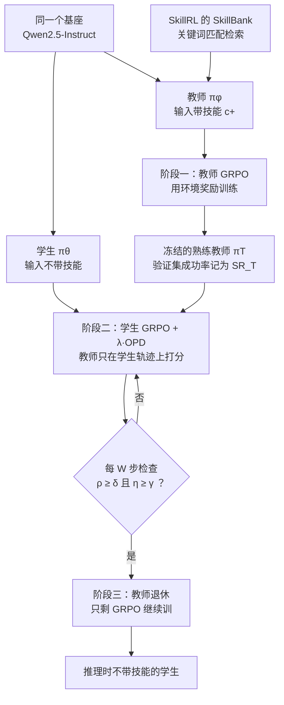

# RetireOPD：教师先练会用技能，学生学够了就让它退休

<!-- release-date: 2026-09-17 -->

> 本文依据浙江大学与阿里巴巴联合署名的 **RetireOPD: Self-Retiring On-Policy Distillation for Agentic Reinforcement Learning**，arXiv:2609.20784v2、2026-09-27 修订，共 23 页。页码均指这份 PDF 自身的页码。文中会区分三件事：**论文明确写了什么**、**我们怎么解释它**、**哪些是外部资料或本文推算**。

## 读前先把几个词说成人话

这篇论文的所有设计都围绕一个朴素的问题：训练时给了模型一份「小抄」，怎么让它把小抄背进参数里，考试时不带小抄也能做对。

先把反复出现的词说清楚：

- **多轮 agent（multi-turn agent）**：模型看环境反馈、做一个动作、再看反馈，来回几十步才完成任务。比如在文本版的虚拟厨房里「找到生菜、洗干净、放到台面上」。
- **RLVR（Reinforcement Learning with Verifiable Rewards，可验证奖励的强化学习）**：用任务成败这种能自动判定的信号当奖励。多轮 agent 的毛病是整条轨迹只有一个分数，中间几十步哪步对、哪步错，没人告诉它（PDF p. 2）。
- **GRPO（Group Relative Policy Optimization，组相对策略优化）**：同一个任务采样一组轨迹，用组内均值和标准差把回报标准化成优势，比平均好的轨迹加分、差的减分，不需要价值网络。
- **OPD（On-Policy Distillation，在线策略蒸馏）**：学生自己生成轨迹，教师在学生走过的每个位置上给出自己的概率，学生向它靠拢。监督落到每个 Token 上，而且落在学生自己会遇到的状态上（PDF p. 2、p. 5）。
- **特权信息（privileged information）**：只在训练时可见、推理时拿不到的上下文。本文里是从技能库检索出的「任务技能」，比如「放置之前先清洗」（PDF p. 2、p. 18）。
- **OPSD（On-Policy Self-Distillation，在线策略自蒸馏）**：没有更强的外部教师时，让同一个模型带上特权信息当教师、不带的当学生（PDF p. 3）。
- **教师–学生差距（teacher-student discrepancy）**：同一个 Token 在教师和学生下的对数概率之差，平均起来衡量两者还差多远（PDF p. 5）。

站内另有几篇在线策略蒸馏的解读可对照：MOPD 讲多个领域教师怎么合进一个学生，Counteraction-Aware-OPD 讲恢复与保持两个目标的梯度对抗。RetireOPD 的切面不同：它只有一个同尺寸教师，问的是这个教师靠不靠得住、该陪学生多久。

## 一句话先说清

用特权技能做自蒸馏训练多轮 agent，默认站在两个没被检查过的假设上：带着技能的教师一定比学生强；学生跟着教师学，越久越好。论文在 ALFWorld 上发现两条都不成立（PDF p. 2）。

于是 RetireOPD 做了两件事（PDF p. 3–6）：

1. **先把教师练会用技能**。教师与学生拆成两份独立参数，教师带着技能上下文先用环境奖励跑 GRPO，训完冻结。
2. **学生学够了就让教师退休**。学生用 GRPO 加 OPD 联合训练，每隔一个窗口看两个信号：教师–学生差距是否不再缩小，学生成功率是否达到教师的一定比例。两个同时满足，就把 OPD 整项拿掉，只剩 GRPO 训到结束，此后也不再需要教师前向。

论文的结论（PDF p. 1、p. 3、p. 7）：在 Qwen2.5 1.5B、3B、7B 上，ALFWorld 成功率比 GRPO 高 14.1–18.8 个点，WebShop 准确率高 11.8–19.0 个点，而且每一组设定都超过了它自己的教师。

### 一条阅读路线

如果只有半小时读原文，建议按这个顺序：

1. **p. 2 的 Figure 2**：两个失败模式的实测曲线，全文动机都在这张图上。
2. **p. 5 的式 (6)–(8)**：退休判据只有两个量，$\rho$ 和 $\eta$。
3. **p. 7 的 Table 1**：主结果，注意 Skill-GRPO 那一行就是 RetireOPD 的教师。
4. **p. 8 的 Figure 4、Figure 5**：退与不退、退哪一个的三条训练曲线，以及教师训不训的差别。
5. **p. 9 的 Table 2、Table 3、Figure 7**：两个判据缺一不可吗，阈值敏感吗。
6. **p. 14 附录 A.1**：为什么「差距不再缩小」可以读成「梯度开始打架」。

附录 A.4 的教师复职实验（p. 16）、A.6 的 $\lambda$ 消融（p. 17）、A.7 的两个 Token 级案例（p. 17–18）和 A.9 的全部训练曲线（p. 20–23），第一遍可以只看图。

## 主要矛盾：特权教师既不一定可靠，也不该一直在场

论文开场把现有范式拆成两个隐含问题：学生该向哪个教师学，学多久。现有方法对前者靠假设，对后者靠事先定好的时间表（PDF p. 2）。两个问题都用同一张图回答：

### 失败一：只给特权信息，教师并不会自动变强

左幅是 GRPO 加 OPSD 的设定：教师与学生是同一份参数的两个分支，一个带技能上下文、一个不带（PDF p. 2）。带技能的教师分支并不稳定地强过它监督的学生；前 50 步两条线交错，此后学生分支一直略高（读自 Figure 2 左幅）。

论文的解释是：教师虽然收到了技能，却没被充分训练去把这份信息用进决策；换大模型也不管用，一个未经优化的 7B 模型拿到同样的技能提示，ALFWorld 成功率只有 23.4%（PDF p. 2、p. 7）。

**我们如何解释它。** 技能文本是一段自然语言说明，读到了不等于会照着做；小模型上多塞一段上下文还可能打乱原本的动作格式。Table 1 里 3B 的 Skill-Prompt 在 WebShop 上准确率 0.8%，和不给技能的 Vanilla 一样（PDF p. 7）。「有信息」和「会用信息」之间隔着一次训练。

### 失败二：教师监督的收益有阶段性

中幅三条线：纯 GRPO 起步慢；纯 OPD 起步快，却很早停在较低的天花板；GRPO+OPD 起步快、天花板也更高（PDF p. 2）。

右幅才是关键。纯 OPD 下差距一路快速收敛到接近 0；GRPO+OPD 下差距先缩小、大约在第 45 步最近，然后重新拉大（读自 Figure 2 右幅）。论文的解读是：学生把技能带来的行为学进去之后，奖励优化开始偏好超出教师的动作，两个梯度开始冲突；此后继续贴着教师，会把学生按在教师的性能天花板附近（PDF p. 2）。所以教师监督是 **临时脚手架**，问题变成什么时候拆。

### 为什么不能事先定好拆的时间

现有做法都在训练前把过渡定死：退火方法逐步衰减蒸馏权重，两阶段方法在预定步数从蒸馏切到 RL；在线决策也有，但只到单个 prompt 或单个 Token 的粒度，没有一篇把教师整体拿掉（PDF p. 2–3）。论文给的反例是：差距停止下降的时间点，在不同模型和任务之间从第 50 步到第 90 步不等（PDF p. 2）。任何单一时间表，都会在有的设定里撤得太早、有的设定里撤得太晚。

于是矛盾变成：

> 特权自蒸馏要同时回答两个问题。教师得先证明自己会用那份技能，否则它给的稠密信号是噪声；教师的信号对学生有用的时间有限，而这段时间长短因模型和任务而异，只能从训练过程本身读出来。

## 先看全景：三个阶段，一个开关

这张图按 PDF p. 4 的 Figure 3 与 p. 15 的 Algorithm 1 重画，是流程示意，不是原图。

教师与学生从同一个指令微调基座初始化（PDF p. 6、p. 16）。这一点决定了后面「超过自己的教师」有意义：不是大模型教小模型，而是同尺寸、只差一份技能上下文的两个策略。

## 核心设计一：教师要先用环境奖励「练会用技能」

### 旧问题：共享参数的教师分支没被训练过去用技能

SDAR 一类方法里，教师和学生共用一份参数，只是输入不同（PDF p. 2–3）。论文认为这种设定下，教师分支从来没被直接优化过「带着技能该怎么做」，它的信号因此不可靠（PDF p. 2）。

### 新设计：解耦出一个独立教师，先单独做 RL

教师 $\pi_\phi$ 带着技能上下文 $c^+$ 与环境交互，用 GRPO 最大化期望回报（PDF p. 4，式 1）：

$$
\phi^{*} = \arg\max_{\phi}\;
\mathbb{E}_{x\sim\mathcal{D},\;\tau\sim\pi_\phi(\cdot\mid x,\,c^{+})}
\bigl[R(\tau)\bigr]
$$

$x$ 是任务输入，$\tau$ 是整条交互轨迹，$R(\tau)$ 是环境给的标量回报。训完把 $\phi^{*}$ 冻结，记作熟练教师 $\pi_T$，此后它只做一件事：给学生提供稠密监督（PDF p. 4）。

附录 A.5 补了几处细节（PDF p. 16–17）：教师每一步都以任务输入、交互历史和 $c^+$ 为条件；除了多出技能上下文，环境交互与奖励和学生训练相同，超参沿用 Table 4 的 GRPO 一列；训练中定期在验证集上评估、按任务指标挑 checkpoint，这个 checkpoint 的验证成绩同时就是退休判据要用的教师参考成绩 $SR_T$。实验里它就是 Table 1 的 Skill-GRPO 一行，验证时也带技能（PDF p. 6、p. 17）。教师的输入模板是把「[Privileged Skill Information]」和技能文本放在学生 prompt 前面（PDF p. 19，Figure 14）。

### 证据：训过的教师，能把同一个学生多带十几个点

Figure 5 是一张分组柱状图（PDF p. 8），学生都是 Qwen2.5-3B-Instruct、都用 RetireOPD 训练，只换教师。柱顶数字整理成表：

| 教师尺寸 | 只给技能提示的教师 | 用环境奖励训过的教师 | 学生（配提示教师） | 学生（配训过的教师） |
|---|---:|---:|---:|---:|
| 3B | 28.9 | 79.7 | 78.1 | 93.8 |
| 7B | 23.4 | 90.6 | 86.7 | 91.4 |

论文的读法（PDF p. 8）：专门训练让教师本身大幅变强，两种尺寸都是；更重要的是它给学生的监督更有效，3B 教师从 78.1% 带到 93.8%，7B 教师从 86.7% 带到 91.4%。

**我们如何读这张表。** 两点原文没有强调。其一，没训过的教师里 7B 比 3B 还低（23.4 对 28.9），模型变大并不自动提升技能利用。其二，训过的 7B 教师比 3B 教师强 10.9 个点，教出的 3B 学生反而低 2.4 个点（91.4 对 93.8）。教师越强不等于越好教，这和「同尺寸教师更合适」的设计选择是同一个方向，但论文没有就此展开。

### Token 级案例：同一个动作，两个教师给出的概率差了七个数量级

附录 A.7 的 Figure 10 把熟练教师和 OPSD 教师放在同一条学生轨迹上逐 Token 打分（PDF p. 17–18）。任务是找到生菜、洗干净、放到台面上，共 10 步。原图是按教师分数着色的表格，大多数导航与拿取动作两个教师分数相近；差别集中在需要任务知识的决策点。第 8 步学生已经拿着生菜站在水槽前，检索到的技能写着「放置之前先清洗」：熟练教师给关键 Token clean 的对数概率是 −0.826，OPSD 教师是 −16.625（PDF p. 17）。

换成概率，约是 0.44 对 $6\times 10^{-8}$（我们据这两个分数换算）。OPSD 教师几乎认定「这里不该清洗」，正好和技能说明相反。它读到了技能，却不会照着做，这就是失败一在单个 Token 上的样子。

### 可迁移启发

用「同一个模型加特权上下文」当教师之前，先量一下这个教师带着上下文在验证集上到底能做到多少。量出来不如学生，就先对教师本身做一轮 RL。这一步多花一次训练，换来的是后面所有稠密信号的可信度。

## 核心设计二：学生在自己的轨迹上同时吃两份监督

学生不看技能，同时从环境奖励和教师监督学（PDF p. 5，式 5）：

$$
\mathcal{L}_{\text{student}}(\theta) = \mathcal{L}_{\text{GRPO}}(\theta) + \lambda\,\mathcal{L}_{\text{OPD}}(\theta)
$$

$\lambda$ 控制教师监督的分量，实验里沿用 SDAR 取 0.01（PDF p. 6）。

GRPO 部分是标准写法：每个任务采样 $G$ 条轨迹，组内标准化得到轨迹级优势，再用 PPO 式的截断重要性比做策略梯度，外加一项对参考模型的 KL 惩罚，系数 $\alpha_{\mathrm{KL}} = 0.01$（PDF p. 5 式 2、p. 15–16）。这一项给同一条轨迹里的每个 Token 同一个优势，稀疏但「对着任务」。

OPD 部分在学生生成的每个位置，比较学生分布与带技能教师的分布（PDF p. 5，式 3）：

$$
\mathcal{L}_{\text{OPD}}(\theta) = \mathbb{E}_{x,\;y\sim\pi_\theta}\Bigl[\frac{1}{|y|}\sum_{t=1}^{|y|} D_{\mathrm{KL}}\bigl(\pi_\theta(\cdot\mid x, y_{<t})\,\big\|\,\pi_T(\cdot\mid x, c^{+}, y_{<t})\bigr)\Bigr]
$$

两点要注意。第一，教师不自己生成轨迹，只在学生走过的状态上打分（PDF p. 5）。第二，这是 **反向 KL**：期望在学生分布下取，学生被推向教师认为高概率的区域，但不必覆盖教师的全部可能性。这里的 $y$ 是整条多轮交互里全部有效回复 Token 拼成的序列（PDF p. 4）。

精确 KL 要对整个词表求和，太贵。论文改成只看学生实际采样的那个 Token（PDF p. 5，式 4）：

$$
\Delta_t = \log \pi_T(y_t\mid x, c^{+}, y_{<t}) - \log \pi_\theta(y_t\mid x, y_{<t})
$$

因为 $y_t$ 是从学生采样的，$-\Delta_t$ 的期望正是该位置的反向 KL；Algorithm 1 里 OPD 损失就直接写成这些 $\Delta$ 平均后取负（PDF p. 15，第 16 行）。

**我们如何解释它。** $\Delta_t$ 身兼两职：既是训练信号，又是后面退休判据的原料。它本来每一步都要算，监控差距不需要额外的前向。

## 核心设计三：自适应退休——从训练信号里读出教师何时该走

### 两个信号

训练被切成每 $W$ 步一个监控窗口，实验里 $W = 5$（PDF p. 5–6）。

**信号一：对齐进展。** 先把一步里所有轨迹、所有 Token 的 $\Delta$ 平均成 $K_n$，再把一个窗口内的 $K_n$ 平均成 $\bar{K}_m$（PDF p. 5，式 6）：

$$
K_n = \frac{1}{G}\sum_{i=1}^{G}\frac{1}{|y_n^{(i)}|}\sum_{t=1}^{|y_n^{(i)}|}\Delta_t^{(i)},
\qquad
\bar{K}_m = \frac{1}{W}\sum_{n=mW}^{mW+W-1} K_n
$$

然后看相邻两个窗口的相对变化，论文叫 **反弹指标**（rebound indicator）（PDF p. 5，式 7 左）：

$$
\rho_m = \frac{\bar{K}_m - \bar{K}_{m-1}}{\bar{K}_m}
$$

**信号二：相对能力。** 学生在最近两个窗口的平均验证成功率，除以教师的成功率（PDF p. 5，式 7 右）：

$$
\eta_m = \frac{SR_m + SR_{m-1}}{2\,SR_T}
$$

**退休时刻** 是第一个同时满足两个条件的窗口（PDF p. 5，式 8）：

$$
m^{*} = \inf\bigl\{\, m \ge 2 \;:\; \rho_m \ge \delta \;\wedge\; \eta_m \ge \gamma \,\bigr\}
$$

默认 $\gamma = 0.9$、$\delta = 0$（PDF p. 6）。要求两个条件同时成立，是为了防止短暂波动触发过早退休（PDF p. 6）。按 Algorithm 1，每个窗口结束都要在验证集上测一次学生成功率（PDF p. 15，第 23 行）；验证集 ALFWorld 128 条、WebShop 256 条（PDF p. 16，Table 4）。

### 读 $\rho$ 的符号，要先想清楚 $\bar{K}$ 是负的

式 (7) 的符号初看反直觉，值得推一遍。$\Delta_t$ 是教师减学生的对数概率，平均下来近似反向 KL 的相反数，所以 $\bar{K}$ 一般是负的，越接近 0 表示离得越近；Figure 2 右幅与 Figure 4 中幅的纵轴正是负值区间（PDF p. 2、p. 8）。

设差距在缩小，$\bar{K}$ 从 −0.2 变到 −0.1：分子是 +0.1，分母是 −0.1，$\rho = -1$，为负。反过来差距拉大，$\rho$ 为正。所以 $\rho \ge 0$ 就是「差距不再缩小」，和指标的名字「反弹」一致。分母用当前窗口的 $\bar{K}_m$，把变化量换成相对比例，不同模型、不同任务的差距量级不同也能共用一个阈值。这段推演是我们做的，原文只给了公式和名字。

### 为什么差距停滞可以读成「梯度在打架」

附录 A.1 给了一个一阶分析（PDF p. 14）。把回报目标记为 $J(\theta)$，蒸馏差距记为 $D(\theta)$，梯度分别是 $g = \nabla_\theta J$、$h = \nabla_\theta D$。忽略采样噪声并假设 GRPO 截断局部不起作用，联合更新是 $\theta^{+} = \theta + \eta(g - \lambda h)$。这里的 $\eta$ 是学习率，和上面的相对能力 $\eta_m$ 是原文里撞名的两个符号。

一阶展开后，回报的变化是：

$$
J(\theta^{+}) - J(\theta) = \eta\bigl(\|g\|^{2} - \lambda\langle g, h\rangle\bigr) + O(\eta^{2})
$$

$\langle g, h\rangle < 0$ 时 OPD 在帮奖励优化，$\langle g, h\rangle > 0$ 时在拖后腿；若 $\lambda\langle g, h\rangle > \|g\|^2$，联合更新甚至让回报一阶下降（PDF p. 14）。

同一个更新下，差距的变化率是：

$$
\frac{d}{dt}D(\theta) = \langle g, h\rangle - \lambda\|h\|^{2}
$$

第二项恒为非正。所以差距如果不降，要么 $\langle g, h\rangle$ 为正、奖励方向和蒸馏方向在局部相反；要么 $h \approx 0$，OPD 已经给不出多少一阶信号（PDF p. 14）。两种情况都说明该撤了。在冲突时退出，回报的一阶增益比继续联合多出 $\eta\lambda\langle g, h\rangle$（PDF p. 14）。

**我们如何解释它。** 这个推导是局部、一阶、忽略噪声的，只说明「差距停滞」和「梯度冲突」在方向上一致，不证明真实训练里每次停滞都是冲突。论文也因此额外加了能力门槛，避免训练早期的噪声触发退休（PDF p. 14）。

### 为什么两个条件缺一不可

只看 $\rho$ 会怎样，附录 A.9 的曲线给了直观答案：

1.5B ALFWorld 的 $\rho$ 在第 25 步前后和第 40 步前后就已短暂越过 0，真正的退休步却是 75；7B WebShop 更早，第 15 步和第 25 步就越过 0，退休在 85（读自 Figure 16）。早期的差距停顿多半是训练噪声，学生这时还远不如教师，撤掉教师就等于撤掉最有用的阶段；$\eta \ge 0.9$ 这道门槛挡住的正是这种情况。反过来，只看 $\eta$ 会在学生刚追上教师时就撤，而此时差距可能还在缩小，教师还在教东西。

### 可迁移启发

任何「前期靠辅助信号、后期靠主目标」的训练，都可以借这个两信号开关：一个信号看辅助项还在不在起作用（这里是差距还降不降），一个信号看主模型是否已经够用（这里是相对成功率）。两个都满足再撤，比任何固定步数都更省心。差距本来就在算，额外成本只是每个窗口一次验证。

## 实验怎么证明

### 设定

两个环境（PDF p. 6）：

- **ALFWorld**：文本版的具身家务环境，按自然语言指令完成多步任务，考长程规划与状态跟踪。Table 1 分 6 类任务报告：拿取（Pick）、查看（Look）、清洗（Clean）、加热（Heat）、冷却（Cool）、拿两件（Pick2）（PDF p. 7）。
- **WebShop**：模拟网购，搜索、翻页、挑出满足约束的商品，考目标导向的决策与多步信息收集。Table 1 报 Score 与 Acc 两个指标（PDF p. 7）。

模型是 Qwen2.5-1.5B / 3B / 7B-Instruct。基线分四组（PDF p. 6）：

| 组 | 方法 | 说明 |
|---|---|---|
| 提示 | Vanilla、Skill-Prompt | 后者只在推理时给技能 |
| 强化学习 | GRPO、GiGPO、PPO、RLOO、Skill-GRPO | Skill-GRPO 带特权技能做 GRPO，即 RetireOPD 的教师 |
| 蒸馏 | OPD、OPSD | 只有教师监督，没有奖励 |
| 混合 | GRPO+OPD、GRPO+OPSD | 奖励加教师监督，全程不撤 |

所有方法统一：学习率 $1\times10^{-6}$，组大小 8（PPO 除外），训练 batch 16，训练 150 步，$\alpha_{\mathrm{KL}} = 0.01$；蒸馏类方法 $\lambda = 0.01$；PPO 另有 critic 学习率 $1\times10^{-5}$（PDF p. 16，Table 4）。技能从 SkillRL 的 SkillBank 用 SDAR 的关键词匹配检索，两个环境都一样（PDF p. 6）。

### 主结果

下表摘自 Table 1（PDF p. 7），只保留 ALFWorld 平均成功率和 WebShop 准确率；子任务与 WebShop Score 见原文。

| 方法 | 1.5B ALFWorld | 1.5B WebShop | 3B ALFWorld | 3B WebShop | 7B ALFWorld | 7B WebShop |
|---|---:|---:|---:|---:|---:|---:|
| Vanilla | 5.5 | 5.5 | 21.9 | 0.8 | 12.5 | 1.6 |
| Skill-Prompt（带技能验证） | 6.2 | 1.6 | 28.9 | 0.8 | 23.4 | 0.8 |
| GRPO | 72.8 | 56.8 | 75.0 | 63.3 | 81.2 | 72.6 |
| GiGPO | 86.7 | 65.0 | 92.2 | 69.5 | 90.8 | 72.8 |
| PPO | 54.4 | 51.5 | 81.2 | 59.4 | 80.4 | 68.7 |
| RLOO | 69.7 | 52.1 | 72.7 | 68.0 | 75.5 | 65.7 |
| Skill-GRPO（教师，带技能验证） | 81.2 | 67.9 | 79.7 | 64.8 | 90.6 | 78.9 |
| OPD，教师为同尺寸 Skill 模型 | 71.1 | 69.1 | 74.2 | 66.4 | 86.7 | 78.1 |
| OPD，教师为更大一档的模型 | 25.8 | 3.9 | 38.3 | 2.3 | 64.8 | 4.7 |
| OPSD | 14.1 | 10.2 | 28.1 | 3.1 | 32.8 | 2.3 |
| GRPO+OPD | 87.5 | 69.9 | 82.8 | 74.2 | 92.2 | 81.2 |
| GRPO+OPSD | 72.7 | 66.8 | 78.1 | 66.4 | 79.7 | 76.5 |
| RetireOPD | **89.8** | **75.8** | **93.8** | **77.3** | **95.3** | **84.4** |

「更大一档的模型」在 1.5B、3B、7B 三组里分别是 3B、7B、14B（表中方法名的后缀表示教师，PDF p. 7）；原文没有说明这些更大教师是否带技能输入。加粗是每列最好。

论文从表里读出三条（PDF p. 6）：

1. **先训教师是必要的。** 1.5B 上用单独训过的教师（GRPO+OPD）而不是 OPSD 的共享分支，ALFWorld 高 14.8 个点（87.5 对 72.7），WebShop 高 3.1 个点（69.9 对 66.8）。
2. **胜过纯 RL 与纯蒸馏。** 3B ALFWorld 上 RetireOPD 93.8%，GRPO 75.0%，OPD 74.2%；1.5B WebShop 上 75.8%，GRPO 56.8%，OPD 69.1%。
3. **胜过固定组合的混合方法。** 3B 上比 GRPO+OPD 在 ALFWorld 高 11.0 个点、WebShop 高 3.1 个点。

**我们如何读这张表。** 四点原文没有强调：

- **对 GRPO+OPD 的增益才是退休本身的贡献，而且幅度不均。** ALFWorld 上是 +2.3 / +11.0 / +3.1，WebShop 上是 +5.9 / +3.1 / +3.2（1.5B / 3B / 7B，按 Table 1 相减）。论文举的 11.0 正是其中最大的一格。摘要里 14–19 个点的提升，是教师构建、稠密监督与退休三者合起来对纯 GRPO 的账。
- **GiGPO 是很强的对手。** 它不用任何特权信息，ALFWorld 上 3B 只比 RetireOPD 低 1.6 个点（92.2 对 93.8），1.5B 低 3.1 个点；WebShop 上 RetireOPD 领先更明显（PDF p. 7）。
- **纯 OPD 在 ALFWorld 上被教师封顶。** 同尺寸 Skill 教师的纯 OPD 三个尺度分别到 71.1 / 74.2 / 86.7，都低于教师的 81.2 / 79.7 / 90.6；WebShop 上则和教师差不多（PDF p. 7）。只模仿，学生最多追到教师附近。
- **更大但没训过的教师几乎是灾难。** 3B 教 1.5B 在 WebShop 上 3.9%，14B 教 7B 在 WebShop 上 4.7%（PDF p. 7）。这和失败一是同一句话：尺寸替代不了「会用特权信息」。

### 退与不退，退哪一个

Figure 4 在 3B ALFWorld 上对比三种训法（PDF p. 7–8）：RetireOPD（退休后只剩 GRPO）、全程 GRPO+OPD、以及 RetireGRPO——同样的触发时刻，但反过来拿掉 GRPO、只留 OPD。

三幅图各说一件事（PDF p. 7–8）：

- **成功率**：GRPO+OPD 约第 60 步后很快收敛；RetireGRPO 拿掉 GRPO 后反而下滑，因为 OPD 把学生往教师拉；RetireOPD 拿掉 OPD 后继续上升。
- **差距**：GRPO+OPD 持续把学生拉向教师，RetireGRPO 让学生更贴近教师，RetireOPD 则主动离开教师分布。
- **熵**：拿掉 GRPO 后熵升高、训练更不稳；GRPO+OPD 把熵一路压低，探索变少；RetireOPD 的熵保持在中间。

**我们如何解释它。** 这是全文最干净的一组对照：同一个起点、同一时刻，留哪个目标。RetireGRPO 把差距压得最小，成功率却最低，说明到这个阶段「更像教师」和「更会做任务」已经是两件事。中幅里 RetireOPD 在退休后仍画出了差距曲线，并一路拉大到约 −0.37（读自 Figure 4），说明作图时退休后仍另行计算了这个量，而按 Algorithm 1 训练本身已不再需要它。

附录 A.7 的 Figure 11 在单条轨迹上给了这种冲突的样子（PDF p. 18）：一条 4 步的成功轨迹，拿番茄、去冰箱冷却、拿着冷却好的番茄去微波炉、放进微波炉，每步环境回报都是 1。唯一被明显着色的是第 3 步的 microwave，教师不认可这一步，它却带来了任务成功。原文图注说这是「强烈的负向教师监督」，但图上着色较浅，也没给具体分数。

附录 A.4 还做了一个「复职」实验（PDF p. 16，Figure 8）：3B ALFWorld 在第 60 步退休，第 90 步把教师监督加回来。复职之后成功率不再上升，一直保持退休的那条则继续涨到更高。论文据此认为，退休判据抓到的是教师效用的持续变化，不是短暂波动。

### 退休判据的消融

两张表都在 3B ALFWorld 上做（PDF p. 9）：

| 设定（Table 2） | 退休步 | 成功率 |
|---|---:|---:|
| RetireOPD（完整） | 60 | 93.8 |
| 去掉反弹指标 | 50 | 89.0 |
| 去掉相对能力 | 100 | 89.0 |
| 不退休 | – | 82.8 |
| 不用 OPD（纯 GRPO） | 0 | 75.0 |

| 设定（Table 3） | 退休步 | 成功率 |
|---|---:|---:|
| $\delta = 0,\ \gamma = 0.9$（默认） | 60 | 93.8 |
| $\delta = 0.03,\ \gamma = 0.9$ | 65 | 89.1 |
| $\delta = 0.05,\ \gamma = 0.9$ | 75 | 91.4 |
| $\delta = 0,\ \gamma = 0.8$ | 55 | 90.6 |
| $\delta = 0,\ \gamma = 1.0$ | 95 | 91.4 |

论文的读法（PDF p. 8–9）：去掉任一条件都从 93.8% 掉到 89.0%，两者互补；完全不退休只有 82.8%，一开始就不用 OPD 只有 75.0%，说明前期蒸馏与后期独立 RL 都重要。阈值调大会推迟退休，但最终成功率相对稳定。

**我们如何解释它。** 两处原文没有讨论：

- **「去掉相对能力」退在第 100 步，与判据的逻辑对不上。** 按式 (8)，在同一条训练轨迹上，只保留一个条件的变体最迟也应在两个条件都满足的第 60 步触发；Figure 16 里 3B ALFWorld 的 $\rho$ 约在第 55 步就越过 0（读自 PDF p. 21）。100 可能来自另一次运行的不同轨迹，原文没有解释。
- **差距有多少超出噪声，原文给不出答案。** 表中退休步都是 5 的倍数，是窗口 $W = 5$ 的自然结果。89.0–93.8 之间不到 5 个点，而验证集 ALFWorld 只有 128 条（PDF p. 16），表格也没有报多次运行的方差。

### 阈值稳健性

Figure 7 是退休步随阈值变化的阶梯图（PDF p. 9）。按图读出的区间整理：

| 阈值（另一个取默认） | 退休步 |
|---|---:|
| $\delta$ 约 −0.10 至 0.03 | 60 |
| $\delta$ 约 0.03 至 0.04 | 65 |
| $\delta$ 约 0.04 至 0.13 | 75 |
| $\delta$ 约 0.13 以上 | 95 |
| $\gamma$ 约 0.80 至 0.88 | 55 |
| $\gamma$ 约 0.88 至 0.96 | 60 |
| $\gamma$ 约 0.96 至 0.98 | 75 |
| $\gamma$ 约 0.98 以上 | 95 |

分档边界读自 Figure 7，只到约值；与 Table 3 的五个点一致。论文的结论是：$\delta$ 在 −0.10 到 0.04、$\gamma$ 在 0.80 到 0.96 之间，退休步都在 ±5 步之内（PDF p. 9）。

**我们如何解释它。** $\delta$ 允许取负，意味着「差距还在缓慢缩小」也可以触发退休。$\delta$ 从 −0.10 到 0.03 都不改变退休步，说明在 3B ALFWorld 上，退休时刻主要是被 $\gamma$ 那道能力门槛卡住的。

### 自适应退休对比线性退火

论文把退休判据换成 Tan 等人 2026 年 ATOD 的线性退火，按预定时间表衰减蒸馏（PDF p. 9）：

论文的读法是：自适应退休的轨迹更稳，一直在涨；线性退火起伏明显，最终成功率也更低（PDF p. 9）。

**我们如何解释它。** 线性退火前期明显更快，说明它前期的蒸馏强度大得多；但论文这一版没有给出退火的具体时间表与权重，所以这组对比到底差在「何时撤」还是「前期撤多少」，从原文分不开。

附录 A.6 的 $\lambda$ 消融给了同一件事的另一面（PDF p. 17，Figure 9）：$\lambda = 0.1$ 前期涨得最快、后期放缓、最终更低；$\lambda = 0.001$ 前期慢、后期追上；默认 0.01 最终最好。论文据此说，教师监督的合适强度本身随训练变化，这正是要有自适应撤除机制的理由。

### 附录里的训练曲线

附录 A.9 给出六组设定的成功率、反弹指标、熵与回报曲线（PDF p. 20–23）。各组退休步（PDF p. 20，Figure 15）：

| 模型 | ALFWorld 退休步 | WebShop 退休步 |
|---|---:|---:|
| 1.5B | 75 | 90 |
| 3B | 60 | 80 |
| 7B | 60 | 85 |

WebShop 普遍比 ALFWorld 退得晚。熵曲线（PDF p. 22，Figure 17）并不统一：3B 与 7B 的 ALFWorld 退休后熵明显回升，7B 一度从约 0.4 升到 0.9 以上；1.5B WebShop 在退休后一段时间也回升；另外三组退休后熵继续下降。去掉「往教师分布拉」的反向 KL 之后探索空间重新打开，和「退休后超过教师」的叙事方向一致；但只有一半设定出现回升，论文也没有讨论，这只是读图的观察。

## 限制与没公开的信息

论文没有单独的限制一节，下面是从正文读出、或原文明显没给的部分：

- **只有两个文本环境、三个不超过 7B 的模型、150 步训练**（PDF p. 6、p. 16）。没有代码、数学、GUI 或真实网页环境，也没有更大模型。
- **没有算力账单。** 论文说退休之后不再需要教师前向（PDF p. 3），但没报训练时长或 GPU 开销。教师构建只说超参沿用 GRPO 一列（PDF p. 16），RetireOPD 的总成本是「训练一个 Skill-GRPO 教师」加「学生训练」，GRPO 基线只有后者；比较提升幅度时要记得这一点（这是我们的判断）。另外每 5 步一次的验证评估也是额外开销。
- **表格没有方差。** Figure 9 的阴影注明是多次运行的波动（PDF p. 17），但 Table 1–3 只给单个数字；验证集 ALFWorld 128 条，子任务里频繁出现 100.0 与 0.0（PDF p. 7），单格数字的波动可能很大。
- **表格与曲线的口径没说清。** Figure 4 中 GRPO+OPD 的曲线末端约 0.77、RetireOPD 约 0.91（读自 PDF p. 8），Table 1–2 分别是 82.8 与 93.8；原文没有说明表里取的是末步还是最好 checkpoint。
- **Table 2 里「去掉相对能力」退在第 100 步**，与判据逻辑和 Figure 16 的曲线对不上，原文没有解释（见上）。
- **依赖一个现成的技能库。** 技能来自 SkillRL 的 SkillBank，检索用关键词匹配（PDF p. 6）；技能库质量与检索方式对结果的影响没有消融。
- **理论只是一阶局部分析**，不构成收敛或最优性保证（PDF p. 14）。

## 可迁移启发

1. **特权信息要先被「训会用」，才能当教师。** 同一个模型读到技能不等于会照做；OPSD 教师给正确的 clean 只有约 $6\times10^{-8}$ 的概率。做自蒸馏之前，先测一下带特权上下文的教师本身有多强。
2. **稠密监督是脚手架，不是终点。** 纯 OPD 在 ALFWorld 上被教师封顶，全程保留教师会把学生按在教师附近。想让学生超过教师，就必须在某个时候撤掉教师，让奖励单独说话。
3. **撤的时机从训练信号里读，不从日历上定。** 退休步在 60 到 90 之间变化，任何固定步数都会在某些设定里错过。「辅助项还在起作用吗」加上「主模型够用了吗」这两个信号几乎零额外成本。
4. **读监控量之前，先把符号推一遍。** $\bar{K}$ 是负数，「$\rho$ 为负表示在变好」这类细节搞反了，整套开关就会在最坏的时刻触发。
5. **撤掉的是辅助项，不是主目标。** RetireGRPO 留下 OPD、撤掉奖励，学生更像教师，成功率却下滑。两个目标里该留哪个，要看哪个才是真正的任务。
6. **教师不必最强，同尺寸、会用特权信息就够。** 训过的 7B 教师比 3B 教师强，教出的 3B 学生却没更好。

## 关键词回看

- **特权信息 / 技能上下文 $c^+$**：训练时可见、推理时没有的检索技能。RetireOPD 的目标是把它内化进学生参数。
- **熟练教师 $\pi_T$**：带技能、先用环境奖励做 GRPO、然后冻结的独立教师，即 Table 1 的 Skill-GRPO。
- **GRPO + λ·OPD**：学生的联合目标，$\lambda = 0.01$。
- **反向 KL 与采样近似**：$-\Delta_t$ 的期望是反向 KL，$\Delta_t$ 同时是退休判据的原料。
- **反弹指标 $\rho_m$**：相邻窗口差距的相对变化；因为 $\bar{K}$ 为负，$\rho \ge 0$ 表示差距不再缩小。
- **相对能力 $\eta_m$**：学生最近两个窗口的平均验证成功率除以教师成功率，默认门槛 0.9。
- **自适应退休**：第一个同时满足 $\rho_m \ge \delta$ 与 $\eta_m \ge \gamma$ 的窗口移除 OPD，只剩 GRPO。
- **梯度冲突**：附录 A.1 的一阶分析，差距不降意味着 $\langle g, h\rangle > 0$ 或 OPD 信号已经衰竭。
- **RetireGRPO**：反过来撤掉 GRPO、只留 OPD 的对照，学生更贴近教师、成功率下滑。

## 资料与阅读边界

### 本文依据的版本

- 原件：[arXiv:2609.20784](https://arxiv.org/abs/2609.20784) 的 v2，2026-09-27 修订，23 页。v1 于 2026-09-17 提交；v2 修正了 v1 表格里的几处数字（如 Table 1 中 1.5B「OPD-3B」一行的列错位、Table 2–3 中完整方法的成功率与 $\delta = 0.05$ 的退休步），重画了 Figure 4–6，并新增了教师复职与 $\lambda$ 消融两节附录。
- `release-date` 取 2026-09-17。这是一篇方法论文，没有面向公众的模型产品；官方代码仓库 [ZJU-REAL/SDAR](https://github.com/ZJU-REAL/SDAR) 在 2026-09-17（UTC）加入 RetireOPD 的训练代码，arXiv v1 也在同一天提交，没有找到更早的官方公开。

### 论文明确写了、本文覆盖了的部分

摘要与 Figure 1；第 1 节两个失败模式与 Figure 2；第 2 节相关工作的定位；第 3 节教师构建、联合优化、自适应退休与式 (1)–(8)、Figure 3；第 4 节实验设定、Table 1、Figure 4–7、Table 2–3；第 5 节结论；附录 A.1 一阶分析；A.2 Algorithm 1；A.3 Table 4；A.4 教师复职；A.5 教师构建细节；A.6 $\lambda$ 消融；A.7 两个 Token 级案例；A.8 prompt 模板；A.9 Figure 15–18。

### 外部资料补充（不是 PDF 原文）

- SDAR（Self-Distilled Agentic Reinforcement Learning，arXiv:2605.15155）是同一课题组的前作，RetireOPD 的联合 GRPO-OPD 目标、$\lambda$ 取值与技能检索都沿用它（PDF p. 4、p. 6、p. 11）。
- 仓库 [ZJU-REAL/SDAR](https://github.com/ZJU-REAL/SDAR) 的 master 分支（截至 2026-09-30）已包含 RetireOPD 的训练脚本与退休逻辑（`verl/trainer/ppo/retire_opd.py`），流程是先训 Skill-GRPO 教师、再把教师成绩作为参数传给 RetireOPD 训练。代码里的判据写法与论文式 (7)–(8) 不同：它对差距取负后再比较，分母取上一个窗口而非当前窗口，触发条件写成「相对下降量不超过阈值」。方向上都是「差距不再缩小」，两种写法在数值上是否等价未核实。
- 站内相关解读：MOPD、Counteraction-Aware-OPD、IER-OPD。几篇都用在线策略蒸馏，但设定不同，数字不要混用。

### 原文没有公开、本文也不补的缺口

- 教师构建阶段的实际训练步数与算力；整个流程的墙钟时间与 GPU 开销；
- Table 1–3 的多次运行方差或置信区间；表格取末步还是最好 checkpoint；
- 技能库质量、检索方式对结果的影响；
- 线性退火对照所用的具体时间表与权重；
- Table 2 中「去掉相对能力」为何在第 100 步才退休；
- Figure 11 中教师对 microwave 的具体打分。
