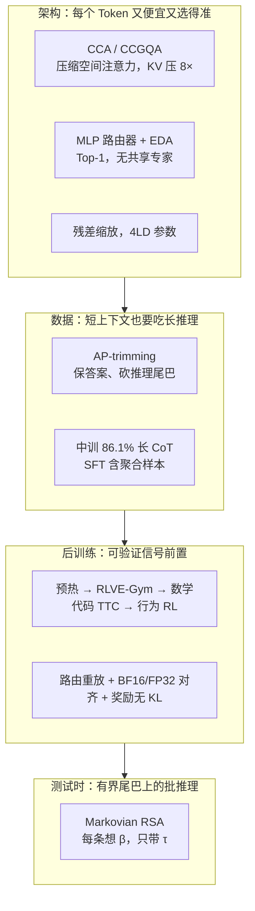

# ZAYA1-8B：激活不到 1B 的推理模型，把力气花在路由、数据和测试时计算上

<!-- release-date: 2026-05-06 -->

> 本文依据本地 `papers/Zyphra/ZAYA1-8B.pdf`，即 Zyphra 的 **ZAYA1-8B Technical Report**，arXiv:2605.05365v1，2026-05-06 提交，共 33 页。页码均指 PDF 自身的页码。文中区分三件事：**报告明确写了什么**、**我们怎么解释或验算它**、**哪些是外部资料**。

## 阅读前先认识几个词

- **Token（词元）**：模型读写文本的最小单位。
- **激活参数（active parameters）**：每个 Token 真正参与计算的那部分参数。总参数可以很大，单次前向有多贵看的是激活参数。
- **MoE（Mixture-of-Experts，混合专家）**：把前馈网络拆成许多「专家」，每个 Token 只走其中几个。ZAYA1-8B 更极端：每层 16 个专家，每个 Token 只走 1 个。
- **KV Cache（键值缓存）**：生成时把前文每个 Token 的 Key、Value 留在显存里，免得每步重算。上下文越长，它越大。
- **CoT（Chain-of-Thought，思维链）**：模型给答案前写下的推理过程。本报告里的教师轨迹常超过 1 万 Token。
- **测试时计算（Test-Time Compute，TTC）**：不改权重，在推理时多花算力，比如多写几条推理再互相对照、综合。
- **可验证强化学习**：奖励来自程序判定（答案对不对、代码过不过测试），而不是人或奖励模型打分。

报告自己起名的几样东西，读到对应章节再展开：**CCA（Compressed Convolutional Attention，压缩卷积注意力）**、**ZAYA1 路由器**、**残差缩放**、**保答案裁剪（answer-preserving trimming，AP-trimming）**、**Markovian RSA（马尔可夫递归自聚合）**。

## 一句话先说清

ZAYA1-8B 是 Zyphra 为推理专门从头训练的 MoE 模型：精确计数 **0.76B 激活 / 8.4B 总参**，对外取整叫 0.7B / 8B（PDF p. 4，Table I）。它是 ZAYA-1 系列的第一个、也是最小的一个（PDF p. 22）。

它要证明的命题很窄：**架构、从预训练就开始的推理数据、可验证 RL 和测试时聚合一起设计时，激活不到 1B 也能在数学和代码推理上追上大得多的推理模型**（PDF p. 1）。报告给出的两组代表数字：

- 最终模型单次作答，AIME'26 89.1、HMMT'26 Feb. 71.6、LiveCodeBench-v6 64.8（PDF p. 16，Table VII）；
- 行为 RL 之前的 checkpoint 加上 Markovian RSA，AIME'25 91.9、HMMT'25 Feb. 89.6，而轮与轮之间只携带 4K Token 的推理尾巴（PDF p. 1、20）。

五件设计各解一个具体矛盾：

1. **注意力**：CCA 把 Q、K、V 压进窄空间后直接在那里做注意力，训练、prefill 和 KV Cache 一起省；
2. **路由**：线性路由器换成「下投影 + 跨层平均 + 三层 MLP」的小网络，把边际参数花在「选对专家」上，于是 Top-1、无共享专家也站得住；
3. **残差**：每个子层前后各一组逐维 $\alpha x + \beta$，几乎零成本地管住残差范数随深度膨胀；
4. **数据**：从预训练第一阶段就混长 CoT，装不下时只砍推理的尾巴、保住答案；
5. **后训练与推理**：四阶段可验证 RL 先把数学和代码抬上去，再用 Markovian RSA 把「一条越写越长的思维链」换成「多条有界长度的尾巴并行聚合」，并且训练时就喂这种格式。

如果只记一句：

> **小激活模型的推理能力，不一定要从「每个 Token 算得更重」里来。可以从路由质量、层深、训练期就喂进去的长推理，以及测试时多花的 Token 里来。**

## 先看全景：一个 Block 改了三处

报告称这三处改动在消融中相对「经典 MoE + MLA 或 GQA + 线性路由器」提升了每参数困惑度，但正文没有印出对照表（PDF p. 3）。其余是解码器 MoE Transformer 的常规结构，报告称之为 Zyphra 的 MoE++ 架构（PDF p. 1、4）。

关键配置（PDF p. 4，Table I；p. 5–6）：

| 配置 | ZAYA1-8B |
|---|---:|
| 激活 / 总参数（精确） | 0.76B / 8.4B |
| 对外取整口径 | 0.7B / 8B |
| 层数 | 40 |
| 隐藏维 $D$ | 2048 |
| Query 头 / KV 头 / 头维度 | 8 / 2 / 128 |
| 注意力 | CCGQA，带 CCA 预处理 |
| Query 压缩 / KV Cache 压缩 | 2× / 相对完整多头注意力 8× |
| 每层专家 / 路由 | 16 / Top-1，无残差专家 |
| 专家 FFN 宽度 | 激活前 4096 / 激活后 2048 |
| 路由器潜空间 $R$ | 256 |
| 位置编码 | 每个头 50% 通道用 RoPE |
| 词表 | Gemma3 分词器，262,272 |
| 主训练硬件 | AMD MI300X + Pollara 网络 |

两处要一开始看清：

- **每个 Token 只走 1 个专家，也没有共享专家。** 当代 MoE 常见 Top-2 到 Top-8 再加共享专家。报告把「敢这么做」归因于路由器更强（PDF p. 5–6），这是核心设计二要讲的事。报告另写了一句：16 个专家、隐藏维扩张系数 2，是「相对细粒度」的专家配置（PDF p. 5）。
- **评测数字来自两个 checkpoint。** 单次作答主表（Table VII、VIII、IX）用最终发布模型，数学题是 AIME'26 / HMMT'26；测试时计算的头条数字（Figure 1、Table XI、XII）用的是「数学 + 代码 + TTC RL 之后、行为 RL 之前」的 checkpoint，数学题是 AIME'25 / HMMT'25（PDF p. 2、15、20）。两组数字不能混着比。

## 第一层矛盾：激活参数小，推理贵在哪三处

难数学和竞赛代码通常被认为需要大模型。拆开看，推理贵在三笔账。

**第一笔是每个 Token 的前向。** 稠密 8B 模型每个 Token 都要跑满 8B 参数；MoE 把它降到 0.76B。代价是路由必须选对：Top-1 没有第二个专家兜底，选错就是整条前馈路径走错。

**第二笔是长推理把注意力拉长。** 教师轨迹常超过 10K Token，长尾超过 30K（PDF p. 6），而预训练从 4K 上下文开始，之后还有 32K 中训和 131K SFT。注意力算力随长度平方增长，KV Cache 随长度线性增长，小模型想大量吃长 CoT，这笔账会先卡住。

**第三笔是测试时计算的服务形态。** 如果测试时计算只会「把一条思维链写得更长」，那就是 batch 为 1、位置一直增长、KV Cache 一直变大的单请求，吞吐先垮（PDF p. 18–19）。

三笔账对应三条技术线：CCA 降注意力与 KV 成本，MLP 路由器把 Top-1 做稳，Markovian RSA 把长推理改成有界的分阶段批推理。数据和 RL 则负责把小模型本来不会的推理装进去。

## 核心设计一：CCA，在压缩空间里做注意力

### 旧问题：只省 KV Cache，不省训练和 prefill

**GQA（Grouped-Query Attention，分组查询注意力）** 让多个 Query 头共用一套 KV 头，**MLA（Multi-head Latent Attention，多头潜在注意力）** 把 KV 压成低维潜向量。两者主要省的是解码时的缓存。本报告的判断是：CCA 相对 GQA 和 MLA，训练更快、prefill 浮点运算更少，同时保持相当的 KV 压缩率（PDF p. 3）；附录 C 补充说，先前工作里 CCA 在困惑度和训练 / 推理 FLOPs 上优于 GQA 与 MLA（PDF p. 30）。CCA 方法本身的对照实验不在这份报告里，见 CCA 一篇。

### 新设计：先压、再用卷积预处理、然后就在窄空间里做注意力

全景图 (b) 就是这一块（依据 PDF p. 4 Fig. 3 右侧与 p. 30 Fig. 12）。按信息流读是四步（PDF p. 30–31）：

1. **低秩下投影**：Q、K、V 先投到更窄的空间。Table I 的 Query 压缩是 2×。
2. **序列混合卷积**：一条短卷积加一条逐头分组卷积，作为注意力之前的轻量「预处理器」。报告的说法是，这些预处理、尤其是卷积，提供了表达力和非线性，使 CCA 能在更少算力和显存下匹配甚至超过完整注意力（PDF p. 31）。**我们的解释**：压缩会丢分辨率，卷积用相邻 Token 把一部分局部结构补回来，注意力就不是在「被压糊的向量」上做点积。
3. **QK 均值跳连与 Key 温度**：Q、K 两路投影的均值加回两路，强制两边表示相似；K 这一路的 RMSNorm 带逐头温度。
4. **Value 时延**：一半 Value 头推迟 1 个 Token。报告只把它列为核心部件，没有解释为什么有用。

然后注意力就在压缩空间里完成，不再升回全维。再叠上分组查询（8 个 Query 头共享 2 个 KV 头），得到相对完整多头注意力 8× 的 KV Cache 压缩；报告把这个组合叫 **CCGQA**（PDF p. 31）。RoPE 只加在每个头一半的通道上（PDF p. 6）。

**我们的验算**：若把「完整多头注意力」理解为 8 个 KV 头，8:2 的分组先省 4 倍，再乘 2× 压缩正好是 8 倍。报告没有逐项分解这个 8×，所以这只是一种与 Table I 对得上的读法。

### 一处稳定性改动：温度从 $\exp(T)$ 改成 $T$

标准 CCA 用 $\exp(T)$ 缩放 Key。指数很容易涨得过大，QK 内积跟着失控。ZAYA1-8B 改成直接乘学到的 $T$，报告说这压住了最大注意力 logit 的不稳定，并类比 MLA 文献里的同类做法（PDF p. 30）。在做过 QK 归一化的前提下，缩放后的内积有上界（PDF p. 31，式 29）：

$$
\frac{T \cdot d_h}{\sqrt{d_h}} = T\sqrt{d_h}
$$

$d_h$ 是头维度，这里是 128。线性参数化下，上界随 $T$ 线性增长而不是指数增长。

### 收益：这份报告提供的是「规模更大、任务更难」的证据

本报告不是 CCA 的方法论文。它新增的证据是：在 8B 总参、长上下文和推理任务上，CCA 仍能支撑推理、上下文学习和长程回忆（PDF p. 3）。更实在的一条在训练侧：32K 中训跑了 1.2T Token、131K SFT 跑了 660B Token，报告说 CCA 带来的 prefill FLOPs 大幅下降「是在我们的算力规模上做成这件事的关键」（PDF p. 6）。上下文扩展时用 all-gather KV 的上下文并行，32K 用 2 个 rank、131K 用 8 个 rank；卷积和 Value 移位引入的边界条件用短的异步点对点交换处理（PDF p. 6）。

### 代价与边界

- 没有注意力消融表，「优于 GQA / MLA」在本报告里是引用先前工作加作者陈述（PDF p. 3、30）；
- 讨论承认，一开始并不确定 CCA 能否撑住长上下文和推理，因为此前没在长上下文上测过；8B 总参相对前沿仍小，更大规模未验证（PDF p. 25）；
- 卷积核宽度、下投影的秩、Value 时延为何有效，报告都没写。

### 可迁移启发

如果训练或 prefill 已经被注意力算力卡住，只把 KV Cache 做小不够，要让二次项发生在更窄的空间里。代价是压缩之后得用卷积、跳连和温度把表达力补回来，并单独处理数值稳定。

## 核心设计二：把边际参数给路由器，而不是给专家

### 旧问题：线性路由器在 Top-1 下太危险

大 MoE 通常用一个线性层给专家打分再取 Top-k。它便宜，但决策面简单，负载不均时要靠偏置、辅助损失或共享专家来补。ZAYA1-8B 选了最苛刻的组合：Top-1、无残差专家（PDF p. 5）。选得含糊的 Top-1，等于这个 Token 整条前馈路径都可能错。

### 新设计：下投影、跨层平均、三层 MLP

全景图 (c) 是路由器的形状。公式按顺序是四步（PDF p. 4–5，式 1–4）。

先把第 $l$ 层残差流 $x_l$（$D = 2048$ 维）投到 $R = 256$ 维：

$$
r_l = W_{\mathrm{down}}\, x_l
$$

再做 **EDA（Exponential Depth Averaging，指数深度平均）**，用学到的系数 $\gamma$ 混入上一层的路由表示：

$$
r_l = r_l + \gamma\, r_{l-1}
$$

然后 RMSNorm、三层带 GeLU 的 MLP、softmax，得到每个专家的分数：

$$
s_l = \mathrm{softmax}\big(\mathrm{MLP}(\mathrm{RMSNorm}(r_l))\big)
$$

最后加上负载均衡偏置 $b_l$ 取 Top-k。本模型 $k = 1$，就是对每个 Token 取 $\arg\max_e (s_{l,e} + b_{l,e})$。

**我们的解释**：EDA 让路由在深度方向上有记忆。上一层已经判断过「这类 Token 该去哪类专家」，这一层用 $\gamma$ 决定继承多少，而不是 40 层各自从零抖动。

### 负载均衡：把「离均匀有多远」交给 AdamW

偏置的更新借了经典控制里 PID 控制器的思路，但实现是把误差当梯度送进 AdamW（PDF p. 5，式 5）：

$$
\nabla b_{l,e} = p_{l,e} - \frac{1}{E}
$$

$p_{l,e}$ 是当前 batch 里专家 $e$ 实际分到的 Token 比例，$E$ 是专家数。用得多的专家被压，用得少的被抬；均衡在全局 batch 的专家选择上做。报告说这比 DeepSeek 的经典实现收敛更快、更稳（PDF p. 5）。

图引自 PDF p. 5 Figure 4，图注里的几个数值是读图估计。纵轴是 $H(p)/\ln E$，1 表示 16 个专家分到的 Token 完全均匀。它是全文唯一一张「路由器更好」的直接证据。要注意三点：这是 1.8B 实验模型，不是正式模型；图上文字只描述均衡收敛，不是能力对比；「均衡更快收敛」到「正式训练中均衡失败更少、换数据阶段时恢复更快」这一步是作者的训练经验（PDF p. 5）。

### 为什么「给路由器加参数」更值

报告的关键陈述是：**参数匹配的消融里，边际参数投给路由器比投给专家或注意力更值**；因为 MLP 跑在 256 维而不是 2048 维上，增加的参数和 FLOPs 都很小（PDF p. 5）。人话版：路由器是总闸门，给闸门加一点容量，所有专家都可能被用得更对。

它还解释了 Top-1 为什么成立。ZAYA1 路由器给出的每 Token 路由概率熵比线性路由器低，选择更「确定」；FLOP 匹配实验里 Top-1 优于更大的 k；k 更大时，额外专家的贡献还要再乘一个较小的路由概率（PDF p. 5–6）。作者据此认为残差专家也不再必要。

附录 D 做了一次「专家有没有塌缩」的体检（PDF p. 31–32，Table XV）。取每个专家第一层 FFN 投影的前 128 个奇异方向，算同层专家两两子空间重叠，随机基线是 $128/2048 = 0.0625$：

| 模型 | MoE 层 / 每层专家 | 输入侧重叠 | 相对随机 | 输出侧相对随机 |
|---|---|---:|---:|---:|
| ZAYA1-8B | 40 / 16 | 0.0904 | 1.45× | 1.58× |
| LFM2-8B-A1B | 22 / 32 | 0.1328 | 2.12× | 1.88× |
| OLMoE-1B-7B | 16 / 64 | 0.1031 | 1.65× | 1.40× |
| Qwen3-30B-A3B | 48 / 128 | 0.0923 | 1.48× | 1.36× |

ZAYA1-8B 输入侧与 Qwen 接近、低于 LFM2 和 OLMoE，输出侧居中；输入侧重叠随深度从第一四分位的 0.075 升到最后四分位的 0.105（PDF p. 32）。报告明说这只是「没有明显塌缩」的证据，不是「专家更专」的证据。

### 代价与边界

- 三层 MLP 的隐藏宽度、$\gamma$ 的初始化、PID / AdamW 的超参都没写；
- 「路由器更值」的参数匹配消融没有印出数字，是作者陈述；
- Top-1 在 RL 里会把引擎与训练器之间的微小数值差放大成「走了另一个专家」，这是后面路由重放必须存在的原因。

### 可迁移启发

MoE 的第一反应常是「专家再多点、k 再大点」。这份报告的反向建议是：先看路由器有没有足够的非线性做出确定的选择。只要路由决策控制的参数远多于路由器自身，给闸门加容量就比给仓库加容量划算。

## 核心设计三：几乎免费的残差缩放

40 层的残差流一路累加，范数容易随深度膨胀。报告提到的替代做法是 Qwen 的注意力门控，但那需要一个门控矩阵（PDF p. 5）。

ZAYA1-8B 的做法是对残差流和每个子层的输出各做一次逐维仿射（PDF p. 5，式 6）：

$$
\mathrm{Res\text{-}scale}(x) = \alpha x + \beta
$$

$$
x_{l+1} = \mathrm{Res\text{-}scale}_{\mathrm{res}}(x_l) + \mathrm{Res\text{-}scale}_{\mathrm{out}}\big(\mathrm{Layer}(\mathrm{RMSNorm}(x_l))\big)
$$

$\alpha, \beta$ 都是 $D$ 维向量，两套各自学习；初始化 $\alpha = 1$、$\beta = 0$，训练从普通残差出发。新增参数 $4 \times L \times D$，报告说与 LayerNorm 同量级、可忽略（PDF p. 5）。**我们的验算**：$4 \times 40 \times 2048 = 327{,}680$，约为 8.4B 的 0.004%。

报告观察到：它提供了与 Qwen 注意力门控相似的好处，却没有门控矩阵的开销；帮助控制残差范数随深度增长，没有观察到梯度消失（PDF p. 5）。没有单独的消融表。讨论里把它和 40 层的深度放在一起当假说：深度可能让一次前向里能做更多串行计算，残差缩放避免后面的层被范数淹没（PDF p. 25）。

两处小细节：摘要与引言把第二组缩放说成作用于「layer input」（PDF p. 1），正文与式 6 写的是子层输出（PDF p. 5），以正文为准；这里的 $\beta$ 是残差偏置，与后面 Markovian RSA 的思考预算 $\beta$ 不是同一个量。

**可迁移启发**：深网络里先花 $4LD$ 个参数给残差和输出各装一个「音量旋钮」，确认范数问题是否还在，再决定要不要上完整的门控矩阵。

## 核心设计四：从预训练就喂长思维链，装不下就保答案

### 旧问题：推理数据来得太晚，短上下文又装不下

报告援引的证据是：在预训练和中训阶段就引入长 CoT，能带来后训练补不回来的收益（PDF p. 6，Akter 等 2025）。ZAYA1-8B 照此执行：每个预训练与中训阶段都含长 CoT，中训阶段它是数据主体（PDF p. 6）。

矛盾随之而来。教师轨迹常超 10K、长尾超 30K，预训练却只有 4K 上下文。报告列了三条路：整条丢掉（推理信号没了）；从后往前截（常常留下开头、丢了答案，模型在学一段永远到不了结论的推理）；保住答案、截掉一部分推理（PDF p. 6）。

### 新设计：保答案裁剪（AP-trimming）

样本由一段或多段助手回复组成，格式是 `<think>...</think>` 推理块后接最终答案。要放进上下文预算 $C$ 时按四步走（PDF p. 6）：

1. **放得下就原样保留**；
2. **砍最后一轮推理的尾巴**：从紧挨答案处往前截 think 块，保留推理开头与完整答案，截到刚好放下；
3. **多轮对话仍放不下**：删掉更早轮次的 think 块、保留那些轮次的答案，再回到第 2 步；
4. **光答案就超过 $C$**：整条丢弃。

它赌的是：推理开头往往是问题拆解、计划、多条路的探索，尾巴更局部，是把选定路线收成答案。砍尾巴比砍中间更能保住规划信号，而开头、截断处和答案在因果顺序上仍对齐。截断处接答案这段衔接在分布上是人造的，但报告说实践中没看到明显伪影：预训练与中训后的推理通过率仍强，下游也没发现截断专属的失败模式（PDF p. 6–7）。

裁剪是离线、按阶段重做的：4K 预训练、32K 中训、131K SFT 各自把同一批数据重裁到对应长度，越往后保留的推理越完整。多数推理数据在 131K 已能完整放下，所以最狠的裁剪发生在早期预训练（PDF p. 7）。

它和推理期的长度控制不是一类东西。报告对比的先前方法在 RL rollout 或推理时强行插入「结束思考」短语；最接近的训练数据做法只是按答案长度筛选样本。AP-trimming 解决的是互补问题：在比自然轨迹更短的训练上下文里，仍要用上长 CoT（PDF p. 7）。

**可迁移启发**：短上下文要消费长推理数据时，先保住监督信号的终点。它依赖「think 块 + 答案」可解析；若你的数据关键推导恰在尾部，这套裁法会伤到真正有用的部分。

## 预训练、中训与 SFT：四段课程

基座预训练的系统细节在另一篇 AMD 全栈论文里（Anthony 等 2025，arXiv:2511.17127），本篇只给阶段表与数据粗分类（PDF p. 6–7，Table II）：

| 阶段 | 上下文 | RoPE 基频 | Token 预算 | 主要强调 |
|---|---:|---:|---:|---|
| 基座预训练 phase 1 | 4K | 10K | 8T | 广泛网页、代码、数学、多语 |
| 基座预训练 phase 2 | 4K | 10K | 4T | 更多代码、数学、推理、指令数据 |
| 32K 中训 | 32K | 1M | 1.2T | 长 CoT、代码、数学、长上下文 |
| SFT | 131K | 5M | 660B | 聊天模板、推理、代码、指令遵循、TTC 轨迹 |

中训与 SFT 的数据粗分类（PDF p. 7，Table III；百分比是数据卡非零权重归一化后的混合比例）：

| 类别 | 32K 中训 | 131K SFT |
|---|---:|---:|
| 长 CoT 推理轨迹 | 86.1% | 75.0% |
| 网页 / 合成网页 / 多语 | 5.7% | 9.8% |
| 原生长上下文数据 | 0.8% | 6.4% |
| 代码语料 / 代码 SFT | 3.0% | 5.0% |
| 数学 / STEM 语料 | 3.0% | 2.6% |
| 短指令 / few-shot | 1.4% | 1.2% |

这张表说明中训几乎是「一个推理模型在做长上下文续训」，不是普通的「再喂点网页」。报告相信在更长上下文上训大量 Token 会显著改善原生长上下文能力，从而给后训练一个更强的底座（PDF p. 6）。这几段用 Muon 优化器，并做 AdamW RMS matching（PDF p. 6）。

SFT 有两处值得记。其一，131K 窗口用优化过的 best-fit decreasing 装箱尽量塞完整样本，超长样本在装箱前按数据集预处理，而不是在固定边界上机械截断；报告说后者曾让模型在机械截断的结尾上产生幻觉（PDF p. 7）。其二，SFT 引入了 Markovian RSA 用的聚合样本：题目加若干条候选推理尾巴，目标是写出一条更好的综合解答（PDF p. 7–8）。

### 全栈 AMD 是训练事实，不是架构主张

预训练、中训和 SFT 跑在 AMD Instinct MI300X 与 AMD Pensando Pollara 400 网络上，报告把它当作「这套栈撑得住 8B 总参 MoE 推理模型持续预训练、长上下文中训与 SFT」的证据；更大模型与更广的并行方案是未来工作（PDF p. 2）。讨论里交代：这次训练只用了数据并行，加上上下文扩展阶段的上下文并行；其它并行（含跨节点）做过压力测试，但不足以证明能训更大的模型（PDF p. 25）。RL 是否也在这套栈上跑，报告没写。

附录 A 给的是节点规格而不是集群规模（PDF p. 30–31，Table XIV）：计算节点 8× MI300X（机内 Infinity Fabric）、2 TB DDR5、双路 Xeon Platinum 8570、8 张 Pollara 400 网卡（每张 400 Gb/s）加 1 张 Pensando DSC 200 GbE、25.6 TB NVMe；存储节点 256 GB 内存、120 TB RAID0。附录 B 用一次 I/O 估算说明存储预算够用：全局 batch 4096、序列 4096、每 Token 4 字节、页 4096 字节、迭代 2.5 秒，每次迭代读 64 MiB、16,384 页，需要约 $6554\sigma$ IOPS，盈亏平衡迭代时间约 $0.234\sigma$ 秒；即使碎片系数 $\sigma = 8$，2.5 秒的迭代仍在平衡点之上，70K IOPS 的存储够用（PDF p. 30）。

## 核心设计五：四阶段 RL，先把可验证能力抬满，再抛光聊天

后训练是 SFT 之后接四个 RL 阶段。前三个几乎全是可验证推理，聊天风格、指令遵循和偏好放到最后（PDF p. 7–9，Table IV 与 Figure 5）：

| 阶段 | 步数 | 主要数据 | 奖励 |
|---|---:|---|---|
| 1 推理预热 | 232 | 数学、谜题、TTC 轨迹；84,604 行 | 可验证任务奖励 |
| 2 RLVE-Gym 课程 | 400 | 400 个自适应谜题环境 | 环境验证器 / 解题率 |
| 3a 数学 + 代码 + TTC | 384 | 通用混合；18,656 行 | 可验证任务奖励 |
| 3b 数学 + 代码 + TTC | 464 | 偏代码；12,092 行 | 可验证任务奖励 |
| 4 行为 RL | 384 | 聊天 / 奖励模型、简单与困难指令遵循 | 奖励模型打分，IF 阶段由检查器门控 |

报告说这与常见配方有两处不同：推理 RL 前置，行为 RL 之前的大部分 RL 算力都花在可验证的数学、谜题、合成环境和代码上；代码阶段还从竞赛题构造了几类辅助环境（PDF p. 7）。

### 所有阶段共用的算法脊柱

阶段之间只换数据、奖励和少量超参（PDF p. 8–9）：

- **异步 PipelineRL**：生成与训练在不相交的 GPU 池上完全异步。rollout worker 比训练 worker 多 2–5 倍；每 2 次训练迭代原地同步一次权重，稳态下 rollout 策略最多落后 2 次更新。
- **信任域：DPPO Binary-TV**。不用 PPO 的逐 Token 比率裁剪，改为二元全变差掩码：策略散度估计超过阈值 $\delta$ 的 Token 不进梯度。生产用 $\delta = 0.1$，取的是「还不至于让奖励无约束增长」的最大值。
- **奖励里没有 KL 项**，信任域全靠上面的掩码（原因见后文的失败记录）。
- **损失聚合：Dr-GRPO**。先在一条 rollout 内对 Token 损失求和，再对 rollout 做序列均值，避免标准 GRPO 隐式的长度归一化把梯度偏向长回复。
- **优势估计：MaxRL**。每题采样 $G$ 条，奖励 $r_i \in \{0,1\}$，用组内平均奖励 $\bar r$ 而不是标准差归一化（PDF p. 8，式 7）：

$$
\hat A_i = \frac{r_i - \bar r}{\bar r}
$$

报告说这是截断最大似然目标的方差缩减估计，对难题给更强的梯度。行为 RL 例外，改回标准 GRPO 的标准差归一化。

- **难度缩放的长度奖励**（行为 RL 不用）：组内至少两条正确、当前解题率不低于历史最高减一个容差、本条必须正确，三道门都过才生效；再乘上解题率 $p$，于是容易的题多罚长答案、难题少罚（PDF p. 9，式 8–10）。它只加在优势的分子上，分母仍用未修改的任务奖励；系数 $c$ 从预热阶段的小值升到数学 + 代码阶段的 1.0（PDF p. 8）。
- **优化器：动量为零的 Muon**。矩阵参数用 Muon 但动量设为 0，词嵌入与 LM head 用 AdamW。报告把它写成 GLM-5「在权重同步边界重置优化器」的彻底版：每次更新只依赖当前 rollout batch（PDF p. 9、12–13）。报告明说没有做优化器对照实验。
- **共用超参**：每批 128 个 prompt，每题 $G = 16$ 条；单条最长 81,920 Token（预热前半段 65K）；聚合 prompt 最长 20,480 Token，为放下 $C = 4$ 条尾巴；学习率 $2 \times 10^{-6}$ 到 $1 \times 10^{-5}$，行为 RL 最小（PDF p. 9）。

### 阶段一：推理预热

目的是让 SFT 模型先适应又长又可验证的 rollout。84,604 行有意偏难：先验通过率不超过 0.75，多数更低；中位回复约 17.6K Token，p90 接近 30K。数据是谜题 54.4%、竞赛数学 31.2%、Enigmata 谜题 14.4%（PDF p. 9–10，Table V；Figure 5 把第一项写成 54.5%，以表为准）。TTC 题目已按 Markovian RSA 的格式构造，模型在 RL 一开始就见到聚合 prompt（PDF p. 9）。

### 阶段二：RLVE-Gym，把每个环境钉在能力边界

400 个自适应、可验证的谜题生成器作为数据集接进 VeRL。步数不多，但平均每步约是后面阶段的两倍长，因为推理长度约 50K Token（PDF p. 9）。

调度的核心是把难度钉在通过率 0.5 附近。太容易，一组全对，没有对比；太难，一组全错，同样没有梯度。目标通过率 $p_{\mathrm{target}} = 0.5$ 正是 logistic 模型 Fisher 信息最大的点，再以 $\varepsilon$-greedy 在 $0.5 \pm 0.25$ 探索（PDF p. 10）。因为有的环境难度能到 100 以上、有的在 0 也很难解，初始化用 Thompson Sampling 和项目反应理论的 logistic 曲线，为每个环境找到 0.5 通过率的交叉点；在线阶段再按组通过率上调或下调难度，并让采样最少的环境权重最高（PDF p. 10）。

### 阶段三：数学、代码与测试时计算

这是能力建设的主阶段，分两段（PDF p. 10–11，Table VI）：

| 类别 | 3a 通用（18,656 行，384 步） | 3b 偏代码（12,092 行，464 步） |
|---|---:|---:|
| 标准代码 | 20.3% | 31.4% |
| 代码辅助 / 代码 TTC | 33.4% | 26.8% |
| 标准数学 | 33.8% | 22.5% |
| 数学 TTC / RSA / PaCoRe | 12.5% | 19.4% |

三类辅助代码环境从同一道竞赛题种子长出来，种子含题面、输入输出规范、通过的参考实现、能找到的错误实现和测试用例（PDF p. 11）：

1. **CodeI/O 预测**：给代码和输入预测输出，或反过来给输出提出输入；
2. **CodeARC 重建**：给题面、规范和示例测试，合成代码，用留出测试检验；
3. **证伪**：给规范和一份实现，找出让实现出错的输入。

三者都是二元可验证的，所以能与数学、谜题共用同一个 RL 目标。报告的意图是训练执行追踪、逆向推理、从稀疏行为证据合成、对抗式构造测试这些「算法推理原语」，而不只是端到端刷题（PDF p. 11）。

同一个数据流里还混着 Markovian RSA 与 PaCoRe 风格的聚合 prompt：策略只生成一条综合解答，按最终答案或代码拿标准可验证奖励（PDF p. 11）。

这一版没有专门的多轮 Agent RL。SFT 里有一些工具与 SWE 轨迹，但 RL 主要优化可验证推理；报告预期 BFCL-v4 与 $\tau^2$ 会落后于专门做过多轮工具 RL 的模型（PDF p. 11）。

### 阶段四：行为 RL 放在最后

先在 80K 行为 prompt 上跑 1 个 epoch，再各跑 1 个 epoch 的简单指令遵循与更难的 IFBench 风格指令遵循。指令遵循阶段的奖励由二元检查器门控：没过门奖励为零，过了才交给奖励模型打分，这样流畅但违规的回复拿不到正奖励（PDF p. 11）。

### 后训练整体抬了多少

Table IX 用同一 harness 比较 131K SFT checkpoint 和最终模型。它测的是整条 RL 级联的总和，报告明确说没有逐阶段消融（PDF p. 15、17）：

| 基准 | SFT | 最终 | 差值 |
|---|---:|---:|---:|
| AIME'26 | 68.30 | 89.10 | +20.80 |
| HMMT'26 Feb. | 39.20 | 71.60 | +32.40 |
| LiveCodeBench-v6 | 54.80 | 64.84 | +10.04 |
| GPQA-Diamond | 59.30 | 71.00 | +11.70 |
| MMLU-Pro | 70.10 | 74.20 | +4.10 |
| IFEval | 66.60 | 85.58 | +18.98 |
| IFBench | 30.20 | 52.56 | +22.36 |
| EQBench | 57.80 | 72.95 | +15.15 |
| Creative Writing v3 | 46.72 | 62.97 | +16.25 |
| BFCL-v4 | 33.41 | 40.50 | +7.09 |
| $\tau^2$ | 32.88 | 36.30 | +3.42 |

推理 RL 合计 232 + 400 + 384 + 464 = 1,480 步，相对预训练和中训非常短，却在 AIME 类题目上抬了约 20–30 分（PDF p. 23）。作者倾向的解释是：预训练与中训已把推理的潜在能力装进权重，RL 走的是相对初始点 KL 更小的路径，主要改变采样分布，让这些能力在长生成预算下更稳定地出现；他们观察到在没碰到天花板时 pass@k 保持稳定甚至上升，因此不同意「RL 只是耗掉中训 checkpoint 的熵」（PDF p. 23）。他们也明说没做「同样数据只做 SFT」的对照（PDF p. 23）。

## 让 Top-1 MoE 的 RL 训得起来：路由重放、精度与监控

### 路由重放

报告称这是 MoE 在 RL 稳定性上**最重要的一处改动**：训练器不重新计算路由，而是复用 vLLM 在 rollout 时写下的逐 Token、逐层专家编号（PDF p. 11）。

原因是不连续。稠密模型里，引擎和训练器之间一点数值差只带来一点 logit 差；Top-1 MoE 里，同样的差可能把某个 Token 的专家选择翻过去，计算路径整条换掉，梯度就在错误的局部模型上算，长序列上这种错误会累积（PDF p. 24）。实现上，vLLM 在解码时把专家编号写进共享内存，写操作与计算重叠；编号随 token ID、mask 一起打包发给训练器，不另开传输（PDF p. 11–12）。讨论里说：没有重放时不稳定的高学习率，有了重放之后可以用（PDF p. 24）。

### 精度：BF16 主干，两侧对齐的少量 FP32

默认 BF16 权重与激活，只把一小组算子升到 FP32，且训练器与 vLLM 两侧完全相同：融合交叉熵与 LM head 矩阵乘；CCA 的缓存状态、QK-norm、QK 均值、RMSNorm；路由器 softmax 与残差加法（PDF p. 12）。除 LM head 外，这些 FP32 算子是早期训练中为了消除引擎与训练器的 log-prob 不一致逐个加上的；不加时会出现梯度范数尖峰（PDF p. 12）。他们也比较过文献里「一律改用 FP16」的方案，结论是加固过的 BF16 加少量对齐的 FP32 已足够，还保留了 BF16 的动态范围（PDF p. 12）。

图引自 PDF p. 13 Figure 6，三格依次是纯 BF16、BF16 + FP32、再加路由重放（RR）。最终配置在 128 个 prompt、$G = 16$、4K 补全的诊断 batch 上，KL 散度 $1.3 \times 10^{-4}$，Pearson $r > 0.9996$（PDF p. 12–13）。前两格没有给数值，只能看形状。

显存方面，长 rollout 的压力主要来自激活：主机侧激活卸载加梯度检查点，FSDP2 分片大小 4，关掉序列并行（在这个规模和每卡长度下，额外通信不值）；训练器按每 GPU 每 microbatch 131,072 Token 的预算动态装箱，并在 GPU 之间重新平衡，免得最慢的 rank 拖住整步（PDF p. 12）。

### 退化监控：压缩率当金丝雀

奖励和 KL 只描述优化动态，看不到生成内容。生产中的主金丝雀是分块的 LZ77 压缩率：rollout 的 token ID 字节按块喂给带 1024 字节窗口的 zlib，算每块的压缩比 $r_c$；任何一块 $r_c < 0.05$，整条 rollout 的任务奖励置零，即使最后答案碰巧对（PDF p. 13）。这切断了「先重复一大段、结尾蒙对答案」的学习信号。

另一路廉价信号是 Token ID 落在词表最大 10% 区间的比例，当作罕见 Token / 乱码的代理，它常在其它失败指标之前抬头（PDF p. 13–14）。附录 E 把「短暂、可恢复的乱码」和缓存损坏、死循环重复区分开：乱码 Token 与前后文无关，后文大多忽略它，但因为含乱码的轨迹照样得奖，它会被强化。在最差的测试 checkpoint 上有 19.9% 的回复被标出，min-p 采样取阈值 $10^{-5}$ 后降到 0.1%；他们建议训练时做 min-p 重放，把保留 / 丢弃的 Token ID 交给训练器，免得两侧重归一化再不一致（PDF p. 32–33）。

### 一份失败记录：把带符号的 KL 塞进奖励

早期压力测试里，PipelineRL 加上序列级的带符号 log-ratio 惩罚，回复越来越长，奖励却不涨（PDF p. 14）。作者的工作解释是：一条长补全会跨越多个生成器快照，过期前缀上的

$$
l_t = \log \pi_\theta(y_t \mid h_t) - \log \pi_{\mathrm{gen}}(y_t \mid h_t)
$$

在生成分布下期望为负（等于负的 KL）。把 $l_t$ 沿整条序列求和再从奖励里减掉，负的和就变成正的奖励偏移，序列越长偏移越大，而且会随广播的优势传给后面较新的 Token（PDF p. 14，式 17–20）。他们讨论了按块隔离与按陈旧度缩放两种缓解，生产中都没用，而是直接去掉奖励里的 KL，只靠 DPPO Binary-TV（PDF p. 14）。

### 可迁移启发

Top-1 MoE 的 RL 里，路由决策是轨迹的一部分，不是可以重算的实现细节；先对齐专家选择，再谈 logit 对齐。内容金丝雀比只看 KL 更能抓住「奖励对了、文本已经崩了」。异步 RL 里不要把带符号的过期 log-ratio 当 KL 正则用。

## 核心设计六：Markovian RSA，只向前带一段有界的尾巴

### 旧问题：测试时计算要么上下文爆炸，要么不会综合

两条近期工作构成设计空间（PDF p. 15）：

- **RSA（Recursive Self-Aggregation，递归自聚合）** 维护一群候选推理链，每轮抽一个子集给模型看，让它写出更好的新候选。但若轮与轮之间传完整链，聚合 prompt 会按「候选数 × 思维长度」膨胀。
- **Markovian Thinker（马尔可夫思考者）** 让模型按固定大小的块推理，块间只带有界状态，把思考长度与上下文大小解耦。但每条轨迹只看自己的尾巴，不能从别人的对错里综合。

### 新设计：并行出候选，轮与轮之间只传尾巴

记号先定下（PDF p. 17）：$N$ 是每轮种群大小，$C$ 是每条聚合 prompt 抽几条尾巴，$T$ 是聚合轮数，$\beta$ 是每条候选自己的思考预算，$\tau$ 是带进下一轮的尾巴长度。默认 $(N, C, T) = (16, 4, 2)$，$\beta$ 按工作负载设，$\tau$ 通常不超过 $\beta/2$（PDF p. 17）。

关键是**两个旋钮分开了**：$\beta$ 决定每条候选能想多深，$\tau$ 决定下一轮能看见多少。$\tau \ll \beta$ 时，单条可以想得很长，聚合 prompt 仍然短。聚合阶段的 prefill 长度有上界（PDF p. 18，式 23）：

$$
L_{\mathrm{prefill}} \le |q| + C\tau + O(1)
$$

$|q|$ 是原题长度。每条候选的解码长度以 $\beta$ 为上限，与所有轮次累计想了多少无关。于是解码是 batch 为 $N$ 的批生成，没有哪一步要对完整推理历史做注意力（PDF p. 18）。

Table X 把它和常见做法放在一张表里，常见做法都是它的特例（PDF p. 19）：

| 做法 | 解码形态 | 轮间带什么 | 对应特例 |
|---|---|---|---|
| 单条长 CoT | batch 1，位置随总推理增长 | 完整历史 | — |
| 并行采样 N 条 | batch $N$，一轮 | 不聚合 | $T = 0$；另加选择器才是 Best-of-N |
| Delethink 式续写 | batch $N$，分块多轮 | 一条有界尾巴 | $C = 1$ |
| 全链 RSA | batch $N$，多轮聚合 | $C$ 条完整链，最长 $C\beta$ | $\tau = \beta$ |
| Markovian RSA | batch $N$，多轮聚合 | $C$ 条尾巴，最长 $C\tau$ | 一般情形 |

与 PaCoRe 的差别在压缩方式：PaCoRe 抽每条轨迹的最终答案或结论往下传，Markovian RSA 不管有没有写到结论，都传最后 $\tau$ 个 Token。他们还评了一种混合：候选已经写出 think 之后的答案段就传答案，否则退回传部分推理链（PDF p. 18）。

### 训练时就要见过这种 prompt

标准推理数据几乎都是「一题一解」，聚合 prompt 很少见。所以他们离线造 SFT 样本：不少开源推理数据集每题有 $n = 8$ 条教师轨迹（报告点名 OpenMathReasoning、rStar-Coder，以及内部的 Reasoning Gym 与 Enigmata 数据）；抽 $C$ 条、截尾巴、拼成聚合 prompt，再让教师在这个 prompt 下写一条新的综合轨迹当 SFT 目标（PDF p. 18）。它复用已有 rollout 池、不需要验证器，所以对谜题、代码和「think 之后的正文本身就是答案」的任务都适用。

RL 的数学 + 代码阶段混入两类聚合 prompt：由教师轨迹构造的，和由当前 SFT 或上一阶段 RL checkpoint 自己的 rollout 构造的「自聚合」。策略仍只生成一条，按最终答案拿可验证奖励，轮次结构全靠 prompt 构造体现，不需要特殊的多轮 RL 机制。目前只训到第 1 轮自聚合，第 2 轮及以后留作未来工作（PDF p. 18–19）。

关于聚合数据从哪个阶段开始出现，报告前后说法不完全一致：第 IV 节和 Figure 11 图注写的是 SFT 引入聚合样本（PDF p. 7、22），第 VI 节一处写「从中训起」就含 TTC 聚合轨迹（PDF p. 22），讨论又写中训出现的是长 CoT、聚合样本出现在 SFT（PDF p. 25）。本文按多数表述，把聚合样本记为从 SFT 开始。

### 头条数字

头条配置 $(\beta, \tau, T, N, C) = (40\text{K}, 4\text{K}, 2, 16, 4)$，温度 1.0、top-p 1.0，最终回复预算 40K；报告的分数是最后一轮所有候选的平均正确率，不是 Best-of-N；Token 计数只含新解码的 Token，不含原题、聚合 prefill 与拷贝过来的尾巴（PDF p. 15、19–20）。

Figure 1 把单次作答与 Markovian RSA 并排画在大得多的模型旁边，数字与 Table XI 一致（PDF p. 2、20）。标 † 的对比分来自外部材料，不是同一 harness：

| 模型 | 激活 / 总参 | AIME'25 | HMMT'25 Feb. | LCB-v6 |
|---|---|---:|---:|---:|
| ZAYA1-8B 单次作答 | 0.7B / 8B | 88.3 | 82.7 | 65.0 |
| ZAYA1-8B + Markovian RSA 40K/4K | 0.7B / 8B | **91.9** | **89.6** | 69.2 |
| DeepSeek-R1-0528 † | 37B / 671B | 87.5 | 79.4 | 68.7 |
| Qwen3-235B-A22B-Thinking-2507 † | 22B / 235B | 92.3 | 83.9 | 74.1 |
| Gemini-2.5 Pro † | — | 88.0 | 82.5 | 72.5 |
| DeepSeek-V3.2 † | 37B / 671B | 93.1 | 92.5 | — |
| GPT-5-High † | — | 94.6 | 88.3 | — |
| Claude 4.5 Sonnet（只出现在 Figure 1） | — | 87.0 | 79.2 | — |

TTC 相对单次作答的增益在 Figure 1 上标为 +3.6、+6.9、+4.2。LCB-v6 指 2025-02 至 2025-05 的分段；同一 checkpoint 上，PaCoRe 混合压缩把 LCB-v6 做到 71.1，高于 Markovian RSA 的 69.2，报告不把这个差距归因于训练曝光，因为两种聚合模型都见过（PDF p. 20）。对比分里 R1、Qwen、Gemini 取自 Qwen3-235B-A22B-Thinking-2507 的模型卡，DeepSeek-V3.2 与 GPT-5-High 取自 DeepSeek-V3.2 技术报告的对比表（PDF p. 20）。所以更准确的读法是「在 HMMT'25 上超过这份表里的 GPT-5-High 分数，在 AIME'25 上仍低于 DeepSeek-V3.2 与 GPT-5-High」，而不是严格排名。

### 配置扫描：钱该花在 β 还是 τ

Table XII（PDF p. 21）：

| 配置 | $T$ | $N$ | $C$ | $\beta$ | $\tau$ | AIME'25 | HMMT'25 |
|---|---:|---:|---:|---:|---:|---:|---:|
| 马尔可夫基线（不跨候选聚合） | 4 | 16 | 1 | 8K | 4K | 82.1 | 75.0 |
| Markovian RSA | 2 | 16 | 4 | 8K | 4K | 86.5 | 80.8 |
| Markovian RSA | 2 | 16 | 4 | 16K | 4K | 88.8 | 87.1 |
| Markovian RSA | 2 | 16 | 4 | 40K | 4K | **91.9** | **89.6** |
| Markovian RSA | 2 | 16 | 4 | 40K | 8K | 90.8 | 89.2 |

从表里读出三件事：

- **加长 $\beta$ 比加长 $\tau$ 值。** HMMT'25 对单条推理长度特别敏感，$\beta$ 从 8K 到 16K 就加了 6.3 分；$\tau$ 从 4K 加到 8K，两个基准都略降。报告把这当作「在这些配置和基准上，聚合并不受限于保留超过 4K 的尾巴」的经验证据，并明确说不能推广成「尾巴长度永远无所谓」（PDF p. 20）。Figure 9 把同一扫描画成「准确率对每题新生成 Token」，结论相同（PDF p. 21）。
- **跨候选聚合有独立贡献。** $C = 1$ 的基线已有 82.1 / 75.0，说明有界携带本身就能保住大部分长 CoT 能力；同样 $\beta = 8\text{K}$、$\tau = 4\text{K}$ 下改成 $C = 4$，再加 4.4 和 5.8 分（PDF p. 21）。
- **总生成量仍然很大。** 16K/4K 每题约新生成 440K Token，40K/4K 约 740K，都是评测中的实际平均值（PDF p. 20）。上下文封顶的是服务侧形态，不是总花销。

所以部署建议是 16K/4K，40K/4K 留给能力天花板评测。一套更轻的配置（$T = 2$、$N = 8$、$C = 4$、$\beta = 8\text{K}$、$\tau = 4\text{K}$、最终预算 40K）在他们当前的服务环境里，墙钟约为标准 $N = 1$ 长推理基线的 0.4 倍；报告强调这是实现相关的观察，不是与硬件无关的吞吐基准（PDF p. 22）。全链 RSA 的严格对照留作未来工作（PDF p. 22）。

更难的 APEX-shortlist 用来探天花板（PDF p. 21，Table XIII 与 Figure 10）：无 TTC 32.2；轻档（$T = 2, N = 16, \beta = 8\text{K}$）33.3；高档（$T = 8, N = 16, \beta = 16\text{K}$）46.1；极高档（$T = 8, N = 32, \beta = 32\text{K}$）51.8，每题约新生成 5.5M Token。Figure 10 旁边的 DeepSeek-V3.2 48.6、GPT-OSS-120B（high）45.8 来自 MathArena 榜，协议可能不同。

### 同一套 TTC，没训过就用不上

Figure 11 让 ZAYA1-8B 与 Qwen3-4B-Thinking-2507 跑同一套 Markovian RSA（$T = 2$、$\beta = 16\text{K}$、$\tau = 4\text{K}$，TTC 与非 TTC 都用 40K 最终预算），图上标注的通过率如下（PDF p. 22）：

| | AIME'25 无 TTC | AIME'25 有 TTC | HMMT'25 无 TTC | HMMT'25 有 TTC |
|---|---:|---:|---:|---:|
| ZAYA1-8B | 0.81 | 0.89 | 0.69 | 0.87 |
| Qwen3-4B-Thinking-2507 | 0.81 | 0.82 | 0.56 | 0.57 |

两者算法相同，报告因此把差距解释为训练设计的效果：ZAYA1-8B 在训练中见过聚合样本，Qwen 没有为这套工作流训练（PDF p. 22）。讨论里补了一句：他们在其它没为这套工作流训练的模型上也观察到更弱的 TTC 扩展，但那些比较不受控（PDF p. 25）。注意这张图的无 TTC 列（0.81、0.69）与 Table XI 的单次作答（88.3、82.7）不是同一组数字，报告没有解释两者的差别，不要强行对齐。

### 代价与边界

- 头条 TTC 数字不是最终带聊天抛光的 checkpoint；
- 对比大模型的分数多来自外部材料，采样与报告协议可能不同（PDF p. 15、20）；
- 全链 RSA 的严格对照、第 2 轮及以后的自聚合都没做；
- 激活小乘以 Token 多在算力账上可能划算，但不等于端到端延迟更低；0.4 倍墙钟只是他们自己的服务观察。

### 可迁移启发

测试时计算有几个可以分开拧的旋钮：每条想多深（$\beta$），下一轮记住多少（$\tau$），综合几条（$C$ 与 $N$）。很多系统把它们捆在「上下文长度」一个数上。另外，推理期要用的工作流，训练期就要喂；没见过「读几条不完整推理再写一条更好的」的模型，同一套聚合几乎没有增益。

## 不靠 TTC 时，它在哪一档

Table VII 是同量级比较，ZAYA1-8B 用最终模型（PDF p. 16）。采样设置：数学、知识和指令遵循用温度 1.0、top-p 0.95、关闭 top-k；代码、Agent 和风格用温度 0.6、top-p 0.95、top-k 20。数学题报 avg@64，代码、GPQA-Diamond、$\tau^2$ 报 avg@16，其余多为单次；avg@k 是 $k$ 次独立采样的平均正确率，估计的是单次通过率，不是 pass@k（PDF p. 15）。EQBench 与 Creative Writing v3 由 `anthropic/claude-3.7-sonnet` 当裁判（PDF p. 16）。

| 类别 | 基准 | ZAYA1-8B | Qwen3-4B-Thinking-2507 | Qwen3.5-4B | Gemma-4-E4B-it |
|---|---|---:|---:|---:|---:|
| 数学 | AIME'26 | **89.1** | 79.0 | 84.5 | 50.3 |
| | HMMT'26 Feb. | **71.6** | 53.6 | 63.6 | 32.1 |
| | IMO-AnswerBench | **59.3** | 51.6 | 48.7 | 27.3 |
| | APEX-shortlist | **32.2** | 17.1 | 21.35 | 6.1 |
| 代码 | LiveCodeBench-v6 | **64.8** | 54.9 | 55.8 † | 54.2 |
| 知识 | GPQA-Diamond | 71.0 | 66.1 | **76.2** | 57.4 |
| | MMLU-Pro | 74.2 | 74.3 | **79.7** | 70.2 |
| 指令 | IFEval | 85.6 | 86.8 | **89.8** | 88.5 |
| | IFBench | 52.6 | 52.9 | **59.2** | 42.7 |
| 风格 | EQBench | 73.0 | 79.6 | 79.5 | **80.2** |
| | Creative Writing v3 | 63.0 | 58.6 | 72.9 | **83.8** |
| Agent | BFCL-v4 | 40.5 | **49.7** | 45.2 | 31.7 |
| | $\tau^2$ | 36.3 | 52.9 | **82.1** | 37.7 |

Gemma-4 的总参含额外 4B 的 embedding 参数；Qwen3.5-4B 的 LiveCodeBench-v6 取自发布材料（PDF p. 16）。

读表看形状：数学与竞赛代码是真正的强项，四个数学基准和 LiveCodeBench 都领先；知识与指令遵循同档或偏弱；风格与 Agent 明显落后，$\tau^2$ 与 Qwen3.5-4B 差一大截。这与「RL 预算几乎全给了可验证数学和代码」一致。

Table VIII 把对手拉到 26B–119B 总参，全部在 Zyphra 的 harness 上跑（PDF p. 17）：

| 模型 | 激活 / 总参 | AIME'26 | HMMT'26 | LCB-v6 | IFEval | GPQA-D | MMLU-Pro |
|---|---|---:|---:|---:|---:|---:|---:|
| ZAYA1-8B | 0.7B / 8B | 89.1 | 71.6 | 64.8 | 85.6 | 71.0 | 74.2 |
| Arcee-Trinity-Mini | 3B / 26B | 59.6 | 36.9 | 33.3 | 62.0 | 46.8 | 70.6 |
| Nemotron-3-Nano-30B-A3B | 3B / 30B | 90.1 | 75.5 | 64.6 | 92.8 | 75.1 | 78.9 |
| OLMo-3.1-32B-Think | 32B / 32B | 78.9 | 50.6 | 58.3 | 93.2 | 59.6 | 75.8 |
| Qwen3-Next-80B-A3B-Think | 3B / 80B | 90.2 | 79.3 | 67.8 | 88.5 | 76.7 | 82.6 |
| Intellect-3 | 12B / 106B | 86.3 | 72.3 | 66.8 | 81.2 | 74.6 | 82.3 |
| Mistral-Small-4-119B | 6B / 119B | 86.4 | 70.6 | 57.9 | 84.0 | 77.2 | 81.6 |

Nemotron-3-Nano 和 Qwen3-Next-80B-A3B 在数学和代码上仍略高，但它们激活 3B，约是 ZAYA1-8B 的四倍；差距更明显的是知识类（GPQA-D、MMLU-Pro）和 IFEval。报告的总结是：推理密集的数学与代码是强项，知识类对这个激活规模算强但没追上大得多的模型；作者的直觉是算法推理与事实存储的缩放方式不同，小激活模型能做强推演，却没那么多容量记世界知识，由此设想「小激活推理核 + 测试时计算 + 外部检索」的方向（PDF p. 25）。

## 讨论里还值得单独记的三条

**短 RL 为什么够用：难度策展就是算法。** 可验证 RL 的有效信号本就稀疏：SFT 每个目标 Token 都有监督梯度，RL 的对比只集中在轨迹级对错、组内比较和信任域过滤之后的一小部分样本（PDF p. 23）。所以他们把难度策展当成算法本身：预热与数学 + 代码阶段按通过率过滤出「难但没饱和」的题，RLVE-Gym 在线把难度钉在高信息区，大阶段之间再用当前策略重新过滤一遍（先指令模式、更激进采样，再思考模式、较短长度上限），逐步抬高难度下限。接近天花板时验证器质量变得关键：错误标签、不完整的代码测试或偏斜的答案分布会主导剩余梯度。实践中他们能把平台期追溯到三种原因之一：题太易、在当前预算下实质不可解、或验证器与数据伪影让捷径比真推理更容易（PDF p. 24）。

**动量为零的 Muon。** 异步 RL 的相邻 batch 在题目、轨迹、奖励和生成策略快照上都可能不同，把一阶矩跨 batch 平均可能是在混合不同滞后下的梯度（PDF p. 23）。一次非正式的步数匹配诊断里，SGD 让 99.51% 的参数完全不变、99.94% 的更新小于 $10^{-5}$；AdamW 是 92.82% 与 96.40%（PDF p. 24）。报告明确不用它来主张 SGD 或稀疏更新更好，只说明有效更新可以非常集中，优化器状态的设计因此是个实际问题；动量 Muon、AdamW 与 SGD 的对照留作未来工作。

**深度假说。** ZAYA1-8B 有 40 层，相似总参下 Qwen3-4B 是 36 层、OLMoE 是 16 层。作者猜测深度有助于在一次前向里表示更多串行计算，残差缩放与更稳的路由是配套；这是训练经验支持的假说，不是隔离过的因果结论（PDF p. 25）。

## 报告承认的限制，和报告没说的事

### 报告自己承认的

- AMD 栈只在 8B 规模、数据并行加上下文并行下验证过（PDF p. 25）；
- CCA 在更大规模上的行为未测（PDF p. 25）；
- 知识类与 Agent 任务落后，后者被归为数据和训练侧重的差距而非架构限制（PDF p. 25–26）；
- 没有逐阶段 RL 消融、没有「同数据只做 SFT」的对照、没有优化器对照、没有全链 RSA 的严格对照（PDF p. 15、22、23、13）。

### 报告没有公开的

- CCA 相对 MLA / GQA 的对照数字、卷积核宽度、下投影秩、Value 时延的作用；
- 路由器 MLP 的宽度、$\gamma$ 的初始化、偏置更新的超参，「路由器更值」消融的原始数字；
- 残差缩放的单独消融；0.76B 激活参数在注意力、专家、路由器与 embedding 之间怎么分账；
- 预训练数据的具体来源、过滤、去重和污染检查；长 CoT 教师是谁；
- 计算节点数、GPU 总数、墙钟、成本；RL 是否在同一套 AMD 栈上训；
- 行为 RL 奖励模型是什么、指令检查器怎么实现；
- 聚合 prompt 的原文模板；440K / 740K Token 在题目间的分布；0.4 倍墙钟的硬件与并发细节。

## 最值得带回自己项目的七条

### 1. 注意力的二次项发生在多宽的空间里，决定训练成本

GQA 和只压 KV 的方法主要改解码。若 prefill 与训练已是瓶颈，要让点积本身发生在压缩空间里，再用轻量卷积补回局部结构。

### 2. 边际参数先给控制点

路由器是闸门，专家是仓库。Top-1 能成立的前提是闸门足够确定；不确定时先加路由器容量，而不是先加 k。

### 3. 深残差先装便宜的旋钮

$4LD$ 个参数就能给残差和子层输出各装一个逐维旋钮。先确认范数问题还在不在，再决定要不要上门控矩阵。

### 4. 截断训练数据时保住监督信号的终点

AP-trimming 的可迁移部分不是「一定砍尾巴」，而是「截断后开头、截断处和答案仍因果对齐」。答案没了，开头写得再好也是在学未完成的推理。

### 5. 可验证 RL 的难度策展就是算法

通过率太高或太低都没有梯度。把环境钉在 0.5 附近、阶段之间重新过滤、接近天花板时优先查验证器，比单纯加 RL 步数有效。

### 6. Top-1 MoE 的 RL 要记录路由

生成时选的专家是轨迹的一部分。数值差在稠密模型里是噪声，在 Top-1 里是路径切换。路由重放加两侧一致的少量 FP32，是在提信噪比。

### 7. 测试时计算把「想多深」和「记多少」拆开，并且训练时就喂

$\beta$ 买深度，$\tau$ 买跨轮记忆，$C$ 与 $N$ 买综合。部署先用中等 $\beta$，极大 $\beta$ 留给探天花板；没在训练里见过聚合格式的模型，同一套方法可能几乎无效。

## 用一张图重新串起全文

左边三块把每个 Token 的成本压下去；中间把长推理从预训练就喂进去，并解决装不下的问题；后训练用短而密的可验证 RL 改变采样分布；最后用有界尾巴的并行聚合，把剩下的差距换成 Token 而不是激活参数。

## 关键词回看

- **激活 / 总参数**：0.76B / 8.4B 是精确值，0.7B / 8B 与摘要里的 700M / 8B 是发布取整。
- **CCA / CCGQA**：下投影后用卷积、QK 均值跳连、Key 温度和 Value 时延做预处理，在压缩空间里算注意力；再叠分组查询，8 个 Q 头配 2 个 KV 头。
- **ZAYA1 路由器**：256 维下投影 + EDA + 三层 MLP + AdamW 更新的均衡偏置。
- **EDA**：把上一层的路由表示按学到的系数 $\gamma$ 混进本层。
- **残差缩放**：$\alpha x + \beta$ 分别作用于残差流和子层输出。
- **AP-trimming**：截推理尾巴、保留答案，按 4K / 32K / 131K 逐阶段重裁。
- **DPPO Binary-TV**：用二元全变差掩码代替 PPO 裁剪当信任域。
- **MaxRL**：优势用组内平均奖励归一化，对难题梯度更强。
- **路由重放**：训练器沿用 rollout 时的专家选择。
- **Markovian RSA**：$N$ 条候选并行，每条最多想 $\beta$，轮间只带 $C$ 条长 $\tau$ 的尾巴。
- **avg@k**：$k$ 次采样的平均正确率，不是 pass@k。

## 最后的判断

这份报告最值得学的，不是某个单独的新名字，而是它**把「小激活」当成一条设计约束，一路贯穿到数据、RL 和推理服务**。每个 Token 很便宜，于是要保证路由选对；模型记不下太多知识，于是把力气集中在可验证的推理上；单条推理不能太长，于是让测试时的多条推理在有界上下文里互相综合。

证据强度是分层的：

- **有直接数据支撑的**：同量级与更大模型的评测表（Table VII、VIII）、SFT 到最终模型的总体抬升（Table IX）、TTC 头条与配置扫描（Table XI、XII）、$C = 1$ 与 $C = 4$ 的差、Figure 11 的同算法对比、Figure 4 的路由均衡曲线（1.8B 实验模型）、Figure 6 的引擎训练器一致性。
- **只有作者陈述或训练经验的**：三处架构改动提升每参数困惑度、路由器是边际参数的好去处、残差缩放等效于注意力门控、深度有助于串行推理、RL 走 KL 更小的路径、动量为零的 Muon 适合异步 RL。
- **完全没公开的**：数据配方、集群规模与成本、路由器与 CCA 的内部尺寸、聚合 prompt 原文。

还要自己校准几处：TTC 头条来自行为 RL 之前的 checkpoint；对比大模型的分数多是外部材料；知识与 Agent 明显落后。它真正做实的是一个更窄的命题：**在可验证的数学和代码上，激活参数、训练期的推理数据和测试时那截 4K 尾巴可以按同一套工作流一起设计；小的是每个 Token 的体重，不是模型能想多深。**

## 资料与阅读边界

**原始依据**

- 本地 `papers/Zyphra/ZAYA1-8B.pdf`，即 arXiv:2605.05365v1（2026-05-06 提交），33 页。文中所有 `(PDF p. N)` 都出自这一版。arXiv 论文页 [arXiv:2605.05365](https://arxiv.org/abs/2605.05365) 目前只有 v1，与本地一致。

**首发日证据**

- Zyphra 官方博客 [ZAYA1-8B](https://www.zyphra.com/post/zaya1-8b) 的发布稿署 2026-05-06，写明当天在 Zyphra Cloud 提供 serverless 端点，并可从 Hugging Face 取权重；arXiv v1 同日提交。Hugging Face 权重仓库的创建与 README 提交在 5 月 4–5 日，属于发布前的预置，不作首发日。`release-date` 取 **2026-05-06**。

**外部补充（不是报告内容）**

- Hugging Face 模型卡 [Zyphra/ZAYA1-8B](https://huggingface.co/Zyphra/ZAYA1-8B) 写的是 760M 激活 / 8.4B 总参，与 Table I 的精确计数一致；模型卡里的部分评测数字（如 LiveCodeBench-v6、BFCL-v4、$\tau^2$ 以及几个对比模型的分数）与 PDF 不同，本文一律以 PDF 为准。
- 基座预训练与 AMD 栈的细节在 Anthony 等，*Training foundation models on a full-stack AMD platform*，arXiv:2511.17127，本文未展开。
- CCA 方法本身见 CCA 一篇；本文对 CCA 的描述只依据本报告的第 II 节与附录 C。
- 文中 $4 \times 40 \times 2048 = 327{,}680$ 与「8 倍 = 4 倍 × 2 倍」两处算术是本文所做，报告原文没有。
